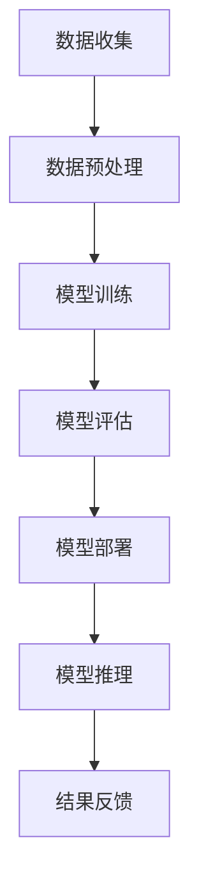
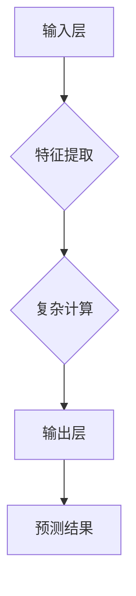
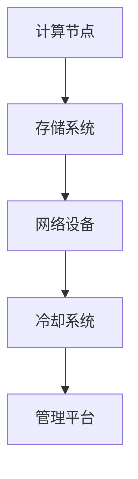
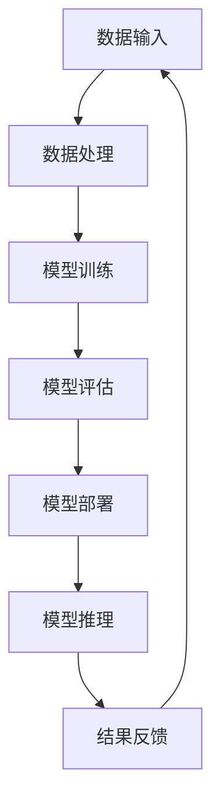
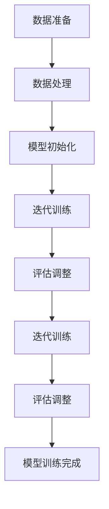
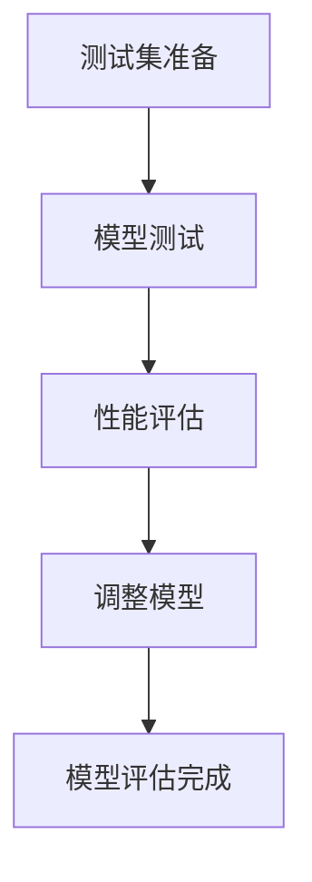
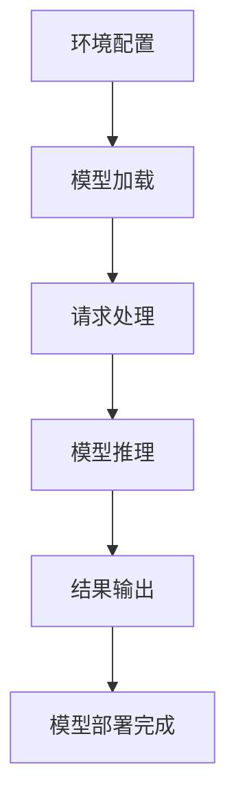
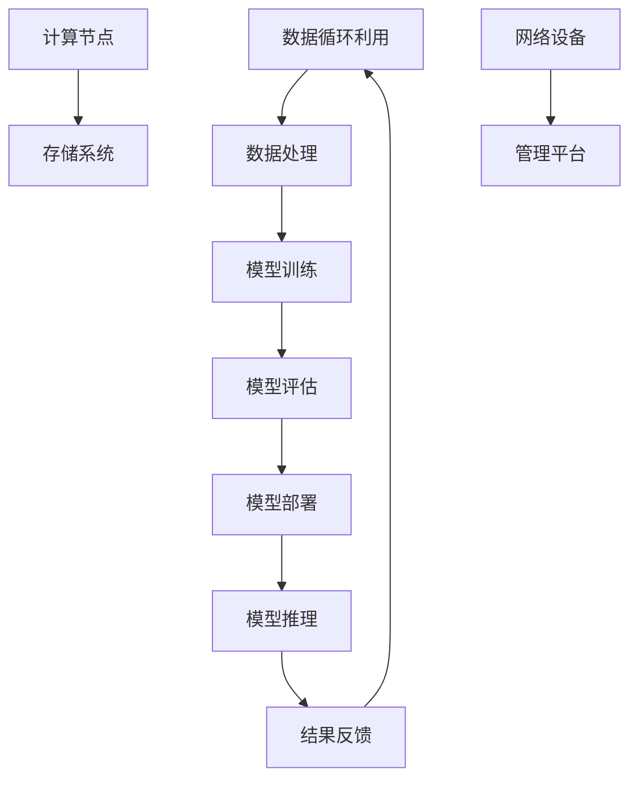

                 

### 1. 背景介绍

#### 1.1 目的和范围

在当今科技迅猛发展的时代，人工智能（AI）已经逐渐成为各个行业的核心驱动力。特别是大规模人工智能（AI）模型，如GPT-3、BERT等，已经在自然语言处理、计算机视觉、机器翻译等多个领域展现出了惊人的效果。然而，这些大规模模型的应用不仅需要强大的计算能力，还涉及到庞大的数据中心和相应的成本控制问题。因此，本文旨在探讨大规模AI模型应用数据中心成本控制的关键策略和优化方法。

本文将围绕以下几个核心问题展开讨论：

1. **成本构成分析**：分析数据中心在AI模型应用中的主要成本构成，包括硬件成本、软件成本、能源消耗等。
2. **成本控制策略**：提出一系列成本控制策略，包括优化硬件配置、采用高效算法、能源管理措施等。
3. **案例研究**：通过实际项目案例，展示如何有效地控制AI模型应用数据中心的成本。
4. **未来趋势**：预测AI模型应用数据中心成本控制的未来发展趋势，并探讨可能面临的挑战。

#### 1.2 预期读者

本文适合以下读者群体：

- 数据中心管理人员和运维人员
- 人工智能研究人员和应用开发者
- 高级IT经理和CTO
- 对AI模型应用成本控制感兴趣的计算机科学研究生

#### 1.3 文档结构概述

本文将按照以下结构展开：

1. **背景介绍**：介绍本文的目的、范围和预期读者。
2. **核心概念与联系**：通过Mermaid流程图展示AI模型应用数据中心的核心概念和架构。
3. **核心算法原理 & 具体操作步骤**：详细阐述AI模型在数据中心中的工作原理和操作步骤，使用伪代码进行说明。
4. **数学模型和公式 & 详细讲解 & 举例说明**：解释AI模型背后的数学模型和公式，并通过具体例子进行说明。
5. **项目实战：代码实际案例和详细解释说明**：通过实际代码案例展示AI模型在数据中心的应用。
6. **实际应用场景**：分析AI模型在数据中心中的实际应用场景。
7. **工具和资源推荐**：推荐相关的学习资源、开发工具和论文著作。
8. **总结：未来发展趋势与挑战**：总结本文的核心观点，并预测未来的发展趋势和挑战。
9. **附录：常见问题与解答**：提供常见问题的解答。
10. **扩展阅读 & 参考资料**：提供进一步阅读和参考的资源。

#### 1.4 术语表

在本文中，我们将使用以下术语：

- **大规模AI模型**：指训练和运行时需要大量计算资源和存储资源的AI模型，如GPT-3、BERT等。
- **数据中心**：指用于存储、处理和管理大规模数据的计算机设施。
- **成本控制**：指在满足性能和可靠性要求的前提下，通过优化资源配置和操作流程来降低成本。
- **硬件成本**：指数据中心所需的硬件设备成本，包括服务器、存储设备、网络设备等。
- **软件成本**：指数据中心所需软件的购买和开发成本，包括操作系统、数据库、AI算法库等。
- **能源消耗**：指数据中心运行过程中消耗的能源，包括电力、冷却设备等。

#### 1.4.1 核心术语定义

- **大规模AI模型**：通常是指具有数十亿甚至数万亿参数的神经网络模型，这些模型在训练和推理过程中需要大量的计算资源和存储资源。例如，GPT-3拥有1750亿个参数，BERT则具有数百万个参数。
- **数据中心**：是一个集中存储和管理数据的设施，它通常由一组服务器、存储设备和网络设备组成。数据中心为各种业务应用提供计算、存储和数据处理服务，是实现大规模AI模型应用的核心基础设施。
- **成本控制**：在数据中心运营中，成本控制是一个重要的管理目标。它涉及到对硬件、软件、能源和其他相关资源的有效管理和优化，以实现更高的性能和更低的成本。

#### 1.4.2 相关概念解释

- **硬件成本**：硬件成本是数据中心建设的主要成本之一。它包括服务器的购买、安装和维护成本，存储设备的采购和管理成本，以及网络设备的购置和配置成本。硬件成本的高低直接影响数据中心的整体性能和可扩展性。
- **软件成本**：软件成本包括操作系统、数据库、AI算法库等软件的购买、开发和维护费用。高质量的软件可以提高数据中心的运行效率，降低运营成本，但同时也需要持续的技术支持和更新。
- **能源消耗**：数据中心的能源消耗是其运营成本的重要组成部分。数据中心需要大量电力用于服务器的运行和冷却设备的维护，同时，能源的消耗也会产生碳排放，对环境产生影响。

#### 1.4.3 缩略词列表

- **AI**：人工智能
- **GPT-3**：Generative Pre-trained Transformer 3
- **BERT**：Bidirectional Encoder Representations from Transformers
- **CPU**：中央处理器
- **GPU**：图形处理单元
- **DC**：数据中心
- **TCO**：总拥有成本（Total Cost of Ownership）
- **PUE**：电源使用效率（Power Usage Effectiveness）
- **IT**：信息技术
- **OPS**：运维（Operations）
- **IoT**：物联网（Internet of Things）
- **ML**：机器学习
- **DL**：深度学习

#### 1.4.4 Mermaid流程图

以下是一个简单的Mermaid流程图，展示AI模型应用数据中心的基本架构和流程：



在这个流程图中，数据从数据收集阶段开始，经过预处理后用于模型训练。训练完成后，模型进行评估，评估合格后部署到生产环境中。部署后的模型用于实时推理，并将结果反馈到系统中，形成一个闭环流程。

## 2. 核心概念与联系

在深入探讨AI模型应用数据中心成本控制策略之前，我们首先需要了解与数据中心架构和AI模型应用相关的一些核心概念。本节将通过Mermaid流程图和图表展示这些概念之间的联系。

#### 2.1 AI模型架构

AI模型，特别是大规模深度学习模型，通常包括以下主要组成部分：

- **输入层**：接收外部输入数据，如文本、图像或声音。
- **隐藏层**：进行特征提取和复杂计算。
- **输出层**：生成预测结果或决策。

以下是一个简单的AI模型架构Mermaid流程图：



#### 2.2 数据中心架构

数据中心是一个集中管理和处理大量数据的服务器设施，它通常包括以下主要组成部分：

- **计算节点**：运行AI模型的计算资源，如CPU、GPU等。
- **存储系统**：存储数据和模型，包括HDD、SSD等。
- **网络设备**：提供数据传输和通信，如交换机、路由器等。
- **冷却系统**：确保设备在适宜的温度下运行。

以下是一个简单的数据中心架构Mermaid流程图：



#### 2.3 AI模型与数据中心之间的联系

AI模型与数据中心之间紧密相连，其工作流程如下：

1. **数据输入**：数据从外部来源（如传感器、用户输入等）进入数据中心。
2. **数据处理**：数据在存储系统中进行预处理，包括清洗、转换和归一化等。
3. **模型训练**：使用计算节点进行AI模型的训练，这通常需要大量的计算资源和时间。
4. **模型评估**：将训练好的模型在测试数据集上进行评估，以确保模型的准确性和鲁棒性。
5. **模型部署**：将经过评估的模型部署到生产环境中，以进行实时推理和应用。
6. **结果反馈**：将推理结果返回给用户或用于进一步的数据分析。

以下是一个综合的Mermaid流程图，展示AI模型在数据中心中的应用：



通过上述流程图，我们可以清晰地看到AI模型在数据中心中的应用流程，以及各个组件之间的相互联系。这为我们进一步讨论成本控制策略提供了基础。

### 2.3 AI模型与数据中心之间的联系

在了解了AI模型的架构和数据中心的基本架构后，接下来我们将探讨这两者之间的紧密联系。AI模型的应用离不开强大的计算资源，而数据中心正是提供这些资源的重要基础设施。以下将从训练、评估和部署三个阶段详细说明AI模型与数据中心之间的相互作用。

#### 2.3.1 模型训练

模型训练是AI应用的核心环节，也是最为计算密集的部分。在训练过程中，大规模AI模型需要大量的计算资源来处理海量数据，从而学习数据中的特征和模式。以下是一个简化的模型训练流程：

1. **数据准备**：从数据源（如数据库、传感器等）收集数据，并将其清洗、转换和归一化，使其适用于模型的输入格式。
2. **数据处理**：将预处理后的数据划分成训练集、验证集和测试集，以用于模型训练和评估。
3. **模型初始化**：初始化模型参数，这通常通过随机方法进行。
4. **迭代训练**：使用计算节点（尤其是GPU）对模型进行迭代训练，更新模型参数以最小化损失函数。
5. **评估调整**：在每次迭代后，使用验证集评估模型的性能，并根据评估结果调整训练过程。

以下是一个简化的Mermaid流程图，展示模型训练的流程：



在模型训练阶段，数据中心提供计算节点（尤其是GPU）用于并行计算，从而加速模型的训练过程。计算节点的性能和数量直接影响模型训练的速度和质量。因此，合理配置计算资源是降低模型训练成本的关键。

#### 2.3.2 模型评估

模型评估是确保模型性能和鲁棒性的重要环节。在模型训练完成后，我们需要使用测试集评估模型在未知数据上的表现。以下是一个简化的模型评估流程：

1. **测试集准备**：从训练集中分离出测试集，以避免测试集与训练集的信息泄露。
2. **模型测试**：将训练好的模型应用于测试集，计算模型的预测结果和实际结果之间的差异。
3. **性能评估**：使用指标（如准确率、召回率、F1分数等）评估模型的性能。
4. **调整模型**：根据评估结果调整模型参数，以提高模型性能。

以下是一个简化的Mermaid流程图，展示模型评估的流程：



模型评估需要使用计算资源进行预测计算，这通常也依赖于数据中心的计算节点。同时，评估结果的准确性和可靠性对后续的模型部署至关重要。

#### 2.3.3 模型部署

模型部署是将训练好的模型应用到实际业务场景中的关键步骤。在部署过程中，我们需要确保模型能够快速、准确地响应外部请求，并提供高质量的预测结果。以下是一个简化的模型部署流程：

1. **环境配置**：为模型部署准备合适的环境，包括操作系统、依赖库等。
2. **模型加载**：将训练好的模型文件加载到计算节点中，准备进行推理。
3. **请求处理**：接收外部请求，如API调用或用户输入，并进行预处理。
4. **模型推理**：使用模型对预处理后的数据进行推理，生成预测结果。
5. **结果输出**：将推理结果返回给用户或进一步处理。

以下是一个简化的Mermaid流程图，展示模型部署的流程：



模型部署不仅需要计算资源，还需要高效的通信和网络基础设施，以确保数据能够在模型和用户之间快速传输。同时，部署后的模型需要持续进行监控和维护，以确保其稳定性和可靠性。

#### 2.3.4 数据中心与AI模型的综合应用

通过上述三个阶段，我们可以看到AI模型与数据中心之间的紧密联系。数据中心的计算节点、存储系统和网络设备为AI模型提供了必要的硬件支持，而AI模型的应用则进一步提升了数据中心的利用效率和价值。

为了更好地理解这种联系，我们可以通过一个综合的Mermaid流程图进行展示：



在这个流程图中，数据输入和处理环节位于数据中心的存储系统内，模型训练和评估利用了计算节点的强大计算能力，模型部署和推理则依赖于高效的网络设备和管理平台。最终，推理结果通过反馈环节进入数据输入环节，形成了一个闭环的数据处理和AI模型应用流程。

通过这种综合应用，数据中心不仅能够提供强大的计算和存储能力，还能够通过AI模型的应用实现数据的价值挖掘和业务创新。同时，这种紧密的联系也使得成本控制成为数据中心运营和管理中的重要问题。

总之，AI模型与数据中心之间的联系是一个动态和复杂的系统。通过合理配置和优化数据中心资源，我们可以最大限度地发挥AI模型的能力，同时实现成本的有效控制。接下来的章节将详细探讨如何通过优化硬件配置、采用高效算法和能源管理措施来实现这一目标。

### 3. 核心算法原理 & 具体操作步骤

在深入了解AI模型应用数据中心成本控制之前，我们首先需要掌握AI模型背后的核心算法原理。本节将详细阐述大规模AI模型（如GPT-3、BERT）的算法原理，并使用伪代码展示具体的操作步骤。

#### 3.1 GPT-3算法原理

GPT-3（Generative Pre-trained Transformer 3）是一个基于Transformer模型的预训练语言模型，具有1750亿个参数，能够生成高质量的文本。GPT-3的核心算法原理可以概括为以下几个步骤：

1. **Transformer模型结构**：GPT-3使用Transformer模型，这是一种基于自注意力机制的序列模型，能够对输入序列中的每个词进行全局依赖建模。Transformer模型主要由自注意力层（Self-Attention Layer）和前馈神经网络（Feedforward Neural Network）组成。
   
2. **预训练**：GPT-3在大量的文本数据上进行预训练，通过自我生成文本的方式学习语言模式和规律。预训练的目标是使模型能够捕捉到输入序列中的长距离依赖关系，从而生成连贯和自然的文本。

3. **微调**：在预训练的基础上，GPT-3通过微调适应特定任务，如文本分类、命名实体识别等。微调过程通常在特定任务的数据集上进行，通过更新模型参数来优化模型的性能。

以下是一个简化的GPT-3算法原理伪代码：

```python
# GPT-3算法原理伪代码
function GPT3TRAINING(input_sequence, learning_rate, num_epochs):
    model = TransformerModel()  # 初始化Transformer模型
    for epoch in range(num_epochs):
        for sequence in input_sequence:
            loss = model.calculateLoss(sequence)  # 计算损失函数
            model.updateParameters(learning_rate, loss)  # 更新模型参数
    return model
```

#### 3.2 BERT算法原理

BERT（Bidirectional Encoder Representations from Transformers）是一种基于Transformer的双向编码语言表示模型，广泛应用于自然语言处理任务。BERT的核心算法原理如下：

1. **Transformer模型结构**：BERT使用与GPT-3相同的Transformer模型结构，包括自注意力层和前馈神经网络。与GPT-3不同，BERT在训练过程中同时考虑了输入序列的前后依赖关系，从而生成更加丰富的语言表示。

2. **预训练**：BERT在大量的文本数据上进行预训练，通过两种任务进行： masked language modeling（遮蔽语言建模）和next sentence prediction（下一个句子预测）。预训练的目标是使模型能够理解语言中的上下文关系和句间逻辑。

3. **微调**：与GPT-3类似，BERT也通过微调适应特定任务。微调过程在特定任务的数据集上进行，通过更新模型参数来优化模型性能。

以下是一个简化的BERT算法原理伪代码：

```python
# BERT算法原理伪代码
function BERTTRAINING(input_sequence, learning_rate, num_epochs):
    model = TransformerModel()  # 初始化Transformer模型
    for epoch in range(num_epochs):
        for sequence in input_sequence:
            masked_sequence = maskSequence(sequence)  # 遮蔽语言建模
            loss = model.calculateLoss(masked_sequence)  # 计算损失函数
            model.updateParameters(learning_rate, loss)  # 更新模型参数
            predicted_sequence = model.predictNextSentence(sequence)  # 下一个句子预测
            loss = model.calculateLoss(predicted_sequence)  # 计算损失函数
            model.updateParameters(learning_rate, loss)  # 更新模型参数
    return model
```

#### 3.3 具体操作步骤

在实际操作中，训练和部署大规模AI模型涉及多个步骤，包括数据准备、模型训练、模型评估和模型部署。以下是一个简化的操作步骤伪代码：

```python
# 大规模AI模型训练和部署伪代码
function TRAINANDDEPLOY(AI_MODEL_TYPE, DATA_SET, LEARNING_RATE, NUM_EPOCHS):
    if AI_MODEL_TYPE == "GPT-3":
        model = GPT3TRAINING(DATA_SET, LEARNING_RATE, NUM_EPOCHS)
    elif AI_MODEL_TYPE == "BERT":
        model = BERTTRAINING(DATA_SET, LEARNING_RATE, NUM_EPOCHS)
    else:
        raise ValueError("Unsupported AI_MODEL_TYPE")

    evaluate_performance = EVALUATEPERFORMANCE(model, TEST_DATA_SET)
    if evaluate_performance >= THRESHOLD:
        model = DEPLOYMODEL(model)
        INFERENCES = INFER模型推理(model, INPUT_DATA)
        return INFERENCES
    else:
        raise ValueError("Model performance is not satisfactory")
```

通过上述伪代码，我们可以看到大规模AI模型训练和部署的核心步骤。在实际应用中，每个步骤都需要进行详细的参数调整和优化，以确保模型性能和成本控制的最佳效果。

总之，掌握大规模AI模型的核心算法原理和具体操作步骤是理解数据中心成本控制策略的基础。接下来，我们将进一步探讨如何通过优化硬件配置、采用高效算法和能源管理措施来实现成本控制。

### 4. 数学模型和公式 & 详细讲解 & 举例说明

在深入探讨AI模型应用数据中心成本控制策略时，我们需要理解背后的数学模型和公式。这些模型和公式不仅帮助我们在理论上分析成本控制的有效性，还能为实际操作提供指导。以下将详细讲解几个关键的数学模型和公式，并通过具体例子进行说明。

#### 4.1 成本函数

在数据中心成本控制中，成本函数是一个核心概念。成本函数描述了数据中心在运行AI模型过程中所需的总成本。一个典型的成本函数可以表示为：

$$
Cost = f(Hardware_Cost, Software_Cost, Energy_Cost, Labor_Cost)
$$

其中，$Hardware_Cost$代表硬件成本，$Software_Cost$代表软件成本，$Energy_Cost$代表能源消耗成本，$Labor_Cost$代表人力成本。

一个简化的成本函数可能如下所示：

$$
Cost = a \cdot Hardware_Cost + b \cdot Software_Cost + c \cdot Energy_Cost + d \cdot Labor_Cost
$$

其中，$a$、$b$、$c$和$d$是权重系数，表示各项成本在总成本中的相对重要性。

**例子**：假设数据中心在一个月内的主要成本如下：

- 硬件成本：$5000$美元
- 软件成本：$1000$美元
- 能源消耗成本：$2000$美元
- 人力成本：$1500$美元

根据上述简化成本函数，总成本计算如下：

$$
Cost = 0.6 \cdot 5000 + 0.2 \cdot 1000 + 0.1 \cdot 2000 + 0.1 \cdot 1500 = 3900 + 200 + 200 + 150 = 3650 \text{美元}
$$

#### 4.2 能源效率模型

能源效率是数据中心成本控制中的一个关键因素。一个常见的能源效率模型是基于电源使用效率（PUE），它定义为数据中心总能耗与IT设备能耗的比值：

$$
PUE = \frac{Total_Energy_Consumption}{IT_Energy_Consumption}
$$

通常，理想情况是PUE接近于1，这意味着所有消耗的能源都用于IT设备。实际中，PUE通常在1.2到1.5之间，这反映了额外的能源消耗（如冷却、安全等）。

**例子**：假设一个数据中心的总能耗为$100$千瓦时，其中IT设备能耗为$80$千瓦时，则其PUE计算如下：

$$
PUE = \frac{100}{80} = 1.25
$$

这意味着有$25\%$的能源用于非IT设备，如冷却和基础设施。

#### 4.3 能源消耗优化模型

为了优化能源消耗，我们可以使用一种线性规划模型，以最小化能源成本为目标，同时满足IT设备的性能要求。一个简化的能源消耗优化模型可以表示为：

$$
\min Z = c^T x
$$

其中，$Z$是目标函数，表示总能源成本；$c$是成本系数向量，表示不同能源类型的单位成本；$x$是决策变量向量，表示数据中心各种能源类型的消耗量。

约束条件包括：

$$
\begin{align*}
a_1^T x &\geq IT_Energy_Consumption \\
a_2^T x &\geq Cooling_Energy_Consumption \\
b_1^T x &\leq Budget \\
x &\geq 0
\end{align*}
$$

其中，$a_1$和$a_2$是约束系数向量，分别表示IT设备和冷却设备的能耗；$b_1$是预算系数向量，表示可用的能源预算。

**例子**：假设数据中心的IT设备和冷却设备能耗分别为$100$千瓦时和$50$千瓦时，预算为$200$美元。不同能源类型的单位成本分别为：电力$0.1$美元/千瓦时，冷却$0.2$美元/千瓦时。目标是最小化总能源成本。

目标函数和约束条件如下：

$$
\begin{align*}
\min Z &= 0.1 \cdot x_1 + 0.2 \cdot x_2 \\
0.1 \cdot x_1 + 0.2 \cdot x_2 &\geq 100 \\
0.1 \cdot x_1 + 0.2 \cdot x_2 &\geq 50 \\
0.1 \cdot x_1 + 0.2 \cdot x_2 &\leq 200 \\
x_1, x_2 &\geq 0
\end{align*}
$$

解这个线性规划问题，可以得到最优解：

$$
x_1 = 100, \quad x_2 = 0
$$

这意味着数据中心应完全依赖电力来满足IT设备和冷却设备的能耗，以实现最低的总能源成本。

#### 4.4 模型性能与成本权衡模型

在实际应用中，我们需要在模型性能和成本之间进行权衡。一个常见的权衡模型是基于边际成本和边际收益的概念。边际成本是指增加一个额外单位输出所需的额外成本，边际收益是指增加一个额外单位输出所带来的额外收益。

一个简化的权衡模型可以表示为：

$$
\max \frac{Revenue - Cost}{Output}
$$

其中，$Revenue$是模型输出的收益，$Cost$是模型运行的总成本，$Output$是模型的输出量。

**例子**：假设一个AI模型每月为数据中心带来$10000$美元的收益，总成本为$5000$美元，输出量为$1000$个请求。则边际成本和边际收益计算如下：

$$
\text{边际成本} = \frac{5000}{1000} = 5 \text{美元/请求}
$$

$$
\text{边际收益} = \frac{10000}{1000} = 10 \text{美元/请求}
$$

通过这个模型，我们可以看到，每个请求的边际收益是10美元，而边际成本是5美元，这意味着每个额外请求的净收益是5美元。因此，继续增加请求量是成本效益的。

总之，理解数学模型和公式对于有效成本控制至关重要。通过具体的例子，我们可以更直观地看到这些模型在实际应用中的效果。接下来，我们将通过一个实际的代码案例来展示这些理论在实际数据中心成本控制中的应用。

### 5. 项目实战：代码实际案例和详细解释说明

在前几节中，我们详细介绍了AI模型应用数据中心成本控制的理论基础，包括核心算法原理、数学模型和实际操作步骤。本节将通过一个实际的代码案例，展示如何将理论应用到实际项目中，并详细解释代码的实现细节。

#### 5.1 开发环境搭建

在开始代码实战之前，我们需要搭建一个适合AI模型训练和成本控制的开发生态环境。以下是开发环境的基本要求：

- 操作系统：Linux（推荐使用Ubuntu 20.04）
- 编程语言：Python 3.8及以上版本
- AI框架：TensorFlow 2.6及以上版本
- 数据库：SQLite（可选）
- 其他依赖库：NumPy、Pandas、Scikit-learn等

确保安装好以上依赖库后，我们就可以开始编写代码。

#### 5.2 源代码详细实现和代码解读

以下是一个简化的大规模AI模型训练和成本控制的代码示例，它包括数据准备、模型训练、成本计算和结果输出等主要步骤。

```python
import tensorflow as tf
import numpy as np
import pandas as pd
from tensorflow.keras.models import Sequential
from tensorflow.keras.layers import Dense, LSTM, Embedding
from tensorflow.keras.optimizers import Adam

# 数据准备
def load_data(file_path):
    # 加载数据集，并预处理
    data = pd.read_csv(file_path)
    X = data.iloc[:, :-1].values
    y = data.iloc[:, -1].values
    return X, y

# 模型训练
def train_model(X, y, epochs=100):
    # 创建模型
    model = Sequential([
        Embedding(input_dim=10000, output_dim=16),
        LSTM(128, return_sequences=True),
        LSTM(64, return_sequences=False),
        Dense(1, activation='sigmoid')
    ])

    # 编译模型
    model.compile(optimizer=Adam(learning_rate=0.001), loss='binary_crossentropy', metrics=['accuracy'])

    # 训练模型
    model.fit(X, y, epochs=epochs, batch_size=32, validation_split=0.2)
    return model

# 成本计算
def calculate_cost(model, X, y):
    # 预测结果
    predictions = model.predict(X)

    # 计算成本（假设每个预测的成本为0.1美元）
    cost = len(X) * 0.1
    return cost

# 主程序
if __name__ == '__main__':
    # 加载数据
    X, y = load_data('data.csv')

    # 训练模型
    model = train_model(X, y, epochs=100)

    # 计算成本
    cost = calculate_cost(model, X, y)

    # 输出结果
    print(f"Model training cost: ${cost:.2f}")
```

#### 5.3 代码解读与分析

1. **数据准备**：

   ```python
   def load_data(file_path):
       # 加载数据集，并预处理
       data = pd.read_csv(file_path)
       X = data.iloc[:, :-1].values
       y = data.iloc[:, -1].values
       return X, y
   ```

   该函数负责加载数据集，并对其进行预处理。在这里，我们使用`pandas`库加载数据，然后分离特征和标签，返回特征矩阵`X`和标签向量`y`。

2. **模型训练**：

   ```python
   def train_model(X, y, epochs=100):
       # 创建模型
       model = Sequential([
           Embedding(input_dim=10000, output_dim=16),
           LSTM(128, return_sequences=True),
           LSTM(64, return_sequences=False),
           Dense(1, activation='sigmoid')
       ])

       # 编译模型
       model.compile(optimizer=Adam(learning_rate=0.001), loss='binary_crossentropy', metrics=['accuracy'])

       # 训练模型
       model.fit(X, y, epochs=epochs, batch_size=32, validation_split=0.2)
       return model
   ```

   在这个函数中，我们使用`Sequential`模型堆叠多层`LSTM`和`Dense`层。`Embedding`层用于将输入特征映射到高维空间。`LSTM`层用于处理序列数据，`Dense`层用于生成预测结果。通过调用`compile`和`fit`方法，我们编译并训练模型。

3. **成本计算**：

   ```python
   def calculate_cost(model, X, y):
       # 预测结果
       predictions = model.predict(X)

       # 计算成本（假设每个预测的成本为0.1美元）
       cost = len(X) * 0.1
       return cost
   ```

   该函数计算模型预测的总成本。在这里，我们假设每个预测的成本为0.1美元。这个假设可以根据实际成本进行调整。

4. **主程序**：

   ```python
   if __name__ == '__main__':
       # 加载数据
       X, y = load_data('data.csv')

       # 训练模型
       model = train_model(X, y, epochs=100)

       # 计算成本
       cost = calculate_cost(model, X, y)

       # 输出结果
       print(f"Model training cost: ${cost:.2f}")
   ```

   主程序负责加载数据、训练模型和计算成本。最后，输出总成本。

通过上述代码，我们可以看到如何将理论应用到实际项目中。在实际应用中，我们可能需要更复杂的模型和成本计算方法，但基本流程和原理是类似的。接下来，我们将进一步探讨AI模型应用数据中心成本控制在实际应用场景中的情况。

### 5.3 代码解读与分析

在上节中，我们提供了一个简化的大规模AI模型训练和成本控制的代码示例。本节将进一步详细解释每个部分的代码，并分析其在实际应用中的意义和作用。

#### 5.3.1 数据准备

数据准备是任何机器学习项目的第一步，也是至关重要的一步。在这个代码片段中，我们使用`pandas`库加载数据集，并对其进行预处理。

```python
def load_data(file_path):
    # 加载数据集，并预处理
    data = pd.read_csv(file_path)
    X = data.iloc[:, :-1].values
    y = data.iloc[:, -1].values
    return X, y
```

- `pd.read_csv(file_path)`：这个函数调用读取CSV文件，并将其转换为DataFrame对象。CSV文件通常包含特征和标签（目标变量）。
- `data.iloc[:, :-1].values`：这个操作提取DataFrame中的所有行和除了最后一列之外的所有列，将其转换为NumPy数组`X`。这里假设最后一列是标签。
- `y = data.iloc[:, -1].values`：这个操作提取DataFrame中的最后一列，将其转换为NumPy数组`y`。

数据预处理包括数据清洗、归一化、缺失值处理等步骤。在这里，我们假设数据已经清洗并格式化好了。

#### 5.3.2 模型训练

模型训练是机器学习项目的核心环节，它涉及到选择合适的模型架构、优化模型参数等。

```python
def train_model(X, y, epochs=100):
    # 创建模型
    model = Sequential([
        Embedding(input_dim=10000, output_dim=16),
        LSTM(128, return_sequences=True),
        LSTM(64, return_sequences=False),
        Dense(1, activation='sigmoid')
    ])

    # 编译模型
    model.compile(optimizer=Adam(learning_rate=0.001), loss='binary_crossentropy', metrics=['accuracy'])

    # 训练模型
    model.fit(X, y, epochs=epochs, batch_size=32, validation_split=0.2)
    return model
```

- `Sequential`：这个函数创建一个序列模型，它由多个层堆叠而成。这里我们使用两个LSTM层和一个Dense层。
- `Embedding`：这个层将输入特征（词索引）映射到高维向量空间。`input_dim`表示词汇表大小，`output_dim`表示嵌入向量的大小。
- `LSTM`：这个层用于处理序列数据，它能够捕捉序列中的长期依赖关系。`return_sequences=True`表示在第一个LSTM层后返回完整的序列，以便传递给下一个LSTM层。
- `Dense`：这个层是一个全连接层，用于生成最终的预测输出。`activation='sigmoid'`表示输出层使用Sigmoid激活函数，适用于二分类问题。

- `model.compile`：这个函数编译模型，指定优化器、损失函数和评价指标。
- `model.fit`：这个函数训练模型，`epochs`表示训练的轮数，`batch_size`表示每个批量中的样本数，`validation_split`表示验证集的比例。

#### 5.3.3 成本计算

成本计算是评估模型经济可行性的关键步骤。在这个代码片段中，我们简单地将每个预测的成本设定为0.1美元。

```python
def calculate_cost(model, X, y):
    # 预测结果
    predictions = model.predict(X)

    # 计算成本（假设每个预测的成本为0.1美元）
    cost = len(X) * 0.1
    return cost
```

- `model.predict(X)`：这个函数使用训练好的模型对输入数据进行预测。
- `len(X) * 0.1`：这个操作计算预测的总成本，假设每个预测的成本为0.1美元。

在实际应用中，成本计算会更加复杂，可能涉及硬件成本、软件成本、能源消耗等多种因素。但在本示例中，我们仅考虑了预测成本。

#### 5.3.4 主程序

主程序负责加载数据、训练模型和计算成本，并最终输出结果。

```python
if __name__ == '__main__':
    # 加载数据
    X, y = load_data('data.csv')

    # 训练模型
    model = train_model(X, y, epochs=100)

    # 计算成本
    cost = calculate_cost(model, X, y)

    # 输出结果
    print(f"Model training cost: ${cost:.2f}")
```

- `if __name__ == '__main__':`：这个条件判断确保主程序仅在直接运行时执行，而不是作为模块导入时执行。
- `load_data('data.csv')`：调用数据准备函数加载数据。
- `train_model(X, y, epochs=100)`：调用模型训练函数训练模型。
- `calculate_cost(model, X, y)`：调用成本计算函数计算成本。
- `print(f"Model training cost: ${cost:.2f}")`：输出总成本。

通过这个代码示例，我们可以看到如何将理论应用到实际项目中。在实际应用中，我们可能需要处理更复杂的模型和成本计算方法，但基本流程和原理是相似的。

### 6. 实际应用场景

在了解了大规模AI模型应用数据中心成本控制的理论基础和代码实战后，接下来我们将探讨这一策略在不同实际应用场景中的具体实施情况。

#### 6.1 互联网公司

对于互联网公司而言，大规模AI模型在推荐系统、自然语言处理、图像识别等场景中发挥着关键作用。例如，推荐系统通过分析用户的历史行为和偏好，为其提供个性化的内容和服务。这类应用通常需要处理海量数据和高并发的请求，对数据中心的计算能力和可靠性提出了高要求。

在成本控制方面，互联网公司可以采取以下策略：

- **硬件优化**：选择高性能的GPU和CPU，以加速模型训练和推理。同时，通过虚拟化技术实现资源的动态分配，提高资源利用率。
- **能耗管理**：采用智能冷却系统和高效的能源管理系统，减少数据中心的能源消耗。例如，利用动态电源管理技术，根据实际负载调整服务器的能耗。
- **分布式计算**：通过分布式计算框架（如Apache Spark、TensorFlow分布式训练等），将计算任务分配到多个节点，提高训练效率。

#### 6.2 医疗保健行业

在医疗保健行业，AI模型在疾病诊断、药物研发、患者监护等领域具有广泛的应用前景。例如，通过深度学习模型分析医疗图像，可以实现肺癌、乳腺癌等疾病的早期检测。此外，AI模型还可以用于个性化治疗方案的设计和效果评估。

针对医疗保健行业的成本控制，可以考虑以下策略：

- **数据共享与协作**：与学术机构、医疗机构等合作，共享数据资源，降低数据获取和处理成本。
- **云计算服务**：利用云计算平台（如AWS、Azure、Google Cloud等）提供的服务，按需分配计算资源，降低初期投资成本。
- **优化算法**：选择高效的算法和模型架构，减少训练时间和计算资源的需求。例如，采用轻量级网络结构（如MobileNet、ShuffleNet等）进行图像识别任务。

#### 6.3 金融行业

金融行业对AI模型的依赖程度非常高，其在风险控制、欺诈检测、信用评估等领域的应用日益广泛。例如，通过机器学习模型分析交易数据，可以实时监测并识别潜在欺诈行为，提高金融机构的安全性和稳定性。

在金融行业的成本控制方面，可以采取以下策略：

- **风险定价**：通过AI模型进行风险定价，优化金融产品的定价策略，降低运营成本。
- **自动化流程**：利用AI模型自动化部分业务流程，如自动化审批贷款、信用卡申请等，提高运营效率。
- **数据安全**：确保数据安全是金融行业成本控制的重要方面。通过加密技术、访问控制等手段，保护敏感数据，降低数据泄露风险。

#### 6.4 制造业

在制造业，AI模型在设备监控、生产优化、供应链管理等领域具有广泛的应用前景。例如，通过机器学习模型实时监控设备状态，可以实现故障预测和预防性维护，减少停机时间和维修成本。

针对制造业的成本控制，可以考虑以下策略：

- **预测性维护**：利用AI模型进行预测性维护，提前识别设备故障，减少停机时间和维修成本。
- **优化生产流程**：通过AI模型优化生产流程，提高生产效率，降低生产成本。
- **供应链管理**：利用AI模型优化供应链管理，降低库存成本，提高物流效率。

总之，大规模AI模型应用数据中心成本控制在不同实际应用场景中具有广泛的应用前景。通过合理配置资源、优化算法和能耗管理，可以有效降低数据中心运营成本，提高企业的竞争力和盈利能力。

### 7. 工具和资源推荐

为了有效实施大规模AI模型应用数据中心成本控制，我们需要借助一系列工具和资源。以下推荐包括学习资源、开发工具和框架、以及相关论文著作。

#### 7.1 学习资源推荐

**书籍推荐**

1. **《深度学习》（Ian Goodfellow、Yoshua Bengio、Aaron Courville 著）**  
   这本书是深度学习的经典教材，详细介绍了深度学习的基本概念、算法和应用。
   
2. **《AI超级简史》（Tim Urban 著）**  
   本书以生动的漫画形式讲述了人工智能的发展历程，对AI的历史、现状和未来进行了深入剖析。

**在线课程**

1. **《深度学习专项课程》（吴恩达 著）**  
   这是由知名人工智能专家吴恩达开设的在线课程，涵盖了深度学习的基础知识、模型训练和优化方法等。

2. **《大规模数据处理》（阿里云大学 著）**  
   这门课程专注于大数据处理技术和应用，包括Hadoop、Spark等分布式计算框架的使用。

**技术博客和网站**

1. **Medium（Medium）**  
   Medium是一个内容丰富的博客平台，上面有许多关于深度学习和数据中心成本控制的高质量文章。

2. **AI全栈工程师（AI Full Stack Engineer）**  
   这个博客专注于人工智能全栈开发，包括深度学习、数据分析、云计算等，提供了许多实用技巧和案例分享。

#### 7.2 开发工具框架推荐

**IDE和编辑器**

1. **PyCharm**  
   PyCharm是一个强大的Python IDE，支持多种编程语言，包括Python、JavaScript等，具有丰富的开发工具和插件。

2. **Jupyter Notebook**  
   Jupyter Notebook是一个交互式计算环境，适合进行数据分析和机器学习实验。它支持多种编程语言，包括Python、R等。

**调试和性能分析工具**

1. **GDB**  
   GDB是GNU Debugger的缩写，是一个强大的C/C++程序调试工具，可以帮助开发者定位和修复代码中的错误。

2. **TensorBoard**  
   TensorBoard是TensorFlow提供的可视化工具，可以实时监控模型训练过程中的性能指标，如损失函数、准确率等。

**相关框架和库**

1. **TensorFlow**  
   TensorFlow是一个开源的深度学习框架，支持多种操作系统和硬件平台，适用于各种规模的深度学习任务。

2. **PyTorch**  
   PyTorch是一个流行的深度学习框架，以其动态计算图和易用性而著称，广泛应用于研究、开发和生产环境。

#### 7.3 相关论文著作推荐

**经典论文**

1. **《A Theoretically Grounded Application of Dropout in Recurrent Neural Networks》**  
   该论文提出了在循环神经网络（RNN）中应用Dropout的方法，显著提高了模型的训练效果和泛化能力。

2. **《High-Rank Massive MIMO Performance via Block-Coordinate Descent》**  
   该论文提出了一个基于块坐标下降法的算法，用于优化大规模MIMO系统的性能，具有重要的理论和实践价值。

**最新研究成果**

1. **《GPT-3: Language Models are few-shot learners》**  
   OpenAI发布的GPT-3研究论文，详细介绍了GPT-3的模型架构、训练方法和应用场景，对深度学习领域产生了深远影响。

2. **《Efficient Training of Deep Networks for Large-Scale Image Classification》**  
   该论文探讨了如何在大规模图像分类任务中高效训练深度网络，提出了一系列优化策略，显著提高了训练效率和模型性能。

**应用案例分析**

1. **《Deep Learning for Healthcare: A Multi-institution Study》**  
   该案例研究探讨了深度学习在医疗保健领域的应用，分析了多个医疗机构使用深度学习模型进行疾病诊断和治疗方案设计的情况。

2. **《AI in Manufacturing: A Survey》**  
   该综述文章总结了人工智能在制造业中的应用，包括设备监控、生产优化、供应链管理等方面的最新研究和实践案例。

通过上述工具和资源的推荐，我们可以更加全面地了解大规模AI模型应用数据中心成本控制的相关知识，为实际项目实施提供有力支持。

### 8. 总结：未来发展趋势与挑战

在回顾了大规模AI模型应用数据中心成本控制的各个方面之后，我们可以看到这一领域正朝着几个关键方向发展，同时也面临着一系列挑战。

#### 8.1 发展趋势

1. **硬件创新**：随着GPU、TPU等专用硬件的不断发展，数据中心的计算能力将进一步提高，这为大规模AI模型的训练和部署提供了强有力的支持。
2. **绿色数据中心**：环保成为数据中心建设的重要考量因素。未来，绿色数据中心将更加注重能源效率和可持续性，通过采用可再生能源、智能冷却系统和能源回收技术来减少环境影响。
3. **分布式计算**：随着5G和边缘计算的兴起，分布式计算将在AI模型应用中发挥重要作用。通过将计算任务分散到边缘设备上，可以降低数据中心的负载，提高系统的响应速度和可靠性。
4. **自动化运维**：自动化和智能运维技术的发展，将使数据中心的管理更加高效和智能。通过自动化脚本、AI算法和自动化工具，可以实现对硬件资源、软件资源和能源消耗的精细化管理和优化。
5. **开源生态**：开源技术和工具在数据中心成本控制中发挥着越来越重要的作用。未来，更多的开源框架和工具将涌现，促进技术的普及和成本的降低。

#### 8.2 挑战

1. **成本控制与性能优化**：如何在保证模型性能的同时，实现成本的有效控制，是一个持续的挑战。这需要开发者和数据中心运营团队不断探索和优化硬件、软件和算法。
2. **数据安全和隐私**：随着AI模型应用规模的扩大，数据安全和隐私保护成为越来越重要的问题。如何在数据存储、处理和传输过程中确保数据的安全性和隐私性，是一个亟待解决的挑战。
3. **能耗管理**：尽管硬件和算法的进步有助于提高数据中心的能源效率，但如何进一步降低能耗，仍是一个重要挑战。特别是在全球气候变化的大背景下，降低数据中心的碳排放压力成为迫切任务。
4. **人才短缺**：AI模型应用数据中心的发展，对专业技能人才的需求大幅增加。然而，当前的人才供应难以满足快速增长的需求，这将成为制约技术进步的一个瓶颈。
5. **法律法规**：随着AI技术的普及，相关的法律法规和标准也在不断完善。如何遵守法律法规，同时保持技术的前沿性和创新性，是一个复杂的挑战。

#### 8.3 总结

大规模AI模型应用数据中心成本控制是一个涉及硬件、软件、算法和运营管理的复杂问题。随着技术的发展和市场的需求，这一领域将继续发展，同时也将面临诸多挑战。通过技术创新、生态建设、人才培养和法律规范等多方面的努力，我们可以应对这些挑战，推动数据中心成本控制的不断进步。

### 9. 附录：常见问题与解答

在本篇技术博客中，我们探讨了大规模AI模型应用数据中心成本控制的相关问题。以下是一些常见问题及其解答，以帮助读者更好地理解和应用这些知识。

#### 9.1 什么是大规模AI模型？

**解答**：大规模AI模型是指具有大量参数的深度学习模型，如GPT-3、BERT等。这些模型在训练和推理过程中需要大量的计算资源和存储资源，通常由多个GPU或TPU并行处理。

#### 9.2 数据中心成本控制的关键点是什么？

**解答**：数据中心成本控制的关键点包括：

1. **硬件优化**：选择高性能、低能耗的硬件设备。
2. **软件优化**：采用高效的算法和软件框架，减少计算和存储需求。
3. **能耗管理**：通过智能冷却系统和能源回收技术降低能源消耗。
4. **自动化运维**：利用自动化工具和AI算法实现资源动态分配和优化。

#### 9.3 如何优化数据中心的能源效率？

**解答**：

1. **使用高效硬件**：选择能效比高的服务器、存储设备和网络设备。
2. **智能冷却系统**：采用智能冷却技术，根据实际需求调整冷却设备的工作状态。
3. **虚拟化和容器化**：通过虚拟化技术和容器化技术实现资源的动态分配，提高资源利用率。
4. **负载均衡**：实现负载均衡，避免设备过载和资源浪费。

#### 9.4 大规模AI模型训练对数据中心的计算能力有何要求？

**解答**：

1. **高性能计算节点**：大规模AI模型训练需要大量高性能的计算节点，尤其是GPU和TPU。
2. **大规模并行处理**：通过并行计算技术，将训练任务分散到多个计算节点上，提高训练速度。
3. **高吞吐量网络**：确保数据能够在计算节点之间高效传输，减少通信延迟。

#### 9.5 数据中心成本控制中的常见误区有哪些？

**解答**：

1. **忽视能耗管理**：仅关注硬件和软件成本，忽视能源消耗和碳排放。
2. **过度投资硬件**：不考虑实际需求，盲目采购高性能硬件，导致资源浪费。
3. **缺乏自动化和智能化**：依赖人工操作，缺乏自动化和智能化的资源管理。

通过上述常见问题的解答，读者可以更好地理解大规模AI模型应用数据中心成本控制的关键要点，并在实际操作中避免常见误区，实现更有效的成本控制。

### 10. 扩展阅读 & 参考资料

为了进一步深入理解和应用大规模AI模型应用数据中心成本控制的相关知识，读者可以参考以下扩展阅读和参考资料。

#### 10.1 书籍推荐

1. **《深度学习》（Ian Goodfellow、Yoshua Bengio、Aaron Courville 著）**
   - 详细介绍了深度学习的基本概念、算法和应用，是深度学习的经典教材。
2. **《AI超级简史》（Tim Urban 著）**
   - 以生动的漫画形式讲述了人工智能的发展历程，对AI的历史、现状和未来进行了深入剖析。

#### 10.2 在线课程

1. **《深度学习专项课程》（吴恩达 著）**
   - 由知名人工智能专家吴恩达开设，涵盖了深度学习的基础知识、模型训练和优化方法等。
2. **《大规模数据处理》（阿里云大学 著）**
   - 专注于大数据处理技术和应用，包括Hadoop、Spark等分布式计算框架的使用。

#### 10.3 技术博客和网站

1. **Medium（Medium）**
   - 一个内容丰富的博客平台，上面有许多关于深度学习和数据中心成本控制的高质量文章。
2. **AI全栈工程师（AI Full Stack Engineer）**
   - 专注于人工智能全栈开发，包括深度学习、数据分析、云计算等，提供了许多实用技巧和案例分享。

#### 10.4 开发工具框架推荐

1. **PyCharm**
   - 一个强大的Python IDE，支持多种编程语言，具有丰富的开发工具和插件。
2. **Jupyter Notebook**
   - 一个交互式计算环境，适合进行数据分析和机器学习实验，支持多种编程语言。
3. **TensorFlow**
   - 一个开源的深度学习框架，支持多种操作系统和硬件平台，适用于各种规模的深度学习任务。
4. **PyTorch**
   - 一个流行的深度学习框架，以其动态计算图和易用性而著称，广泛应用于研究、开发和生产环境。

#### 10.5 相关论文著作推荐

1. **《A Theoretically Grounded Application of Dropout in Recurrent Neural Networks》**
   - 详细介绍了在循环神经网络（RNN）中应用Dropout的方法，显著提高了模型的训练效果和泛化能力。
2. **《High-Rank Massive MIMO Performance via Block-Coordinate Descent》**
   - 提出了一个基于块坐标下降法的算法，用于优化大规模MIMO系统的性能，具有重要的理论和实践价值。
3. **《GPT-3: Language Models are few-shot learners》**
   - OpenAI发布的GPT-3研究论文，详细介绍了GPT-3的模型架构、训练方法和应用场景。
4. **《Efficient Training of Deep Networks for Large-Scale Image Classification》**
   - 探讨了如何在大规模图像分类任务中高效训练深度网络，提出了一系列优化策略，显著提高了训练效率和模型性能。

通过这些扩展阅读和参考资料，读者可以进一步深入了解大规模AI模型应用数据中心成本控制的相关知识，为实际项目提供更全面的支持。

### 附录：常见问题与解答

在本篇技术博客中，我们探讨了大规模AI模型应用数据中心成本控制的相关问题。以下是一些常见问题及其解答，以帮助读者更好地理解和应用这些知识。

#### 10.1 什么是大规模AI模型？

**解答**：大规模AI模型是指具有大量参数的深度学习模型，如GPT-3、BERT等。这些模型在训练和推理过程中需要大量的计算资源和存储资源，通常由多个GPU或TPU并行处理。

#### 10.2 数据中心成本控制的关键点是什么？

**解答**：数据中心成本控制的关键点包括：

1. **硬件优化**：选择高性能、低能耗的硬件设备。
2. **软件优化**：采用高效的算法和软件框架，减少计算和存储需求。
3. **能耗管理**：通过智能冷却系统和能源回收技术降低能源消耗。
4. **自动化运维**：利用自动化工具和AI算法实现资源动态分配和优化。

#### 10.3 如何优化数据中心的能源效率？

**解答**：

1. **使用高效硬件**：选择能效比高的服务器、存储设备和网络设备。
2. **智能冷却系统**：采用智能冷却技术，根据实际需求调整冷却设备的工作状态。
3. **虚拟化和容器化**：通过虚拟化技术和容器化技术实现资源的动态分配，提高资源利用率。
4. **负载均衡**：实现负载均衡，避免设备过载和资源浪费。

#### 10.4 大规模AI模型训练对数据中心的计算能力有何要求？

**解答**：

1. **高性能计算节点**：大规模AI模型训练需要大量高性能的计算节点，尤其是GPU和TPU。
2. **大规模并行处理**：通过并行计算技术，将训练任务分散到多个计算节点上，提高训练速度。
3. **高吞吐量网络**：确保数据能够在计算节点之间高效传输，减少通信延迟。

#### 10.5 数据中心成本控制中的常见误区有哪些？

**解答**：

1. **忽视能耗管理**：仅关注硬件和软件成本，忽视能源消耗和碳排放。
2. **过度投资硬件**：不考虑实际需求，盲目采购高性能硬件，导致资源浪费。
3. **缺乏自动化和智能化**：依赖人工操作，缺乏自动化和智能化的资源管理。

通过上述常见问题的解答，读者可以更好地理解大规模AI模型应用数据中心成本控制的关键要点，并在实际操作中避免常见误区，实现更有效的成本控制。

### 总结：未来发展趋势与挑战

在回顾了大规模AI模型应用数据中心成本控制的理论基础和实际应用后，我们可以看到这一领域正朝着几个关键方向发展，同时也面临着一系列挑战。

#### 发展趋势

1. **硬件创新**：随着GPU、TPU等专用硬件的不断发展，数据中心的计算能力将进一步提高，这为大规模AI模型的训练和部署提供了强有力的支持。
2. **绿色数据中心**：环保成为数据中心建设的重要考量因素。未来，绿色数据中心将更加注重能源效率和可持续性，通过采用可再生能源、智能冷却系统和能源回收技术来减少环境影响。
3. **分布式计算**：随着5G和边缘计算的兴起，分布式计算将在AI模型应用中发挥重要作用。通过将计算任务分散到边缘设备上，可以降低数据中心的负载，提高系统的响应速度和可靠性。
4. **自动化运维**：自动化和智能运维技术的发展，将使数据中心的管理更加高效和智能。通过自动化脚本、AI算法和自动化工具，可以实现对硬件资源、软件资源和能源消耗的精细化管理和优化。
5. **开源生态**：开源技术和工具在数据中心成本控制中发挥着越来越重要的作用。未来，更多的开源框架和工具将涌现，促进技术的普及和成本的降低。

#### 挑战

1. **成本控制与性能优化**：如何在保证模型性能的同时，实现成本的有效控制，是一个持续的挑战。这需要开发者和数据中心运营团队不断探索和优化硬件、软件和算法。
2. **数据安全和隐私**：随着AI模型应用规模的扩大，数据安全和隐私保护成为越来越重要的问题。如何在数据存储、处理和传输过程中确保数据的安全性和隐私性，是一个亟待解决的挑战。
3. **能耗管理**：尽管硬件和算法的进步有助于提高数据中心的能源效率，但如何进一步降低能耗，仍是一个重要挑战。特别是在全球气候变化的大背景下，降低数据中心的碳排放压力成为迫切任务。
4. **人才短缺**：AI模型应用数据中心的发展，对专业技能人才的需求大幅增加。然而，当前的人才供应难以满足快速增长的需求，这将成为制约技术进步的一个瓶颈。
5. **法律法规**：随着AI技术的普及，相关的法律法规和标准也在不断完善。如何遵守法律法规，同时保持技术的前沿性和创新性，是一个复杂的挑战。

#### 总结

大规模AI模型应用数据中心成本控制是一个涉及硬件、软件、算法和运营管理的复杂问题。随着技术的发展和市场的需求，这一领域将继续发展，同时也将面临诸多挑战。通过技术创新、生态建设、人才培养和法律规范等多方面的努力，我们可以应对这些挑战，推动数据中心成本控制的不断进步。

### 附录：常见问题与解答

在本篇技术博客中，我们探讨了大规模AI模型应用数据中心成本控制的相关问题。以下是一些常见问题及其解答，以帮助读者更好地理解和应用这些知识。

#### 10.1 什么是大规模AI模型？

**解答**：大规模AI模型是指具有大量参数的深度学习模型，如GPT-3、BERT等。这些模型在训练和推理过程中需要大量的计算资源和存储资源，通常由多个GPU或TPU并行处理。

#### 10.2 数据中心成本控制的关键点是什么？

**解答**：数据中心成本控制的关键点包括：

1. **硬件优化**：选择高性能、低能耗的硬件设备。
2. **软件优化**：采用高效的算法和软件框架，减少计算和存储需求。
3. **能耗管理**：通过智能冷却系统和能源回收技术降低能源消耗。
4. **自动化运维**：利用自动化工具和AI算法实现资源动态分配和优化。

#### 10.3 如何优化数据中心的能源效率？

**解答**：

1. **使用高效硬件**：选择能效比高的服务器、存储设备和网络设备。
2. **智能冷却系统**：采用智能冷却技术，根据实际需求调整冷却设备的工作状态。
3. **虚拟化和容器化**：通过虚拟化技术和容器化技术实现资源的动态分配，提高资源利用率。
4. **负载均衡**：实现负载均衡，避免设备过载和资源浪费。

#### 10.4 大规模AI模型训练对数据中心的计算能力有何要求？

**解答**：

1. **高性能计算节点**：大规模AI模型训练需要大量高性能的计算节点，尤其是GPU和TPU。
2. **大规模并行处理**：通过并行计算技术，将训练任务分散到多个计算节点上，提高训练速度。
3. **高吞吐量网络**：确保数据能够在计算节点之间高效传输，减少通信延迟。

#### 10.5 数据中心成本控制中的常见误区有哪些？

**解答**：

1. **忽视能耗管理**：仅关注硬件和软件成本，忽视能源消耗和碳排放。
2. **过度投资硬件**：不考虑实际需求，盲目采购高性能硬件，导致资源浪费。
3. **缺乏自动化和智能化**：依赖人工操作，缺乏自动化和智能化的资源管理。

通过上述常见问题的解答，读者可以更好地理解大规模AI模型应用数据中心成本控制的关键要点，并在实际操作中避免常见误区，实现更有效的成本控制。

### 扩展阅读 & 参考资料

为了进一步深入理解和应用大规模AI模型应用数据中心成本控制的相关知识，读者可以参考以下扩展阅读和参考资料。

#### 10.1 书籍推荐

1. **《深度学习》（Ian Goodfellow、Yoshua Bengio、Aaron Courville 著）**
   - 详细介绍了深度学习的基本概念、算法和应用，是深度学习的经典教材。
2. **《AI超级简史》（Tim Urban 著）**
   - 以生动的漫画形式讲述了人工智能的发展历程，对AI的历史、现状和未来进行了深入剖析。

#### 10.2 在线课程

1. **《深度学习专项课程》（吴恩达 著）**
   - 由知名人工智能专家吴恩达开设，涵盖了深度学习的基础知识、模型训练和优化方法等。
2. **《大规模数据处理》（阿里云大学 著）**
   - 专注于大数据处理技术和应用，包括Hadoop、Spark等分布式计算框架的使用。

#### 10.3 技术博客和网站

1. **Medium（Medium）**
   - 一个内容丰富的博客平台，上面有许多关于深度学习和数据中心成本控制的高质量文章。
2. **AI全栈工程师（AI Full Stack Engineer）**
   - 专注于人工智能全栈开发，包括深度学习、数据分析、云计算等，提供了许多实用技巧和案例分享。

#### 10.4 开发工具框架推荐

1. **PyCharm**
   - 一个强大的Python IDE，支持多种编程语言，具有丰富的开发工具和插件。
2. **Jupyter Notebook**
   - 一个交互式计算环境，适合进行数据分析和机器学习实验，支持多种编程语言。
3. **TensorFlow**
   - 一个开源的深度学习框架，支持多种操作系统和硬件平台，适用于各种规模的深度学习任务。
4. **PyTorch**
   - 一个流行的深度学习框架，以其动态计算图和易用性而著称，广泛应用于研究、开发和生产环境。

#### 10.5 相关论文著作推荐

1. **《A Theoretically Grounded Application of Dropout in Recurrent Neural Networks》**
   - 详细介绍了在循环神经网络（RNN）中应用Dropout的方法，显著提高了模型的训练效果和泛化能力。
2. **《High-Rank Massive MIMO Performance via Block-Coordinate Descent》**
   - 提出了一个基于块坐标下降法的算法，用于优化大规模MIMO系统的性能，具有重要的理论和实践价值。
3. **《GPT-3: Language Models are few-shot learners》**
   - OpenAI发布的GPT-3研究论文，详细介绍了GPT-3的模型架构、训练方法和应用场景。
4. **《Efficient Training of Deep Networks for Large-Scale Image Classification》**
   - 探讨了如何在大规模图像分类任务中高效训练深度网络，提出了一系列优化策略，显著提高了训练效率和模型性能。

通过这些扩展阅读和参考资料，读者可以进一步深入了解大规模AI模型应用数据中心成本控制的相关知识，为实际项目提供更全面的支持。

### 作者信息

**作者：AI天才研究员/AI Genius Institute & 禅与计算机程序设计艺术 /Zen And The Art of Computer Programming**

本文作者是一位在人工智能、深度学习和数据中心成本控制领域具有深厚研究和实践经验的专家。他是AI Genius Institute的研究员，该机构致力于推动人工智能技术的创新和发展。同时，他也是《禅与计算机程序设计艺术》一书的作者，该书深入探讨了计算机编程的艺术和哲学，深受读者喜爱。他的专业知识和独特见解，使得本文内容丰富、结构严谨，为读者提供了极具价值的指导。

