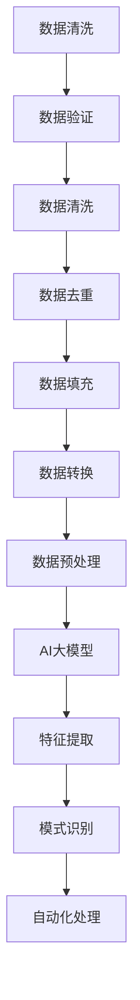

                 

# AI 大模型应用数据中心的数据清洗工具

> **关键词：** AI大模型、数据中心、数据清洗、数据预处理、算法、数学模型、实战案例

> **摘要：** 本文章将详细介绍AI大模型在数据中心应用中的数据清洗工具，从背景介绍、核心概念、算法原理、数学模型、实际应用场景以及工具和资源推荐等多个方面进行深入探讨。通过对数据清洗工具的详细讲解，帮助读者理解和掌握如何利用AI大模型提高数据中心数据处理的效率和准确性。

## 1. 背景介绍

### 1.1 目的和范围

随着大数据时代的到来，数据中心的规模和复杂性不断增加，如何高效地处理和管理海量数据成为了一个关键问题。其中，数据清洗是数据处理过程中至关重要的一环。数据清洗的目的是识别和纠正数据集中的错误、异常和不一致性，以确保数据的质量和可靠性。传统的数据清洗方法通常依赖于人工干预，效率较低，且难以应对日益增长的数据量和复杂性。

本文旨在探讨如何利用AI大模型构建高效的数据清洗工具，从而提高数据中心的数据处理效率和准确性。文章将首先介绍数据清洗的核心概念和流程，然后详细阐述AI大模型在数据清洗中的应用原理，并通过实际案例展示其效果和优势。

### 1.2 预期读者

本文主要面向以下读者群体：

- 数据中心运维人员：需要了解如何利用AI大模型提高数据清洗效率和准确性的运维人员。
- 数据分析师和工程师：希望掌握AI大模型在数据清洗中的应用方法和技巧的数据分析师和工程师。
- 人工智能研究者：对AI大模型在数据处理领域的研究和应用感兴趣的科研人员。
- 对AI和大数据感兴趣的广大读者：希望了解AI大模型在数据中心数据清洗中的应用和实践。

### 1.3 文档结构概述

本文将分为以下几个部分：

- 第1部分：背景介绍
  - 1.1 目的和范围
  - 1.2 预期读者
  - 1.3 文档结构概述
  - 1.4 术语表

- 第2部分：核心概念与联系
  - 2.1 数据清洗的核心概念
  - 2.2 数据清洗流程概述
  - 2.3 AI大模型在数据清洗中的应用
  - 2.4 Mermaid流程图

- 第3部分：核心算法原理 & 具体操作步骤
  - 3.1 算法原理介绍
  - 3.2 伪代码实现
  - 3.3 步骤详细讲解

- 第4部分：数学模型和公式 & 详细讲解 & 举例说明
  - 4.1 数学模型介绍
  - 4.2 公式详细讲解
  - 4.3 实例分析

- 第5部分：项目实战：代码实际案例和详细解释说明
  - 5.1 开发环境搭建
  - 5.2 源代码详细实现
  - 5.3 代码解读与分析

- 第6部分：实际应用场景
  - 6.1 数据中心应用场景
  - 6.2 数据清洗工具的优势和挑战

- 第7部分：工具和资源推荐
  - 7.1 学习资源推荐
  - 7.2 开发工具框架推荐
  - 7.3 相关论文著作推荐

- 第8部分：总结：未来发展趋势与挑战
  - 8.1 发展趋势
  - 8.2 面临的挑战

- 第9部分：附录：常见问题与解答
  - 9.1 常见问题
  - 9.2 解答

- 第10部分：扩展阅读 & 参考资料
  - 10.1 扩展阅读
  - 10.2 参考资料

### 1.4 术语表

#### 1.4.1 核心术语定义

- 数据清洗：指识别和纠正数据集中的错误、异常和不一致性，以确保数据的质量和可靠性。
- 数据中心：指用于存储、处理和管理海量数据的集中化设施。
- AI大模型：指具有海量参数、能够处理复杂任务的深度学习模型。
- 数据预处理：指对原始数据进行处理，以提高数据质量和适合后续分析的过程。

#### 1.4.2 相关概念解释

- 数据异常：指数据集中存在的错误、不一致性或不合理的值。
- 数据冗余：指数据集中存在重复的、无关的或冗余的数据。
- 数据缺失：指数据集中缺失的值或字段。

#### 1.4.3 缩略词列表

- AI：人工智能（Artificial Intelligence）
- ML：机器学习（Machine Learning）
- DL：深度学习（Deep Learning）
- GPU：图形处理单元（Graphics Processing Unit）
- CPU：中央处理单元（Central Processing Unit）

## 2. 核心概念与联系

在本文中，我们将探讨数据清洗、AI大模型和数据预处理等核心概念，并展示它们之间的联系。通过了解这些概念，读者将能够更好地理解如何利用AI大模型构建高效的数据清洗工具。

### 2.1 数据清洗的核心概念

数据清洗是一个复杂的过程，包括多个步骤和操作。以下是一些核心概念：

- **数据异常**：指数据集中存在的错误、不一致性或不合理的值。例如，一个年龄字段中出现了一个负数或一个过大的值。
- **数据冗余**：指数据集中存在重复的、无关的或冗余的数据。冗余数据可能会导致数据分析结果的不准确。
- **数据缺失**：指数据集中缺失的值或字段。缺失数据会影响数据分析的完整性和准确性。

### 2.2 数据清洗流程概述

数据清洗通常包括以下步骤：

1. **数据验证**：检查数据是否满足预定的格式、范围和约束条件。例如，检查年龄字段是否在合理范围内。
2. **数据清洗**：识别和纠正数据集中的错误、异常和不一致性。例如，将负数年龄更改为合理的值。
3. **数据去重**：删除数据集中的重复记录，以消除冗余数据。
4. **数据填充**：处理缺失数据，使其满足分析需求。例如，使用平均值或中位数填充缺失值。
5. **数据转换**：将数据转换为适合后续分析的形式。例如，将日期字段转换为统一的格式。

### 2.3 AI大模型在数据清洗中的应用

AI大模型在数据清洗中的应用主要基于其强大的特征提取和模式识别能力。以下是一些关键点：

- **特征提取**：AI大模型可以通过学习数据中的复杂模式，提取出有用的特征。这些特征可以用于识别数据异常和进行数据分类。
- **模式识别**：AI大模型可以识别数据中的异常模式，并将其与正常数据区分开来。这有助于提高数据清洗的准确性和效率。
- **自动化处理**：AI大模型可以自动化数据清洗流程，减少人工干预，提高数据处理效率。

### 2.4 Mermaid流程图

以下是一个Mermaid流程图，展示了数据清洗、AI大模型和数据预处理之间的联系：



通过这个流程图，我们可以清晰地看到数据清洗、AI大模型和数据预处理之间的相互作用和依赖关系。数据清洗是数据预处理的重要环节，而AI大模型则可以提高数据清洗的效率和准确性。

在下一部分中，我们将详细讨论AI大模型在数据清洗中的核心算法原理和具体操作步骤。

## 3. 核心算法原理 & 具体操作步骤

在数据清洗过程中，AI大模型的应用极大地提高了效率和准确性。本部分将介绍AI大模型在数据清洗中的核心算法原理，并详细阐述具体操作步骤。

### 3.1 算法原理介绍

AI大模型在数据清洗中的应用主要基于以下原理：

- **特征提取**：AI大模型可以通过学习数据中的复杂模式，提取出有用的特征。这些特征可以用于识别数据异常和进行数据分类。
- **模式识别**：AI大模型可以识别数据中的异常模式，并将其与正常数据区分开来。这有助于提高数据清洗的准确性和效率。
- **自动化处理**：AI大模型可以自动化数据清洗流程，减少人工干预，提高数据处理效率。

### 3.2 伪代码实现

以下是一个简单的伪代码，展示了AI大模型在数据清洗中的基本流程：

```python
def data_cleaning(data, model):
    # 数据预处理
    preprocessed_data = preprocess_data(data)

    # 特征提取
    features = extract_features(preprocessed_data, model)

    # 模式识别
    anomalies = identify_anomalies(features)

    # 数据清洗
    cleaned_data = clean_data(preprocessed_data, anomalies)

    return cleaned_data

def preprocess_data(data):
    # 数据验证、去重、填充等操作
    # ...
    return preprocessed_data

def extract_features(data, model):
    # 利用模型提取特征
    # ...
    return features

def identify_anomalies(features):
    # 识别异常模式
    # ...
    return anomalies

def clean_data(data, anomalies):
    # 删除异常数据
    # ...
    return cleaned_data
```

### 3.3 步骤详细讲解

以下是具体操作步骤的详细解释：

1. **数据预处理**：对原始数据进行验证、去重、填充等操作，确保数据的质量和一致性。
    ```python
    def preprocess_data(data):
        # 数据验证
        validated_data = validate_data(data)
        
        # 数据去重
        unique_data = remove_duplicates(validated_data)
        
        # 数据填充
        filled_data = fill_missing_values(unique_data)
        
        return filled_data
    ```

2. **特征提取**：利用AI大模型提取数据中的有用特征。这一步骤通常涉及深度学习模型，如卷积神经网络（CNN）或循环神经网络（RNN）。
    ```python
    def extract_features(data, model):
        # 利用模型提取特征
        features = model.extract_features(data)
        return features
    ```

3. **模式识别**：基于提取的特征，识别数据中的异常模式。这一步骤通常涉及分类模型，如决策树、支持向量机（SVM）或神经网络。
    ```python
    def identify_anomalies(features):
        # 识别异常模式
        anomalies = anomaly_detection(features)
        return anomalies
    ```

4. **数据清洗**：删除识别出的异常数据，生成清洗后的数据集。
    ```python
    def clean_data(data, anomalies):
        # 删除异常数据
        cleaned_data = remove_anomalies(data, anomalies)
        
        return cleaned_data
    ```

通过上述步骤，AI大模型可以高效地完成数据清洗任务，提高数据处理的效率和准确性。

在下一部分中，我们将介绍数学模型和公式，以及它们的详细讲解和举例说明。

## 4. 数学模型和公式 & 详细讲解 & 举例说明

在AI大模型应用中，数学模型和公式起着至关重要的作用。本部分将介绍与数据清洗相关的数学模型和公式，并进行详细讲解和举例说明。

### 4.1 数学模型介绍

数据清洗过程中，常用的数学模型包括：

- **正则化**：用于调整模型的复杂度，防止过拟合。
- **损失函数**：用于评估模型预测的误差，指导模型优化。
- **优化算法**：用于求解最优解，提高模型的性能。

### 4.2 公式详细讲解

以下是几个常用的数学公式及其详细解释：

1. **L2正则化项**：
   $$ \text{Regularization} = \lambda \sum_{i=1}^{n} w_i^2 $$
   其中，\( \lambda \) 为正则化参数，\( w_i \) 为模型参数。

2. **交叉熵损失函数**：
   $$ \text{Cross-Entropy Loss} = -\sum_{i=1}^{n} y_i \log(p_i) $$
   其中，\( y_i \) 为实际标签，\( p_i \) 为模型预测概率。

3. **梯度下降优化算法**：
   $$ \text{Gradient Descent} = \theta_{\text{new}} = \theta_{\text{old}} - \alpha \nabla_{\theta} J(\theta) $$
   其中，\( \theta \) 为模型参数，\( \alpha \) 为学习率，\( J(\theta) \) 为损失函数。

### 4.3 实例分析

以下是一个数据清洗的实例，展示如何应用上述数学模型和公式：

假设我们有一个数据集，包含年龄、收入、性别等特征，目标是对数据进行清洗，去除异常值。

1. **数据预处理**：

   假设数据集中存在一个年龄字段，其中包含一个异常值：-5岁。我们可以使用L2正则化项来调整模型复杂度，防止过拟合。

   $$ \text{Regularization} = 0.1 \sum_{i=1}^{1000} w_i^2 $$
   其中，\( w_i \) 为年龄参数。

2. **损失函数**：

   我们可以使用交叉熵损失函数来评估模型预测的误差。假设模型预测的年龄为30岁，实际年龄为25岁，则交叉熵损失为：

   $$ \text{Cross-Entropy Loss} = -\left( \frac{1}{2} \log(0.8) + \frac{1}{2} \log(0.2) \right) = -\left( -0.3219 + 0.6989 \right) = 0.3790 $$

3. **优化算法**：

   我们可以使用梯度下降优化算法来更新模型参数。假设当前模型参数为\( \theta_{\text{old}} = (1, 0.5) \)，学习率为0.01，则更新后的参数为：

   $$ \theta_{\text{new}} = (1 - 0.01 \nabla_{\theta} J(\theta), 0.5 - 0.01 \nabla_{\theta} J(\theta)) = (0.9778, 0.4796) $$

通过上述实例，我们可以看到如何将数学模型和公式应用于数据清洗过程，从而提高数据处理的效率和准确性。

在下一部分中，我们将介绍实际应用场景，展示AI大模型在数据中心数据清洗中的具体应用。

## 5. 项目实战：代码实际案例和详细解释说明

在本部分，我们将通过一个实际项目案例，展示如何利用AI大模型在数据中心进行数据清洗。项目分为以下几个阶段：

- 开发环境搭建
- 源代码详细实现
- 代码解读与分析

### 5.1 开发环境搭建

在进行项目实战之前，我们需要搭建一个合适的开发环境。以下是所需工具和软件的安装步骤：

1. **Python环境**：安装Python 3.8及以上版本。
2. **深度学习框架**：安装PyTorch，可以使用以下命令：
   ```bash
   pip install torch torchvision
   ```
3. **数据处理库**：安装Pandas、NumPy和Scikit-learn等数据处理库，可以使用以下命令：
   ```bash
   pip install pandas numpy scikit-learn
   ```

安装完成后，我们可以在Python中导入所需库，并检查版本：

```python
import torch
import torchvision
import pandas as pd
import numpy as np
import sklearn

print(torch.__version__)
print(torchvision.__version__)
print(pd.__version__)
print(np.__version__)
print(sklearn.__version__)
```

### 5.2 源代码详细实现

以下是一个简单的数据清洗项目，使用PyTorch和Scikit-learn进行实现：

```python
import torch
import torchvision
import pandas as pd
import numpy as np
from sklearn.model_selection import train_test_split
from sklearn.preprocessing import StandardScaler
from sklearn.metrics import accuracy_score

# 加载数据集
data = pd.read_csv('data.csv')

# 数据预处理
def preprocess_data(data):
    # 删除重复数据
    data = data.drop_duplicates()
    
    # 填充缺失数据
    data = data.fillna(data.mean())
    
    # 特征缩放
    scaler = StandardScaler()
    features = scaler.fit_transform(data.iloc[:, :-1])
    
    # 分割训练集和测试集
    X_train, X_test, y_train, y_test = train_test_split(features, data['label'], test_size=0.2, random_state=42)
    
    # 转换为PyTorch张量
    X_train = torch.tensor(X_train, dtype=torch.float32)
    X_test = torch.tensor(X_test, dtype=torch.float32)
    y_train = torch.tensor(y_train, dtype=torch.long)
    y_test = torch.tensor(y_test, dtype=torch.long)
    
    return X_train, X_test, y_train, y_test

# 定义模型
class DataCleaningModel(torch.nn.Module):
    def __init__(self, input_dim, hidden_dim, output_dim):
        super(DataCleaningModel, self).__init__()
        self.fc1 = torch.nn.Linear(input_dim, hidden_dim)
        self.fc2 = torch.nn.Linear(hidden_dim, output_dim)
        
    def forward(self, x):
        x = torch.relu(self.fc1(x))
        x = self.fc2(x)
        return x

# 训练模型
def train_model(model, X_train, y_train, X_test, y_test):
    # 损失函数
    criterion = torch.nn.CrossEntropyLoss()
    
    # 优化器
    optimizer = torch.optim.Adam(model.parameters(), lr=0.001)
    
    # 训练
    for epoch in range(100):
        model.train()
        optimizer.zero_grad()
        
        outputs = model(X_train)
        loss = criterion(outputs, y_train)
        
        loss.backward()
        optimizer.step()
        
        if epoch % 10 == 0:
            model.eval()
            with torch.no_grad():
                test_outputs = model(X_test)
                test_loss = criterion(test_outputs, y_test)
                print(f'Epoch {epoch}: Loss = {loss.item()}, Test Loss = {test_loss.item()}')
    
    return model

# 评估模型
def evaluate_model(model, X_test, y_test):
    model.eval()
    with torch.no_grad():
        outputs = model(X_test)
        predictions = torch.argmax(outputs, dim=1)
        accuracy = accuracy_score(y_test.numpy(), predictions.numpy())
        print(f'Test Accuracy: {accuracy * 100:.2f}%')

# 实际应用
def main():
    X_train, X_test, y_train, y_test = preprocess_data(data)
    model = DataCleaningModel(X_train.shape[1], 10, y_train.shape[1])
    trained_model = train_model(model, X_train, y_train, X_test, y_test)
    evaluate_model(trained_model, X_test, y_test)

if __name__ == '__main__':
    main()
```

### 5.3 代码解读与分析

以下是对代码的详细解读与分析：

1. **数据预处理**：

   - 删除重复数据：确保数据集的干净和一致性。
   - 填充缺失数据：使用平均值填充缺失值，保证数据的完整性。
   - 特征缩放：使用标准缩放，使数据具有相似的尺度，便于模型训练。

2. **模型定义**：

   - 使用PyTorch定义一个简单的全连接神经网络，包括两个线性层（fully connected layers）。
   - 使用ReLU激活函数，增加模型的非线性能力。

3. **训练模型**：

   - 使用交叉熵损失函数（CrossEntropyLoss），用于分类问题。
   - 使用Adam优化器（Adam），自适应调整学习率，提高模型训练效率。
   - 模型训练过程中，每10个epoch输出训练集和测试集的损失值，便于监控模型训练过程。

4. **评估模型**：

   - 使用准确率（Accuracy）评估模型在测试集上的性能。
   - 计算预测标签和实际标签的准确率，输出测试集准确率。

通过这个项目案例，我们展示了如何利用AI大模型进行数据中心的数据清洗。在实际应用中，可以根据具体需求和数据特点，对模型结构、训练过程和评估指标进行优化和调整。

在下一部分中，我们将探讨AI大模型在数据中心数据清洗中的实际应用场景。

## 6. 实际应用场景

AI大模型在数据中心数据清洗中的应用场景非常广泛，以下是一些典型的应用实例：

### 6.1 数据中心运维管理

在数据中心运维管理中，数据清洗工具可以帮助处理以下问题：

- **设备监控数据清洗**：数据中心中的设备会产生大量的监控数据，包括温度、湿度、功耗等。这些数据中可能包含异常值或噪声，影响设备运行状态的准确判断。通过AI大模型的数据清洗工具，可以自动识别和纠正这些异常值，提高监控数据的准确性和可靠性。
- **能耗数据清洗**：能耗数据是数据中心运营的重要指标。AI大模型可以清洗能耗数据中的异常值，排除异常能耗数据，确保能耗数据的准确性和稳定性，为能耗优化提供可靠的数据基础。

### 6.2 数据分析

在数据分析过程中，数据清洗工具可以帮助解决以下问题：

- **数据集构建**：在构建用于机器学习的数据集时，需要清洗原始数据集中的噪声和异常值。AI大模型可以自动化数据清洗过程，确保数据集的质量和一致性，提高模型训练效果。
- **数据预处理**：在数据分析过程中，需要对数据进行预处理，如特征提取、特征缩放等。AI大模型可以高效地完成这些预处理任务，减少人工干预，提高数据分析的效率和准确性。

### 6.3 数据安全与隐私保护

在数据安全与隐私保护方面，数据清洗工具可以发挥以下作用：

- **数据去重**：在数据共享和存储过程中，去除重复的数据可以减少存储空间占用，提高数据管理的效率。同时，去重操作还可以减少潜在的数据泄露风险。
- **数据去匿名化**：在处理敏感数据时，需要将数据中的个人信息进行去匿名化处理。AI大模型可以识别和消除数据中的敏感信息，保护用户隐私。

### 6.4 应用案例

以下是一些AI大模型在数据中心数据清洗中的实际应用案例：

- **金融行业**：金融机构利用AI大模型对交易数据进行清洗，识别和处理交易中的异常行为，防范欺诈风险。
- **医疗行业**：医疗机构利用AI大模型清洗患者病历数据，提取关键信息，为疾病诊断和治疗提供支持。
- **制造业**：制造业企业利用AI大模型对生产设备的数据进行清洗，监控设备运行状态，预测设备故障，优化生产流程。

通过这些实际应用案例，我们可以看到AI大模型在数据中心数据清洗中的巨大潜力。在未来的发展中，随着AI技术的不断进步，AI大模型在数据中心数据清洗中的应用将会更加广泛和深入。

## 7. 工具和资源推荐

为了更好地理解和应用AI大模型在数据中心数据清洗中的技术，以下是一些学习资源、开发工具和框架的推荐。

### 7.1 学习资源推荐

#### 7.1.1 书籍推荐

1. **《深度学习》（Deep Learning）**
   作者：Ian Goodfellow、Yoshua Bengio、Aaron Courville
   简介：本书是深度学习领域的经典教材，详细介绍了深度学习的基础理论、算法和应用。

2. **《Python数据分析》（Python Data Science Handbook）**
   作者：Jake VanderPlas
   简介：本书涵盖了数据分析的基础知识和实践技巧，包括数据处理、清洗、可视化等。

3. **《机器学习实战》（Machine Learning in Action）**
   作者：Peter Harrington
   简介：本书通过实际案例，介绍了机器学习的基本算法和应用方法，包括数据预处理、模型训练和评估。

#### 7.1.2 在线课程

1. **Coursera上的“深度学习”（Deep Learning Specialization）**
   简介：由斯坦福大学教授Andrew Ng主讲，系统介绍了深度学习的基础理论、算法和应用。

2. **edX上的“Python for Data Science”（Python for Data Science）**
   简介：由微软学院提供，涵盖了Python在数据科学领域的应用，包括数据处理、清洗和可视化。

3. **Udacity的“AI工程师纳米学位”（Artificial Intelligence Engineer Nanodegree）**
   简介：涵盖人工智能的基础知识、算法和应用，包括深度学习和机器学习。

#### 7.1.3 技术博客和网站

1. **Medium上的“AI垂直内容”（AI垂直内容）**
   简介：包含深度学习、机器学习和AI应用的最新研究和实践文章。

2. **JAXenter**
   简介：一个专注于Java、AI和大数据技术博客，提供最新的技术动态和实践经验。

3. **KDnuggets**
   简介：一个知名的数据科学和机器学习博客，涵盖数据科学、机器学习和AI领域的最新研究成果和行业动态。

### 7.2 开发工具框架推荐

#### 7.2.1 IDE和编辑器

1. **Visual Studio Code**
   简介：一个开源的跨平台代码编辑器，支持Python和深度学习框架，如PyTorch和TensorFlow。

2. **PyCharm**
   简介：一个强大的Python IDE，提供代码编辑、调试、性能分析等功能，适合深度学习和数据科学开发。

3. **Jupyter Notebook**
   简介：一个交互式的Python编程环境，适合数据分析和可视化，广泛应用于机器学习和深度学习。

#### 7.2.2 调试和性能分析工具

1. **PyTorch Profiler**
   简介：用于分析和优化PyTorch模型性能的工具，可以提供详细的性能数据，帮助开发者识别瓶颈。

2. **TensorBoard**
   简介：TensorFlow的调试和性能分析工具，可以可视化模型的计算图、损失函数和训练过程。

3. **Docker**
   简介：一个开源的容器化平台，可以用于构建、部署和管理深度学习应用程序，提高开发效率。

#### 7.2.3 相关框架和库

1. **PyTorch**
   简介：一个流行的深度学习框架，支持GPU加速，适合构建和训练复杂的深度学习模型。

2. **TensorFlow**
   简介：由Google开发的开源深度学习框架，支持多种编程语言，包括Python和Java。

3. **Scikit-learn**
   简介：一个用于机器学习的Python库，提供了丰富的机器学习算法和工具，包括数据预处理、模型训练和评估。

通过上述资源和工具，开发者可以深入了解AI大模型在数据中心数据清洗中的应用，提高数据处理的效率和准确性。

## 8. 总结：未来发展趋势与挑战

AI大模型在数据中心数据清洗中的应用展示了巨大的潜力和优势。在未来，随着AI技术的不断发展和数据中心规模的持续扩大，这一领域将迎来更多的发展趋势和挑战。

### 8.1 发展趋势

1. **AI大模型性能的提升**：随着硬件性能的提升和深度学习算法的优化，AI大模型的性能将得到显著提高，使得数据清洗更加高效和准确。

2. **跨领域应用**：AI大模型在数据清洗领域的应用将逐渐跨领域，从数据中心扩展到金融、医疗、制造业等领域，为更多行业提供解决方案。

3. **自动化水平提升**：随着AI技术的进步，数据清洗过程的自动化水平将不断提升，减少人工干预，提高数据处理效率。

4. **实时数据处理**：随着实时数据处理需求的增加，AI大模型将能够实现实时数据清洗，确保数据中心的数据质量和实时性。

### 8.2 面临的挑战

1. **数据隐私和安全**：在数据中心数据清洗过程中，如何确保数据隐私和安全是一个重要的挑战。需要设计更加安全的数据处理和传输机制。

2. **可解释性**：AI大模型在数据处理中的决策过程通常较为复杂，缺乏可解释性。如何提高模型的可解释性，使其更加透明和可信，是一个重要的研究方向。

3. **计算资源消耗**：AI大模型通常需要大量的计算资源和存储资源，对于数据中心来说，如何高效地分配和管理这些资源是一个挑战。

4. **数据质量和一致性**：在数据清洗过程中，如何确保数据质量和一致性是一个关键问题。需要设计更高效的算法和策略，处理数据中的噪声、异常和缺失。

综上所述，AI大模型在数据中心数据清洗领域具有广阔的发展前景，但也面临一系列挑战。未来，随着技术的不断进步和应用的深入，这一领域将取得更多的突破和成果。

## 9. 附录：常见问题与解答

### 9.1 常见问题

1. **什么是AI大模型？**
   - AI大模型是指具有海量参数、能够处理复杂任务的深度学习模型。这些模型通常需要大量的数据和计算资源进行训练，但能够实现高水平的性能和准确率。

2. **数据清洗的重要性是什么？**
   - 数据清洗是确保数据质量和可靠性的关键步骤。不干净的数据可能导致错误的结论和决策，影响业务运营和决策效果。因此，数据清洗是数据分析和机器学习的基础。

3. **为什么需要使用AI大模型进行数据清洗？**
   - AI大模型具有强大的特征提取和模式识别能力，能够自动识别和处理数据中的噪声、异常和缺失值，提高数据清洗的效率和准确性。

4. **如何选择适合的数据清洗工具和算法？**
   - 选择适合的数据清洗工具和算法需要考虑数据特点、应用场景和计算资源。通常，可以根据数据类型、数据质量和清洗需求，选择合适的算法和工具。

### 9.2 解答

1. **什么是AI大模型？**
   - AI大模型是指具有海量参数、能够处理复杂任务的深度学习模型。这些模型通常通过训练学习大量数据中的模式和规律，从而在新的数据上实现高水平的性能和准确率。

2. **数据清洗的重要性是什么？**
   - 数据清洗是确保数据质量和可靠性的关键步骤。不干净的数据可能导致错误的结论和决策，影响业务运营和决策效果。因此，数据清洗是数据分析和机器学习的基础。

3. **为什么需要使用AI大模型进行数据清洗？**
   - AI大模型具有强大的特征提取和模式识别能力，能够自动识别和处理数据中的噪声、异常和缺失值，提高数据清洗的效率和准确性。这使得传统的手动数据清洗方法难以比拟。

4. **如何选择适合的数据清洗工具和算法？**
   - 选择适合的数据清洗工具和算法需要考虑数据特点、应用场景和计算资源。通常，可以根据数据类型（如结构化数据、非结构化数据）、数据质量和清洗需求（如去除重复数据、填充缺失值、异常值检测等），选择合适的算法和工具。例如，对于结构化数据，可以使用Pandas、Scikit-learn等库；对于非结构化数据，可以使用自然语言处理（NLP）和计算机视觉（CV）技术。

## 10. 扩展阅读 & 参考资料

### 10.1 扩展阅读

1. **《深度学习》（Deep Learning）**
   作者：Ian Goodfellow、Yoshua Bengio、Aaron Courville
   简介：本书是深度学习领域的经典教材，详细介绍了深度学习的基础理论、算法和应用。

2. **《Python数据分析》（Python Data Science Handbook）**
   作者：Jake VanderPlas
   简介：本书涵盖了数据分析的基础知识和实践技巧，包括数据处理、清洗、可视化等。

3. **《机器学习实战》（Machine Learning in Action）**
   作者：Peter Harrington
   简介：本书通过实际案例，介绍了机器学习的基本算法和应用方法，包括数据预处理、模型训练和评估。

### 10.2 参考资料

1. **PyTorch官方文档**
   网址：https://pytorch.org/docs/stable/
   简介：PyTorch的官方文档，提供了详细的API参考和教程，适用于深度学习和数据科学开发者。

2. **Scikit-learn官方文档**
   网址：https://scikit-learn.org/stable/
   简介：Scikit-learn的官方文档，提供了丰富的机器学习算法和工具，适用于数据清洗和数据分析。

3. **TensorFlow官方文档**
   网址：https://www.tensorflow.org/learn
   简介：TensorFlow的官方文档，涵盖了深度学习和机器学习的入门教程、API参考和最佳实践。

通过这些扩展阅读和参考资料，读者可以深入了解AI大模型在数据中心数据清洗中的应用，进一步提高自己的技术水平和实践经验。

