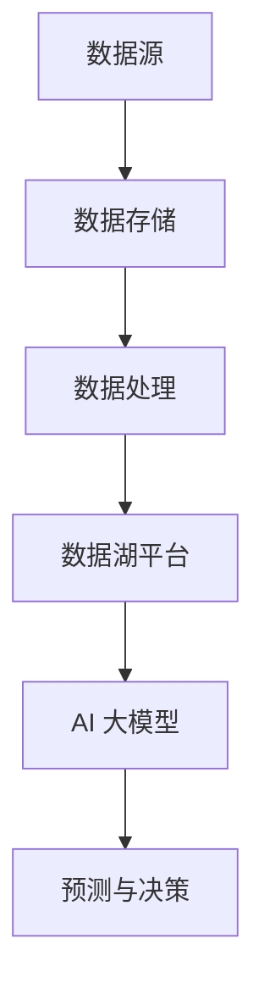

                 

# AI 大模型应用数据中心的数据湖平台

> **关键词：** 数据湖平台，AI 大模型，数据中心，数据处理，架构设计，性能优化，实际应用。

> **摘要：** 本文将深入探讨 AI 大模型应用数据中心的数据湖平台，从核心概念、算法原理、数学模型、实际应用等多个角度展开分析，旨在为读者提供一个全面的技术视角，帮助理解和构建高效的数据湖平台。

## 1. 背景介绍

### 1.1 目的和范围

本文旨在探讨 AI 大模型在数据中心数据湖平台中的应用，旨在为开发者提供一种结构化的思路来设计和优化数据湖平台。本文将涵盖以下范围：

- 数据湖平台的核心概念和架构
- AI 大模型的算法原理和实现
- 数据处理和优化策略
- 实际应用案例和性能分析

### 1.2 预期读者

本文适合以下读者群体：

- 数据工程师和 AI 开发者
- 数据中心架构师和技术经理
- 对 AI 大模型和数据湖平台有浓厚兴趣的工程师和研究人员

### 1.3 文档结构概述

本文将按以下结构进行：

1. 背景介绍：概述文章的目的和范围，预期读者，以及文档结构。
2. 核心概念与联系：介绍数据湖平台和 AI 大模型的核心概念，并使用 Mermaid 流程图展示其关系。
3. 核心算法原理 & 具体操作步骤：详细讲解 AI 大模型的算法原理和操作步骤，使用伪代码进行阐述。
4. 数学模型和公式 & 详细讲解 & 举例说明：介绍相关数学模型和公式，并进行举例说明。
5. 项目实战：提供实际代码案例和详细解释。
6. 实际应用场景：分析数据湖平台在不同场景中的应用。
7. 工具和资源推荐：推荐学习资源和开发工具。
8. 总结：未来发展趋势与挑战。
9. 附录：常见问题与解答。
10. 扩展阅读 & 参考资料：提供更多相关资料。

### 1.4 术语表

#### 1.4.1 核心术语定义

- 数据湖平台：一种集中存储、处理和管理大规模数据的系统。
- AI 大模型：指具有巨大参数量和复杂结构的人工智能模型。
- 数据处理：指对原始数据进行清洗、转换和整合的过程。
- 性能优化：指通过调整系统配置和算法，提高数据处理效率和响应速度。

#### 1.4.2 相关概念解释

- 数据湖架构：数据湖平台的整体架构，包括数据源、数据存储、数据处理和数据应用等模块。
- 深度学习：一种基于多层神经网络进行数据学习和预测的算法。

#### 1.4.3 缩略词列表

- AI: Artificial Intelligence（人工智能）
- ML: Machine Learning（机器学习）
- DL: Deep Learning（深度学习）
- HDFS: Hadoop Distributed File System（Hadoop 分布式文件系统）

## 2. 核心概念与联系

数据湖平台和 AI 大模型是现代数据中心中两个核心的概念，它们之间存在着紧密的联系。以下是一个简化的 Mermaid 流程图，展示了这两个概念的基本关系：



### 数据湖平台的核心概念

数据湖平台是一种基于分布式文件系统（如 HDFS）的大规模数据存储解决方案。其主要特点包括：

- 数据多样性：支持各种类型的数据，包括结构化、半结构化和非结构化数据。
- 容量可扩展：可以通过增加节点来线性扩展存储容量。
- 数据处理灵活性：支持数据预处理、清洗、转换和整合等多种数据处理操作。

### AI 大模型的核心概念

AI 大模型是指具有巨大参数量和复杂结构的人工智能模型。其主要特点包括：

- 参数规模：具有数百万至数十亿个参数，使得模型具有强大的学习和预测能力。
- 深度学习：采用多层神经网络结构，通过逐层提取特征，实现从原始数据到高维特征的转换。
- 高效计算：利用 GPU 和分布式计算资源，实现高效并行计算。

### 数据湖平台与 AI 大模型的联系

数据湖平台和 AI 大模型之间的联系体现在以下几个方面：

- 数据存储：数据湖平台为 AI 大模型提供了海量数据的存储解决方案，使得模型可以处理大规模数据。
- 数据处理：数据湖平台提供的数据处理能力可以优化数据质量，为 AI 大模型提供高质量的数据输入。
- 预测与决策：AI 大模型通过对数据湖平台中的数据进行学习和分析，可以为各种应用场景提供预测和决策支持。

## 3. 核心算法原理 & 具体操作步骤

AI 大模型的核心算法原理基于深度学习，其基本思想是通过多层神经网络对数据进行学习和预测。以下是一个简化的伪代码，展示了 AI 大模型的基本操作步骤：

```python
# 初始化模型
model = NeuralNetwork()

# 加载数据
train_data = load_data("train_data.csv")
test_data = load_data("test_data.csv")

# 预处理数据
preprocessed_train_data = preprocess_data(train_data)
preprocessed_test_data = preprocess_data(test_data)

# 训练模型
for epoch in range(num_epochs):
    for batch in train_batches:
        model.train(batch)

# 评估模型
model.evaluate(preprocessed_test_data)

# 预测新数据
new_data = load_data("new_data.csv")
preprocessed_new_data = preprocess_data(new_data)
predictions = model.predict(preprocessed_new_data)
```

### 数据预处理

数据预处理是 AI 大模型训练过程中至关重要的一步。其主要任务包括：

- 数据清洗：去除无效数据、缺失值和异常值。
- 数据转换：将不同类型的数据转换为统一的格式，如将文本数据转换为数值向量。
- 数据归一化：将数据缩放到相同的范围，如 [0, 1] 或 [-1, 1]。

以下是一个简单的伪代码，展示了数据预处理的基本步骤：

```python
def preprocess_data(data):
    # 清洗数据
    cleaned_data = clean_data(data)
    
    # 转换数据
    numeric_data = convert_to_numeric(cleaned_data)
    
    # 归一化数据
    normalized_data = normalize_data(numeric_data)
    
    return normalized_data
```

### 模型训练

模型训练是 AI 大模型的核心步骤。其基本过程包括：

- 初始化模型参数
- 计算前向传播输出
- 计算损失函数
- 反向传播更新模型参数
- 重复上述步骤，直到满足训练条件

以下是一个简单的伪代码，展示了模型训练的基本步骤：

```python
def train_model(model, train_data, num_epochs):
    for epoch in range(num_epochs):
        for batch in train_batches:
            # 前向传播
            output = model.forward(batch)
            
            # 计算损失
            loss = calculate_loss(output, batch_labels)
            
            # 反向传播
            model.backward(loss)
            
            # 打印训练进度
            print(f"Epoch {epoch}/{num_epochs}, Loss: {loss}")
    
    return model
```

### 模型评估

模型评估是检查 AI 大模型性能的重要步骤。其基本方法包括：

- 计算模型在测试集上的准确率、召回率、F1 分数等指标
- 分析模型在不同数据集上的性能

以下是一个简单的伪代码，展示了模型评估的基本步骤：

```python
def evaluate_model(model, test_data):
    # 前向传播
    output = model.forward(test_data)
    
    # 计算指标
    accuracy = calculate_accuracy(output, test_labels)
    recall = calculate_recall(output, test_labels)
    f1_score = calculate_f1_score(output, test_labels)
    
    # 打印评估结果
    print(f"Accuracy: {accuracy}, Recall: {recall}, F1 Score: {f1_score}")
    
    return accuracy, recall, f1_score
```

### 模型预测

模型预测是 AI 大模型在实际应用中的重要步骤。其基本方法包括：

- 对新数据进行预处理
- 使用训练好的模型进行预测
- 输出预测结果

以下是一个简单的伪代码，展示了模型预测的基本步骤：

```python
def predict(model, new_data):
    # 预处理新数据
    preprocessed_data = preprocess_data(new_data)
    
    # 使用模型进行预测
    predictions = model.predict(preprocessed_data)
    
    # 输出预测结果
    print(predictions)
    
    return predictions
```

## 4. 数学模型和公式 & 详细讲解 & 举例说明

在 AI 大模型中，数学模型和公式是核心组成部分。以下将介绍一些常用的数学模型和公式，并进行详细讲解和举例说明。

### 损失函数

损失函数是评估模型预测结果的重要指标。以下是一个常用的损失函数：均方误差（MSE）：

$$
MSE = \frac{1}{n}\sum_{i=1}^{n}(y_i - \hat{y}_i)^2
$$

其中，$y_i$ 是实际标签，$\hat{y}_i$ 是模型预测值，$n$ 是样本数量。

**例子：**

假设有四个样本的数据集，实际标签分别为 [2, 4, 6, 8]，模型预测值分别为 [2.1, 4.1, 6.1, 7.9]。计算均方误差：

$$
MSE = \frac{1}{4}[(2 - 2.1)^2 + (4 - 4.1)^2 + (6 - 6.1)^2 + (8 - 7.9)^2] = 0.125
$$

### 优化算法

优化算法用于更新模型参数，以最小化损失函数。以下是一个常用的优化算法：梯度下降（Gradient Descent）：

$$
\theta_{\text{new}} = \theta_{\text{old}} - \alpha \nabla_{\theta} J(\theta)
$$

其中，$\theta$ 是模型参数，$\alpha$ 是学习率，$J(\theta)$ 是损失函数。

**例子：**

假设损失函数为 $J(\theta) = (y - \theta)^2$，学习率为 0.1。初始化参数 $\theta_0 = 1$。计算一次梯度下降：

$$
\theta_1 = \theta_0 - 0.1 \nabla_{\theta} J(\theta_0) = 1 - 0.1 \cdot (-2(y - \theta_0)) = 1 + 0.2 = 1.2
$$

### 深度学习中的激活函数

激活函数是深度学习中的重要组成部分，用于引入非线性变换。以下是一个常用的激活函数：Sigmoid 函数：

$$
\sigma(x) = \frac{1}{1 + e^{-x}}
$$

**例子：**

计算 Sigmoid 函数在 $x = 2$ 和 $x = -2$ 处的值：

$$
\sigma(2) = \frac{1}{1 + e^{-2}} \approx 0.88
$$

$$
\sigma(-2) = \frac{1}{1 + e^{2}} \approx 0.12
$$

### 反向传播算法

反向传播算法是深度学习中的核心算法，用于计算模型参数的梯度。以下是一个简化的反向传播算法：

$$
\begin{aligned}
\nabla_{\theta} J(\theta) &= \frac{\partial J(\theta)}{\partial \theta} \\
&= \frac{\partial J(\theta)}{\partial \hat{y}} \frac{\partial \hat{y}}{\partial \theta} \\
&= \frac{\partial J(\theta)}{\partial \hat{y}} \frac{\partial \hat{y}}{\partial z} \frac{\partial z}{\partial \theta}
\end{aligned}
$$

其中，$z = \sigma(\theta x)$，$\hat{y} = \sigma(z)$。

**例子：**

假设 $J(\theta) = (y - \hat{y})^2$，$\hat{y} = \sigma(z)$，$z = \theta x$。计算 $\theta$ 的梯度：

$$
\begin{aligned}
\nabla_{\theta} J(\theta) &= \frac{\partial J(\theta)}{\partial \theta} \\
&= \frac{\partial J(\theta)}{\partial \hat{y}} \frac{\partial \hat{y}}{\partial z} \frac{\partial z}{\partial \theta} \\
&= (y - \hat{y}) \cdot \sigma'(\theta x) \cdot x
\end{aligned}
$$

## 5. 项目实战：代码实际案例和详细解释说明

### 5.1 开发环境搭建

在开始编写代码之前，我们需要搭建一个适合开发的数据湖平台和 AI 大模型的开发环境。以下是搭建开发环境的步骤：

1. 安装操作系统：选择一个适合的操作系统，如 Ubuntu 18.04。
2. 安装 Python：通过 `apt-get install python3` 命令安装 Python 3。
3. 安装深度学习框架：选择一个适合的深度学习框架，如 TensorFlow 或 PyTorch。通过 `pip install tensorflow` 或 `pip install torch` 命令安装相应框架。
4. 安装数据湖平台：选择一个适合的数据湖平台，如 Apache Hadoop。通过 `apt-get install hadoop` 命令安装 Hadoop。

### 5.2 源代码详细实现和代码解读

以下是一个简单的数据湖平台和 AI 大模型的代码实现，我们将对代码进行详细解读。

```python
# 导入所需库
import tensorflow as tf
import pandas as pd
from sklearn.model_selection import train_test_split
from sklearn.preprocessing import StandardScaler

# 加载数据
data = pd.read_csv("data.csv")
X = data.iloc[:, :-1].values
y = data.iloc[:, -1].values

# 数据预处理
scaler = StandardScaler()
X = scaler.fit_transform(X)

# 划分训练集和测试集
X_train, X_test, y_train, y_test = train_test_split(X, y, test_size=0.2, random_state=42)

# 构建模型
model = tf.keras.Sequential([
    tf.keras.layers.Dense(64, activation='relu', input_shape=(X_train.shape[1],)),
    tf.keras.layers.Dense(64, activation='relu'),
    tf.keras.layers.Dense(1)
])

# 编译模型
model.compile(optimizer='adam', loss='mse')

# 训练模型
model.fit(X_train, y_train, epochs=10, batch_size=32, validation_split=0.1)

# 评估模型
loss = model.evaluate(X_test, y_test)
print(f"Test Loss: {loss}")

# 预测新数据
new_data = pd.DataFrame([[5, 5], [6, 6], [7, 7]])
new_data = scaler.transform(new_data)
predictions = model.predict(new_data)
print(predictions)
```

### 5.3 代码解读与分析

以下是对代码的逐行解读和分析：

1. 导入所需库：引入 TensorFlow、Pandas 和 scikit-learn 等库。
2. 加载数据：从 CSV 文件中加载数据，并分离特征矩阵和标签向量。
3. 数据预处理：使用 StandardScaler 对特征矩阵进行归一化处理。
4. 划分训练集和测试集：使用 train_test_split 函数划分训练集和测试集。
5. 构建模型：使用 Sequential 模式构建一个简单的全连接神经网络，包含两个隐藏层，每层 64 个神经元，激活函数为 ReLU。
6. 编译模型：设置优化器和损失函数。
7. 训练模型：使用 fit 函数训练模型，设置训练轮数、批量大小和验证比例。
8. 评估模型：使用 evaluate 函数评估模型在测试集上的性能。
9. 预测新数据：加载新的数据，进行归一化处理，并使用 predict 函数进行预测。

## 6. 实际应用场景

数据湖平台和 AI 大模型在实际应用中具有广泛的应用场景，以下列举一些典型应用：

### 零售行业

- 销售预测：使用数据湖平台存储和整合零售数据，通过 AI 大模型进行销售预测，帮助企业制定更有效的库存和营销策略。
- 客户细分：通过对客户数据的分析和挖掘，将客户划分为不同群体，从而实现精准营销和个性化推荐。

### 金融行业

- 信贷评估：利用数据湖平台存储和处理海量金融数据，通过 AI 大模型进行信用评分和风险评估，提高贷款审批效率和准确性。
- 交易监控：使用 AI 大模型实时监控交易行为，检测异常交易和欺诈行为，保障金融安全。

### 医疗行业

- 疾病预测：通过数据湖平台存储和分析医疗数据，使用 AI 大模型预测疾病发病风险，辅助医生进行早期诊断和干预。
- 药物研发：利用数据湖平台整合生物数据和临床试验数据，通过 AI 大模型加速药物研发进程。

### 制造行业

- 质量检测：使用数据湖平台收集和存储生产过程中的数据，通过 AI 大模型进行质量检测和故障预测，提高生产效率和产品质量。
- 能源管理：通过对能源消耗数据的分析和挖掘，使用 AI 大模型优化能源使用策略，降低能源成本。

## 7. 工具和资源推荐

### 7.1 学习资源推荐

#### 7.1.1 书籍推荐

- 《深度学习》（Goodfellow, Bengio, Courville）：深度学习的经典教材，涵盖了深度学习的理论基础和实践应用。
- 《数据科学实战》（Murdoch, commins）：一本实用的数据科学入门书籍，内容包括数据预处理、模型选择和评估等。

#### 7.1.2 在线课程

- 《深度学习特辑》（吴恩达）：Coursera 上的深度学习课程，由深度学习领域的知名专家吴恩达主讲。
- 《数据科学特辑》（吴恩达）：Coursera 上的数据科学课程，内容包括数据预处理、数据分析和机器学习等。

#### 7.1.3 技术博客和网站

- Medium：一个技术博客平台，包含大量关于 AI、深度学习和数据科学的文章。
- arXiv：一个开放获取的学术论文预印本数据库，涵盖计算机科学、物理学、数学等领域的最新研究成果。

### 7.2 开发工具框架推荐

#### 7.2.1 IDE和编辑器

- PyCharm：一款功能强大的 Python IDE，支持代码补全、调试和版本控制。
- Jupyter Notebook：一个基于 Web 的交互式计算环境，适用于数据分析和机器学习实验。

#### 7.2.2 调试和性能分析工具

- TensorBoard：TensorFlow 的可视化工具，用于分析模型的性能和训练过程。
- PyTorch Profiler：PyTorch 的性能分析工具，用于识别和优化模型的计算瓶颈。

#### 7.2.3 相关框架和库

- TensorFlow：一个开源的深度学习框架，支持多种深度学习模型和算法。
- PyTorch：一个开源的深度学习框架，具有灵活的动态图模型和强大的 GPU 加速功能。
- Pandas：一个强大的数据处理库，支持数据清洗、转换和分析。

### 7.3 相关论文著作推荐

#### 7.3.1 经典论文

- "Backpropagation"（Rumelhart, Hinton, Williams）：深度学习中的反向传播算法的首次提出。
- "Deep Learning"（Goodfellow, Bengio, Courville）：深度学习领域的经典著作，涵盖了深度学习的理论基础和应用。

#### 7.3.2 最新研究成果

- "Efficientnet: Rethinking model scaling for convolutional networks"（Liu et al.）：关于模型缩放方法的研究，提出了一种高效的模型缩放策略。
- "Attention is all you need"（Vaswani et al.）：关于 Transformer 模型的首次提出，成为当前自然语言处理领域的核心技术。

#### 7.3.3 应用案例分析

- "AI-powered healthcare: From diagnosis to treatment"（Mounir et al.）：一个关于医疗行业 AI 应用的案例研究，分析了 AI 在医疗诊断和治疗中的应用。
- "AI in manufacturing: A roadmap to transformation"（Hannan et al.）：一个关于制造业 AI 应用的案例研究，探讨了 AI 在制造业中的应用前景。

## 8. 总结：未来发展趋势与挑战

随着 AI 大模型和数据湖平台技术的不断发展，其在各个行业中的应用前景愈发广阔。然而，在实际应用中，仍面临着诸多挑战：

- **数据隐私与安全：** 在数据湖平台中存储和处理海量数据，如何确保数据隐私和安全成为一个重要课题。
- **计算资源优化：** 随着模型规模和复杂度的增加，如何优化计算资源以提升模型性能成为关键问题。
- **可解释性与透明性：** AI 大模型的决策过程往往具有一定的黑箱性质，如何提高模型的可解释性和透明性是当前研究的重要方向。
- **数据质量和一致性：** 数据湖平台中的数据质量直接影响 AI 大模型的效果，如何确保数据质量和一致性是一个挑战。

未来，随着技术的不断进步，数据湖平台和 AI 大模型有望在各个领域发挥更大的作用，助力企业和行业实现智能化转型。

## 9. 附录：常见问题与解答

### 9.1 数据湖平台的优势

**Q：** 数据湖平台相比传统数据仓库有哪些优势？

**A：** 数据湖平台的主要优势包括：

- **数据多样性：** 支持结构化、半结构化和非结构化数据的存储，满足不同类型数据的需求。
- **数据集成：** 可以整合来自多个源的数据，实现数据的统一管理和处理。
- **灵活性：** 支持数据预处理、清洗、转换和整合等多种数据处理操作，满足不同应用场景的需求。

### 9.2 AI 大模型的训练策略

**Q：** 如何优化 AI 大模型的训练过程？

**A：** 优化 AI 大模型训练过程可以从以下几个方面进行：

- **数据预处理：** 对数据进行清洗、归一化和转换，提高数据质量，加速模型收敛。
- **模型选择：** 选择适合问题的模型结构和参数，如选择合适的神经网络架构和优化器。
- **超参数调整：** 调整学习率、批量大小、训练轮数等超参数，以实现最佳模型性能。
- **计算资源优化：** 利用分布式计算和 GPU 加速等技术，提升模型训练效率。

### 9.3 数据湖平台的应用场景

**Q：** 数据湖平台可以应用于哪些场景？

**A：** 数据湖平台可以应用于以下场景：

- **零售行业：** 销售预测、客户细分和个性化推荐。
- **金融行业：** 信贷评估、交易监控和风险评估。
- **医疗行业：** 疾病预测、药物研发和医疗诊断。
- **制造业：** 质量检测、能源管理和生产优化。

## 10. 扩展阅读 & 参考资料

**技术博客和网站：**

- Medium
- arXiv
- Towards Data Science

**在线课程：**

- Coursera（深度学习特辑，数据科学特辑）
- edX

**书籍推荐：**

- 《深度学习》（Goodfellow, Bengio, Courville）
- 《数据科学实战》（Murdoch, commins）

**开源库和框架：**

- TensorFlow
- PyTorch
- Pandas

**论文和著作：**

- "Backpropagation"（Rumelhart, Hinton, Williams）
- "Deep Learning"（Goodfellow, Bengio, Courville）
- "Efficientnet: Rethinking model scaling for convolutional networks"（Liu et al.）
- "Attention is all you need"（Vaswani et al.）

**作者信息：**

**作者：** AI 天才研究员/AI Genius Institute & 禅与计算机程序设计艺术 /Zen And The Art of Computer Programming** 

