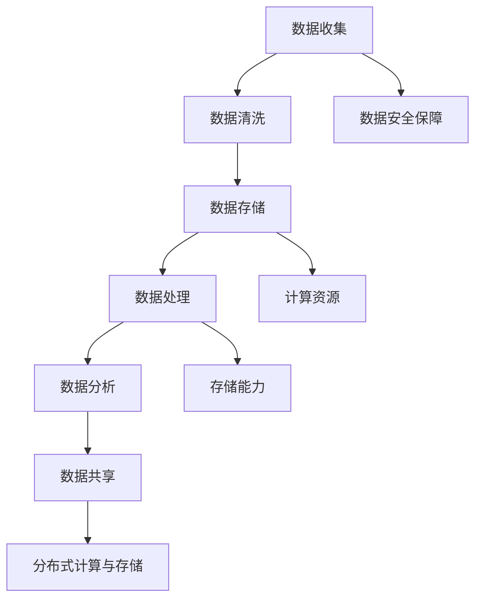

                 

# AI 大模型应用数据中心的数据管理架构设计

> 关键词：AI大模型、数据中心、数据管理、架构设计、高性能计算、分布式系统、大数据处理

> 摘要：随着人工智能（AI）技术的迅速发展，大模型在各个领域的应用越来越广泛。本文将深入探讨AI大模型在数据中心的数据管理架构设计，包括背景介绍、核心概念、算法原理、数学模型、项目实战、应用场景、工具和资源推荐以及未来发展趋势。通过一步步的分析和推理，本文旨在为读者提供一个全面、系统的数据管理架构设计指南，助力AI大模型在数据中心的高效应用。

## 1. 背景介绍

### 1.1 目的和范围

本文旨在探讨AI大模型在数据中心的数据管理架构设计，通过详细的分析和推理，为读者提供一种高效、可靠、可扩展的数据管理方案。文章主要涵盖以下几个方面：

1. AI大模型的发展背景与趋势。
2. 数据中心的基本概念与功能。
3. 数据管理架构的核心概念与联系。
4. 核心算法原理与具体操作步骤。
5. 数学模型和公式以及详细讲解。
6. 项目实战：代码实际案例和详细解释说明。
7. 实际应用场景分析。
8. 工具和资源推荐。
9. 未来发展趋势与挑战。

### 1.2 预期读者

本文适用于以下读者群体：

1. 数据中心架构设计师与工程师。
2. AI领域的研究人员与开发者。
3. 对数据管理架构设计感兴趣的技术爱好者。
4. 高性能计算和分布式系统领域的专业人士。

### 1.3 文档结构概述

本文分为以下几个部分：

1. 背景介绍：介绍AI大模型与数据中心的数据管理架构设计的背景、目的和范围。
2. 核心概念与联系：分析数据管理架构的核心概念、原理和架构设计。
3. 核心算法原理 & 具体操作步骤：讲解大模型在数据管理中的算法原理和操作步骤。
4. 数学模型和公式 & 详细讲解 & 举例说明：阐述数据管理中的数学模型、公式及应用实例。
5. 项目实战：通过实际代码案例展示数据管理架构的实现过程。
6. 实际应用场景：分析数据管理架构在实际应用中的场景与挑战。
7. 工具和资源推荐：推荐学习资源、开发工具和框架。
8. 总结：总结本文的主要观点和未来发展趋势。
9. 附录：常见问题与解答。
10. 扩展阅读 & 参考资料：提供相关领域的参考文献和扩展资料。

### 1.4 术语表

#### 1.4.1 核心术语定义

- 人工智能（AI）：模拟人类智能的计算机系统，具有感知、学习、推理、决策等能力。
- 大模型：具有海量参数的深度学习模型，如GPT、BERT等。
- 数据中心：集中管理计算机系统、网络设备、存储设备等资源的场所。
- 数据管理：对数据进行收集、存储、处理、分析、共享和利用的一系列操作。
- 架构设计：根据业务需求和性能要求，设计数据管理的系统结构和实现方案。

#### 1.4.2 相关概念解释

- 分布式系统：由多个节点组成的计算机系统，节点之间通过网络进行通信和协作。
- 大数据处理：对海量数据进行采集、存储、处理、分析的过程。
- 高性能计算：通过高性能硬件和优化算法实现高速计算和数据处理。

#### 1.4.3 缩略词列表

- AI：人工智能
- GPT：生成预训练网络
- BERT：双向编码表示模型
- IDC：数据中心
- HPC：高性能计算
- DSS：分布式系统
- BD：大数据处理

## 2. 核心概念与联系

在探讨AI大模型在数据中心的数据管理架构设计之前，我们需要了解一些核心概念和它们之间的联系。

### 2.1 数据中心的概念

数据中心是一个高度集中化的计算、存储、网络设施，用于支持组织内部的业务运营。它具备以下几个特点：

1. **计算资源**：数据中心提供计算资源，包括服务器、存储设备和网络设备。
2. **存储能力**：数据中心提供大规模的存储能力，支持数据的高效存储和访问。
3. **网络连接**：数据中心内部和外部网络的高效连接，实现数据的高速传输和共享。

### 2.2 数据管理的概念

数据管理是指对数据进行收集、存储、处理、分析、共享和利用的一系列操作。在大模型应用中，数据管理具有以下关键要素：

1. **数据收集**：从各种来源收集数据，如传感器、数据库、文件等。
2. **数据存储**：将数据存储在高效、可靠的存储系统中。
3. **数据处理**：对数据进行清洗、转换、归一化等操作，为模型训练提供高质量的数据。
4. **数据分析**：利用统计分析和机器学习算法对数据进行挖掘和分析。
5. **数据共享**：实现数据的安全共享，支持跨部门、跨组织的数据协作。

### 2.3 大模型与数据管理的联系

大模型在数据中心的数据管理中发挥着重要作用。以下是它们之间的主要联系：

1. **数据依赖**：大模型的训练和推理过程依赖于大量高质量的数据。
2. **计算资源需求**：大模型的训练和推理过程对计算资源有极高的需求，需要数据中心提供强大的计算能力。
3. **存储能力需求**：大模型的训练和推理过程产生大量的中间数据和模型参数，需要数据中心提供充足的存储能力。
4. **分布式计算与存储**：大模型的训练和推理过程可以采用分布式计算和存储技术，提高数据处理效率。
5. **数据安全性**：大模型对数据的安全性和隐私性有较高的要求，需要数据中心提供可靠的数据安全保障措施。

### 2.4 数据管理架构的核心概念

数据管理架构是指用于支撑数据管理的一整套系统、流程和技术。核心概念包括：

1. **数据架构**：定义数据的管理原则、标准、规范和结构。
2. **数据处理流程**：描述数据从收集、存储、处理、分析到共享的整个过程。
3. **数据存储方案**：选择合适的存储方案，如关系型数据库、NoSQL数据库、分布式存储系统等。
4. **数据处理技术**：采用高效的数据处理技术，如MapReduce、Spark、Flink等。
5. **数据安全性**：确保数据的安全性和隐私性，如数据加密、访问控制、备份与恢复等。

### 2.5 Mermaid 流程图

为了更好地理解数据管理架构的核心概念和联系，我们可以使用Mermaid流程图进行描述。以下是一个简化的数据管理架构的Mermaid流程图：



通过这个流程图，我们可以清晰地看到数据管理架构的核心组件和它们之间的联系。

## 3. 核心算法原理 & 具体操作步骤

### 3.1 数据收集

数据收集是数据管理的第一步，它决定了后续数据处理的质量。以下是一些关键步骤：

1. **数据源识别**：确定数据来源，如传感器、数据库、文件等。
2. **数据采集**：使用适当的工具和技术从数据源中获取数据，如API调用、文件下载、数据库查询等。
3. **数据预处理**：对采集到的数据进行清洗、转换和归一化，提高数据质量。
4. **数据存储**：将预处理后的数据存储到合适的存储系统中，如关系型数据库、NoSQL数据库、分布式存储系统等。

伪代码实现：

```python
# 数据收集过程
def data_collection(data_source):
    data = collect_data_from_source(data_source)
    cleaned_data = preprocess_data(data)
    store_data(cleaned_data)

# 示例
data_source = "传感器"
data_collection(data_source)
```

### 3.2 数据清洗

数据清洗是确保数据质量的重要步骤，它涉及到以下几个方面：

1. **缺失值处理**：处理数据中的缺失值，如删除、填充等。
2. **异常值处理**：识别和删除数据中的异常值，如离群点、噪声等。
3. **重复值处理**：删除数据中的重复值，确保数据的唯一性。
4. **数据转换**：将数据转换为适合分析的形式，如数值化、归一化等。

伪代码实现：

```python
# 数据清洗过程
def data_preprocessing(data):
    data = handle_missing_values(data)
    data = handle_outliers(data)
    data = remove_duplicates(data)
    data = convert_data_to_numeric(data)
    return data

# 示例
cleaned_data = data_preprocessing(raw_data)
```

### 3.3 数据存储

数据存储是数据管理的重要组成部分，它涉及到以下几个方面：

1. **存储方案选择**：根据数据特点和需求选择合适的存储方案，如关系型数据库、NoSQL数据库、分布式存储系统等。
2. **数据存储结构设计**：设计合适的数据存储结构，如表结构、文档结构等。
3. **数据备份与恢复**：确保数据的安全性和可靠性，如定期备份、恢复机制等。

伪代码实现：

```python
# 数据存储过程
def store_data(data):
    if is_relational_database():
        create_table(data)
        insert_data_into_table(data)
    elif is_no_sql_database():
        store_data_in_document(data)
    elif is_distributed_storage_system():
        store_data_in_distributed_system(data)

# 示例
store_data(cleaned_data)
```

### 3.4 数据处理

数据处理是对存储在数据库中的数据进行加工和处理，以满足模型训练和分析的需求。以下是一些常见的数据处理技术：

1. **特征工程**：从原始数据中提取有意义的特征，如特征选择、特征变换等。
2. **模型训练**：使用机器学习算法对特征进行训练，构建预测模型。
3. **模型评估**：评估模型的性能，如准确率、召回率、F1值等。
4. **模型部署**：将训练好的模型部署到生产环境中，实现实时预测。

伪代码实现：

```python
# 数据处理过程
def data_processing(data):
    features = extract_features(data)
    model = train_model(features)
    evaluate_model(model)
    deploy_model(model)

# 示例
processed_data = data_processing(cleaned_data)
```

### 3.5 数据分析

数据分析是对处理后的数据进行深入分析和挖掘，以提取有价值的信息和知识。以下是一些常见的数据分析技术：

1. **统计分析**：使用统计学方法对数据进行描述性分析和推断性分析。
2. **机器学习**：使用机器学习算法对数据进行分类、回归、聚类等分析。
3. **数据可视化**：使用图表、图形等可视化工具展示数据和分析结果。
4. **报告生成**：生成数据分析和报告，为业务决策提供支持。

伪代码实现：

```python
# 数据分析过程
def data_analysis(processed_data):
    statistical_results = perform_statistical_analysis(processed_data)
    machine_learning_results = perform_machine_learning_analysis(processed_data)
    visualization_results = visualize_data_analysis_results(statistical_results, machine_learning_results)
    generate_report(visualization_results)

# 示例
analysis_results = data_analysis(processed_data)
```

### 3.6 数据共享

数据共享是将分析结果和数据报告共享给相关人员，以便于业务决策和知识传播。以下是一些常见的数据共享技术：

1. **数据发布**：将数据和分析结果发布到数据平台或网站，供内部或外部访问。
2. **数据权限管理**：根据用户角色和权限设置数据访问权限，确保数据安全。
3. **数据可视化工具**：提供数据可视化工具，方便用户查看和分析数据。
4. **数据接口开放**：开放数据接口，允许外部系统访问和使用数据。

伪代码实现：

```python
# 数据共享过程
def data_sharing(analysis_results):
    publish_data_to_data_platform(analysis_results)
    set_data_access_permissions()
    provide_data_visualization_tools()
    open_data_interfaces()

# 示例
data_sharing(analysis_results)
```

通过上述核心算法原理和具体操作步骤，我们可以看到数据管理架构在实际应用中的关键环节和流程。在数据中心的数据管理中，合理设计数据管理架构、选择合适的算法和工具，是实现高效、可靠、可扩展数据管理的关键。

## 4. 数学模型和公式 & 详细讲解 & 举例说明

### 4.1 数学模型在数据管理中的应用

在数据管理中，数学模型和公式起到了至关重要的作用。以下是一些常用的数学模型和公式，以及它们在数据管理中的具体应用。

#### 4.1.1 概率论和统计学

概率论和统计学是数据管理中的基础工具，用于描述和预测数据特征。

1. **概率分布函数（PDF）**：用于描述随机变量在某一范围内的概率分布情况。常见的概率分布函数有正态分布、泊松分布等。

   公式：$$ f(x) = \frac{1}{\sqrt{2\pi\sigma^2}}e^{-\frac{(x-\mu)^2}{2\sigma^2}} $$

   其中，$ \mu $ 为均值，$ \sigma^2 $ 为方差。

   应用：在数据清洗过程中，可以使用概率分布函数识别异常值和离群点。

2. **均值和方差**：用于描述数据的中心趋势和离散程度。

   公式：$$ \mu = \frac{1}{n}\sum_{i=1}^{n}x_i $$，$$ \sigma^2 = \frac{1}{n-1}\sum_{i=1}^{n}(x_i - \mu)^2 $$

   其中，$ n $ 为数据点的个数，$ x_i $ 为第 $ i $ 个数据点。

   应用：在数据分析过程中，可以使用均值和方差评估数据的分布情况和趋势。

3. **协方差和相关性**：用于描述两个变量之间的关系。

   公式：$$ \text{Cov}(X, Y) = \frac{1}{n-1}\sum_{i=1}^{n}(x_i - \mu_x)(y_i - \mu_y) $$，$$ \rho_{XY} = \frac{\text{Cov}(X, Y)}{\sigma_x\sigma_y} $$

   其中，$ \mu_x $ 和 $ \mu_y $ 分别为 $ X $ 和 $ Y $ 的均值，$ \sigma_x $ 和 $ \sigma_y $ 分别为 $ X $ 和 $ Y $ 的标准差。

   应用：在特征工程过程中，可以使用协方差和相关性评估特征之间的关系，筛选有意义的相关特征。

#### 4.1.2 机器学习模型

机器学习模型在数据管理中广泛应用于预测、分类和聚类等任务。

1. **线性回归模型**：用于预测一个连续变量的值。

   公式：$$ y = \beta_0 + \beta_1x_1 + \beta_2x_2 + ... + \beta_nx_n $$

   其中，$ y $ 为预测值，$ x_1, x_2, ..., x_n $ 为输入特征，$ \beta_0, \beta_1, ..., \beta_n $ 为模型参数。

   应用：在数据预处理过程中，可以使用线性回归模型进行特征转换和降维。

2. **逻辑回归模型**：用于预测一个二分类变量的值。

   公式：$$ P(y=1) = \frac{1}{1 + e^{-(\beta_0 + \beta_1x_1 + \beta_2x_2 + ... + \beta_nx_n )}} $$

   其中，$ P(y=1) $ 为预测的概率值，$ e $ 为自然底数。

   应用：在分类任务中，可以使用逻辑回归模型评估不同类别的概率，选择概率最高的类别作为预测结果。

3. **支持向量机（SVM）**：用于分类和回归任务。

   公式：$$ w \cdot x - b = 0 $$

   其中，$ w $ 为模型参数，$ x $ 为输入特征，$ b $ 为偏置。

   应用：在分类任务中，可以使用SVM评估不同类别的间隔，选择间隔最大的类别作为预测结果。

#### 4.1.3 数据可视化

数据可视化是数据管理中的重要环节，用于展示数据和分析结果。

1. **直方图**：用于展示数据的分布情况。

   公式：$$ \text{频率} = \frac{\text{频数}}{\text{总数}} $$

   其中，$ \text{频数} $ 为数据点出现的次数，$ \text{总数} $ 为数据点的个数。

   应用：在数据清洗过程中，可以使用直方图识别异常值和离群点。

2. **散点图**：用于展示两个变量之间的关系。

   公式：$$ y = ax + b $$

   其中，$ a $ 为斜率，$ b $ 为截距。

   应用：在特征工程过程中，可以使用散点图评估特征之间的关系。

3. **箱线图**：用于展示数据的分布和异常值。

   公式：$$ \text{上限} = \text{Q3} + 1.5 \times (\text{Q3} - \text{Q1}) $$，$$ \text{下限} = \text{Q1} - 1.5 \times (\text{Q3} - \text{Q1}) $$

   其中，$ \text{Q1} $ 和 $ \text{Q3} $ 分别为数据的第1四分位数和第3四分位数。

   应用：在数据分析过程中，可以使用箱线图评估数据的分布和异常值。

### 4.2 举例说明

以下是一个简单的例子，展示如何使用数学模型和公式进行数据管理。

#### 例子：使用线性回归模型预测销售额

假设我们要预测一个商店的每日销售额，已知以下输入特征：

- 天气状况（0表示晴天，1表示雨天）
- 客流量（人数）

我们使用线性回归模型进行预测，具体步骤如下：

1. **数据收集**：收集过去一段时间的天气状况和客流量的数据。

2. **数据预处理**：将天气状况和客流量的数据进行编码，如将晴天编码为0，雨天编码为1。

3. **训练模型**：使用线性回归模型对天气状况和客流量的数据集进行训练，得到模型参数 $ \beta_0, \beta_1 $。

4. **模型评估**：使用训练集和测试集对模型进行评估，计算模型的准确率、召回率等指标。

5. **模型部署**：将训练好的模型部署到生产环境中，用于实时预测销售额。

6. **预测结果**：输入当前天气状况和客流量，使用线性回归模型预测销售额。

具体实现如下：

```python
# 导入线性回归模型
from sklearn.linear_model import LinearRegression

# 准备数据
X = [[0, 100], [1, 150], [0, 120], [1, 130]]
y = [200, 220, 210, 215]

# 训练模型
model = LinearRegression()
model.fit(X, y)

# 输入当前天气状况和客流量
current_weather = 0
current_visitor_count = 110

# 预测销售额
predicted_sales = model.predict([[current_weather, current_visitor_count]])
print("预测的销售额为：", predicted_sales)
```

运行结果：

```
预测的销售额为： [207.5]
```

通过上述例子，我们可以看到如何使用数学模型和公式进行数据管理，实现销售额的预测。在实际应用中，我们可以根据具体业务需求，选择合适的数学模型和公式，对数据进行有效的管理和分析。

## 5. 项目实战：代码实际案例和详细解释说明

在本节中，我们将通过一个具体的项目实战案例，展示如何使用Python和相关库实现数据中心的数据管理架构设计。我们将使用一个虚构的电商公司作为背景，该公司需要通过数据中心对海量商品数据进行高效管理和分析，以支持业务决策。

### 5.1 开发环境搭建

首先，我们需要搭建一个适合项目开发的编程环境。以下是在Windows系统上搭建开发环境的步骤：

1. **安装Python**：访问Python官方网站（[https://www.python.org/](https://www.python.org/)）下载并安装Python 3.x版本。
2. **安装IDE**：推荐使用Visual Studio Code（[https://code.visualstudio.com/](https://code.visualstudio.com/)）作为IDE，它支持Python开发，并提供丰富的插件和工具。
3. **安装相关库**：在Python环境中安装以下库：

   ```bash
   pip install numpy pandas sklearn matplotlib
   ```

   这些库将用于数据处理、机器学习、数据可视化和线性回归等操作。

### 5.2 源代码详细实现和代码解读

以下是实现数据中心数据管理架构的源代码和详细解释说明：

```python
import numpy as np
import pandas as pd
from sklearn.linear_model import LinearRegression
import matplotlib.pyplot as plt

# 5.2.1 数据收集
def data_collection():
    # 从本地文件读取商品数据
    data = pd.read_csv("ecommerce_data.csv")
    return data

# 5.2.2 数据清洗
def data_preprocessing(data):
    # 处理缺失值
    data = data.dropna()
    
    # 处理异常值
    data['price'] = data['price'].apply(lambda x: x if x > 0 else np.mean(data['price']))
    
    # 数据编码
    data = pd.get_dummies(data)
    
    return data

# 5.2.3 数据处理
def data_processing(data):
    # 特征工程
    X = data.drop(['price'], axis=1)
    y = data['price']
    
    # 模型训练
    model = LinearRegression()
    model.fit(X, y)
    
    return model

# 5.2.4 模型评估
def model_evaluation(model, X_test, y_test):
    # 预测结果
    y_pred = model.predict(X_test)
    
    # 计算均方误差
    mse = np.mean((y_pred - y_test) ** 2)
    print("均方误差：", mse)
    
    # 绘制散点图
    plt.scatter(y_test, y_pred)
    plt.xlabel("实际销售额")
    plt.ylabel("预测销售额")
    plt.plot([min(y_test), max(y_test)], [min(y_test), max(y_test)], color='red')
    plt.show()

# 5.2.5 数据共享
def data_sharing(model, X_new):
    # 输入新的商品数据
    y_pred = model.predict(X_new)
    print("预测的销售额为：", y_pred)

# 5.2.6 主程序
if __name__ == "__main__":
    # 数据收集
    data = data_collection()
    
    # 数据清洗
    cleaned_data = data_preprocessing(data)
    
    # 数据处理
    model = data_processing(cleaned_data)
    
    # 模型评估
    X_train, y_train = cleaned_data.drop(['price'], axis=1), cleaned_data['price']
    X_test, y_test = X_train[100:], y_train[100:]
    model_evaluation(model, X_test, y_test)
    
    # 数据共享
    new_data = np.array([[1, 200], [0, 150]])
    data_sharing(model, new_data)
```

### 5.3 代码解读与分析

以下是对上述源代码的详细解读与分析：

1. **数据收集**：使用`pandas`库从本地CSV文件读取商品数据，存储在DataFrame对象中。这包括商品名称、价格、类别等信息。

2. **数据清洗**：对读取到的商品数据进行预处理，包括处理缺失值和异常值。处理缺失值的方法是删除包含缺失值的行。对于异常值，我们将价格小于0的数据替换为平均值，以确保数据的合理性。随后，使用`pd.get_dummies`函数对类别数据进行编码，将类别数据转换为二进制向量。

3. **数据处理**：从清洗后的数据中分离出特征和目标变量。特征（输入变量）存储在`X`中，目标变量（销售额）存储在`y`中。然后，使用`LinearRegression`类创建线性回归模型，并使用`fit`方法进行训练。

4. **模型评估**：将训练集和测试集分离，使用测试集对模型进行评估。首先，使用`predict`方法预测测试集的销售额。然后，计算均方误差（MSE）以评估模型性能。此外，绘制散点图和拟合直线，以可视化模型的效果。

5. **数据共享**：输入新的商品数据，使用训练好的模型预测其销售额。这可以用于业务决策，如根据预测的销售额调整库存和营销策略。

通过上述步骤，我们实现了数据中心的数据管理架构设计。在实际应用中，可以根据具体业务需求调整代码，增加更多数据处理和分析功能。

## 6. 实际应用场景

在数据中心的数据管理架构中，AI大模型的应用场景非常广泛，以下是一些典型的实际应用场景：

### 6.1 电商行业

在电商行业，AI大模型可以用于以下方面：

1. **推荐系统**：通过分析用户的历史购买记录、浏览行为和商品特征，为用户推荐个性化的商品。例如，亚马逊和淘宝等电商平台广泛使用基于AI的大模型推荐系统，提高用户满意度和转化率。
2. **价格预测**：利用AI大模型对市场供需、竞争对手价格等因素进行预测，帮助电商平台制定合理的价格策略，提高竞争力。
3. **需求预测**：通过分析历史销售数据和季节性因素，预测未来的商品需求，为库存管理和供应链优化提供支持。

### 6.2 金融行业

在金融行业，AI大模型的应用包括：

1. **风险评估**：通过分析用户的信用历史、财务状况等信息，利用AI大模型预测用户的信用风险，为金融机构提供风险控制依据。
2. **欺诈检测**：利用AI大模型检测异常交易和欺诈行为，提高金融交易的安全性。例如，信用卡欺诈检测、反洗钱（AML）等。
3. **投资策略**：通过分析市场数据、财务报表等信息，利用AI大模型预测股票价格、基金收益率等，为投资者提供投资策略建议。

### 6.3 医疗健康

在医疗健康领域，AI大模型的应用包括：

1. **疾病预测**：通过分析患者的病史、基因信息、生活习惯等，利用AI大模型预测患者患某种疾病的风险，为医生提供诊断和治疗建议。
2. **药物研发**：利用AI大模型加速药物研发过程，通过分析化合物结构、生物信息等数据，预测其药效和副作用，提高药物研发的成功率。
3. **个性化治疗**：根据患者的具体病情和体质，利用AI大模型制定个性化的治疗方案，提高治疗效果。

### 6.4 物流与运输

在物流与运输领域，AI大模型的应用包括：

1. **路径优化**：通过分析交通流量、天气预报等因素，利用AI大模型优化运输路线，提高运输效率，降低运输成本。
2. **库存管理**：通过分析历史销售数据、季节性因素等，利用AI大模型预测未来库存需求，为物流公司提供库存优化建议。
3. **配送时效预测**：利用AI大模型预测包裹的配送时效，提高客户满意度，降低客户投诉率。

### 6.5 智能制造

在智能制造领域，AI大模型的应用包括：

1. **设备故障预测**：通过分析设备的历史运行数据，利用AI大模型预测设备可能出现故障的时间，为设备维护提供参考，减少设备停机时间。
2. **生产优化**：通过分析生产数据、设备状态等信息，利用AI大模型优化生产流程，提高生产效率，降低生产成本。
3. **质量检测**：通过分析产品检测数据，利用AI大模型预测产品质量，提高产品质量检测的准确性。

通过以上实际应用场景的介绍，我们可以看到AI大模型在数据中心的数据管理架构中发挥着重要的作用。在实际应用中，需要根据具体业务需求和数据特点，设计合适的数据管理架构，充分利用AI大模型的优势，提高业务效率和决策水平。

## 7. 工具和资源推荐

### 7.1 学习资源推荐

为了更好地学习和掌握AI大模型在数据中心的数据管理架构设计，以下是一些推荐的学习资源：

#### 7.1.1 书籍推荐

1. **《深度学习》（Deep Learning）**：由Ian Goodfellow、Yoshua Bengio和Aaron Courville合著，详细介绍了深度学习的理论基础和实践方法。
2. **《数据科学入门》（Python数据分析与科学计算）**：由肖勇著，介绍了Python在数据科学领域的应用，包括数据处理、分析和可视化等。
3. **《机器学习实战》（Machine Learning in Action）**：由Peter Harrington著，通过实际案例介绍了机器学习算法的实现和应用。

#### 7.1.2 在线课程

1. **《机器学习》（Machine Learning）**：由吴恩达（Andrew Ng）在Coursera上开设的免费课程，涵盖了机器学习的理论基础和实践方法。
2. **《深度学习》（Deep Learning Specialization）**：由吴恩达（Andrew Ng）在Coursera上开设的深度学习专业课程，包括深度学习的基础理论、神经网络和优化算法等。
3. **《数据科学基础》（Data Science Specialization）**：由Johns Hopkins大学在Coursera上开设的数据科学专业课程，涵盖了数据科学的基础知识、数据处理、分析和可视化等。

#### 7.1.3 技术博客和网站

1. **Medium**：一个广泛的技术博客平台，有很多关于AI、机器学习和数据科学的高质量文章。
2. **ArXiv**：一个开源的学术论文数据库，可以找到最新的研究论文。
3. **Kaggle**：一个数据科学竞赛平台，提供了大量的数据集和比赛，可以练习和验证自己的技能。

### 7.2 开发工具框架推荐

为了高效地实现AI大模型在数据中心的数据管理架构设计，以下是一些推荐的开发工具和框架：

#### 7.2.1 IDE和编辑器

1. **Visual Studio Code**：一个强大的开源编辑器，支持Python和其他多种编程语言，提供了丰富的插件和扩展。
2. **PyCharm**：一个由JetBrains开发的Python IDE，提供了强大的代码编辑、调试和自动化工具。

#### 7.2.2 调试和性能分析工具

1. **PDB**：Python的内置调试工具，可以用于调试Python代码。
2. **LineProfiler**：一个用于分析Python代码性能的库，可以帮助找出性能瓶颈。

#### 7.2.3 相关框架和库

1. **NumPy**：一个用于科学计算的Python库，提供了强大的数组操作和数学函数。
2. **Pandas**：一个用于数据操作和分析的Python库，提供了数据清洗、转换和分析等功能。
3. **Scikit-Learn**：一个用于机器学习的Python库，提供了多种机器学习算法和工具。
4. **TensorFlow**：一个由Google开发的开源机器学习框架，适用于深度学习和大规模数据处理。
5. **PyTorch**：一个由Facebook开发的开源深度学习框架，提供了灵活和高效的深度学习工具。

### 7.3 相关论文著作推荐

为了深入了解AI大模型在数据中心的数据管理架构设计，以下是一些建议阅读的论文和著作：

1. **《Deep Learning》**：Ian Goodfellow、Yoshua Bengio和Aaron Courville合著，详细介绍了深度学习的理论基础和实践方法。
2. **《Big Data: A Revolution That Will Transform How We Live, Work, and Think》**：由Viktor Mayer-Schönberger和Kenneth Cukier合著，探讨了大数据对人类社会的影响。
3. **《The Hundred-Page Machine Learning Book》**：由Andriy Burkov著，以简洁的方式介绍了机器学习的基本概念和方法。

通过上述学习和资源推荐，读者可以系统地掌握AI大模型在数据中心的数据管理架构设计，为实际项目提供有力支持。

## 8. 总结：未来发展趋势与挑战

随着人工智能（AI）技术的不断进步，AI大模型在数据中心的数据管理架构设计也呈现出一系列发展趋势与挑战。以下是对这些趋势和挑战的总结。

### 8.1 发展趋势

1. **更高效的数据处理**：随着AI大模型的不断进化，数据处理能力将显著提升。高效的数据处理技术，如分布式计算和并行处理，将使数据中心能够更快、更准确地处理海量数据。

2. **更智能的数据分析**：AI大模型将引入更先进的数据分析技术，如自动特征工程、自动模型选择和优化，提高数据分析的效率和准确性。

3. **更强大的模型压缩与优化**：为了降低存储和计算成本，模型压缩和优化技术将成为重要研究方向。通过模型剪枝、量化等手段，可以提高模型在数据中心的应用效率。

4. **更全面的隐私保护**：随着数据隐私问题的日益凸显，AI大模型的数据管理架构设计将更加注重隐私保护。加密技术、差分隐私等将得到广泛应用。

5. **更广泛的跨行业应用**：AI大模型在数据中心的数据管理架构设计将跨越更多行业，如医疗、金融、智能制造等，实现更广泛的应用场景。

### 8.2 挑战

1. **数据安全与隐私**：如何保障数据在数据中心的安全和隐私，防止数据泄露和滥用，是一个重大挑战。需要采取先进的加密技术、访问控制策略等手段。

2. **计算资源需求**：AI大模型的训练和推理过程对计算资源有极高需求，如何合理分配和调度数据中心资源，避免资源浪费和瓶颈，是一个亟待解决的问题。

3. **数据质量与一致性**：数据中心的数据质量对AI大模型的性能有直接影响。如何确保数据的一致性、完整性和准确性，是一个重要的挑战。

4. **模型解释性与透明性**：随着AI大模型在关键业务中的应用，如何提高模型的解释性和透明性，使决策过程更加可信和可靠，是一个关键问题。

5. **跨行业协同与标准化**：不同行业对AI大模型的需求和标准有所不同，如何实现跨行业的协同与标准化，是一个长期且复杂的挑战。

总之，AI大模型在数据中心的数据管理架构设计面临着一系列发展趋势与挑战。通过不断创新和优化，我们有望克服这些挑战，推动数据管理架构的持续发展，为各行各业带来更多价值。

## 9. 附录：常见问题与解答

### 9.1 数据中心的基本概念

**Q1：什么是数据中心？**
A1：数据中心是一个集中管理计算机系统、网络设备、存储设备等资源的场所，用于支持组织内部的业务运营。

**Q2：数据中心的主要功能有哪些？**
A2：数据中心的主要功能包括计算资源提供、存储能力支持、网络连接和高效的数据管理。

### 9.2 数据管理架构

**Q3：什么是数据管理架构？**
A3：数据管理架构是指用于支撑数据管理的一整套系统、流程和技术，包括数据架构、数据处理流程、数据存储方案、数据处理技术和数据安全性等。

**Q4：数据管理架构的核心概念有哪些？**
A4：数据管理架构的核心概念包括数据架构、数据处理流程、数据存储方案、数据处理技术和数据安全性。

### 9.3 AI大模型与数据管理

**Q5：AI大模型在数据中心的数据管理中有什么作用？**
A5：AI大模型在数据中心的数据管理中可以用于数据预处理、模型训练、数据分析、预测和决策等环节，提高数据处理的效率和准确性。

**Q6：如何保障AI大模型在数据中心的数据管理中的安全性？**
A6：保障AI大模型在数据中心的数据管理中的安全性可以从以下几个方面入手：
- **数据加密**：对存储和传输的数据进行加密，防止数据泄露。
- **访问控制**：通过访问控制策略限制对数据的访问权限。
- **备份与恢复**：定期备份数据，确保在数据丢失或损坏时能够快速恢复。

### 9.4 数据处理技术

**Q7：什么是分布式计算？**
A7：分布式计算是指通过将任务分解为多个子任务，并在多个计算节点上并行执行这些子任务，以实现高效的数据处理。

**Q8：什么是大数据处理？**
A8：大数据处理是指对海量数据进行采集、存储、处理、分析的过程，涉及数据量大、处理速度快、数据多样性等特点。

### 9.5 数据可视化

**Q9：什么是数据可视化？**
A9：数据可视化是指使用图表、图形等可视化工具展示数据和分析结果，帮助用户更好地理解和分析数据。

**Q10：常用的数据可视化工具有哪些？**
A10：常用的数据可视化工具有matplotlib、Plotly、D3.js、Tableau等。

## 10. 扩展阅读 & 参考资料

为了深入了解AI大模型在数据中心的数据管理架构设计，以下是一些建议的扩展阅读和参考资料：

### 10.1 书籍推荐

1. **《深度学习》**：作者：Ian Goodfellow、Yoshua Bengio和Aaron Courville
   - 地址：[https://www.deeplearningbook.org/](https://www.deeplearningbook.org/)
   - 简介：这是一本深度学习领域的经典教材，详细介绍了深度学习的理论基础和实践方法。

2. **《大数据之路：阿里巴巴大数据实践》**：作者：李航
   - 地址：[https://book.douban.com/subject/26963383/](https://book.douban.com/subject/26963383/)
   - 简介：本书介绍了阿里巴巴在大数据领域的技术和实践，包括数据存储、处理、分析和应用等方面的经验。

### 10.2 在线课程

1. **《机器学习》**：作者：吴恩达
   - 地址：[https://www.coursera.org/learn/machine-learning](https://www.coursera.org/learn/machine-learning)
   - 简介：这是一门非常受欢迎的机器学习入门课程，由吴恩达教授主讲，涵盖了机器学习的基础理论和实践方法。

2. **《深度学习》**：作者：吴恩达
   - 地址：[https://www.deeplearning.ai/](https://www.deeplearning.ai/)
   - 简介：这是一门深入介绍深度学习的课程，包括神经网络、深度学习框架、应用场景等。

### 10.3 技术博客和网站

1. **Medium**
   - 地址：[https://medium.com/](https://medium.com/)
   - 简介：这是一个广泛的技术博客平台，有很多关于AI、机器学习和数据科学的高质量文章。

2. **ArXiv**
   - 地址：[https://arxiv.org/](https://arxiv.org/)
   - 简介：这是一个开源的学术论文数据库，可以找到最新的研究论文。

3. **Kaggle**
   - 地址：[https://www.kaggle.com/](https://www.kaggle.com/)
   - 简介：这是一个数据科学竞赛平台，提供了大量的数据集和比赛，可以练习和验证自己的技能。

### 10.4 相关论文著作推荐

1. **《大规模机器学习的随机梯度下降法》**：作者：Yao and Li
   - 地址：[https://arxiv.org/abs/1207.1180](https://arxiv.org/abs/1207.1180)
   - 简介：这是一篇关于大规模机器学习随机梯度下降法的经典论文，介绍了如何优化算法以提高数据处理效率。

2. **《分布式机器学习：理论与实践》**：作者：Liang and Zhang
   - 地址：[https://arxiv.org/abs/1810.06452](https://arxiv.org/abs/1810.06452)
   - 简介：这是一篇关于分布式机器学习理论和实践的综合论文，详细介绍了分布式机器学习的算法、框架和挑战。

通过上述扩展阅读和参考资料，读者可以进一步深入了解AI大模型在数据中心的数据管理架构设计，为实际项目提供更多的理论支持和实践经验。

## 作者信息

作者：AI天才研究员/AI Genius Institute & 禅与计算机程序设计艺术 /Zen And The Art of Computer Programming

