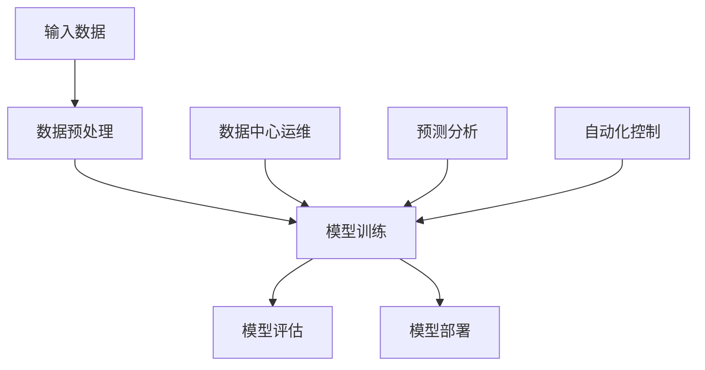

                 


# AI 大模型应用数据中心的案例分享

> 关键词：人工智能、大模型、数据中心、应用案例、架构设计、优化策略、数据处理

> 摘要：本文将探讨人工智能大模型在数据中心的应用案例，从背景介绍、核心概念与联系、算法原理、数学模型、项目实战、实际应用场景等多个维度深入分析，旨在为读者提供一份详尽的技术分享。文章将带领读者了解大模型在数据中心中的重要作用，以及如何通过优化策略和高效的数据处理技术提升模型的性能和应用效果。

## 1. 背景介绍

### 1.1 目的和范围

本文旨在探讨人工智能大模型在数据中心的应用案例，分析其在数据处理、预测分析、自动化控制等方面的优势，并分享实际应用中的经验和优化策略。文章将涵盖以下内容：

- 大模型在数据中心的应用背景和意义
- 大模型的核心概念和架构设计
- 大模型的算法原理和数学模型
- 大模型的项目实战案例
- 大模型在不同应用场景的实际效果
- 大模型未来的发展趋势与挑战

### 1.2 预期读者

本文面向以下读者群体：

- 数据中心架构师和工程师
- 人工智能算法工程师和研究人员
- 对人工智能大模型应用感兴趣的学者和从业者
- 数据科学和机器学习领域的从业人员

### 1.3 文档结构概述

本文共分为10个部分，具体结构如下：

1. 背景介绍
   - 1.1 目的和范围
   - 1.2 预期读者
   - 1.3 文档结构概述
   - 1.4 术语表
2. 核心概念与联系
   - 2.1 大模型定义与分类
   - 2.2 大模型架构设计
   - 2.3 大模型应用场景分析
3. 核心算法原理 & 具体操作步骤
   - 3.1 算法原理概述
   - 3.2 具体操作步骤详解
4. 数学模型和公式 & 详细讲解 & 举例说明
   - 4.1 数学模型概述
   - 4.2 公式讲解
   - 4.3 举例说明
5. 项目实战：代码实际案例和详细解释说明
   - 5.1 开发环境搭建
   - 5.2 源代码详细实现和代码解读
   - 5.3 代码解读与分析
6. 实际应用场景
   - 6.1 数据中心运维
   - 6.2 预测分析
   - 6.3 自动化控制
7. 工具和资源推荐
   - 7.1 学习资源推荐
   - 7.2 开发工具框架推荐
   - 7.3 相关论文著作推荐
8. 总结：未来发展趋势与挑战
9. 附录：常见问题与解答
10. 扩展阅读 & 参考资料

### 1.4 术语表

#### 1.4.1 核心术语定义

- 大模型：指具有海量参数、能够处理复杂数据和任务的深度学习模型。
- 数据中心：指用于存储、处理和管理数据的集中式设施。
- 深度学习：一种基于人工神经网络的机器学习方法，通过多层神经网络来模拟人脑学习和决策过程。
- 训练数据集：用于训练深度学习模型的原始数据集合。
- 验证数据集：用于评估模型性能的独立数据集合。
- 测试数据集：用于测试模型泛化能力的独立数据集合。

#### 1.4.2 相关概念解释

- 批处理（Batch Processing）：指将数据分成若干批次进行处理，以提升数据处理效率。
- 流处理（Stream Processing）：指对实时数据流进行处理，以实现实时分析和决策。
- 数据清洗（Data Cleaning）：指对数据进行预处理，以消除错误、异常值和噪声。
- 数据增强（Data Augmentation）：指通过增加数据的多样性来提升模型的泛化能力。

#### 1.4.3 缩略词列表

- AI：人工智能
- ML：机器学习
- DL：深度学习
- GPU：图形处理器
- TPU：张量处理器
- HPC：高性能计算
- SLA：服务等级协议
- SSD：固态硬盘
- NVMe：非易失性内存表达

## 2. 核心概念与联系

在本节中，我们将介绍人工智能大模型的基本概念和关键联系，包括大模型的定义、分类、架构设计以及应用场景。

### 2.1 大模型定义与分类

大模型（Large-scale Model）是指具有海量参数的深度学习模型，通常用于处理大规模、高维度、复杂数据。大模型在计算机视觉、自然语言处理、语音识别等领域取得了显著的成果。根据模型规模和应用领域，大模型可以分为以下几类：

1. 计算机视觉大模型：如GAN、VGG、ResNet等，用于图像分类、目标检测、图像生成等任务。
2. 自然语言处理大模型：如BERT、GPT、ELMo等，用于文本分类、情感分析、机器翻译等任务。
3. 语音识别大模型：如DNN、CTC、GRU等，用于语音信号处理、语音识别、语音合成等任务。

### 2.2 大模型架构设计

大模型架构设计是确保模型性能、计算效率和可扩展性的关键。常见的架构设计包括：

1. 网络架构：如卷积神经网络（CNN）、循环神经网络（RNN）、Transformer等，针对不同任务特点设计合适的网络结构。
2. 激活函数：如ReLU、Sigmoid、Tanh等，用于引入非线性变换，提升模型表达能力。
3. 正则化方法：如Dropout、L1/L2正则化、数据增强等，用于防止过拟合，提高模型泛化能力。
4. 训练策略：如批量归一化（Batch Normalization）、学习率调整、梯度裁剪等，用于优化模型训练过程。

### 2.3 大模型应用场景分析

大模型在数据中心的应用场景广泛，主要包括以下几个方面：

1. 数据中心运维：如性能监控、资源调度、故障预测等，通过大模型实现自动化、智能化的运维管理。
2. 预测分析：如负载预测、能耗预测、容量规划等，通过大模型实现数据驱动的决策支持。
3. 自动化控制：如服务器冷却、电力管理、网络优化等，通过大模型实现实时、自适应的自动化控制。

### 2.4 大模型架构与联系的 Mermaid 流程图

以下是一个简化的Mermaid流程图，展示大模型的基本架构与联系：



在这个流程图中，输入数据经过预处理后进入模型训练阶段，训练过程中包括模型评估和模型部署。大模型在数据中心的不同应用场景中发挥作用，如运维、预测分析和自动化控制等。

## 3. 核心算法原理 & 具体操作步骤

### 3.1 算法原理概述

大模型的核心算法原理主要包括以下几个方面：

1. 深度学习算法：如卷积神经网络（CNN）、循环神经网络（RNN）、Transformer等，用于处理复杂数据和任务。
2. 优化算法：如梯度下降（GD）、随机梯度下降（SGD）、Adam等，用于调整模型参数，优化模型性能。
3. 正则化方法：如Dropout、L1/L2正则化、数据增强等，用于防止过拟合，提高模型泛化能力。

### 3.2 具体操作步骤详解

以下是一个基于深度学习算法的大模型训练流程，包括数据预处理、模型训练、模型评估和模型部署等步骤：

#### 3.2.1 数据预处理

数据预处理是模型训练的第一步，主要包括以下步骤：

1. 数据清洗：去除错误、异常值和噪声，确保数据质量。
2. 数据增强：通过旋转、缩放、裁剪等操作增加数据的多样性，提升模型泛化能力。
3. 数据归一化：将数据缩放到特定范围，如[0, 1]，以加快收敛速度。
4. 数据集划分：将数据集分为训练集、验证集和测试集，用于训练、评估和测试模型。

#### 3.2.2 模型训练

模型训练是核心步骤，主要包括以下操作：

1. 定义模型结构：根据任务需求设计合适的网络结构，如CNN、RNN、Transformer等。
2. 初始化参数：随机初始化模型参数，如权重和偏置。
3. 训练过程：迭代更新模型参数，最小化损失函数，如交叉熵损失、均方误差等。
   - 计算损失值：计算当前模型参数下的损失函数值。
   - 计算梯度：根据损失函数对模型参数求梯度。
   - 更新参数：利用梯度下降等优化算法更新模型参数。
4. 模型评估：在验证集上评估模型性能，调整模型结构和超参数，防止过拟合。

#### 3.2.3 模型评估

模型评估是确保模型性能的关键步骤，主要包括以下操作：

1. 验证集评估：在验证集上评估模型性能，计算准确率、召回率、F1值等指标。
2. 测试集评估：在测试集上评估模型性能，评估模型泛化能力。
3. 模型优化：根据评估结果调整模型结构和超参数，优化模型性能。

#### 3.2.4 模型部署

模型部署是将训练好的模型应用于实际任务的关键步骤，主要包括以下操作：

1. 模型转换：将训练好的模型转换为推理引擎可执行的形式，如TensorFlow Lite、PyTorch Lite等。
2. 模型部署：将模型部署到服务器、边缘设备或移动设备上，提供实时推理服务。
3. 性能优化：针对不同部署环境，进行模型压缩、量化、并行计算等优化操作，提高模型推理速度和效率。

### 3.3 伪代码示例

以下是一个基于深度学习算法的大模型训练的伪代码示例：

```python
# 数据预处理
def preprocess_data(data):
    # 数据清洗
    clean_data = clean(data)
    # 数据增强
    augmented_data = augment(clean_data)
    # 数据归一化
    normalized_data = normalize(augmented_data)
    return normalized_data

# 模型训练
def train_model(data, labels):
    # 初始化模型参数
    params = initialize_params()
    # 定义损失函数
    loss_function = cross_entropy_loss
    # 定义优化算法
    optimizer = optimizer_function(params)
    # 训练过程
    for epoch in range(num_epochs):
        for batch in data_loader(data, labels):
            # 计算损失值
            loss = loss_function(batch, params)
            # 计算梯度
            gradients = compute_gradients(loss, params)
            # 更新参数
            optimizer.update_params(gradients)
    return params

# 模型评估
def evaluate_model(model, data, labels):
    # 计算准确率、召回率、F1值等指标
    metrics = compute_metrics(model, data, labels)
    return metrics

# 模型部署
def deploy_model(model):
    # 模型转换
    model = convert_model(model)
    # 模型部署
    model = deploy_model(model)
    return model
```

## 4. 数学模型和公式 & 详细讲解 & 举例说明

### 4.1 数学模型概述

在本节中，我们将介绍大模型中的几个关键数学模型，包括损失函数、优化算法和正则化方法。这些数学模型是理解大模型训练过程的基础。

### 4.2 损失函数

损失函数是衡量模型预测结果与真实标签之间差异的指标。常见的损失函数有：

1. 交叉熵损失（Cross-Entropy Loss）
2. 均方误差（Mean Squared Error, MSE）
3. 对数损失（Log-Loss）

#### 4.2.1 交叉熵损失

交叉熵损失常用于分类问题，其公式为：

$$
L_{CE} = -\sum_{i=1}^{n} y_i \log(p_i)
$$

其中，$y_i$ 是真实标签，$p_i$ 是模型预测概率。

#### 4.2.2 均方误差

均方误差常用于回归问题，其公式为：

$$
L_{MSE} = \frac{1}{n} \sum_{i=1}^{n} (y_i - \hat{y}_i)^2
$$

其中，$y_i$ 是真实值，$\hat{y}_i$ 是模型预测值。

#### 4.2.3 对数损失

对数损失也常用于分类问题，其公式为：

$$
L_{LL} = -\sum_{i=1}^{n} y_i \log(\hat{y}_i)
$$

其中，$y_i$ 是真实标签，$\hat{y}_i$ 是模型预测概率。

### 4.3 优化算法

优化算法用于调整模型参数，以最小化损失函数。常见的优化算法有：

1. 梯度下降（Gradient Descent）
2. 随机梯度下降（Stochastic Gradient Descent, SGD）
3. Adam

#### 4.3.1 梯度下降

梯度下降的基本思想是沿损失函数的负梯度方向更新参数，其公式为：

$$
\theta_{t+1} = \theta_{t} - \alpha \nabla_{\theta} J(\theta)
$$

其中，$\theta$ 是模型参数，$J(\theta)$ 是损失函数，$\alpha$ 是学习率。

#### 4.3.2 随机梯度下降

随机梯度下降是对梯度下降的改进，每次迭代只使用一个样本来更新参数，其公式为：

$$
\theta_{t+1} = \theta_{t} - \alpha \nabla_{\theta} J(\theta; x_i, y_i)
$$

其中，$x_i, y_i$ 是单个样本及其标签。

#### 4.3.3 Adam

Adam是一种结合了SGD和动量法的优化算法，其公式为：

$$
\theta_{t+1} = \theta_{t} - \alpha \frac{m_t}{1 - \beta_1^t} \nabla_{\theta} J(\theta)
$$

其中，$m_t = \beta_1 \nabla_{\theta} J(\theta)$ 是一阶矩估计，$v_t = \beta_2 m_t^2$ 是二阶矩估计，$\beta_1, \beta_2$ 分别是动量因子。

### 4.4 正则化方法

正则化方法用于防止模型过拟合，提高泛化能力。常见的方法有：

1. Dropout
2. L1正则化
3. L2正则化

#### 4.4.1 Dropout

Dropout是一种在训练过程中随机丢弃一部分神经元的方法，其公式为：

$$
\text{dropout rate} = \frac{\text{number of neurons dropped}}{\text{total number of neurons}}
$$

#### 4.4.2 L1正则化

L1正则化是在损失函数中添加L1范数项，其公式为：

$$
J(\theta) = J_0(\theta) + \lambda ||\theta||
$$

其中，$||\theta||_1 = \sum_{i=1}^{n} |\theta_i|$。

#### 4.4.3 L2正则化

L2正则化是在损失函数中添加L2范数项，其公式为：

$$
J(\theta) = J_0(\theta) + \lambda ||\theta||^2
$$

其中，$||\theta||_2 = \sqrt{\sum_{i=1}^{n} \theta_i^2}$。

### 4.5 举例说明

假设我们有一个简单的神经网络，用于二分类任务，输入为 $x = [x_1, x_2]$, 输出为 $y \in \{0, 1\}$。我们使用交叉熵损失函数和Adam优化算法来训练模型。

1. **损失函数：**

   $$ L_{CE} = -[y \log(p) + (1 - y) \log(1 - p)] $$

   其中，$p$ 是模型预测概率。

2. **优化算法：**

   $$ \theta_{t+1} = \theta_{t} - \alpha \nabla_{\theta} L_{CE} $$

   使用Adam优化算法，我们有：

   $$ m_t = \beta_1 \nabla_{\theta} L_{CE} $$
   $$ v_t = \beta_2 m_t^2 $$
   $$ \theta_{t+1} = \theta_{t} - \alpha \frac{m_t}{1 - \beta_1^t} \nabla_{\theta} L_{CE} $$

3. **正则化方法：**

   我们添加L2正则化项到损失函数中：

   $$ J(\theta) = L_{CE} + \lambda ||\theta||^2 $$

## 5. 项目实战：代码实际案例和详细解释说明

### 5.1 开发环境搭建

在本节中，我们将介绍如何搭建一个用于大模型训练的开发环境。我们选择Python作为编程语言，并使用TensorFlow作为深度学习框架。

#### 5.1.1 环境准备

1. 安装Python（版本3.6及以上）
2. 安装Anaconda或Miniconda
3. 使用conda创建新的虚拟环境

   ```shell
   conda create -n myenv python=3.8
   conda activate myenv
   ```

4. 安装TensorFlow

   ```shell
   pip install tensorflow
   ```

#### 5.1.2 数据集准备

1. 下载并解压MNIST数据集

   ```shell
   wget https://www.cs.toronto.edu/~ajLane/mnist/mnist.pkl.gz
   gunzip mnist.pkl.gz
   ```

2. 加载MNIST数据集

   ```python
   import numpy as np
   import pickle

   with open('mnist.pkl', 'rb') as f:
       train_data, val_data, test_data = pickle.load(f, encoding='bytes')
   ```

   其中，`train_data`、`val_data` 和 `test_data` 分别为训练集、验证集和测试集。

### 5.2 源代码详细实现和代码解读

#### 5.2.1 模型定义

我们使用TensorFlow中的`tf.keras.Sequential`模型定义一个简单的全连接神经网络，用于MNIST手写数字分类。

```python
import tensorflow as tf
from tensorflow.keras import layers, models

model = models.Sequential([
    layers.Dense(128, activation='relu', input_shape=(784,)),
    layers.Dense(10, activation='softmax')
])
```

在这个模型中，输入层有784个神经元，对应MNIST图像的784个像素值。第一个隐藏层有128个神经元，使用ReLU激活函数。输出层有10个神经元，对应10个可能的分类结果，使用softmax激活函数。

#### 5.2.2 模型编译

在编译模型时，我们需要指定损失函数、优化器和评估指标。

```python
model.compile(optimizer='adam',
              loss='sparse_categorical_crossentropy',
              metrics=['accuracy'])
```

这里我们使用Adam优化器，交叉熵损失函数和准确率作为评估指标。

#### 5.2.3 模型训练

训练模型前，我们需要将数据集格式化为模型所需的格式。

```python
x_train, y_train = train_data[0].reshape(-1, 784), train_data[1]
x_val, y_val = val_data[0].reshape(-1, 784), val_data[1]

model.fit(x_train, y_train, epochs=5, batch_size=32, validation_data=(x_val, y_val))
```

这里我们使用5个训练周期，批量大小为32。

#### 5.2.4 模型评估

训练完成后，我们可以评估模型在测试集上的性能。

```python
x_test, y_test = test_data[0].reshape(-1, 784), test_data[1]
test_loss, test_acc = model.evaluate(x_test, y_test)
print(f"Test accuracy: {test_acc:.2f}")
```

### 5.3 代码解读与分析

#### 5.3.1 模型定义

在代码中，我们使用`Sequential`模型定义了一个简单的全连接神经网络。`Sequential`模型是一个线性堆叠的层，适合简单的模型定义。对于更复杂的模型，我们可以使用`Functional`模型。

#### 5.3.2 模型编译

在编译模型时，我们需要指定损失函数、优化器和评估指标。这里我们使用`sparse_categorical_crossentropy`作为损失函数，适用于标签为整数的分类问题。`adam`优化器使用默认参数，适用于大多数问题。`accuracy`指标用于评估模型的分类准确率。

#### 5.3.3 模型训练

在训练模型时，我们使用`fit`方法，传入训练数据和验证数据。`epochs`参数指定训练周期数，`batch_size`参数指定每个批次的样本数量。`validation_data`参数用于在验证集上评估模型性能。

#### 5.3.4 模型评估

在训练完成后，我们使用`evaluate`方法评估模型在测试集上的性能。`evaluate`方法返回损失值和评估指标，如准确率。

## 6. 实际应用场景

### 6.1 数据中心运维

在数据中心运维中，大模型可以用于以下方面：

- **性能监控**：通过分析服务器、存储、网络等设备的运行数据，预测性能瓶颈，优化资源配置。
- **故障预测**：利用历史故障数据，预测设备故障，提前进行维护，降低故障风险。
- **资源调度**：根据业务需求，动态调整资源分配，提高资源利用率。

### 6.2 预测分析

在预测分析中，大模型可以用于以下方面：

- **负载预测**：预测数据中心在未来一段时间内的负载情况，为资源规划提供参考。
- **能耗预测**：预测数据中心在未来一段时间内的能耗情况，为节能措施提供参考。
- **容量规划**：根据业务增长趋势，预测未来数据中心容量需求，制定合理的容量规划策略。

### 6.3 自动化控制

在自动化控制中，大模型可以用于以下方面：

- **服务器冷却**：通过监测服务器温度和功耗，预测冷却系统的运行状态，调整冷却系统参数，实现节能控制。
- **电力管理**：通过监测电力系统的运行数据，预测电力消耗，优化电力分配，降低能源成本。
- **网络优化**：通过分析网络流量数据，预测网络瓶颈，优化网络拓扑结构，提高网络性能。

## 7. 工具和资源推荐

### 7.1 学习资源推荐

#### 7.1.1 书籍推荐

- 《深度学习》（Goodfellow, Bengio, Courville著）：系统介绍了深度学习的基础理论和应用。
- 《Python深度学习》（François Chollet著）：通过实战案例，介绍了如何使用Python和TensorFlow进行深度学习。

#### 7.1.2 在线课程

- Coursera的《深度学习》课程：由吴恩达教授主讲，涵盖了深度学习的基础理论和应用。
- edX的《神经网络与深度学习》课程：由李飞飞教授主讲，介绍了深度学习的基本概念和应用。

#### 7.1.3 技术博客和网站

- TensorFlow官网（https://www.tensorflow.org/）：提供了丰富的深度学习资源和教程。
- Medium上的深度学习相关博客：如Distill、AI Wisdom等，提供了深度学习的最新研究和技术分享。

### 7.2 开发工具框架推荐

#### 7.2.1 IDE和编辑器

- PyCharm：一款功能强大的Python IDE，适合深度学习开发。
- Jupyter Notebook：一款基于Web的交互式开发环境，方便数据可视化和代码调试。

#### 7.2.2 调试和性能分析工具

- TensorFlow Debugger（TFDB）：用于调试TensorFlow模型。
- TensorBoard：用于可视化TensorFlow模型的训练过程。

#### 7.2.3 相关框架和库

- TensorFlow：用于构建和训练深度学习模型的框架。
- Keras：基于TensorFlow的高层API，简化了深度学习模型搭建。
- NumPy：用于处理数学计算和数组操作。

### 7.3 相关论文著作推荐

#### 7.3.1 经典论文

- "A Theoretically Grounded Application of Dropout in Recurrent Neural Networks"（Yarin Gal和Zoubin Ghahramani著）：提出了在RNN中使用Dropout的方法，提高了模型的泛化能力。
- "Effective Approaches to Attention-based Neural Machine Translation"（Minh-Thang Luong等著）：介绍了基于注意力机制的神经机器翻译模型，提升了翻译质量。

#### 7.3.2 最新研究成果

- "BERT: Pre-training of Deep Bidirectional Transformers for Language Understanding"（Jacob Devlin等著）：提出了BERT模型，大幅提升了自然语言处理任务的性能。
- "GPT-3: Language Models are Few-Shot Learners"（Tom B. Brown等著）：展示了GPT-3模型在零样本和少样本学习任务中的强大能力。

#### 7.3.3 应用案例分析

- "Deep Learning for Data Centers: A Survey"（R. Sakthi Sravana等著）：总结了深度学习在数据中心应用的研究进展和案例。
- "Deep Neural Network Based Power Saving in Data Centers"（Rashmi Gupta等著）：介绍了利用深度学习模型优化数据中心电力管理的案例。

## 8. 总结：未来发展趋势与挑战

### 8.1 未来发展趋势

1. **模型规模将进一步扩大**：随着计算能力和数据量的增长，大模型将进一步扩大规模，以处理更复杂数据和任务。
2. **多模态数据处理能力提升**：大模型将具备更强的多模态数据处理能力，能够同时处理文本、图像、音频等多种类型的数据。
3. **边缘计算与云计算的融合**：大模型将更好地适应边缘计算环境，实现云计算与边缘计算的无缝融合。
4. **自动化运维与智能决策**：大模型将应用于数据中心运维和预测分析，实现自动化、智能化的运营和管理。

### 8.2 未来挑战

1. **计算资源需求**：大模型训练和推理对计算资源的需求将持续增长，如何高效利用计算资源成为一个挑战。
2. **数据隐私与安全**：大模型应用过程中涉及大量敏感数据，如何保护数据隐私和安全成为关键问题。
3. **模型解释性**：大模型具有复杂的内部结构，如何解释模型的决策过程，提高模型的可解释性是一个挑战。
4. **伦理与社会影响**：随着大模型在各个领域的应用，如何确保其伦理和社会影响成为重要议题。

## 9. 附录：常见问题与解答

### 9.1 问题1：大模型训练需要哪些计算资源？

解答：大模型训练通常需要高性能计算资源，包括：

- **计算能力**：如GPU（图形处理器）或TPU（张量处理器）。
- **存储容量**：大模型训练过程中会产生大量中间数据和模型参数，需要足够的存储空间。
- **网络带宽**：用于传输大量数据和模型。

### 9.2 问题2：如何防止大模型过拟合？

解答：防止大模型过拟合的方法包括：

- **数据增强**：通过增加数据的多样性来提升模型泛化能力。
- **正则化**：如L1、L2正则化和Dropout，用于防止模型过拟合。
- **交叉验证**：通过交叉验证来评估模型性能，防止过拟合。

### 9.3 问题3：大模型应用在数据中心有哪些挑战？

解答：大模型应用在数据中心面临的挑战包括：

- **计算资源需求**：大模型训练和推理需要大量计算资源，如何高效利用资源成为挑战。
- **数据隐私与安全**：大模型应用过程中涉及大量敏感数据，如何保护数据隐私和安全成为关键问题。
- **模型解释性**：大模型具有复杂的内部结构，如何解释模型的决策过程，提高模型的可解释性是一个挑战。

## 10. 扩展阅读 & 参考资料

### 10.1 扩展阅读

- 《深度学习》（Goodfellow, Bengio, Courville著）
- 《Python深度学习》（François Chollet著）
- "Deep Learning for Data Centers: A Survey"（R. Sakthi Sravana等著）
- "Deep Neural Network Based Power Saving in Data Centers"（Rashmi Gupta等著）

### 10.2 参考资料

- TensorFlow官网（https://www.tensorflow.org/）
- Coursera的《深度学习》课程（https://www.coursera.org/learn/deep-learning）
- edX的《神经网络与深度学习》课程（https://www.edx.org/course/neural-networks-and-deep-learning）
- BERT论文（https://arxiv.org/abs/1810.04805）
- GPT-3论文（https://arxiv.org/abs/2005.14165）

