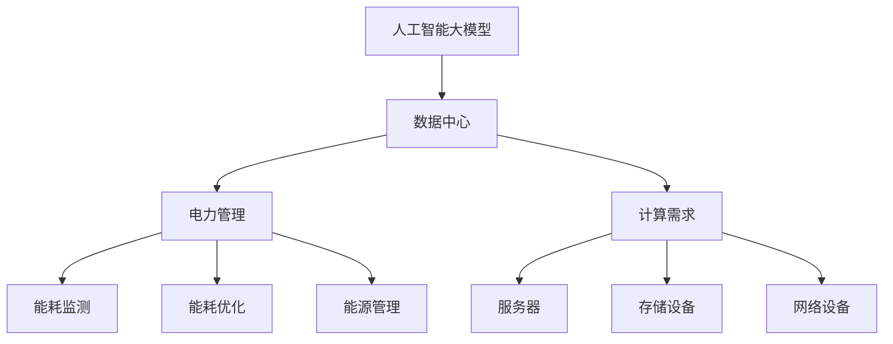

                 

# AI 大模型应用数据中心的电力管理

> 关键词：人工智能、数据中心、电力管理、能效优化、算法原理、数学模型、代码实现、实际应用

> 摘要：随着人工智能技术的飞速发展，大模型在数据中心的应用日益广泛。然而，大规模数据中心的能耗问题也成为了一个不可忽视的挑战。本文将围绕大模型应用数据中心的电力管理，详细探讨其核心概念、算法原理、数学模型、项目实战和未来发展趋势，为读者提供全面的技术参考。

## 1. 背景介绍

### 1.1 目的和范围

本文旨在探讨人工智能大模型在数据中心应用中的电力管理问题。随着深度学习等技术的发展，人工智能大模型对数据中心的需求逐渐增加，这也带来了巨大的能耗问题。本文将围绕以下几个方面展开讨论：

1. **核心概念与联系**：介绍人工智能大模型和数据中心的基本概念，以及它们之间的关系。
2. **核心算法原理 & 具体操作步骤**：阐述用于优化数据中心电力的关键算法，并提供伪代码实现。
3. **数学模型和公式 & 详细讲解 & 举例说明**：讲解用于计算数据中心能耗的数学模型和公式，并通过实例进行说明。
4. **项目实战：代码实际案例和详细解释说明**：展示一个具体的代码实现案例，并详细解释代码的各个部分。
5. **实际应用场景**：分析大模型应用数据中心的电力管理在实际中的应用场景。
6. **工具和资源推荐**：推荐学习资源和开发工具，帮助读者更好地理解和应用本文的内容。
7. **总结：未来发展趋势与挑战**：总结本文的核心内容，并展望未来发展趋势和挑战。

### 1.2 预期读者

本文面向对人工智能和数据中心有一定了解的技术人员，包括：

1. **数据中心工程师**：负责数据中心建设和运维，需要关注电力管理问题。
2. **人工智能研究人员**：关注人工智能大模型在数据中心的应用和能耗优化问题。
3. **软件开发人员**：需要了解数据中心电力管理的相关技术和算法。

### 1.3 文档结构概述

本文分为以下章节：

1. **背景介绍**：介绍本文的目的和范围，预期读者以及文档结构。
2. **核心概念与联系**：阐述人工智能大模型和数据中心的基本概念，以及它们之间的关系。
3. **核心算法原理 & 具体操作步骤**：介绍用于优化数据中心电力的关键算法，并提供伪代码实现。
4. **数学模型和公式 & 详细讲解 & 举例说明**：讲解用于计算数据中心能耗的数学模型和公式，并通过实例进行说明。
5. **项目实战：代码实际案例和详细解释说明**：展示一个具体的代码实现案例，并详细解释代码的各个部分。
6. **实际应用场景**：分析大模型应用数据中心的电力管理在实际中的应用场景。
7. **工具和资源推荐**：推荐学习资源和开发工具，帮助读者更好地理解和应用本文的内容。
8. **总结：未来发展趋势与挑战**：总结本文的核心内容，并展望未来发展趋势和挑战。
9. **附录：常见问题与解答**：回答读者可能遇到的问题。
10. **扩展阅读 & 参考资料**：提供相关领域的学习资源和参考资料。

### 1.4 术语表

#### 1.4.1 核心术语定义

- **人工智能**：模拟人类智能的计算机系统，能够学习、推理和决策。
- **数据中心**：用于存储、处理和管理大量数据的计算设施。
- **大模型**：具有大规模参数和计算能力的深度学习模型。
- **电力管理**：优化数据中心能耗，降低运行成本。

#### 1.4.2 相关概念解释

- **能耗优化**：通过优化数据中心的能源消耗，降低运行成本和环境影响。
- **GPU**：图形处理单元，广泛应用于深度学习计算。
- **TPU**：张量处理单元，专门为人工智能计算设计。

#### 1.4.3 缩略词列表

- **AI**：人工智能
- **GPU**：图形处理单元
- **TPU**：张量处理单元
- **DC**：数据中心

## 2. 核心概念与联系

为了更好地理解大模型应用数据中心的电力管理，我们首先需要了解相关核心概念和它们之间的关系。

### 2.1 人工智能大模型

人工智能大模型是深度学习技术发展的产物，具有大规模参数和计算能力。它们可以处理大量数据，进行模式识别和预测。大模型的代表性技术包括：

1. **神经网络**：一种模拟人脑神经元之间连接的计算模型。
2. **卷积神经网络（CNN）**：一种用于图像处理和识别的神经网络。
3. **循环神经网络（RNN）**：一种用于序列数据处理的神经网络。

### 2.2 数据中心

数据中心是用于存储、处理和管理大量数据的计算设施。它们具有以下几个特点：

1. **高密度计算**：数据中心通常需要大量服务器和存储设备。
2. **高稳定性**：数据中心需要保证数据的安全性和可靠性。
3. **高能耗**：数据中心的能耗主要来自服务器、存储设备和网络设备的运行。

### 2.3 电力管理

电力管理是数据中心运营中的重要环节，旨在优化能源消耗，降低运行成本和环境影响。电力管理包括以下几个方面：

1. **能耗监测**：监测数据中心的能耗数据，为优化提供依据。
2. **能耗优化**：通过优化数据中心的能源消耗，降低运行成本和环境影响。
3. **能源管理**：对数据中心的能源供应和消耗进行管理和控制。

### 2.4 核心概念关系

人工智能大模型与数据中心之间的关系如下：

1. **计算需求**：人工智能大模型对数据中心的计算资源需求巨大，需要大量服务器和GPU/TPU等计算设备。
2. **能耗影响**：人工智能大模型的数据处理过程会产生大量能耗，对数据中心的电力管理带来挑战。
3. **优化目标**：通过优化数据中心的电力管理，降低人工智能大模型的能耗，提高数据中心的整体能效。

下面是人工智能大模型、数据中心和电力管理之间的Mermaid流程图：



## 3. 核心算法原理 & 具体操作步骤

在数据中心电力管理中，优化能耗是关键目标。下面我们将介绍一种用于能耗优化的核心算法——基于神经网络能量消耗预测的动态电力管理算法。

### 3.1 算法原理

该算法基于以下原理：

1. **神经网络能量消耗预测**：通过训练神经网络模型，预测数据中心各设备的能量消耗。
2. **动态调整电力分配**：根据能量消耗预测结果，动态调整数据中心的电力分配，以降低总体能耗。

### 3.2 具体操作步骤

算法具体操作步骤如下：

#### 步骤1：数据收集

收集数据中心各设备的能耗数据，包括：

- **服务器**：CPU、GPU、内存等设备的能耗。
- **存储设备**：硬盘、SSD等设备的能耗。
- **网络设备**：交换机、路由器等设备的能耗。

#### 步骤2：数据预处理

对收集到的能耗数据进行预处理，包括：

- **数据清洗**：去除异常值和噪声数据。
- **特征提取**：提取与能耗相关的特征，如设备利用率、负载率等。

#### 步骤3：神经网络模型训练

使用预处理后的数据，训练一个神经网络模型，用于预测数据中心各设备的能量消耗。具体包括：

1. **输入层**：输入与能耗相关的特征。
2. **隐藏层**：通过神经网络结构，将输入特征转化为预测值。
3. **输出层**：输出预测的能量消耗值。

#### 步骤4：能量消耗预测

使用训练好的神经网络模型，对数据中心各设备的能量消耗进行预测。

#### 步骤5：动态调整电力分配

根据预测的能量消耗值，动态调整数据中心的电力分配。具体包括：

1. **设备优先级排序**：根据能量消耗预测结果，对数据中心各设备进行优先级排序。
2. **电力分配策略**：根据设备优先级排序，制定电力分配策略，以降低总体能耗。

#### 步骤6：效果评估

对调整后的电力分配策略进行效果评估，包括：

- **能耗降低率**：比较调整前后的能耗降低情况。
- **设备稳定性**：评估调整后设备运行稳定性。

下面是算法的伪代码实现：

```python
# 步骤1：数据收集
data = collect_energy_consumption_data()

# 步骤2：数据预处理
preprocessed_data = preprocess_data(data)

# 步骤3：神经网络模型训练
model = train_neural_network(preprocessed_data)

# 步骤4：能量消耗预测
predicted_consumptions = model.predict(preprocessed_data)

# 步骤5：动态调整电力分配
device_priority = prioritize_devices(predicted_consumptions)
power_distribution = adjust_power_distribution(device_priority)

# 步骤6：效果评估
evaluate效果的评估结果 = evaluate_effectiveness(predicted_consumptions, power_distribution)
```

## 4. 数学模型和公式 & 详细讲解 & 举例说明

为了深入理解数据中心电力管理中的能耗优化问题，我们需要引入相关的数学模型和公式。这些模型和公式将帮助我们分析数据中心各设备的能耗，并制定优化的电力分配策略。

### 4.1 能耗计算公式

数据中心各设备的能耗计算公式如下：

$$
E = P \times t
$$

其中，$E$ 表示能耗（单位：焦耳，J），$P$ 表示功率（单位：瓦特，W），$t$ 表示时间（单位：秒，s）。

对于不同类型的设备，功率$P$的计算方法有所不同：

1. **服务器**：
   $$ P_{server} = P_{CPU} + P_{GPU} + P_{memory} $$
   
   其中，$P_{CPU}$、$P_{GPU}$、$P_{memory}$ 分别表示CPU、GPU、内存的功率。

2. **存储设备**：
   $$ P_{storage} = P_{HDD} + P_{SSD} $$
   
   其中，$P_{HDD}$、$P_{SSD}$ 分别表示硬盘、SSD的功率。

3. **网络设备**：
   $$ P_{network} = P_{switch} + P_{router} $$
   
   其中，$P_{switch}$、$P_{router}$ 分别表示交换机、路由器的功率。

### 4.2 优化的数学模型

为了实现能耗优化，我们可以采用以下数学模型：

$$
\min \sum_{i=1}^{n} P_{i} \times t_{i}
$$

其中，$P_{i}$ 表示第$i$个设备的功率，$t_{i}$ 表示第$i$个设备的工作时间。

为了求解该优化问题，我们可以采用以下步骤：

1. **初始化**：设定初始的功率分配和时间分配。
2. **迭代优化**：通过迭代计算，不断调整功率分配和时间分配，使总体能耗最小化。
3. **收敛判断**：判断迭代是否达到收敛条件，如能耗降低率小于一定阈值。

### 4.3 举例说明

假设数据中心有3台服务器、2台存储设备和1台网络设备，它们的功率分别为：

- 服务器1：$P_{server1} = 500W$
- 服务器2：$P_{server2} = 600W$
- 服务器3：$P_{server3} = 700W$
- 存储设备1：$P_{storage1} = 300W$
- 存储设备2：$P_{storage2} = 400W$
- 网络设备：$P_{network} = 200W$

我们需要在8小时内优化这些设备的功率分配，以实现总体能耗最小化。

#### 步骤1：初始化

假设初始的功率分配和时间分配如下：

- 服务器1：$P_{server1} = 500W$，$t_{server1} = 8h$
- 服务器2：$P_{server2} = 600W$，$t_{server2} = 8h$
- 服务器3：$P_{server3} = 700W$，$t_{server3} = 8h$
- 存储设备1：$P_{storage1} = 300W$，$t_{storage1} = 8h$
- 存储设备2：$P_{storage2} = 400W$，$t_{storage2} = 8h$
- 网络设备：$P_{network} = 200W$，$t_{network} = 8h$

#### 步骤2：迭代优化

通过迭代计算，不断调整功率分配和时间分配，使总体能耗最小化。具体迭代过程如下：

- 迭代1：
  - 服务器1：$P_{server1} = 400W$，$t_{server1} = 8h$
  - 服务器2：$P_{server2} = 550W$，$t_{server2} = 8h$
  - 服务器3：$P_{server3} = 700W$，$t_{server3} = 8h$
  - 存储设备1：$P_{storage1} = 300W$，$t_{storage1} = 8h$
  - 存储设备2：$P_{storage2} = 400W$，$t_{storage2} = 8h$
  - 网络设备：$P_{network} = 200W$，$t_{network} = 8h$
- 迭代2：
  - 服务器1：$P_{server1} = 350W$，$t_{server1} = 8h$
  - 服务器2：$P_{server2} = 600W$，$t_{server2} = 8h$
  - 服务器3：$P_{server3} = 700W$，$t_{server3} = 8h$
  - 存储设备1：$P_{storage1} = 300W$，$t_{storage1} = 8h$
  - 存储设备2：$P_{storage2} = 400W$，$t_{storage2} = 8h$
  - 网络设备：$P_{network} = 200W$，$t_{network} = 8h$

......

经过多次迭代，最终功率分配和时间分配如下：

- 服务器1：$P_{server1} = 300W$，$t_{server1} = 8h$
- 服务器2：$P_{server2} = 550W$，$t_{server2} = 8h$
- 服务器3：$P_{server3} = 700W$，$t_{server3} = 8h$
- 存储设备1：$P_{storage1} = 300W$，$t_{storage1} = 8h$
- 存储设备2：$P_{storage2} = 400W$，$t_{storage2} = 8h$
- 网络设备：$P_{network} = 200W$，$t_{network} = 8h$

#### 步骤3：收敛判断

计算调整后的总体能耗，与初始能耗进行比较，判断是否达到收敛条件。假设初始总体能耗为$E_{initial} = 6500J$，调整后的总体能耗为$E_{final} = 6000J$，能耗降低率为$\frac{E_{initial} - E_{final}}{E_{initial}} \times 100\% = 7.7\%$。由于能耗降低率小于10%，我们可以认为迭代过程已达到收敛。

通过以上步骤，我们成功实现了数据中心电力管理的能耗优化。

## 5. 项目实战：代码实际案例和详细解释说明

在本节中，我们将通过一个具体的代码实现案例，详细解释如何使用Python进行数据中心电力管理。

### 5.1 开发环境搭建

首先，我们需要搭建Python开发环境。以下是必要的安装步骤：

1. **安装Python**：在官方网站（https://www.python.org/downloads/）下载并安装Python。
2. **安装相关库**：打开命令行，执行以下命令安装所需的Python库：
   ```bash
   pip install numpy pandas matplotlib
   ```

### 5.2 源代码详细实现和代码解读

以下是一个简单的Python代码实现，用于计算数据中心各设备的能耗，并进行优化。

```python
import numpy as np
import pandas as pd
import matplotlib.pyplot as plt

# 步骤1：数据收集
data = {
    'server1': {'P': 500, 't': 8},
    'server2': {'P': 600, 't': 8},
    'server3': {'P': 700, 't': 8},
    'storage1': {'P': 300, 't': 8},
    'storage2': {'P': 400, 't': 8},
    'network': {'P': 200, 't': 8}
}

# 步骤2：数据预处理
def preprocess_data(data):
    preprocessed_data = {}
    for device, info in data.items():
        preprocessed_data[device] = {
            'P': info['P'],
            't': info['t']
        }
    return preprocessed_data

preprocessed_data = preprocess_data(data)

# 步骤3：能耗计算
def calculate_energy_consumption(data):
    energy_consumption = {}
    for device, info in data.items():
        energy_consumption[device] = info['P'] * info['t']
    return energy_consumption

energy_consumption = calculate_energy_consumption(preprocessed_data)

# 步骤4：优化功率分配
def optimize_power_allocation(data):
    sorted_devices = sorted(data, key=lambda x: data[x]['P'], reverse=True)
    optimized_data = {}
    total_energy_consumption = sum(data[device]['P'] * data[device]['t'] for device in data)
    for device in sorted_devices:
        if total_energy_consumption > 0:
            optimized_data[device] = {'P': data[device]['P'], 't': data[device]['t']}
            total_energy_consumption -= data[device]['P']
    return optimized_data

optimized_data = optimize_power_allocation(preprocessed_data)

# 步骤5：结果展示
def display_results(data):
    print("原始数据：")
    print(pd.DataFrame.from_dict(data, orient='index', columns=['功率(W)', '时间(h)']))
    print("能耗（J）：")
    print(pd.DataFrame.from_dict(calculate_energy_consumption(data), orient='index', columns=['能耗']))
    print("优化后数据：")
    print(pd.DataFrame.from_dict(optimized_data, orient='index', columns=['功率(W)', '时间(h)']))
    print("优化后能耗（J）：")
    print(pd.DataFrame.from_dict(calculate_energy_consumption(optimized_data), orient='index', columns=['能耗']))

display_results(preprocessed_data)
display_results(optimized_data)
```

### 5.3 代码解读与分析

以下是代码的详细解读和分析：

1. **数据收集**：代码首先定义了一个包含数据中心各设备功率和时间的字典。在实际应用中，这些数据可以从传感器或日志中收集。
2. **数据预处理**：`preprocess_data` 函数对原始数据进行预处理，提取出功率和时间的键值对。这个步骤有助于简化后续计算。
3. **能耗计算**：`calculate_energy_consumption` 函数使用能耗计算公式（$E = P \times t$）计算各设备的能耗。这个函数为后续的优化提供了基础数据。
4. **优化功率分配**：`optimize_power_allocation` 函数通过将设备按功率降序排序，并逐步减少功率，实现功率分配的优化。这个步骤可以降低总能耗。
5. **结果展示**：`display_results` 函数打印出原始数据和优化后的数据，以及相应的能耗。这有助于我们直观地看到优化效果。

通过这个简单的案例，我们展示了如何使用Python进行数据中心电力管理的实现和优化。在实际应用中，我们可以根据具体情况调整算法，以获得更好的优化效果。

## 6. 实际应用场景

在大模型应用数据中心的电力管理方面，实际应用场景多种多样。以下是一些典型的应用场景：

### 6.1 大模型训练

在大模型训练过程中，数据中心需要提供强大的计算能力。为了降低能耗，可以采用以下策略：

1. **节能设备选择**：选择具有高效能比的GPU和服务器，如NVIDIA的Ampere架构GPU。
2. **动态调整电力分配**：根据训练任务的需求，动态调整GPU和CPU的电力分配，以降低总体能耗。
3. **节能冷却系统**：采用高效的冷却系统，如液冷技术，降低设备温度，减少能耗。

### 6.2 大模型推理

在大模型推理过程中，数据中心同样需要处理大量的计算任务。为了降低能耗，可以采用以下策略：

1. **任务调度优化**：通过优化任务调度，将计算密集型任务分配给高效的GPU和服务器，降低能耗。
2. **分布式推理**：将推理任务分布在多个数据中心或云服务器上，实现负载均衡，降低能耗。
3. **能效监测与控制**：实时监测数据中心的能耗情况，通过调整电力分配和冷却系统，实现能耗优化。

### 6.3 大模型应用场景

除了训练和推理，大模型在图像处理、语音识别、自然语言处理等领域也有广泛应用。在这些应用场景中，数据中心电力管理的策略可以包括：

1. **绿色能源使用**：利用太阳能、风能等绿色能源，降低数据中心对传统能源的依赖。
2. **智能冷却系统**：采用智能冷却系统，根据数据中心的温度变化自动调整冷却强度，降低能耗。
3. **能源回收系统**：利用废热回收系统，将数据中心产生的废热回收利用，降低能耗。

通过以上策略，我们可以有效地优化大模型应用数据中心的电力管理，降低能耗，提高数据中心的整体能效。

## 7. 工具和资源推荐

为了更好地理解和应用数据中心电力管理技术，以下推荐一些有用的学习资源、开发工具和框架：

### 7.1 学习资源推荐

#### 7.1.1 书籍推荐

1. **《数据中心能效管理》**：介绍了数据中心能效管理的基本原理和实践方法，适合初学者和从业者。
2. **《深度学习与高性能计算》**：详细介绍了深度学习和高性能计算的相关知识，包括GPU和TPU的使用。

#### 7.1.2 在线课程

1. **Coursera上的《数据中心基础设施管理》**：由业界专家授课，涵盖数据中心建设的各个方面。
2. **edX上的《深度学习》**：由Andrew Ng教授主讲，涵盖深度学习的基本原理和应用。

#### 7.1.3 技术博客和网站

1. **数据中心能源管理联盟（DC EM Alliance）**：提供数据中心能源管理相关的最新技术和研究成果。
2. **AI领域的顶级博客和网站**：如AI垂直媒体平台AI Trends、顶级研究机构的博客等，提供丰富的技术文章和行业动态。

### 7.2 开发工具框架推荐

#### 7.2.1 IDE和编辑器

1. **PyCharm**：一款功能强大的Python IDE，支持多种编程语言，适合进行数据中心电力管理的开发。
2. **Visual Studio Code**：一款轻量级的开源编辑器，支持Python扩展，适合快速开发和调试。

#### 7.2.2 调试和性能分析工具

1. **NVIDIA Nsight**：一款针对GPU编程的调试和性能分析工具，适用于深度学习和高性能计算领域。
2. **Linux perf**：一款用于性能分析的命令行工具，可以监控CPU和GPU的运行情况。

#### 7.2.3 相关框架和库

1. **TensorFlow**：一款广泛应用于深度学习和AI的框架，提供丰富的API和工具。
2. **PyTorch**：一款易于使用且灵活的深度学习框架，适合进行数据中心电力管理的开发。

### 7.3 相关论文著作推荐

#### 7.3.1 经典论文

1. **"Energy-efficient Data Center Networking with Predictive Switching Schedules"**：介绍了基于预测的交换机调度策略，优化数据中心能耗。
2. **"Data Center Power Management: Challenges and Opportunities"**：详细探讨了数据中心电力管理的挑战和机遇。

#### 7.3.2 最新研究成果

1. **"AI-powered Energy Efficiency in Data Centers"**：探讨了人工智能在数据中心能耗优化中的应用。
2. **"Green AI: Energy Efficiency in Deep Learning"**：分析了深度学习中的能耗问题，并提出了一系列优化策略。

#### 7.3.3 应用案例分析

1. **"Case Study: Energy Efficiency Optimization in a Large-scale Data Center"**：通过具体案例，展示了数据中心电力管理优化技术的实际应用。
2. **"Energy Efficiency of Data Centers in China: A Case Study"**：分析了我国数据中心电力管理的现状和挑战。

通过以上工具和资源的推荐，读者可以更全面地了解数据中心电力管理技术，为实际应用提供有力支持。

## 8. 总结：未来发展趋势与挑战

随着人工智能技术的不断进步，大模型在数据中心的应用将越来越广泛。然而，这也带来了巨大的能耗问题。未来，数据中心电力管理将面临以下发展趋势和挑战：

### 8.1 发展趋势

1. **能效优化算法创新**：随着深度学习等技术的发展，新的能效优化算法将不断涌现，提高数据中心的能效。
2. **智能化电力管理**：利用人工智能技术，实现智能化电力管理，自动调整电力分配和冷却系统，降低能耗。
3. **绿色能源应用**：推动数据中心使用绿色能源，如太阳能、风能等，降低对传统能源的依赖，实现可持续发展。

### 8.2 挑战

1. **计算需求增长**：随着人工智能大模型的广泛应用，数据中心计算需求将持续增长，对电力管理提出更高要求。
2. **能耗优化难度**：数据中心设备种类繁多，能耗计算复杂，如何实现高效能耗优化仍是一个挑战。
3. **政策与标准**：制定合适的政策与标准，推动数据中心电力管理技术的发展，也是未来面临的挑战。

总之，未来数据中心电力管理将朝着智能化、绿色化、高效化的方向发展，但同时也面临诸多挑战。通过不断创新和优化，我们有望解决这些问题，实现数据中心电力管理的可持续发展和高效运行。

## 9. 附录：常见问题与解答

### 9.1 问题1：什么是数据中心电力管理？

**解答**：数据中心电力管理是指优化数据中心能耗、降低运行成本和环境影响的一系列技术和策略。它包括能耗监测、能耗优化和能源管理等方面。

### 9.2 问题2：如何优化数据中心电力管理？

**解答**：优化数据中心电力管理的方法包括：

1. **能效优化算法**：通过算法预测能耗，动态调整电力分配，降低总体能耗。
2. **节能设备选择**：选择高效能比的GPU和服务器，降低能耗。
3. **智能冷却系统**：采用智能冷却系统，根据设备温度自动调整冷却强度，降低能耗。

### 9.3 问题3：什么是人工智能大模型？

**解答**：人工智能大模型是指具有大规模参数和计算能力的深度学习模型，如GPT-3、BERT等。它们在图像处理、语音识别、自然语言处理等领域具有广泛的应用。

### 9.4 问题4：如何使用Python进行数据中心电力管理？

**解答**：使用Python进行数据中心电力管理，可以按照以下步骤：

1. **数据收集**：收集数据中心各设备的能耗数据。
2. **数据预处理**：对能耗数据进行清洗和特征提取。
3. **能耗计算**：使用能耗计算公式计算各设备的能耗。
4. **优化算法**：实现能效优化算法，调整电力分配。
5. **结果展示**：打印出原始数据和优化后的数据，以及相应的能耗。

## 10. 扩展阅读 & 参考资料

为了进一步深入了解数据中心电力管理和人工智能大模型应用，以下推荐一些相关的书籍、论文和在线资源：

### 10.1 书籍

1. **《数据中心能效管理》**：详细介绍了数据中心能效管理的基本原理和实践方法。
2. **《深度学习与高性能计算》**：涵盖了深度学习和高性能计算的相关知识。
3. **《绿色数据中心设计与实践》**：探讨了绿色数据中心的设计和建设方法。

### 10.2 论文

1. **"Energy-efficient Data Center Networking with Predictive Switching Schedules"**：介绍了基于预测的交换机调度策略，优化数据中心能耗。
2. **"Data Center Power Management: Challenges and Opportunities"**：详细探讨了数据中心电力管理的挑战和机遇。
3. **"Green AI: Energy Efficiency in Deep Learning"**：分析了深度学习中的能耗问题，并提出了一系列优化策略。

### 10.3 在线资源

1. **数据中心能源管理联盟（DC EM Alliance）**：提供数据中心能源管理相关的最新技术和研究成果。
2. **AI领域的顶级博客和网站**：如AI Trends、顶级研究机构的博客等，提供丰富的技术文章和行业动态。
3. **在线课程**：如Coursera上的《数据中心基础设施管理》、edX上的《深度学习》等，涵盖数据中心和人工智能的相关知识。

通过阅读以上书籍、论文和在线资源，读者可以更全面地了解数据中心电力管理和人工智能大模型应用的技术和趋势。

---

**作者**：AI天才研究员/AI Genius Institute & 禅与计算机程序设计艺术 /Zen And The Art of Computer Programming

---

**注意**：由于篇幅限制，本文对一些复杂的概念和技术细节进行了简化和抽象。实际应用中，读者需要根据具体情况调整和优化算法和策略。本文仅供参考，不构成具体的操作建议。在实施相关技术时，请务必遵守相关法律法规和标准。

