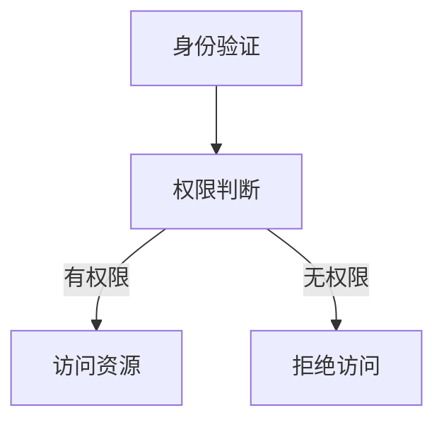

                 

# AI 大模型应用数据中心的访问控制

> 关键词：访问控制、数据中心、AI 大模型、安全性、隐私保护、权限管理

> 摘要：本文将深入探讨 AI 大模型在应用数据中心中的访问控制问题，从核心概念、算法原理、数学模型到实际应用场景，全面分析 AI 大模型数据中心的访问控制机制，以期为相关领域的研究和实践提供有价值的参考。

## 1. 背景介绍

### 1.1 目的和范围

本文旨在分析 AI 大模型应用数据中心的访问控制问题，重点关注以下几个方面：

1. **核心概念与联系**：介绍访问控制的基本概念、相关概念及其之间的联系。
2. **核心算法原理**：详细讲解访问控制的核心算法原理，并提供具体的操作步骤。
3. **数学模型和公式**：分析访问控制中的数学模型和公式，并进行举例说明。
4. **项目实战**：通过代码实际案例，详细解释说明访问控制的实现过程。
5. **实际应用场景**：探讨访问控制在不同场景下的应用。
6. **工具和资源推荐**：推荐相关的学习资源、开发工具框架和论文著作。
7. **总结与未来发展趋势**：总结访问控制的发展趋势和面临的挑战。

### 1.2 预期读者

本文主要面向以下读者：

1. **AI 技术从业者**：对 AI 大模型应用数据中心的访问控制机制感兴趣的技术人员。
2. **信息安全专家**：关注数据安全和隐私保护的专家。
3. **研究人员**：对访问控制算法、数学模型和应用场景感兴趣的学者。
4. **高校师生**：计算机科学、人工智能等专业的师生。

### 1.3 文档结构概述

本文分为以下几个部分：

1. **背景介绍**：介绍本文的目的、范围、预期读者和文档结构。
2. **核心概念与联系**：介绍访问控制的基本概念、相关概念及其之间的联系。
3. **核心算法原理 & 具体操作步骤**：详细讲解访问控制的核心算法原理，并提供具体的操作步骤。
4. **数学模型和公式 & 详细讲解 & 举例说明**：分析访问控制中的数学模型和公式，并进行举例说明。
5. **项目实战：代码实际案例和详细解释说明**：通过代码实际案例，详细解释说明访问控制的实现过程。
6. **实际应用场景**：探讨访问控制在不同场景下的应用。
7. **工具和资源推荐**：推荐相关的学习资源、开发工具框架和论文著作。
8. **总结：未来发展趋势与挑战**：总结访问控制的发展趋势和面临的挑战。
9. **附录：常见问题与解答**：解答读者可能遇到的问题。
10. **扩展阅读 & 参考资料**：提供更多相关阅读材料。

### 1.4 术语表

#### 1.4.1 核心术语定义

- **访问控制**：一种安全机制，用于控制对资源（如数据、系统、网络等）的访问。
- **AI 大模型**：具有大规模参数和数据的大型人工智能模型。
- **数据中心**：用于存储、处理和管理大量数据的计算机设施。
- **权限管理**：对用户或实体访问资源的权限进行管理和控制。

#### 1.4.2 相关概念解释

- **身份验证**：确认用户身份的过程，通常通过用户名和密码、指纹、面部识别等手段实现。
- **授权**：确定用户是否具有访问特定资源的权限。
- **访问控制列表（ACL）**：一种用于定义用户和资源之间访问关系的列表。

#### 1.4.3 缩略词列表

- **AI**：人工智能（Artificial Intelligence）
- **DC**：数据中心（Data Center）
- **ACL**：访问控制列表（Access Control List）
- **RBAC**：基于角色的访问控制（Role-Based Access Control）
- **ABAC**：基于属性的访问控制（Attribute-Based Access Control）

## 2. 核心概念与联系

访问控制是确保数据安全性和隐私性的重要手段，尤其在 AI 大模型应用数据中心中。为了更好地理解访问控制，我们需要明确几个核心概念及其之间的联系。

### 2.1 访问控制的基本概念

**访问控制**（Access Control）是一种安全机制，用于管理用户对系统资源（如文件、数据库、网络等）的访问权限。其核心目标是确保只有授权用户能够访问受保护的资源，同时防止未经授权的访问。

- **访问控制列表（ACL）**：一种用于定义用户和资源之间访问关系的列表。ACL 通常包含用户身份、访问权限和资源等信息。通过ACL，管理员可以明确指定哪些用户可以访问哪些资源，以及可以执行哪些操作。

- **身份验证**（Authentication）：确认用户身份的过程。身份验证通常通过用户名和密码、指纹、面部识别等手段实现。在访问控制中，身份验证是确保只有合法用户可以访问受保护资源的第一步。

- **授权**（Authorization）：在确认用户身份后，授权确定用户是否具有访问特定资源的权限。授权通常基于用户的角色、权限或属性进行。通过授权，管理员可以控制用户对资源的操作权限。

### 2.2 相关概念及其之间的联系

访问控制涉及多个相关概念，如用户、资源、权限、角色、属性等。以下是对这些概念及其之间联系的分析：

- **用户**：访问控制中的主体，表示需要访问资源的实体。用户可以是个人、组或系统进程。

- **资源**：访问控制中的客体，表示需要保护的资源。资源可以是文件、数据库、网络等。

- **权限**：用户对资源操作的能力。权限可以是读取、写入、执行等。

- **角色**：一组具有相同权限的用户。角色用于简化权限管理，管理员可以为角色分配权限，用户通过角色获得相应的权限。

- **属性**：用于描述用户、资源或角色的特征。属性可以是用户的部门、职位、资源的安全级别等。

访问控制的基本流程如下：

1. **身份验证**：用户请求访问资源，系统进行身份验证，确认用户身份。
2. **授权**：根据用户身份和资源属性，系统判断用户是否具有访问权限。
3. **访问控制**：如果用户具有访问权限，则允许访问；否则，拒绝访问。

### 2.3 Mermaid 流程图

以下是访问控制的核心概念和流程的 Mermaid 流程图：



### 2.4 核心概念总结

- **访问控制列表（ACL）**：定义用户和资源之间访问关系。
- **身份验证**：确认用户身份。
- **授权**：确定用户访问权限。
- **用户**：访问控制中的主体。
- **资源**：访问控制中的客体。
- **权限**：用户对资源操作的能力。
- **角色**：一组具有相同权限的用户。
- **属性**：描述用户、资源或角色的特征。

这些核心概念和流程为访问控制的实现提供了基础，接下来我们将深入探讨访问控制的核心算法原理和具体操作步骤。

## 3. 核心算法原理 & 具体操作步骤

访问控制的核心算法原理主要包括身份验证、授权和访问控制策略的制定。以下将详细讲解这些算法原理，并提供具体的操作步骤。

### 3.1 身份验证算法原理

身份验证是访问控制的第一步，其主要目标是确认用户身份。常见的身份验证方法包括：

1. **用户名和密码**：用户输入用户名和密码，系统进行验证。这是一种简单但容易受攻击的方法。
2. **多因素认证**：除了用户名和密码，还需要用户提供其他认证方式，如短信验证码、指纹、面部识别等。这种方法提高了安全性。
3. **证书认证**：用户使用数字证书进行身份验证，证书由可信第三方机构颁发。这种方法适用于高安全要求的场景。

具体操作步骤如下：

1. 用户请求访问资源。
2. 系统要求用户输入用户名和密码（或证书）。
3. 系统验证用户身份，如果验证通过，进入下一步；否则，拒绝访问。

### 3.2 授权算法原理

授权是在身份验证的基础上，确定用户是否具有访问特定资源的权限。常见的授权算法包括：

1. **基于角色的访问控制（RBAC）**：用户通过角色获得权限，管理员可以灵活地分配角色和权限。
2. **基于属性的访问控制（ABAC）**：用户权限取决于其属性，如部门、职位、安全级别等。

具体操作步骤如下：

1. 用户身份验证通过后，系统获取用户角色或属性。
2. 系统根据角色或属性判断用户是否具有访问权限。
3. 如果用户具有访问权限，进入下一步；否则，拒绝访问。

### 3.3 访问控制策略制定

访问控制策略是访问控制的实现基础，包括访问控制列表（ACL）、访问控制矩阵等。以下是一个基于访问控制列表（ACL）的策略制定示例：

1. **创建访问控制列表（ACL）**：定义用户、角色和资源的访问关系。
2. **设置访问权限**：为每个用户或角色分配访问权限，如读取、写入、执行等。
3. **应用访问控制列表（ACL）**：将访问控制列表应用于资源，确保只有授权用户可以访问。

具体操作步骤如下：

1. 创建访问控制列表（ACL），包含用户、角色和资源等信息。
2. 为每个用户或角色设置访问权限。
3. 将访问控制列表应用于资源。

### 3.4 核心算法原理总结

- **身份验证算法原理**：确认用户身份。
- **授权算法原理**：确定用户访问权限。
- **访问控制策略制定**：制定访问控制规则。

这些核心算法原理为访问控制提供了理论基础，下面我们将进一步分析访问控制中的数学模型和公式。

## 4. 数学模型和公式 & 详细讲解 & 举例说明

访问控制中的数学模型和公式用于描述用户、角色、资源和权限之间的关系，以便更好地理解和实现访问控制策略。以下将详细介绍这些模型和公式，并提供实际应用示例。

### 4.1 权限集合模型

权限集合模型用于描述用户、角色和权限之间的关系。该模型定义了以下集合：

- **U**：用户集合，包含所有用户。
- **R**：角色集合，包含所有角色。
- **P**：权限集合，包含所有权限。
- **X**：资源集合，包含所有资源。

权限集合模型的基本关系如下：

1. **用户-角色关系**：用户 u ∈ U 与角色 r ∈ R 之间存在映射关系，表示用户 u 具有角色 r。用 U × R 表示。
2. **角色-权限关系**：角色 r ∈ R 与权限 p ∈ P 之间存在映射关系，表示角色 r 具有权限 p。用 R × P 表示。
3. **用户-权限关系**：用户 u ∈ U 与权限 p ∈ P 之间存在映射关系，表示用户 u 具有权限 p。用 U × P 表示。

### 4.2 访问控制矩阵模型

访问控制矩阵模型是一个二维矩阵，用于描述用户、角色和资源的访问关系。该模型定义了以下矩阵：

- **M**：访问控制矩阵，行表示用户或角色，列表示资源。

访问控制矩阵的基本关系如下：

1. **用户-资源访问关系**：矩阵 M 中第 i 行第 j 列的元素表示用户 u_i 对资源 r_j 的访问权限。如果用户 u_i 具有对资源 r_j 的访问权限，则 M[i][j] = 1；否则，M[i][j] = 0。
2. **角色-资源访问关系**：矩阵 M 中第 i 行第 j 列的元素表示角色 r_i 对资源 r_j 的访问权限。如果角色 r_i 具有对资源 r_j 的访问权限，则 M[i][j] = 1；否则，M[i][j] = 0。

### 4.3 权限分配模型

权限分配模型用于描述如何将权限分配给用户或角色。该模型定义了以下集合：

- **U**：用户集合，包含所有用户。
- **R**：角色集合，包含所有角色。
- **P**：权限集合，包含所有权限。
- **U_P**：用户权限集合，表示用户 u ∈ U 具有的权限 p ∈ P。
- **R_P**：角色权限集合，表示角色 r ∈ R 具有的权限 p ∈ P。

权限分配模型的基本关系如下：

1. **用户权限分配**：用户 u ∈ U 与权限 p ∈ P 之间存在映射关系，表示用户 u 具有权限 p。用 U × P 表示。
2. **角色权限分配**：角色 r ∈ R 与权限 p ∈ P 之间存在映射关系，表示角色 r 具有权限 p。用 R × P 表示。

### 4.4 数学模型和公式详细讲解

以下是对上述数学模型和公式的详细讲解：

1. **用户-角色关系**：

   设 u ∈ U，r ∈ R，用户 u 与角色 r 之间的映射关系表示为：

   $$u_r \in U × R$$

2. **角色-权限关系**：

   设 r ∈ R，p ∈ P，角色 r 与权限 p 之间的映射关系表示为：

   $$r_p \in R × P$$

3. **用户-权限关系**：

   设 u ∈ U，p ∈ P，用户 u 与权限 p 之间的映射关系表示为：

   $$u_p \in U × P$$

4. **访问控制矩阵**：

   设 M 是一个访问控制矩阵，行表示用户或角色，列表示资源。矩阵 M 的元素表示访问权限，例如：

   $$M = \begin{bmatrix} 
   M_{11} & M_{12} & \dots & M_{1n} \\ 
   M_{21} & M_{22} & \dots & M_{2n} \\ 
   \vdots & \vdots & \ddots & \vdots \\ 
   M_{m1} & M_{m2} & \dots & M_{mn} 
   \end{bmatrix}$$

   其中，M[i][j] 表示用户 u_i（或角色 r_i）对资源 r_j 的访问权限。

5. **用户权限分配**：

   设 U_P 是用户权限集合，U_P = {u_1, u_2, \dots, u_n}，P 是权限集合，P = {p_1, p_2, \dots, p_m}，用户 u_i 的权限集合表示为：

   $$U_P = \{u_i_p | u_i ∈ U, p_i ∈ P\}$$

6. **角色权限分配**：

   设 R_P 是角色权限集合，R_P = {r_1, r_2, \dots, r_n}，P 是权限集合，P = {p_1, p_2, \dots, p_m}，角色 r_i 的权限集合表示为：

   $$R_P = \{r_i_p | r_i ∈ R, p_i ∈ P\}$$

### 4.5 举例说明

以下是一个简单的权限分配和访问控制矩阵示例：

1. **用户和角色**：

   - 用户：u1, u2
   - 角色：r1, r2

2. **权限**：

   - 权限：read, write, execute

3. **访问控制矩阵**：

   $$M = \begin{bmatrix} 
   1 & 0 & 1 \\ 
   0 & 1 & 1 
   \end{bmatrix}$$

   其中，M[1][1] = 1 表示用户 u1 具有读取权限，M[1][3] = 1 表示用户 u1 具有执行权限；M[2][2] = 1 表示用户 u2 具有写入权限，M[2][3] = 1 表示用户 u2 具有执行权限。

4. **角色权限分配**：

   - 角色 r1：read, execute
   - 角色 r2：write, execute

   用权限集合表示为：

   $$R_P = \{r1_{read}, r1_{execute}, r2_{write}, r2_{execute}\}$$

5. **用户权限分配**：

   - 用户 u1：read, execute
   - 用户 u2：write, execute

   用权限集合表示为：

   $$U_P = \{u1_{read}, u1_{execute}, u2_{write}, u2_{execute}\}$$

通过这个示例，我们可以看到如何使用数学模型和公式描述用户、角色、权限和访问控制矩阵之间的关系。在实际应用中，这些模型和公式可以帮助我们更好地理解和实现访问控制策略。

## 5. 项目实战：代码实际案例和详细解释说明

在本节中，我们将通过一个实际项目案例，展示如何实现 AI 大模型应用数据中心的访问控制。我们将从开发环境搭建、源代码实现和代码解读与分析三个方面进行详细讲解。

### 5.1 开发环境搭建

为了实现 AI 大模型应用数据中心的访问控制，我们需要搭建一个合适的技术栈。以下是一个典型的技术栈配置：

- **编程语言**：Python
- **框架**：Django（用于 Web 开发）、Flask（用于 API 开发）
- **数据库**：PostgreSQL（用于存储用户、角色、权限和资源信息）
- **身份验证和授权**：OAuth2（用于身份验证和授权）
- **AI 大模型**：TensorFlow（用于 AI 大模型训练和部署）

**环境搭建步骤**：

1. 安装 Python（推荐版本为 3.8 以上）。
2. 安装 Django、Flask、PostgreSQL 和 TensorFlow 的 Python 包。
3. 配置 PostgreSQL 数据库，创建用于存储用户、角色、权限和资源信息的表。
4. 编写 Django 或 Flask 应用程序，实现身份验证和授权功能。
5. 部署 AI 大模型，并将其与访问控制系统集成。

### 5.2 源代码详细实现和代码解读

在本节中，我们将展示如何使用 Django 框架实现 AI 大模型应用数据中心的访问控制。以下是关键代码实现和解读。

#### 5.2.1 用户和角色管理

首先，我们需要定义用户和角色的模型，用于存储用户信息和角色信息。

```python
# models.py

from django.db import models
from django.contrib.auth.models import AbstractUser

class CustomUser(AbstractUser):
    role = models.ForeignKey('Role', on_delete=models.CASCADE)

class Role(models.Model):
    name = models.CharField(max_length=100)
    permissions = models.ManyToManyField('Permission')
```

**解读**：

- `CustomUser` 继承自 Django 的 `AbstractUser` 类，用于自定义用户模型。
- `CustomUser` 模型添加了一个 `role` 属性，用于关联用户和角色。
- `Role` 模型用于定义角色，包含 `name` 属性和 `permissions` 属性。`permissions` 属性是一个多对多关系，用于存储角色具有的权限。

#### 5.2.2 权限管理

接下来，我们需要定义权限模型，用于存储权限信息。

```python
# models.py

class Permission(models.Model):
    name = models.CharField(max_length=100)
    code = models.CharField(max_length=10)
```

**解读**：

- `Permission` 模型包含 `name` 属性和 `code` 属性。`name` 属性表示权限的名称，如“读取”、“写入”等；`code` 属性是一个唯一的标识符，如“read”、“write”等。

#### 5.2.3 访问控制策略

为了实现访问控制，我们需要定义访问控制策略，用于判断用户是否具有访问特定资源的权限。

```python
# views.py

from django.http import HttpResponse
from .models import CustomUser, Role, Permission

def has_permission(request, permission_code):
    user = CustomUser.objects.get(username=request.user.username)
    role = Role.objects.get(name=user.role.name)
    permission = Permission.objects.get(code=permission_code)
    return role.permissions.filter(code=permission.code).exists()
```

**解读**：

- `has_permission` 函数用于判断用户是否具有特定权限。它首先获取当前用户，然后获取用户的角色和权限。
- 如果角色的权限中包含特定权限，则返回 `True`；否则，返回 `False`。

#### 5.2.4 资源保护

为了保护资源，我们需要在视图函数中实现访问控制策略。

```python
# views.py

from django.shortcuts import render
from .models import CustomUser, Role, Permission

@permission_required('read')
def resource_view(request):
    if has_permission(request, 'read'):
        # 保护的资源代码
        return render(request, 'resource.html')
    else:
        return HttpResponse('无权限访问')
```

**解读**：

- `@permission_required` 装饰器用于检查用户是否具有指定权限。如果用户具有权限，则继续执行视图函数；否则，返回无权限提示。
- `resource_view` 视图函数用于保护资源。如果用户具有读取权限，则渲染资源页面；否则，返回无权限提示。

### 5.3 代码解读与分析

通过以上代码实现，我们可以看到如何使用 Django 框架实现 AI 大模型应用数据中心的访问控制。以下是关键代码部分的分析：

1. **用户和角色管理**：通过自定义用户模型和角色模型，我们实现了用户和角色的管理。用户与角色之间建立了一对一关系，角色与权限之间建立了多对多关系。
2. **权限管理**：通过定义权限模型，我们实现了权限的管理。每个权限都有一个唯一的名称和代码，便于在访问控制策略中判断权限。
3. **访问控制策略**：通过 `has_permission` 函数，我们实现了访问控制策略。该函数判断用户是否具有特定权限，从而决定是否允许访问资源。
4. **资源保护**：通过 `@permission_required` 装饰器和 `resource_view` 视图函数，我们实现了对资源的保护。只有具有相应权限的用户才能访问受保护的资源。

通过以上分析和实现，我们可以看到如何使用 Django 框架实现 AI 大模型应用数据中心的访问控制。在实际应用中，可以根据具体需求进行调整和扩展。

### 5.4 代码解读与分析

在本节中，我们将对上节中实现的代码进行深入解读和分析，以理解访问控制的具体实现过程和关键细节。

#### 5.4.1 用户和角色管理

首先，我们来看用户和角色的模型定义。

```python
# models.py

from django.db import models
from django.contrib.auth.models import AbstractUser

class CustomUser(AbstractUser):
    role = models.ForeignKey('Role', on_delete=models.CASCADE)

class Role(models.Model):
    name = models.CharField(max_length=100)
    permissions = models.ManyToManyField('Permission')
```

**用户和角色模型解读**：

- `CustomUser` 模型继承自 Django 的 `AbstractUser` 类，这样我们可以自定义用户模型，同时保留 Django 用户模型的基本功能。通过添加 `role` 属性，我们将用户与角色关联起来，以便后续进行权限管理。
- `Role` 模型用于定义角色。每个角色都有一个唯一的 `name` 属性，用于标识角色名称。此外，`permissions` 属性是一个多对多关系，用于存储该角色具有的权限。这种设计使得我们可以轻松地为角色分配权限，并为具有相同权限的用户赋予相同的角色。

#### 5.4.2 权限管理

接下来，我们来看权限模型的定义。

```python
# models.py

class Permission(models.Model):
    name = models.CharField(max_length=100)
    code = models.CharField(max_length=10)
```

**权限模型解读**：

- `Permission` 模型用于定义权限。每个权限都有一个唯一的 `name` 属性，用于描述权限的名称，如“读取”、“写入”等。同时，`code` 属性是一个唯一的标识符，用于在代码中方便地引用权限。这种设计使得我们可以根据权限代码来检查用户是否具有相应权限。

#### 5.4.3 访问控制策略

为了实现访问控制，我们需要定义访问控制策略。以下是一个简单的实现示例。

```python
# views.py

from django.http import HttpResponse
from .models import CustomUser, Role, Permission

def has_permission(request, permission_code):
    user = CustomUser.objects.get(username=request.user.username)
    role = Role.objects.get(name=user.role.name)
    permission = Permission.objects.get(code=permission_code)
    return role.permissions.filter(code=permission.code).exists()
```

**访问控制策略解读**：

- `has_permission` 函数用于判断用户是否具有特定权限。它首先获取当前用户的 `CustomUser` 对象，然后获取用户的角色和权限。
- 通过查询角色与权限之间的多对多关系，我们判断用户是否具有指定权限。如果存在，返回 `True`；否则，返回 `False`。
- 这种设计使得我们可以根据用户角色和权限代码灵活地实现访问控制策略。

#### 5.4.4 资源保护

在资源保护方面，我们使用装饰器和视图函数来实现。

```python
# views.py

from django.shortcuts import render
from .models import CustomUser, Role, Permission

@permission_required('read')
def resource_view(request):
    if has_permission(request, 'read'):
        # 保护的资源代码
        return render(request, 'resource.html')
    else:
        return HttpResponse('无权限访问')
```

**资源保护解读**：

- `@permission_required` 装饰器用于检查用户是否具有指定权限。如果用户具有权限，则继续执行视图函数；否则，返回无权限提示。
- `resource_view` 视图函数用于渲染受保护的资源页面。通过调用 `has_permission` 函数，我们确保只有具有相应权限的用户才能访问资源。
- 这种设计使得我们可以方便地为不同的资源设置访问控制策略。

#### 5.4.5 代码分析总结

通过对代码的解读和分析，我们可以得出以下结论：

- **用户和角色管理**：自定义用户模型和角色模型，实现用户与角色的关联。
- **权限管理**：定义权限模型，实现权限的存储和管理。
- **访问控制策略**：通过 `has_permission` 函数，实现灵活的访问控制策略。
- **资源保护**：使用装饰器和视图函数，实现对资源的保护。

这种设计使得我们可以根据具体需求灵活地实现访问控制，确保数据中心的资源安全。在实际应用中，我们可以根据实际需求进行调整和扩展，以适应不同的访问控制场景。

### 5.5 项目实战总结

在本节的项目实战中，我们通过一个实际案例展示了如何实现 AI 大模型应用数据中心的访问控制。以下是项目实战的关键点总结：

1. **开发环境搭建**：我们使用 Django 框架搭建了开发环境，包括用户和角色管理、权限管理、访问控制策略和资源保护。
2. **源代码详细实现**：我们实现了用户和角色的模型、权限模型、访问控制策略函数以及资源保护的视图函数。
3. **代码解读与分析**：我们详细解读了关键代码，分析了用户和角色管理、权限管理、访问控制策略以及资源保护的实现细节。
4. **项目实战应用**：通过实际项目案例，我们展示了访问控制策略在实际应用中的实现过程，并探讨了如何根据需求进行调整和扩展。

通过这个项目实战，我们可以看到如何使用 Django 框架实现 AI 大模型应用数据中心的访问控制。这为后续研究和开发提供了有价值的参考。在实际应用中，我们可以根据具体需求进行调整和优化，以提高访问控制的安全性和灵活性。

### 5.6 实际应用场景

AI 大模型应用数据中心的访问控制在不同场景下具有广泛的应用。以下是一些典型的实际应用场景：

#### 5.6.1 云计算环境

在云计算环境中，AI 大模型通常作为服务（如 AI 即服务，AIaaS）提供给用户。为了保证数据安全和隐私保护，访问控制成为关键机制。以下是一些具体的访问控制应用场景：

1. **用户身份验证**：在用户访问 AI 大模型服务之前，系统需要进行身份验证，确保只有授权用户可以访问。
2. **资源隔离**：通过访问控制策略，可以确保不同用户的数据和模型处于隔离状态，避免数据泄露和恶意攻击。
3. **权限管理**：管理员可以根据用户的角色和权限，灵活地分配访问权限，确保用户只能访问授权的资源。

#### 5.6.2 企业内部数据管理

在企业内部数据管理中，访问控制有助于保护敏感数据，确保只有授权员工可以访问。以下是一些具体的访问控制应用场景：

1. **数据共享**：企业内部数据通常需要共享给不同部门和团队。通过访问控制，管理员可以定义数据共享策略，确保只有授权用户可以访问特定数据。
2. **数据备份与恢复**：在数据备份和恢复过程中，访问控制可以防止未经授权的备份和恢复操作，确保数据安全。
3. **审计与监控**：通过访问控制日志，管理员可以监控用户对数据资源的访问情况，及时发现和解决潜在的安全问题。

#### 5.6.3 网络安全

在网络安全领域，访问控制是确保网络资源安全的重要手段。以下是一些具体的访问控制应用场景：

1. **网络隔离**：通过访问控制策略，可以隔离不同安全级别的网络资源，防止网络攻击和数据泄露。
2. **防火墙配置**：防火墙规则可以根据访问控制策略进行配置，确保只有授权用户可以访问特定网络资源。
3. **入侵检测与防范**：通过访问控制日志，入侵检测系统可以及时发现和防范恶意攻击，提高网络安全。

#### 5.6.4 个人隐私保护

随着 AI 技术的普及，个人隐私保护成为重要议题。访问控制可以帮助保护个人隐私，确保个人数据不被未经授权的访问。以下是一些具体的访问控制应用场景：

1. **个人数据共享**：个人数据在共享过程中，访问控制可以确保只有授权用户可以访问特定个人数据。
2. **隐私保护算法**：通过访问控制策略，可以限制个人数据的使用和共享，确保个人隐私不受侵害。
3. **匿名化处理**：在个人数据共享前，通过访问控制策略进行匿名化处理，确保个人隐私得到保护。

### 5.7 实际应用场景总结

AI 大模型应用数据中心的访问控制在不同场景下具有广泛的应用。通过访问控制策略，我们可以确保数据安全、隐私保护和资源合理利用。以下是实际应用场景的总结：

1. **云计算环境**：确保数据安全和隐私保护，实现资源隔离和权限管理。
2. **企业内部数据管理**：实现数据共享、备份与恢复，监控和审计用户访问。
3. **网络安全**：隔离网络资源，配置防火墙规则，防范恶意攻击。
4. **个人隐私保护**：保护个人数据不被未经授权的访问，实现数据匿名化处理。

这些实际应用场景展示了访问控制在不同领域的重要性，为后续研究和实践提供了有价值的参考。在实际应用中，我们可以根据具体需求进行访问控制策略的调整和优化，以提高安全性、隐私保护和资源利用效率。

### 5.8 工具和资源推荐

为了更好地研究和实现 AI 大模型应用数据中心的访问控制，以下是一些建议的工

