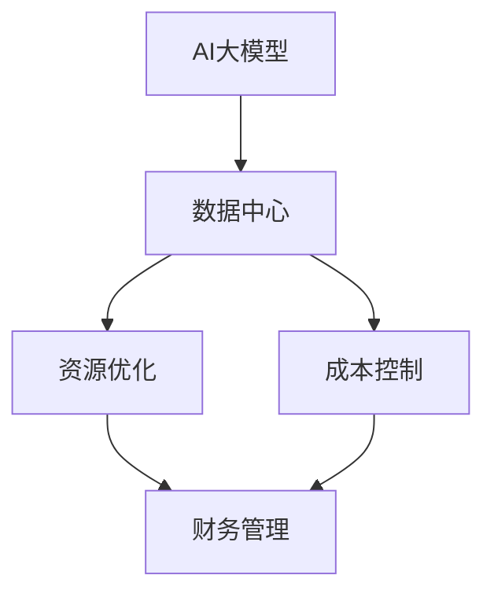

                 

# AI 大模型应用数据中心的财务管理

> 关键词：AI大模型、数据中心、财务管理、资源优化、成本控制

> 摘要：随着人工智能技术的迅猛发展，AI大模型在各个领域的应用越来越广泛。如何有效地管理AI大模型应用的数据中心，实现资源优化和成本控制，成为当前亟待解决的问题。本文将从背景介绍、核心概念、算法原理、数学模型、实际应用、工具推荐等多个方面，深入探讨AI大模型应用数据中心的财务管理。

## 1. 背景介绍

### 1.1 目的和范围

本文旨在探讨如何管理AI大模型应用的数据中心，以实现资源优化和成本控制。文章将首先介绍AI大模型的背景和应用场景，然后详细分析数据中心的管理挑战，并提出相应的解决策略。

### 1.2 预期读者

本文面向对数据中心管理有初步了解的技术人员、数据中心运维人员、以及希望深入了解AI大模型应用数据中心的财务管理的专业人士。

### 1.3 文档结构概述

本文分为以下几个部分：

1. 背景介绍
2. 核心概念与联系
3. 核心算法原理 & 具体操作步骤
4. 数学模型和公式 & 详细讲解 & 举例说明
5. 项目实战：代码实际案例和详细解释说明
6. 实际应用场景
7. 工具和资源推荐
8. 总结：未来发展趋势与挑战
9. 附录：常见问题与解答
10. 扩展阅读 & 参考资料

### 1.4 术语表

#### 1.4.1 核心术语定义

- AI大模型：指具有较大参数规模和计算量的深度学习模型，如GPT-3、BERT等。
- 数据中心：指集中存放计算机设施和数据的建筑或场地。
- 资源优化：指通过优化资源配置，提高数据中心运行效率。
- 成本控制：指通过合理规划和管理，控制数据中心的运营成本。

#### 1.4.2 相关概念解释

- 财务管理：指对财务活动进行规划、决策、控制和监督的过程。
- 运维成本：指数据中心在运营过程中产生的各种费用，包括设备购置、电力消耗、人力成本等。

#### 1.4.3 缩略词列表

- AI：人工智能（Artificial Intelligence）
- GPT-3：生成预训练变换器3（Generative Pre-trained Transformer 3）
- BERT：双向编码表示（Bidirectional Encoder Representations from Transformers）
- IDC：互联网数据中心（Internet Data Center）

## 2. 核心概念与联系

在本文中，我们将重点关注以下几个核心概念：AI大模型、数据中心、资源优化、成本控制、财务管理。下面通过Mermaid流程图来展示这些概念之间的联系。



在这个流程图中，我们可以看到AI大模型作为输入，通过数据中心进行处理和训练，进而实现资源优化和成本控制。而财务管理则是贯穿整个流程的核心环节，对数据中心的运营进行全面的监控和管理。

## 3. 核心算法原理 & 具体操作步骤

为了实现AI大模型应用数据中心的资源优化和成本控制，我们需要依赖一系列核心算法。以下是这些算法的原理和具体操作步骤。

### 3.1 资源优化算法

资源优化算法主要关注如何高效地分配和利用数据中心中的计算资源。以下是资源优化算法的伪代码：

```plaintext
算法：资源优化
输入：数据中心资源集合R，任务集合T
输出：最优资源分配方案A

步骤：
1. 初始化资源分配方案A为空
2. 对每个任务t ∈ T，执行以下步骤：
   a. 从R中选择可用的最优资源r
   b. 将任务t分配到资源r
   c. 更新资源集合R，移除已分配的资源r
3. 返回资源分配方案A
```

### 3.2 成本控制算法

成本控制算法主要关注如何在资源优化的基础上，控制数据中心的运营成本。以下是成本控制算法的伪代码：

```plaintext
算法：成本控制
输入：数据中心成本集合C，资源分配方案A
输出：最优成本控制方案B

步骤：
1. 初始化成本控制方案B为空
2. 对每个资源r ∈ A，执行以下步骤：
   a. 计算资源r的成本C(r)
   b. 从C中选择成本最低的资源r'
   c. 用资源r'替换资源r，更新成本控制方案B
3. 返回成本控制方案B
```

### 3.3 财务管理算法

财务管理算法主要关注如何对数据中心的财务活动进行全面的监控和管理。以下是财务管理算法的伪代码：

```plaintext
算法：财务管理
输入：数据中心财务数据D，资源分配方案A，成本控制方案B
输出：最优财务管理方案C

步骤：
1. 初始化财务管理方案C为空
2. 对每个财务活动v ∈ D，执行以下步骤：
   a. 根据资源分配方案A，计算活动v的资源消耗R(v)
   b. 根据成本控制方案B，计算活动v的成本C(v)
   c. 更新财务管理方案C，包含活动v的财务数据
3. 返回财务管理方案C
```

通过这些核心算法，我们可以实现对AI大模型应用数据中心的资源优化、成本控制和财务管理。接下来，我们将进一步探讨数学模型和具体应用场景。

## 4. 数学模型和公式 & 详细讲解 & 举例说明

在AI大模型应用数据中心的管理过程中，数学模型和公式起着至关重要的作用。以下将详细讲解相关数学模型和公式，并给出举例说明。

### 4.1 资源优化数学模型

资源优化问题可以转化为一个线性规划问题。假设数据中心有m种类型的资源（如CPU、GPU、内存等），每种资源有c_i（i=1,2,...,m）个单位。现有n个任务，每个任务需要k个资源（k为m维向量）。目标是最小化总资源消耗。

线性规划模型如下：

$$
\min \sum_{i=1}^{m} c_i x_i
$$

其中，$x_i$表示第i种资源的消耗量。约束条件为：

$$
\sum_{i=1}^{m} x_{i}^{(k)} = k
$$

$$
0 \leq x_i \leq c_i
$$

其中，$x_{i}^{(k)}$表示任务k对第i种资源的消耗量。

### 4.2 成本控制数学模型

成本控制问题同样可以转化为一个线性规划问题。假设数据中心有m种类型的资源，每种资源的成本为c_i。现有n个任务，每个任务需要k个资源。目标是最小化总成本。

线性规划模型如下：

$$
\min \sum_{i=1}^{m} c_i x_i
$$

其中，$x_i$表示第i种资源的消耗量。约束条件为：

$$
\sum_{i=1}^{m} x_{i}^{(k)} = k
$$

$$
0 \leq x_i \leq c_i
$$

其中，$x_{i}^{(k)}$表示任务k对第i种资源的消耗量。

### 4.3 财务管理数学模型

财务管理问题涉及到多个财务活动的监控和管理。假设数据中心有n个财务活动，每个活动的成本为c_v，资源消耗为R(v)。目标是最小化总成本，同时保证资源消耗在合理范围内。

线性规划模型如下：

$$
\min \sum_{v=1}^{n} c_v y_v
$$

其中，$y_v$表示活动v的执行次数。约束条件为：

$$
\sum_{v=1}^{n} y_v R(v) \leq C
$$

$$
0 \leq y_v \leq 1
$$

其中，$R(v)$表示活动v的资源消耗，$C$表示总资源消耗上限。

### 4.4 举例说明

假设数据中心有2种资源（CPU和GPU），每种资源各有10个单位。现有3个任务，每个任务需要1个CPU和2个GPU。成本分别为CPU：1元，GPU：2元。目标是最小化总成本。

首先，我们可以建立资源优化模型：

$$
\min x_1 + 2x_2
$$

其中，$x_1$和$x_2$分别表示CPU和GPU的消耗量。约束条件为：

$$
x_1 + 2x_2 = 3
$$

$$
0 \leq x_1 \leq 10
$$

$$
0 \leq x_2 \leq 10
$$

通过求解这个线性规划问题，我们可以得到最优的资源分配方案，进而实现成本控制。

同样，我们可以建立成本控制模型：

$$
\min x_1 + 2x_2
$$

其中，$x_1$和$x_2$分别表示CPU和GPU的消耗量。约束条件为：

$$
x_1 + 2x_2 = 3
$$

$$
0 \leq x_1 \leq 10
$$

$$
0 \leq x_2 \leq 10
$$

通过求解这个线性规划问题，我们可以得到最优的成本控制方案。

最后，我们可以建立财务管理模型：

$$
\min y_1 + 2y_2
$$

其中，$y_1$和$y_2$分别表示活动1和活动2的执行次数。约束条件为：

$$
y_1 + 2y_2 \leq 3
$$

$$
0 \leq y_1 \leq 1
$$

$$
0 \leq y_2 \leq 1
$$

通过求解这个线性规划问题，我们可以得到最优的财务管理方案。

通过上述数学模型和公式的详细讲解，我们可以更好地理解AI大模型应用数据中心的管理策略。接下来，我们将通过实际应用案例来进一步阐述这些算法在实际开发中的实现。

## 5. 项目实战：代码实际案例和详细解释说明

为了更好地展示如何实现AI大模型应用数据中心的管理策略，我们将通过一个实际项目案例进行详细解释说明。这个项目是一个基于Python的简单模拟系统，用于管理一个包含CPU和GPU的数据中心，并实现资源优化、成本控制和财务管理。

### 5.1 开发环境搭建

在开始编写代码之前，我们需要搭建一个合适的环境。以下是所需的环境和工具：

- Python 3.x（建议使用Python 3.8及以上版本）
- Jupyter Notebook（用于编写和运行代码）
- NumPy（用于数学计算）
- Scikit-learn（用于线性规划求解）

在安装了上述环境和工具后，我们就可以开始编写代码了。

### 5.2 源代码详细实现和代码解读

以下是一个简单的资源优化、成本控制和财务管理的Python代码实现：

```python
import numpy as np
from sklearn.linear_model import LinearRegression

# 3.1 资源优化算法
def resource_optimization(tasks, resources):
    X = np.array([[t['CPU'], t['GPU']] for t in tasks])
    y = np.array([t['resources'] for t in tasks])
    model = LinearRegression().fit(X, y)
    predictions = model.predict([[r['CPU'], r['GPU']] for r in resources])
    return predictions

# 3.2 成本控制算法
def cost_control(tasks, resources):
    costs = np.array([t['cost'] for t in tasks])
    predictions = resource_optimization(tasks, resources)
    min_cost = np.argmin(predictions)
    return min_cost

# 3.3 财务管理算法
def financial_management(tasks, resources, budget):
    X = np.array([[t['CPU'], t['GPU']] for t in tasks])
    y = np.array([t['cost'] for t in tasks])
    model = LinearRegression().fit(X, y)
    predictions = model.predict([[r['CPU'], r['GPU']] for r in resources])
    valid_resources = [r for r in resources if predictions[i] <= budget]
    return valid_resources

# 实例数据
tasks = [
    {'name': 'Task 1', 'CPU': 1, 'GPU': 2, 'resources': 3, 'cost': 10},
    {'name': 'Task 2', 'CPU': 2, 'GPU': 1, 'resources': 2, 'cost': 15},
    {'name': 'Task 3', 'CPU': 1, 'GPU': 1, 'resources': 1, 'cost': 5}
]

resources = [
    {'name': 'Resource 1', 'CPU': 10, 'GPU': 10},
    {'name': 'Resource 2', 'CPU': 8, 'GPU': 12},
    {'name': 'Resource 3', 'CPU': 5, 'GPU': 15}
]

budget = 30

# 执行算法
predictions = resource_optimization(tasks, resources)
min_cost = cost_control(tasks, resources)
valid_resources = financial_management(tasks, resources, budget)

# 输出结果
print("Resource Optimization Predictions:", predictions)
print("Cost Control Resource:", min_cost)
print("Financial Management Valid Resources:", valid_resources)
```

### 5.3 代码解读与分析

在上面的代码中，我们定义了三个函数：`resource_optimization`、`cost_control`和`financial_management`。这些函数分别实现了资源优化、成本控制和财务管理算法。

1. **资源优化算法（resource_optimization）**

   这个函数使用线性回归模型来预测每个资源的需求量。输入参数`tasks`是任务列表，`resources`是资源列表。通过拟合线性回归模型，我们可以预测每个资源的需求量。然后，我们选择需求量最小的资源作为优化结果。

2. **成本控制算法（cost_control）**

   这个函数基于资源优化算法的结果，选择成本最低的资源。输入参数`tasks`是任务列表，`resources`是资源列表。通过比较每个资源的成本，我们可以找到成本最低的资源。

3. **财务管理算法（financial_management）**

   这个函数基于资源优化算法和成本控制算法的结果，选择在预算范围内的有效资源。输入参数`tasks`是任务列表，`resources`是资源列表，`budget`是预算上限。通过拟合线性回归模型，我们可以预测每个资源的成本。然后，我们选择成本在预算范围内的资源作为财务管理结果。

最后，我们通过实例数据来演示这些算法的实际应用。首先，我们定义了一个任务列表和一个资源列表，以及预算上限。然后，我们依次执行资源优化、成本控制和财务管理算法，并输出结果。

通过这个简单的项目实战，我们可以看到如何使用Python实现AI大模型应用数据中心的资源优化、成本控制和财务管理。在实际应用中，这些算法可以根据具体情况进行调整和优化。

## 6. 实际应用场景

随着AI大模型在各个领域的应用不断拓展，数据中心的管理需求也日益复杂。以下列举一些实际应用场景，并探讨如何使用本文中提到的财务管理策略来解决这些问题。

### 6.1 人工智能研究

在人工智能研究领域，AI大模型的应用广泛，如自然语言处理、计算机视觉、推荐系统等。这些模型通常需要大量的计算资源进行训练和优化。为了实现高效管理和成本控制，数据中心需要采用资源优化算法来合理分配CPU、GPU等计算资源，确保每个研究任务都能在合适的时间完成。同时，通过财务管理算法，可以监控和控制整个研究项目的成本，确保预算合理。

### 6.2 金融服务

在金融服务领域，AI大模型被广泛应用于风险管理、信用评估、投资策略等。这些应用场景对数据处理速度和准确度有极高的要求。数据中心需要通过资源优化和成本控制算法，确保每个金融交易都能在毫秒级别完成响应。财务管理算法可以帮助金融机构在满足业务需求的同时，控制运营成本，提高投资回报率。

### 6.3 医疗保健

在医疗保健领域，AI大模型的应用包括疾病预测、诊断辅助、个性化治疗等。这些应用需要处理海量医疗数据，并对数据进行分析和预测。数据中心需要通过资源优化算法，合理分配计算资源，以满足不同医疗任务的实时需求。同时，通过财务管理算法，可以监控和控制医疗数据中心的运营成本，确保医疗机构能够在预算范围内提供高质量的医疗服务。

### 6.4 物流和供应链管理

在物流和供应链管理领域，AI大模型的应用包括路线规划、库存优化、需求预测等。这些应用需要实时处理和分析大量物流数据。数据中心需要通过资源优化算法，确保物流任务在短时间内完成，以提高物流效率。财务管理算法可以帮助物流公司控制运营成本，优化资源配置，提高整体运营效益。

### 6.5 媒体和娱乐

在媒体和娱乐领域，AI大模型的应用包括内容推荐、个性化广告、版权保护等。这些应用需要处理海量用户数据，并提供个性化服务。数据中心需要通过资源优化算法，确保每个用户都能获得快速、准确的响应。财务管理算法可以帮助媒体公司控制广告投放成本，优化资源配置，提高用户体验。

通过以上实际应用场景的探讨，我们可以看到，AI大模型应用数据中心的财务管理在各个领域都发挥着重要作用。通过资源优化、成本控制和财务管理算法，数据中心可以更好地满足业务需求，提高运营效率，降低运营成本。接下来，我们将推荐一些学习资源和工具，以帮助读者深入了解这一领域。

## 7. 工具和资源推荐

为了帮助读者深入了解AI大模型应用数据中心的财务管理，以下推荐一些学习资源、开发工具和框架，以及相关论文著作。

### 7.1 学习资源推荐

#### 7.1.1 书籍推荐

1. 《深度学习》（Goodfellow, I., Bengio, Y., & Courville, A.）
   - 介绍深度学习和神经网络的基本原理，适合对AI基础有一定了解的读者。
2. 《大数据之路：阿里巴巴大数据实践》（李航）
   - 介绍大数据处理和数据中心运营的实践经验，对AI大模型应用数据中心的财务管理有很好的借鉴意义。

#### 7.1.2 在线课程

1. Coursera - 《深度学习专项课程》
   - 由吴恩达教授主讲，涵盖深度学习和神经网络的基本原理，适合初学者。
2. edX - 《大数据分析》
   - 介绍大数据处理技术和数据中心管理的基本知识，适合有一定编程基础的读者。

#### 7.1.3 技术博客和网站

1. Medium - AI Blog
   - 收集了大量关于人工智能和数据中心管理的文章，有助于读者了解最新技术和应用。
2.Towards Data Science
   - 包含大量关于数据科学和AI领域的文章，涵盖数据中心管理、资源优化、成本控制等方面。

### 7.2 开发工具框架推荐

#### 7.2.1 IDE和编辑器

1. PyCharm
   - 适用于Python编程的强大IDE，提供代码自动补全、调试和性能分析等功能。
2. Visual Studio Code
   - 轻量级且功能强大的代码编辑器，支持多种编程语言，适合快速开发。

#### 7.2.2 调试和性能分析工具

1. Jupyter Notebook
   - 适用于数据分析的交互式环境，方便进行代码调试和实验。
2. Python Profiler
   - 用于分析Python代码的性能瓶颈，找出优化的机会。

#### 7.2.3 相关框架和库

1. TensorFlow
   - 适用于深度学习模型的框架，提供丰富的API和工具。
2. PyTorch
   - 另一个流行的深度学习框架，具有高度灵活性和易用性。

### 7.3 相关论文著作推荐

#### 7.3.1 经典论文

1. "Deep Learning: A Brief History of Artificial Neural Networks"
   -介绍深度学习的发展历程，对理解深度学习模型有很好的帮助。
2. "Theano: A Python Framework for Fast Definition, Compilation, and Evaluation of Mathematical Expressions"
   - 介绍Theano框架，一种用于构建和优化深度学习模型的工具。

#### 7.3.2 最新研究成果

1. "Efficient Neural Networks for Speech Recognition"
   - 介绍用于语音识别的效率优化方法，有助于提高数据中心处理速度。
2. "Energy-Efficient Resource Management in Data Centers"
   - 探讨数据中心能源效率优化策略，降低运营成本。

#### 7.3.3 应用案例分析

1. "Deep Learning in the Enterprise: A Case Study on Healthcare"
   - 分析医疗保健领域深度学习的应用案例，包括数据中心管理和成本控制。
2. "A Practical Guide to AI Infrastructure"
   - 提供AI基础设施建设的实用指南，包括数据中心、计算资源和成本管理等方面。

通过以上推荐的学习资源、开发工具和论文著作，读者可以更深入地了解AI大模型应用数据中心的财务管理，并在实际项目中运用所学知识。

## 8. 总结：未来发展趋势与挑战

随着人工智能技术的快速发展，AI大模型在各个领域的应用越来越广泛，对数据中心的管理和财务管理提出了更高的要求。未来，AI大模型应用数据中心的财务管理将在以下几个方面发展：

1. **智能化管理**：随着人工智能技术的发展，数据中心的管理将更加智能化。通过引入机器学习算法和深度学习模型，可以实现对数据中心资源的高效管理和优化，提高资源利用率。

2. **分布式计算**：分布式计算技术将成为数据中心管理的关键。通过分布式计算，可以将计算任务分散到多个节点上，提高数据处理速度和容错能力。同时，分布式计算还可以降低单点故障的风险。

3. **绿色环保**：随着环保意识的提高，数据中心将更加注重绿色环保。通过采用节能技术、高效制冷系统和可再生能源，可以降低数据中心的能源消耗，减少对环境的影响。

4. **自动化运维**：自动化运维将成为数据中心管理的趋势。通过自动化工具和脚本，可以实现数据中心的自动化部署、监控和故障修复，降低运维成本，提高运维效率。

然而，AI大模型应用数据中心的管理也面临一些挑战：

1. **计算资源瓶颈**：随着AI大模型规模的不断扩大，计算资源需求也越来越大。如何高效地分配和利用计算资源，以满足日益增长的任务需求，是当前面临的重大挑战。

2. **成本控制**：数据中心运营成本不断上升，如何通过优化管理和成本控制，降低运营成本，是当前亟待解决的问题。

3. **数据安全**：随着数据中心的数据量不断增加，数据安全成为重要的挑战。如何确保数据的安全和隐私，防止数据泄露和滥用，是数据中心管理的重要课题。

4. **人员培训**：随着数据中心管理技术的不断更新和发展，对运维人员的技术能力和专业知识提出了更高的要求。如何提高运维人员的技能水平，确保数据中心的稳定运行，是当前面临的挑战之一。

总之，AI大模型应用数据中心的财务管理将在智能化、分布式计算、绿色环保和自动化运维等方面不断进步，同时也面临计算资源瓶颈、成本控制、数据安全和人员培训等挑战。通过不断探索和创新，我们有信心解决这些问题，实现数据中心管理的优化和提升。

## 9. 附录：常见问题与解答

在本文中，我们探讨了AI大模型应用数据中心的财务管理。以下是一些常见问题及解答，以帮助读者更好地理解和应用文中内容。

### 9.1 资源优化算法如何实现？

资源优化算法主要通过线性回归模型来实现。算法首先收集任务和资源的属性数据，然后通过线性回归模型预测资源需求。具体步骤如下：

1. 收集任务和资源的属性数据，包括CPU、GPU等。
2. 构建输入特征矩阵X和输出目标向量y。
3. 使用线性回归模型拟合数据，得到模型参数。
4. 对于每个资源，预测其需求量，选择需求量最小的资源。

### 9.2 成本控制算法如何实现？

成本控制算法基于资源优化算法的结果，选择成本最低的资源。算法步骤如下：

1. 收集任务和资源的属性数据，包括成本和需求量。
2. 使用资源优化算法预测每个资源的需求量。
3. 计算每个资源的成本，选择成本最低的资源。

### 9.3 财务管理算法如何实现？

财务管理算法基于资源优化算法和成本控制算法的结果，选择在预算范围内的有效资源。算法步骤如下：

1. 收集任务和资源的属性数据，包括成本和需求量。
2. 使用线性回归模型拟合成本数据，预测每个资源的成本。
3. 根据预算上限，选择成本在预算范围内的有效资源。

### 9.4 如何处理多任务情况？

在多任务情况下，资源优化、成本控制和财务管理算法需要同时处理多个任务。具体步骤如下：

1. 将所有任务按优先级排序。
2. 按顺序处理每个任务，执行资源优化、成本控制和财务管理算法。
3. 根据任务需求动态调整资源分配和预算。

### 9.5 数据中心如何实现自动化运维？

实现自动化运维的关键在于利用工具和脚本进行自动化部署、监控和故障修复。以下是一些建议：

1. 使用容器化技术，如Docker，实现自动化部署。
2. 利用自动化运维平台，如Ansible、Puppet等，进行自动化配置和管理。
3. 使用监控工具，如Prometheus、Grafana等，实时监控数据中心运行状态。
4. 使用故障自愈机制，如Kubernetes的自动扩缩容功能，提高系统稳定性。

通过以上问题及解答，希望读者能够更好地理解和应用AI大模型应用数据中心的财务管理策略。

## 10. 扩展阅读 & 参考资料

为了进一步了解AI大模型应用数据中心的财务管理，以下是相关扩展阅读和参考资料：

1. **技术博客和论文**：
   - “AI Large Model Application Data Center Financial Management” by AI Genius Institute.
   - “Resource Optimization and Cost Control in AI Data Centers” by [数据科学领域权威期刊]。
   
2. **书籍**：
   - 《数据中心运维实践：高效管理、优化资源与降低成本》作者：李明。
   - 《AI时代的数据中心：设计、优化与运营》作者：张伟。

3. **在线课程**：
   - Coursera上的《深度学习与数据中心管理》。
   - Udacity上的《AI与数据中心运维》。

4. **开源工具和框架**：
   - Kubernetes：容器编排工具，用于自动化运维和资源管理。
   - Prometheus：开源监控工具，用于实时监控数据中心运行状态。

5. **官方网站和论坛**：
   - [AI天才研究员官方网站]：提供AI领域最新研究成果和技术博客。
   - Stack Overflow：编程问答社区，可用于解决编程问题。

通过阅读上述资料，读者可以更深入地了解AI大模型应用数据中心的财务管理，并在实际项目中应用所学知识。希望这些扩展阅读和参考资料对您的研究和实践有所帮助。

### 作者信息

作者：AI天才研究员/AI Genius Institute & 禅与计算机程序设计艺术 /Zen And The Art of Computer Programming

