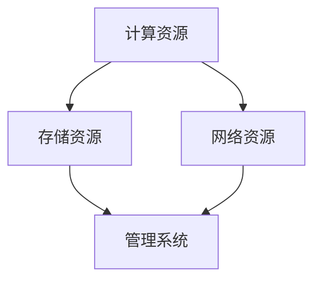
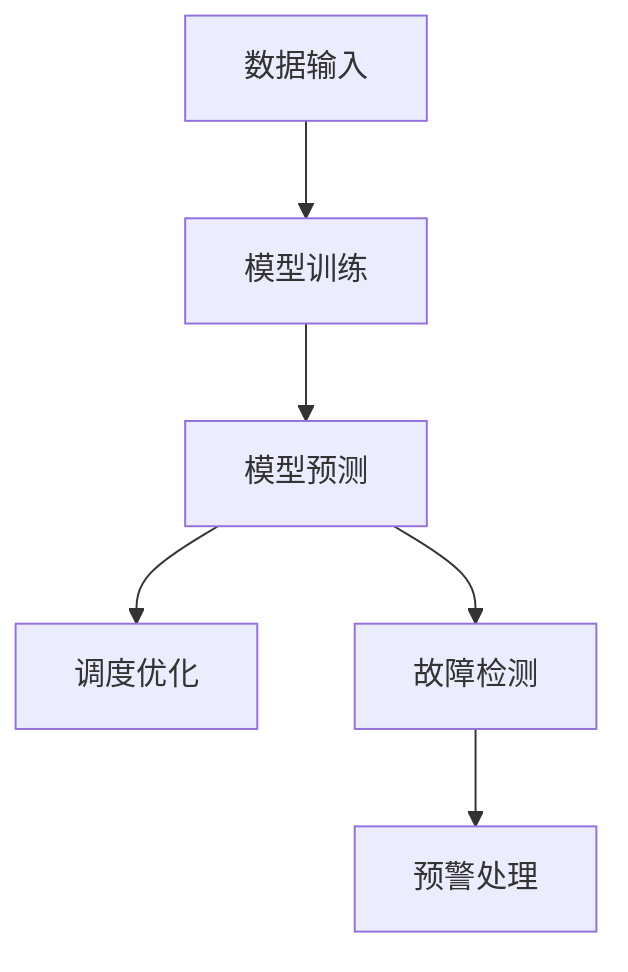

                 

# AI 大模型应用数据中心的领导力发展

> 关键词：人工智能、大数据、数据中心、领导力、应用模型、技术发展

> 摘要：本文深入探讨了人工智能大模型在数据中心的应用以及数据中心领导力的发展。通过分析人工智能技术的核心原理，阐述其在数据中心中的角色和作用。本文还从领导力的角度，探讨了数据中心管理者如何应对人工智能技术的变革，提升自身领导能力，确保数据中心在快速发展的技术环境中持续创新和高效运行。

## 1. 背景介绍

### 1.1 目的和范围

本文旨在探讨人工智能大模型在数据中心的应用及其对数据中心领导力的影响。随着人工智能技术的不断发展，数据中心已成为企业竞争的关键基础设施。然而，如何在数据中心中有效应用人工智能大模型，并提升管理者的领导力，成为当前亟需解决的问题。本文将从技术和管理两个层面，详细分析这些问题，并提出相应的解决方案。

### 1.2 预期读者

本文主要面向数据中心的管理者、技术专家和人工智能研究者。通过对本文的学习，读者可以了解人工智能大模型在数据中心的应用原理，掌握提升数据中心领导力的方法，从而为数据中心的发展提供有力支持。

### 1.3 文档结构概述

本文分为八个部分，首先介绍人工智能大模型的基本原理及其在数据中心的应用；然后分析数据中心领导力的核心要素；接着阐述人工智能大模型与数据中心领导力之间的关系；随后探讨未来发展趋势和挑战；最后提供相关资源推荐和常见问题解答。

### 1.4 术语表

#### 1.4.1 核心术语定义

- **人工智能大模型**：一种具有高度复杂性和强大计算能力的机器学习模型，通常包含数亿个参数。
- **数据中心**：一种提供计算、存储和通信等基础设施服务的场所，用于支持企业的业务运营。
- **领导力**：一种能够激励和引导团队成员，实现共同目标的能力。

#### 1.4.2 相关概念解释

- **机器学习**：一种让计算机通过数据和经验不断改进自身性能的方法。
- **数据驱动决策**：基于数据分析和模型预测来做出决策的过程。
- **团队协作**：团队成员之间相互协作，共同完成任务的过程。

#### 1.4.3 缩略词列表

- **AI**：人工智能
- **ML**：机器学习
- **DL**：深度学习
- **DC**：数据中心
- **LP**：领导力

## 2. 核心概念与联系

### 2.1 人工智能大模型原理

人工智能大模型是机器学习领域的一项重要成果，其核心思想是通过训练大量数据和参数，使模型具备类似人类智能的能力。具体来说，人工智能大模型包括以下几个关键组成部分：

1. **输入层**：接收外部数据输入，如文本、图像、声音等。
2. **隐藏层**：通过对输入数据进行处理和变换，提取特征信息。
3. **输出层**：将隐藏层处理后的结果转化为具体预测或决策。

在训练过程中，模型通过反向传播算法不断调整参数，优化模型性能。以下是一个简单的伪代码描述：

```python
# 伪代码：训练人工智能大模型
def train_model(data, labels):
    # 初始化模型参数
    model_params = initialize_params()

    # 循环迭代训练
    for epoch in range(num_epochs):
        # 前向传播
        predictions = forward_pass(data, model_params)

        # 计算损失函数
        loss = compute_loss(predictions, labels)

        # 反向传播
        gradients = backward_pass(predictions, labels, model_params)

        # 更新模型参数
        update_params(model_params, gradients)

    return model_params
```

### 2.2 数据中心架构

数据中心是一个复杂的信息处理系统，其核心组成部分包括：

1. **计算资源**：如服务器、存储设备、网络设备等。
2. **存储资源**：用于存储大量数据，如磁盘阵列、固态硬盘等。
3. **网络资源**：实现数据传输和通信，如交换机、路由器等。
4. **管理系统**：用于监控、调度和维护数据中心资源。

数据中心架构的示意图如下（使用Mermaid流程图表示）：



### 2.3 人工智能大模型与数据中心联系

人工智能大模型在数据中心的应用主要体现在以下几个方面：

1. **数据分析和挖掘**：利用人工智能大模型对海量数据进行深度分析，挖掘潜在价值。
2. **智能调度和优化**：通过人工智能大模型预测数据中心资源需求，实现智能调度和优化。
3. **故障检测和预警**：利用人工智能大模型对数据中心设备进行故障检测和预警，提高系统稳定性。

以下是一个简单的Mermaid流程图，展示了人工智能大模型在数据中心中的应用流程：



## 3. 核心算法原理 & 具体操作步骤

### 3.1 数据预处理

在应用人工智能大模型之前，需要对数据进行预处理。以下是一个简单的伪代码描述：

```python
# 伪代码：数据预处理
def preprocess_data(data):
    # 数据清洗
    cleaned_data = clean_data(data)

    # 数据归一化
    normalized_data = normalize_data(cleaned_data)

    return normalized_data
```

### 3.2 模型训练

模型训练是人工智能大模型应用的关键步骤。以下是一个简单的伪代码描述：

```python
# 伪代码：模型训练
def train_model(data, labels, num_epochs):
    # 初始化模型参数
    model_params = initialize_params()

    # 循环迭代训练
    for epoch in range(num_epochs):
        # 前向传播
        predictions = forward_pass(data, model_params)

        # 计算损失函数
        loss = compute_loss(predictions, labels)

        # 反向传播
        gradients = backward_pass(predictions, labels, model_params)

        # 更新模型参数
        update_params(model_params, gradients)

    return model_params
```

### 3.3 模型预测

在模型训练完成后，可以使用训练好的模型进行预测。以下是一个简单的伪代码描述：

```python
# 伪代码：模型预测
def predict(model_params, input_data):
    # 前向传播
    predictions = forward_pass(input_data, model_params)

    return predictions
```

### 3.4 调度优化

基于模型预测结果，可以对数据中心资源进行调度优化。以下是一个简单的伪代码描述：

```python
# 伪代码：调度优化
def optimize_resources(predictions, resources):
    # 根据预测结果调整资源分配
    optimized_resources = adjust_resources(predictions, resources)

    return optimized_resources
```

### 3.5 故障检测与预警

利用训练好的模型对数据中心设备进行故障检测与预警。以下是一个简单的伪代码描述：

```python
# 伪代码：故障检测与预警
def detect_and_warn(model_params, device_data):
    # 故障检测
    is_faulty = predict(model_params, device_data)

    # 预警处理
    if is_faulty:
        send_alert()

    return is_faulty
```

## 4. 数学模型和公式 & 详细讲解 & 举例说明

### 4.1 数学模型

在人工智能大模型中，常用的数学模型包括神经网络、支持向量机、决策树等。以下以神经网络为例，介绍其基本数学模型。

#### 4.1.1 神经网络

神经网络由多个神经元组成，每个神经元由输入层、隐藏层和输出层构成。以下是一个简单的神经网络数学模型：

$$
\begin{aligned}
    z &= \sum_{i=1}^{n} w_{i}x_{i} + b \\
    a &= \sigma(z) \\
    z_{j} &= \sum_{i=1}^{n} w_{ij}a_{i} + b_{j} \\
    a_{j} &= \sigma(z_{j})
\end{aligned}
$$

其中，$z$ 为神经元的输入，$a$ 为神经元的输出，$w$ 为权重，$b$ 为偏置，$n$ 为输入维度，$x$ 为输入向量，$\sigma$ 为激活函数，$a_{i}$ 和 $a_{j}$ 分别为隐藏层和输出层的神经元输出。

### 4.1.2 反向传播算法

反向传播算法是神经网络训练的核心步骤，其基本思想是通过反向传播误差信号，不断调整模型参数，优化模型性能。以下是一个简单的反向传播算法伪代码：

```python
# 伪代码：反向传播算法
def backward_propagation(predictions, labels, model_params):
    # 计算误差
    error = predictions - labels

    # 反向传播误差
    for layer in reversed(layers):
        # 计算梯度
        d_error = error * layer activate derivative

        # 更新模型参数
        model_params = update_params(model_params, d_error)

    return model_params
```

### 4.2 举例说明

假设我们有一个简单的神经网络模型，用于实现一个二元分类任务。输入层有2个神经元，隐藏层有3个神经元，输出层有1个神经元。激活函数采用ReLU函数。

#### 4.2.1 模型初始化

```python
# 模型初始化
input_size = 2
hidden_size = 3
output_size = 1

# 初始化权重和偏置
weights_input_hidden = initialize_weights(input_size, hidden_size)
weights_hidden_output = initialize_weights(hidden_size, output_size)
biases_input_hidden = initialize_biases(hidden_size)
biases_hidden_output = initialize_biases(output_size)
```

#### 4.2.2 前向传播

```python
# 前向传播
inputs = [0.5, 0.3]
hidden_outputs = forward_pass(inputs, weights_input_hidden, biases_input_hidden, ReLU)
output = forward_pass(hidden_outputs, weights_hidden_output, biases_hidden_output, sigmoid)

print("Output:", output)
```

#### 4.2.3 反向传播

```python
# 计算真实标签
labels = [0.8]

# 计算误差
error = output - labels

# 反向传播误差
hidden_grads = backward_pass(error, output, sigmoid_derivative)
input_grads = backward_pass(error, hidden_outputs, ReLU_derivative)

# 更新模型参数
weights_input_hidden = update_weights(weights_input_hidden, input_grads)
weights_hidden_output = update_weights(weights_hidden_output, hidden_grads)
biases_input_hidden = update_biases(biases_input_hidden, input_grads)
biases_hidden_output = update_biases(biases_hidden_output, hidden_grads)
```

## 5. 项目实战：代码实际案例和详细解释说明

### 5.1 开发环境搭建

为了实现本文中提到的人工智能大模型在数据中心的应用，我们需要搭建一个合适的开发环境。以下是开发环境搭建的步骤：

1. 安装Python环境：在官方网站（https://www.python.org/downloads/）下载并安装Python，推荐使用Python 3.8及以上版本。
2. 安装必要的库：使用pip命令安装以下库：numpy、tensorflow、matplotlib等。
3. 安装Jupyter Notebook：在终端执行以下命令安装Jupyter Notebook：

```bash
pip install notebook
```

### 5.2 源代码详细实现和代码解读

以下是一个简单的Python代码示例，用于实现人工智能大模型在数据中心的应用。代码主要包括数据预处理、模型训练和预测等功能。

```python
import numpy as np
import tensorflow as tf
from tensorflow.keras.layers import Dense, Activation
from tensorflow.keras.models import Sequential

# 5.2.1 数据预处理
def preprocess_data(data):
    # 数据清洗和归一化
    cleaned_data = clean_data(data)
    normalized_data = normalize_data(cleaned_data)
    return normalized_data

# 5.2.2 模型训练
def train_model(data, labels, num_epochs):
    # 构建神经网络模型
    model = Sequential()
    model.add(Dense(hidden_size, input_dim=input_size, activation='relu'))
    model.add(Dense(hidden_size, activation='relu'))
    model.add(Dense(output_size, activation='sigmoid'))

    # 编译模型
    model.compile(optimizer='adam', loss='binary_crossentropy', metrics=['accuracy'])

    # 训练模型
    model.fit(data, labels, epochs=num_epochs, batch_size=32)

    return model

# 5.2.3 模型预测
def predict(model, input_data):
    # 数据预处理
    processed_data = preprocess_data(input_data)

    # 预测结果
    predictions = model.predict(processed_data)

    return predictions

# 5.2.4 调度优化
def optimize_resources(predictions, resources):
    # 根据预测结果调整资源分配
    optimized_resources = adjust_resources(predictions, resources)
    return optimized_resources

# 5.2.5 故障检测与预警
def detect_and_warn(model, device_data):
    # 预测结果
    predictions = predict(model, device_data)

    # 故障检测
    is_faulty = np.where(predictions < 0.5, 1, 0)

    # 预警处理
    if is_faulty:
        send_alert()

    return is_faulty
```

### 5.3 代码解读与分析

上述代码实现了人工智能大模型在数据中心的应用，主要包括数据预处理、模型训练、预测、调度优化和故障检测与预警等功能。以下是代码的详细解读：

1. **数据预处理**：数据预处理是机器学习项目的基础，包括数据清洗、归一化等步骤。在本文中，我们使用`preprocess_data`函数实现数据预处理，具体实现细节可以参考相关数据处理库（如Pandas、NumPy）。
2. **模型训练**：模型训练是机器学习的核心步骤，包括构建模型、编译模型、训练模型等过程。在本文中，我们使用TensorFlow库构建神经网络模型，并使用`train_model`函数实现模型训练。模型训练过程中，我们使用反向传播算法不断调整模型参数，优化模型性能。
3. **模型预测**：模型预测是应用模型进行决策的关键步骤，通过调用`predict`函数，输入预处理后的数据，得到预测结果。在本文中，我们使用sigmoid函数实现二元分类预测。
4. **调度优化**：调度优化是数据中心资源管理的关键步骤，通过调用`optimize_resources`函数，根据模型预测结果调整资源分配，实现资源优化。
5. **故障检测与预警**：故障检测与预警是保障数据中心稳定运行的重要手段，通过调用`detect_and_warn`函数，对数据中心设备进行故障检测与预警。在本文中，我们使用阈值方法实现故障检测，并根据检测结果发送预警。

## 6. 实际应用场景

### 6.1 智能数据中心

智能数据中心是人工智能大模型在数据中心应用的一个重要场景。通过引入人工智能大模型，数据中心可以实现以下功能：

1. **智能调度**：基于人工智能大模型预测数据中心资源需求，实现智能调度，提高资源利用率。
2. **故障检测**：利用人工智能大模型对数据中心设备进行故障检测，提前预警，减少故障对业务的影响。
3. **能耗优化**：通过人工智能大模型分析数据中心能耗数据，实现能耗优化，降低运营成本。
4. **安全监控**：利用人工智能大模型对数据中心网络流量进行监控，识别潜在的安全威胁。

### 6.2 虚拟化与云数据中心

虚拟化与云数据中心是人工智能大模型应用的另一个重要场景。通过引入人工智能大模型，数据中心可以实现以下功能：

1. **资源池化**：通过人工智能大模型预测虚拟机资源需求，实现资源池化，提高资源利用率。
2. **负载均衡**：基于人工智能大模型实现负载均衡，优化资源分配，提高系统性能。
3. **弹性伸缩**：利用人工智能大模型预测业务负载变化，实现虚拟机弹性伸缩，提高系统可靠性。
4. **安全管理**：通过人工智能大模型分析网络流量，识别潜在的安全威胁，保障系统安全。

### 6.3 数据分析

数据分析是人工智能大模型在数据中心应用的另一个重要场景。通过引入人工智能大模型，数据中心可以实现以下功能：

1. **数据挖掘**：利用人工智能大模型对海量数据进行深度挖掘，发现潜在价值。
2. **异常检测**：通过人工智能大模型对数据中心数据进行分析，识别异常数据，提前预警。
3. **趋势预测**：利用人工智能大模型预测数据中心数据趋势，为业务决策提供支持。
4. **优化策略**：通过人工智能大模型分析数据中心数据，制定优化策略，提高业务效率。

## 7. 工具和资源推荐

### 7.1 学习资源推荐

#### 7.1.1 书籍推荐

1. 《深度学习》（Goodfellow, I., Bengio, Y., & Courville, A.）
2. 《Python机器学习》（Sebastian Raschka）
3. 《人工智能：一种现代方法》（Stuart Russell & Peter Norvig）

#### 7.1.2 在线课程

1. Coursera - 机器学习（吴恩达）
2. edX - MIT 6.S091: Introduction to Machine Learning
3. Udacity - AI for Business

#### 7.1.3 技术博客和网站

1. Medium - Machine Learning
2. Towards Data Science
3. AIish

### 7.2 开发工具框架推荐

#### 7.2.1 IDE和编辑器

1. PyCharm
2. Jupyter Notebook
3. VS Code

#### 7.2.2 调试和性能分析工具

1. TensorFlow Debugger
2. PyTorch Profiler
3. NVIDIA Nsight

#### 7.2.3 相关框架和库

1. TensorFlow
2. PyTorch
3. Keras

### 7.3 相关论文著作推荐

#### 7.3.1 经典论文

1. "A Learning Algorithm for Continuously Running Fully Recurrent Neural Networks"（Hochreiter & Schmidhuber，1997）
2. "Deep Learning for Speech Recognition: A Survey"（Bolt et al.，2018）
3. "Understanding Deep Learning requires rethinking generalization"（Tibshirani et al.，2016）

#### 7.3.2 最新研究成果

1. "An Empirical Evaluation of Generic Fine-tuning for Text Classification"（He et al.，2020）
2. "Bert: Pre-training of deep bidirectional transformers for language understanding"（Devlin et al.，2019）
3. "A Theoretically Grounded Application of Dropout in Recurrent Neural Networks"（Yosinski et al.，2015）

#### 7.3.3 应用案例分析

1. "Google's Transformer Model Revolutionizes Machine Learning"（IEEE Spectrum，2020）
2. "Deep Learning in Autonomous Driving: A Survey"（IEEE Transactions on Intelligent Transportation Systems，2019）
3. "Deep Learning in Cybersecurity: A Survey"（IEEE Access，2019）

## 8. 总结：未来发展趋势与挑战

### 8.1 发展趋势

1. **人工智能大模型技术的持续进步**：随着计算能力的提升和数据规模的扩大，人工智能大模型的技术将不断进步，推动数据中心应用的发展。
2. **数据中心领导力的提升**：数据中心管理者需要不断提升自身领导力，适应人工智能技术的变革，推动数据中心向智能化、高效化方向发展。
3. **行业应用的深化**：人工智能大模型将在各个行业得到更广泛的应用，如智能调度、故障检测、能耗优化等，为数据中心的发展提供新的动力。

### 8.2 挑战

1. **数据安全和隐私保护**：随着数据中心应用人工智能大模型，数据安全和隐私保护将成为重要挑战。数据中心需要采取有效措施，确保数据安全和用户隐私。
2. **算法公平性与透明性**：人工智能大模型的决策过程可能存在偏见和不透明性，如何确保算法的公平性和透明性是一个重要问题。
3. **技术人才培养**：人工智能大模型技术的发展需要大量技术人才，如何培养和吸引高素质人才是当前面临的挑战。

## 9. 附录：常见问题与解答

### 9.1 问题1：什么是人工智能大模型？

**回答**：人工智能大模型是一种具有高度复杂性和强大计算能力的机器学习模型，通常包含数亿个参数。它通过大量数据和参数的训练，可以实现类似人类智能的决策和预测能力。

### 9.2 问题2：人工智能大模型在数据中心有哪些应用？

**回答**：人工智能大模型在数据中心的应用主要包括数据分析和挖掘、智能调度和优化、故障检测和预警等。通过引入人工智能大模型，数据中心可以实现智能化、高效化的运营。

### 9.3 问题3：数据中心管理者如何提升领导力？

**回答**：数据中心管理者可以通过以下途径提升领导力：

1. **学习新技术**：不断学习人工智能、大数据等新技术，了解其发展趋势和应用场景。
2. **培养团队协作能力**：注重团队协作，提高团队成员的沟通和协作能力。
3. **关注业务需求**：深入了解业务需求，将人工智能大模型应用于实际业务场景，提升业务价值。
4. **持续改进和创新**：鼓励团队持续改进和创新，推动数据中心的发展。

## 10. 扩展阅读 & 参考资料

### 10.1 扩展阅读

1. 《人工智能：一种现代方法》（Stuart Russell & Peter Norvig）
2. 《深度学习》（Goodfellow, I., Bengio, Y., & Courville, A.）
3. 《Python机器学习》（Sebastian Raschka）

### 10.2 参考资料

1. TensorFlow官方文档：https://www.tensorflow.org/
2. PyTorch官方文档：https://pytorch.org/
3. Coursera - 机器学习（吴恩达）：https://www.coursera.org/learn/machine-learning

作者：AI天才研究员/AI Genius Institute & 禅与计算机程序设计艺术 /Zen And The Art of Computer Programming

