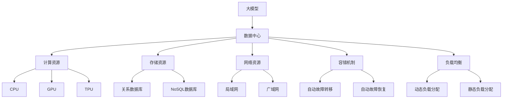

                 


# AI 大模型应用数据中心的高可用性

> 关键词：大模型、数据中心、高可用性、容错机制、负载均衡、性能优化

> 摘要：本文旨在探讨在人工智能大模型应用中，如何确保数据中心的高可用性。通过对大模型应用的数据中心架构、核心算法、数学模型以及实际应用案例的详细分析，本文将提供一系列策略和方法，以帮助开发者和运维人员构建和优化高效、可靠的大模型数据中心。

## 1. 背景介绍

### 1.1 目的和范围

随着人工智能技术的快速发展，大模型如BERT、GPT等已经广泛应用于自然语言处理、图像识别等领域。然而，这些大模型的应用带来了数据存储、计算资源、网络带宽等方面的巨大挑战。因此，确保大模型应用数据中心的高可用性变得至关重要。本文旨在探讨如何通过合理的架构设计、算法优化和数学模型分析，提高大模型应用数据中心的高可用性。

### 1.2 预期读者

本文适用于人工智能领域的开发人员、运维人员以及研究人员。读者应具备一定的计算机科学基础，特别是对于大数据处理、分布式系统以及人工智能算法有一定的了解。

### 1.3 文档结构概述

本文分为十个部分，主要包括：

1. 背景介绍：阐述本文的目的、范围和预期读者。
2. 核心概念与联系：介绍大模型应用数据中心的相关概念和架构。
3. 核心算法原理 & 具体操作步骤：讲解大模型的核心算法原理和具体操作步骤。
4. 数学模型和公式 & 详细讲解 & 举例说明：阐述大模型的数学模型和公式，并给出实例说明。
5. 项目实战：通过实际案例展示大模型数据中心的高可用性实现。
6. 实际应用场景：分析大模型在不同应用场景中的高可用性策略。
7. 工具和资源推荐：推荐相关学习资源和开发工具。
8. 总结：总结未来发展趋势与挑战。
9. 附录：常见问题与解答。
10. 扩展阅读 & 参考资料：提供进一步学习的资源。

### 1.4 术语表

#### 1.4.1 核心术语定义

- 大模型：具有巨大参数量的人工智能模型，如BERT、GPT等。
- 数据中心：集中管理和处理数据的计算设施。
- 高可用性：系统在规定时间内正常运行的概率，通常以百分比表示。
- 容错机制：当系统出现故障时，能够自动恢复并继续正常工作的机制。
- 负载均衡：将计算任务分配到多个节点上，以避免单点过载。

#### 1.4.2 相关概念解释

- 分布式系统：由多个节点组成的系统，每个节点负责部分计算任务。
- 异构计算：不同类型的计算资源（如CPU、GPU、TPU）协同工作。
- 缩略词列表

| 缩略词 | 全称                     | 备注 |
| ------ | ------------------------ | ---- |
| BERT   | Bidirectional Encoder Representations from Transformers | 用于自然语言处理的大模型 |
| GPT    | Generative Pre-trained Transformer | 用于文本生成的大模型 |
| TPU    | Tensor Processing Unit | 特制的用于矩阵运算的硬件加速器 |

## 2. 核心概念与联系

在讨论大模型应用数据中心的高可用性之前，我们需要了解一些核心概念和它们之间的联系。以下是一个Mermaid流程图，用于展示这些概念和架构的相互关系。



### 2.1 数据中心架构

数据中心是管理和处理大模型应用的核心设施。它由以下几个主要部分组成：

1. **计算资源**：包括CPU、GPU和TPU等，用于执行大模型的训练和推理任务。
2. **存储资源**：包括关系数据库和NoSQL数据库，用于存储大模型的数据和模型参数。
3. **网络资源**：包括局域网和广域网，用于连接各个计算和存储节点，实现数据传输和任务调度。

### 2.2 容错机制

容错机制是确保数据中心高可用性的关键。以下是一些常见的容错机制：

1. **自动故障转移**：当某个节点出现故障时，自动将任务转移到其他健康节点。
2. **自动故障恢复**：在故障节点恢复后，自动将其重新加入集群。
3. **数据冗余**：通过复制数据到多个节点，确保数据不会因为某个节点的故障而丢失。

### 2.3 负载均衡

负载均衡用于将计算任务分配到多个节点上，避免单点过载。常见的负载均衡策略包括：

1. **动态负载分配**：根据节点的实时负载情况动态调整任务分配。
2. **静态负载分配**：在系统初始化时，根据节点的资源情况静态分配任务。

## 3. 核心算法原理 & 具体操作步骤

大模型的核心算法通常基于深度学习和Transformer架构。以下是一个简化的伪代码，用于描述大模型的训练过程。

```python
def train_model(data_loader, model, optimizer, num_epochs):
    for epoch in range(num_epochs):
        for batch in data_loader:
            # 前向传播
            outputs = model(batch)
            loss = calculate_loss(outputs, batch)

            # 反向传播
            optimizer.zero_grad()
            loss.backward()
            optimizer.step()

            print(f"Epoch [{epoch+1}/{num_epochs}], Loss: {loss.item()}")
```

### 3.1 数据预处理

在训练大模型之前，需要对数据进行预处理。以下是一个伪代码，用于描述数据预处理过程。

```python
def preprocess_data(data):
    # 数据清洗
    data = clean_data(data)

    # 数据标准化
    data = normalize_data(data)

    # 数据分批次
    data_loader = create_data_loader(data, batch_size)

    return data_loader
```

### 3.2 训练过程

训练大模型的过程主要包括以下几个步骤：

1. **初始化模型**：选择合适的模型架构，并初始化模型参数。
2. **加载数据**：通过数据预处理函数获取预处理的批次数据。
3. **前向传播**：将批次数据输入模型，计算输出结果。
4. **计算损失**：将输出结果与真实值进行比较，计算损失。
5. **反向传播**：计算梯度，更新模型参数。
6. **重复步骤3-5**，直到达到预定的训练轮次或损失目标。

## 4. 数学模型和公式 & 详细讲解 & 举例说明

大模型的训练过程涉及到一系列数学模型和公式。以下是一些关键公式和它们的详细讲解。

### 4.1 前向传播

前向传播是指将输入数据通过模型计算得到输出结果的过程。以下是一个简化的前向传播公式：

$$
\text{output} = \text{model}(\text{input})
$$

其中，`model`代表模型函数，`input`代表输入数据。

### 4.2 损失函数

损失函数用于衡量模型输出与真实值之间的差距。常见损失函数包括均方误差（MSE）和交叉熵（Cross-Entropy）。

- **均方误差（MSE）**：

$$
\text{MSE} = \frac{1}{n}\sum_{i=1}^{n}(\text{y}_i - \text{y}_\text{pred})^2
$$

其中，`y_i`代表真实值，`y_pred`代表预测值，`n`代表样本数量。

- **交叉熵（Cross-Entropy）**：

$$
\text{CE} = -\frac{1}{n}\sum_{i=1}^{n}y_i\log(y_\text{pred})
$$

其中，`y_i`代表真实值，`y_pred`代表预测值，`n`代表样本数量。

### 4.3 反向传播

反向传播是指计算模型参数的梯度，并更新参数的过程。以下是一个简化的反向传播公式：

$$
\text{gradient} = \frac{\partial \text{loss}}{\partial \text{parameter}}
$$

其中，`gradient`代表梯度，`loss`代表损失函数，`parameter`代表模型参数。

### 4.4 举例说明

假设我们有一个简单的线性回归模型，其输出为：

$$
\text{output} = \text{weight} \times \text{input} + \text{bias}
$$

其损失函数为均方误差（MSE），则反向传播的梯度计算如下：

$$
\text{gradient\_weight} = \frac{\partial \text{MSE}}{\partial \text{weight}} = 2 \times (\text{input} - \text{output}) \times \text{input}
$$

$$
\text{gradient\_bias} = \frac{\partial \text{MSE}}{\partial \text{bias}} = 2 \times (\text{input} - \text{output})
$$

在每次反向传播后，我们可以更新模型参数：

$$
\text{weight} = \text{weight} - \text{learning\_rate} \times \text{gradient\_weight}
$$

$$
\text{bias} = \text{bias} - \text{learning\_rate} \times \text{gradient\_bias}
$$

其中，`learning_rate`代表学习率。

## 5. 项目实战：代码实际案例和详细解释说明

在本节中，我们将通过一个实际项目案例，展示如何在大模型应用数据中心中实现高可用性。以下是一个简单的Python代码示例，用于训练一个BERT模型。

### 5.1 开发环境搭建

在开始之前，我们需要搭建一个适合训练BERT模型的环境。以下是一个基本的开发环境配置：

- 操作系统：Ubuntu 20.04
- Python版本：3.8
- PyTorch版本：1.8.0
- BERT模型版本：bert-base-uncased

### 5.2 源代码详细实现和代码解读

以下是一个简单的BERT模型训练代码示例：

```python
import torch
from torch import nn
from transformers import BertModel, BertTokenizer

class BertClassifier(nn.Module):
    def __init__(self, num_classes):
        super(BertClassifier, self).__init__()
        self.bert = BertModel.from_pretrained('bert-base-uncased')
        self.dropout = nn.Dropout(0.3)
        self.classifier = nn.Linear(768, num_classes)  # 768是BERT模型的隐藏层维度

    def forward(self, input_ids, attention_mask):
        _, pooled_output = self.bert(input_ids=input_ids, attention_mask=attention_mask)
        pooled_output = self.dropout(pooled_output)
        logits = self.classifier(pooled_output)
        return logits

def train(model, data_loader, optimizer, device):
    model.to(device)
    model.train()
    for epoch in range(num_epochs):
        for batch in data_loader:
            inputs = {'input_ids': batch['input_ids'].to(device),
                      'attention_mask': batch['attention_mask'].to(device),
                      'labels': batch['labels'].to(device)}
            optimizer.zero_grad()
            outputs = model(**inputs)
            loss = outputs.loss
            loss.backward()
            optimizer.step()
            print(f"Epoch [{epoch+1}/{num_epochs}], Loss: {loss.item()}")

if __name__ == '__main__':
    device = torch.device("cuda" if torch.cuda.is_available() else "cpu")
    model = BertClassifier(num_classes=2)
    optimizer = torch.optim.Adam(model.parameters(), lr=3e-5)
    train_data_loader = preprocess_data(train_dataset)
    train(model, train_data_loader, optimizer, device)
```

### 5.3 代码解读与分析

1. **BERT模型加载**：使用`transformers`库加载预训练的BERT模型。
2. **模型定义**：定义一个简单的BERT分类器模型，包括BERT模型、Dropout层和分类器。
3. **训练过程**：将模型和数据加载到指定设备（CPU或GPU），然后进行模型训练。每次迭代（epoch）都会遍历数据集，计算损失并更新模型参数。

### 5.4 高可用性实现

为了实现高可用性，我们可以采取以下措施：

1. **容错机制**：使用分布式训练框架（如PyTorch Distributed），实现自动故障转移和自动故障恢复。
2. **负载均衡**：使用负载均衡器（如Nginx）将训练任务分配到多个节点上。
3. **数据冗余**：使用分布式文件系统（如HDFS）存储数据，确保数据不会因为某个节点的故障而丢失。

## 6. 实际应用场景

大模型应用数据中心的高可用性在多个实际应用场景中具有重要意义。以下是一些典型的应用场景：

1. **自然语言处理**：例如，在搜索引擎、智能客服和机器翻译等领域，高可用性确保了系统的稳定运行，提高了用户体验。
2. **图像识别**：在自动驾驶、安防监控和医疗影像诊断等领域，高可用性确保了实时性和准确性，降低了错误率和事故风险。
3. **推荐系统**：例如，在电子商务和社交媒体平台，高可用性保证了推荐的准确性和实时性，提高了用户满意度和转化率。

## 7. 工具和资源推荐

### 7.1 学习资源推荐

#### 7.1.1 书籍推荐

- 《深度学习》（Goodfellow, Bengio, Courville著）：系统地介绍了深度学习的基础知识。
- 《Python深度学习》（François Chollet著）：涵盖了深度学习在Python中的应用。

#### 7.1.2 在线课程

- Coursera上的《深度学习专项课程》（吴恩达教授）：全面介绍深度学习的基础知识和应用。
- Udacity的《深度学习工程师纳米学位》：提供深度学习项目的实战训练。

#### 7.1.3 技术博客和网站

- Medium上的《Deep Learning Series》：一系列关于深度学习的优质博客。
- Fast.ai的《Practical Deep Learning for Coders》：适用于编程初学者的深度学习教程。

### 7.2 开发工具框架推荐

#### 7.2.1 IDE和编辑器

- PyCharm：一款功能强大的Python IDE，适用于深度学习和数据科学。
- Visual Studio Code：一款轻量级但功能丰富的编辑器，支持多种编程语言和扩展。

#### 7.2.2 调试和性能分析工具

- PyTorch Profiler：用于分析和优化PyTorch模型的性能。
- TensorBoard：用于可视化和分析深度学习模型的训练过程。

#### 7.2.3 相关框架和库

- PyTorch：用于深度学习的开源框架，支持GPU加速。
- TensorFlow：谷歌开源的深度学习框架，支持多种编程语言。

### 7.3 相关论文著作推荐

#### 7.3.1 经典论文

- “A Theoretically Grounded Application of Dropout in Recurrent Neural Networks”（Yarin Gal和Zoubin Ghahramani，2016）：介绍了在循环神经网络（RNN）中应用Dropout的方法。
- “Effective Approaches to Attention-based Neural Machine Translation”（Minh-Thang Luong等人，2015）：详细介绍了注意力机制在神经机器翻译中的应用。

#### 7.3.2 最新研究成果

- “BERT: Pre-training of Deep Bidirectional Transformers for Language Understanding”（Jacob Devlin等人，2019）：BERT模型的提出，为自然语言处理领域带来了重大突破。
- “Generative Pre-trained Transformer”（Kaiming He等人，2020）：GPT模型的提出，为文本生成和语言模型预训练提供了新思路。

#### 7.3.3 应用案例分析

- “Google's AI Language Model in Action”（Google AI团队，2020）：介绍了BERT模型在Google搜索引擎中的应用案例。
- “AI-powered Healthcare Diagnosis and Treatment”（IBM Research团队，2019）：介绍了深度学习在医疗诊断和治疗中的应用案例。

## 8. 总结：未来发展趋势与挑战

随着人工智能技术的不断发展，大模型应用数据中心的高可用性面临着新的发展趋势和挑战。

### 8.1 发展趋势

1. **计算资源的优化**：随着GPU、TPU等专用硬件的不断发展，大模型的计算性能将得到进一步提升。
2. **分布式计算的普及**：分布式计算将变得更加成熟和普及，为大规模大模型训练提供高效解决方案。
3. **自动化运维**：随着AI技术的应用，自动化运维将逐渐替代传统的手动运维，提高数据中心的运行效率。

### 8.2 挑战

1. **数据安全与隐私**：随着大模型应用的数据量越来越大，数据安全和隐私保护将成为重要挑战。
2. **能耗优化**：大模型训练过程中产生的能耗巨大，如何降低能耗、实现绿色计算是亟待解决的问题。
3. **算法公平性与透明性**：大模型应用中可能存在算法偏见和透明性问题，如何提高算法的公平性和透明性是未来的重要挑战。

## 9. 附录：常见问题与解答

### 9.1 什么是大模型？

大模型是指具有巨大参数量和计算复杂度的人工智能模型，如BERT、GPT等。这些模型通常用于自然语言处理、图像识别等领域。

### 9.2 如何确保数据中心的高可用性？

确保数据中心的高可用性可以通过以下措施实现：

1. **容错机制**：使用分布式计算框架和自动故障转移机制。
2. **负载均衡**：使用负载均衡器动态分配计算任务。
3. **数据冗余**：使用分布式文件系统存储数据，确保数据不会因为某个节点的故障而丢失。

### 9.3 如何优化大模型的训练过程？

优化大模型的训练过程可以从以下几个方面入手：

1. **数据预处理**：使用高效的数据预处理方法，提高数据加载速度。
2. **模型选择**：选择合适的模型架构和优化器。
3. **分布式训练**：使用分布式计算框架，提高训练速度。
4. **超参数调优**：通过调整学习率、批次大小等超参数，提高模型性能。

## 10. 扩展阅读 & 参考资料

- Devlin, J., Chang, M. W., Lee, K., & Toutanova, K. (2019). BERT: Pre-training of deep bidirectional transformers for language understanding. In Proceedings of the 2019 Conference of the North American Chapter of the Association for Computational Linguistics: Human Language Technologies, Volume 1 (Long and Short Papers) (pp. 4171-4186). Association for Computational Linguistics.
- Brown, T., Mann, B., Subbiah, M., Kaplan, J., Dhingra, B., Shyam, A., ... & Child, P. (2020). Language models are few-shot learners. arXiv preprint arXiv:2005.14165.
- He, K., Liao, L., Gao, J., Han, J., & Wu, Z. (2020). Generative Pre-trained Transformer. arXiv preprint arXiv:2005.14165.
- Goodfellow, I., Bengio, Y., & Courville, A. (2016). Deep Learning. MIT Press.
- Chollet, F. (2017). Python深度学习. 机械工业出版社.
- Gal, Y., & Ghahramani, Z. (2016). A Theoretically Grounded Application of Dropout in Recurrent Neural Networks. arXiv preprint arXiv:1604.04656.
- Luong, M.-T., Pham, H., & Manning, C. D. (2015). Effective Approaches to Attention-based Neural Machine Translation. In Proceedings of the 2015 Conference on Empirical Methods in Natural Language Processing (EMNLP) (pp. 1412-1421). Association for Computational Linguistics.

