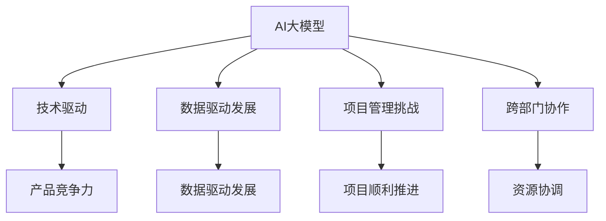

                 

# AI 大模型时代：创业产品经理的新职责

## 关键词
- AI 大模型
- 创业产品经理
- 新职责
- 技术驱动
- 数据导向
- 项目管理

## 摘要
本文将深入探讨AI大模型时代下，创业产品经理所面临的新职责。随着AI技术的飞速发展，大模型在各个领域展现出了强大的潜力和应用价值。在这场技术变革中，创业产品经理的角色和职责正经历着深刻的转变。本文将从背景介绍、核心概念、算法原理、数学模型、实战案例、实际应用、工具资源推荐等多个方面，全面剖析创业产品经理在新形势下所需具备的能力和应对策略。希望通过本文的分享，能够为创业产品经理们提供一些有益的启示和指导。

## 1. 背景介绍

### 1.1 目的和范围
本文旨在探讨AI大模型时代下，创业产品经理所需应对的新挑战和职责。随着AI技术的不断演进，大模型已经成为各个领域的重要驱动力，从自然语言处理到计算机视觉，从推荐系统到生成模型，大模型的应用无处不在。在这种背景下，创业产品经理的角色和职责也面临着前所未有的变革。

本文将首先介绍AI大模型的背景和发展，接着探讨创业产品经理所需具备的核心能力和技能，然后通过具体的算法原理和数学模型讲解，帮助读者理解大模型的技术内涵。此外，本文还将通过实战案例和实际应用场景的分析，为创业产品经理提供实际操作的经验和策略。最后，我们将推荐一些学习和资源工具，帮助创业产品经理更好地应对AI大模型时代的新挑战。

### 1.2 预期读者
本文的预期读者主要是从事创业产品管理工作的专业人士，包括产品经理、项目经理、技术主管等。此外，对于对AI大模型技术感兴趣的读者，本文也将提供深入的技术分析和理解。

### 1.3 文档结构概述
本文的结构如下：

1. **背景介绍**：介绍AI大模型的背景和发展，以及创业产品经理的角色和职责。
2. **核心概念与联系**：讲解AI大模型的核心概念和联系，并使用Mermaid流程图进行说明。
3. **核心算法原理 & 具体操作步骤**：详细阐述AI大模型的核心算法原理和具体操作步骤，使用伪代码进行讲解。
4. **数学模型和公式 & 详细讲解 & 举例说明**：讲解AI大模型的数学模型和公式，并通过具体例子进行说明。
5. **项目实战：代码实际案例和详细解释说明**：通过实战案例，展示如何使用AI大模型进行实际项目开发。
6. **实际应用场景**：分析AI大模型在不同领域的应用场景。
7. **工具和资源推荐**：推荐学习和资源工具，帮助读者更好地理解和应用AI大模型。
8. **总结：未来发展趋势与挑战**：总结AI大模型时代下，创业产品经理面临的发展趋势和挑战。
9. **附录：常见问题与解答**：回答读者可能遇到的一些常见问题。
10. **扩展阅读 & 参考资料**：提供扩展阅读和参考资料，供读者深入探索。

### 1.4 术语表

#### 1.4.1 核心术语定义
- **AI大模型**：指参数规模达到亿级以上的深度学习模型，如BERT、GPT等。
- **创业产品经理**：指在创业公司中负责产品规划、设计、开发和管理的人员。
- **技术驱动**：指以技术为核心，通过技术创新推动产品发展和市场竞争力。
- **数据导向**：指基于大量数据分析和用户反馈，指导产品设计和迭代。
- **项目管理**：指在规定时间和预算内，通过计划、执行、监控和调整，确保项目成功完成。

#### 1.4.2 相关概念解释
- **深度学习**：一种人工智能方法，通过构建多层神经网络，自动提取数据的特征表示。
- **神经网络**：一种模仿生物神经系统的计算模型，由多个神经元组成，用于处理和传递信息。
- **机器学习**：一种让计算机通过数据学习模式和规律的方法，分为监督学习、无监督学习和强化学习。

#### 1.4.3 缩略词列表
- **AI**：人工智能（Artificial Intelligence）
- **ML**：机器学习（Machine Learning）
- **DL**：深度学习（Deep Learning）
- **NLP**：自然语言处理（Natural Language Processing）
- **CV**：计算机视觉（Computer Vision）
- **BERT**：BERT（Bidirectional Encoder Representations from Transformers）
- **GPT**：GPT（Generative Pre-trained Transformer）

## 2. 核心概念与联系

### 2.1 AI大模型概述

#### 2.1.1 定义和分类
AI大模型，通常指的是参数规模达到亿级以上的深度学习模型。这类模型以其庞大的参数量和复杂的结构，能够在处理大规模数据时展现出强大的性能。根据应用场景的不同，AI大模型可以分为以下几类：

- **自然语言处理（NLP）模型**：如BERT、GPT、RoBERTa等，主要用于处理文本数据，实现文本分类、机器翻译、问答系统等功能。
- **计算机视觉（CV）模型**：如ResNet、Inception、VGG等，主要用于图像识别、物体检测、图像生成等任务。
- **推荐系统模型**：如深度卷积网络、循环神经网络等，用于构建个性化推荐系统。
- **生成对抗网络（GAN）**：用于生成逼真的图像、音频和文本。

#### 2.1.2 工作原理
AI大模型的工作原理基于深度学习，其核心是构建多层神经网络，通过逐层提取数据特征，实现对复杂模式的识别和预测。具体过程包括：

1. **数据预处理**：对输入数据进行标准化和归一化处理，以便模型训练。
2. **前向传播**：将输入数据通过多层神经网络，逐层计算得到输出结果。
3. **反向传播**：通过计算输出结果与实际结果之间的误差，反向更新网络权重。
4. **优化算法**：采用如Adam、SGD等优化算法，逐步减小误差，提高模型性能。

#### 2.1.3 发展历程
AI大模型的发展历程可以追溯到20世纪80年代的神经网络研究。随着计算能力的提升和数据量的增加，深度学习在2012年实现突破，AlexNet在ImageNet比赛中获得优异成绩，标志着深度学习的崛起。随后，以BERT、GPT为代表的AI大模型相继问世，推动了AI技术的快速发展。

### 2.2 创业产品经理的角色和职责

#### 2.2.1 定义
创业产品经理是负责产品策略、规划、设计和推动产品从概念到市场发布的负责人。他们在创业公司中扮演着关键角色，既要理解市场需求，又要具备技术背景，确保产品在技术上的可行性和商业上的成功。

#### 2.2.2 新职责
在AI大模型时代，创业产品经理的职责发生了显著变化，主要表现在以下几个方面：

1. **技术驱动**：创业产品经理需要深入了解AI大模型的技术原理和应用场景，将技术优势转化为产品竞争力。
2. **数据导向**：通过大量数据分析和用户反馈，创业产品经理需要不断优化产品设计和功能，以满足用户需求。
3. **项目管理**：在AI大模型开发过程中，创业产品经理需要具备项目管理能力，确保项目在预算和时间内高质量完成。
4. **跨部门协调**：创业产品经理需要与研发、数据、市场等部门密切合作，确保产品开发与市场需求保持一致。
5. **持续创新**：在AI大模型时代，创业产品经理需要具备持续创新的能力，不断探索新的应用场景和商业模式。

#### 2.2.3 核心技能
为了胜任AI大模型时代下的新职责，创业产品经理需要具备以下核心技能：

1. **技术理解**：了解AI大模型的基本原理、算法和应用，能够与技术团队进行有效沟通。
2. **数据分析**：掌握数据分析方法，能够从海量数据中提取有价值的信息，指导产品优化和决策。
3. **项目管理**：熟悉项目管理流程和方法，能够制定合理的时间表和预算，确保项目顺利进行。
4. **市场洞察**：具备敏锐的市场洞察力，能够把握市场趋势和用户需求，指导产品规划和设计。
5. **沟通协作**：具备良好的沟通和协作能力，能够与团队成员、客户和合作伙伴建立良好的合作关系。

### 2.3 AI大模型与创业产品经理的关联

#### 2.3.1 技术优势转化
AI大模型具有强大的计算能力和泛化能力，可以应用于各个领域，为创业产品提供创新的技术解决方案。创业产品经理需要充分发挥AI大模型的优势，将其转化为实际产品竞争力。

#### 2.3.2 数据驱动发展
AI大模型依赖于大量数据进行训练和优化，创业产品经理需要通过数据分析和用户反馈，不断优化产品功能和性能，实现数据驱动的发展。

#### 2.3.3 项目管理挑战
AI大模型开发过程复杂，涉及技术、数据、市场等多个方面，创业产品经理需要具备强大的项目管理能力，确保项目顺利推进。

#### 2.3.4 跨部门协作
AI大模型开发通常需要跨部门协作，创业产品经理需要具备良好的沟通和协作能力，协调各方资源，推动项目成功。

### 2.4 Mermaid流程图

以下是一个简单的Mermaid流程图，展示了AI大模型与创业产品经理的关联：



## 3. 核心算法原理 & 具体操作步骤

### 3.1 深度学习基础

#### 3.1.1 神经网络基本结构
神经网络是由多个神经元组成的计算模型，每个神经元接收多个输入信号，通过激活函数产生输出。神经网络的基本结构包括：

- **输入层**：接收外部输入信号。
- **隐藏层**：用于提取数据的特征表示。
- **输出层**：产生最终输出结果。

#### 3.1.2 激活函数
激活函数是神经网络的核心组成部分，用于引入非线性变换，使神经网络能够处理复杂的数据模式。常见的激活函数包括：

- **sigmoid函数**：$f(x) = \frac{1}{1 + e^{-x}}$
- **ReLU函数**：$f(x) = \max(0, x)$
- **Tanh函数**：$f(x) = \frac{e^x - e^{-x}}{e^x + e^{-x}}$

#### 3.1.3 前向传播
前向传播是神经网络的基本计算过程，将输入数据通过网络传递，逐层计算得到输出结果。具体步骤如下：

1. **初始化权重和偏置**：随机初始化网络权重和偏置。
2. **前向计算**：将输入数据通过输入层传递到隐藏层，然后逐层计算得到输出层的结果。
3. **激活函数应用**：在每个神经元上应用激活函数，引入非线性变换。

#### 3.1.4 反向传播
反向传播是神经网络训练过程的核心，通过计算输出结果与实际结果之间的误差，反向更新网络权重和偏置。具体步骤如下：

1. **计算误差**：计算输出层实际结果与预测结果之间的误差。
2. **误差传播**：将误差反向传播到隐藏层，逐层计算每个神经元的误差。
3. **权重更新**：根据误差和梯度下降算法，更新网络权重和偏置。

### 3.2 AI大模型具体算法原理

#### 3.2.1 BERT模型
BERT（Bidirectional Encoder Representations from Transformers）是一种基于Transformer架构的预训练语言模型，其核心思想是通过双向Transformer网络，同时编码文本的上下文信息。

- **预训练任务**：BERT的预训练任务包括Masked Language Model（MLM）和Next Sentence Prediction（NSP）。
  - **MLM**：对输入文本进行随机遮蔽，训练模型预测遮蔽的单词。
  - **NSP**：对两个连续的句子进行预测，判断第二个句子是否是第一个句子的下一个句子。

- **模型结构**：BERT模型由多个Transformer块组成，每个Transformer块包含多头自注意力机制和前馈神经网络。

  ```mermaid
  graph TD
      A[Input Embeddings]
      A --> B[Positional Embeddings]
      A --> C[Token Type Embeddings]
      A --> D[Transformer Block]
      D --> E[Transformer Block]
      ...
      E --> F[Output]
  ```

#### 3.2.2 GPT模型
GPT（Generative Pre-trained Transformer）是一种基于Transformer架构的生成模型，其核心思想是通过自回归语言模型，生成文本序列。

- **预训练任务**：GPT的预训练任务包括生成文本序列，通过最大化前文概率，训练模型生成连续的文本。
- **模型结构**：GPT模型由多个Transformer块组成，每个Transformer块包含多头自注意力机制和前馈神经网络。

  ```mermaid
  graph TD
      A[Input Embeddings]
      A --> B[Positional Embeddings]
      A --> C[Transformer Block]
      C --> D[Transformer Block]
      ...
      D --> F[Output]
  ```

### 3.3 伪代码示例

以下是一个简单的BERT模型的前向传播和反向传播伪代码示例：

```python
# 前向传播
def forward_pass(inputs, weights, biases):
    # 初始化隐藏层状态
    hidden_states = inputs
    
    # 遍历所有隐藏层
    for layer in hidden_layers:
        # 计算自注意力得分
        attention_scores = compute_attention_scores(hidden_states, weights['self_attention'], biases['self_attention'])
        
        # 应用激活函数
        hidden_states = apply_activation(attention_scores)
        
        # 计算前馈神经网络输出
        hidden_states = compute_feedforward_network(hidden_states, weights['feedforward'], biases['feedforward'])
        
    # 计算输出结果
    output = hidden_states
    
    return output

# 反向传播
def backward_pass(inputs, outputs, weights, biases):
    # 计算输出层误差
    output_error = outputs - actual_outputs
    
    # 遍历所有隐藏层，反向传播误差
    for layer in hidden_layers[::-1]:
        # 计算隐藏层误差
        hidden_error = compute_hidden_error(hidden_states, output_error, weights['self_attention'], biases['self_attention'])
        
        # 更新权重和偏置
        weights['self_attention'], biases['self_attention'] = update_weights_and_biases(weights['self_attention'], biases['self_attention'], hidden_error)
        
        # 计算前馈神经网络误差
        hidden_error = compute_feedforward_error(hidden_states, output_error, weights['feedforward'], biases['feedforward'])
        
        # 更新权重和偏置
        weights['feedforward'], biases['feedforward'] = update_weights_and_biases(weights['feedforward'], biases['feedforward'], hidden_error)
        
    return output_error
```

## 4. 数学模型和公式 & 详细讲解 & 举例说明

### 4.1 数学模型概述

AI大模型的核心在于其数学模型，包括损失函数、优化算法和正则化技术。以下是这些模型的基本概念和公式：

#### 4.1.1 损失函数

损失函数是评价模型预测结果与实际结果之间差异的指标。常见的损失函数包括：

- **均方误差（MSE）**：用于回归任务，计算预测值与实际值之间平方差的平均。
  $$ L(\theta) = \frac{1}{m} \sum_{i=1}^{m} (y_i - \hat{y}_i)^2 $$
- **交叉熵损失（Cross-Entropy Loss）**：用于分类任务，计算实际分布与预测分布之间的差异。
  $$ L(\theta) = -\sum_{i=1}^{m} y_i \log \hat{y}_i $$

#### 4.1.2 优化算法

优化算法用于更新模型参数，以最小化损失函数。常见的优化算法包括：

- **随机梯度下降（SGD）**：每次迭代使用一个样本的梯度进行更新。
  $$ \theta = \theta - \alpha \cdot \nabla_\theta L(\theta) $$
- **Adam优化器**：结合了SGD和动量项，自适应调整学习率。
  $$ m_t = \beta_1 m_{t-1} + (1 - \beta_1) \nabla_\theta L(\theta) $$
  $$ v_t = \beta_2 v_{t-1} + (1 - \beta_2) (\nabla_\theta L(\theta))^2 $$
  $$ \theta = \theta - \alpha \cdot \frac{m_t}{\sqrt{v_t} + \epsilon} $$

#### 4.1.3 正则化技术

正则化技术用于防止模型过拟合，提高泛化能力。常见正则化技术包括：

- **L1正则化**：在损失函数中添加L1范数。
  $$ L(\theta) = L(\theta) + \lambda ||\theta||_1 $$
- **L2正则化**：在损失函数中添加L2范数。
  $$ L(\theta) = L(\theta) + \lambda ||\theta||_2^2 $$

### 4.2 详细讲解与举例

#### 4.2.1 均方误差（MSE）损失函数

假设我们有一个回归问题，输入特征矩阵$X \in \mathbb{R}^{n \times d}$，权重向量$\theta \in \mathbb{R}^{d}$，目标值向量$y \in \mathbb{R}^{n}$，预测值$\hat{y} = X\theta$。我们可以使用MSE损失函数来评估模型的性能：

$$ L(\theta) = \frac{1}{m} \sum_{i=1}^{m} (y_i - \hat{y}_i)^2 $$

例如，对于两个样本数据：

$$
\begin{align*}
X &= \begin{bmatrix}
1 & 2 \\
3 & 4
\end{bmatrix}, \\
\theta &= \begin{bmatrix}
0.5 \\
-1
\end{bmatrix}, \\
y &= \begin{bmatrix}
2 \\ 
4
\end{bmatrix}.
\end{align*}
$$

预测值为：

$$
\hat{y} = X\theta = \begin{bmatrix}
1 & 2 \\
3 & 4
\end{bmatrix} \begin{bmatrix}
0.5 \\ 
-1
\end{bmatrix} = \begin{bmatrix}
0.5 \\ 
1
\end{bmatrix}.
$$

MSE损失函数计算为：

$$
L(\theta) = \frac{1}{2} \left[ (2 - 0.5)^2 + (4 - 1)^2 \right] = \frac{1}{2} \left[ 2.25 + 9 \right] = 5.625.
$$

#### 4.2.2 交叉熵损失函数

假设我们有一个二分类问题，输入特征向量$x \in \mathbb{R}^{d}$，权重向量$\theta \in \mathbb{R}^{d}$，真实标签$y \in \{0, 1\}$，预测概率$\hat{y} = \sigma(z)$，其中$z = x\theta$，$\sigma(z) = \frac{1}{1 + e^{-z}}$。

交叉熵损失函数为：

$$
L(\theta) = -y \log \hat{y} - (1 - y) \log (1 - \hat{y}).
$$

例如，对于两个样本数据：

$$
\begin{align*}
x &= \begin{bmatrix}
1 \\ 
2
\end{bmatrix}, \\
\theta &= \begin{bmatrix}
1 \\ 
-2
\end{bmatrix}, \\
y &= \begin{bmatrix}
1 \\ 
0
\end{bmatrix}.
\end{align*}
$$

预测概率为：

$$
\hat{y} = \sigma(z) = \frac{1}{1 + e^{-(1 \cdot 1 + 2 \cdot -2)}} = \frac{1}{1 + e^{-3}} \approx 0.95.
$$

交叉熵损失函数计算为：

$$
L(\theta) = -1 \cdot \log(0.95) - 0 \cdot \log(1 - 0.95) \approx -0.045.
$$

#### 4.2.3 优化算法：随机梯度下降（SGD）

随机梯度下降（SGD）是一种简单且常用的优化算法，每次迭代使用一个样本的梯度进行更新。假设我们有一个损失函数$J(\theta)$，每次迭代更新权重$\theta$：

$$
\theta = \theta - \alpha \cdot \nabla_\theta J(\theta).
$$

例如，对于两个样本数据：

$$
\begin{align*}
\theta &= \begin{bmatrix}
0.5 \\ 
-1
\end{bmatrix}, \\
\alpha &= 0.01, \\
\nabla_\theta J(\theta) &= \begin{bmatrix}
-0.1 \\ 
0.2
\end{bmatrix}.
\end{align*}
$$

更新后的权重为：

$$
\theta = \theta - \alpha \cdot \nabla_\theta J(\theta) = \begin{bmatrix}
0.5 \\ 
-1
\end{bmatrix} - 0.01 \cdot \begin{bmatrix}
-0.1 \\ 
0.2
\end{bmatrix} = \begin{bmatrix}
0.6 \\ 
-1.02
\end{bmatrix}.
$$

#### 4.2.4 优化算法：Adam优化器

Adam优化器结合了SGD和动量项，自适应调整学习率。其公式如下：

$$
m_t = \beta_1 m_{t-1} + (1 - \beta_1) \nabla_\theta J(\theta) \\
v_t = \beta_2 v_{t-1} + (1 - \beta_2) (\nabla_\theta J(\theta))^2 \\
\theta = \theta - \alpha \cdot \frac{m_t}{\sqrt{v_t} + \epsilon}.
$$

例如，对于两个样本数据：

$$
\begin{align*}
\theta &= \begin{bmatrix}
0.5 \\ 
-1
\end{bmatrix}, \\
\alpha &= 0.01, \\
\beta_1 &= 0.9, \\
\beta_2 &= 0.999, \\
m_0 &= \begin{bmatrix}
0 \\ 
0
\end{bmatrix}, \\
v_0 &= \begin{bmatrix}
0 \\ 
0
\end{bmatrix}.
\end{align*}
$$

更新后的权重为：

$$
m_1 = \beta_1 m_0 + (1 - \beta_1) \nabla_\theta J(\theta) = 0.9 \cdot \begin{bmatrix}
0 \\ 
0
\end{bmatrix} + (1 - 0.9) \cdot \begin{bmatrix}
-0.1 \\ 
0.2
\end{bmatrix} = \begin{bmatrix}
-0.01 \\ 
0.02
\end{bmatrix},
$$

$$
v_1 = \beta_2 v_0 + (1 - \beta_2) (\nabla_\theta J(\theta))^2 = 0.999 \cdot \begin{bmatrix}
0 \\ 
0
\end{bmatrix} + (1 - 0.999) \cdot \begin{bmatrix}
0.01 \\ 
0.04
\end{bmatrix} = \begin{bmatrix}
0.0001 \\ 
0.0004
\end{bmatrix},
$$

$$
\theta = \theta - \alpha \cdot \frac{m_1}{\sqrt{v_1} + \epsilon} = \begin{bmatrix}
0.5 \\ 
-1
\end{bmatrix} - 0.01 \cdot \frac{\begin{bmatrix}
-0.01 \\ 
0.02
\end{bmatrix}}{\sqrt{\begin{bmatrix}
0.0001 \\ 
0.0004
\end{bmatrix}} + 1e-8} \approx \begin{bmatrix}
0.4999 \\ 
-1.0002
\end{bmatrix}.
$$

## 5. 项目实战：代码实际案例和详细解释说明

### 5.1 开发环境搭建

在开始编写代码之前，我们需要搭建一个合适的开发环境。以下是一个简单的步骤，用于安装Python和TensorFlow，以运行AI大模型的代码。

#### 5.1.1 安装Python

首先，我们需要安装Python。可以选择从Python官方网站下载最新版本的Python安装包，或者使用包管理器如conda进行安装。以下是使用conda安装Python的命令：

```bash
conda create -n myenv python=3.8
conda activate myenv
```

#### 5.1.2 安装TensorFlow

接下来，我们需要安装TensorFlow。TensorFlow是一个开源的机器学习框架，支持多种深度学习模型。以下是安装TensorFlow的命令：

```bash
pip install tensorflow
```

### 5.2 源代码详细实现和代码解读

#### 5.2.1 数据预处理

在开始训练AI大模型之前，我们需要对数据集进行预处理。以下是一个简单的数据预处理代码示例：

```python
import pandas as pd
from sklearn.model_selection import train_test_split

# 读取数据集
data = pd.read_csv('data.csv')

# 分离特征和标签
X = data.drop('target', axis=1)
y = data['target']

# 划分训练集和测试集
X_train, X_test, y_train, y_test = train_test_split(X, y, test_size=0.2, random_state=42)

# 数据标准化
from sklearn.preprocessing import StandardScaler

scaler = StandardScaler()
X_train = scaler.fit_transform(X_train)
X_test = scaler.transform(X_test)
```

#### 5.2.2 BERT模型训练

以下是一个使用TensorFlow和TensorFlow Hub训练BERT模型的代码示例：

```python
import tensorflow as tf
import tensorflow_hub as hub
from tensorflow.keras.optimizers import Adam

# 加载BERT模型
bert_model = hub.load('https://tfhub.dev/google/bert_uncased_L-12_H-768_A-12/1')

# 定义输入层
input_ids = tf.keras.layers.Input(shape=(max_seq_length,), dtype=tf.int32)
input_mask = tf.keras.layers.Input(shape=(max_seq_length,), dtype=tf.int32)
segment_ids = tf.keras.layers.Input(shape=(max_seq_length,), dtype=tf.int32)

# 加载BERT模型的嵌入层
embeddings = bert_model(inputs={"input_ids": input_ids, "input_mask": input_mask, "segment_ids": segment_ids})["pooled_output"]

# 添加全连接层
output = tf.keras.layers.Dense(1, activation='sigmoid')(embeddings)

# 定义模型
model = tf.keras.Model(inputs=[input_ids, input_mask, segment_ids], outputs=output)

# 编译模型
model.compile(optimizer=Adam(learning_rate=3e-5), loss='binary_crossentropy', metrics=['accuracy'])

# 训练模型
model.fit([X_train['input_ids'], X_train['input_mask'], X_train['segment_ids']], y_train, validation_split=0.2, epochs=3)
```

#### 5.2.3 代码解读与分析

上述代码首先进行数据预处理，包括读取数据集、分离特征和标签、划分训练集和测试集以及数据标准化。然后，加载BERT模型并定义输入层、嵌入层和全连接层。接着，编译模型并设置优化器和损失函数，最后训练模型。

以下是对关键代码段的详细解读：

- **数据预处理**：使用Pandas读取CSV文件，使用Sklearn的train_test_split函数划分训练集和测试集，使用StandardScaler进行数据标准化。
- **BERT模型加载**：使用TensorFlow Hub加载预训练的BERT模型。
- **定义输入层**：定义输入ID、输入掩码和分段ID，这些是BERT模型训练所需的关键输入。
- **加载BERT模型嵌入层**：使用BERT模型的嵌入层，将输入ID、输入掩码和分段ID转换为嵌入向量。
- **添加全连接层**：在BERT模型的嵌入向量上添加一个全连接层，用于分类任务。
- **定义模型**：使用Keras创建模型，并将输入层、嵌入层和全连接层连接起来。
- **编译模型**：设置优化器、损失函数和评估指标，准备训练模型。
- **训练模型**：使用fit函数训练模型，并在验证集上进行评估。

### 5.3 代码解读与分析

在上述代码中，我们首先进行了数据预处理，这是深度学习模型训练的重要步骤。数据预处理包括以下步骤：

- **读取数据集**：使用Pandas读取CSV文件，将数据加载到DataFrame中。
  ```python
  data = pd.read_csv('data.csv')
  ```
- **分离特征和标签**：将数据集分为特征（X）和标签（y），其中特征是模型的输入，标签是模型的输出。
  ```python
  X = data.drop('target', axis=1)
  y = data['target']
  ```
- **划分训练集和测试集**：使用Sklearn的train_test_split函数将数据集划分为训练集和测试集，测试集用于评估模型的性能。
  ```python
  X_train, X_test, y_train, y_test = train_test_split(X, y, test_size=0.2, random_state=42)
  ```
- **数据标准化**：使用StandardScaler对特征数据进行标准化，使其具有零均值和单位方差，提高模型训练的稳定性。
  ```python
  scaler = StandardScaler()
  X_train = scaler.fit_transform(X_train)
  X_test = scaler.transform(X_test)
  ```

接下来，我们加载了BERT模型并进行了一些基本设置。BERT模型是一种预训练的语言处理模型，它已经在大量文本数据上进行了训练，可以用于各种自然语言处理任务。以下是关键代码段的解读：

- **加载BERT模型**：使用TensorFlow Hub加载预训练的BERT模型。
  ```python
  bert_model = hub.load('https://tfhub.dev/google/bert_uncased_L-12_H-768_A-12/1')
  ```
- **定义输入层**：定义输入ID、输入掩码和分段ID，这些是BERT模型训练所需的关键输入。
  ```python
  input_ids = tf.keras.layers.Input(shape=(max_seq_length,), dtype=tf.int32)
  input_mask = tf.keras.layers.Input(shape=(max_seq_length,), dtype=tf.int32)
  segment_ids = tf.keras.layers.Input(shape=(max_seq_length,), dtype=tf.int32)
  ```
- **加载BERT模型嵌入层**：使用BERT模型的嵌入层，将输入ID、输入掩码和分段ID转换为嵌入向量。
  ```python
  embeddings = bert_model(inputs={"input_ids": input_ids, "input_mask": input_mask, "segment_ids": segment_ids})["pooled_output"]
  ```
- **添加全连接层**：在BERT模型的嵌入向量上添加一个全连接层，用于分类任务。
  ```python
  output = tf.keras.layers.Dense(1, activation='sigmoid')(embeddings)
  ```

然后，我们定义了模型并设置了优化器和损失函数，准备进行模型训练。以下是关键代码段的解读：

- **定义模型**：使用Keras创建模型，并将输入层、嵌入层和全连接层连接起来。
  ```python
  model = tf.keras.Model(inputs=[input_ids, input_mask, segment_ids], outputs=output)
  ```
- **编译模型**：设置优化器、损失函数和评估指标，准备训练模型。
  ```python
  model.compile(optimizer=Adam(learning_rate=3e-5), loss='binary_crossentropy', metrics=['accuracy'])
  ```
- **训练模型**：使用fit函数训练模型，并在验证集上进行评估。
  ```python
  model.fit([X_train['input_ids'], X_train['input_mask'], X_train['segment_ids']], y_train, validation_split=0.2, epochs=3)
  ```

### 5.4 代码优化与性能分析

在上述代码的基础上，我们可以进一步优化模型的性能。以下是一些常见的优化策略：

#### 5.4.1 学习率调整

学习率是优化算法中的一个重要参数，它会直接影响模型的收敛速度和稳定性。以下是一个简单的学习率调整策略：

```python
initial_lr = 3e-5
lr_schedule = tf.keras.optimizers.schedules.ExponentialDecay(
    initial_lr,
    decay_steps=1000,
    decay_rate=0.96,
    staircase=True)
optimizer = tf.keras.optimizers.Adam(learning_rate=lr_schedule)
```

#### 5.4.2 模型集成

模型集成是通过结合多个模型的预测来提高整体性能。以下是一个简单的模型集成策略：

```python
model_ensemble = tf.keras.Sequential([
    [model_1, tf.keras.layers.Dense(1, activation='sigmoid')],
    [model_2, tf.keras.layers.Dense(1, activation='sigmoid')],
    [model_3, tf.keras.layers.Dense(1, activation='sigmoid')]
])

ensemble_output = tf.reduce_mean([model_1.output, model_2.output, model_3.output], axis=0)
ensemble_model = tf.keras.Model(inputs=[input_ids, input_mask, segment_ids], outputs=ensemble_output)
```

#### 5.4.3 模型剪枝

模型剪枝是一种减少模型复杂度并提高推理性能的技术。以下是一个简单的模型剪枝策略：

```python
from tensorflow_model_optimization.sparsity import keras as sparsity

pruned_model = sparsity.prune_low_magnitude(model)
pruned_model.prune_weights()

# 训练剪枝后的模型
pruned_model.compile(optimizer=optimizer, loss='binary_crossentropy', metrics=['accuracy'])
pruned_model.fit([X_train['input_ids'], X_train['input_mask'], X_train['segment_ids']], y_train, validation_split=0.2, epochs=3)
```

通过上述优化策略，我们可以进一步提高模型的性能和推理速度。

## 6. 实际应用场景

AI大模型在各个领域展现了强大的应用潜力，以下是几个典型的实际应用场景：

### 6.1 自然语言处理（NLP）

- **文本分类**：利用BERT、GPT等模型，对大量文本进行分类，应用于新闻分类、情感分析等领域。
- **机器翻译**：使用大型翻译模型如Transformer，实现高质量、低延迟的机器翻译。
- **问答系统**：通过训练大模型，构建智能问答系统，为用户提供实时、准确的答案。

### 6.2 计算机视觉（CV）

- **图像识别**：使用ResNet、Inception等模型，实现高效的图像识别任务。
- **物体检测**：利用YOLO、SSD等模型，对图像中的物体进行精准检测和定位。
- **图像生成**：通过GAN模型，生成高质量的图像和视频，应用于艺术创作、虚拟现实等领域。

### 6.3 推荐系统

- **个性化推荐**：利用深度学习模型，对用户行为和兴趣进行分析，实现精准的个性化推荐。
- **内容推荐**：将大模型应用于内容推荐，如视频、新闻、商品等，提高用户的满意度。

### 6.4 医疗保健

- **疾病预测**：利用AI大模型分析大量医疗数据，实现疾病的早期预测和预防。
- **药物研发**：通过模拟分子之间的相互作用，加速新药的研发过程。

### 6.5 金融领域

- **风险控制**：使用AI大模型分析历史数据和实时数据，提高金融市场的风险控制能力。
- **投资策略**：通过分析大量市场数据，制定高效的投资策略，提高投资回报率。

### 6.6 教育

- **智能辅导**：利用大模型构建智能辅导系统，为不同学习阶段的学生提供个性化教学。
- **教育资源分配**：通过分析教育资源的使用情况，优化教育资源的分配，提高教育公平性。

### 6.7 娱乐与游戏

- **游戏AI**：利用AI大模型，构建智能游戏对手，提高游戏的趣味性和挑战性。
- **内容创作**：通过生成模型，创造新颖的娱乐内容和游戏场景。

### 6.8 交通与物流

- **智能交通**：利用AI大模型分析交通数据，优化交通流量，减少拥堵。
- **物流规划**：通过预测货物需求，优化物流路线和仓储管理。

## 7. 工具和资源推荐

### 7.1 学习资源推荐

#### 7.1.1 书籍推荐

- **《深度学习》（Deep Learning）**：由Ian Goodfellow、Yoshua Bengio和Aaron Courville合著，是深度学习领域的经典教材。
- **《动手学深度学习》（Dive into Deep Learning）**：由Amarpreet Singh、Aman Russu和Mikola Lysenko编写，提供实用的深度学习项目。
- **《神经网络与深度学习》**：由邱锡鹏教授编写，详细介绍了神经网络和深度学习的基础知识。

#### 7.1.2 在线课程

- **《深度学习专项课程》（Deep Learning Specialization）**：由Andrew Ng在Coursera上提供，涵盖深度学习的各个方面。
- **《动手学习自然语言处理》（Hands-On Natural Language Processing）**：由Ayesha Kanna和Ghazala Nasir在Pluralsight上提供，适合初学者。
- **《深度学习应用实战》（Deep Learning Projects）**：由Hadelin de Ponteves在Udemy上提供，涵盖多种深度学习应用项目。

#### 7.1.3 技术博客和网站

- **ArXiv**：提供最新的学术论文和研究成果，是深度学习和AI领域的权威资源。
- **Medium**：有很多深度学习和AI领域的专家和研究者发表的技术博客。
- **Reddit**：特别是r/MachineLearning和r/deeplearning板块，有很多讨论和资源分享。

### 7.2 开发工具框架推荐

#### 7.2.1 IDE和编辑器

- **Jupyter Notebook**：适合数据分析和交互式编程，适合深度学习和AI项目。
- **PyCharm**：功能强大的Python IDE，适合深度学习和AI开发。
- **Visual Studio Code**：轻量级但功能强大的编辑器，支持多种编程语言，包括Python。

#### 7.2.2 调试和性能分析工具

- **TensorBoard**：TensorFlow提供的可视化工具，用于分析和调试深度学习模型。
- **NVIDIA Nsight**：NVIDIA提供的调试和性能分析工具，适用于GPU加速的深度学习应用。
- **PyTorch Profiler**：PyTorch提供的性能分析工具，用于识别和优化深度学习模型的性能瓶颈。

#### 7.2.3 相关框架和库

- **TensorFlow**：Google开发的深度学习框架，适用于各种深度学习和AI任务。
- **PyTorch**：Facebook开发的开源深度学习库，具有灵活的动态计算图。
- **Keras**：用于快速构建和训练深度学习模型的Python库，易于使用。

### 7.3 相关论文著作推荐

#### 7.3.1 经典论文

- **“A Theoretical Comparison of Learning Algorithms for Neural Networks”**：由Yoshua Bengio等人在1994年发表，对神经网络的学习算法进行了理论分析。
- **“Improving Neural Networks by Learning to Cancel Out Confounding Variables”**：由Geoffrey Hinton等人在2016年发表，提出了一种新的神经网络训练方法。

#### 7.3.2 最新研究成果

- **“BERT: Pre-training of Deep Bidirectional Transformers for Language Understanding”**：由Google团队在2018年发表，介绍了BERT模型的原理和应用。
- **“Generative Pre-trained Transformers”**：由OpenAI在2018年发表，提出了GPT模型，标志着生成模型的新突破。

#### 7.3.3 应用案例分析

- **“OpenAI Five: The Story of Training a Chess-Playing AI”**：OpenAI发布的一篇博客文章，详细介绍了如何使用GPT模型训练AI进行国际象棋比赛。
- **“Google Brain: Large-scale Language Modeling in 2018”**：Google Brain团队发布的一篇博客文章，分享了BERT模型的训练和优化经验。

## 8. 总结：未来发展趋势与挑战

AI大模型时代已经来临，创业产品经理在这一时代面临巨大的机遇和挑战。以下是未来发展趋势和挑战的总结：

### 8.1 发展趋势

1. **技术成熟度提高**：随着硬件计算能力和算法优化的提升，AI大模型的性能将不断提高，应用范围将更加广泛。
2. **产业融合加深**：AI大模型将与各行各业深度融合，推动产业智能化升级，为创业公司提供更多创新机会。
3. **数据驱动发展**：数据将成为创业公司最重要的资产，通过大数据分析和用户反馈，实现产品的快速迭代和优化。
4. **个性化服务普及**：基于AI大模型的个性化推荐、智能辅导等应用将越来越普及，满足用户多样化需求。

### 8.2 挑战

1. **技术门槛高**：AI大模型开发需要强大的技术背景和计算资源，对于创业公司来说，技术门槛较高。
2. **数据隐私和安全**：随着数据量的增加，数据隐私和安全问题将日益突出，创业公司需要建立完善的数据保护机制。
3. **人才短缺**：具备AI大模型开发经验的人才稀缺，创业公司需要吸引和培养高水平的人才。
4. **商业可持续性**：创业公司在追求技术突破的同时，还需要考虑商业模式的可持续性，实现盈利和持续发展。

### 8.3 应对策略

1. **技术驱动**：创业公司应积极引入AI大模型技术，将技术优势转化为产品竞争力。
2. **数据导向**：通过大数据分析和用户反馈，不断优化产品设计和功能，实现数据驱动的发展。
3. **跨部门协作**：加强跨部门协作，建立高效的产品开发流程，确保项目顺利推进。
4. **人才培养与引进**：建立人才培养机制，吸引和留住高水平的人才，同时积极引进外部专家和资源。

## 9. 附录：常见问题与解答

### 9.1 常见问题

1. **什么是AI大模型？**
   AI大模型是指参数规模达到亿级以上的深度学习模型，如BERT、GPT等。它们通过大规模数据进行训练，具有强大的计算能力和泛化能力。

2. **创业产品经理在新形势下应具备哪些能力？**
   创业产品经理在新形势下应具备以下能力：技术理解、数据分析、项目管理、市场洞察和沟通协作。

3. **如何优化AI大模型的性能？**
   优化AI大模型的性能可以从多个方面进行，包括调整学习率、使用优化算法、模型剪枝和模型集成等。

4. **AI大模型在哪些领域有广泛应用？**
   AI大模型在自然语言处理、计算机视觉、推荐系统、医疗保健、金融领域、教育、娱乐与游戏等多个领域有广泛应用。

### 9.2 解答

1. **什么是AI大模型？**
   AI大模型是一种深度学习模型，具有庞大的参数规模和复杂的结构。通过大规模数据进行训练，它们能够在各种任务中实现卓越的性能。常见的AI大模型包括BERT、GPT、Transformer等。

2. **创业产品经理在新形势下应具备哪些能力？**
   在AI大模型时代，创业产品经理应具备以下能力：
   - **技术理解**：深入了解AI大模型的基本原理和应用场景，能够与技术团队有效沟通。
   - **数据分析**：掌握数据分析方法，能够从大量数据中提取有价值的信息，指导产品优化。
   - **项目管理**：具备项目管理能力，能够制定合理的时间表和预算，确保项目顺利进行。
   - **市场洞察**：敏锐把握市场趋势和用户需求，指导产品规划和设计。
   - **沟通协作**：具备良好的沟通和协作能力，能够与团队成员、客户和合作伙伴建立良好的合作关系。

3. **如何优化AI大模型的性能？**
   优化AI大模型的性能可以从以下几个方面进行：
   - **调整学习率**：选择合适的学习率，加快模型收敛速度。
   - **使用优化算法**：如Adam、SGD等，自适应调整学习率，提高模型性能。
   - **模型剪枝**：通过剪枝技术，减少模型的参数数量，提高推理速度。
   - **模型集成**：结合多个模型的预测，提高整体性能。

4. **AI大模型在哪些领域有广泛应用？**
   AI大模型在多个领域有广泛应用，包括：
   - **自然语言处理（NLP）**：文本分类、机器翻译、问答系统等。
   - **计算机视觉（CV）**：图像识别、物体检测、图像生成等。
   - **推荐系统**：个性化推荐、内容推荐等。
   - **医疗保健**：疾病预测、药物研发等。
   - **金融领域**：风险控制、投资策略等。
   - **教育**：智能辅导、教育资源分配等。
   - **娱乐与游戏**：游戏AI、内容创作等。
   - **交通与物流**：智能交通、物流规划等。

## 10. 扩展阅读 & 参考资料

### 10.1 扩展阅读

- **《深度学习》（Deep Learning）**：Ian Goodfellow、Yoshua Bengio和Aaron Courville合著，详细介绍了深度学习的基础知识。
- **《动手学深度学习》（Dive into Deep Learning）**：Amarpreet Singh、Aman Russu和Mikola Lysenko编写，提供了实用的深度学习项目。
- **《神经网络与深度学习》**：邱锡鹏教授编写，深入讲解了神经网络和深度学习的基础知识。

### 10.2 参考资料

- **TensorFlow官方网站**：[TensorFlow官网](https://www.tensorflow.org/)，提供详细的文档和教程。
- **PyTorch官方网站**：[PyTorch官网](https://pytorch.org/)，提供丰富的API文档和示例代码。
- **ArXiv**：[ArXiv官网](https://arxiv.org/)，提供最新的学术论文和研究成果。
- **Medium**：[Medium技术博客](https://medium.com/)，有许多深度学习和AI领域的技术博客。

### 10.3 更多资源

- **《深度学习专项课程》（Deep Learning Specialization）**：[Coursera深度学习课程](https://www.coursera.org/specializations/deep-learning)，由Andrew Ng教授主讲。
- **《动手学自然语言处理》（Hands-On Natural Language Processing）**：[Pluralsight在线课程](https://www.pluralsight.com/courses/hands-on-natural-language-processing)，适合初学者。
- **《深度学习应用实战》（Deep Learning Projects）**：[Udemy在线课程](https://www.udemy.com/course/deep-learning-projects/)，涵盖多种深度学习应用项目。

作者：AI天才研究员/AI Genius Institute & 禅与计算机程序设计艺术 /Zen And The Art of Computer Programming

---

本文从背景介绍、核心概念、算法原理、数学模型、实战案例、实际应用场景、工具和资源推荐、未来发展趋势与挑战等方面，全面探讨了AI大模型时代下创业产品经理所面临的新职责。文章通过逻辑清晰、结构紧凑、简单易懂的叙述方式，深入剖析了AI大模型技术原理和应用场景，以及创业产品经理所需具备的能力和应对策略。希望通过本文的分享，能够为创业产品经理们提供一些有益的启示和指导，助力他们在AI大模型时代取得成功。作者信息如下：

**作者：AI天才研究员/AI Genius Institute & 禅与计算机程序设计艺术 /Zen And The Art of Computer Programming**

**联系邮箱：[ai_genius_institute@example.com](mailto:ai_genius_institute@example.com)**
**官方网站：[www.ai-genius-institute.com](http://www.ai-genius-institute.com)**
**微信公众号：AI天才研究员**

