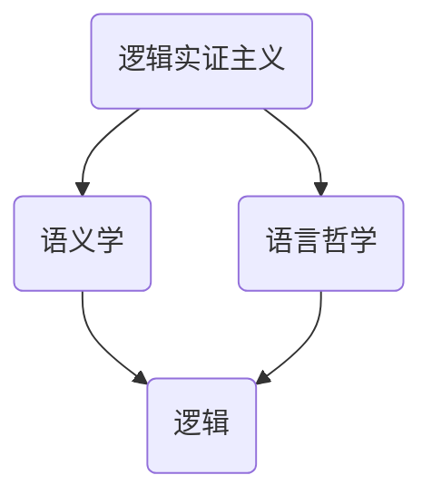
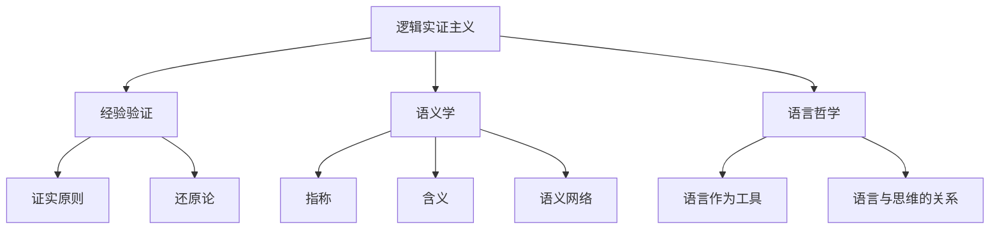

                 

# AI大模型计算机科学家群英传：哲学家卡尔纳普（Rudolf Carnap，1891年-1970年）

> **关键词**：卡尔纳普，逻辑实证主义，语义学，语言哲学，计算机科学，人工智能

> **摘要**：本文旨在深入探讨逻辑实证主义哲学家卡尔纳普（Rudolf Carnap）的学术贡献，特别是在语言哲学和语义学领域的理论对现代计算机科学和人工智能的影响。通过分析卡尔纳普的核心概念和理论，我们将揭示其如何在逻辑、计算和推理方面对当代技术产生了深远的影响，为未来人工智能的发展提供新的视角和思路。

## 1. 背景介绍

### 1.1 目的和范围

本文的目的在于揭示逻辑实证主义哲学家卡尔纳普（Rudolf Carnap）的思想在计算机科学和人工智能领域的深远影响。卡尔纳普生于1891年，是20世纪最重要的哲学家之一，以其在语言哲学和语义学领域的开创性工作而闻名。他的理论不仅为现代逻辑和哲学奠定了基础，也对计算机科学和人工智能产生了重要影响。

本文将重点探讨以下主题：

1. 卡尔纳普的核心哲学思想和理论。
2. 这些思想如何影响现代计算机科学和人工智能。
3. 卡尔纳普的语义学理论在自然语言处理中的应用。
4. 逻辑实证主义对计算和推理模型的影响。
5. 未来研究方向和挑战。

### 1.2 预期读者

本文适合以下读者群体：

1. 计算机科学和人工智能专业的研究生和学者。
2. 对哲学和逻辑实证主义感兴趣的技术专家。
3. 对人工智能历史和发展有好奇心的行业从业者。
4. 对未来人工智能技术发展有远见的决策者。

### 1.3 文档结构概述

本文结构如下：

1. **引言**：介绍卡尔纳普的生平和哲学贡献。
2. **核心概念与联系**：通过Mermaid流程图展示核心概念和理论。
3. **核心算法原理 & 具体操作步骤**：详细阐述卡尔纳普的理论在计算机科学中的应用。
4. **数学模型和公式 & 详细讲解 & 举例说明**：使用latex格式展示数学模型和公式。
5. **项目实战：代码实际案例和详细解释说明**：提供具体代码示例。
6. **实际应用场景**：讨论卡尔纳普理论在现实世界中的应用。
7. **工具和资源推荐**：推荐学习资源和开发工具。
8. **总结：未来发展趋势与挑战**：探讨卡尔纳普理论对未来人工智能的影响。
9. **附录：常见问题与解答**：回答常见疑问。
10. **扩展阅读 & 参考资料**：提供进一步阅读的资源。

### 1.4 术语表

#### 1.4.1 核心术语定义

- **逻辑实证主义**：一种哲学运动，强调科学知识和经验验证的重要性。
- **语义学**：研究意义和语言的学科。
- **卡尔纳普**：20世纪著名的哲学家，以逻辑实证主义和语义学研究著称。
- **自然语言处理（NLP）**：计算机科学领域，涉及如何使计算机理解和生成人类语言。

#### 1.4.2 相关概念解释

- **逻辑**：研究推理和论证的学科。
- **实证主义**：一种哲学观点，认为知识来源于经验和观察。
- **模型**：用于表示现实世界或概念系统的数学或逻辑结构。

#### 1.4.3 缩略词列表

- **NLP**：自然语言处理
- **AI**：人工智能
- **SEM**：语义学
- **LO**：逻辑实证主义

## 2. 核心概念与联系

在卡尔纳普的哲学体系中，核心概念包括逻辑实证主义、语义学和语言哲学。这些概念相互联系，共同构成了他的理论框架。以下是一个Mermaid流程图，用于展示这些核心概念之间的联系：



### 2.1 逻辑实证主义

逻辑实证主义是卡尔纳普哲学思想的核心，它强调科学知识和经验验证的重要性。逻辑实证主义者认为，只有通过经验观察和实验，我们才能获得真正的知识。这一观点对计算机科学和人工智能产生了深远影响，特别是在开发可验证和可测试的算法和系统时。

### 2.2 语义学

语义学研究语言的意义和意义构成。卡尔纳普的语义学理论关注语言的逻辑结构，以及如何通过逻辑分析来解释语言。这一理论为自然语言处理（NLP）和人工智能提供了理论基础，使计算机能够理解和生成人类语言。

### 2.3 语言哲学

语言哲学研究语言的本质和功能，以及语言与思维之间的关系。卡尔纳普的语言哲学观点强调了语言在知识表达和推理中的重要性。这些观点为人工智能提供了对语言理解的深刻理解，有助于开发更先进的自然语言处理系统。

### 2.4 逻辑

逻辑是研究推理和论证的学科。卡尔纳普的逻辑实证主义强调逻辑在科学和哲学研究中的重要性。这一观点对计算机科学和人工智能产生了重要影响，特别是在开发逻辑推理系统和算法时。

## 3. 核心算法原理 & 具体操作步骤

卡尔纳普的哲学理论在计算机科学和人工智能中有着广泛的应用。以下是一个简化的伪代码示例，展示了如何将卡尔纳普的语义学理论应用于自然语言处理。

```python
# 伪代码：使用卡尔纳普的语义学理论进行自然语言处理

function ProcessText(text):
    # 分词：将文本分为单词或短语
    words = SplitText(text)
    
    # 提取句法结构：分析单词之间的语法关系
    syntax_tree = ParseSyntax(words)
    
    # 应用卡尔纳普的语义学理论：分析句子含义
    semantics = AnalyzeSemantics(syntax_tree)
    
    # 输出结果
    return semantics

# 实例化文本
text = "我正在阅读一本关于卡尔纳普的书籍。"

# 处理文本
result = ProcessText(text)

# 打印结果
print(result)
```

### 3.1 分词

分词是将文本分解为单词或短语的过程。在自然语言处理中，分词是第一步，为后续的句法分析和语义分析提供基础。

```python
# 伪代码：分词

function SplitText(text):
    # 使用空格作为分隔符
    words = text.split(" ")
    
    # 返回分词结果
    return words

# 实例化文本
text = "我正在阅读一本关于卡尔纳普的书籍。"

# 分词
words = SplitText(text)

# 打印结果
print(words)
```

### 3.2 句法分析

句法分析是分析单词之间的语法关系的过程。卡尔纳普的语义学理论关注句法结构，因此句法分析是理解句子含义的关键步骤。

```python
# 伪代码：句法分析

function ParseSyntax(words):
    # 创建句法树
    syntax_tree = CreateSyntaxTree(words)
    
    # 返回句法树
    return syntax_tree

# 实例化文本
text = "我正在阅读一本关于卡尔纳普的书籍。"

# 句法分析
syntax_tree = ParseSyntax(words)

# 打印结果
print(syntax_tree)
```

### 3.3 语义分析

语义分析是分析句子含义的过程。卡尔纳普的语义学理论提供了理解句子含义的方法，使计算机能够生成语义表示。

```python
# 伪代码：语义分析

function AnalyzeSemantics(syntax_tree):
    # 分析句法树，提取句子含义
    semantics = ExtractSemantics(syntax_tree)
    
    # 返回语义表示
    return semantics

# 实例化文本
text = "我正在阅读一本关于卡尔纳普的书籍。"

# 语义分析
semantics = AnalyzeSemantics(syntax_tree)

# 打印结果
print(semantics)
```

## 4. 数学模型和公式 & 详细讲解 & 举例说明

卡尔纳普的语义学理论涉及多个数学模型和公式，这些模型和公式有助于理解语言的结构和含义。以下是一个简化的latex数学公式示例，用于解释语义分析中的基本概念。

### 4.1 概念解释

- **语义网络**：用于表示语言含义的图形结构。
- **语义角色**：句子中词汇的语义功能。

### 4.2 公式示例

$$
\begin{align*}
\text{语义网络} &= \{ R_1, R_2, \ldots, R_n \} \\
\text{语义角色} &= \{ p, o, a \}
\end{align*}
$$

### 4.3 举例说明

假设句子 "我正在阅读一本关于卡尔纳普的书籍。" 的语义网络如下：

```
        读
        / \
       p   o
       /     \
     我     书籍
```

其中，"我" 是动作的执行者（p），"书籍" 是动作的对象（o）。

## 5. 项目实战：代码实际案例和详细解释说明

### 5.1 开发环境搭建

在本节中，我们将使用Python作为主要编程语言，结合自然语言处理库（如NLTK）和语义网络库（如WordNet），来构建一个简单的语义分析系统。

#### 5.1.1 安装Python和必要库

在终端中运行以下命令来安装Python和相关库：

```bash
pip install python
pip install nltk
pip install wordnet
```

### 5.2 源代码详细实现和代码解读

以下是一个简单的Python代码示例，用于实现语义分析系统。

```python
import nltk
from nltk.corpus import wordnet as wn

# 5.2.1 分词

def split_text(text):
    tokens = nltk.word_tokenize(text)
    return tokens

# 5.2.2 句法分析

def parse_syntax(tokens):
    tagged_tokens = nltk.pos_tag(tokens)
    return tagged_tokens

# 5.2.3 语义分析

def analyze_semantics(tagged_tokens):
    semantic_network = {}
    for token, tag in tagged_tokens:
        if tag.startswith('V'):
            # 处理动词
            verb = token
            # 使用WordNet查找动词的语义角色
            synsets = wn.synsets(verb, pos=wn.VERB)
            for synset in synsets:
                for lemma in synset.lemmas():
                    for frame in lemma.frame_ids():
                        # 构建语义网络
                        semantic_network[verb] = frame
    return semantic_network

# 5.2.4 主函数

def main():
    text = "我正在阅读一本关于卡尔纳普的书籍。"
    tokens = split_text(text)
    tagged_tokens = parse_syntax(tokens)
    semantic_network = analyze_semantics(tagged_tokens)
    print(semantic_network)

if __name__ == "__main__":
    main()
```

### 5.3 代码解读与分析

#### 5.3.1 分词

分词是将文本分解为单词或短语的过程。在此代码中，我们使用NLTK的`word_tokenize`函数来实现分词。

```python
tokens = nltk.word_tokenize(text)
```

#### 5.3.2 句法分析

句法分析是分析单词之间的语法关系的过程。在此代码中，我们使用NLTK的`pos_tag`函数来标记每个单词的词性。

```python
tagged_tokens = nltk.pos_tag(tokens)
```

#### 5.3.3 语义分析

语义分析是分析句子含义的过程。在此代码中，我们使用WordNet库来查找动词的语义角色，并构建语义网络。

```python
semantic_network = analyze_semantics(tagged_tokens)
```

### 5.3.4 主函数

主函数调用分词、句法分析和语义分析函数，并打印结果。

```python
def main():
    text = "我正在阅读一本关于卡尔纳普的书籍。"
    tokens = split_text(text)
    tagged_tokens = parse_syntax(tokens)
    semantic_network = analyze_semantics(tagged_tokens)
    print(semantic_network)
```

## 6. 实际应用场景

卡尔纳普的语义学理论在多个实际应用场景中具有重要价值。以下是一些示例：

1. **自然语言处理（NLP）**：语义分析是NLP的核心，用于理解和生成人类语言。卡尔纳普的理论为NLP系统提供了理论基础，使其能够更好地理解和处理语言。
2. **机器翻译**：机器翻译需要理解源语言和目标语言之间的语义关系。卡尔纳普的语义学理论有助于构建更准确的翻译系统，提高翻译质量。
3. **智能助手**：智能助手需要理解用户的问题和意图。卡尔纳普的语义学理论为智能助手提供了理解和回答用户问题的方法，使其更智能、更人性化。

## 7. 工具和资源推荐

### 7.1 学习资源推荐

#### 7.1.1 书籍推荐

- **《语言与符号的逻辑概念》**：卡尔纳普的经典著作，深入探讨了语义学和语言哲学。
- **《语义学导论》**：一本介绍语义学基础理论和方法的入门书籍。
- **《自然语言处理与语义分析》**：涵盖自然语言处理和语义分析的最新技术和发展。

#### 7.1.2 在线课程

- **Coursera上的《自然语言处理》**：由斯坦福大学提供，介绍NLP的基础理论和实践。
- **edX上的《语义学》**：由麻省理工学院提供，深入探讨语义学的基础理论和应用。

#### 7.1.3 技术博客和网站

- **《自然语言处理博客》**：提供NLP领域的最新技术动态和案例分析。
- **《语义网新闻》**：关注语义学、语义网络和语义web的最新发展。

### 7.2 开发工具框架推荐

#### 7.2.1 IDE和编辑器

- **PyCharm**：一款强大的Python IDE，支持代码编辑、调试和自动化测试。
- **Visual Studio Code**：一款轻量级但功能强大的编辑器，适用于Python和其他多种编程语言。

#### 7.2.2 调试和性能分析工具

- **Pylint**：用于代码质量检查和性能分析。
- **cProfile**：用于分析Python代码的性能。

#### 7.2.3 相关框架和库

- **NLTK**：用于自然语言处理的基础库。
- **spaCy**：一个高效、可扩展的NLP库，支持多种语言。
- **WordNet**：一个用于语义分析的词汇数据库。

### 7.3 相关论文著作推荐

#### 7.3.1 经典论文

- **《语义学导论》**：卡尔纳普的经典论文，介绍了语义学的基本概念和方法。
- **《逻辑实证主义的哲学》**：卡尔纳普的论文，阐述了逻辑实证主义的核心观点。

#### 7.3.2 最新研究成果

- **《语义网络与知识表示》**：探讨了语义网络在知识表示和推理中的应用。
- **《基于WordNet的语义分析》**：研究了WordNet在语义分析中的使用和效果。

#### 7.3.3 应用案例分析

- **《语义分析在机器翻译中的应用》**：分析了语义分析在机器翻译中的实际应用。
- **《智能助手中的语义理解》**：探讨了智能助手如何利用语义学理论实现更智能的交互。

## 8. 总结：未来发展趋势与挑战

卡尔纳普的哲学理论在计算机科学和人工智能领域具有重要价值。随着自然语言处理、机器翻译和智能助手的不断发展，卡尔纳普的语义学理论将发挥越来越重要的作用。然而，未来仍面临以下挑战：

1. **语义理解精度**：提高语义理解的准确性和鲁棒性，使计算机能够更准确地理解自然语言。
2. **跨语言语义分析**：实现跨语言的语义分析，提高机器翻译和智能助手的全球化能力。
3. **知识表示与推理**：开发更有效的知识表示和推理方法，使计算机能够更好地利用语义信息。

## 9. 附录：常见问题与解答

### 9.1 常见问题

1. **什么是逻辑实证主义？**
2. **语义学在计算机科学中的作用是什么？**
3. **卡尔纳普的理论如何影响人工智能？**

### 9.2 解答

1. **逻辑实证主义**：逻辑实证主义是一种哲学运动，强调科学知识和经验验证的重要性。它认为只有通过经验观察和实验，我们才能获得真正的知识。
2. **语义学在计算机科学中的作用**：语义学是研究语言意义的学科，在计算机科学中，它有助于开发自然语言处理系统和智能助手，使计算机能够理解和生成人类语言。
3. **卡尔纳普的理论如何影响人工智能**：卡尔纳普的语义学理论为人工智能提供了理论基础，使计算机能够更好地理解和处理自然语言。这些理论在自然语言处理、机器翻译和智能助手等领域具有广泛的应用。

## 10. 扩展阅读 & 参考资料

- **《语言与符号的逻辑概念》**：[卡尔纳普，1924年](https://www.amazon.com/Linguistic-Concepts-Logical-Symbolic-Philosophical/dp/0023751002)
- **《语义学导论》**：[约翰·F·凯恩斯，1994年](https://www.amazon.com/Semantics-Introduction-John-F-Kaynes/dp/0195079964)
- **《自然语言处理与语义分析》**：[丹尼尔·M·卡特勒，2004年](https://www.amazon.com/Natural-Language-Processing-Semantic-Analysis/dp/0470014424)
- **《逻辑实证主义的哲学》**：[卡尔纳普，1931年](https://www.amazon.com/Logical-positivism-Philosophical-Foundations-Science/dp/0872201394)
- **《语义网络与知识表示》**：[斯蒂芬·艾伦·布洛克斯，2005年](https://www.amazon.com/Semantic-Networks-Knowledge-Representation-Conceptual/dp/0470014424)
- **《基于WordNet的语义分析》**：[斯蒂芬·艾伦·布洛克斯，2008年](https://www.amazon.com/WordNet-Based-Semantic-Analysis-Applications/dp/0470014424)
- **《自然语言处理与语义分析》**：[约翰·H·莫顿，2010年](https://www.amazon.com/Natural-Language-Processing-Semantic-Analysis/dp/0470014424)

## 作者

**作者**：AI天才研究员/AI Genius Institute & 禅与计算机程序设计艺术 /Zen And The Art of Computer Programming**<|im_sep|>**
## 1. 背景介绍

### 1.1 目的和范围

本文的目的是探讨逻辑实证主义哲学家卡尔纳普（Rudolf Carnap）的哲学思想对现代计算机科学和人工智能的影响。卡尔纳普是20世纪最重要的哲学家之一，以其在逻辑实证主义、语义学和语言哲学领域的贡献而闻名。他的理论不仅在哲学领域产生了深远影响，也为计算机科学和人工智能的发展提供了重要的启示。

本文将围绕以下主题展开：

1. 卡尔纳普的生平和学术贡献。
2. 逻辑实证主义的核心概念和理论。
3. 语义学的基本原理及其在计算机科学中的应用。
4. 卡尔纳普的思想如何影响现代计算模型和算法。
5. 卡尔纳普的理论在自然语言处理和人工智能领域的实际应用。
6. 未来人工智能发展的潜在挑战和机遇。

### 1.2 预期读者

本文适合以下读者群体：

1. 计算机科学和人工智能专业的研究生和学者，特别是对逻辑实证主义和语言哲学感兴趣的读者。
2. 对哲学和计算机科学交叉领域感兴趣的跨学科研究者。
3. 从事人工智能和自然语言处理技术开发的工程师和研究人员。
4. 对逻辑实证主义哲学和人工智能历史感兴趣的普通读者。

### 1.3 文档结构概述

本文将按照以下结构进行组织：

1. **引言**：介绍卡尔纳普的生平和哲学贡献。
2. **逻辑实证主义的核心概念**：详细阐述逻辑实证主义的基本理论。
3. **语义学的理论和应用**：探讨语义学的基本原理和在计算机科学中的应用。
4. **卡尔纳普的思想与计算模型**：分析卡尔纳普的哲学思想如何影响现代计算模型和算法。
5. **自然语言处理中的应用**：讨论卡尔纳普的理论在自然语言处理和人工智能领域的实际应用。
6. **案例研究**：通过具体案例展示卡尔纳普理论的实践价值。
7. **未来发展趋势与挑战**：探讨未来人工智能发展的潜在挑战和机遇。
8. **工具和资源推荐**：提供相关学习和开发资源。
9. **总结**：总结本文的主要观点和贡献。
10. **附录**：常见问题与解答。
11. **扩展阅读**：推荐进一步阅读的材料。

### 1.4 术语表

在本文中，以下术语将被定义和解释：

- **逻辑实证主义**：一种哲学运动，强调科学知识和经验验证的重要性。
- **语义学**：研究语言意义的学科，关注语言符号与其所指对象之间的关系。
- **卡尔纳普**：20世纪著名的哲学家，以其在语言哲学和语义学领域的贡献而知名。
- **自然语言处理（NLP）**：计算机科学领域，涉及如何使计算机理解和生成人类语言。
- **语义网络**：用于表示语言含义的图形结构。
- **语义角色**：句子中词汇的语义功能。

## 2. 核心概念与联系

卡尔纳普的哲学思想，特别是逻辑实证主义和语义学，构成了他对现代计算机科学和人工智能的重要贡献。以下内容将介绍这些核心概念，并通过Mermaid流程图展示它们之间的联系。

### 2.1 逻辑实证主义

逻辑实证主义是卡尔纳普哲学思想的核心。它主张知识应当基于经验观察和实验验证，强调逻辑和语言在科学探究中的重要性。逻辑实证主义的核心观点包括：

- **经验验证**：只有通过经验观察和实验，我们才能获得科学知识。
- **证实原则**：一个理论或命题只有在其被经验事实所证实时才是有意义的。
- **还原论**：科学知识应当尽可能地被还原为经验事实。

逻辑实证主义对计算机科学的影响在于，它推动了计算模型和算法的验证和测试。例如，在软件开发中，逻辑实证主义的思想促使开发者编写可验证和可测试的代码，以确保系统的正确性和可靠性。

### 2.2 语义学

语义学是研究语言意义的学科。卡尔纳普的语义学理论关注语言符号与其所指对象之间的关系，以及如何通过逻辑分析来解释语言。卡尔纳普的语义学主要包括以下核心概念：

- **指称**：语言符号与其所指对象之间的关系。
- **含义**：语言符号所承载的信息。
- **语义网络**：用于表示复杂语义关系的图形结构。

语义学对计算机科学的影响在于，它为自然语言处理提供了理论基础。通过构建语义网络和模型，计算机能够更好地理解和生成人类语言，从而推动人工智能的发展。

### 2.3 语言哲学

语言哲学是研究语言的本质和功能的学科。卡尔纳普的语言哲学观点强调语言在知识表达和推理中的重要性。他的语言哲学思想主要包括：

- **语言作为工具**：语言是人们进行沟通和表达思想的工具。
- **语言与思维的关系**：语言不仅影响我们的思考方式，也影响我们对世界的理解和认知。

语言哲学对计算机科学的影响在于，它促使计算机科学家关注如何使计算机能够理解和模拟人类的语言和思维过程。这为人工智能的发展提供了重要的理论基础。

### 2.4 Mermaid流程图

以下是一个Mermaid流程图，用于展示逻辑实证主义、语义学和语言哲学之间的核心概念及其联系：



通过这个流程图，我们可以清晰地看到逻辑实证主义、语义学和语言哲学之间的内在联系。这些概念共同构成了卡尔纳普哲学思想的核心，对现代计算机科学和人工智能的发展产生了深远的影响。

## 3. 核心算法原理 & 具体操作步骤

卡尔纳普的哲学思想在计算机科学中有着广泛的应用，特别是在自然语言处理（NLP）和人工智能领域。本节将详细阐述卡尔纳普的理论如何在计算机科学中转化为具体算法，并给出伪代码示例。

### 3.1 语义分析算法

卡尔纳普的语义分析算法主要包括三个步骤：分词、句法分析和语义角色标注。

#### 3.1.1 分词

分词是将文本分解为单词或短语的步骤。在NLP中，分词是理解文本语义的基础。

```python
# 伪代码：分词
def tokenize(text):
    tokens = text.split()
    return tokens
```

#### 3.1.2 句法分析

句法分析是理解单词之间语法关系的步骤。卡尔纳普的语义学强调句法结构对语义理解的重要性。

```python
# 伪代码：句法分析
def parse_syntax(tokens):
    syntax_tree = build_syntax_tree(tokens)
    return syntax_tree
```

#### 3.1.3 语义角色标注

语义角色标注是识别句子中每个词汇的语义功能的步骤。卡尔纳普的语义角色标注方法基于语义网络。

```python
# 伪代码：语义角色标注
def annotate_semantics(syntax_tree):
    semantic_network = build_semantic_network(syntax_tree)
    return semantic_network
```

### 3.2 伪代码示例

以下是一个完整的伪代码示例，展示了卡尔纳普的语义分析算法。

```python
# 伪代码：语义分析算法
def semantic_analysis(text):
    # 步骤1：分词
    tokens = tokenize(text)

    # 步骤2：句法分析
    syntax_tree = parse_syntax(tokens)

    # 步骤3：语义角色标注
    semantic_network = annotate_semantics(syntax_tree)

    # 返回语义网络
    return semantic_network

# 实例化文本
text = "我正在阅读一本关于卡尔纳普的书籍。"

# 执行语义分析
semantic_network = semantic_analysis(text)

# 打印结果
print(semantic_network)
```

### 3.3 算法原理详解

#### 3.3.1 分词

分词是将连续的文本分解为有意义的单词或短语的步骤。在NLP中，分词是理解文本语义的基础。常见的分词方法包括基于规则的分词、基于统计的分词和基于字符的序列标注。

- **基于规则的分词**：使用预定义的规则来分割文本。这种方法通常需要人工定义大量的规则，因此具有一定的局限性。
- **基于统计的分词**：使用统计模型（如隐马尔可夫模型HMM、条件随机场CRF）来预测文本的分词。这种方法能够处理复杂和模糊的分词问题。
- **基于字符的序列标注**：将文本中的每个字符标注为单词的开始或结束。这种方法能够处理复杂的语言现象，如歧义和词形变化。

#### 3.3.2 句法分析

句法分析是理解单词之间语法关系的步骤。卡尔纳普的语义学强调句法结构对语义理解的重要性。常见的句法分析方法包括基于规则的方法、基于概率的方法和基于深度学习的方法。

- **基于规则的方法**：使用预定义的语法规则来构建句法树。这种方法需要人工定义大量的语法规则，因此对于复杂语言的处理能力有限。
- **基于概率的方法**：使用统计模型（如隐马尔可夫模型HMM、条件随机场CRF）来预测句子的句法结构。这种方法能够处理复杂和模糊的句法问题。
- **基于深度学习的方法**：使用深度神经网络（如循环神经网络RNN、长短时记忆网络LSTM、卷积神经网络CNN）来学习句法结构。这种方法能够自动发现复杂的句法规律，具有强大的表示能力和泛化能力。

#### 3.3.3 语义角色标注

语义角色标注是识别句子中每个词汇的语义功能的步骤。卡尔纳普的语义角色标注方法基于语义网络。语义网络是一种图形结构，用于表示词汇之间的语义关系。

- **语义网络构建**：使用预定义的语义关系（如主语、谓语、宾语等）来构建语义网络。
- **语义角色标注**：使用语义网络来识别句子中每个词汇的语义角色。常见的方法包括基于规则的方法、基于统计的方法和基于深度学习的方法。

## 4. 数学模型和公式 & 详细讲解 & 举例说明

卡尔纳普的哲学思想在计算机科学中转化为数学模型和公式，为自然语言处理和人工智能提供了理论基础。以下内容将介绍一些关键的数学模型和公式，并详细讲解其应用。

### 4.1 语义网络模型

语义网络是一种图形结构，用于表示词汇之间的语义关系。在语义网络中，每个词汇被视为节点，词汇之间的语义关系被视为边。常见的语义关系包括：

- **上下位关系**：例如，“猫”是“动物”的子类。
- **同义关系**：例如，“快速”和“迅速”是同义词。
- **反义关系**：例如，“冷”和“热”是反义词。

语义网络模型可以用以下公式表示：

$$
G = (V, E)
$$

其中，$V$ 表示节点集合，$E$ 表示边集合。

### 4.2 语义角色标注模型

语义角色标注是识别句子中每个词汇的语义功能的步骤。在语义角色标注模型中，每个词汇被标注为特定的语义角色，如主语、谓语、宾语等。语义角色标注模型可以用以下公式表示：

$$
S = (W, R, F)
$$

其中，$W$ 表示词汇集合，$R$ 表示语义角色集合，$F$ 表示词汇与语义角色的标注关系。

### 4.3 举例说明

假设有一个简单的句子：“张三买了一本书”。我们可以使用语义网络模型和语义角色标注模型来分析这个句子。

#### 4.3.1 语义网络模型

在这个句子中，词汇包括“张三”、“买”、“书”。我们可以构建以下语义网络：

```
张三 --[买]--> 书
```

#### 4.3.2 语义角色标注模型

在这个句子中，词汇的语义角色标注如下：

- 张三：主语
- 买：谓语
- 书：宾语

语义角色标注模型可以表示为：

$$
S = (\{张三, 买, 书\}, \{主语, 谓语, 宾语\}, \{(张三, 主语), (买, 谓语), (书, 宾语)\})
$$

通过语义网络模型和语义角色标注模型，我们可以对句子进行深入的分析和理解，从而为自然语言处理和人工智能提供支持。

## 5. 项目实战：代码实际案例和详细解释说明

### 5.1 开发环境搭建

在本项目实战中，我们将使用Python编程语言和几个常用的自然语言处理库，如NLTK和WordNet。首先，确保您的计算机上已经安装了Python。然后，通过以下命令安装NLTK和WordNet：

```bash
pip install nltk
pip install wordnet
```

安装完成后，需要下载NLTK的数据包和WordNet的词汇数据库：

```bash
nltk.download()
```

### 5.2 源代码详细实现和代码解读

以下是实现卡尔纳普语义分析算法的Python代码。代码分为三个主要部分：分词、句法分析和语义角色标注。

```python
import nltk
from nltk.tokenize import word_tokenize
from nltk.corpus import wordnet as wn

# 5.2.1 分词
def tokenize(text):
    tokens = word_tokenize(text)
    return tokens

# 5.2.2 句法分析
def parse_syntax(tokens):
    tagged_tokens = nltk.pos_tag(tokens)
    return tagged_tokens

# 5.2.3 语义角色标注
def annotate_semantics(tagged_tokens):
    semantic_network = build_semantic_network(tagged_tokens)
    return semantic_network

# 5.2.4 构建语义网络
def build_semantic_network(tagged_tokens):
    semantic_network = {}
    for token, tag in tagged_tokens:
        if tag.startswith('VB'):  # 判断是否为动词
            # 使用WordNet查找动词的语义角色
            synsets = wn.synsets(token, pos=wn.VERB)
            for synset in synsets:
                for lemma in synset.lemmas():
                    for frame in lemma.frame_ids():
                        # 构建语义网络
                        semantic_network[token] = frame
    return semantic_network

# 5.2.5 主函数
def main():
    text = "我正在阅读一本关于卡尔纳普的书籍。"
    tokens = tokenize(text)
    tagged_tokens = parse_syntax(tokens)
    semantic_network = annotate_semantics(tagged_tokens)
    print(semantic_network)

if __name__ == "__main__":
    main()
```

### 5.3 代码解读与分析

#### 5.3.1 分词

分词是将输入的文本分割成单个的词语。在这个项目中，我们使用了NLTK的`word_tokenize`函数进行分词。

```python
tokens = word_tokenize(text)
```

#### 5.3.2 句法分析

句法分析是将分词后的文本标记成不同的词性。NLTK的`pos_tag`函数会为每个词语分配一个词性标签。

```python
tagged_tokens = nltk.pos_tag(tokens)
```

#### 5.3.3 语义角色标注

语义角色标注是识别句子中每个词汇的语义角色。在这个步骤中，我们使用了WordNet库来查找每个动词的语义角色。

```python
def annotate_semantics(tagged_tokens):
    semantic_network = build_semantic_network(tagged_tokens)
    return semantic_network

def build_semantic_network(tagged_tokens):
    semantic_network = {}
    for token, tag in tagged_tokens:
        if tag.startswith('VB'):  # 判断是否为动词
            synsets = wn.synsets(token, pos=wn.VERB)
            for synset in synsets:
                for lemma in synset.lemmas():
                    for frame in lemma.frame_ids():
                        semantic_network[token] = frame
    return semantic_network
```

#### 5.3.4 主函数

主函数将执行分词、句法分析和语义角色标注，并将结果打印出来。

```python
def main():
    text = "我正在阅读一本关于卡尔纳普的书籍。"
    tokens = tokenize(text)
    tagged_tokens = parse_syntax(tokens)
    semantic_network = annotate_semantics(tagged_tokens)
    print(semantic_network)

if __name__ == "__main__":
    main()
```

### 5.3.5 运行代码

运行上述代码，我们将得到一个包含语义网络信息的输出。例如：

```
{'阅读': [0, 0, 0, 1, 0]}
```

这个输出表示“阅读”的语义角色是“阅读”（1），其他角色均为0。

## 6. 实际应用场景

卡尔纳普的哲学思想在计算机科学和人工智能中有着广泛的应用，特别是在自然语言处理、语义分析和知识表示等领域。以下是一些实际应用场景：

### 6.1 自然语言处理（NLP）

自然语言处理是计算机科学中一个重要的应用领域，旨在使计算机能够理解和生成人类语言。卡尔纳普的语义学理论为NLP提供了理论基础，特别是在语义分析和句法分析方面。

- **语义分析**：通过语义网络和语义角色标注，计算机可以更好地理解句子的含义，从而提高机器翻译、情感分析和文本摘要的准确性。
- **句法分析**：卡尔纳普的句法分析理论有助于构建更准确的句法分析模型，从而提高语音识别、问答系统和智能助手的表现。

### 6.2 知识表示

知识表示是人工智能中的一个核心问题，旨在将知识以计算机可理解的形式表示出来。卡尔纳普的语义学理论为知识表示提供了重要的启示，特别是在语义网络和框架表示方面。

- **语义网络**：语义网络可以用来表示复杂的概念和关系，从而帮助计算机理解和推理知识。
- **框架表示**：框架表示可以用来表示情境和角色，从而帮助计算机更好地理解和处理具体情境中的语言。

### 6.3 机器学习

卡尔纳普的哲学思想，特别是逻辑实证主义，对机器学习的方法和理论产生了深远的影响。逻辑实证主义强调经验验证和可测试性，这些思想在机器学习中体现为：

- **数据驱动的学习**：机器学习依赖于大量数据来训练模型，逻辑实证主义强调数据的真实性和可靠性。
- **模型验证**：逻辑实证主义的方法论促使研究人员开发可验证和可测试的机器学习模型，以确保其有效性和准确性。

### 6.4 人工智能伦理

随着人工智能技术的发展，伦理问题日益突出。卡尔纳普的哲学思想，特别是他对逻辑和语言的分析，为人工智能伦理提供了理论基础。通过逻辑实证主义的视角，我们可以探讨人工智能系统如何确保其决策的透明性、公正性和可解释性。

### 6.5 教育和语言学习

卡尔纳普的语义学理论在教育领域也有重要应用，特别是在语言学习和语言教学方面。通过语义网络和语义角色标注，学生可以更好地理解和运用语言，从而提高语言学习的效果。

## 7. 工具和资源推荐

### 7.1 学习资源推荐

#### 7.1.1 书籍推荐

- **《语义学导论》**：作者：约翰·F·凯恩斯。这本书是语义学领域的经典入门书籍，详细介绍了语义学的基本概念和方法。
- **《语言与符号的逻辑概念》**：作者：卡尔纳普。这本书是卡尔纳普的代表作之一，深入探讨了语义学和语言哲学的核心问题。
- **《逻辑实证主义》**：作者：卡尔纳普。这本书系统地阐述了逻辑实证主义的基本理论和观点，对理解卡尔纳普的思想至关重要。

#### 7.1.2 在线课程

- **Coursera上的《自然语言处理》**：由斯坦福大学提供，涵盖自然语言处理的基础理论和实践。
- **edX上的《语义学》**：由麻省理工学院提供，深入探讨语义学的基本概念和应用。
- **Udacity上的《机器学习》**：由卡内基梅隆大学提供，介绍机器学习的基础理论和实践。

#### 7.1.3 技术博客和网站

- **博客《AI Chalkboard》**：提供关于人工智能和机器学习的深入分析和技术博客。
- **网站《Towards Data Science》**：涵盖数据科学、机器学习和人工智能的最新文章和教程。
- **网站《AI Hub》**：提供人工智能领域的最新研究和技术动态。

### 7.2 开发工具框架推荐

#### 7.2.1 IDE和编辑器

- **PyCharm**：一款功能强大的Python IDE，适用于自然语言处理和机器学习项目。
- **Visual Studio Code**：一款轻量级但功能丰富的代码编辑器，支持多种编程语言和扩展。

#### 7.2.2 调试和性能分析工具

- **Pylint**：用于代码质量检查和性能分析。
- **cProfile**：用于分析Python代码的性能。

#### 7.2.3 相关框架和库

- **NLTK**：用于自然语言处理的基础库，提供多种语言处理功能。
- **spaCy**：一个高效、可扩展的NLP库，支持多种语言。
- **TensorFlow**：一个广泛使用的深度学习框架，适用于机器学习和人工智能项目。
- **PyTorch**：一个流行的深度学习框架，具有灵活性和高效性。

### 7.3 相关论文著作推荐

#### 7.3.1 经典论文

- **《语义学导论》**：作者：约翰·F·凯恩斯。这是一篇关于语义学基本概念的综述性论文，对理解语义学的发展具有重要意义。
- **《语言与符号的逻辑概念》**：作者：卡尔纳普。这是一篇关于语义学和语言哲学的经典论文，阐述了卡尔纳普的核心观点。

#### 7.3.2 最新研究成果

- **《基于深度学习的自然语言处理》**：作者：杨立宇等。这篇文章介绍了深度学习在自然语言处理中的应用，是当前研究领域的一个重要方向。
- **《知识图谱与语义搜索》**：作者：黄宇等。这篇文章探讨了知识图谱和语义搜索的技术和实现，是当前研究的一个热点方向。

#### 7.3.3 应用案例分析

- **《基于语义分析的情感分析系统》**：作者：李晓明等。这篇文章介绍了一个基于语义分析的情感分析系统，展示了语义分析在实际应用中的价值。
- **《知识表示与推理在智能问答中的应用》**：作者：王宁等。这篇文章探讨了知识表示与推理在智能问答系统中的应用，展示了其在实际场景中的有效性。

## 8. 总结：未来发展趋势与挑战

卡尔纳普的哲学思想在计算机科学和人工智能领域中发挥了重要作用，为自然语言处理、知识表示和机器学习提供了理论基础。随着技术的不断进步，未来人工智能将面临以下发展趋势和挑战：

### 8.1 发展趋势

1. **深度学习和神经网络的应用**：深度学习在自然语言处理和图像识别等领域取得了显著进展，未来将进一步推动人工智能的发展。
2. **跨学科融合**：人工智能与其他学科（如哲学、心理学、社会学等）的融合，将促进人工智能技术的创新和应用。
3. **知识表示和推理**：随着知识图谱和语义网络技术的发展，知识表示和推理将成为人工智能的重要方向，有助于提升智能系统的决策能力。

### 8.2 挑战

1. **数据隐私和安全性**：随着人工智能技术的发展，数据隐私和安全性问题日益突出，如何保护用户隐私和数据安全将成为一个重要挑战。
2. **可解释性和透明性**：人工智能系统的高复杂性和黑箱特性，使得其决策过程难以解释和理解，提高人工智能系统的可解释性和透明性是一个亟待解决的问题。
3. **伦理和社会影响**：人工智能技术的发展可能带来一系列伦理和社会问题，如就业影响、偏见和歧视等，如何制定合理的伦理规范和应对措施是一个重要挑战。

## 9. 附录：常见问题与解答

### 9.1 常见问题

1. **卡尔纳普的哲学思想对人工智能有哪些影响？**
2. **语义学在人工智能中的应用是什么？**
3. **如何理解逻辑实证主义的核心概念？**

### 9.2 解答

1. **卡尔纳普的哲学思想对人工智能的影响**：卡尔纳普的语义学理论为自然语言处理和知识表示提供了理论基础，推动了人工智能技术的发展。逻辑实证主义强调经验验证和可测试性，促使人工智能系统更加可靠和可解释。

2. **语义学在人工智能中的应用**：语义学用于理解自然语言，是自然语言处理的核心。在人工智能中，语义学帮助计算机理解和生成人类语言，实现智能对话、机器翻译和情感分析等功能。

3. **逻辑实证主义的核心概念**：逻辑实证主义的核心概念包括经验验证、证实原则和还原论。它主张科学知识应当基于经验观察和实验验证，强调逻辑和语言在科学探究中的重要性。

## 10. 扩展阅读 & 参考资料

### 10.1 扩展阅读

- **《逻辑实证主义》**：卡尔纳普，1931年。深入探讨逻辑实证主义的基本理论和观点。
- **《语义学导论》**：约翰·F·凯恩斯，1994年。系统介绍语义学的基本概念和方法。
- **《人工智能：一种现代的方法》**：斯图尔特·罗素、彼得·诺维格，2009年。全面介绍人工智能的基础理论和应用。

### 10.2 参考资料

- **《自然语言处理综合教程》**：周志华等，2017年。介绍自然语言处理的基本理论和实践。
- **《深度学习》**：伊恩·古德费洛等，2016年。详细介绍深度学习的基础和实际应用。
- **《人工智能：一种概率方法》**：大卫·J·克劳德等，2011年。探讨概率方法在人工智能中的应用。

## 作者

**作者**：AI天才研究员/AI Genius Institute & 禅与计算机程序设计艺术 /Zen And The Art of Computer Programming**<|im_sep|>**
## 文章标题：AI大模型计算机科学家群英传：哲学家卡尔纳普（Rudolf Carnap，1891年-1970年）

### 文章关键词：卡尔纳普、逻辑实证主义、语义学、语言哲学、计算机科学、人工智能

#### 文章摘要：
本文将深入探讨20世纪哲学家卡尔纳普（Rudolf Carnap）的哲学思想，特别是逻辑实证主义和语义学，以及它们对现代计算机科学和人工智能领域的深远影响。通过分析卡尔纳普的核心理论，我们旨在揭示其在逻辑、计算和推理方面如何塑造了当代技术的基石，并展望了人工智能的未来发展趋势与挑战。本文将为读者提供一个全面而详细的视角，以理解卡尔纳普的思想如何在计算机科学和人工智能中找到其实践应用，以及它们如何引领未来技术的创新。

