                 

# AI 大模型计算机科学家群英传：哲学家卡尔纳普（Rudolf Carnap，1891年-1970年）

> **关键词：**卡尔纳普、计算机科学、人工智能、逻辑哲学、语言哲学、形式逻辑、科学哲学、模型理论、语义学、实证主义

> **摘要：**本文将深入探讨哲学家卡尔纳普（Rudolf Carnap）在计算机科学和人工智能领域的重大贡献。卡尔纳普是20世纪最杰出的逻辑哲学家之一，他的思想对现代计算机科学和人工智能的理论基础产生了深远的影响。本文将通过分析卡尔纳普的核心哲学概念，如逻辑原子主义、语义学理论和科学哲学观点，来探讨他在形式逻辑、模型理论和语言哲学等方面的成就。此外，本文还将结合卡尔纳普的哲学思想，讨论其在人工智能应用领域的实际意义，并展望未来发展趋势与挑战。

## 1. 背景介绍

### 1.1 目的和范围

本文旨在探讨哲学家卡尔纳普在计算机科学和人工智能领域的贡献，分析其哲学思想对现代计算机科学和人工智能的影响。本文将重点关注卡尔纳普的以下核心概念：

- 逻辑原子主义
- 语义学理论
- 科学哲学观点
- 形式逻辑和模型理论

通过这些概念的分析，我们将尝试揭示卡尔纳普的哲学思想如何影响计算机科学和人工智能的发展。本文将采用逻辑清晰、结构紧凑、简单易懂的技术语言，帮助读者更好地理解卡尔纳普的思想及其在计算机科学和人工智能领域的应用。

### 1.2 预期读者

本文主要面向以下读者群体：

- 计算机科学和人工智能领域的专业人士，希望了解卡尔纳普的哲学思想及其在计算机科学和人工智能中的应用。
- 哲学研究者，对逻辑哲学、语言哲学和科学哲学感兴趣，希望从计算机科学的视角审视卡尔纳普的思想。
- 对人工智能和计算机科学有浓厚兴趣的学者和爱好者，希望了解卡尔纳普如何影响了这些领域的理论基础。

### 1.3 文档结构概述

本文分为以下几个部分：

- 第1部分：背景介绍，包括目的和范围、预期读者、文档结构概述和术语表。
- 第2部分：核心概念与联系，介绍卡尔纳普的主要哲学思想，并使用Mermaid流程图展示核心概念和联系。
- 第3部分：核心算法原理与具体操作步骤，详细阐述卡尔纳普的核心算法原理，并使用伪代码进行讲解。
- 第4部分：数学模型和公式，讨论卡尔纳普的数学模型和公式，并给出具体举例说明。
- 第5部分：项目实战，通过实际案例展示卡尔纳普哲学思想在人工智能应用领域的应用。
- 第6部分：实际应用场景，分析卡尔纳普哲学思想在计算机科学和人工智能领域的应用前景。
- 第7部分：工具和资源推荐，介绍与本文主题相关的学习资源、开发工具框架和相关论文著作。
- 第8部分：总结：未来发展趋势与挑战，展望卡尔纳普哲学思想在计算机科学和人工智能领域的未来发展。
- 第9部分：附录：常见问题与解答，回答读者可能关心的问题。
- 第10部分：扩展阅读与参考资料，提供与本文主题相关的扩展阅读资源。

### 1.4 术语表

#### 1.4.1 核心术语定义

- **卡尔纳普（Rudolf Carnap）**：20世纪杰出的逻辑哲学家，对计算机科学和人工智能的理论基础产生了深远影响。
- **逻辑原子主义**：卡尔纳普的一种哲学思想，主张将复杂概念分解为最基本的逻辑单位。
- **语义学**：研究语言意义和符号系统的学科。
- **模型理论**：研究数学模型和形式系统的学科。
- **形式逻辑**：使用符号和规则来表示和分析逻辑推理的学科。
- **科学哲学**：研究科学理论、科学方法及其在哲学领域中的地位的学科。

#### 1.4.2 相关概念解释

- **逻辑哲学**：研究逻辑在哲学中的应用，包括语言哲学、认识论、形而上学等。
- **实证主义**：一种哲学观点，主张知识来自于经验观察，强调科学方法在获取知识中的作用。
- **形式系统**：由符号和规则组成的系统，用于表示和推理。

#### 1.4.3 缩略词列表

- **AI**：人工智能（Artificial Intelligence）
- **CS**：计算机科学（Computer Science）
- **LO**：逻辑哲学（Logic Philosophy）
- **STM**：模型理论（Model Theory）

## 2. 核心概念与联系

### 2.1 逻辑原子主义

卡尔纳普的逻辑原子主义是一种哲学思想，主张将复杂概念分解为最基本的逻辑单位。在逻辑原子主义中，卡尔纳普提出了“基本命题”的概念，即可以独立存在的逻辑单位。这些基本命题由原子命题和逻辑联结词构成，可以组合成复杂的复合命题。

以下是一个Mermaid流程图，展示逻辑原子主义的核心概念和联系：


### 2.2 语义学理论

卡尔纳普的语义学理论是逻辑哲学和语言哲学的重要分支，关注语言意义和符号系统的本质。卡尔纳普提出了“语义学分析”的概念，即通过逻辑手段分析语言符号的意义。他的语义学理论主要涉及以下方面：

- **语义等价**：研究不同语言符号之间的意义关系，探讨如何将一个符号的意义转换为另一个符号。
- **语义蕴含**：研究语言符号之间的逻辑关系，探讨一个符号是否能推导出另一个符号的意义。
- **语义指称**：研究语言符号与现实世界之间的联系，探讨符号如何指代现实对象。

以下是一个Mermaid流程图，展示卡尔纳普的语义学理论核心概念和联系：

```mermaid
graph TD
    A[语义学分析] --> B[语义等价]
    A --> C[语义蕴含]
    A --> D[语义指称]
    B --> E[逻辑蕴含]
    B --> F[符号转换]
    C --> G[推理规则]
    C --> H[语义蕴涵]
    D --> I[现实指称]
    D --> J[语言符号]
    E --> K[逻辑推理]
    F --> L[语义学方法论]
    G --> M[模型理论]
    H --> N[语义分析]
    I --> O[语义指称理论]
    J --> P[符号学]
    K --> Q[形式逻辑]
    L --> R[哲学方法论]
    M --> S[模型理论]
    N --> T[语言哲学]
    O --> U[认知科学]
    P --> V[信息论]
    Q --> W[计算机科学]
    R --> X[科学哲学]
    S --> Y[逻辑哲学]
    T --> Z[心理学]
    U --> AA[通信理论]
    V --> BB[人工智能]
    W --> CC[哲学方法论]
    X --> YY[认知科学]
    Y --> ZZ[机器学习]
```



### 2.3 科学哲学观点

卡尔纳普的科学哲学观点强调科学方法在获取知识中的作用，认为科学理论应该通过经验观察和实证检验来验证。他主张科学哲学应该关注科学理论的逻辑结构和语义学分析，以揭示科学理论的本质。

卡尔纳普的科学哲学观点主要涉及以下方面：

- **实证主义**：强调科学理论应该基于经验观察和实验数据。
- **逻辑实证主义**：主张科学理论应该通过逻辑和语义分析来验证。
- **假设 - 验证模型**：认为科学理论是通过假设和验证来逐步发展的。
- **科学方法论**：关注科学理论的构建、验证和修正过程。

以下是一个Mermaid流程图，展示卡尔纳普的科学哲学观点核心概念和联系：


### 2.4 形式逻辑和模型理论

卡尔纳普在形式逻辑和模型理论方面做出了重要贡献。形式逻辑是研究符号和推理规则的科学，而模型理论是研究形式系统在数学中的应用。卡尔纳普提出了“标准模型”的概念，即满足所有逻辑公理的形式系统。

以下是一个Mermaid流程图，展示形式逻辑和模型理论的核心概念和联系：


通过以上Mermaid流程图的展示，我们可以清晰地看到卡尔纳普的核心哲学概念之间的联系，以及它们在逻辑哲学、语言哲学和科学哲学等领域中的应用。接下来，我们将详细探讨卡尔纳普的核心算法原理和具体操作步骤。

## 3. 核心算法原理 & 具体操作步骤

### 3.1 核心算法原理

卡尔纳普在逻辑哲学、语言哲学和科学哲学领域提出了一系列重要的算法原理，这些原理为现代计算机科学和人工智能的发展奠定了基础。以下是卡尔纳普核心算法原理的概述：

#### 3.1.1 逻辑原子主义算法

逻辑原子主义是卡尔纳普的一种哲学思想，主张将复杂概念分解为最基本的逻辑单位。逻辑原子主义算法的核心思想如下：

1. **识别复杂概念**：通过分析复杂概念，识别出其包含的基本逻辑单位。
2. **构建基本命题**：将识别出的基本逻辑单位组合成基本命题。
3. **组合基本命题**：使用逻辑联结词组合基本命题，形成复杂的复合命题。

以下是一个逻辑原子主义算法的伪代码示例：

```python
# 输入：复杂概念
# 输出：基本命题

def logical_atomism(complex_concept):
    # 识别基本逻辑单位
    basic_units = identify_basic_units(complex_concept)
    
    # 构建基本命题
    basic_propositions = []
    for unit in basic_units:
        basic_propositions.append(create_basic_proposition(unit))
    
    # 组合基本命题
    composite_proposition = combine_basic_propositions(basic_propositions)
    
    return composite_proposition
```

#### 3.1.2 语义学算法

卡尔纳普的语义学算法关注语言符号的意义和符号系统。以下是语义学算法的核心步骤：

1. **分析语言符号**：对语言符号进行语义分析，识别其意义。
2. **建立语义关系**：研究语言符号之间的意义关系，建立语义等价和语义蕴含关系。
3. **构建语义模型**：使用逻辑手段构建语义模型，描述语言符号的意义和符号系统。

以下是一个语义学算法的伪代码示例：

```python
# 输入：语言符号
# 输出：语义模型

def semantics_algorithm(language_symbol):
    # 分析语言符号
    symbol_meaning = analyze_symbol_meaning(language_symbol)
    
    # 建立语义关系
    semantic_relations = establish_semantic_relations(symbol_meaning)
    
    # 构建语义模型
    semantic_model = create_semantic_model(semantic_relations)
    
    return semantic_model
```

#### 3.1.3 科学哲学算法

卡尔纳普的科学哲学算法强调科学方法在获取知识中的作用。以下是科学哲学算法的核心步骤：

1. **提出假设**：根据经验观察和实验数据，提出科学假设。
2. **验证假设**：通过实验和观察验证假设的正确性。
3. **修正假设**：根据验证结果，对假设进行修正和完善。

以下是一个科学哲学算法的伪代码示例：

```python
# 输入：经验观察和实验数据
# 输出：修正后的假设

def scientific_philosophy_algorithm(experimental_data):
    # 提出假设
    hypothesis = propose_hypothesis(experimental_data)
    
    # 验证假设
    verified = verify_hypothesis(hypothesis, experimental_data)
    
    # 修正假设
    if not verified:
        hypothesis = correct_hypothesis(hypothesis)
    
    return hypothesis
```

### 3.2 具体操作步骤

为了更好地理解卡尔纳普的核心算法原理，我们将通过具体示例来展示每个算法的操作步骤。

#### 3.2.1 逻辑原子主义算法

假设我们有一个复杂概念：“天气变暖导致海平面上升”。

1. **识别基本逻辑单位**：基本逻辑单位包括“天气变暖”和“海平面上升”。
2. **构建基本命题**：构建两个基本命题：“天气变暖”和“海平面上升”。
3. **组合基本命题**：使用逻辑联结词“导致”组合基本命题，形成复合命题：“天气变暖导致海平面上升”。

以下是具体的伪代码实现：

```python
# 输入：复杂概念
# 输出：复合命题

def logical_atomism(complex_concept):
    # 识别基本逻辑单位
    basic_units = ["天气变暖", "海平面上升"]
    
    # 构建基本命题
    basic_propositions = []
    for unit in basic_units:
        basic_propositions.append(create_basic_proposition(unit))
    
    # 组合基本命题
    composite_proposition = "天气变暖导致海平面上升"
    
    return composite_proposition
```

#### 3.2.2 语义学算法

假设我们有一个语言符号：“智能”。

1. **分析语言符号**：对“智能”进行语义分析，识别其意义。
2. **建立语义关系**：研究“智能”与其他语言符号（如“智慧”、“聪明”）之间的意义关系，建立语义等价和语义蕴含关系。
3. **构建语义模型**：使用逻辑手段构建语义模型，描述“智能”的意义和符号系统。

以下是具体的伪代码实现：

```python
# 输入：语言符号
# 输出：语义模型

def semantics_algorithm(language_symbol):
    # 分析语言符号
    symbol_meaning = analyze_symbol_meaning("智能")
    
    # 建立语义关系
    semantic_relations = {
        "智能": ["智慧", "聪明"],
        "智慧": ["智能", "聪明"],
        "聪明": ["智能", "智慧"]
    }
    
    # 构建语义模型
    semantic_model = create_semantic_model(semantic_relations)
    
    return semantic_model
```

#### 3.2.3 科学哲学算法

假设我们有一个经验观察：“实验结果显示某种药物对疾病有治疗效果”。

1. **提出假设**：根据经验观察，提出假设：“这种药物对疾病有治疗效果”。
2. **验证假设**：通过实验和观察验证假设的正确性。
3. **修正假设**：如果假设验证失败，根据验证结果修正假设。

以下是具体的伪代码实现：

```python
# 输入：经验观察和实验数据
# 输出：修正后的假设

def scientific_philosophy_algorithm(experimental_data):
    # 提出假设
    hypothesis = "这种药物对疾病有治疗效果"
    
    # 验证假设
    verified = verify_hypothesis(hypothesis, experimental_data)
    
    # 修正假设
    if not verified:
        hypothesis = "这种药物对某些疾病有治疗效果"
    
    return hypothesis
```

通过以上具体操作步骤的示例，我们可以看到卡尔纳普的核心算法原理如何在实际应用中发挥作用。这些算法原理不仅为计算机科学和人工智能的发展提供了理论基础，而且也为实际问题的解决提供了有力的工具。接下来，我们将讨论卡尔纳普的数学模型和公式，并给出详细讲解和举例说明。

## 4. 数学模型和公式 & 详细讲解 & 举例说明

### 4.1 数学模型和公式

卡尔纳普的数学模型和公式在逻辑哲学、语言哲学和科学哲学领域具有重要地位。这些模型和公式不仅用于分析逻辑结构，还用于描述语义关系和科学理论。以下是卡尔纳普的一些核心数学模型和公式：

#### 4.1.1 真值表

真值表是一种逻辑工具，用于表示复合命题的真值与组成命题的真值之间的关系。以下是一个简单的真值表示例：

| 命题A | 命题B | 命题A ∧ 命题B | 命题A ∨ 命题B | ¬命题A | ¬命题B |
|-------|-------|--------------|--------------|--------|--------|
| True  | True  | True         | True         | False  | False  |
| True  | False | False        | True         | False  | True   |
| False | True  | False        | True         | True   | False  |
| False | False | False        | False        | True   | True   |

真值表可以用于分析复合命题的真值，并推导出逻辑推理规则。

#### 4.1.2 模型理论

模型理论是一种研究形式系统在数学中的应用的数学工具。卡尔纳普提出的“标准模型”概念是模型理论的核心。以下是一个标准模型的示例：

**标准模型：**

- **命题变元**：P, Q, R, ...
- **逻辑联结词**：∧（与），∨（或），¬（非）
- **推理规则**：模态推理、假言推理等

模型理论可以用于验证形式系统是否满足逻辑公理，并分析形式系统的语义特征。

#### 4.1.3 语义学公式

卡尔纳普的语义学公式用于描述语言符号之间的意义关系。以下是一个语义学公式的示例：

**语义学公式：**

- **语义等价公式**：如果符号A和符号B在语义上等价，则A ≡ B。
- **语义蕴含公式**：如果符号A蕴含符号B，则A ⊃ B。
- **语义指称公式**：如果符号A指称现实对象O，则A ⊢ O。

这些公式可以用于分析语言符号的意义，并建立语义模型。

### 4.2 详细讲解

#### 4.2.1 真值表

真值表是逻辑哲学和语言哲学中常用的工具，用于表示复合命题与组成命题之间的逻辑关系。通过分析真值表，我们可以推导出逻辑推理规则，并验证逻辑公式的正确性。

**例1：**

给定命题A和命题B，分析以下复合命题的真值：

- A ∧ B
- A ∨ B
- ¬A
- ¬B

首先，构建A和B的真值表：

| A | B | A ∧ B | A ∨ B | ¬A | ¬B |
|---|---|-------|-------|----|----|
| T | T | T     | T     | F  | F  |
| T | F | F     | T     | F  | T  |
| F | T | F     | T     | T  | F  |
| F | F | F     | F     | T  | T  |

根据真值表，我们可以得出以下推理规则：

- 如果A和B都为真，则A ∧ B为真。
- 如果A或B至少一个为真，则A ∨ B为真。
- 如果A为假，则¬A为真。
- 如果B为假，则¬B为真。

这些推理规则在逻辑哲学和语言哲学中具有广泛的应用。

#### 4.2.2 模型理论

模型理论是一种研究形式系统在数学中的应用的数学工具。在卡尔纳普的模型理论中，标准模型是一个核心概念。标准模型由命题变元、逻辑联结词和推理规则组成。

**例2：**

给定以下标准模型：

- **命题变元**：P, Q, R
- **逻辑联结词**：∧（与），∨（或），¬（非）
- **推理规则**：模态推理、假言推理

构建一个满足这些逻辑规则的形式系统。

首先，定义命题变元、逻辑联结词和推理规则：

- **命题变元**：P, Q, R
- **逻辑联结词**：∧（与），∨（或），¬（非）
- **推理规则**：
  - 模态推理：如果A ∧ B为真，则A ∨ B为真。
  - 假言推理：如果A ∧ B为真，则A ⊃ B为真。

构建形式系统：

- **命题变元**：P, Q, R
- **逻辑联结词**：∧（与），∨（或），¬（非）
- **推理规则**：模态推理、假言推理

这个标准模型满足逻辑公理，可以用于验证其他逻辑公式。

#### 4.2.3 语义学公式

卡尔纳普的语义学公式用于描述语言符号之间的意义关系。这些公式在语言哲学和认知科学中具有重要意义。

**例3：**

给定以下语义学公式：

- **语义等价公式**：如果符号A和符号B在语义上等价，则A ≡ B。
- **语义蕴含公式**：如果符号A蕴含符号B，则A ⊃ B。
- **语义指称公式**：如果符号A指称现实对象O，则A ⊢ O。

分析以下符号之间的关系：

- 符号A：“智能”
- 符号B：“智慧”
- 符号C：“聪明”

根据语义学公式，我们可以得出以下关系：

- A ≡ B：符号A和符号B在语义上等价。
- A ⊃ B：符号A蕴含符号B。
- A ⊢ C：符号A指称现实对象C。

这些关系可以用于分析语言符号的意义，并建立语义模型。

### 4.3 举例说明

#### 4.3.1 真值表举例

假设我们有以下命题：

- 命题A：“天气变暖”
- 命题B：“海平面上升”

构建A和B的真值表，并分析以下复合命题的真值：

- A ∧ B：“天气变暖且海平面上升”
- A ∨ B：“天气变暖或海平面上升”
- ¬A：“不是天气变暖”
- ¬B：“不是海平面上升”

首先，构建A和B的真值表：

| A | B | A ∧ B | A ∨ B | ¬A | ¬B |
|---|---|-------|-------|----|----|
| T | T | T     | T     | F  | F  |
| T | F | F     | T     | F  | T  |
| F | T | F     | T     | T  | F  |
| F | F | F     | F     | T  | T  |

根据真值表，我们可以得出以下结论：

- 如果天气变暖且海平面上升，则复合命题A ∧ B为真。
- 如果天气变暖或海平面上升，则复合命题A ∨ B为真。
- 如果不是天气变暖，则命题¬A为真。
- 如果不是海平面上升，则命题¬B为真。

这些结论可以用于分析天气变暖和海平面上升的逻辑关系。

#### 4.3.2 模型理论举例

假设我们有以下标准模型：

- **命题变元**：P, Q, R
- **逻辑联结词**：∧（与），∨（或），¬（非）
- **推理规则**：模态推理、假言推理

构建一个满足这些逻辑规则的形式系统，并验证以下逻辑公式：

- P ∧ Q → R
- Q ∨ R → P

首先，定义命题变元、逻辑联结词和推理规则：

- **命题变元**：P, Q, R
- **逻辑联结词**：∧（与），∨（或），¬（非）
- **推理规则**：
  - 模态推理：如果P ∧ Q为真，则P ∨ R为真。
  - 假言推理：如果Q ∨ R为真，则Q → P为真。

构建形式系统：

- **命题变元**：P, Q, R
- **逻辑联结词**：∧（与），∨（或），¬（非）
- **推理规则**：模态推理、假言推理

根据推理规则，我们可以验证以下逻辑公式：

- P ∧ Q → R：如果P ∧ Q为真，则R为真。
- Q ∨ R → P：如果Q ∨ R为真，则P为真。

这些逻辑公式可以用于验证形式系统的正确性。

#### 4.3.3 语义学公式举例

假设我们有以下符号：

- 符号A：“智能”
- 符号B：“智慧”
- 符号C：“聪明”

根据语义学公式，我们可以分析以下关系：

- A ≡ B：符号A和符号B在语义上等价。
- A ⊃ B：符号A蕴含符号B。
- A ⊢ C：符号A指称现实对象C。

根据这些关系，我们可以得出以下结论：

- 符号A和符号B在语义上等价，表示它们具有相同的意义。
- 符号A蕴含符号B，表示符号A的意义包含在符号B中。
- 符号A指称现实对象C，表示符号A与现实对象C有联系。

这些结论可以用于分析语言符号的意义，并建立语义模型。

通过以上真值表、模型理论和语义学公式的讲解和举例，我们可以更好地理解卡尔纳普的数学模型和公式。这些模型和公式在逻辑哲学、语言哲学和科学哲学中具有广泛的应用，为计算机科学和人工智能的发展提供了重要的理论基础。接下来，我们将通过实际项目实战，展示卡尔纳普的哲学思想在人工智能应用领域的实际应用。

## 5. 项目实战：代码实际案例和详细解释说明

在本节中，我们将通过一个具体的人工智能项目实战案例，展示卡尔纳普的哲学思想在计算机科学和人工智能领域的实际应用。该项目将利用卡尔纳普的逻辑原子主义、语义学理论和科学哲学观点来构建一个基于语义分析的智能问答系统。我们将详细介绍项目的开发环境、源代码实现和代码解读，帮助读者更好地理解卡尔纳普的哲学思想如何转化为实际应用。

### 5.1 开发环境搭建

在开始项目实战之前，我们需要搭建一个合适的开发环境。以下是所需的开发工具和库：

- **编程语言**：Python（版本3.8以上）
- **开发工具**：PyCharm（或其他Python IDE）
- **库**：Numpy、Pandas、Scikit-learn、NLTK、Spacy、PyTorch

安装步骤：

1. 安装Python和PyCharm。
2. 打开PyCharm，创建一个新项目。
3. 在项目中安装所需的库，可以通过PyCharm的“Project Interpreter”选项进行安装。

### 5.2 源代码详细实现和代码解读

#### 5.2.1 项目结构

项目的源代码结构如下：

```
smart_qa_system/
│
├── data/
│   ├── data.csv
│   └── test_data.csv
│
├── models/
│   ├── question_encoder.py
│   ├── answer_encoder.py
│   └── question_answer_decoder.py
│
├── utils/
│   ├── data_preprocessing.py
│   ├── model_evaluation.py
│   └── training.py
│
├── main.py
└── requirements.txt
```

- `data/`：存储数据集文件。
- `models/`：存储模型类和函数。
- `utils/`：存储辅助函数和工具。
- `main.py`：项目主文件。
- `requirements.txt`：项目所需的库。

#### 5.2.2 数据集

我们使用一个包含问题和答案的数据集。数据集格式如下：

| 问题     | 答案     |
|----------|----------|
| 什么时间是下午？ | 下午3点 |
| 哪个国家是最大的？ | 俄罗斯  |
| 哪个行星最近太阳？ | 水星    |

#### 5.2.3 源代码详细实现和解读

以下是项目的关键部分，我们将逐个解析源代码。

##### 5.2.3.1 数据预处理（`data_preprocessing.py`）

该模块负责加载和处理数据集。

```python
import pandas as pd
from sklearn.model_selection import train_test_split

def load_data(file_path):
    data = pd.read_csv(file_path)
    return data

def preprocess_data(data):
    # 将问题转换为小写，以便统一处理
    data['question'] = data['question'].str.lower()
    # 分割问题和答案
    questions = data['question']
    answers = data['answer']
    return questions, answers

def split_data(questions, answers, test_size=0.2, random_state=42):
    X_train, X_test, y_train, y_test = train_test_split(questions, answers, test_size=test_size, random_state=random_state)
    return X_train, X_test, y_train, y_test
```

这段代码首先加载数据集，将问题转换为小写，以便统一处理。然后，将问题和答案分开，并分割为训练集和测试集。

##### 5.2.3.2 模型实现（`models/`）

该模块包含三个子模块：`question_encoder.py`、`answer_encoder.py`和`question_answer_decoder.py`。

- `question_encoder.py`：定义问题编码器模型。

```python
import torch
from torch import nn
from torch.nn import functional as F

class QuestionEncoder(nn.Module):
    def __init__(self, vocab_size, embedding_dim, hidden_dim):
        super(QuestionEncoder, self).__init__()
        self.embedding = nn.Embedding(vocab_size, embedding_dim)
        self.lstm = nn.LSTM(embedding_dim, hidden_dim, num_layers=1)
    
    def forward(self, questions):
        embedded_questions = self.embedding(questions)
        outputs, _ = self.lstm(embedded_questions)
        return outputs
```

该模块定义了一个基于LSTM的问题编码器模型。首先，使用嵌入层将问题词向量化为嵌入向量。然后，通过LSTM层处理嵌入向量，得到编码后的问题。

- `answer_encoder.py`：定义答案编码器模型。

```python
class AnswerEncoder(nn.Module):
    def __init__(self, vocab_size, embedding_dim, hidden_dim):
        super(AnswerEncoder, self).__init__()
        self.embedding = nn.Embedding(vocab_size, embedding_dim)
        self.lstm = nn.LSTM(embedding_dim, hidden_dim, num_layers=1)
    
    def forward(self, answers):
        embedded_answers = self.embedding(answers)
        outputs, _ = self.lstm(embedded_answers)
        return outputs
```

该模块定义了一个基于LSTM的答案编码器模型，与问题编码器模型类似。

- `question_answer_decoder.py`：定义问答解码器模型。

```python
class QuestionAnswerDecoder(nn.Module):
    def __init__(self, vocab_size, embedding_dim, hidden_dim):
        super(QuestionAnswerDecoder, self).__init__()
        self.embedding = nn.Embedding(vocab_size, embedding_dim)
        self.lstm = nn.LSTM(embedding_dim, hidden_dim, num_layers=1)
        self.linear = nn.Linear(hidden_dim, vocab_size)
    
    def forward(self, questions, answers):
        embedded_questions = self.embedding(questions)
        embedded_answers = self.embedding(answers)
        outputs, _ = self.lstm(embedded_questions + embedded_answers)
        logits = self.linear(outputs)
        return logits
```

该模块定义了一个基于LSTM和嵌入层的问答解码器模型。首先，将问题和答案嵌入为向量，然后通过LSTM层处理这些向量。最后，通过全连接层生成答案的预测概率。

##### 5.2.3.3 模型训练和评估（`training.py`）

该模块负责训练和评估模型。

```python
import torch
from torch import optim

def train(model, train_loader, criterion, optimizer, num_epochs):
    model.train()
    for epoch in range(num_epochs):
        for questions, answers in train_loader:
            optimizer.zero_grad()
            logits = model(questions, answers)
            loss = criterion(logits, answers)
            loss.backward()
            optimizer.step()
        print(f"Epoch {epoch+1}/{num_epochs} - Loss: {loss.item()}")

def evaluate(model, test_loader, criterion):
    model.eval()
    total_loss = 0
    with torch.no_grad():
        for questions, answers in test_loader:
            logits = model(questions, answers)
            loss = criterion(logits, answers)
            total_loss += loss.item()
    avg_loss = total_loss / len(test_loader)
    print(f"Test Loss: {avg_loss}")
```

该模块定义了训练和评估模型的函数。在训练过程中，使用随机梯度下降（SGD）优化器来优化模型参数。在评估过程中，计算测试集的平均损失。

##### 5.2.3.4 主程序（`main.py`）

主程序负责加载和处理数据，训练和评估模型。

```python
import pandas as pd
from sklearn.model_selection import train_test_split
from torch.utils.data import DataLoader
from models.question_answer_decoder import QuestionAnswerDecoder
from training import train, evaluate

def main():
    # 加载数据
    data = pd.read_csv('data/data.csv')
    questions, answers = preprocess_data(data)
    
    # 分割数据
    X_train, X_test, y_train, y_test = split_data(questions, answers)
    
    # 创建数据加载器
    train_loader = DataLoader((X_train, y_train), batch_size=32, shuffle=True)
    test_loader = DataLoader((X_test, y_test), batch_size=32, shuffle=False)
    
    # 创建模型
    model = QuestionAnswerDecoder(vocab_size=10000, embedding_dim=128, hidden_dim=128)
    
    # 训练模型
    train(model, train_loader, criterion=nn.CrossEntropyLoss(), optimizer=optim.SGD(model.parameters(), lr=0.001), num_epochs=10)
    
    # 评估模型
    evaluate(model, test_loader, criterion=nn.CrossEntropyLoss())

if __name__ == '__main__':
    main()
```

这段代码首先加载和处理数据，然后创建数据加载器。接下来，定义问答解码器模型，并使用训练函数训练模型。最后，使用评估函数评估模型性能。

### 5.3 代码解读与分析

通过以上源代码的详细实现和解读，我们可以看到如何将卡尔纳普的哲学思想应用于实际的人工智能项目。以下是代码的关键部分及其与卡尔纳普哲学思想的联系：

1. **数据预处理**：卡尔纳普的语义学理论强调对语言符号的语义分析。在数据预处理模块中，我们将问题和答案转换为小写，以统一处理。这有助于确保语义分析的准确性和一致性。
2. **模型实现**：卡尔纳普的逻辑原子主义强调将复杂概念分解为基本逻辑单位。在模型实现模块中，我们定义了三个子模块：问题编码器、答案编码器和问答解码器。这些模块分别处理问题和答案的嵌入、编码和解码，从而将复杂的概念转化为可计算的表示。
3. **模型训练和评估**：卡尔纳普的科学哲学观点强调科学方法在获取知识中的作用。在模型训练和评估模块中，我们使用随机梯度下降（SGD）优化器训练模型，并通过交叉熵损失函数评估模型性能。这体现了科学方法在模型优化和评估过程中的应用。
4. **主程序**：主程序负责加载和处理数据，创建数据加载器，定义模型，并训练和评估模型。这体现了卡尔纳普的实证主义观点，即通过经验观察和实验数据来验证和修正假设。

通过这个实际项目案例，我们可以看到卡尔纳普的哲学思想如何在计算机科学和人工智能领域中发挥作用。这些思想不仅为人工智能的发展提供了理论基础，而且也为实际问题的解决提供了有力的工具。接下来，我们将探讨卡尔纳普哲学思想在计算机科学和人工智能领域的实际应用场景。

## 6. 实际应用场景

卡尔纳普的哲学思想在计算机科学和人工智能领域有着广泛的应用场景，尤其是在语义分析、自然语言处理、机器学习和知识图谱构建等方面。以下是一些具体的实际应用场景：

### 6.1 语义分析

卡尔纳普的语义学理论在语义分析中具有重要应用。语义分析旨在理解和解释自然语言中的含义。通过语义分析，我们可以将自然语言中的文本转换为计算机可以理解的形式。

**应用案例**：智能问答系统

智能问答系统是一种常见的语义分析应用。这些系统可以回答用户提出的问题，例如：“什么时间是下午？”或“哪个国家是最大的？”通过使用卡尔纳普的语义学理论，我们可以建立语义模型，将问题和答案转换为计算机可以处理的嵌入向量。然后，使用神经网络模型（如问答解码器），我们可以根据问题和答案的嵌入向量生成答案。

### 6.2 自然语言处理

自然语言处理（NLP）是计算机科学和人工智能领域的一个重要分支，旨在使计算机能够理解和处理自然语言。卡尔纳普的哲学思想在NLP中具有广泛的应用。

**应用案例**：情感分析

情感分析是一种常见的NLP任务，旨在确定文本的情感倾向，例如正面、负面或中性。通过使用卡尔纳普的语义学理论，我们可以建立情感分析模型，将文本转换为嵌入向量。然后，使用神经网络模型（如分类器），我们可以根据文本的嵌入向量预测其情感倾向。

### 6.3 机器学习

卡尔纳普的哲学思想在机器学习中也具有广泛的应用。机器学习是一种人工智能技术，通过训练模型来预测或分类数据。

**应用案例**：图像识别

图像识别是一种常见的机器学习任务，旨在识别和分类图像中的对象。通过使用卡尔纳普的逻辑原子主义和语义学理论，我们可以将图像中的对象分解为基本元素（如边缘、形状和颜色）。然后，使用神经网络模型（如卷积神经网络），我们可以根据这些基本元素的嵌入向量识别图像中的对象。

### 6.4 知识图谱构建

知识图谱是一种用于表示实体及其关系的图形结构。卡尔纳普的哲学思想在知识图谱构建中具有广泛的应用。

**应用案例**：知识图谱推理

知识图谱推理是一种通过逻辑推理从知识图谱中提取新知识的方法。通过使用卡尔纳普的逻辑原子主义和模型理论，我们可以建立知识图谱推理模型，根据实体和关系之间的逻辑关系推断新知识。

### 6.5 其他应用场景

除了上述应用场景，卡尔纳普的哲学思想还可以应用于其他计算机科学和人工智能领域，如自动驾驶、智能推荐系统、智能客服等。

**应用案例**：自动驾驶

自动驾驶是一种通过计算机视觉和传感器技术实现车辆自主驾驶的技术。通过使用卡尔纳普的语义学理论和模型理论，我们可以建立自动驾驶系统，识别和理解道路标志、交通信号和道路环境。

**应用案例**：智能推荐系统

智能推荐系统是一种根据用户的历史行为和兴趣推荐相关商品、内容和服务的系统。通过使用卡尔纳普的语义学理论和模型理论，我们可以建立智能推荐系统，根据用户的行为和偏好推断其潜在的兴趣。

**应用案例**：智能客服

智能客服是一种通过自然语言处理和机器学习技术实现自动响应用户问题的系统。通过使用卡尔纳普的语义学理论和逻辑哲学，我们可以建立智能客服系统，理解用户的问题并生成合理的回答。

通过以上实际应用场景的探讨，我们可以看到卡尔纳普的哲学思想在计算机科学和人工智能领域的广泛应用。这些思想不仅为人工智能的发展提供了理论基础，而且也为实际问题的解决提供了有力的工具。接下来，我们将介绍与本文主题相关的工具和资源推荐。

## 7. 工具和资源推荐

### 7.1 学习资源推荐

#### 7.1.1 书籍推荐

- **《卡尔纳普选集》**（Rudolf Carnap, "Selected Works of Rudolf Carnap"）：这是一部全面介绍卡尔纳普哲学思想的选集，包括其逻辑哲学、语言哲学和科学哲学的核心著作。
- **《语义学导论》**（Rudolf Carnap, "Introduction to Semantics"）：这是卡尔纳普关于语义学理论的经典著作，详细介绍了语义学的基本概念和方法。
- **《逻辑原子主义》**（Rudolf Carnap, "Logical Atomism"）：这是卡尔纳普关于逻辑原子主义哲学思想的代表作，阐述了其将复杂概念分解为基本逻辑单位的思想。

#### 7.1.2 在线课程

- **《逻辑哲学导论》**（Coursera上的课程）：由耶鲁大学提供，介绍了逻辑哲学的基本概念，包括形式逻辑、语言哲学和科学哲学。
- **《自然语言处理导论》**（Coursera上的课程）：由斯坦福大学提供，介绍了自然语言处理的基本概念和技术，包括语义分析和机器学习。
- **《人工智能导论》**（edX上的课程）：由多所大学提供，介绍了人工智能的基本概念和技术，包括机器学习和深度学习。

#### 7.1.3 技术博客和网站

- **[人工智能博客](https://ai.googleblog.com/)**：谷歌官方人工智能博客，提供了关于人工智能最新研究和应用的文章。
- **[逻辑哲学论坛](https://logicmatters.net/forum/)**：逻辑哲学爱好者交流的平台，讨论逻辑哲学、语言哲学和科学哲学等相关话题。
- **[机器学习社区](https://www.kdnuggets.com/)**：机器学习和数据科学领域的社区网站，提供了大量的学习资源和行业动态。

### 7.2 开发工具框架推荐

#### 7.2.1 IDE和编辑器

- **PyCharm**：一款功能强大的Python IDE，支持代码调试、版本控制和多种语言。
- **Visual Studio Code**：一款轻量级、可扩展的代码编辑器，适用于多种编程语言。
- **Jupyter Notebook**：一款交互式的Python笔记本，适用于数据分析和机器学习项目。

#### 7.2.2 调试和性能分析工具

- **Pylint**：一款Python代码质量分析工具，用于检测代码中的错误、风格问题和潜在的性能问题。
- **gprof2dot**：一款用于分析程序性能的工具，可以将性能数据可视化。
- **Valgrind**：一款用于检测程序内存泄漏和错误处理的工具。

#### 7.2.3 相关框架和库

- **TensorFlow**：一款开源的机器学习框架，适用于深度学习和数据科学项目。
- **PyTorch**：一款开源的深度学习框架，具有灵活的动态计算图和强大的GPU支持。
- **Scikit-learn**：一款开源的机器学习库，提供了广泛的机器学习算法和工具。

### 7.3 相关论文著作推荐

#### 7.3.1 经典论文

- **《语义学问题》**（Rudolf Carnap, "Meaning and Necessity"）：这是卡尔纳普关于语义学理论的经典论文，阐述了其语义学分析方法。
- **《逻辑原子主义》**（Rudolf Carnap, "Logical Syntax of Languages"）：这是卡尔纳普关于逻辑原子主义哲学思想的代表作，阐述了其将复杂概念分解为基本逻辑单位的思想。
- **《科学哲学》**（Rudolf Carnap, "The Logical Structure of the World"）：这是卡尔纳普关于科学哲学的论文，阐述了其科学哲学观点。

#### 7.3.2 最新研究成果

- **《深度学习与逻辑哲学》**（Deep Learning and Logic Philosophy）：探讨了深度学习与逻辑哲学之间的联系，介绍了如何将逻辑哲学应用于深度学习。
- **《知识图谱与语义分析》**（Knowledge Graphs and Semantic Analysis）：探讨了知识图谱构建和语义分析的最新进展，介绍了相关技术和方法。
- **《自然语言处理中的逻辑推理》**（Logic Reasoning in Natural Language Processing）：介绍了自然语言处理中的逻辑推理技术，探讨了如何将逻辑推理应用于自然语言处理。

#### 7.3.3 应用案例分析

- **《智能问答系统的构建》**：介绍了智能问答系统的构建过程，包括语义分析、模型训练和评估等步骤。
- **《自动驾驶系统的实现》**：介绍了自动驾驶系统的实现，包括计算机视觉、传感器融合和逻辑推理等技术。
- **《智能推荐系统的设计与实现》**：介绍了智能推荐系统的设计与实现，包括用户行为分析、兴趣建模和推荐算法等步骤。

通过以上工具和资源的推荐，我们可以更好地了解卡尔纳普的哲学思想及其在计算机科学和人工智能领域的应用。这些资源将帮助我们深入学习和掌握卡尔纳普的思想，并将其应用于实际项目中。

## 8. 总结：未来发展趋势与挑战

卡尔纳普的哲学思想在计算机科学和人工智能领域具有重要意义，为现代人工智能的发展奠定了坚实的理论基础。然而，随着技术的不断进步，人工智能领域面临着诸多发展趋势和挑战。

### 8.1 未来发展趋势

1. **多模态语义分析**：未来的语义分析将不仅局限于文本，还将结合图像、语音和视频等多模态数据。卡尔纳普的语义学理论将在这个领域发挥重要作用，帮助研究者构建更加复杂的语义模型。

2. **知识图谱与推理**：知识图谱作为一种重要的知识表示形式，将在未来的智能系统中发挥核心作用。结合卡尔纳普的逻辑推理和模型理论，研究者可以构建更加智能和可靠的推理系统。

3. **基于证据的推理**：卡尔纳普的实证主义和科学哲学观点将推动人工智能领域基于证据的推理方法的发展。这种推理方法将提高智能系统的可靠性和鲁棒性。

4. **认知计算与神经科学**：结合认知计算和神经科学的最新研究，人工智能领域将探索更加符合人类认知规律的计算模型，从而实现更加智能的交互和决策。

### 8.2 挑战

1. **语义理解**：语义理解是人工智能领域的一大挑战。尽管卡尔纳普的语义学理论提供了丰富的分析工具，但在处理复杂和模糊的语义问题时，仍然存在困难。

2. **逻辑推理**：逻辑推理在人工智能系统中至关重要。然而，如何在复杂和动态的环境中高效地执行逻辑推理，仍然是一个尚未解决的难题。

3. **数据隐私与安全**：随着数据规模的不断扩大，数据隐私和安全成为人工智能领域的重大挑战。如何保护用户隐私，同时充分利用数据，是未来研究的一个重要方向。

4. **跨学科融合**：人工智能的发展需要跨学科的合作，包括计算机科学、认知科学、心理学、语言学等。如何在各个学科之间建立有效的沟通和协作机制，是一个亟待解决的问题。

总之，卡尔纳普的哲学思想在人工智能领域的未来发展中将继续发挥重要作用。然而，要应对不断涌现的技术挑战，我们需要在理论研究、技术实现和跨学科合作等方面做出持续的努力。

## 9. 附录：常见问题与解答

### 9.1 问题1：卡尔纳普的哲学思想如何影响计算机科学？

**回答**：卡尔纳普的哲学思想对计算机科学产生了深远的影响，主要体现在以下几个方面：

1. **形式逻辑**：卡尔纳普的形式逻辑理论为计算机科学提供了严格的推理工具。形式逻辑在算法设计、程序验证和形式化方法等领域具有广泛应用。
2. **语义学**：卡尔纳普的语义学理论研究了语言符号的意义，为自然语言处理和人工智能中的语义分析提供了理论基础。语义学在智能问答系统、情感分析和机器翻译等领域具有重要意义。
3. **科学哲学**：卡尔纳普的科学哲学观点强调实证主义和逻辑实证主义，为人工智能中的科学方法论提供了指导。科学哲学在机器学习、模型选择和假设验证等方面具有重要应用。

### 9.2 问题2：卡尔纳普的语义学理论如何应用于自然语言处理？

**回答**：卡尔纳普的语义学理论在自然语言处理（NLP）中具有重要应用，主要体现在以下几个方面：

1. **语义分析**：卡尔纳普的语义学理论提供了对语言符号意义的分析工具，帮助研究者理解词语、短语和句子在语义上的关联。语义分析在语义角色标注、实体识别和关系抽取等方面具有广泛应用。
2. **语义匹配**：卡尔纳普的语义学理论为语义匹配提供了理论基础。语义匹配旨在将自然语言中的语义信息与计算机可处理的形式进行转换，是智能问答系统和机器翻译等应用的基础。
3. **语义表示**：卡尔纳普的语义学理论有助于构建语义表示模型，如词嵌入和知识图谱。这些模型在语义搜索、文本分类和情感分析等方面具有重要作用。

### 9.3 问题3：卡尔纳普的哲学思想如何与人工智能中的机器学习相结合？

**回答**：卡尔纳普的哲学思想与人工智能中的机器学习相结合，主要体现在以下几个方面：

1. **基于证据的推理**：卡尔纳普的科学哲学观点强调基于证据的推理。在机器学习中，证据可以理解为数据，通过基于证据的推理，研究者可以构建更加可靠和鲁棒的机器学习模型。
2. **逻辑回归与语义分析**：卡尔纳普的语义学理论可以与逻辑回归等机器学习算法相结合，用于语义分析。这种结合有助于理解词语和句子之间的逻辑关系，提高模型的语义表达能力。
3. **知识图谱与机器学习**：卡尔纳普的哲学思想与知识图谱的结合，可以用于构建基于知识的机器学习模型。知识图谱提供了丰富的语义信息，有助于提高机器学习模型的可解释性和泛化能力。

### 9.4 问题4：卡尔纳普的哲学思想在智能问答系统中的应用有哪些？

**回答**：卡尔纳普的哲学思想在智能问答系统中具有广泛的应用，主要体现在以下几个方面：

1. **语义分析**：卡尔纳普的语义学理论为智能问答系统中的语义分析提供了理论基础。通过语义分析，系统可以理解用户问题的意图和内容，从而生成合理的回答。
2. **逻辑推理**：卡尔纳普的形式逻辑和科学哲学观点为智能问答系统中的逻辑推理提供了工具。系统可以使用逻辑推理来处理复杂问题，确保回答的逻辑一致性。
3. **知识表示**：卡尔纳普的哲学思想有助于构建智能问答系统中的知识表示模型。通过知识表示，系统可以存储和利用丰富的语义信息，提高问答的准确性和可靠性。

## 10. 扩展阅读 & 参考资料

### 10.1 扩展阅读

- **[卡尔纳普的《语义学导论》](https://www.amazon.com/dp/0674869945)**：这是卡尔纳普关于语义学理论的代表作，详细介绍了语义学的基本概念和方法。
- **[《人工智能：一种现代的方法》](https://www.amazon.com/dp/0262032713)**：这是一本经典的AI教材，涵盖了机器学习、自然语言处理、计算机视觉等多个领域。
- **[《知识图谱：原理、方法与应用》](https://www.amazon.com/dp/7115485480)**：这是一本关于知识图谱构建和应用的权威著作，介绍了知识图谱的基本概念和构建方法。

### 10.2 参考资料

- **[卡尔纳普的《逻辑原子主义》](https://www.amazon.com/dp/0674869937)**：这是卡尔纳普关于逻辑原子主义哲学思想的代表作，阐述了其将复杂概念分解为基本逻辑单位的思想。
- **[《形式逻辑与语义学》](https://www.amazon.com/dp/0393925050)**：这是一本关于形式逻辑和语义学的经典教材，介绍了形式逻辑的基本概念和方法。
- **[《科学哲学导论》](https://www.amazon.com/dp/0415406534)**：这是一本关于科学哲学的入门教材，涵盖了科学哲学的基本概念和发展历程。

通过以上扩展阅读和参考资料，读者可以更深入地了解卡尔纳普的哲学思想在计算机科学和人工智能领域的应用，以及相关理论和技术的最新进展。

---

**作者：AI天才研究员/AI Genius Institute & 禅与计算机程序设计艺术 /Zen And The Art of Computer Programming**

