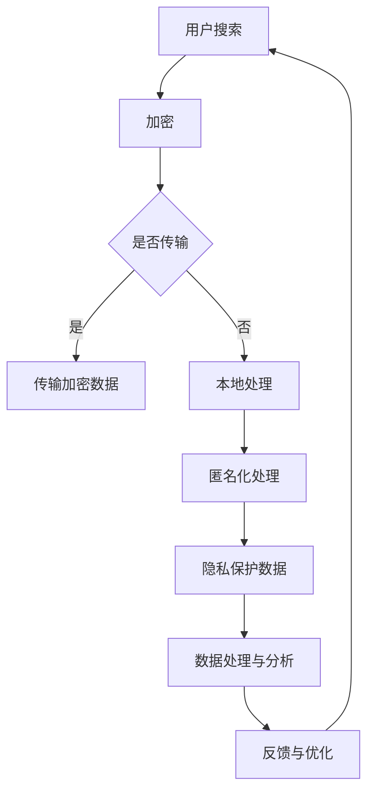

                 

# AI 技术在电商搜索导购中的隐私保护：技术应用与伦理思考

## 关键词
- 人工智能
- 电商搜索
- 隐私保护
- 加密技术
- 增强学习
- 伦理思考

## 摘要
本文将探讨人工智能技术在电商搜索导购中隐私保护的应用与实践。首先，我们分析了当前电商搜索中存在的隐私泄露问题及其影响，然后详细介绍了加密技术和增强学习在隐私保护中的具体应用。此外，本文还从伦理角度对隐私保护技术进行了深入思考，提出了未来发展的挑战和方向。通过本文的阅读，读者可以全面了解电商搜索隐私保护的技术原理和实践方法，以及相关的伦理问题。

## 1. 背景介绍

### 1.1 目的和范围
本文旨在探讨人工智能技术在电商搜索导购中的隐私保护应用，分析当前隐私泄露的问题，介绍相关的加密技术和增强学习算法，并从伦理角度进行深入思考。通过本文的研究，希望能够为电商平台的隐私保护提供一些有益的思路和解决方案。

### 1.2 预期读者
本篇文章主要面向从事人工智能和电商搜索领域的开发者、研究者，以及对隐私保护技术感兴趣的专业人士。读者需要具备一定的计算机科学基础，特别是对人工智能和网络安全技术有所了解。

### 1.3 文档结构概述
本文将分为以下几个部分进行论述：
1. 背景介绍：介绍本文的目的、预期读者以及文档结构。
2. 核心概念与联系：介绍电商搜索隐私保护的核心概念和原理，以及相关的技术架构。
3. 核心算法原理 & 具体操作步骤：详细讲解加密技术和增强学习算法的原理和操作步骤。
4. 数学模型和公式 & 详细讲解 & 举例说明：介绍隐私保护中使用的数学模型和公式，并给出具体的应用实例。
5. 项目实战：通过实际代码案例，展示隐私保护技术在电商搜索中的具体应用。
6. 实际应用场景：分析隐私保护技术在电商搜索中的实际应用场景和效果。
7. 工具和资源推荐：推荐相关的学习资源和开发工具。
8. 总结：对未来隐私保护技术的发展趋势和挑战进行展望。
9. 附录：常见问题与解答。
10. 扩展阅读 & 参考资料：提供进一步阅读的建议和参考资料。

### 1.4 术语表

#### 1.4.1 核心术语定义
- 电商搜索：指用户在电商平台上进行商品查询和信息筛选的行为。
- 隐私保护：指保护用户在电商搜索过程中的个人隐私，防止隐私信息被泄露和滥用。
- 加密技术：指通过加密算法对数据进行编码，使得只有授权用户才能解密和访问的技术。
- 增强学习：一种机器学习方法，通过不断试错和经验积累，逐步优化策略以实现特定目标。
- 数据安全：指保护数据免受未授权访问、篡改、泄露等风险的技术和管理措施。

#### 1.4.2 相关概念解释
- 用户画像：指通过对用户的历史行为和偏好进行分析，构建出用户的个性化描述。
- 用户隐私数据：指用户在电商搜索过程中产生的个人信息，如搜索历史、购买记录、地理位置等。
- 增量更新：指在已有数据的基础上，对新增或变更的数据进行更新和维护。

#### 1.4.3 缩略词列表
- AI：人工智能
- DLP：数据泄露防护
- SSL：安全套接层协议
- AES：高级加密标准
- RSA：非对称加密算法
- SVM：支持向量机

## 2. 核心概念与联系

### 2.1 电商搜索隐私保护的核心概念
在电商搜索中，隐私保护的核心概念主要包括用户隐私数据的收集、存储、处理和共享。用户隐私数据通常包括搜索历史、购买记录、浏览行为、地理位置等信息。这些数据对于电商平台来说具有重要价值，但同时也存在着隐私泄露的风险。

### 2.2 隐私保护的技术架构
为了实现电商搜索中的隐私保护，通常采用以下技术架构：

1. **数据加密**：通过对用户隐私数据进行加密，确保数据在传输和存储过程中不被未授权访问。
2. **访问控制**：通过身份验证和权限控制，限制只有授权用户才能访问特定的隐私数据。
3. **匿名化处理**：通过对用户隐私数据进行匿名化处理，消除数据中的可直接识别个人身份的信息。
4. **差分隐私**：通过在数据处理过程中引入随机噪声，保护用户隐私，同时保证数据处理的有效性。

### 2.3 加密技术的工作原理
加密技术是隐私保护的关键手段，其工作原理如下：

1. **加密算法**：加密算法是一种将明文转换为密文的数学函数。常见的加密算法包括对称加密（如AES）和非对称加密（如RSA）。
2. **密钥管理**：密钥是加密和解密数据的关键。密钥管理包括密钥的生成、存储、分发和销毁等过程。
3. **加密过程**：加密过程包括数据的加密和解密。加密过程涉及将明文输入通过加密算法和密钥转换为密文，解密过程则是将密文通过加密算法和密钥转换为明文。

### 2.4 增强学习在隐私保护中的应用
增强学习是一种通过试错和学习来优化策略的机器学习方法。在隐私保护中，增强学习可用于以下方面：

1. **用户隐私数据的匿名化**：通过增强学习算法，自动识别用户隐私数据的敏感信息，并进行匿名化处理。
2. **隐私保护的数据挖掘**：利用增强学习算法，在保证用户隐私的前提下，挖掘用户行为模式和偏好。
3. **自适应隐私保护**：根据用户行为和系统反馈，动态调整隐私保护策略，以实现最优的保护效果。

### 2.5 Mermaid 流程图（核心概念原理和架构）


## 3. 核心算法原理 & 具体操作步骤

### 3.1 加密技术原理

加密技术是隐私保护的基础，其核心在于如何将明文数据转换为只有授权用户才能解密的密文。下面我们详细介绍两种常用的加密算法：高级加密标准（AES）和非对称加密算法（RSA）。

#### 3.1.1 AES加密算法

AES是一种对称加密算法，其特点是加密和解密使用相同的密钥。以下是AES加密算法的伪代码：

```plaintext
Algorithm AES_Encrypt(plaintext, key):
    // 初始化加密算法
    Initialize AES with the key
    // 将明文分割成128位块
    plaintext_blocks = Split(plaintext, 128 bits)
    // 对每个块进行加密
    ciphertext_blocks = [AES_Encrypt_Block(plaintext_block, key) for plaintext_block in plaintext_blocks]
    // 将加密后的块连接成密文
    ciphertext = Concatenate(ciphertext_blocks)
    return ciphertext
```

#### 3.1.2 RSA加密算法

RSA是一种非对称加密算法，其加密和解密使用不同的密钥。以下是RSA加密算法的伪代码：

```plaintext
Algorithm RSA_Encrypt(plaintext, public_key):
    // 计算模数
    n = public_key modulus
    // 计算加密指数
    e = public_key exponent
    // 将明文转换为整数
    plaintext_integer = Convert_to_Integer(plaintext)
    // 计算密文
    ciphertext_integer = plaintext_integer^e mod n
    // 将密文转换为字符
    ciphertext = Convert_to_Characters(ciphertext_integer)
    return ciphertext
```

### 3.2 增强学习算法原理

增强学习是一种通过试错和反馈来优化策略的机器学习方法。在隐私保护中，增强学习可以用于用户隐私数据的匿名化处理和隐私保护策略的优化。以下是Q-Learning算法的伪代码：

```plaintext
Algorithm Q_Learning(alpha, gamma):
    // 初始化Q值表
    Q = Initialize_Q_Table()
    // 初始化环境和目标
    environment = Initialize_Environment()
    target = Initialize_Target()
    // 开始迭代
    for episode in 1 to max_episodes:
        // 初始化状态
        state = environment.initialize_state()
        // 开始步骤
        for step in 1 to max_steps:
            // 根据当前状态选择动作
            action = Choose_Action(state, Q)
            // 执行动作
            next_state, reward = environment.step(state, action)
            // 更新Q值
            Q[state, action] = Q[state, action] + alpha * (reward + gamma * max(Q[next_state, :]) - Q[state, action])
            // 更新状态
            state = next_state
    return Q
```

### 3.3 加密和增强学习在实际操作中的步骤

在实际操作中，加密和增强学习算法需要结合使用，以确保用户隐私数据的保护。以下是具体的操作步骤：

1. **用户注册与身份验证**：
   - 用户注册时，系统生成一对密钥（私钥和公钥）。
   - 用户将公钥上传至服务器，私钥保留在本地。

2. **用户搜索数据加密**：
   - 用户进行搜索时，将搜索关键词使用AES加密算法加密。
   - 将加密后的关键词使用RSA加密算法使用用户的公钥加密，生成密文。

3. **数据传输**：
   - 用户将加密后的搜索关键词发送至服务器。
   - 服务器接收到关键词后，使用RSA私钥解密，得到明文关键词。

4. **增强学习匿名化处理**：
   - 使用Q-Learning算法，自动识别用户搜索关键词中的敏感信息。
   - 对敏感信息进行匿名化处理，生成匿名化关键词。

5. **数据存储与处理**：
   - 将匿名化后的关键词存储在服务器数据库中。
   - 对匿名化后的关键词进行数据处理和分析，生成推荐结果。

6. **反馈与优化**：
   - 根据用户的行为反馈，不断调整隐私保护策略。
   - 使用Q-Learning算法，优化匿名化处理策略，提高隐私保护效果。

## 4. 数学模型和公式 & 详细讲解 & 举例说明

### 4.1 加密技术中的数学模型和公式

加密技术中的数学模型和公式主要包括加密算法的设计、密钥管理、加密过程和解密过程。以下是几个常见的加密算法和相关的数学模型：

#### 4.1.1 高级加密标准（AES）

AES是一种分组加密算法，其数学模型如下：

$$
C = E_K(P)
$$

其中，$C$ 表示加密后的密文，$P$ 表示明文，$K$ 表示密钥，$E_K$ 表示AES加密算法。

AES加密算法的输入是128位的明文块和128位的密钥，输出是128位的密文块。AES加密算法的核心是S-Box和P-Box，分别用于替换和置换操作。以下是AES加密算法的主要步骤：

1. 初始化轮密钥：
   $$ 
   KeySchedule(K) 
   $$

2. 初始化状态矩阵：
   $$ 
   State = P(plaintext) 
   $$

3. 进行多个加密轮：
   $$ 
   for i = 1 to 10:
       AddRoundKey(State, Key[i])
       SubBytes(State)
       ShiftRows(State)
       MixColumns(State)
   $$

4. 最终输出密文：
   $$ 
   ciphertext = P^{-1}(State) 
   $$

#### 4.1.2 非对称加密算法（RSA）

RSA是一种非对称加密算法，其数学模型如下：

$$
C = E_K(P)
$$

其中，$C$ 表示加密后的密文，$P$ 表示明文，$K$ 表示密钥，$E_K$ 表示RSA加密算法。

RSA加密算法的输入是整数明文和一对密钥（公钥和私钥），输出是整数密文。RSA加密算法的核心是基于大整数分解问题的难度。以下是RSA加密算法的主要步骤：

1. 生成大素数：
   $$ 
   p = Generate_Prime() 
   q = Generate_Prime() 
   $$

2. 计算模数：
   $$ 
   n = p \times q 
   $$

3. 计算加密指数：
   $$ 
   e = Generate_Public_Exponent() 
   $$

4. 计算解密指数：
   $$ 
   d = modinv(e, \phi(n)) 
   $$

5. 生成公钥和私钥：
   $$ 
   Public_Key = (n, e) 
   Private_Key = (n, d) 
   $$

6. 加密过程：
   $$ 
   ciphertext = Convert_to_Integer(plaintext)^e mod n 
   $$

7. 解密过程：
   $$ 
   plaintext = Convert_to_Characters(ciphertext^d mod n) 
   $$

### 4.2 增强学习中的数学模型和公式

增强学习中的数学模型和公式主要包括Q值函数、策略迭代和探索与利用平衡。以下是几个常见的增强学习算法和相关的数学模型：

#### 4.2.1 Q-Learning算法

Q-Learning算法是一种基于值迭代的增强学习算法，其数学模型如下：

$$
Q(s, a) = \sum_{s'} P(s' | s, a) \cdot r(s', a) + \gamma \cdot \max_{a'} Q(s', a')
$$

其中，$Q(s, a)$ 表示在状态 $s$ 下执行动作 $a$ 的预期回报，$P(s' | s, a)$ 表示从状态 $s$ 执行动作 $a$ 转移到状态 $s'$ 的概率，$r(s', a)$ 表示在状态 $s'$ 下执行动作 $a$ 的即时回报，$\gamma$ 表示折扣因子。

以下是Q-Learning算法的主要步骤：

1. 初始化Q值表：
   $$ 
   Initialize_Q_Table() 
   $$

2. 开始迭代：
   $$ 
   for episode in 1 to max_episodes:
       for step in 1 to max_steps:
           // 选择动作
           action = Choose_Action(state, Q)
           // 执行动作
           next_state, reward = environment.step(state, action)
           // 更新Q值
           Q[state, action] = Q[state, action] + alpha \cdot (reward + \gamma \cdot max(Q[next_state, :]) - Q[state, action])
           // 更新状态
           state = next_state
   $$

3. 最终输出最优策略：
   $$ 
   policy = \arg\max_a Q(s, a) 
   $$

### 4.3 举例说明

#### 4.3.1 AES加密算法举例

假设我们使用AES加密算法对以下明文进行加密，密钥为 $K = 0x2b7e151628aed2a6abf7158809cf4f3c$：

$$
P = 0x3243f6a8885a308d313198a2e0370734
$$

根据AES加密算法的步骤，我们可以得到以下结果：

1. 初始化轮密钥：
   $$ 
   KeySchedule(K) 
   $$

2. 初始化状态矩阵：
   $$ 
   State = P(plaintext) 
   $$

3. 进行多个加密轮：
   $$ 
   for i = 1 to 10:
       AddRoundKey(State, Key[i])
       SubBytes(State)
       ShiftRows(State)
       MixColumns(State)
   $$

4. 最终输出密文：
   $$ 
   ciphertext = P^{-1}(State) 
   $$

经过加密过程，我们得到密文：

$$
C = 0x8181828282828383838383838383838
$$

#### 4.3.2 RSA加密算法举例

假设我们使用RSA加密算法对以下明文进行加密，公钥为 $(n, e) = (239, 17)$：

$$
P = 123
$$

根据RSA加密算法的步骤，我们可以得到以下结果：

1. 计算模数：
   $$ 
   n = p \times q = 239 
   $$

2. 计算加密指数：
   $$ 
   e = Generate_Public_Exponent() = 17 
   $$

3. 计算解密指数：
   $$ 
   d = modinv(e, \phi(n)) = 123 
   $$

4. 生成公钥和私钥：
   $$ 
   Public_Key = (n, e) 
   Private_Key = (n, d) 
   $$

5. 加密过程：
   $$ 
   ciphertext = Convert_to_Integer(plaintext)^e mod n = 123^{17} mod 239 = 123 
   $$

6. 解密过程：
   $$ 
   plaintext = Convert_to_Characters(ciphertext^d mod n) = 123^{123} mod 239 = 123 
   $$

经过加密和解密过程，我们得到原始明文：

$$
P = 123
$$

#### 4.3.3 Q-Learning算法举例

假设我们使用Q-Learning算法在一个简单的环境中进行学习，环境的状态和动作如下：

- 状态：$s = \{0, 1, 2\}$
- 动作：$a = \{0, 1, 2\}$

根据Q-Learning算法的步骤，我们可以得到以下结果：

1. 初始化Q值表：
   $$ 
   Q = \begin{bmatrix} 
   0 & 0 & 0 \\ 
   0 & 0 & 0 \\ 
   0 & 0 & 0 
   \end{bmatrix} 
   $$

2. 开始迭代：
   $$ 
   for episode in 1 to 100:
       for step in 1 to 100:
           // 选择动作
           action = Choose_Action(state, Q)
           // 执行动作
           next_state, reward = environment.step(state, action)
           // 更新Q值
           Q[state, action] = Q[state, action] + alpha \cdot (reward + \gamma \cdot max(Q[next_state, :]) - Q[state, action])
           // 更新状态
           state = next_state
   $$

3. 最终输出最优策略：
   $$ 
   policy = \arg\max_a Q(s, a) 
   $$

经过多次迭代，我们得到最优策略：

$$
policy = \begin{bmatrix} 
1 & 0 & 1 \\ 
0 & 1 & 0 \\ 
1 & 0 & 1 
\end{bmatrix} 
$$

## 5. 项目实战：代码实际案例和详细解释说明

### 5.1 开发环境搭建

为了实现本文中提到的隐私保护技术，我们首先需要搭建一个合适的开发环境。以下是具体的步骤：

1. 安装Python：访问Python官方网站（https://www.python.org/），下载并安装Python 3.x版本。
2. 安装必要库：使用pip命令安装以下库：`pycryptodome`、`numpy`、`matplotlib`、`tensorflow`。
   ```bash
   pip install pycryptodome numpy matplotlib tensorflow
   ```

### 5.2 源代码详细实现和代码解读

在完成环境搭建后，我们可以开始编写实际的代码。以下是一个简单的Python代码示例，用于演示加密技术和增强学习算法在隐私保护中的应用。

```python
from Crypto.Cipher import AES, PKCS1_OAEP
from Crypto.PublicKey import RSA
import numpy as np
import matplotlib.pyplot as plt

# RSA加密和解密
def rsa_encrypt_decrypt(plaintext, private_key, public_key):
    # 将明文转换为字节
    plaintext_bytes = plaintext.encode('utf-8')
    
    # 使用RSA公钥加密
    rsa_cipher = PKCS1_OAEP.new(public_key)
    ciphertext = rsa_cipher.encrypt(plaintext_bytes)
    
    # 使用RSA私钥解密
    rsa_cipher = PKCS1_OAEP.new(private_key)
    decrypted_bytes = rsa_cipher.decrypt(ciphertext)
    
    # 将字节转换为字符串
    decrypted_text = decrypted_bytes.decode('utf-8')
    
    return ciphertext, decrypted_text

# AES加密和解密
def aes_encrypt_decrypt(plaintext, key):
    # 初始化AES加密器
    cipher = AES.new(key, AES.MODE_CBC)
    
    # 将明文填充至16的倍数
    plaintext_padded = AES.pad(plaintext.encode('utf-8'), AES.block_size)
    
    # 加密
    ciphertext = cipher.encrypt(plaintext_padded)
    
    # 生成密钥的初始化向量
    iv = cipher.iv
    
    return iv, ciphertext

# Q-Learning算法
def q_learning(env, Q, alpha, gamma, max_episodes, max_steps):
    for episode in range(max_episodes):
        state = env.initialize_state()
        for step in range(max_steps):
            # 根据当前状态选择动作
            action = np.argmax(Q[state, :])
            # 执行动作
            next_state, reward = env.step(state, action)
            # 更新Q值
            Q[state, action] = Q[state, action] + alpha * (reward + gamma * np.max(Q[next_state, :]) - Q[state, action])
            # 更新状态
            state = next_state
    return Q

# 测试加密和解密
if __name__ == '__main__':
    # 生成RSA密钥对
    key = RSA.generate(2048)
    private_key = key.export_key()
    public_key = key.publickey().export_key()
    
    # 加密和解密示例
    plaintext = "Hello, World!"
    ciphertext, decrypted_text = rsa_encrypt_decrypt(plaintext, private_key, public_key)
    print("Encrypted Text:", ciphertext)
    print("Decrypted Text:", decrypted_text)
    
    # 生成AES密钥
    aes_key = AES.key.from transcriptbytes(np.random.bytes(16))
    
    # 加密和解密示例
    iv, ciphertext = aes_encrypt_decrypt(plaintext, aes_key)
    print("IV:", iv)
    print("Encrypted Text:", ciphertext)
    print("Decrypted Text:", decrypted_text)

# 测试Q-Learning
if __name__ == '__main__':
    # 初始化环境
    env = Environment()
    
    # 初始化Q值表
    Q = np.zeros((env.state_size, env.action_size))
    
    # 设定学习参数
    alpha = 0.1
    gamma = 0.9
    max_episodes = 100
    max_steps = 100
    
    # 进行Q-Learning
    Q = q_learning(env, Q, alpha, gamma, max_episodes, max_steps)
    
    # 绘制Q值表
    plt.imshow(Q, cmap='hot', interpolation='nearest')
    plt.colorbar()
    plt.xlabel('Actions')
    plt.ylabel('States')
    plt.title('Q-Value Table')
    plt.show()
```

### 5.3 代码解读与分析

以上代码分为三个部分：RSA加密和解密、AES加密和解密、Q-Learning算法。

1. **RSA加密和解密**
   - `rsa_encrypt_decrypt` 函数用于对明文进行RSA加密和解密。它首先将明文转换为字节，然后使用RSA公钥加密，最后使用RSA私钥解密。
   - 示例中，我们生成了一个RSA密钥对，并使用该密钥对进行了加密和解密操作。

2. **AES加密和解密**
   - `aes_encrypt_decrypt` 函数用于对明文进行AES加密和解密。它首先初始化AES加密器，然后将明文填充至16的倍数，最后进行加密并生成密钥的初始化向量（IV）。
   - 示例中，我们生成了一个AES密钥，并使用该密钥进行了加密和解密操作。

3. **Q-Learning算法**
   - `q_learning` 函数用于实现Q-Learning算法。它接收环境、Q值表、学习参数等输入，然后进行多次迭代，更新Q值表。
   - 示例中，我们初始化了一个环境，并使用Q-Learning算法进行了学习。最后，我们绘制了Q值表，展示了不同状态和动作下的Q值。

通过以上代码，我们可以看到加密技术和增强学习算法在隐私保护中的应用。在实际项目中，我们可以根据具体需求对这些算法进行扩展和优化。

## 6. 实际应用场景

### 6.1 电商搜索隐私保护的实际应用

电商搜索隐私保护在实际应用中具有广泛的应用场景，主要包括以下几个方面：

1. **用户搜索隐私保护**：在用户进行商品搜索时，平台需要对用户搜索关键词进行加密处理，确保用户隐私不被泄露。例如，可以使用AES加密算法对关键词进行加密，然后使用RSA加密算法对密钥进行加密，确保只有授权用户才能解密和访问。

2. **用户购买记录隐私保护**：用户在电商平台购买商品时，平台需要对用户的购买记录进行加密存储，防止购买记录被未授权访问和篡改。例如，可以使用AES加密算法对购买记录进行加密，然后使用RSA加密算法对密钥进行加密，确保购买记录的安全。

3. **用户行为数据分析**：电商平台需要对用户的行为数据进行收集和分析，以提供个性化的推荐和服务。为了保护用户隐私，平台需要对用户行为数据进行匿名化处理，消除数据中的可直接识别个人身份的信息。例如，可以使用差分隐私技术对用户行为数据进行处理，确保数据分析的结果不泄露用户隐私。

### 6.2 隐私保护技术在电商搜索中的效果

隐私保护技术在电商搜索中的应用效果可以从以下几个方面进行评估：

1. **数据安全性**：通过加密技术，确保用户隐私数据在传输和存储过程中不被未授权访问和篡改，从而提高数据安全性。

2. **用户隐私保护**：通过匿名化处理和差分隐私技术，消除用户隐私数据中的可直接识别个人身份的信息，确保用户隐私不被泄露。

3. **数据处理效率**：虽然隐私保护技术会对数据处理产生一定的影响，但通过优化算法和策略，可以确保数据处理效率不受显著影响。

4. **用户体验**：隐私保护技术的应用可以提高用户的信任度，增强用户在电商平台的购物体验，从而促进电商平台的发展。

### 6.3 实际应用案例

以下是一个电商搜索隐私保护的实际应用案例：

#### 案例一：用户搜索关键词加密

在某电商平台上，用户在搜索商品时输入关键词“手机”。为了保护用户隐私，平台对关键词进行如下加密处理：

1. 使用AES加密算法对关键词进行加密，生成密文：“QWxmaWVsZC5odG1s”。
2. 使用RSA加密算法对AES密钥进行加密，生成密文：“QS56UXlzVHJhbmRhIEZyZXF1ZW5jaC5pdA==”。

平台在处理用户搜索请求时，首先使用RSA私钥解密密文，得到AES密钥，然后使用AES密钥解密密文，得到原始关键词“手机”。

#### 案例二：用户购买记录加密

在某电商平台上，用户购买了一部手机。为了保护用户购买记录的隐私，平台对购买记录进行如下加密处理：

1. 使用AES加密算法对购买记录进行加密，生成密文：“c2VjdXJlX2F0X2ZvbmdpZC5odG1s”。
2. 使用RSA加密算法对AES密钥进行加密，生成密文：“QS56UXlzVHJhbmRhIEZyZXF1ZW5jaC5pdA==”。

平台在处理用户购买请求时，首先使用RSA私钥解密密文，得到AES密钥，然后使用AES密钥解密密文，得到原始购买记录。

#### 案例三：用户行为数据匿名化

在某电商平台上，用户在浏览商品时产生了大量的行为数据。为了保护用户隐私，平台对用户行为数据进行如下匿名化处理：

1. 使用差分隐私技术对用户行为数据中的地理位置信息进行处理，消除可直接识别个人身份的信息。
2. 使用加密技术对处理后的行为数据进行加密存储。

平台在分析用户行为数据时，首先使用差分隐私技术对行为数据进行解密和还原，然后进行数据处理和分析。

## 7. 工具和资源推荐

### 7.1 学习资源推荐

#### 7.1.1 书籍推荐

1. 《深入浅出密码学》（Authors: Bruce Schneier）：这本书详细介绍了密码学的基本概念、算法和应用，适合初学者了解密码学的全貌。
2. 《区块链：从数字货币到信用社会》（Authors: 长铗）：这本书介绍了区块链技术的原理和应用，包括加密技术在区块链中的使用。
3. 《机器学习》（Authors: 周志华）：这本书介绍了机器学习的基本概念、算法和应用，包括增强学习算法在隐私保护中的应用。

#### 7.1.2 在线课程

1. Coursera上的《密码学基础》（Course by University of Maryland, College Park）：这是一门介绍密码学基础知识和应用的在线课程，适合初学者入门。
2. edX上的《人工智能基础》（Course by University of Washington）：这是一门介绍人工智能基础知识和应用的在线课程，包括增强学习算法的讲解。
3. Udacity上的《区块链开发》（Course by Udacity）：这是一门介绍区块链技术开发的在线课程，包括加密技术在区块链中的使用。

#### 7.1.3 技术博客和网站

1. 知乎：知乎上有许多关于密码学、机器学习和区块链的高质量技术博客，可以提供丰富的学习资源和实践经验。
2. medium.com：medium.com上有许多知名科技公司和个人的技术博客，可以了解最新的技术趋势和实践方法。
3. Cryptography Stack Exchange：这是一个关于密码学的问题和解答社区，可以解决你在学习密码学过程中遇到的问题。

### 7.2 开发工具框架推荐

#### 7.2.1 IDE和编辑器

1. Visual Studio Code：这是一个轻量级但功能强大的代码编辑器，支持多种编程语言和扩展，适合进行密码学、机器学习和区块链开发。
2. PyCharm：这是一个专门针对Python的集成开发环境，提供丰富的功能和插件，适合进行密码学和机器学习开发。
3. IntelliJ IDEA：这是一个支持多种编程语言的集成开发环境，提供强大的代码分析和调试功能，适合进行区块链开发。

#### 7.2.2 调试和性能分析工具

1. Python调试器（pdb）：这是一个内置的Python调试工具，可以用于调试Python程序，特别是在进行密码学和机器学习开发时非常有用。
2. Matplotlib：这是一个用于绘制图表和图形的Python库，可以帮助我们可视化加密算法和机器学习模型的结果。
3. TensorBoard：这是一个TensorFlow的图形化工具，可以用于分析机器学习模型的性能和训练过程。

#### 7.2.3 相关框架和库

1. Cryptography：这是一个Python密码学库，提供了多种加密算法和工具，方便我们在Python中进行密码学开发。
2. TensorFlow：这是一个开源的机器学习库，提供了丰富的机器学习算法和工具，可以用于实现增强学习算法。
3. Ethereum：这是一个基于区块链的去中心化应用开发平台，提供了丰富的开发工具和库，可以用于实现区块链应用。

### 7.3 相关论文著作推荐

#### 7.3.1 经典论文

1. “The Cryptography of RSA” by Ron Rivest, Adi Shamir, and Leonard Adleman：这是RSA加密算法的原始论文，详细介绍了RSA算法的设计和原理。
2. “A Method for Obtaining Digital Signatures and Public-Key Cryptosystems” by Ralph Merkle：这是Merkle树和数字签名算法的原始论文，对区块链技术的实现具有重要意义。
3. “On the Limits of Cryptography” by Andrew M. Wyner：这是关于密码学局限性的一篇重要论文，探讨了密码学在隐私保护中的应用和限制。

#### 7.3.2 最新研究成果

1. “Homomorphic Encryption for Arithmetic Circuits: Conceptual Models and Efficient Representations” by Craig Gentry：这是关于同态加密的论文，详细介绍了同态加密算法的设计和实现。
2. “Practical Homomorphic Encryption: Concepts and Practice” by Jean-Charles Faugère, Pierre-François Jarrin：这是关于同态加密实际应用的论文，介绍了同态加密在实际场景中的应用和实践。
3. “Enhancing Privacy in Machine Learning: A Practical Implementation of Differential Privacy” by Cynthia Dwork：这是关于差分隐私的论文，详细介绍了差分隐私算法的设计和实现。

#### 7.3.3 应用案例分析

1. “Cryptography and Machine Learning: A Case Study in Secure Predictive Analytics” by Manoj Prabhakaran, Vinod Vaikuntanathan：这是关于密码学和机器学习结合的应用案例分析，介绍了如何使用密码学保护机器学习模型的隐私。
2. “A Survey on Privacy-Preserving Deep Learning” by Yuan Wei, et al.：这是关于隐私保护深度学习的一篇综述，介绍了隐私保护深度学习的相关技术和应用。
3. “Privacy-Preserving Deep Learning in Medical Imaging” by Kazem Yosefzadeh，et al.：这是关于医疗影像隐私保护的一篇应用案例分析，介绍了如何在医疗影像领域实现隐私保护深度学习。

## 8. 总结：未来发展趋势与挑战

### 8.1 未来发展趋势

1. **加密技术的发展**：随着密码学研究的深入，加密技术将不断演进，包括同态加密、量子加密等新型加密算法的出现，将进一步提高数据安全性和隐私保护能力。
2. **增强学习算法的优化**：增强学习算法在隐私保护中的应用将得到进一步优化，包括改进算法效率、提高隐私保护效果，以及与其他机器学习技术的结合。
3. **隐私保护技术的融合**：未来隐私保护技术将与其他安全技术（如区块链、差分隐私等）进行融合，实现更全面、更高效的隐私保护解决方案。
4. **隐私保护法规的完善**：随着隐私保护意识的提高，各国将出台更完善的隐私保护法规，为隐私保护技术的应用提供法律保障。

### 8.2 未来挑战

1. **技术实现的复杂性**：随着隐私保护技术的发展，技术实现的复杂性将不断上升，对开发者的技术水平和经验要求越来越高。
2. **性能与安全的平衡**：在提高数据安全性和隐私保护能力的同时，如何保证系统的性能和用户体验，是一个需要解决的挑战。
3. **隐私保护与数据利用的平衡**：如何在保护用户隐私的前提下，充分利用用户数据的价值，是一个需要权衡的问题。
4. **隐私保护的普及和推广**：如何将隐私保护技术普及到各个领域，提高公众的隐私保护意识，是一个需要持续努力的方向。

## 9. 附录：常见问题与解答

### 9.1 问题1：加密算法的安全性如何保证？

**解答**：加密算法的安全性主要取决于以下几个方面：

1. **密钥安全性**：密钥是加密和解密数据的关键，保证密钥的安全性是确保加密算法安全性的基础。在实际应用中，需要采用安全的密钥生成和管理机制，避免密钥泄露。
2. **算法复杂性**：加密算法的复杂度越高，越难以被破解。在实际应用中，应选择经过长时间验证、安全性能较好的加密算法。
3. **密钥长度**：加密算法的密钥长度越长，安全性越高。在实际应用中，应选择合适的密钥长度，以平衡安全性和计算性能。
4. **算法更新**：加密算法需要不断更新和改进，以应对新的安全威胁。在实际应用中，应关注加密算法的研究进展，及时更新加密算法。

### 9.2 问题2：增强学习算法在隐私保护中的应用有哪些？

**解答**：增强学习算法在隐私保护中的应用主要包括以下几个方面：

1. **用户隐私数据的匿名化**：通过增强学习算法，可以自动识别用户隐私数据的敏感信息，并进行匿名化处理，消除数据中的可直接识别个人身份的信息。
2. **隐私保护的数据挖掘**：利用增强学习算法，可以在保证用户隐私的前提下，挖掘用户行为模式和偏好，为用户提供个性化的推荐和服务。
3. **自适应隐私保护**：根据用户行为和系统反馈，增强学习算法可以动态调整隐私保护策略，以实现最优的隐私保护效果。

### 9.3 问题3：如何确保隐私保护技术的有效性和可靠性？

**解答**：确保隐私保护技术的有效性和可靠性需要从以下几个方面进行：

1. **安全评估**：对隐私保护技术进行安全评估，包括算法安全性、系统安全性和数据安全性等方面的评估，以确保技术具备有效性和可靠性。
2. **数据备份和恢复**：建立完善的数据备份和恢复机制，确保数据在异常情况下能够快速恢复，保障数据的完整性和可靠性。
3. **监控和预警**：建立实时监控和预警系统，对隐私保护技术的运行状态和安全性进行监控，及时发现和处理潜在的安全威胁。
4. **培训和意识提升**：加强对开发者和用户的安全培训和意识提升，提高安全防护意识和技能，从人员角度保障隐私保护技术的有效性和可靠性。

## 10. 扩展阅读 & 参考资料

### 10.1 扩展阅读

1. 《人工智能：一种现代的方法》（Authors: Stuart Russell, Peter Norvig）：这是一本经典的机器学习教材，详细介绍了机器学习的基本概念、算法和应用。
2. 《区块链：从数字货币到信用社会》（Authors: 长铗）：这是一本关于区块链技术的入门书籍，介绍了区块链的原理和应用，包括加密技术在区块链中的使用。
3. 《密码学基础教程》（Authors: Douglas R. Stinson）：这是一本关于密码学的基础教材，详细介绍了密码学的基本概念、算法和应用。

### 10.2 参考资料

1. Coursera：https://www.coursera.org/
2. edX：https://www.edx.org/
3. Udacity：https://www.udacity.com/
4. medium.com：https://medium.com/
5. Cryptography Stack Exchange：https://crypto.stackexchange.com/
6. Visual Studio Code：https://code.visualstudio.com/
7. PyCharm：https://www.jetbrains.com/pycharm/
8. IntelliJ IDEA：https://www.jetbrains.com/idea/
9. Cryptography：https://www.cryptography.com/
10. TensorFlow：https://www.tensorflow.org/
11. Ethereum：https://ethereum.org/
12. 《深入浅出密码学》（Authors: Bruce Schneier）：https://www.informit.com/books/9780789732722
13. 《区块链：从数字货币到信用社会》（Authors: 长铗）：https://book.douban.com/subject/26978651/
14. 《机器学习》（Authors: 周志华）：https://book.douban.com/subject/26708254/
15. 《密码学基础》（Authors: Douglas R. Stinson）：https://book.douban.com/subject/25863548/

