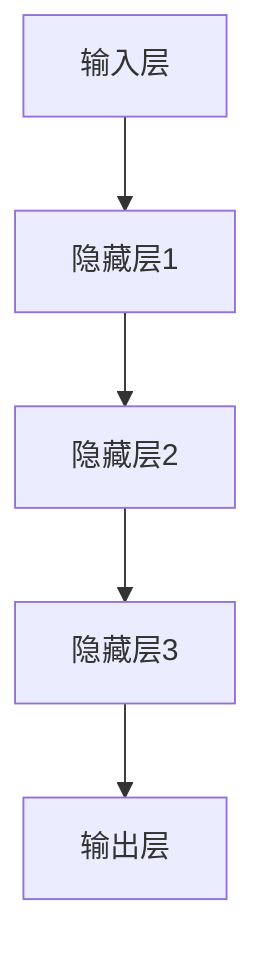

                 

# AI 深度神经网络计算艺术之道

> **关键词：** 深度学习、神经网络、计算艺术、算法原理、应用实践、未来趋势

> **摘要：** 本文将深入探讨深度神经网络在计算艺术领域的应用与原理，通过剖析核心概念、算法流程和实际案例，展示其独特的计算魅力，并对未来发展趋势和挑战进行展望。

## 1. 背景介绍

### 1.1 目的和范围

本文旨在探讨深度神经网络在计算艺术中的应用，解析其背后的算法原理，并通过实际案例展示其在图像处理、音乐生成和艺术创作等方面的潜力。本文将涵盖以下几个方面：

- **深度神经网络的基本概念和结构**：介绍深度神经网络的定义、核心组件及其工作原理。
- **核心算法原理与操作步骤**：详细解释深度神经网络的训练过程，包括前向传播、反向传播和优化算法。
- **数学模型和公式**：阐述深度学习中的关键数学模型，如激活函数、损失函数和优化器。
- **项目实战与代码实现**：通过具体案例展示深度神经网络在实际计算艺术中的应用。
- **未来发展趋势与挑战**：分析深度神经网络在计算艺术领域的未来发展方向和面临的挑战。

### 1.2 预期读者

本文适合对深度学习和计算艺术感兴趣的读者，包括：

- **计算机科学和人工智能领域的研究人员**：希望深入了解深度神经网络的理论和实践。
- **软件工程师和程序员**：希望将深度学习应用于实际项目中，提升计算艺术创作的技术水平。
- **艺术创作者**：希望借助深度学习技术探索新的艺术创作方式和风格。
- **对计算艺术感兴趣的一般读者**：希望了解深度神经网络在艺术领域的应用和潜力。

### 1.3 文档结构概述

本文将按照以下结构进行组织：

1. **背景介绍**：介绍文章的目的、范围、预期读者和文档结构。
2. **核心概念与联系**：通过Mermaid流程图展示深度神经网络的核心概念和架构。
3. **核心算法原理 & 具体操作步骤**：详细解释深度神经网络的算法原理和操作步骤，使用伪代码进行描述。
4. **数学模型和公式 & 详细讲解 & 举例说明**：阐述深度学习中的关键数学模型，并提供示例说明。
5. **项目实战：代码实际案例和详细解释说明**：通过具体案例展示深度神经网络在实际计算艺术中的应用。
6. **实际应用场景**：探讨深度神经网络在计算艺术中的实际应用。
7. **工具和资源推荐**：推荐学习资源、开发工具和框架。
8. **总结：未来发展趋势与挑战**：分析未来发展趋势和面临的挑战。
9. **附录：常见问题与解答**：回答读者可能遇到的常见问题。
10. **扩展阅读 & 参考资料**：提供进一步的阅读资源和参考。

### 1.4 术语表

#### 1.4.1 核心术语定义

- **深度神经网络（Deep Neural Network，DNN）**：由多个神经元层组成的神经网络，用于对数据进行高层次的抽象和表示。
- **前向传播（Forward Propagation）**：将输入数据通过神经网络逐层传递，最终得到输出结果的过程。
- **反向传播（Backpropagation）**：根据输出误差，逆向传播误差信号，用于更新网络参数的过程。
- **激活函数（Activation Function）**：对神经元输出进行非线性变换的函数，用于引入非线性和层次化表示。
- **损失函数（Loss Function）**：衡量模型预测结果与实际结果之间差异的函数，用于指导模型优化。
- **优化器（Optimizer）**：用于更新网络参数的算法，如随机梯度下降（SGD）、Adam等。

#### 1.4.2 相关概念解释

- **计算艺术**：利用计算机技术进行艺术创作和表达的艺术形式，包括图像处理、音乐生成、动画制作等。
- **神经网络**：一种由大量神经元组成的计算模型，通过学习数据之间的关联来提取特征和进行预测。
- **深度学习**：一种基于神经网络的学习方法，通过多层次的神经网络对数据进行表示和抽象。

#### 1.4.3 缩略词列表

- **DNN**：深度神经网络（Deep Neural Network）
- **CNN**：卷积神经网络（Convolutional Neural Network）
- **RNN**：循环神经网络（Recurrent Neural Network）
- **GAN**：生成对抗网络（Generative Adversarial Network）
- **CNN**：卷积神经网络（Convolutional Neural Network）

## 2. 核心概念与联系

在深入探讨深度神经网络在计算艺术中的应用之前，我们首先需要了解其核心概念和架构。以下是一个简化的Mermaid流程图，展示了深度神经网络的基本组件和连接方式。



### 2.1 输入层（Input Layer）

输入层是深度神经网络的起点，负责接收外部数据输入。这些数据可以来自图像、文本、音频等多种形式，为后续的神经网络处理提供初始信息。

### 2.2 隐藏层（Hidden Layers）

隐藏层位于输入层和输出层之间，负责对输入数据进行特征提取和表示。每个隐藏层都可以学习到更高层次的特征和抽象概念，从而实现从原始数据到最终输出的逐步转换。

### 2.3 输出层（Output Layer）

输出层是深度神经网络的终点，负责将隐藏层提取到的特征进行整合，生成最终的预测结果或输出。输出层的结构取决于具体的任务类型，如分类、回归等。

### 2.4 前向传播（Forward Propagation）

前向传播是指将输入数据从输入层逐层传递到输出层的过程。在这个过程中，每个神经元都会接收来自前一层的输入，通过权重和偏置进行加权求和，并应用激活函数进行非线性变换，最终得到当前层的输出。

### 2.5 反向传播（Backpropagation）

反向传播是指根据输出误差，逆向传播误差信号，用于更新网络参数的过程。通过反向传播，神经网络可以自动调整权重和偏置，以最小化输出误差，实现模型的优化。

### 2.6 激活函数（Activation Function）

激活函数是深度神经网络中的一个关键组件，用于引入非线性和层次化表示。常见的激活函数包括 sigmoid、ReLU、Tanh等，它们通过将线性组合后的输入映射到非线性空间，实现从原始数据到高级特征表示的转化。

### 2.7 损失函数（Loss Function）

损失函数用于衡量模型预测结果与实际结果之间的差异，通常是一个非负的标量值。常见的损失函数包括均方误差（MSE）、交叉熵损失等，它们通过优化损失函数，指导模型不断调整参数，以实现更准确的预测。

### 2.8 优化器（Optimizer）

优化器是一种用于更新网络参数的算法，用于最小化损失函数。常见的优化器包括随机梯度下降（SGD）、Adam等，它们通过调整学习率、动量等因素，优化模型参数，提高模型的训练效果。

## 3. 核心算法原理 & 具体操作步骤

在了解了深度神经网络的基本概念和架构后，我们将进一步探讨其核心算法原理和具体操作步骤。以下是深度神经网络的基本算法原理，通过伪代码进行详细阐述。

### 3.1 前向传播（Forward Propagation）

```python
# 输入数据
X = [输入数据]

# 初始化模型参数
W1 = [初始化第一层权重]
b1 = [初始化第一层偏置]
W2 = [初始化第二层权重]
b2 = [初始化第二层偏置]
...

# 前向传播过程
Z1 = X * W1 + b1
A1 = sigmoid(Z1)
Z2 = A1 * W2 + b2
A2 = sigmoid(Z2)
...
Zn = An * Wn + bn
An = sigmoid(Zn)

# 输出结果
output = An
```

### 3.2 反向传播（Backpropagation）

```python
# 计算输出误差
output_error = [实际输出 - 预测输出]

# 反向传播误差信号
dAn = output_error * sigmoid_derivative(An)
dZn = dAn * Wn
dWn = A(n-1) * dZn
dbn = dAn

# 更新网络参数
Wn = Wn - learning_rate * dWn
bn = bn - learning_rate * dbn
...
W2 = W2 - learning_rate * dW2
b2 = b2 - learning_rate * db2
...
W1 = W1 - learning_rate * dW1
b1 = b1 - learning_rate * db1
```

### 3.3 优化器（Optimizer）

```python
# 随机梯度下降（SGD）
W1 = W1 - learning_rate * dW1
b1 = b1 - learning_rate * db1
...
Wn = Wn - learning_rate * dWn
bn = bn - learning_rate * dbn

# Adam优化器
beta1 = 0.9
beta2 = 0.999
epsilon = 1e-8

mW1 = beta1 * mW1 + (1 - beta1) * dW1
mW2 = beta1 * mW2 + (1 - beta1) * dW2
...
mWn = beta1 * mWn + (1 - beta1) * dWn

vW1 = beta2 * vW1 + (1 - beta2) * (dW1**2)
vW2 = beta2 * vW2 + (1 - beta2) * (dW2**2)
...
vWn = beta2 * vWn + (1 - beta2) * (dWn**2)

mW1 = mW1 / (1 - beta1**t)
mW2 = mW2 / (1 - beta1**t)
...
mWn = mWn / (1 - beta1**t)

vW1 = vW1 / (1 - beta2**t)
vW2 = vW2 / (1 - beta2**t)
...
vWn = vWn / (1 - beta2**t)

W1 = W1 - learning_rate * mW1 / (np.sqrt(vW1) + epsilon)
W2 = W2 - learning_rate * mW2 / (np.sqrt(vW2) + epsilon)
...
Wn = Wn - learning_rate * mWn / (np.sqrt(vWn) + epsilon)
```

通过以上伪代码，我们可以清晰地看到深度神经网络的算法原理和操作步骤。在实际应用中，这些算法将被实现为高效的代码，用于处理大规模数据和复杂的计算任务。

## 4. 数学模型和公式 & 详细讲解 & 举例说明

在深度神经网络中，数学模型和公式是构建和优化网络的关键组成部分。以下我们将详细讲解深度学习中的几个关键数学模型，并提供具体的例子来说明。

### 4.1 激活函数（Activation Function）

激活函数用于引入非线性和层次化表示，使得神经网络能够学习到复杂的数据特征。常见的激活函数包括 sigmoid、ReLU、Tanh等。

#### 4.1.1 Sigmoid 函数

Sigmoid 函数的定义如下：

$$
f(x) = \frac{1}{1 + e^{-x}}
$$

Sigmoid 函数将输入 $x$ 映射到 $(0, 1)$ 区间内，具有平滑的曲线，常用于二分类任务。

**例子：**

假设输入 $x = -2$，则 sigmoid 函数的输出为：

$$
f(x) = \frac{1}{1 + e^{-(-2)}} = \frac{1}{1 + e^{2}} \approx 0.1192
$$

#### 4.1.2ReLU 函数

ReLU（Rectified Linear Unit）函数的定义如下：

$$
f(x) = \max(0, x)
$$

ReLU 函数在 $x \leq 0$ 时输出 0，在 $x > 0$ 时输出 $x$，具有简单的线性特性，常用于隐藏层神经元。

**例子：**

假设输入 $x = -2$，则 ReLU 函数的输出为：

$$
f(x) = \max(0, -2) = 0
$$

#### 4.1.3Tanh 函数

Tanh 函数的定义如下：

$$
f(x) = \frac{e^x - e^{-x}}{e^x + e^{-x}}
$$

Tanh 函数将输入 $x$ 映射到 $(-1, 1)$ 区间内，具有对称的曲线，常用于回归任务。

**例子：**

假设输入 $x = -2$，则 Tanh 函数的输出为：

$$
f(x) = \frac{e^{-2} - e^{2}}{e^{-2} + e^{2}} \approx -0.7616
$$

### 4.2 损失函数（Loss Function）

损失函数用于衡量模型预测结果与实际结果之间的差异，是优化过程中重要的评价指标。常见的损失函数包括均方误差（MSE）、交叉熵损失等。

#### 4.2.1 均方误差（MSE）

均方误差（MSE）的定义如下：

$$
MSE = \frac{1}{n}\sum_{i=1}^{n}(y_i - \hat{y}_i)^2
$$

其中，$y_i$ 表示实际输出，$\hat{y}_i$ 表示预测输出，$n$ 表示样本数量。

MSE 损失函数用于回归任务，当预测值与实际值之间的差异越大时，MSE 值也越大。

**例子：**

假设有 3 个样本，实际输出分别为 $y_1 = 2$、$y_2 = 3$、$y_3 = 4$，预测输出分别为 $\hat{y}_1 = 2.5$、$\hat{y}_2 = 3.2$、$\hat{y}_3 = 4.1$，则 MSE 损失值为：

$$
MSE = \frac{1}{3}\left[(2 - 2.5)^2 + (3 - 3.2)^2 + (4 - 4.1)^2\right] \approx 0.0556
$$

#### 4.2.2 交叉熵损失（Cross-Entropy Loss）

交叉熵损失（Cross-Entropy Loss）的定义如下：

$$
Cross-Entropy Loss = -\frac{1}{n}\sum_{i=1}^{n}y_i \log(\hat{y}_i)
$$

其中，$y_i$ 表示实际输出，$\hat{y}_i$ 表示预测输出，$n$ 表示样本数量。

交叉熵损失函数用于分类任务，当预测值与实际值之间的差异越大时，交叉熵损失值也越大。

**例子：**

假设有 3 个样本，实际输出分别为 $y_1 = 1$、$y_2 = 0$、$y_3 = 1$，预测输出分别为 $\hat{y}_1 = 0.8$、$\hat{y}_2 = 0.9$、$\hat{y}_3 = 0.6$，则交叉熵损失值为：

$$
Cross-Entropy Loss = -\frac{1}{3}\left[y_1 \log(\hat{y}_1) + y_2 \log(\hat{y}_2) + y_3 \log(\hat{y}_3)\right]
$$

$$
= -\frac{1}{3}\left[1 \log(0.8) + 0 \log(0.9) + 1 \log(0.6)\right] \approx 0.4154
$$

通过以上讲解和例子，我们可以看到激活函数和损失函数在深度神经网络中的重要作用，以及如何使用数学模型和公式进行具体的计算和优化。

## 5. 项目实战：代码实际案例和详细解释说明

在本节中，我们将通过一个实际案例来展示如何使用深度神经网络进行图像分类任务。这个案例将涵盖开发环境的搭建、源代码的详细实现和代码解读与分析。

### 5.1 开发环境搭建

在开始项目之前，我们需要搭建一个合适的开发环境。以下是所需的工具和软件：

- **操作系统**：Linux 或 macOS
- **编程语言**：Python
- **深度学习框架**：TensorFlow 或 PyTorch
- **依赖库**：NumPy、Matplotlib 等

在安装好所需的工具和软件后，我们可以在 Python 中导入必要的库，并设置好工作目录。

```python
import tensorflow as tf
import numpy as np
import matplotlib.pyplot as plt

# 设置工作目录
%cd /path/to/your/project/directory
```

### 5.2 源代码详细实现和代码解读

接下来，我们将逐步实现一个简单的卷积神经网络（Convolutional Neural Network，CNN），用于图像分类任务。

#### 5.2.1 数据预处理

在训练模型之前，我们需要对图像数据进行预处理，包括加载数据、归一化和划分训练集和测试集。

```python
# 加载数据
(train_images, train_labels), (test_images, test_labels) = tf.keras.datasets.mnist.load_data()

# 归一化
train_images = train_images / 255.0
test_images = test_images / 255.0

# 划分训练集和测试集
train_images = train_images.reshape(-1, 28, 28, 1)
test_images = test_images.reshape(-1, 28, 28, 1)

# 转换为张量
train_images = tf.convert_to_tensor(train_images)
test_images = tf.convert_to_tensor(test_images)

# 转换为浮点型
train_images = train_images.astype(np.float32)
test_images = test_images.astype(np.float32)

# 划分训练集和测试集
train_images, validation_images = train_images[:5000], train_images[5000:]
train_labels, validation_labels = train_labels[:5000], train_labels[5000:]

# 转换为 One-Hot 编码
train_labels = tf.keras.utils.to_categorical(train_labels)
validation_labels = tf.keras.utils.to_categorical(validation_labels)
```

以上代码首先加载了 MNIST 数据集，然后对图像进行归一化处理，并划分训练集和测试集。接着，我们将数据转换为浮点型，并进行 One-Hot 编码，以便用于后续的神经网络训练。

#### 5.2.2 构建模型

接下来，我们使用 TensorFlow 的 Keras API 构建一个简单的卷积神经网络。

```python
# 构建模型
model = tf.keras.Sequential([
    tf.keras.layers.Conv2D(32, (3, 3), activation='relu', input_shape=(28, 28, 1)),
    tf.keras.layers.MaxPooling2D((2, 2)),
    tf.keras.layers.Conv2D(64, (3, 3), activation='relu'),
    tf.keras.layers.MaxPooling2D((2, 2)),
    tf.keras.layers.Flatten(),
    tf.keras.layers.Dense(64, activation='relu'),
    tf.keras.layers.Dense(10, activation='softmax')
])

# 编译模型
model.compile(optimizer='adam',
              loss='categorical_crossentropy',
              metrics=['accuracy'])

# 打印模型结构
model.summary()
```

以上代码首先构建了一个简单的卷积神经网络，包括两个卷积层、两个池化层、一个平坦层和一个全连接层。接着，我们使用 Adam 优化器和交叉熵损失函数编译模型，并打印模型结构。

#### 5.2.3 训练模型

接下来，我们使用训练集训练模型，并在验证集上评估模型性能。

```python
# 训练模型
history = model.fit(train_images, train_labels, epochs=10, batch_size=64, validation_data=(validation_images, validation_labels))

# 评估模型
test_loss, test_acc = model.evaluate(test_images, test_labels)
print(f"Test accuracy: {test_acc:.4f}")
```

以上代码使用训练集训练模型，并在验证集上评估模型性能。最后，我们打印出模型的测试准确率。

### 5.3 代码解读与分析

通过以上代码实现，我们可以看到如何使用深度神经网络进行图像分类任务。以下是代码的关键部分解读：

- **数据预处理**：加载 MNIST 数据集，对图像进行归一化处理，并划分训练集和测试集。使用 One-Hot 编码将标签转换为张量。
- **模型构建**：使用 Keras API 构建卷积神经网络，包括两个卷积层、两个池化层、一个平坦层和一个全连接层。使用 Adam 优化器和交叉熵损失函数编译模型。
- **训练模型**：使用训练集训练模型，并在验证集上评估模型性能。打印出模型的测试准确率。

通过以上实战案例，我们可以看到如何将深度神经网络应用于图像分类任务，并了解其代码实现和操作步骤。

## 6. 实际应用场景

深度神经网络在计算艺术领域具有广泛的应用，涵盖了图像处理、音乐生成、视频分析等多个方面。以下是一些典型的实际应用场景：

### 6.1 图像处理

深度神经网络在图像处理领域表现出色，可以应用于图像分类、目标检测、图像生成等任务。例如，卷积神经网络（CNN）在图像分类任务中取得了显著的成果，广泛应用于人脸识别、物体识别等领域。生成对抗网络（GAN）则可以生成逼真的图像，应用于图像增强、风格迁移等任务。

### 6.2 音乐生成

深度神经网络在音乐生成领域具有巨大的潜力，可以用于生成旋律、和弦、声音等。循环神经网络（RNN）和长短期记忆网络（LSTM）是常用的音乐生成模型，可以学习音乐数据中的序列模式和节奏变化。近年来，基于 GAN 的音乐生成模型也得到了广泛关注，可以生成新颖的音乐风格和音乐片段。

### 6.3 视频分析

深度神经网络在视频分析领域也发挥着重要作用，可以用于视频分类、动作识别、目标跟踪等任务。卷积神经网络和残差网络（ResNet）是常用的视频分析模型，可以处理高维视频数据，提取关键特征并进行分类和识别。基于深度学习的目标跟踪算法可以实时跟踪视频中的目标，应用于视频监控、运动分析等领域。

### 6.4 艺术创作

深度神经网络在艺术创作领域有着独特的应用，可以辅助艺术家进行创作。例如，GAN 可以生成独特的艺术作品，如画作、雕塑等。深度神经网络还可以用于音乐创作，生成新颖的音乐旋律和和弦。这些应用为艺术家提供了新的创作工具和灵感，推动了艺术创作的发展。

总之，深度神经网络在计算艺术领域具有广泛的应用前景，可以应用于图像处理、音乐生成、视频分析和艺术创作等多个方面，为计算艺术的发展带来了新的机遇和挑战。

## 7. 工具和资源推荐

为了更好地学习和应用深度神经网络在计算艺术领域，以下是一些推荐的工具和资源：

### 7.1 学习资源推荐

#### 7.1.1 书籍推荐

1. **《深度学习》（Deep Learning）**：由 Ian Goodfellow、Yoshua Bengio 和 Aaron Courville 著，是深度学习领域的经典教材，详细介绍了深度学习的理论基础和实践应用。
2. **《Python 深度学习》（Python Deep Learning）**：由 Francesco Petracca 著，通过具体的案例和代码实现，全面介绍了深度学习在 Python 中的实践应用。

#### 7.1.2 在线课程

1. **Coursera 上的《深度学习》**：由 Andrew Ng 教授主讲，是深度学习领域的入门课程，涵盖了深度学习的基础理论和实践应用。
2. **Udacity 上的《深度学习工程师纳米学位》**：通过项目驱动的方式，学习深度学习的理论基础和实践应用，适合有一定编程基础的学习者。

#### 7.1.3 技术博客和网站

1. **ArXiv**：一个提供最新学术论文和技术进展的网站，涵盖深度学习和计算机视觉等多个领域。
2. **Medium**：一个技术博客平台，有很多优秀的深度学习和计算艺术相关的博客文章。

### 7.2 开发工具框架推荐

#### 7.2.1 IDE和编辑器

1. **Jupyter Notebook**：一款强大的交互式开发环境，可以方便地编写和运行代码，适合数据分析和深度学习项目。
2. **PyCharm**：一款功能强大的 Python IDE，支持代码补全、调试和版本控制，适合深度学习和数据分析项目。

#### 7.2.2 调试和性能分析工具

1. **TensorBoard**：TensorFlow 提供的一个可视化工具，可以用于调试和性能分析深度学习模型。
2. **NN-SIM**：一个用于深度学习模型仿真和性能分析的工具，可以模拟各种硬件环境和网络配置。

#### 7.2.3 相关框架和库

1. **TensorFlow**：一个开源的深度学习框架，支持多种深度学习模型的构建和训练。
2. **PyTorch**：一个开源的深度学习框架，具有灵活的动态图计算能力，适合快速原型设计和实验。
3. **Keras**：一个基于 TensorFlow 的深度学习库，提供了简洁的 API 和丰富的预训练模型。

### 7.3 相关论文著作推荐

#### 7.3.1 经典论文

1. **“A Learning Algorithm for Continually Running Fully Recurrent Neural Networks”**：由 Sepp Hochreiter 和 Jürgen Schmidhuber 在 1997 年提出，介绍了长短期记忆网络（LSTM）。
2. **“Generative Adversarial Networks”**：由 Ian Goodfellow 等人在 2014 年提出，介绍了生成对抗网络（GAN）。

#### 7.3.2 最新研究成果

1. **“Self-Attention Mechanism: A New Method for Modeling Text Data”**：由 Vaswani 等人在 2017 年提出，介绍了自注意力机制（Self-Attention），广泛应用于自然语言处理领域。
2. **“BERT: Pre-training of Deep Bidirectional Transformers for Language Understanding”**：由 Google 在 2018 年提出，介绍了 BERT 模型，推动了自然语言处理的发展。

#### 7.3.3 应用案例分析

1. **“AI for Social Good: Applications and Challenges”**：一篇关于人工智能在社会公益领域的应用案例，探讨了深度学习在医疗、环保等领域的实践。
2. **“Artificial Intelligence in Video Games”**：一篇关于人工智能在视频游戏领域的应用案例，介绍了深度学习在游戏AI中的具体应用。

通过以上工具和资源推荐，读者可以更好地了解深度神经网络在计算艺术领域的应用，为后续学习和项目开发提供有益的指导。

## 8. 总结：未来发展趋势与挑战

深度神经网络在计算艺术领域取得了显著的成果，但其发展仍然面临诸多挑战和机遇。以下是对未来发展趋势与挑战的总结：

### 8.1 发展趋势

1. **算法优化**：随着计算能力和数据量的不断提升，深度神经网络将更加高效地处理复杂任务，如实时图像处理、视频分析和音乐生成等。
2. **跨模态融合**：深度学习将在多个模态（如图像、文本、音频等）之间进行融合，实现更全面和精确的数据表示，推动计算艺术的发展。
3. **可解释性**：为了提高深度神经网络的透明度和可解释性，研究人员将致力于开发新的方法和工具，使得模型决策过程更加直观和可理解。
4. **自适应学习**：通过自适应学习技术，深度神经网络将能够根据用户需求和情境动态调整模型参数，实现更加个性化的计算艺术创作。

### 8.2 挑战

1. **计算资源**：深度神经网络对计算资源的需求巨大，如何高效地利用硬件加速技术（如 GPU、TPU）和优化算法性能，是当前面临的一大挑战。
2. **数据隐私**：随着深度学习在计算艺术领域的应用，数据隐私保护问题日益突出。如何确保数据的安全和隐私，是一个亟待解决的问题。
3. **伦理和法规**：深度神经网络在艺术创作中的应用引发了一系列伦理和法规问题，如知识产权保护、艺术作品评价标准等，需要制定相应的规范和标准。
4. **多样化需求**：随着用户需求的多样化，深度神经网络需要具备更强的泛化能力和适应性，以满足不同场景和任务的需求。

总之，深度神经网络在计算艺术领域具有广阔的发展前景，但也面临诸多挑战。通过不断优化算法、提高计算效率和保障数据安全，将推动深度神经网络在计算艺术领域的进一步应用和发展。

## 9. 附录：常见问题与解答

### 9.1 深度神经网络的基本概念

**Q1：什么是深度神经网络？**

深度神经网络（Deep Neural Network，DNN）是一种由多个神经元层组成的神经网络，通过多层次的神经网络对数据进行表示和抽象，以实现高层次的认知任务。相比于传统的单层神经网络，深度神经网络具有更强的表达能力和泛化能力。

**Q2：深度神经网络由哪些基本组件组成？**

深度神经网络由输入层、隐藏层和输出层组成。输入层接收外部数据输入，隐藏层负责对输入数据进行特征提取和表示，输出层生成最终的预测结果或输出。此外，深度神经网络还包括权重、偏置、激活函数和优化器等关键组件。

### 9.2 深度神经网络的算法原理

**Q3：什么是前向传播和反向传播？**

前向传播（Forward Propagation）是指将输入数据从输入层逐层传递到输出层的过程，通过加权求和和激活函数的变换，生成输出结果。反向传播（Backpropagation）是指根据输出误差，逆向传播误差信号，用于更新网络参数的过程。反向传播是深度学习训练过程中的核心步骤，通过不断调整权重和偏置，优化模型参数，提高预测准确性。

**Q4：什么是激活函数？激活函数有哪些类型？**

激活函数是深度神经网络中的一个关键组件，用于引入非线性和层次化表示。常见的激活函数包括 sigmoid、ReLU、Tanh 等。sigmoid 函数将输入映射到 $(0, 1)$ 区间内，ReLU 函数在 $x \leq 0$ 时输出 0，在 $x > 0$ 时输出 $x$，Tanh 函数将输入映射到 $(-1, 1)$ 区间内。

### 9.3 深度神经网络的应用实践

**Q5：深度神经网络可以应用于哪些计算艺术领域？**

深度神经网络可以应用于图像处理、音乐生成、视频分析、艺术创作等多个计算艺术领域。例如，在图像处理方面，可以用于图像分类、目标检测、图像生成等任务；在音乐生成方面，可以用于生成旋律、和弦、声音等；在视频分析方面，可以用于视频分类、动作识别、目标跟踪等任务。

**Q6：如何使用深度神经网络进行图像分类？**

使用深度神经网络进行图像分类通常需要以下步骤：

1. 数据预处理：加载图像数据，进行归一化和预处理。
2. 模型构建：使用卷积神经网络（CNN）等深度学习模型进行图像特征提取。
3. 训练模型：使用训练集训练模型，优化模型参数。
4. 评估模型：使用测试集评估模型性能，调整模型参数。
5. 应用模型：使用训练好的模型进行图像分类任务。

通过以上步骤，可以使用深度神经网络实现高效的图像分类任务。

### 9.4 深度神经网络的发展趋势与挑战

**Q7：深度神经网络在计算艺术领域的未来发展趋势是什么？**

深度神经网络在计算艺术领域的未来发展趋势包括：

1. 算法优化：提高算法的效率和性能，以适应更复杂的计算任务。
2. 跨模态融合：将深度学习应用于不同模态的数据处理，实现更全面的数据表示。
3. 可解释性：提高深度神经网络的透明度和可解释性，使其决策过程更加直观和可理解。
4. 自适应学习：实现动态调整模型参数，满足个性化计算艺术创作需求。

**Q8：深度神经网络在计算艺术领域面临哪些挑战？**

深度神经网络在计算艺术领域面临的主要挑战包括：

1. 计算资源：如何高效利用计算资源，提高算法性能。
2. 数据隐私：保护数据安全和隐私，防止数据泄露。
3. 伦理和法规：制定相应的规范和标准，解决伦理和法规问题。
4. 泛化能力：提高模型的泛化能力，适应不同场景和任务的需求。

通过不断优化算法、提高计算效率和保障数据安全，可以推动深度神经网络在计算艺术领域的进一步应用和发展。

## 10. 扩展阅读 & 参考资料

为了更好地了解深度神经网络在计算艺术领域的应用和发展，以下是几篇推荐的扩展阅读和参考资料：

1. **《深度学习》（Deep Learning）**：由 Ian Goodfellow、Yoshua Bengio 和 Aaron Courville 著，是深度学习领域的经典教材，详细介绍了深度学习的理论基础和实践应用。
2. **《Python 深度学习》（Python Deep Learning）**：由 Francesco Petracca 著，通过具体的案例和代码实现，全面介绍了深度学习在 Python 中的实践应用。
3. **《生成对抗网络》（Generative Adversarial Networks）**：由 Ian Goodfellow 等人著，介绍了生成对抗网络（GAN）的基本原理和应用场景。
4. **《计算机视觉：算法与应用》**：由 Richard S. Kincaid 著，详细介绍了计算机视觉领域的相关算法和应用。
5. **《自然语言处理与深度学习》**：由 Daniel Jurafsky 和 James H. Martin 著，介绍了自然语言处理领域的基本概念和深度学习应用。
6. **《深度学习与计算机视觉：理论与实践》**：由张祥雨、王勇著，系统地介绍了深度学习在计算机视觉领域的应用。

此外，还可以参考以下技术博客和网站：

1. **ArXiv**：一个提供最新学术论文和技术进展的网站，涵盖深度学习和计算机视觉等多个领域。
2. **Medium**：一个技术博客平台，有很多优秀的深度学习和计算艺术相关的博客文章。
3. **Google Research Blog**：Google 研究团队的博客，分享了深度学习在各个领域的应用和研究进展。
4. **Deep Learning Specialization**：Coursera 上的深度学习专项课程，包括 Andrew Ng 教授主讲的课程，适合深度学习入门者。

通过阅读以上书籍和资料，读者可以更深入地了解深度神经网络在计算艺术领域的应用和发展。

