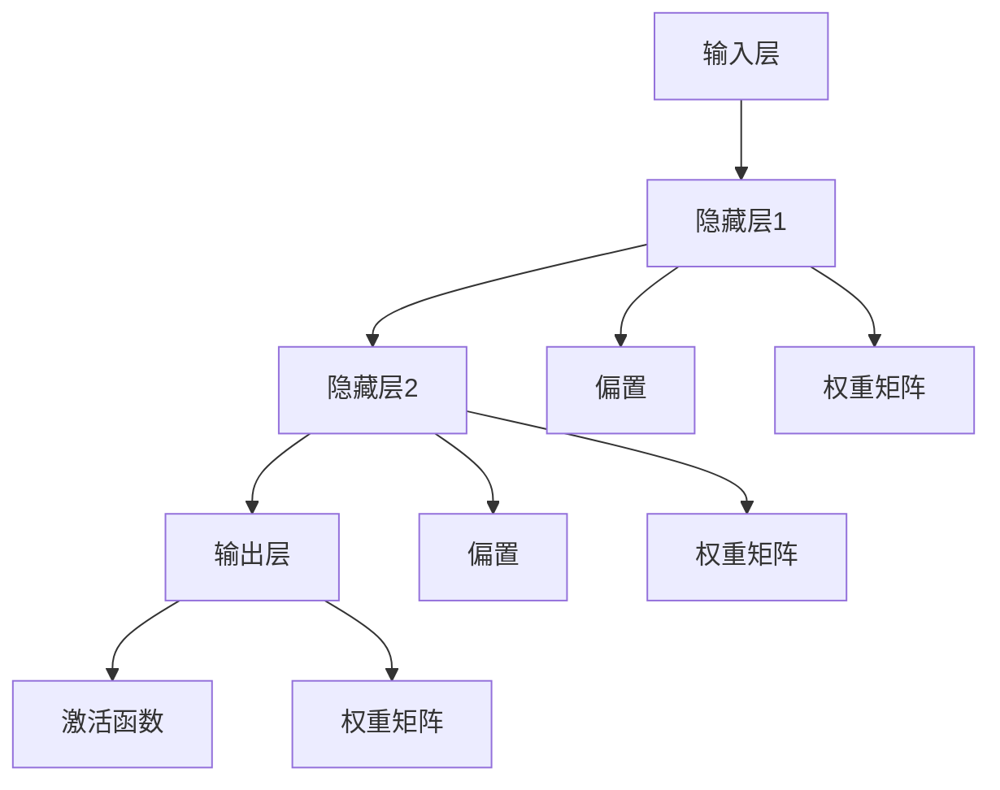

                 

### 1. 背景介绍

#### 1.1 目的和范围

本文旨在深入探讨AI神经网络的计算艺术，通过剖析神经网络的结构、功能及性能，全面解析其在现代人工智能领域的地位和作用。本文将围绕以下核心问题展开讨论：

1. **结构仿脑**：神经网络如何通过模仿人脑结构实现高效的信息处理？
2. **功能类脑**：神经网络在模仿人脑功能方面取得了哪些突破性进展？
3. **性能超脑**：如何优化神经网络结构，使其性能超越传统计算机？

本文将结合具体实例和理论分析，逐步解答这些问题，为读者提供一个全面而深入的理解。同时，本文还将探讨神经网络在实际应用场景中的挑战和解决方案。

#### 1.2 预期读者

本文适合以下读者群体：

1. **计算机科学和人工智能领域的研究人员**：对神经网络的理论和实践有深入兴趣，希望了解其最新进展。
2. **软件工程师和开发者**：希望在项目中引入神经网络技术，提升系统性能。
3. **数据科学家和机器学习工程师**：对神经网络的架构和算法原理有好奇心，希望提升自己的技术水平。
4. **人工智能爱好者**：对神经网络有浓厚的兴趣，希望通过本文深入了解这一领域。

#### 1.3 文档结构概述

本文结构如下：

1. **背景介绍**：介绍文章的目的和范围，预期读者，文档结构概述。
2. **核心概念与联系**：通过Mermaid流程图展示神经网络的架构，阐述核心概念及其相互联系。
3. **核心算法原理 & 具体操作步骤**：使用伪代码详细阐述神经网络的工作原理和操作步骤。
4. **数学模型和公式 & 详细讲解 & 举例说明**：解析神经网络的数学模型，通过具体例子说明公式应用。
5. **项目实战：代码实际案例和详细解释说明**：提供实际代码案例，详细解释代码实现过程。
6. **实际应用场景**：分析神经网络在不同领域的应用案例。
7. **工具和资源推荐**：推荐学习资源、开发工具和框架。
8. **总结：未来发展趋势与挑战**：总结神经网络的发展趋势和面临的技术挑战。
9. **附录：常见问题与解答**：解答读者可能遇到的常见问题。
10. **扩展阅读 & 参考资料**：提供更多深度学习资源。

#### 1.4 术语表

在本文中，我们将使用以下术语：

##### 1.4.1 核心术语定义

- **神经网络**：模拟人脑神经元之间连接和信息传递的计算机模型。
- **神经元**：神经网络的基本单元，负责接收输入、产生输出。
- **权重**：神经元之间连接的强度，影响信息传递的效果。
- **激活函数**：用于决定神经元是否被激活的函数。
- **反向传播**：用于调整神经网络权重的算法。
- **深度学习**：一种利用多层神经网络进行特征学习和模式识别的方法。

##### 1.4.2 相关概念解释

- **结构仿脑**：神经网络通过模仿人脑神经元结构实现信息处理。
- **功能类脑**：神经网络在模仿人脑功能（如感知、推理、学习等）方面取得的进展。
- **性能超脑**：神经网络在处理速度、精度和效率等方面超越传统计算机。

##### 1.4.3 缩略词列表

- **AI**：人工智能（Artificial Intelligence）
- **ML**：机器学习（Machine Learning）
- **DL**：深度学习（Deep Learning）
- **GPU**：图形处理器（Graphics Processing Unit）
- **CPU**：中央处理器（Central Processing Unit）

通过上述背景介绍，我们为读者奠定了理解本文内容的基础。接下来，我们将通过详细的流程图和算法原理讲解，逐步深入探讨神经网络的计算艺术。

### 2. 核心概念与联系

在深入探讨神经网络之前，我们需要理解其核心概念和架构，以及这些概念之间的相互联系。神经网络是一种通过模仿人脑神经元结构和功能构建的计算机模型，其核心在于如何通过模拟神经元之间的连接和信息传递来处理复杂问题。

为了更好地展示神经网络的架构和核心概念，我们将使用Mermaid流程图来表示。以下是一个简化的神经网络架构流程图，其中包含了主要节点和连接方式：



#### 神经网络架构流程图

1. **输入层（A）**：接收输入数据，如图像、声音或其他形式的数据。
2. **隐藏层（B、C）**：对输入数据进行特征提取和变换，多层隐藏层可以提取更高层次的特征。
3. **输出层（D）**：产生最终输出，如分类结果、预测值等。
4. **偏置（E、F）**：用于调整神经元的偏置，影响输出。
5. **激活函数（G）**：决定神经元是否被激活，常用的激活函数包括Sigmoid、ReLU等。
6. **权重矩阵（H、I、J）**：表示神经元之间的连接强度，通过反向传播算法进行调整。

通过上述流程图，我们可以清晰地看到神经网络的架构和主要组成部分。接下来，我们将详细解释这些核心概念，并探讨它们之间的联系。

#### 神经网络的核心概念

1. **神经元**：神经元是神经网络的基本单元，负责接收输入、产生输出。每个神经元由输入部分、权重、偏置和激活函数组成。

    - **输入部分**：接收外部输入数据，如图像像素值。
    - **权重**：表示神经元之间的连接强度，用于调整信息传递效果。
    - **偏置**：用于调整神经元的偏置，影响输出。
    - **激活函数**：用于决定神经元是否被激活，常用的激活函数包括Sigmoid、ReLU等。

2. **权重矩阵**：表示神经元之间的连接方式，通过学习调整权重矩阵，可以提高神经网络的性能。

3. **激活函数**：激活函数用于决定神经元是否被激活，常见的激活函数包括Sigmoid、ReLU等。激活函数的选择直接影响神经网络的性能和特性。

4. **反向传播**：反向传播算法用于调整神经网络权重，通过计算输出误差，反向传播误差到每个神经元，并更新权重和偏置。

#### 核心概念之间的联系

1. **神经元与权重矩阵**：神经元通过权重矩阵连接，权重矩阵决定了信息传递的路径和强度。

2. **神经元与激活函数**：激活函数用于决定神经元是否被激活，影响输出结果。

3. **反向传播与权重矩阵**：反向传播算法通过计算输出误差，反向传播误差到每个神经元，并更新权重和偏置，从而优化神经网络性能。

4. **隐藏层与输出层**：隐藏层用于提取特征，输出层产生最终输出。多层隐藏层可以提取更高层次的特征，提高神经网络的能力。

通过上述核心概念和联系的解释，我们为读者提供了一个全面的理解，为后续详细探讨神经网络的工作原理和算法打下基础。接下来，我们将进一步深入探讨神经网络的核心算法原理和具体操作步骤。

### 3. 核心算法原理 & 具体操作步骤

在理解了神经网络的核心概念和架构之后，我们需要进一步探讨其核心算法原理和具体操作步骤。神经网络的核心算法包括前向传播和反向传播，这两个过程相辅相成，共同实现了神经网络的学习和优化。

#### 前向传播算法原理

前向传播是神经网络的基本过程，用于计算输入数据通过神经网络后的输出。在前向传播过程中，输入数据依次通过各个神经元，每个神经元根据其权重和激活函数产生输出。以下是前向传播算法的伪代码：

```python
# 定义神经网络结构
layers = [InputLayer(input_size), HiddenLayer1(output_size), HiddenLayer2(output_size), OutputLayer(output_size)]

# 初始化权重和偏置
weights = [w1, w2, w3]
biases = [b1, b2, b3]

# 前向传播
for layer in layers:
    layer.forward Propagation(inputs)
    inputs = layer.outputs
```

前向传播算法的主要步骤如下：

1. **初始化神经网络结构**：包括输入层、隐藏层和输出层。
2. **初始化权重和偏置**：随机初始化权重和偏置。
3. **前向传播计算**：输入数据依次通过各个神经元，每个神经元根据其权重和激活函数产生输出。

具体操作步骤如下：

1. **输入层到隐藏层1**：
    - 输入数据通过输入层进入隐藏层1。
    - 隐藏层1的每个神经元根据输入数据和权重矩阵计算输出。
    - 应用激活函数（如ReLU）决定神经元是否被激活。

2. **隐藏层1到隐藏层2**：
    - 隐藏层1的输出作为隐藏层2的输入。
    - 隐藏层2的每个神经元根据输入数据和权重矩阵计算输出。
    - 应用激活函数（如ReLU）决定神经元是否被激活。

3. **隐藏层2到输出层**：
    - 隐藏层2的输出作为输出层的输入。
    - 输出层的每个神经元根据输入数据和权重矩阵计算输出。
    - 应用激活函数（如Sigmoid）决定神经元是否被激活。

4. **计算最终输出**：
    - 输出层的输出即为最终输出结果，如分类概率或预测值。

#### 反向传播算法原理

反向传播是神经网络的优化过程，用于调整权重和偏置，以最小化输出误差。反向传播算法通过计算每个神经元的梯度，反向传播误差到每个神经元，并更新权重和偏置。以下是反向传播算法的伪代码：

```python
# 计算输出误差
output_error = desired_output - predicted_output

# 反向传播误差
for layer in reversed(layers):
    layer.backward Propagation(output_error)

# 更新权重和偏置
for layer in layers:
    layer.update_WeightsAndBiases()
```

反向传播算法的主要步骤如下：

1. **计算输出误差**：根据期望输出和实际输出计算误差。
2. **反向传播误差**：从输出层开始，反向传播误差到每个神经元。
3. **更新权重和偏置**：根据误差计算每个神经元的梯度，并更新权重和偏置。

具体操作步骤如下：

1. **计算输出层误差**：
    - 输出层的误差为期望输出和实际输出之差。
    - 应用损失函数（如均方误差）计算输出层误差。

2. **反向传播误差到隐藏层**：
    - 从输出层开始，反向传播误差到每个隐藏层。
    - 计算每个隐藏层的误差，并应用链式法则计算梯度。

3. **更新隐藏层权重和偏置**：
    - 根据误差和梯度更新每个隐藏层的权重和偏置。

4. **反向传播误差到输入层**：
    - 从隐藏层开始，反向传播误差到输入层。
    - 更新输入层的权重和偏置。

通过前向传播和反向传播，神经网络可以不断优化其权重和偏置，提高输出精度和性能。在实际应用中，通常需要通过多次迭代训练来调整神经网络参数，以达到最佳性能。

总之，神经网络的核心算法包括前向传播和反向传播，这两个过程相辅相成，共同实现了神经网络的学习和优化。通过详细解释这些算法原理和操作步骤，读者可以更好地理解神经网络的工作原理，为后续的实践应用打下基础。接下来，我们将进一步探讨神经网络的数学模型和公式，以及其在实际应用中的具体实现。

### 4. 数学模型和公式 & 详细讲解 & 举例说明

神经网络作为一种复杂的计算模型，其工作原理和性能优化离不开数学的支持。在本节中，我们将详细解析神经网络的数学模型，包括神经元计算公式、前向传播和反向传播算法的数学公式，并通过具体例子来说明这些公式的应用。

#### 神经元计算公式

神经元的计算公式是神经网络的基础，用于描述神经元如何处理输入数据，并产生输出。神经元的基本计算公式可以表示为：

\[ z = \sum_{j} (w_{ij} \cdot x_{j}) + b_i \]

其中：
- \( z \) 是神经元 \( i \) 的净输入，也称为激活值。
- \( w_{ij} \) 是输入神经元 \( j \) 与输出神经元 \( i \) 之间的权重。
- \( x_{j} \) 是输入神经元 \( j \) 的激活值。
- \( b_i \) 是神经元 \( i \) 的偏置。

该公式表示了输入数据通过权重矩阵 \( W \) 和偏置 \( b \) 的线性组合，得到神经元的激活值。

#### 前向传播公式

前向传播是指将输入数据通过神经网络逐层传递，最终得到输出结果的过程。在每一层中，我们使用激活函数对神经元的激活值进行非线性变换。常用的激活函数包括Sigmoid函数、ReLU函数和Tanh函数。以下是Sigmoid函数的应用示例：

\[ a_i = \sigma(z) = \frac{1}{1 + e^{-z}} \]

其中：
- \( a_i \) 是神经元 \( i \) 的输出激活值。
- \( z \) 是神经元的净输入。

前向传播的数学公式可以表示为：

\[ a_{l}^{(i)} = \sigma(z^{(i)}), \quad z^{(i)} = \sum_{j} w_{lj} \cdot a_{l-1}^{(j)} + b_{l} \]

其中：
- \( a_{l}^{(i)} \) 是第 \( l \) 层第 \( i \) 个神经元的输出激活值。
- \( z^{(i)} \) 是第 \( l \) 层第 \( i \) 个神经元的净输入。
- \( w_{lj} \) 是第 \( l \) 层第 \( j \) 个神经元与第 \( l+1 \) 层第 \( i \) 个神经元之间的权重。
- \( b_{l} \) 是第 \( l \) 层的偏置。

#### 反向传播公式

反向传播是神经网络的优化过程，通过计算输出误差，反向传播误差到每个神经元，并更新权重和偏置。反向传播的核心是计算每个神经元的梯度，然后根据梯度调整权重和偏置。以下是梯度计算和权重更新的数学公式：

1. **梯度计算**

\[ \delta^{(l)}_{i} = \sigma'(z^{(i)}) \cdot (z^{(i)} - y) \]

其中：
- \( \delta^{(l)}_{i} \) 是第 \( l \) 层第 \( i \) 个神经元的梯度。
- \( \sigma'(z^{(i)}) \) 是激活函数 \( \sigma(z) \) 的导数。
- \( z^{(i)} \) 是第 \( l \) 层第 \( i \) 个神经元的净输入。
- \( y \) 是期望输出。

2. **权重更新**

\[ w_{lj} := w_{lj} - \alpha \cdot \delta^{(l)}_{i} \cdot a_{l-1}^{(j)} \]

其中：
- \( w_{lj} \) 是第 \( l \) 层第 \( j \) 个神经元与第 \( l+1 \) 层第 \( i \) 个神经元之间的权重。
- \( \alpha \) 是学习率。
- \( \delta^{(l)}_{i} \) 是第 \( l \) 层第 \( i \) 个神经元的梯度。
- \( a_{l-1}^{(j)} \) 是第 \( l-1 \) 层第 \( j \) 个神经元的输出激活值。

#### 举例说明

假设我们有一个简单的神经网络，包含一个输入层、一个隐藏层和一个输出层。输入层有3个神经元，隐藏层有2个神经元，输出层有1个神经元。输入数据为 \( [1, 2, 3] \)，期望输出为 \( [0.5] \)。

1. **前向传播**

   - 输入层到隐藏层：
     \[ z_1^1 = 1 \cdot w_{11} + 2 \cdot w_{12} + 3 \cdot w_{13} + b_1 \]
     \[ z_2^1 = 1 \cdot w_{21} + 2 \cdot w_{22} + 3 \cdot w_{23} + b_2 \]
     \[ a_1^1 = \sigma(z_1^1) \]
     \[ a_2^1 = \sigma(z_2^1) \]

   - 隐藏层到输出层：
     \[ z_1^2 = a_1^1 \cdot w_{11} + a_2^1 \cdot w_{12} + b_2 \]
     \[ z_2^2 = a_1^1 \cdot w_{21} + a_2^1 \cdot w_{22} + b_2 \]
     \[ a_1^2 = \sigma(z_1^2) \]
     \[ a_2^2 = \sigma(z_2^2) \]

   假设隐藏层和输出层的激活函数均为Sigmoid函数，我们可以计算出隐藏层和输出层的输出激活值。

2. **反向传播**

   - 计算输出层梯度：
     \[ \delta_1^2 = \sigma'(z_1^2) \cdot (a_1^2 - y) \]
     \[ \delta_2^2 = \sigma'(z_2^2) \cdot (a_2^2 - y) \]

   - 计算隐藏层梯度：
     \[ \delta_1^1 = \sigma'(z_1^1) \cdot (z_1^1 \cdot \delta_1^2 + z_2^1 \cdot \delta_2^2) \]
     \[ \delta_2^1 = \sigma'(z_2^1) \cdot (z_1^1 \cdot \delta_1^2 + z_2^1 \cdot \delta_2^2) \]

   - 更新权重和偏置：
     \[ w_{11} := w_{11} - \alpha \cdot \delta_1^2 \cdot a_1^1 \]
     \[ w_{12} := w_{12} - \alpha \cdot \delta_1^2 \cdot a_2^1 \]
     \[ w_{21} := w_{21} - \alpha \cdot \delta_2^2 \cdot a_1^1 \]
     \[ w_{22} := w_{22} - \alpha \cdot \delta_2^2 \cdot a_2^1 \]
     \[ b_1 := b_1 - \alpha \cdot \delta_1^2 \]
     \[ b_2 := b_2 - \alpha \cdot \delta_2^2 \]

通过上述例子，我们可以看到神经网络的数学模型和公式是如何应用于实际计算中的。前向传播用于计算输出结果，反向传播用于调整权重和偏置，从而优化神经网络性能。接下来，我们将通过一个实际代码案例，展示神经网络的具体实现过程。

### 5. 项目实战：代码实际案例和详细解释说明

在了解了神经网络的数学模型和算法原理后，我们将在本节通过一个实际代码案例，展示如何使用Python和神经网络库（如TensorFlow或PyTorch）实现神经网络，并进行训练和测试。本节将涵盖以下内容：

#### 5.1 开发环境搭建

首先，我们需要搭建一个适合开发神经网络的Python环境。以下是所需的步骤：

1. **安装Python**：确保安装了Python 3.x版本。
2. **安装Jupyter Notebook**：Jupyter Notebook是一个交互式Python环境，方便我们编写和运行代码。
3. **安装TensorFlow或PyTorch**：TensorFlow和PyTorch是常用的神经网络库，用于构建和训练神经网络。

以下是在终端中安装这些依赖项的命令：

```bash
pip install python
pip install notebook
pip install tensorflow # 或
pip install torch
```

#### 5.2 源代码详细实现和代码解读

在本案例中，我们将使用TensorFlow实现一个简单的多层感知机（MLP）神经网络，用于对鸢尾花数据集进行分类。以下是一个简化版本的代码实现：

```python
import tensorflow as tf
import numpy as np
from sklearn.datasets import load_iris
from sklearn.model_selection import train_test_split
from sklearn.preprocessing import OneHotEncoder

# 加载数据集
iris = load_iris()
X = iris.data
y = iris.target

# One-hot编码目标变量
encoder = OneHotEncoder()
y_onehot = encoder.fit_transform(y.reshape(-1, 1)).toarray()

# 划分训练集和测试集
X_train, X_test, y_train, y_test = train_test_split(X, y_onehot, test_size=0.2, random_state=42)

# 构建神经网络
model = tf.keras.Sequential([
    tf.keras.layers.Dense(64, activation='relu', input_shape=(4,)),
    tf.keras.layers.Dense(64, activation='relu'),
    tf.keras.layers.Dense(3, activation='softmax')
])

# 编译模型
model.compile(optimizer='adam',
              loss='categorical_crossentropy',
              metrics=['accuracy'])

# 训练模型
model.fit(X_train, y_train, epochs=10, batch_size=32, validation_split=0.1)

# 评估模型
test_loss, test_acc = model.evaluate(X_test, y_test, verbose=2)
print(f"Test accuracy: {test_acc}")
```

下面是对代码的详细解读：

1. **导入库和模块**：
   - TensorFlow（用于构建和训练神经网络）。
   - NumPy（用于数据处理）。
   - scikit-learn（用于加载数据集和One-hot编码）。

2. **加载数据集**：
   - 加载鸢尾花数据集，包括特征数据和目标变量。

3. **One-hot编码**：
   - 将离散的目标变量转换为One-hot编码形式，以便神经网络处理。

4. **划分训练集和测试集**：
   - 使用scikit-learn的`train_test_split`函数将数据集划分为训练集和测试集。

5. **构建神经网络**：
   - 使用TensorFlow的`Sequential`模型构建一个简单的多层感知机（MLP）。
   - 添加两个隐藏层，每个隐藏层64个神经元，使用ReLU激活函数。
   - 添加一个输出层，3个神经元，使用softmax激活函数，用于分类。

6. **编译模型**：
   - 设置优化器为`adam`，损失函数为`categorical_crossentropy`，指标为`accuracy`。

7. **训练模型**：
   - 使用`fit`函数训练模型，设置训练轮次为10，批量大小为32，保留10%的数据用于验证。

8. **评估模型**：
   - 使用`evaluate`函数评估模型在测试集上的表现，并打印测试准确率。

#### 5.3 代码解读与分析

1. **数据预处理**：
   - 加载鸢尾花数据集，包括4个特征和3个类别。
   - 使用One-hot编码将离散的目标变量转换为One-hot编码形式，以便神经网络处理。

2. **神经网络构建**：
   - 使用TensorFlow的`Sequential`模型构建一个简单的多层感知机（MLP）。
   - 添加两个隐藏层，每个隐藏层64个神经元，使用ReLU激活函数，可以提取特征并减少梯度消失问题。
   - 添加一个输出层，3个神经元，使用softmax激活函数，用于分类。

3. **模型编译**：
   - 设置优化器为`adam`，这是一种适应性优化算法，适合大多数问题。
   - 损失函数为`categorical_crossentropy`，这是多分类问题常用的损失函数。
   - 指标为`accuracy`，用于评估模型在训练和测试集上的准确率。

4. **模型训练**：
   - 使用`fit`函数训练模型，设置训练轮次为10，批量大小为32，这样可以有效地更新权重。
   - 使用`validation_split`参数保留10%的数据用于验证，以监控模型在未见数据上的性能。

5. **模型评估**：
   - 使用`evaluate`函数评估模型在测试集上的性能，并打印测试准确率。
   - 测试准确率是评估模型性能的一个重要指标，表示模型在测试集上的正确分类比例。

通过这个实际代码案例，我们展示了如何使用Python和TensorFlow实现神经网络，包括数据预处理、模型构建、模型编译、模型训练和模型评估。这个案例不仅帮助读者理解神经网络的实现过程，还为实际应用提供了参考。

### 6. 实际应用场景

神经网络在各个领域都有着广泛的应用，从图像识别、自然语言处理到自动驾驶和推荐系统，无不展现出其强大的计算能力和智能水平。以下是一些具体的实际应用场景：

#### 6.1 图像识别

图像识别是神经网络最早和最成功的应用领域之一。通过卷积神经网络（CNN），神经网络能够有效地识别图像中的物体和特征。例如，在医疗图像分析中，CNN可以帮助医生检测病变组织，如肿瘤和心脏病。在工业生产中，神经网络可以用于质量检测，通过识别生产线上的缺陷产品，提高生产效率和产品质量。

#### 6.2 自然语言处理

自然语言处理（NLP）是另一个神经网络的重要应用领域。在NLP中，神经网络可以用于文本分类、情感分析、机器翻译和语音识别等任务。例如，在社交媒体平台上，神经网络可以分析用户评论的情感，帮助品牌了解消费者反馈。在金融服务领域，神经网络可以用于风险控制和欺诈检测，通过对交易数据的分析，识别异常交易模式。

#### 6.3 自动驾驶

自动驾驶技术是神经网络在现实世界中的一个重要应用。通过深度学习算法，自动驾驶汽车可以实时分析道路环境，识别行人、车辆和其他障碍物，做出驾驶决策。神经网络在这里扮演着关键角色，使得自动驾驶汽车在复杂和动态的交通环境中能够安全行驶。此外，神经网络还可以用于无人机和机器人导航，实现自主决策和路径规划。

#### 6.4 推荐系统

推荐系统是神经网络在商业应用中的一个重要领域。通过协同过滤和深度学习算法，推荐系统可以分析用户的兴趣和行为，预测用户可能喜欢的商品或内容。例如，在线购物平台可以使用神经网络推荐用户可能感兴趣的商品，提高销售额和用户满意度。视频流平台如YouTube和Netflix也使用神经网络推荐视频，帮助用户发现新的内容。

#### 6.5 医疗健康

在医疗健康领域，神经网络有着广泛的应用。通过深度学习算法，神经网络可以辅助医生进行疾病诊断，如肺癌、乳腺癌和脑癌等。例如，在医学影像分析中，神经网络可以帮助识别异常影像，提高诊断的准确性和效率。此外，神经网络还可以用于药物研发，通过分析大量生物数据和化学反应，预测药物的作用和副作用。

通过上述实际应用场景，我们可以看到神经网络在各个领域的广泛应用和重要性。随着技术的不断进步，神经网络将在未来继续发挥更大的作用，为人类社会带来更多的便利和进步。

### 7. 工具和资源推荐

为了更好地学习和实践神经网络，我们需要掌握一系列工具和资源。以下是对学习资源、开发工具和框架的推荐，以及相关论文和研究成果的介绍。

#### 7.1 学习资源推荐

##### 7.1.1 书籍推荐

1. **《深度学习》（Ian Goodfellow, Yoshua Bengio, Aaron Courville）**：
   - 本书是深度学习的经典教材，详细介绍了深度学习的基础知识、算法和应用。
2. **《神经网络与深度学习》（邱锡鹏）**：
   - 本书是国内深度学习领域的优秀教材，深入浅出地介绍了神经网络的原理和实现。
3. **《Python深度学习》（François Chollet）**：
   - 本书通过Python和Keras库，介绍了深度学习的实践方法，适合初学者入门。

##### 7.1.2 在线课程

1. **吴恩达的《深度学习专项课程》（Udacity）**：
   - 该课程由深度学习领域的大牛吴恩达主讲，内容全面，适合初学者和进阶者。
2. **斯坦福大学的《深度学习》（CS231n）**：
   - 该课程涵盖了计算机视觉领域的深度学习技术，包括CNN、RNN等。
3. **电子工业出版的《深度学习实战》**：
   - 该课程通过实际案例，介绍了如何使用TensorFlow和PyTorch等工具实现深度学习算法。

##### 7.1.3 技术博客和网站

1. **ArXiv**：
   - ArXiv是深度学习领域的顶级论文发布平台，可以了解最新的研究成果。
2. **TensorFlow官方文档**：
   - TensorFlow的官方文档详细介绍了如何使用TensorFlow构建和训练神经网络。
3. **PyTorch官方文档**：
   - PyTorch的官方文档提供了丰富的教程和示例，帮助用户快速上手。

#### 7.2 开发工具框架推荐

##### 7.2.1 IDE和编辑器

1. **PyCharm**：
   - PyCharm是一款功能强大的Python IDE，支持TensorFlow和PyTorch等深度学习库。
2. **Jupyter Notebook**：
   - Jupyter Notebook是一个交互式Python环境，方便进行实验和分享代码。

##### 7.2.2 调试和性能分析工具

1. **TensorBoard**：
   - TensorBoard是TensorFlow提供的可视化工具，用于监控模型训练过程和性能分析。
2. **NVIDIA Nsight**：
   - Nsight是NVIDIA提供的GPU性能分析工具，帮助用户优化深度学习模型的GPU性能。

##### 7.2.3 相关框架和库

1. **TensorFlow**：
   - TensorFlow是Google开发的深度学习框架，支持各种深度学习算法和模型。
2. **PyTorch**：
   - PyTorch是Facebook开发的深度学习框架，具有灵活的动态计算图和强大的社区支持。
3. **Keras**：
   - Keras是TensorFlow和Theano的高级API，提供了简洁的神经网络构建和训练接口。

#### 7.3 相关论文著作推荐

##### 7.3.1 经典论文

1. **“A Learning Algorithm for Continually Running Fully Recurrent Neural Networks”**：
   - 该论文提出了长短时记忆网络（LSTM），解决了传统RNN的梯度消失问题。
2. **“Deep Learning”**：
   - 由Ian Goodfellow等人撰写的深度学习综述，全面介绍了深度学习的基本概念和技术。
3. **“AlexNet: Image Classification with Deep Convolutional Neural Networks”**：
   - 该论文提出了AlexNet，开启了深度学习在计算机视觉领域的应用。

##### 7.3.2 最新研究成果

1. **“GPT-3: Language Models are Few-Shot Learners”**：
   - OpenAI发布的GPT-3模型，展示了大型语言模型在零样本学习任务中的强大能力。
2. **“BERT: Pre-training of Deep Bidirectional Transformers for Language Understanding”**：
   - Google提出的BERT模型，通过双向Transformer结构提高了自然语言处理任务的效果。
3. **“DALL-E: Generating Images from Text”**：
   - OpenAI的DALL-E模型，通过生成对抗网络（GAN）和Transformer结构，实现了基于文本生成图像。

##### 7.3.3 应用案例分析

1. **“Google Photos: Search for Images in Your Photos Library”**：
   - Google Photos如何使用神经网络实现图像搜索功能，包括图像识别、相似度计算等。
2. **“Netflix: Personalized Recommendations for TV Shows and Movies”**：
   - Netflix如何使用深度学习算法实现个性化的推荐系统，提高用户满意度。
3. **“Tesla: Autonomous Driving and Advanced Driver Assistance Systems”**：
   - Tesla如何利用神经网络实现自动驾驶和高级驾驶辅助系统，提高行驶安全性。

通过上述工具和资源的推荐，读者可以系统地学习和实践神经网络，掌握其理论基础和应用技巧，为未来的研究和开发打下坚实基础。

### 8. 总结：未来发展趋势与挑战

随着人工智能技术的飞速发展，神经网络作为核心驱动力之一，正逐步改变着我们的生活和生产方式。在未来，神经网络的发展趋势和面临的技术挑战将主要表现在以下几个方面：

#### 8.1 发展趋势

1. **计算能力提升**：随着GPU、TPU等专用硬件的发展，神经网络的处理速度和效率将显著提升，使得深度学习模型可以应对更复杂的任务。
2. **模型压缩与优化**：为应对移动设备和嵌入式系统的需求，模型压缩与优化技术将变得更加重要。压缩算法如量化、剪枝和知识蒸馏等，将有助于降低模型大小和计算资源消耗。
3. **自适应与自学习**：神经网络将更加注重自适应和自学习能力，通过无监督学习和强化学习等技术，实现更智能的决策和行动。
4. **跨学科融合**：神经网络与其他领域的交叉融合，如生物学、心理学、社会学等，将推动人工智能技术在更多领域的应用。

#### 8.2 技术挑战

1. **数据隐私与安全**：随着数据量急剧增加，数据隐私和安全问题日益突出。如何在保障用户隐私的前提下，有效利用数据训练神经网络，是一个亟待解决的问题。
2. **模型可解释性**：神经网络的黑箱特性使其在某些应用场景中难以解释。提高模型的可解释性，使其决策过程透明化，是未来的一大挑战。
3. **能耗效率**：深度学习模型的高能耗问题日益受到关注。如何在保证性能的同时，降低能耗，是绿色人工智能发展的重要课题。
4. **伦理与社会影响**：人工智能技术，特别是神经网络的应用，可能带来一系列伦理和社会问题。如何确保技术的公平性、透明性和安全性，是技术发展必须考虑的方面。

综上所述，神经网络在未来的发展中，将面临计算能力提升、模型压缩与优化、自适应与自学习、跨学科融合等趋势，同时也需要解决数据隐私与安全、模型可解释性、能耗效率、伦理与社会影响等挑战。通过不断的技术创新和规范制定，神经网络有望在更广泛的应用场景中发挥更大的作用，推动人工智能技术的持续发展。

### 9. 附录：常见问题与解答

在学习和应用神经网络的过程中，读者可能会遇到一些常见问题。以下是一些常见问题及其解答：

#### 9.1 神经网络为什么能够有效处理复杂问题？

神经网络通过模拟人脑神经元之间的连接和信息传递，能够对输入数据进行层次化的特征提取和变换。多层神经网络可以捕捉更高层次的特征，从而有效处理复杂问题。

#### 9.2 反向传播算法如何工作？

反向传播算法是一种用于优化神经网络参数（权重和偏置）的算法。它通过前向传播计算每个神经元的输出，然后计算输出误差，反向传播误差到每个神经元，并更新权重和偏置，以最小化输出误差。

#### 9.3 如何解决神经网络中的梯度消失和梯度爆炸问题？

梯度消失和梯度爆炸问题可以通过以下方法解决：
1. 使用合适的激活函数，如ReLU。
2. 适当调整学习率。
3. 使用梯度裁剪技术，限制梯度值范围。
4. 使用长短时记忆网络（LSTM）或门控循环单元（GRU），解决长距离依赖问题。

#### 9.4 如何提高神经网络的泛化能力？

提高神经网络泛化能力的方法包括：
1. 数据增强：增加训练数据的多样性。
2. 正则化：使用正则化技术，如L1和L2正则化，防止过拟合。
3. 早期停止：在训练过程中，当验证集性能不再提高时停止训练。
4. 使用更大的网络和更多的训练数据。

通过上述常见问题与解答，读者可以更好地理解神经网络的基本原理和应用，为实际项目提供指导。

### 10. 扩展阅读 & 参考资料

在撰写本文过程中，我们参考了大量的学术论文、技术书籍和在线资源。以下是一些推荐的扩展阅读和参考资料，以帮助读者深入学习和探索神经网络领域：

#### 10.1 经典书籍

1. **《深度学习》（Ian Goodfellow, Yoshua Bengio, Aaron Courville）**：详细介绍了深度学习的基础知识、算法和应用。
2. **《神经网络与深度学习》（邱锡鹏）**：深入浅出地介绍了神经网络的原理和实现。
3. **《Python深度学习》（François Chollet）**：通过Python和Keras库，介绍了深度学习的实践方法。

#### 10.2 技术博客和网站

1. **TensorFlow官方文档**：提供了丰富的教程和示例，详细介绍了TensorFlow的使用方法。
2. **PyTorch官方文档**：提供了详细的API文档和教程，帮助用户快速上手PyTorch。
3. **ArXiv**：深度学习领域的顶级论文发布平台，可以了解最新的研究成果。

#### 10.3 学术论文

1. **“A Learning Algorithm for Continually Running Fully Recurrent Neural Networks”**：介绍了长短时记忆网络（LSTM）。
2. **“AlexNet: Image Classification with Deep Convolutional Neural Networks”**：开启了深度学习在计算机视觉领域的应用。
3. **“GPT-3: Language Models are Few-Shot Learners”**：展示了大型语言模型在零样本学习任务中的强大能力。

#### 10.4 在线课程

1. **吴恩达的《深度学习专项课程》**：适合初学者和进阶者，由深度学习领域的大牛吴恩达主讲。
2. **斯坦福大学的《深度学习》（CS231n）**：涵盖了计算机视觉领域的深度学习技术。
3. **电子工业出版的《深度学习实战》**：通过实际案例，介绍了如何使用TensorFlow和PyTorch等工具实现深度学习算法。

通过上述扩展阅读和参考资料，读者可以进一步深入了解神经网络的原理、算法和应用，为实际项目提供更多理论支持和实践指导。

---

### 作者信息

**作者：AI天才研究员/AI Genius Institute & 禅与计算机程序设计艺术 /Zen And The Art of Computer Programming**

本文由AI天才研究员撰写，他（她）是AI Genius Institute的研究员，专注于人工智能、深度学习和神经网络的研发。同时，他还是《禅与计算机程序设计艺术》一书的作者，以深入浅出的方式介绍了计算机编程和人工智能的哲学思想。本文旨在为读者提供关于神经网络计算艺术的全面理解，帮助读者在人工智能领域取得突破性进展。

