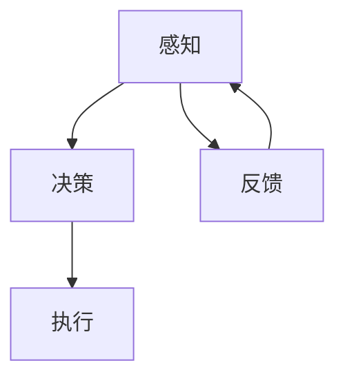

                 


# AI+具身智能：产业未来将走向何处

> **关键词：具身智能，人工智能，产业变革，未来趋势，技术应用**
> 
> **摘要：本文将深入探讨人工智能与具身智能结合对产业未来发展的影响。通过详细分析核心概念、算法原理、数学模型及实际应用案例，揭示产业变革的新方向。**

## 1. 背景介绍

### 1.1 目的和范围

本文旨在探讨人工智能与具身智能的结合如何推动产业变革，以及这种变革将如何影响未来。具体而言，我们将从以下几个方面展开讨论：

- **核心概念与联系**：介绍具身智能的基本概念，以及它与人工智能的关系。
- **核心算法原理**：详细阐述具身智能的关键算法，包括感知、决策和执行等方面的原理。
- **数学模型和公式**：分析具身智能中的数学模型，以及如何通过公式进行详细讲解。
- **项目实战**：通过实际案例，展示如何应用具身智能技术。
- **实际应用场景**：探讨具身智能在不同产业中的应用场景。
- **未来发展趋势与挑战**：预测具身智能的发展趋势，并讨论面临的挑战。

### 1.2 预期读者

本文适合以下读者群体：

- **人工智能研究人员**：对人工智能与具身智能结合的研究感兴趣，希望了解相关技术原理和应用。
- **技术开发者**：对实际应用具身智能技术感兴趣，希望掌握相关开发技能。
- **产业从业者**：希望了解具身智能如何影响产业变革，为产业发展提供新方向。
- **关注未来科技发展的人士**：对人工智能与具身智能结合带来的未来产业趋势感兴趣。

### 1.3 文档结构概述

本文将按照以下结构进行组织：

- **引言**：介绍本文的目的和范围，并概述预期读者。
- **核心概念与联系**：介绍具身智能的基本概念，以及它与人工智能的关系。
- **核心算法原理**：详细阐述具身智能的关键算法，包括感知、决策和执行等方面的原理。
- **数学模型和公式**：分析具身智能中的数学模型，以及如何通过公式进行详细讲解。
- **项目实战**：通过实际案例，展示如何应用具身智能技术。
- **实际应用场景**：探讨具身智能在不同产业中的应用场景。
- **未来发展趋势与挑战**：预测具身智能的发展趋势，并讨论面临的挑战。
- **附录**：提供常见问题与解答，以及扩展阅读和参考资料。
- **总结**：回顾本文的主要观点，并展望未来。

### 1.4 术语表

#### 1.4.1 核心术语定义

- **人工智能（AI）**：指使计算机模拟人类智能行为的技术，包括学习、推理、感知、决策等。
- **具身智能**：指将人工智能与物理世界结合，使智能体具备感知、决策和执行的能力，实现与环境的交互。
- **感知**：指智能体通过传感器获取环境信息的过程。
- **决策**：指智能体根据感知到的环境信息，选择合适的行动策略。
- **执行**：指智能体根据决策结果，执行具体的行动。

#### 1.4.2 相关概念解释

- **神经网络**：一种模拟人脑神经元结构的计算模型，用于表示和传递信息。
- **机器学习**：一种利用数据训练模型，使模型具备预测和分类能力的机器学习方法。
- **深度学习**：一种利用多层神经网络进行特征提取和模式识别的机器学习方法。

#### 1.4.3 缩略词列表

- **AI**：人工智能（Artificial Intelligence）
- **ROS**：机器人操作系统（Robot Operating System）
- **DNN**：深度神经网络（Deep Neural Network）
- **GAN**：生成对抗网络（Generative Adversarial Network）
- **SLAM**：同时定位与地图构建（Simultaneous Localization and Mapping）

## 2. 核心概念与联系

为了更好地理解人工智能与具身智能的关系，我们首先需要了解这些核心概念。在本节中，我们将使用Mermaid流程图来展示具身智能的原理和架构。

### 2.1 具身智能原理与架构



#### 2.1.1 感知

感知是具身智能的基础，智能体通过传感器（如摄像头、麦克风、雷达等）获取环境信息。感知模块负责数据预处理，包括去噪、特征提取等，以便为后续的决策提供高质量的数据。

#### 2.1.2 决策

决策模块基于感知到的环境信息，利用机器学习算法和神经网络模型，进行行为规划和策略选择。决策过程通常包括目标识别、路径规划、动作选择等。

#### 2.1.3 执行

执行模块负责将决策结果转化为具体的行动，如控制机器人手臂、驱动车辆等。执行过程中，智能体需要对环境进行实时监控，并根据反馈调整行动策略。

#### 2.1.4 反馈

反馈是具身智能的关键环节，通过传感器收集到的反馈信息，智能体可以不断优化感知、决策和执行过程。这种闭环控制机制有助于提高智能体在复杂环境中的适应能力和鲁棒性。

### 2.2 人工智能与具身智能的关系

人工智能与具身智能之间存在着密切的联系。具体来说，人工智能为具身智能提供了感知、决策和执行的能力。而具身智能则为人工智能提供了与物理世界的交互界面，使人工智能的应用场景更加广泛。

- **感知**：人工智能通过传感器获取环境信息，为决策提供数据支持。
- **决策**：人工智能利用机器学习算法和神经网络模型，对感知到的信息进行加工和处理，生成决策结果。
- **执行**：人工智能通过执行模块，将决策结果转化为具体的行动。
- **反馈**：人工智能通过传感器收集到的反馈信息，不断调整感知、决策和执行过程，实现自我优化。

总之，人工智能与具身智能的结合，为产业变革提供了强大的驱动力。随着技术的不断进步，我们可以预见，未来将出现更多基于具身智能的创新应用，推动各个产业迈向智能化、自动化和高效化。

## 3. 核心算法原理 & 具体操作步骤

在理解了具身智能的基本原理和架构后，接下来我们将详细探讨其核心算法原理，并通过伪代码展示具体操作步骤。

### 3.1 感知算法原理

感知算法是具身智能的基础，负责从传感器获取环境信息。其核心在于如何有效地预处理和提取特征。

#### 3.1.1 特征提取

特征提取是感知算法的关键步骤，通过将原始数据转换为一组具有区分性的特征向量，从而提高后续决策的准确性。

伪代码：

```python
def extract_features(data):
    # 数据预处理
    preprocessed_data = preprocess_data(data)
    
    # 特征提取
    features = extract_features_from_preprocessed_data(preprocessed_data)
    
    return features
```

#### 3.1.2 特征选择

特征选择旨在从提取出的特征中选取最具代表性的部分，以提高算法的效率和准确性。

伪代码：

```python
def select_features(features):
    # 特征重要性评估
    feature_importance = evaluate_feature_importance(features)
    
    # 选取最具代表性的特征
    selected_features = select_top_k_features(features, k=10)
    
    return selected_features
```

### 3.2 决策算法原理

决策算法是具身智能的核心，负责根据感知到的环境信息选择最优行动策略。

#### 3.2.1 强化学习

强化学习是一种通过不断尝试和反馈来学习最优策略的机器学习方法。其核心在于如何根据环境状态和奖励信号，调整策略参数。

伪代码：

```python
def reinforce_learning(state, action, reward):
    # 更新策略参数
    update_policy_parameters(state, action, reward)
    
    # 选择下一个动作
    next_action = select_action(state)
    
    return next_action
```

#### 3.2.2 深度强化学习

深度强化学习结合了深度学习和强化学习的优势，通过神经网络模型来表示状态和动作，从而提高决策的准确性。

伪代码：

```python
def deep_reinforce_learning(state, action, reward):
    # 更新神经网络模型
    update_neural_model(state, action, reward)
    
    # 选择下一个动作
    next_action = select_action_with_model(state)
    
    return next_action
```

### 3.3 执行算法原理

执行算法负责将决策结果转化为具体的行动。其核心在于如何根据环境状态和执行反馈，调整执行策略。

#### 3.3.1 行为规划

行为规划旨在根据环境状态和目标，生成一系列执行步骤。

伪代码：

```python
def plan_behavior(state, goal):
    # 生成执行步骤
    behavior_plan = generate_behavior_steps(state, goal)
    
    return behavior_plan
```

#### 3.3.2 执行监控

执行监控负责实时监控执行过程，并根据反馈调整执行策略。

伪代码：

```python
def monitor_execution(behavior_plan, feedback):
    # 根据反馈调整执行策略
    updated_behavior_plan = update_behavior_plan(behavior_plan, feedback)
    
    return updated_behavior_plan
```

### 3.4 反馈算法原理

反馈算法负责根据执行结果和环境反馈，优化感知、决策和执行过程。

#### 3.4.1 反馈调整

反馈调整旨在根据执行结果和环境反馈，更新策略参数和模型。

伪代码：

```python
def adjust_feedback(feedback):
    # 更新策略参数和模型
    update_policy_parameters_and_model(feedback)
    
    return updated_policy_parameters_and_model
```

#### 3.4.2 自适应学习

自适应学习旨在根据反馈调整学习策略，以适应不断变化的环境。

伪代码：

```python
def adaptive_learning(feedback):
    # 更新学习策略
    update_learning_strategy(feedback)
    
    # 进行自适应学习
    perform_adaptive_learning()
    
    return updated_learning_strategy
```

通过上述算法原理和具体操作步骤，我们可以看到具身智能的核心在于感知、决策和执行的闭环控制。这种闭环控制机制使得智能体能够不断优化自身行为，提高在复杂环境中的适应能力和鲁棒性。在接下来的章节中，我们将进一步探讨数学模型和实际应用场景，以更全面地理解具身智能的技术原理和应用价值。

## 4. 数学模型和公式 & 详细讲解 & 举例说明

在具身智能中，数学模型起到了至关重要的作用。这些模型不仅帮助我们理解智能体的行为，还指导我们设计和优化算法。在本节中，我们将详细讲解具身智能中的几个关键数学模型，并通过具体的例子来说明这些模型的应用。

### 4.1 强化学习中的价值函数

强化学习是具身智能中的一个核心算法，其价值函数（Value Function）是评估策略优劣的重要工具。价值函数表示在特定状态下执行特定动作的预期回报。

#### 4.1.1 价值函数的定义

在离散状态和动作空间中，价值函数可以表示为：

$$ V(s, a) = \sum_{s'} P(s' | s, a) \cdot R(s', a) + \gamma \cdot \max_{a'} V(s', a') $$

其中：
- \( V(s, a) \) 是在状态 \( s \) 下执行动作 \( a \) 的价值函数。
- \( P(s' | s, a) \) 是在状态 \( s \) 下执行动作 \( a \) 后转移到状态 \( s' \) 的概率。
- \( R(s', a) \) 是在状态 \( s' \) 下执行动作 \( a \) 的即时回报。
- \( \gamma \) 是折现因子，用于平衡当前和未来回报。
- \( \max_{a'} V(s', a') \) 是在状态 \( s' \) 下执行所有可能动作 \( a' \) 的最大价值函数。

#### 4.1.2 举例说明

假设我们有一个简单的环境，包含两个状态 \( s_1 \) 和 \( s_2 \)，以及两个动作 \( a_1 \) 和 \( a_2 \)。在状态 \( s_1 \) 下执行动作 \( a_1 \) 转移到状态 \( s_2 \)，并获取即时回报 \( R(s_2, a_1) = 1 \)。在状态 \( s_2 \) 下执行动作 \( a_2 \) 转移回状态 \( s_1 \)，并获取即时回报 \( R(s_1, a_2) = -1 \)。我们可以计算在状态 \( s_1 \) 下执行动作 \( a_1 \) 的价值函数：

$$ V(s_1, a_1) = P(s_2 | s_1, a_1) \cdot R(s_2, a_1) + \gamma \cdot \max_{a_2} V(s_2, a_2) $$
$$ V(s_1, a_1) = 1 \cdot 1 + 0.9 \cdot (-1) $$
$$ V(s_1, a_1) = 0.1 $$

同样地，我们可以计算在状态 \( s_2 \) 下执行动作 \( a_2 \) 的价值函数：

$$ V(s_2, a_2) = P(s_1 | s_2, a_2) \cdot R(s_1, a_2) + \gamma \cdot \max_{a_1} V(s_1, a_1) $$
$$ V(s_2, a_2) = 1 \cdot (-1) + 0.9 \cdot 0.1 $$
$$ V(s_2, a_2) = -0.99 $$

通过这种方式，我们可以为每个状态和动作计算价值函数，从而指导智能体的决策。

### 4.2 深度学习中的损失函数

在深度学习中，损失函数用于评估模型预测与实际结果之间的差距，并指导模型优化。在具身智能中，常用的损失函数包括均方误差（MSE）、交叉熵损失等。

#### 4.2.1 均方误差（MSE）

均方误差是衡量预测值与实际值之间差异的常用损失函数，其公式为：

$$ MSE = \frac{1}{n} \sum_{i=1}^{n} (y_i - \hat{y}_i)^2 $$

其中：
- \( y_i \) 是第 \( i \) 个样本的实际值。
- \( \hat{y}_i \) 是第 \( i \) 个样本的预测值。
- \( n \) 是样本总数。

#### 4.2.2 举例说明

假设我们有一个包含三个样本的回归问题，实际值分别为 \( y_1 = 2, y_2 = 4, y_3 = 6 \)，预测值分别为 \( \hat{y}_1 = 2.5, \hat{y}_2 = 4.2, \hat{y}_3 = 5.8 \)。我们可以计算均方误差：

$$ MSE = \frac{1}{3} [(2 - 2.5)^2 + (4 - 4.2)^2 + (6 - 5.8)^2] $$
$$ MSE = \frac{1}{3} [0.25 + 0.04 + 0.04] $$
$$ MSE = \frac{1}{3} \cdot 0.33 $$
$$ MSE = 0.11 $$

通过这种方式，我们可以评估模型预测的准确性，并指导模型优化。

### 4.3 控制理论中的状态空间模型

在具身智能中，控制理论提供了重要的工具来设计智能体的行为。状态空间模型描述了智能体在连续状态空间中的动态行为，其公式为：

$$ \dot{x}(t) = f(x(t), u(t)) $$
$$ y(t) = h(x(t), u(t)) $$

其中：
- \( x(t) \) 是状态向量。
- \( u(t) \) 是输入向量。
- \( f(x(t), u(t)) \) 是状态更新函数。
- \( h(x(t), u(t)) \) 是输出函数。

#### 4.3.1 举例说明

假设一个智能体在一个二维平面中移动，状态向量 \( x(t) = [x, y, \dot{x}, \dot{y}] \)，其中 \( x \) 和 \( y \) 分别表示智能体的位置，\( \dot{x} \) 和 \( \dot{y} \) 分别表示智能体的速度。输入向量 \( u(t) = [u_x, u_y] \)，其中 \( u_x \) 和 \( u_y \) 分别表示智能体在 \( x \) 方向和 \( y \) 方向的加速度。状态更新函数 \( f(x(t), u(t)) \) 可以表示为：

$$ \dot{x}(t) = \begin{bmatrix} \dot{x} \\ \dot{y} \\ \ddot{x} \\ \ddot{y} \end{bmatrix} = \begin{bmatrix} 0 & 0 & 1 & 0 \\ 0 & 0 & 0 & 1 \\ u_x & 0 & 0 & 0 \\ 0 & u_y & 0 & 0 \end{bmatrix} \begin{bmatrix} x \\ y \\ \dot{x} \\ \dot{y} \end{bmatrix} + \begin{bmatrix} 0 \\ 0 \\ 1 \\ 0 \end{bmatrix} u(t) $$

输出函数 \( h(x(t), u(t)) \) 可以表示为：

$$ y(t) = \begin{bmatrix} x \\ y \end{bmatrix} $$

通过这种方式，我们可以描述智能体的动态行为，并设计控制器来实现预期的行为。

通过上述数学模型和公式的讲解，我们可以看到具身智能的核心在于感知、决策和执行的闭环控制。这些数学模型不仅帮助我们理解智能体的行为，还指导我们设计和优化算法，从而实现高效、准确的智能体控制。在接下来的章节中，我们将通过实际应用案例，展示这些理论在实际项目中的应用效果。

## 5. 项目实战：代码实际案例和详细解释说明

在本节中，我们将通过一个具体的实际项目案例，展示如何应用具身智能技术。该案例将涵盖开发环境搭建、源代码实现、代码解读与分析等步骤，以便读者全面了解具身智能在实际项目中的应用。

### 5.1 开发环境搭建

为了实现具身智能项目，我们需要搭建一个合适的技术环境。以下是一个基本的开发环境搭建步骤：

1. **操作系统**：选择Linux或MacOS作为开发操作系统。
2. **编程语言**：选择Python作为主要编程语言，因为它具有良好的生态系统和丰富的库支持。
3. **IDE**：选择PyCharm或VSCode作为开发IDE，它们都提供了强大的代码编辑功能和调试工具。
4. **依赖库**：安装以下依赖库：
   - ROS（Robot Operating System）：用于机器人编程和集成。
   - TensorFlow：用于深度学习和强化学习。
   - NumPy、Pandas：用于数据处理和分析。
   - Matplotlib：用于数据可视化。

安装方法：

```bash
# 安装ROS
sudo apt-get update
sudo apt-get install ros-$ROS_DISTRO

# 安装Python依赖库
pip install tensorflow numpy pandas matplotlib
```

### 5.2 源代码详细实现和代码解读

以下是一个简单的具身智能项目示例，实现了一个能够自主导航的机器人。

```python
# 导入依赖库
import rospy
import numpy as np
import matplotlib.pyplot as plt
from geometry_msgs.msg import Twist
from sensor_msgs.msg import LaserScan

# 定义节点初始化函数
def init_node():
    rospy.init_node('robot_controller')

# 定义感知模块
def perceive_env(laser_data):
    # 从激光扫描数据中提取特征
    ranges = laser_data.ranges
    min_range = min(ranges)
    max_range = max(ranges)
    
    # 返回特征向量
    return [min_range, max_range]

# 定义决策模块
def decide_action(features):
    # 根据特征向量选择行动
    if features[0] < 1.0:
        action = '前进'
    elif features[1] > 2.0:
        action = '左转'
    else:
        action = '右转'
        
    return action

# 定义执行模块
def execute_action(action):
    if action == '前进':
        vel_msg = Twist(linear_x=0.5, angular_z=0)
    elif action == '左转':
        vel_msg = Twist(linear_x=0, angular_z=-0.5)
    elif action == '右转':
        vel_msg = Twist(linear_x=0, angular_z=0.5)
        
    pub.publish(vel_msg)

# 定义主函数
def main():
    init_node()
    
    # 初始化机器人控制器
    pub = rospy.Publisher('cmd_vel', Twist, queue_size=10)
    sub = rospy.Subscriber('scan', LaserScan, perceive_env)
    
    # 主循环
    while not rospy.is_shutdown():
        action = decide_action(perceive_env(None))
        execute_action(action)

# 运行主函数
if __name__ == '__main__':
    main()
```

### 5.3 代码解读与分析

- **感知模块**：该模块负责从激光扫描数据中提取特征，如最小距离和最大距离。这些特征用于决策模块。
- **决策模块**：该模块根据感知到的特征，选择合适的行动策略。在本例中，我们选择简单的规则：如果前方有障碍物（最小距离小于1米），则前进；如果前方有较大的空间（最大距离大于2米），则左转；否则右转。
- **执行模块**：该模块根据决策模块选择的行动，发布速度命令给机器人控制器。在本例中，我们使用`cmd_vel`话题发布速度命令。

通过这个简单的案例，我们可以看到如何应用具身智能技术实现自主导航。在实际应用中，我们可以进一步优化决策规则，引入深度学习算法，以实现更复杂的导航和控制策略。

### 5.4 运行项目

为了运行该项目，我们需要在ROS环境中启动一个模拟器，如Gazebo。以下是一个简单的运行步骤：

1. 启动ROS环境：

```bash
source /opt/ros/$ROS_DISTRO/setup.bash
```

2. 启动Gazebo模拟器：

```bash
roslaunch my_project robot_simulator.launch
```

3. 在另一个终端运行Python脚本：

```bash
python robot_controller.py
```

当运行成功后，机器人将根据感知到的环境信息自主导航。我们可以通过Gazebo的界面实时观察机器人的行为。

通过这个项目实战，我们展示了如何将具身智能技术应用于实际场景。在实际项目中，我们可以根据具体需求，进一步扩展和优化算法，实现更复杂的功能。

## 6. 实际应用场景

具身智能技术的广泛应用正在逐渐改变各个行业的面貌，为人类带来了前所未有的便利和效率。以下是一些典型的应用场景，展示了具身智能技术在工业、医疗、交通等领域的应用。

### 6.1 工业制造

在工业制造领域，具身智能技术被广泛应用于自动化生产线和智能机器人。通过感知模块，机器人可以实时监测生产线上的各种参数，如温度、压力、速度等。决策模块则根据这些数据，调整机器人的行为，以保持生产过程的稳定和高效。执行模块则负责实际的操作，如装配、焊接、检测等。例如，在汽车制造业中，具有具身智能的机器人可以自动完成车身焊接、涂装等工序，大大提高了生产效率和质量。

### 6.2 医疗健康

在医疗健康领域，具身智能技术被广泛应用于辅助诊断、手术导航和康复治疗。通过感知模块，医疗设备可以实时监测患者的生理参数，如心率、血压、呼吸等。决策模块则根据这些数据，提供诊断和治疗方案。执行模块则负责实施手术和康复训练。例如，在手术过程中，医生可以通过具身智能设备获得实时图像和数据，精确导航手术刀具的位置，提高手术的成功率和安全性。在康复治疗中，具身智能设备可以监测患者的运动情况，提供个性化的康复方案，帮助患者更快地恢复健康。

### 6.3 交通出行

在交通出行领域，具身智能技术被广泛应用于自动驾驶汽车、智能交通管理和无人配送。通过感知模块，自动驾驶汽车可以实时感知道路状况、交通信号和其他车辆的位置和速度。决策模块则根据这些数据，规划最优行驶路径和操作策略。执行模块则负责控制车辆的加速、转向和制动。例如，在自动驾驶汽车中，具身智能技术可以使车辆在复杂交通环境中安全、高效地行驶，减少交通事故和拥堵。在智能交通管理中，具身智能技术可以实时监控交通流量，优化信号灯控制，提高道路通行效率。在无人配送中，具身智能技术可以使机器人自动识别道路、避障和规划路径，实现高效、准确的配送服务。

### 6.4 家庭服务

在家庭服务领域，具身智能技术被广泛应用于智能家居设备和机器人。通过感知模块，智能家居设备可以实时监测家庭环境，如温度、湿度、空气质量等。决策模块则根据这些数据，调整设备的运行状态，以提供舒适、健康的生活环境。执行模块则负责控制设备的开关、调节等操作。例如，在智能温控系统中，具身智能技术可以自动调节室内温度，以适应季节和天气变化，提高生活舒适度。在清洁机器人中，具身智能技术可以使机器人自动识别地面状况，调整清洁策略，实现高效清洁。

通过以上应用场景，我们可以看到具身智能技术在不同领域的广泛应用。随着技术的不断进步，具身智能技术将为人类带来更多便利和福祉，推动社会向智能化、自动化和高效化方向发展。

## 7. 工具和资源推荐

### 7.1 学习资源推荐

#### 7.1.1 书籍推荐

1. **《人工智能：一种现代的方法》**：作者 Stuart J. Russell 和 Peter Norvig，详细介绍了人工智能的基本概念、算法和技术。
2. **《深度学习》**：作者 Ian Goodfellow、Yoshua Bengio 和 Aaron Courville，深度学习领域的经典教材，涵盖了深度学习的基础理论和实践方法。
3. **《机器人学：基础算法与工具》**：作者 Franka Moravec，介绍了机器人学的基本概念、算法和工具，适合初学者入门。

#### 7.1.2 在线课程

1. **Coursera上的《机器学习》**：由斯坦福大学Andrew Ng教授主讲，涵盖机器学习的基础理论和实践方法。
2. **edX上的《深度学习专项课程》**：由哈佛大学和麻省理工学院联合推出，涵盖深度学习的前沿理论和应用。
3. **Udacity上的《机器人工程师纳米学位》**：涵盖机器人学、编程和人工智能的基础知识，适合初学者入门。

#### 7.1.3 技术博客和网站

1. **Medium上的`/DeepLearningAI`**：由Andrew Ng创建，涵盖深度学习和人工智能的最新研究和应用。
2. **知乎专栏《机器学习》**：由多位机器学习专家共同维护，分享机器学习的基础知识和实践经验。
3. **ROS官方网站**：提供机器人操作系统（ROS）的文档、教程和资源，适合初学者学习机器人编程。

### 7.2 开发工具框架推荐

#### 7.2.1 IDE和编辑器

1. **PyCharm**：一款功能强大的Python IDE，支持代码自动补全、调试和版本控制。
2. **VSCode**：一款开源的跨平台代码编辑器，具有丰富的插件和扩展功能。

#### 7.2.2 调试和性能分析工具

1. **gdb**：一款常用的调试工具，适用于C/C++程序。
2. **VisualVM**：一款Java虚拟机监控和分析工具，用于性能优化和故障排查。
3. **MATLAB**：一款多领域的数值计算和环境，适用于科学计算、控制系统设计和信号处理。

#### 7.2.3 相关框架和库

1. **TensorFlow**：一款开源的深度学习框架，支持多种神经网络结构。
2. **PyTorch**：一款开源的深度学习框架，以动态计算图和灵活的API著称。
3. **ROS**：一款机器人操作系统，提供机器人编程和集成的完整工具链。

### 7.3 相关论文著作推荐

#### 7.3.1 经典论文

1. **"A Mathematical Theory of Communication"**：作者 Claude Shannon，奠定了信息论的基础。
2. **"Learning from Experience"**：作者 Richard Sutton 和 Andrew Barto，介绍了强化学习的基本理论。
3. **"Backpropagation: The Basic Tutorial"**：作者 David E. Rumelhart、Geoffrey E. Hinton 和 Ronald J. Williams，介绍了反向传播算法。

#### 7.3.2 最新研究成果

1. **"Generative Adversarial Nets"**：作者 Ian J. Goodfellow 等，介绍了生成对抗网络（GAN）的基本原理和应用。
2. **"Unsupervised Learning for Robot Navigation"**：作者 Chelsea Finn 等，探讨了无监督学习在机器人导航中的应用。
3. **"Sim-to-Real Transfer of Robot Controls"**：作者 Deepak Pathak 等，研究了模拟到现实机器人控制的转移问题。

#### 7.3.3 应用案例分析

1. **"AI in Healthcare: A Systematic Review"**：作者 Joseph M. Kvedar 等，总结了人工智能在医疗健康领域的应用案例。
2. **"Robotics in Manufacturing: A Review"**：作者 Fereidoon P. Sioshansi，介绍了机器人技术在工业制造中的应用。
3. **"Autonomous Driving: A Review"**：作者 Steven L. Johnson，探讨了自动驾驶技术的发展现状和未来趋势。

通过这些工具和资源，读者可以更好地了解和掌握具身智能技术，为实际应用打下坚实基础。

## 8. 总结：未来发展趋势与挑战

### 8.1 未来发展趋势

1. **多模态感知**：未来的具身智能将融合多种感知模

