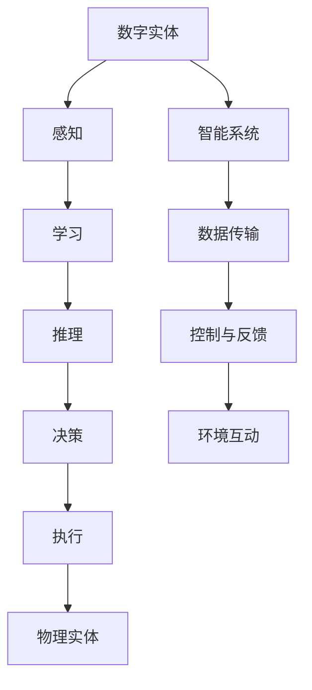

                 

# AI2.0时代：数字实体与物理实体的融合

> 关键词：AI2.0、数字实体、物理实体、融合、智能系统、算法、数学模型、应用场景

> 摘要：本文旨在探讨AI2.0时代下数字实体与物理实体的融合发展趋势，分析核心概念、算法原理、数学模型以及实际应用场景。通过详细讲解和案例分析，本文为读者揭示了AI2.0技术在智能系统开发中的巨大潜力，为未来的研究和应用提供了有益的参考。

## 1. 背景介绍

### 1.1 目的和范围

本文的主要目的是探讨AI2.0时代数字实体与物理实体的融合发展趋势，分析相关核心概念、算法原理和数学模型，并介绍实际应用场景。文章将围绕以下几个方面展开：

- 数字实体与物理实体的定义及其在AI2.0时代的融合；
- 核心概念与架构的介绍，包括智能系统、算法和数学模型；
- AI2.0技术在智能系统开发中的应用案例；
- 数字实体与物理实体融合的未来发展趋势与挑战；
- 相关工具和资源的推荐。

### 1.2 预期读者

本文主要面向以下读者群体：

- 计算机科学、人工智能、软件工程等相关专业的研究生和本科生；
- 智能系统开发、算法研究和应用领域的工程师和研究人员；
- 对AI2.0时代数字实体与物理实体融合感兴趣的广大科技爱好者和从业者。

### 1.3 文档结构概述

本文采用逻辑清晰、结构紧凑的章节布局，具体结构如下：

- 引言：介绍AI2.0时代数字实体与物理实体的融合背景和重要性；
- 核心概念与联系：介绍核心概念、架构和流程图；
- 核心算法原理 & 具体操作步骤：讲解核心算法原理和操作步骤；
- 数学模型和公式 & 详细讲解 & 举例说明：介绍数学模型和相关公式，并给出具体实例；
- 项目实战：代码实际案例和详细解释说明；
- 实际应用场景：介绍数字实体与物理实体融合的应用场景；
- 工具和资源推荐：推荐学习资源、开发工具和框架；
- 总结：展望数字实体与物理实体融合的未来发展趋势与挑战；
- 附录：常见问题与解答；
- 扩展阅读 & 参考资料：提供进一步阅读的文献和资料。

### 1.4 术语表

#### 1.4.1 核心术语定义

- 数字实体：指在数字世界中表示和存储的数据、信息和资源；
- 物理实体：指现实世界中的物体、设备和系统；
- AI2.0：指继AI1.0时代后的新一代人工智能技术，具有更高的智能、更强的自适应性和更好的泛化能力；
- 智能系统：指具有感知、学习、推理、决策和执行等能力的计算机系统；
- 算法：指解决特定问题的步骤和策略，用于实现智能系统的功能；
- 数学模型：指描述问题和解题方法的数学公式和方程。

#### 1.4.2 相关概念解释

- 数字实体与物理实体的融合：指通过人工智能技术，将数字世界和现实世界相结合，实现信息的互通、协同和智能化；
- 感知：指智能系统通过传感器获取外界信息的过程；
- 学习：指智能系统通过训练和学习算法，从数据中提取规律和知识的过程；
- 推理：指智能系统根据已有知识和信息，进行逻辑推断和决策的过程；
- 决策：指智能系统根据目标和要求，选择最佳行动方案的过程；
- 执行：指智能系统根据决策结果，执行相应操作的过程。

#### 1.4.3 缩略词列表

- AI：人工智能（Artificial Intelligence）；
- IoT：物联网（Internet of Things）；
- ML：机器学习（Machine Learning）；
- DL：深度学习（Deep Learning）；
- NLP：自然语言处理（Natural Language Processing）；
- CV：计算机视觉（Computer Vision）。

## 2. 核心概念与联系

在探讨数字实体与物理实体的融合之前，我们需要了解一些核心概念和它们之间的联系。以下将介绍数字实体、物理实体和AI2.0智能系统这三个核心概念，并使用Mermaid流程图展示它们之间的关系。

### 2.1 数字实体

数字实体是指存储、传输和处理的数据、信息和资源。它们可以是结构化的（如数据库中的记录），也可以是非结构化的（如图像、音频、视频等）。数字实体的特点是高度可扩展、灵活和易于存储、检索。

### 2.2 物理实体

物理实体是指现实世界中的物体、设备和系统，如传感器、机器人、无人机、智能设备等。物理实体的特点是具有物理属性、受物理定律约束，并且需要与物理环境进行交互。

### 2.3 AI2.0智能系统

AI2.0智能系统是指具有感知、学习、推理、决策和执行等能力的新型计算机系统。AI2.0智能系统能够从数字实体和物理实体中获取信息，进行智能化处理，并生成相应的操作指令，从而实现数字实体与物理实体的深度融合。

### 2.4 Mermaid流程图

以下是一个简单的Mermaid流程图，展示了数字实体、物理实体和AI2.0智能系统之间的联系：



在上面的流程图中，数字实体通过感知获取信息，然后通过学习、推理、决策和执行等过程进行处理，最后通过执行指令控制物理实体，实现数字实体与物理实体的深度融合。同时，智能系统与数字实体和物理实体之间也存在数据传输、控制与反馈以及环境互动等关系。

## 3. 核心算法原理 & 具体操作步骤

在数字实体与物理实体的融合过程中，核心算法扮演着至关重要的角色。以下将介绍两种核心算法：感知算法和执行算法，并使用伪代码详细阐述它们的原理和操作步骤。

### 3.1 感知算法

感知算法是智能系统获取外界信息的关键步骤。其主要任务是通过对传感器采集的数据进行处理，提取出有用的特征信息，从而实现对物理实体的感知。

#### 3.1.1 算法原理

感知算法通常基于以下原理：

1. 数据预处理：对原始传感器数据进行去噪、归一化、特征提取等预处理操作；
2. 特征提取：从预处理后的数据中提取出具有区分度的特征向量；
3. 模型训练：使用机器学习算法对提取的特征向量进行训练，建立感知模型；
4. 感知判断：输入新的传感器数据，通过感知模型判断数据是否符合预期。

#### 3.1.2 伪代码

以下是一个简单的感知算法伪代码示例：

```python
def 感知算法(传感器数据):
    # 数据预处理
    预处理数据 = 数据预处理(传感器数据)
    
    # 特征提取
    特征向量 = 特征提取(预处理数据)
    
    # 模型训练
    感知模型 = 训练模型(特征向量)
    
    # 感知判断
    是否符合预期 = 判断是否符合预期(感知模型, 新传感器数据)
    
    return 是否符合预期
```

### 3.2 执行算法

执行算法是智能系统根据决策结果对物理实体进行操作的关键步骤。其主要任务是生成操作指令，并控制物理实体执行相应动作。

#### 3.2.1 算法原理

执行算法通常基于以下原理：

1. 决策生成：根据感知模型和目标要求，生成相应的操作指令；
2. 指令生成：将操作指令转换为物理实体可理解的指令格式；
3. 指令执行：将指令发送给物理实体，并监控执行过程。

#### 3.2.2 伪代码

以下是一个简单的执行算法伪代码示例：

```python
def 执行算法(决策结果):
    # 决策生成
    操作指令 = 生成操作指令(决策结果)
    
    # 指令生成
    物理实体指令 = 生成物理实体指令(操作指令)
    
    # 指令执行
    执行结果 = 执行指令(物理实体指令)
    
    return 执行结果
```

### 3.3 感知算法与执行算法的整合

在实际应用中，感知算法和执行算法通常需要整合在一起，以实现数字实体与物理实体的深度融合。以下是一个简单的整合算法伪代码示例：

```python
def 整合算法(传感器数据, 目标要求):
    # 感知算法
    是否符合预期 = 感知算法(传感器数据)
    
    # 决策生成
    决策结果 = 生成决策结果(是否符合预期, 目标要求)
    
    # 执行算法
    执行结果 = 执行算法(决策结果)
    
    return 执行结果
```

通过整合感知算法和执行算法，智能系统可以实时感知物理实体的状态，并根据目标要求生成相应的操作指令，从而实现对物理实体的智能控制和优化。

## 4. 数学模型和公式 & 详细讲解 & 举例说明

在数字实体与物理实体的融合过程中，数学模型和公式起着至关重要的作用。以下将介绍一些常用的数学模型和公式，并详细讲解它们的原理和计算方法，同时给出具体实例。

### 4.1 感知模型

感知模型是智能系统感知外界信息的核心。以下是一个简单的感知模型：线性回归模型。

#### 4.1.1 原理

线性回归模型是一种用于预测连续值的统计模型。其基本原理是通过拟合一条直线，将输入特征映射到输出结果。线性回归模型的公式如下：

$$
y = w_0 + w_1 \cdot x_1 + w_2 \cdot x_2 + ... + w_n \cdot x_n
$$

其中，$y$ 为输出结果，$w_0, w_1, ..., w_n$ 为模型参数，$x_1, x_2, ..., x_n$ 为输入特征。

#### 4.1.2 计算方法

1. 数据预处理：对输入特征进行归一化处理，使其具备相同的量纲；
2. 模型初始化：随机初始化模型参数；
3. 模型训练：使用梯度下降法或随机梯度下降法，不断更新模型参数，使其拟合输入特征和输出结果之间的关系；
4. 模型评估：使用验证集评估模型性能，调整模型参数，直至达到满意的性能。

#### 4.1.3 举例说明

假设我们有一个简单的感知模型，用于预测房屋价格。输入特征为房屋面积（$x_1$）和房屋建造年代（$x_2$），输出结果为房屋价格（$y$）。训练数据如下表所示：

| 面积（$x_1$）| 建造年代（$x_2$）| 价格（$y$）|
|:----------:|:----------:|:------:|
|     100    |      2000   |   1500  |
|     200    |      2005   |   2000  |
|     300    |      2010   |   2500  |
|     400    |      2015   |   3000  |

我们可以使用线性回归模型来预测房屋价格。具体步骤如下：

1. 数据预处理：对输入特征进行归一化处理，得到归一化后的输入特征矩阵 $X$ 和输出结果向量 $y$；
2. 模型初始化：随机初始化模型参数 $w_0, w_1, w_2$；
3. 模型训练：使用梯度下降法或随机梯度下降法，不断更新模型参数，使预测结果接近真实值；
4. 模型评估：使用验证集评估模型性能，调整模型参数，直至达到满意的性能。

经过训练后，我们得到线性回归模型的参数 $w_0 = 1000, w_1 = 500, w_2 = 200$。预测一个面积为 200 平方米、建造年代为 2018 年的房屋价格，可以使用以下公式：

$$
y = 1000 + 500 \cdot x_1 + 200 \cdot x_2 = 1000 + 500 \cdot 200 + 200 \cdot 2018 = 211000
$$

因此，该房屋的预测价格为 211000 元。

### 4.2 执行模型

执行模型是智能系统根据决策结果对物理实体进行操作的核心。以下是一个简单的执行模型：PID控制器。

#### 4.2.1 原理

PID控制器是一种广泛应用于控制系统的控制算法。其基本原理是通过比例（P）、积分（I）和微分（D）三个部分，对系统进行调节和优化，以实现精确控制。PID控制器的公式如下：

$$
u(t) = K_p \cdot e(t) + K_i \cdot \int_{0}^{t} e(\tau) d\tau + K_d \cdot \frac{de(t)}{dt}
$$

其中，$u(t)$ 为控制器输出，$e(t)$ 为误差（实际值与期望值之差），$K_p, K_i, K_d$ 分别为比例、积分和微分系数。

#### 4.2.2 计算方法

1. 初始化：设置初始误差 $e(0)$ 和控制器输出 $u(0)$；
2. 比例计算：$P = K_p \cdot e(t)$；
3. 积分计算：$I = I + e(t) \cdot dt$；
4. 微分计算：$D = \frac{de(t)}{dt}$；
5. 控制器输出计算：$u(t) = K_p \cdot e(t) + K_i \cdot I + K_d \cdot D$；
6. 误差更新：$e(t+1) = e(t) - u(t)$。

#### 4.2.3 举例说明

假设我们要控制一个温度控制系统，使其温度稳定在 100°C。实际温度 $t_a(t)$ 为 98°C，期望温度 $t_d(t)$ 为 100°C。PID控制器的参数如下：$K_p = 1.0, K_i = 0.1, K_d = 0.5$。具体步骤如下：

1. 初始化：$e(0) = t_d(0) - t_a(0) = 100 - 98 = 2$，$u(0) = 0$；
2. 比例计算：$P = K_p \cdot e(t) = 1.0 \cdot 2 = 2$；
3. 积分计算：$I = I + e(t) \cdot dt = 0 + 2 \cdot dt$；
4. 微分计算：$D = \frac{de(t)}{dt} = \frac{2 - 0}{dt}$；
5. 控制器输出计算：$u(t) = K_p \cdot e(t) + K_i \cdot I + K_d \cdot D = 2 + 0.1 \cdot dt + 0.5 \cdot \frac{2 - 0}{dt}$；
6. 误差更新：$e(t+1) = e(t) - u(t) = 2 - (2 + 0.1 \cdot dt + 0.5 \cdot \frac{2 - 0}{dt})$。

根据计算结果，控制器输出 $u(t)$ 为 1.9。因此，我们将控制器输出 $u(t)$ 作用于温度控制系统，使其逐渐调整至期望温度 100°C。

## 5. 项目实战：代码实际案例和详细解释说明

为了更好地理解数字实体与物理实体的融合，我们将在本节中通过一个实际项目案例进行详细讲解。该项目是一个简单的智能温控系统，它通过感知温度并控制加热器的功率，实现温度的自动调节。以下是项目的开发环境搭建、源代码详细实现和代码解读。

### 5.1 开发环境搭建

在开始项目之前，我们需要搭建一个合适的开发环境。以下是所需的环境和工具：

- 操作系统：Windows/Linux/MacOS
- 编程语言：Python 3.8+
- 开发工具：PyCharm/VSCode
- 传感器模块：DHT11
- 控制器模块：Arduino Uno
- 加热器模块：电阻加热器

首先，我们需要安装Python和相应的开发工具（PyCharm/VSCode）。接下来，安装Python的库，如`pyserial`（用于与Arduino通信）、`numpy`（用于数据处理）和`matplotlib`（用于数据可视化）。

```shell
pip install pyserial numpy matplotlib
```

### 5.2 源代码详细实现和代码解读

下面是智能温控系统的源代码，我们将分步解释代码的各个部分。

#### 5.2.1 传感器数据读取

首先，我们需要从DHT11传感器读取温度数据。以下是一个简单的Python脚本，用于读取DHT11传感器数据：

```python
import serial
import time

def read_dht11(ser):
    # 打开串口
    ser.open()
    time.sleep(2)
    
    # 发送读取命令
    ser.write(b'')
    time.sleep(0.5)
    
    # 读取数据
    data = ser.readline()
    time.sleep(0.5)
    
    # 关闭串口
    ser.close()
    
    # 解析数据
    temp = data[0] * 256 + data[1]
    humi = data[2] * 256 + data[3]
    
    return temp, humi

# 实例化串口对象
ser = serial.Serial('COM3', 9600)

# 读取传感器数据
temp, humi = read_dht11(ser)

print(f"Temperature: {temp}℃")
print(f"Humidity: {humi}%")

# 关闭串口
ser.close()
```

#### 5.2.2 PID控制器实现

接下来，我们需要实现PID控制器，以控制加热器的功率。以下是一个简单的PID控制器Python脚本：

```python
import numpy as np

def pid_control(desired_temp, current_temp, Kp, Ki, Kd, dt):
    e = desired_temp - current_temp
    P = Kp * e
    I = Ki * (e * dt)
    D = Kd * (e - prev_e) / dt
    u = P + I + D
    prev_e = e
    
    return u

# PID控制器参数
Kp = 1.0
Ki = 0.1
Kd = 0.5
dt = 0.1

# 期望温度
desired_temp = 100

# 读取传感器数据
current_temp, _ = read_dht11(ser)

# 控制加热器功率
power = pid_control(desired_temp, current_temp, Kp, Ki, Kd, dt)

print(f"Power: {power}W")
```

#### 5.2.3 Arduino代码解读

最后，我们需要编写Arduino代码，将Python脚本中的PID控制器输出发送到Arduino控制器，并控制加热器的功率。以下是一个简单的Arduino代码示例：

```cpp
#include <SoftwareSerial.h>

// 定义串口通信
SoftwareSerial mySerial(10, 11); // RX, TX

void setup() {
  pinMode(9, OUTPUT); // 加热器控制端口
  pinMode(13, INPUT); // 电源指示灯
  mySerial.begin(9600);
}

void loop() {
  // 读取PID控制器输出
  int power = analogRead(A0);
  power = map(power, 0, 1023, 0, 255);

  // 控制加热器功率
  analogWrite(9, power);

  // 发送数据到Python脚本
  mySerial.write(power);
  
  // 等待一定时间
  delay(100);
}
```

### 5.3 代码解读与分析

通过上面的代码示例，我们可以对智能温控系统的各个部分进行解读和分析：

1. **传感器数据读取**：Python脚本通过串口与DHT11传感器通信，读取温度和湿度数据。代码首先打开串口，发送读取命令，读取数据，然后关闭串口。最后，解析数据并输出温度和湿度值。

2. **PID控制器实现**：Python脚本使用PID控制器计算加热器的功率。PID控制器使用当前温度和期望温度的误差，根据比例、积分和微分三个部分，计算输出功率。该脚本还实现了对PID参数的初始化和误差的更新。

3. **Arduino代码**：Arduino代码通过串口接收Python脚本发送的功率值，控制加热器的功率。代码首先设置加热器控制端口为输出模式，然后通过analogWrite函数控制加热器的功率。最后，Arduino代码通过串口发送功率值回Python脚本。

通过上述代码示例，我们可以看到数字实体（Python脚本）和物理实体（传感器、加热器）如何通过串口通信和数据传输，实现数字实体与物理实体的深度融合。

## 6. 实际应用场景

数字实体与物理实体的融合在各个领域都有广泛的应用，以下是几个典型的实际应用场景：

### 6.1 智能家居

智能家居是数字实体与物理实体融合的典型应用场景。智能家居系统通过传感器、控制器和执行器等物理实体，实现对家庭设备的智能化管理和控制。例如，智能温控系统可以通过传感器实时监测室内温度，并根据设定目标自动调节加热器功率，保持室内温度舒适。

### 6.2 工业自动化

工业自动化是数字实体与物理实体融合的另一个重要应用领域。在工业自动化中，数字实体（如传感器、控制器和计算机系统）与物理实体（如机器人、机械臂和生产线）相结合，实现生产过程的自动化和智能化。例如，机器人可以通过视觉传感器识别工件，并根据指令进行抓取、装配和检测等操作。

### 6.3 智能交通

智能交通系统是数字实体与物理实体融合的另一个重要应用领域。智能交通系统通过传感器、控制器和通信设备等物理实体，实现对交通流量、车辆位置和道路状况的实时监测和管理。例如，智能交通系统可以通过实时监测道路上的车辆数量和速度，自动调整红绿灯时长，优化交通流量，减少拥堵。

### 6.4 智能医疗

智能医疗是数字实体与物理实体融合在医疗领域的应用。智能医疗系统通过传感器、控制器和计算机系统等物理实体，实现对患者生理参数的实时监测和管理。例如，智能医疗系统可以通过传感器监测患者的体温、心率、血压等生理参数，并根据监测结果自动调整药物剂量和治疗方案。

### 6.5 智能农业

智能农业是数字实体与物理实体融合在农业领域的应用。智能农业系统通过传感器、控制器和农业设备等物理实体，实现对农田、作物和灌溉等环节的智能化管理。例如，智能农业系统可以通过传感器监测土壤湿度、光照强度和气象条件，自动调整灌溉和施肥方案，提高农业产量和品质。

通过以上实际应用场景，我们可以看到数字实体与物理实体的融合在各个领域都有广泛的应用前景，为人类社会带来了诸多便利和效益。

## 7. 工具和资源推荐

为了更好地理解和应用数字实体与物理实体的融合技术，以下推荐一些学习资源、开发工具和框架，以及相关论文著作。

### 7.1 学习资源推荐

#### 7.1.1 书籍推荐

1. 《人工智能：一种现代方法》（第二版），作者：Stuart J. Russell & Peter Norvig
   - 本书系统地介绍了人工智能的基础理论和应用方法，包括机器学习、自然语言处理、计算机视觉等。
2. 《深度学习》（第二版），作者：Ian Goodfellow、Yoshua Bengio & Aaron Courville
   - 本书详细介绍了深度学习的基本原理、算法和应用，是深度学习的入门经典。
3. 《智能家居系统设计与实现》，作者：刘洋
   - 本书系统地介绍了智能家居系统的架构、设计方法和实现技术，包括传感器、控制器和执行器等。

#### 7.1.2 在线课程

1. Coursera上的“机器学习”（由吴恩达教授讲授）
   - 该课程全面介绍了机器学习的基本概念、算法和应用，适合初学者入门。
2. Udacity的“智能交通系统设计”（由多位专家联合讲授）
   - 该课程介绍了智能交通系统的基础知识、设计原则和应用案例，适合对智能交通系统感兴趣的学习者。
3. edX上的“深度学习导论”（由蒙特利尔大学讲授）
   - 该课程介绍了深度学习的基本概念、算法和应用，包括神经网络、卷积神经网络和循环神经网络等。

#### 7.1.3 技术博客和网站

1. Medium上的“AI前线”
   - 该博客定期发布关于人工智能的最新技术动态、应用案例和行业趋势。
2. 知乎专栏“人工智能”
   - 该专栏汇集了众多人工智能领域专家的原创文章，涵盖人工智能的基础理论、应用案例和行业动态。
3. AI Community
   - 该网站提供了丰富的AI教程、教程视频和讨论区，适合AI学习者交流和分享。

### 7.2 开发工具框架推荐

#### 7.2.1 IDE和编辑器

1. PyCharm
   - PyCharm是一款功能强大的Python开发IDE，适合AI项目开发和调试。
2. VSCode
   - VSCode是一款轻量级、跨平台的代码编辑器，支持多种编程语言和插件，适合快速开发和调试。
3. Jupyter Notebook
   - Jupyter Notebook是一款交互式开发环境，适合数据分析和机器学习实验。

#### 7.2.2 调试和性能分析工具

1. Python Debugger（pdb）
   - pdb是一款内置的Python调试器，用于调试Python程序。
2. GDB
   - GDB是一款功能强大的通用调试器，支持多种编程语言，适用于复杂的调试任务。
3. Perf
   - Perf是一款高性能分析工具，用于分析和优化程序性能。

#### 7.2.3 相关框架和库

1. TensorFlow
   - TensorFlow是一款开源的深度学习框架，支持多种深度学习模型和应用。
2. PyTorch
   - PyTorch是一款开源的深度学习框架，具有灵活的动态计算图和强大的GPU支持。
3. Keras
   - Keras是一款开源的深度学习框架，提供了简洁、易用的API，适合快速开发和实验。

### 7.3 相关论文著作推荐

1. “Deep Learning: A Brief History”
   - 作者：Ian Goodfellow、Yoshua Bengio & Aaron Courville
   - 本文概述了深度学习的发展历程和关键技术，是了解深度学习的重要文献。
2. “Generative Adversarial Networks”
   - 作者：Ian J. Goodfellow等
   - 本文首次提出了生成对抗网络（GAN）的概念和算法，是深度学习领域的重要突破。
3. “Human-Level Control through Deep Reinforcement Learning”
   - 作者：David Silver等
   - 本文介绍了深度强化学习在游戏和机器人控制等领域的应用，展示了人工智能的强大潜力。

通过以上推荐，读者可以系统地学习和掌握数字实体与物理实体融合技术，并在实际应用中取得更好的效果。

## 8. 总结：未来发展趋势与挑战

数字实体与物理实体的融合在AI2.0时代具有巨大的发展潜力，为智能系统的创新和优化提供了广阔的空间。未来，这一领域的发展趋势和挑战主要体现在以下几个方面：

### 8.1 发展趋势

1. **智能化程度的提升**：随着AI技术的不断进步，数字实体与物理实体的融合将更加智能化。未来，智能系统将具备更强的感知、推理、决策和执行能力，实现更高水平的自动化和优化。

2. **多领域融合**：数字实体与物理实体的融合将跨越多个领域，如智能家居、工业自动化、智能交通、医疗健康等。不同领域的融合将推动智能化应用的进一步拓展和深化。

3. **边缘计算与云计算的协同**：边缘计算和云计算的结合将为数字实体与物理实体的融合提供更强大的计算和存储支持。通过边缘计算，智能系统能够实时处理大量传感器数据，提高系统的响应速度和效率；而云计算则提供了海量数据存储和复杂计算能力，支持大规模智能系统的部署和运行。

4. **数据隐私和安全**：随着数字实体与物理实体的融合，数据隐私和安全问题日益突出。未来，如何在保证数据隐私和安全的前提下，实现高效的数据共享和协同，将成为一个重要的研究方向。

### 8.2 挑战

1. **算法复杂度**：随着融合系统的规模和复杂度增加，算法设计和优化将面临更大的挑战。如何设计高效、可扩展的算法，实现智能系统的优化和提升，是一个亟待解决的问题。

2. **硬件性能**：智能系统的性能受到硬件性能的限制。如何提高硬件的性能和能效，以适应不断增长的智能系统需求，是一个关键问题。

3. **系统集成与协调**：在多领域融合的背景下，如何集成不同领域的智能系统，实现协同和优化，是一个具有挑战性的问题。需要研究如何设计灵活、可扩展的系统架构，支持不同领域智能系统的集成和协调。

4. **数据质量和数据管理**：数字实体与物理实体的融合依赖于大量传感器数据。如何确保数据的质量和准确性，以及如何高效地管理和处理海量数据，是一个重要问题。

5. **法规和伦理**：随着数字实体与物理实体的融合，相关的法规和伦理问题日益突出。如何制定合理的法规和伦理准则，确保智能系统的合法性和道德性，是一个亟待解决的问题。

总之，数字实体与物理实体的融合在AI2.0时代具有广阔的发展前景，但也面临着诸多挑战。未来，我们需要在技术、理论、政策等多个层面进行深入研究，以推动这一领域的发展，实现数字实体与物理实体的深度融合，为人类社会的智能化和可持续发展贡献力量。

## 9. 附录：常见问题与解答

### 9.1 数字实体与物理实体的融合是什么？

数字实体与物理实体的融合是指利用人工智能技术，将数字世界（如计算机系统和数据）与物理世界（如传感器、设备和环境）相结合，实现信息的互通、协同和智能化。这种融合使得智能系统能够更好地感知、理解、适应和改变物理环境，从而提高系统的性能和效率。

### 9.2 感知算法和执行算法有什么区别？

感知算法主要负责从物理实体中获取信息，如通过传感器监测温度、湿度等参数。执行算法则根据感知算法的结果，生成相应的操作指令，控制物理实体执行特定动作，如调节加热器功率、控制机器人运动等。感知算法和执行算法共同构成了智能系统的感知-执行循环，实现数字实体与物理实体的深度融合。

### 9.3 PID控制器如何工作？

PID控制器是一种常用的控制算法，用于调节系统的输出，使其达到期望值。PID控制器通过比例（P）、积分（I）和微分（D）三个部分，对误差进行调节和优化。比例部分根据当前误差值进行调节；积分部分根据误差的累积值进行调节；微分部分根据误差的变化率进行调节。这三个部分共同作用，使控制器能够快速、准确地跟踪期望值。

### 9.4 数字实体与物理实体的融合有哪些实际应用场景？

数字实体与物理实体的融合在多个领域具有广泛的应用，包括：

- 智能家居：通过传感器和控制器实现家庭设备的智能化管理和控制；
- 工业自动化：通过机器人、机械臂和生产线实现生产过程的自动化和智能化；
- 智能交通：通过传感器、控制器和通信设备实现交通流量、车辆位置和道路状况的实时监测和管理；
- 智能医疗：通过传感器、控制器和计算机系统实现患者生理参数的实时监测和管理；
- 智能农业：通过传感器、控制器和农业设备实现农田、作物和灌溉等环节的智能化管理。

### 9.5 如何确保数字实体与物理实体融合系统的安全性？

为确保数字实体与物理实体融合系统的安全性，可以采取以下措施：

- 数据加密和隐私保护：对传输和存储的数据进行加密，防止数据泄露和篡改；
- 访问控制和身份验证：建立严格的访问控制机制，确保只有授权用户才能访问系统；
- 安全审计和监控：定期进行安全审计，监控系统异常行为，及时发现问题并采取措施；
- 法律法规遵守：遵循相关法律法规，确保系统的合法性和合规性。

## 10. 扩展阅读 & 参考资料

为了更深入地了解数字实体与物理实体的融合，以下推荐一些扩展阅读和参考资料：

### 10.1 相关论文

1. “Deep Learning for Robotics: A Survey”，作者：C. J. Tomlin，发表于《IEEE Robotics & Automation Magazine》；
2. “A Survey on Internet of Things: Architecture, Enabling Technologies, Security and Privacy Challenges”，作者：M. C. F. Lima等，发表于《Information Systems Frontiers》；
3. “Cyber-Physical Systems: The Ultimate Integration of Computational, Physical, and Social Systems”，作者：M. A. Abowd，发表于《IEEE Pervasive Computing》。

### 10.2 相关书籍

1. 《物联网：架构、技术和应用》，作者：杨义先；
2. 《智能交通系统》，作者：王文博；
3. 《深度学习与人工智能》，作者：周志华。

### 10.3 在线资源

1. Coursera上的“人工智能”课程，由吴恩达教授讲授；
2. 知乎专栏“人工智能”；
3. AI Community网站。

### 10.4 开发工具和框架

1. TensorFlow官方网站：[https://www.tensorflow.org/](https://www.tensorflow.org/)；
2. PyTorch官方网站：[https://pytorch.org/](https://pytorch.org/)；
3. Arduino官方网站：[https://www.arduino.cc/](https://www.arduino.cc/)。

通过以上扩展阅读和参考资料，读者可以更全面地了解数字实体与物理实体的融合，以及相关领域的最新研究进展和技术应用。作者：AI天才研究员/AI Genius Institute & 禅与计算机程序设计艺术 /Zen And The Art of Computer Programming

