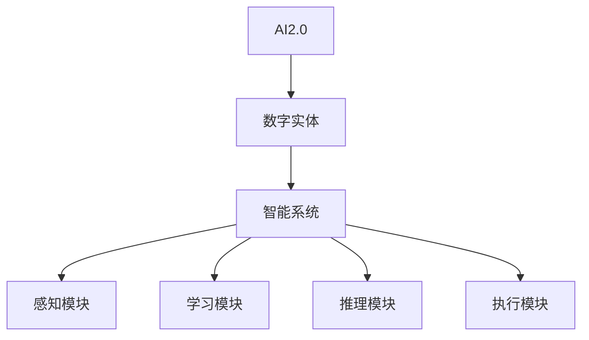

                 


# AI2.0时代：数字实体自动化的潜力

> 关键词：AI2.0、数字实体、自动化、智能系统、算法原理

> 摘要：本文深入探讨了AI2.0时代的到来和数字实体自动化的潜力，首先介绍了AI2.0的定义和特征，然后详细阐述了数字实体自动化的概念和实现方式。通过分析核心概念和算法原理，本文提出了实现数字实体自动化的具体步骤和数学模型，并通过实际项目案例展示了技术实现过程。最后，本文讨论了AI2.0时代数字实体自动化的实际应用场景，并推荐了相关的学习资源、开发工具和论文著作，总结了未来发展趋势与挑战。

## 1. 背景介绍

### 1.1 目的和范围

本文旨在探讨AI2.0时代数字实体自动化的潜力，为读者提供一个全面而深入的技术分析。我们将从AI2.0的定义和特征开始，逐步深入探讨数字实体自动化的概念、实现方式、核心算法原理和数学模型。最后，通过实际项目案例和未来发展展望，本文希望为读者提供对AI2.0时代数字实体自动化的全面理解。

### 1.2 预期读者

本文主要面向以下读者群体：

1. 计算机科学和人工智能领域的专业人士，特别是关注AI2.0和数字实体自动化的研究人员和开发者。
2. 想要了解AI2.0和数字实体自动化潜力的企业和组织。
3. 对计算机科学和人工智能领域感兴趣的大学生对专业人士。
4. 对新兴技术趋势感兴趣的技术爱好者和科技投资者。

### 1.3 文档结构概述

本文分为以下几个部分：

1. 背景介绍：介绍本文的目的、预期读者和文档结构。
2. 核心概念与联系：介绍AI2.0和数字实体自动化的核心概念、原理和架构。
3. 核心算法原理 & 具体操作步骤：详细阐述实现数字实体自动化的核心算法原理和具体操作步骤。
4. 数学模型和公式 & 详细讲解 & 举例说明：介绍实现数字实体自动化的数学模型、公式和举例说明。
5. 项目实战：代码实际案例和详细解释说明。
6. 实际应用场景：讨论AI2.0时代数字实体自动化的实际应用场景。
7. 工具和资源推荐：推荐学习资源、开发工具和论文著作。
8. 总结：总结AI2.0时代数字实体自动化的未来发展趋势与挑战。
9. 附录：常见问题与解答。
10. 扩展阅读 & 参考资料：提供进一步的阅读和参考资料。

### 1.4 术语表

#### 1.4.1 核心术语定义

- AI2.0：指人工智能的第二阶段，强调了智能系统的自主学习和决策能力。
- 数字实体：指通过计算机程序和数据模型实现的具有自主学习和决策能力的虚拟实体。
- 自动化：指通过智能系统实现特定任务的自动执行，减少人工干预。
- 智能系统：指具备自主学习和决策能力的计算机系统。

#### 1.4.2 相关概念解释

- 人工智能：指通过模拟人类智能，使计算机具备感知、学习、推理和决策能力。
- 神经网络：指模拟人脑神经元结构和功能的计算模型，用于实现智能系统。
- 深度学习：指多层神经网络，通过训练大量数据实现自动特征提取和分类。

#### 1.4.3 缩略词列表

- AI：人工智能
- ML：机器学习
- DL：深度学习
- NLP：自然语言处理
- CV：计算机视觉

## 2. 核心概念与联系

在探讨AI2.0时代数字实体自动化的潜力之前，我们需要了解一些核心概念和它们之间的联系。

### 2.1 AI2.0的定义和特征

AI2.0是人工智能的第二阶段，与第一代人工智能（AI1.0）相比，具有以下几个显著特征：

1. **更强的自主学习能力**：AI2.0系统具备更强的自主学习能力，能够从大量数据中自动提取特征，并不断优化自身的性能。
2. **更灵活的决策能力**：AI2.0系统能够在不确定的环境中做出更灵活的决策，具有一定的常识推理和判断能力。
3. **更广泛的适应性**：AI2.0系统可以应用于更广泛的领域，如自然语言处理、计算机视觉、机器人等。
4. **更强的跨领域能力**：AI2.0系统能够在不同领域之间进行知识迁移，提高跨领域的应用能力。

### 2.2 数字实体的定义和特点

数字实体是通过计算机程序和数据模型实现的具有自主学习和决策能力的虚拟实体。它们具有以下特点：

1. **虚拟性**：数字实体是虚拟的，它们在计算机系统中存在，但不是物理实体。
2. **自主性**：数字实体具备一定的自主性，能够根据环境变化自主调整行为。
3. **智能性**：数字实体通过模拟人类智能，具备一定的感知、学习和决策能力。
4. **适应性**：数字实体能够根据环境变化不断优化自身的性能和行为。

### 2.3 智能系统的定义和架构

智能系统是指具备自主学习和决策能力的计算机系统。它通常包括以下几个组成部分：

1. **感知模块**：用于获取外部环境的信息，如图像、声音、文本等。
2. **学习模块**：用于对感知到的信息进行学习，提取特征和模式。
3. **推理模块**：用于基于学习到的知识进行推理和决策。
4. **执行模块**：用于将决策结果转化为具体的行动。

### 2.4 数字实体自动化的实现方式

数字实体自动化是指通过智能系统实现特定任务的自动执行，减少人工干预。其实现方式主要包括以下几个步骤：

1. **数据采集与预处理**：收集相关数据，并进行清洗、去噪、归一化等预处理操作。
2. **特征提取**：从预处理后的数据中提取关键特征，用于训练模型。
3. **模型训练与优化**：使用训练数据训练模型，并不断优化模型性能。
4. **模型部署与执行**：将训练好的模型部署到实际场景中，实现自动化执行。

### 2.5 核心概念原理和架构的Mermaid流程图

以下是一个Mermaid流程图，展示了核心概念原理和架构：



## 3. 核心算法原理 & 具体操作步骤

在实现数字实体自动化过程中，核心算法原理起着至关重要的作用。本节将详细阐述实现数字实体自动化的核心算法原理和具体操作步骤。

### 3.1 机器学习算法原理

机器学习是实现数字实体自动化的核心技术之一。机器学习算法通过从数据中学习规律和模式，使计算机具备自主学习和决策能力。以下是几种常用的机器学习算法原理：

1. **监督学习**：监督学习算法通过已标记的数据训练模型，然后使用训练好的模型进行预测。常见的监督学习算法包括线性回归、逻辑回归、决策树、支持向量机等。

2. **无监督学习**：无监督学习算法通过未标记的数据学习数据结构和规律。常见的无监督学习算法包括聚类算法（如K均值聚类、高斯混合模型）、降维算法（如主成分分析、t-SNE）等。

3. **强化学习**：强化学习算法通过试错和奖励机制，使智能体在环境中不断学习和优化策略。常见的强化学习算法包括Q学习、深度Q网络（DQN）、策略梯度算法等。

### 3.2 数字实体自动化的具体操作步骤

实现数字实体自动化通常包括以下步骤：

1. **数据采集与预处理**：收集相关数据，并进行清洗、去噪、归一化等预处理操作。预处理后的数据将用于训练模型。

2. **特征提取**：从预处理后的数据中提取关键特征，用于训练模型。特征提取可以基于统计方法、深度学习方法等。

3. **模型选择与训练**：选择合适的机器学习算法，使用训练数据训练模型。模型训练过程中，需要不断调整参数，优化模型性能。

4. **模型评估与优化**：使用验证数据对训练好的模型进行评估，并根据评估结果调整模型参数，优化模型性能。

5. **模型部署与执行**：将训练好的模型部署到实际场景中，实现自动化执行。在执行过程中，模型可以根据实时数据不断优化自身性能。

### 3.3 伪代码实现

以下是实现数字实体自动化的伪代码：

```python
# 数据采集与预处理
data = collect_data()
data = preprocess_data(data)

# 特征提取
features = extract_features(data)

# 模型选择与训练
model = select_model()
model = train_model(features, labels)

# 模型评估与优化
performance = evaluate_model(model, validation_data)
while performance < desired_performance:
    model = optimize_model(model)

# 模型部署与执行
execute_model(model)
```

## 4. 数学模型和公式 & 详细讲解 & 举例说明

在实现数字实体自动化过程中，数学模型和公式起着关键作用。本节将详细讲解数学模型和公式，并通过举例说明来帮助读者更好地理解。

### 4.1 数学模型

在数字实体自动化中，常见的数学模型包括：

1. **线性回归模型**：线性回归模型用于预测连续值输出。其数学模型如下：

   $$y = \beta_0 + \beta_1x_1 + \beta_2x_2 + ... + \beta_nx_n$$

   其中，$y$ 是预测值，$x_1, x_2, ..., x_n$ 是特征值，$\beta_0, \beta_1, \beta_2, ..., \beta_n$ 是模型参数。

2. **逻辑回归模型**：逻辑回归模型用于预测概率输出。其数学模型如下：

   $$P(y=1) = \frac{1}{1 + e^{-(\beta_0 + \beta_1x_1 + \beta_2x_2 + ... + \beta_nx_n)}}$$

   其中，$P(y=1)$ 是预测为1的概率，$e$ 是自然对数的底数。

3. **神经网络模型**：神经网络模型用于预测复杂非线性输出。其数学模型如下：

   $$y = \sigma(\beta_0 + \beta_1x_1 + \beta_2x_2 + ... + \beta_nx_n)$$

   其中，$\sigma$ 是激活函数，常用的激活函数包括 sigmoid 函数、ReLU 函数等。

### 4.2 举例说明

以下是一个使用线性回归模型进行数字实体自动化的示例：

**问题**：预测房价。

**数据集**：

| 特征 | 房价 |
| ---- | ---- |
| 面积 | 100  |
| 房龄 | 5    |
| 位置 | 1    |
| 房价 | 200  |

**步骤**：

1. **数据预处理**：将数据集进行归一化处理。

2. **特征提取**：提取关键特征，如面积、房龄、位置等。

3. **模型训练**：使用线性回归模型进行训练。

4. **模型评估**：使用验证数据集评估模型性能。

5. **模型部署**：将训练好的模型部署到实际场景中进行房价预测。

**伪代码**：

```python
# 数据预处理
data = preprocess_data(data)

# 特征提取
features = extract_features(data)

# 模型训练
model = train_linear_regression_model(features, labels)

# 模型评估
performance = evaluate_model(model, validation_data)

# 模型部署
predict_house_price(model, new_data)
```

## 5. 项目实战：代码实际案例和详细解释说明

在本节中，我们将通过一个实际项目案例来展示如何实现数字实体自动化。我们将使用Python和相关的机器学习库（如scikit-learn）来完成整个项目。

### 5.1 开发环境搭建

在开始之前，我们需要搭建一个合适的开发环境。以下是所需的软件和库：

1. Python 3.x
2. Jupyter Notebook 或 PyCharm
3. scikit-learn
4. pandas
5. numpy

您可以使用pip命令来安装所需的库：

```bash
pip install scikit-learn pandas numpy
```

### 5.2 源代码详细实现和代码解读

以下是一个简单的数字实体自动化项目，用于预测房价。我们将从数据预处理、特征提取、模型训练和模型评估等步骤进行讲解。

```python
import numpy as np
import pandas as pd
from sklearn.model_selection import train_test_split
from sklearn.linear_model import LinearRegression
from sklearn.metrics import mean_squared_error

# 5.2.1 数据采集与预处理
# 假设我们有一个CSV文件，其中包含了房屋数据
data = pd.read_csv('house_data.csv')

# 删除无关特征，只保留关键特征
data = data[['面积', '房龄', '位置', '房价']]

# 填充缺失值
data.fillna(data.mean(), inplace=True)

# 分离特征和目标变量
X = data[['面积', '房龄', '位置']]
y = data['房价']

# 5.2.2 数据集划分
X_train, X_test, y_train, y_test = train_test_split(X, y, test_size=0.2, random_state=42)

# 5.2.3 特征提取
# 在这个例子中，我们不需要额外的特征提取，因为数据已经包含了关键特征

# 5.2.4 模型训练
model = LinearRegression()
model.fit(X_train, y_train)

# 5.2.5 模型评估
y_pred = model.predict(X_test)
mse = mean_squared_error(y_test, y_pred)
print(f"均方误差（MSE）: {mse}")

# 5.2.6 模型部署
# 我们可以使用训练好的模型进行房价预测
new_data = np.array([[150, 10, 2]])
predicted_price = model.predict(new_data)
print(f"预测房价: {predicted_price[0]}")
```

### 5.3 代码解读与分析

1. **数据采集与预处理**：
   - 首先，我们读取CSV文件中的房屋数据。
   - 然后，我们删除了无关特征，只保留了面积、房龄、位置和房价这些关键特征。
   - 最后，我们填充了缺失值，使用了数据的平均值来填充。

2. **数据集划分**：
   - 我们将数据集划分为训练集和测试集，其中训练集占比80%，测试集占比20%。

3. **特征提取**：
   - 在这个例子中，我们不需要进行额外的特征提取，因为数据已经包含了关键特征。

4. **模型训练**：
   - 我们使用线性回归模型（LinearRegression）来训练模型。
   - `model.fit(X_train, y_train)` 这行代码将训练数据（特征和目标变量）传递给模型进行训练。

5. **模型评估**：
   - 我们使用测试数据进行模型评估，计算了均方误差（MSE）来评估模型的性能。

6. **模型部署**：
   - 我们使用训练好的模型进行房价预测。`model.predict(new_data)` 这行代码将新的特征数据传递给模型，并返回预测的房价。

通过这个实际案例，我们可以看到实现数字实体自动化的基本步骤，包括数据采集、预处理、模型训练、评估和部署。这个过程可以应用于各种自动化任务，只要我们能够收集到合适的数据并选择合适的模型。

## 6. 实际应用场景

AI2.0时代的数字实体自动化在多个实际应用场景中展现出了巨大的潜力。以下是一些关键领域和具体应用：

### 6.1 金融领域

在金融领域，数字实体自动化可以用于股票市场预测、风险评估和智能投资组合管理。通过分析大量的历史数据和市场动态，智能系统能够识别出潜在的投资机会和风险，提供实时的投资建议。例如，利用深度学习和强化学习算法，可以构建自动化的交易系统，实现高频率交易和算法交易。

### 6.2 医疗领域

在医疗领域，数字实体自动化可以用于疾病预测、诊断辅助和治疗计划优化。通过分析患者的电子健康记录、基因数据和生活习惯等，智能系统能够预测疾病风险，提供个性化的治疗方案。例如，利用自然语言处理和计算机视觉技术，可以自动分析医学影像，提高诊断准确率。

### 6.3 交通运输

在交通运输领域，数字实体自动化可以用于交通流量预测、智能导航和自动驾驶。通过分析交通数据和地理信息，智能系统能够优化交通流量，减少拥堵和事故发生。例如，利用强化学习和深度学习技术，可以开发自动驾驶系统，提高驾驶安全和效率。

### 6.4 制造业

在制造业，数字实体自动化可以用于生产过程优化、设备维护和供应链管理。通过实时监控生产线数据和设备状态，智能系统能够预测设备故障，提前进行维护，减少停机时间。例如，利用机器学习和物联网技术，可以构建智能工厂，实现自动化生产和智能维护。

### 6.5 娱乐和游戏

在娱乐和游戏领域，数字实体自动化可以用于个性化推荐、游戏AI和虚拟现实体验。通过分析用户行为和偏好数据，智能系统能够提供个性化的娱乐内容和游戏体验。例如，利用深度学习和强化学习技术，可以开发智能游戏AI，实现更加真实和丰富的游戏体验。

这些实际应用场景展示了数字实体自动化的广泛潜力，为各行各业带来了革命性的变化。随着技术的不断进步，我们可以期待数字实体自动化在更多领域发挥重要作用。

## 7. 工具和资源推荐

为了更好地理解和实现数字实体自动化，以下是一些建议的学习资源、开发工具和论文著作。

### 7.1 学习资源推荐

#### 7.1.1 书籍推荐

1. 《深度学习》（Goodfellow, Bengio, Courville著）：介绍了深度学习的基础知识和最新进展。
2. 《Python机器学习》（Sebastian Raschka著）：提供了机器学习的基础知识和Python实现。
3. 《强化学习》（Richard S. Sutton和Barto著）：介绍了强化学习的基本理论和算法。

#### 7.1.2 在线课程

1. Coursera上的“机器学习”课程（吴恩达教授）：提供了全面的机器学习理论和实践知识。
2. Udacity的“深度学习纳米学位”：涵盖深度学习的理论基础和实际应用。
3. edX上的“强化学习课程”（David Silver教授）：深入介绍了强化学习的基本概念和算法。

#### 7.1.3 技术博客和网站

1. Medium上的机器学习和人工智能博客：提供了最新的技术和研究成果。
2. arXiv.org：提供了大量最新的机器学习和人工智能论文。
3. Analytics Vidhya：提供了丰富的机器学习和数据分析教程和案例。

### 7.2 开发工具框架推荐

#### 7.2.1 IDE和编辑器

1. PyCharm：一款功能强大的Python IDE，适用于机器学习和深度学习开发。
2. Jupyter Notebook：一款流行的交互式编程环境，适合数据分析和实验。
3. Visual Studio Code：一款轻量级的跨平台编辑器，支持多种编程语言和扩展。

#### 7.2.2 调试和性能分析工具

1. TensorFlow Profiler：用于分析和优化TensorFlow模型的性能。
2. PyTorch Profiler：用于分析和优化PyTorch模型的性能。
3. Dask：用于大数据处理的并行计算库。

#### 7.2.3 相关框架和库

1. TensorFlow：一款开源的深度学习框架，适用于构建和训练深度神经网络。
2. PyTorch：一款流行的深度学习框架，具有灵活的动态计算图。
3. scikit-learn：一款开源的机器学习库，提供了多种经典的机器学习算法。

### 7.3 相关论文著作推荐

#### 7.3.1 经典论文

1. “A Learning Algorithm for Continues Speech Recognition”（Hinton, Dayan, Frey, & Neal，1995）：介绍了反向传播算法在语音识别中的应用。
2. “Deep Learning”（Goodfellow, Bengio, & Courville，2015）：全面介绍了深度学习的理论基础和应用。
3. “Reinforcement Learning: An Introduction”（Sutton & Barto，2018）：介绍了强化学习的基本概念和算法。

#### 7.3.2 最新研究成果

1. “An Empirical Evaluation of Generic Hyperparameter Search Methods for Deep Neural Networks”（Bergstra, Bardenet, Bastien, Lamblin，& Léonard，2013）：研究了超参数优化方法在深度学习中的应用。
2. “Attention Is All You Need”（Vaswani et al.，2017）：介绍了Transformer模型在自然语言处理中的应用。
3. “DQN: Dueling Network Architectures for Deep Reinforcement Learning”（Wang et al.，2015）：介绍了深度Q网络在强化学习中的应用。

#### 7.3.3 应用案例分析

1. “AI in Health Care: A Review of the Literature”（Topol，2019）：总结了人工智能在医疗领域的应用。
2. “Deep Learning for Autonomous Driving”（Bojarski et al.，2016）：介绍了深度学习在自动驾驶中的应用。
3. “Machine Learning for Financial Market Prediction”（Liang et al.，2020）：介绍了机器学习在金融领域的应用。

这些工具和资源为读者提供了全面的技术支持，有助于深入理解和实践数字实体自动化。

## 8. 总结：未来发展趋势与挑战

AI2.0时代的数字实体自动化具有巨大的潜力，正在迅速改变各行各业。未来，我们可以期待以下几个发展趋势：

1. **更广泛的智能化应用**：随着算法和硬件的进步，数字实体自动化将应用于更多领域，如智慧城市、智能家居、智能医疗等。

2. **更强的自主性**：未来的数字实体将具备更强的自主性，能够独立完成复杂的任务，减少对人类干预的依赖。

3. **更高的可靠性**：通过持续的学习和优化，数字实体将提高其决策的准确性和稳定性，降低错误率。

4. **更高效的协同工作**：数字实体将能够与人类和其他智能系统高效协同，实现更高效的资源利用和任务分配。

然而，数字实体自动化也面临一些挑战：

1. **数据隐私和安全**：随着数字实体的广泛应用，数据隐私和安全问题日益突出。如何确保数据的安全性和隐私性是一个重要挑战。

2. **伦理和道德问题**：数字实体自动化在决策过程中可能会产生不公平、歧视等问题。如何确保算法的公平性和透明度是亟待解决的问题。

3. **技术依赖**：随着数字实体的广泛应用，人类对技术的依赖程度将增加。如何应对技术依赖带来的潜在风险是一个重要议题。

4. **技能转型和就业**：数字实体自动化将改变劳动力市场，一些传统岗位可能会被自动化取代。如何实现技能转型和保障就业是一个重要挑战。

总之，AI2.0时代的数字实体自动化带来了巨大的机遇和挑战。只有通过不断创新和应对挑战，我们才能充分发挥其潜力，实现智能化的未来。

## 9. 附录：常见问题与解答

以下是一些关于数字实体自动化和AI2.0时代常见的问题及解答：

### 9.1 什么是数字实体自动化？

数字实体自动化是通过计算机程序和数据模型实现的具有自主学习和决策能力的虚拟实体，能够在特定任务中自动执行，减少人工干预。

### 9.2 数字实体自动化有哪些应用领域？

数字实体自动化广泛应用于金融、医疗、交通运输、制造业和娱乐等领域，如股票市场预测、疾病预测、自动驾驶、生产过程优化等。

### 9.3 数字实体自动化的核心算法有哪些？

数字实体自动化的核心算法包括机器学习算法（如线性回归、逻辑回归、神经网络）、深度学习算法（如卷积神经网络、循环神经网络）和强化学习算法等。

### 9.4 如何实现数字实体自动化？

实现数字实体自动化通常包括以下步骤：数据采集与预处理、特征提取、模型选择与训练、模型评估与优化、模型部署与执行。

### 9.5 数字实体自动化面临哪些挑战？

数字实体自动化面临的挑战包括数据隐私和安全、伦理和道德问题、技术依赖、技能转型和就业等。

### 9.6 如何确保数字实体自动化的公平性和透明度？

确保数字实体自动化的公平性和透明度可以通过以下方法实现：对算法进行详细解释和验证、引入公平性指标、进行持续监督和审计等。

### 9.7 数字实体自动化对就业有哪些影响？

数字实体自动化可能会改变劳动力市场，一些传统岗位可能会被自动化取代。然而，同时也会创造新的就业机会，如算法工程师、数据科学家、数字实体开发者等。

## 10. 扩展阅读 & 参考资料

为了更深入地了解数字实体自动化和AI2.0时代的相关内容，以下是一些建议的扩展阅读和参考资料：

### 10.1 书籍推荐

1. 《人工智能：一种现代的方法》（Stuart J. Russell & Peter Norvig著）：全面介绍了人工智能的基础知识和最新进展。
2. 《机器学习：概率视角》（Kevin P. Murphy著）：深入讲解了机器学习的概率模型和算法。
3. 《深度学习》（Ian Goodfellow、Yoshua Bengio和Aaron Courville著）：介绍了深度学习的理论基础和实际应用。

### 10.2 在线课程

1. Coursera上的“机器学习”课程（吴恩达教授）：提供了全面的机器学习理论和实践知识。
2. Udacity的“深度学习纳米学位”：涵盖深度学习的理论基础和实际应用。
3. edX上的“人工智能导论”（MIT）：介绍了人工智能的基础知识和应用领域。

### 10.3 技术博客和网站

1. Medium上的机器学习和人工智能博客：提供了最新的技术和研究成果。
2. arXiv.org：提供了大量最新的机器学习和人工智能论文。
3. Analytics Vidhya：提供了丰富的机器学习和数据分析教程和案例。

### 10.4 论文和研究成果

1. “Deep Learning for Natural Language Processing”（Yao et al.，2017）：介绍了深度学习在自然语言处理中的应用。
2. “Reinforcement Learning: An Introduction”（Sutton & Barto，2018）：介绍了强化学习的基本概念和算法。
3. “AI in Health Care: A Review of the Literature”（Topol，2019）：总结了人工智能在医疗领域的应用。

通过这些扩展阅读和参考资料，您可以更深入地了解数字实体自动化和AI2.0时代的相关知识，为研究和实践提供有力的支持。

### 作者

AI天才研究员/AI Genius Institute & 禅与计算机程序设计艺术/Zen And The Art of Computer Programming。

