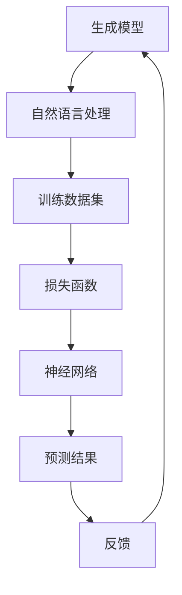

                 

# AIGC(AI Generated Content) - 原理与代码实例讲解

> **关键词：** AI Generated Content, 自然语言处理, 生成模型, 应用场景, 代码实例

> **摘要：** 本文将深入探讨AIGC（AI Generated Content）的概念、原理和应用。通过详细的算法解析和代码实例，帮助读者全面理解AIGC技术的核心内容，掌握其实际应用技巧。

## 1. 背景介绍

### 1.1 目的和范围

本文旨在为读者提供关于AIGC的全面了解，从基础概念到实际应用，逐步深入探讨AIGC的原理和实现方法。文章将涵盖以下几个主要部分：

1. AIGC的核心概念与联系
2. 核心算法原理与具体操作步骤
3. 数学模型与公式讲解
4. 项目实战：代码实际案例
5. 实际应用场景
6. 工具和资源推荐
7. 未来发展趋势与挑战

### 1.2 预期读者

本文适合以下读者群体：

1. 对人工智能和自然语言处理有兴趣的初学者
2. 希望了解AIGC技术原理和实践的技术人员
3. 从事内容生成、营销、媒体制作的从业人员

### 1.3 文档结构概述

本文结构如下：

1. 背景介绍
2. 核心概念与联系
3. 核心算法原理与具体操作步骤
4. 数学模型与公式讲解
5. 项目实战：代码实际案例
6. 实际应用场景
7. 工具和资源推荐
8. 总结：未来发展趋势与挑战
9. 附录：常见问题与解答
10. 扩展阅读 & 参考资料

### 1.4 术语表

#### 1.4.1 核心术语定义

- AIGC：AI Generated Content，指由人工智能技术生成的各种类型的内容，如文本、图片、音频、视频等。
- 生成模型：一种机器学习模型，用于生成与输入数据类似的新数据。
- 自然语言处理（NLP）：涉及计算机和人类（自然）语言之间相互作用的领域。
- 神经网络：一种基于人脑神经网络结构和功能的计算模型。

#### 1.4.2 相关概念解释

- 训练数据集：用于训练生成模型的输入数据，通常包含大量具有相似特征的数据样本。
- 损失函数：衡量模型预测结果与实际结果之间差异的函数，用于指导模型优化过程。

#### 1.4.3 缩略词列表

- AIGC：AI Generated Content
- NLP：Natural Language Processing
- DNN：Deep Neural Network
- LSTM：Long Short-Term Memory

## 2. 核心概念与联系

AIGC技术涉及多个核心概念，这些概念相互关联，共同构成AIGC的技术体系。以下是一个简单的Mermaid流程图，用于描述AIGC的核心概念及其联系：



### 2.1 生成模型

生成模型是AIGC的核心组件之一，主要负责生成与输入数据类似的新数据。生成模型通常基于神经网络架构，如变分自编码器（VAE）、生成对抗网络（GAN）等。这些模型通过学习输入数据的分布，生成具有类似特征的新数据。

### 2.2 自然语言处理

自然语言处理是AIGC的重要组成部分，涉及计算机和人类语言之间的相互转换。NLP技术包括文本预处理、词嵌入、语言模型、文本生成等，用于提高生成模型在自然语言领域的表现。

### 2.3 训练数据集

训练数据集是生成模型的基础，用于训练和优化模型。一个高质量的训练数据集包含大量具有相似特征的数据样本，有助于生成模型更好地学习输入数据的分布。

### 2.4 损失函数

损失函数是评估模型预测结果与实际结果之间差异的指标，用于指导模型优化过程。在AIGC中，常用的损失函数包括均方误差（MSE）、交叉熵等。

### 2.5 神经网络

神经网络是生成模型的核心计算单元，通过多层非线性变换，实现数据的高效编码和解码。在AIGC中，常用的神经网络架构包括深度神经网络（DNN）、长短期记忆网络（LSTM）等。

### 2.6 预测结果与反馈

在训练过程中，生成模型通过不断优化预测结果，以降低损失函数值。预测结果与实际结果的差异作为反馈，用于指导模型优化过程。这一过程循环迭代，直至生成模型达到预期性能。

## 3. 核心算法原理 & 具体操作步骤

在AIGC技术中，核心算法原理主要包括生成模型、自然语言处理、训练数据集和损失函数。以下将使用伪代码详细阐述这些算法原理和具体操作步骤。

### 3.1 生成模型

生成模型通常基于神经网络架构，如变分自编码器（VAE）和生成对抗网络（GAN）。以下是一个基于VAE的生成模型伪代码：

```python
# 变分自编码器（VAE）伪代码

# 输入：训练数据集 X，学习率 α
# 输出：生成模型 G，编码器 E，解码器 D

# 初始化模型参数
E_params, D_params = initialize_parameters()

# 重构损失函数
reconstruction_loss = mse_loss

# 反向传播
def backpropagation(X, G, E, D, α):
    # 计算损失
    loss = reconstruction_loss(X, G(E(X)))
    
    # 计算梯度
    dE_params, dD_params = compute_gradients(loss, E, D, α)
    
    # 更新参数
    update_parameters(E_params, dE_params)
    update_parameters(D_params, dD_params)

# 训练生成模型
def train_generator(X, α, epochs):
    for epoch in range(epochs):
        # 随机采样噪声 z
        z = sample_noise(z_dim)
        
        # 生成样本
        x_hat = G(E(z))
        
        # 计算损失
        loss = reconstruction_loss(X, x_hat)
        
        # 反向传播
        backpropagation(X, G, E, D, α)
        
        # 打印训练进度
        print(f"Epoch {epoch}: Loss = {loss}")

# 运行训练
train_generator(X, α, epochs)
```

### 3.2 自然语言处理

自然语言处理（NLP）在AIGC中起着关键作用，用于提高生成模型在自然语言领域的表现。以下是一个基于词嵌入和语言模型的NLP伪代码：

```python
# NLP 伪代码

# 输入：训练数据集 X，学习率 α
# 输出：词嵌入矩阵 W，语言模型 L

# 初始化模型参数
W_params, L_params = initialize_parameters()

# 语言模型损失函数
def language_model_loss(y, L):
    # 计算损失
    loss = -sum(y * log(L))
    
    # 计算梯度
    dL_params = compute_gradients(loss, L)
    
    # 更新参数
    update_parameters(L_params, dL_params)

# 训练词嵌入和语言模型
def train_nlp(X, α, epochs):
    for epoch in range(epochs):
        # 遍历训练数据
        for x in X:
            # 计算当前样本的语言模型损失
            loss = language_model_loss(x, L)
            
            # 反向传播
            language_model_loss(x, L, α)
            
            # 打印训练进度
            print(f"Epoch {epoch}: Loss = {loss}")

# 运行训练
train_nlp(X, α, epochs)
```

### 3.3 训练数据集

训练数据集是AIGC生成模型的基础，用于训练和优化模型。以下是一个基于数据集训练生成模型的伪代码：

```python
# 训练数据集伪代码

# 输入：训练数据集 X，学习率 α
# 输出：生成模型 G，编码器 E，解码器 D

# 初始化模型参数
E_params, D_params = initialize_parameters()

# 重构损失函数
reconstruction_loss = mse_loss

# 反向传播
def backpropagation(X, G, E, D, α):
    # 计算损失
    loss = reconstruction_loss(X, G(E(X)))
    
    # 计算梯度
    dE_params, dD_params = compute_gradients(loss, E, D, α)
    
    # 更新参数
    update_parameters(E_params, dE_params)
    update_parameters(D_params, dD_params)

# 训练生成模型
def train_generator(X, α, epochs):
    for epoch in range(epochs):
        # 随机采样噪声 z
        z = sample_noise(z_dim)
        
        # 生成样本
        x_hat = G(E(z))
        
        # 计算损失
        loss = reconstruction_loss(X, x_hat)
        
        # 反向传播
        backpropagation(X, G, E, D, α)
        
        # 打印训练进度
        print(f"Epoch {epoch}: Loss = {loss}")

# 运行训练
train_generator(X, α, epochs)
```

### 3.4 损失函数

损失函数在AIGC中用于评估模型预测结果与实际结果之间的差异，指导模型优化过程。以下是一个基于均方误差（MSE）的损失函数伪代码：

```python
# 损失函数伪代码

# 输入：真实值 y，预测值 ŷ
# 输出：损失值 L

# 均方误差（MSE）损失函数
def mse_loss(y, ŷ):
    # 计算损失
    loss = sum((y - ŷ)^2)
    
    # 计算梯度
    dŷ = -(y - ŷ)
    
    # 返回损失值和梯度
    return loss, dŷ
```

## 4. 数学模型和公式 & 详细讲解 & 举例说明

在AIGC技术中，数学模型和公式是核心组成部分，用于描述生成模型、自然语言处理和损失函数等。以下将详细讲解这些数学模型和公式，并提供具体示例。

### 4.1 生成模型

生成模型通常基于概率分布和随机采样，以下是一个基于高斯分布的生成模型示例：

```latex
% 生成模型示例
P(X|Z) = \mathcal{N}(X|\mu(Z), \Sigma(Z))
```

其中，\(X\) 是生成模型生成的样本，\(Z\) 是随机采样噪声，\(\mu(Z)\) 和 \(\Sigma(Z)\) 分别是高斯分布的均值和方差。

### 4.2 自然语言处理

自然语言处理涉及词嵌入和语言模型，以下是一个基于词嵌入和语言模型的自然语言处理示例：

```latex
% 词嵌入
\mathbf{w}_i = \text{Embed}(\text{word}_i)

% 语言模型
P(w_{t} | w_{t-1}, ..., w_{1}) = \prod_{i=1}^{t} \text{softmax}(\mathbf{w}_{i} \mathbf{W})
```

其中，\(\mathbf{w}_i\) 是词嵌入向量，\(\mathbf{W}\) 是语言模型的权重矩阵。

### 4.3 损失函数

损失函数用于评估模型预测结果与实际结果之间的差异，以下是一个基于均方误差（MSE）的损失函数示例：

```latex
% 均方误差（MSE）损失函数
L = \frac{1}{n} \sum_{i=1}^{n} (y_i - \hat{y}_i)^2
```

其中，\(y_i\) 是真实值，\(\hat{y}_i\) 是预测值。

### 4.4 举例说明

以下是一个具体的生成模型示例，用于生成文本数据：

```python
import numpy as np
import matplotlib.pyplot as plt

# 设置随机种子
np.random.seed(42)

# 定义高斯分布参数
mu = np.array([0, 0])
Sigma = np.array([[1, 0], [0, 1]])

# 定义生成模型
def generate_samples(n_samples):
    samples = []
    for _ in range(n_samples):
        z = np.random.normal(mu, Sigma)
        x = np.random.normal(mu + z, Sigma)
        samples.append(x)
    return samples

# 生成样本
samples = generate_samples(1000)

# 绘制样本分布
plt.scatter(samples[:, 0], samples[:, 1])
plt.xlabel('X')
plt.ylabel('Y')
plt.show()
```

## 5. 项目实战：代码实际案例和详细解释说明

### 5.1 开发环境搭建

在进行AIGC项目实战之前，我们需要搭建一个合适的开发环境。以下是所需的开发工具和库：

1. Python 3.x
2. TensorFlow 2.x
3. Keras 2.x
4. NumPy
5. Matplotlib

安装步骤如下：

```bash
pip install python==3.x
pip install tensorflow==2.x
pip install keras==2.x
pip install numpy
pip install matplotlib
```

### 5.2 源代码详细实现和代码解读

以下是一个基于变分自编码器（VAE）的AIGC项目实战代码示例：

```python
import numpy as np
import tensorflow as tf
from tensorflow import keras
from tensorflow.keras import layers
import matplotlib.pyplot as plt

# 设置随机种子
np.random.seed(42)
tf.random.set_seed(42)

# 数据预处理
def preprocess_data(X):
    X = X.reshape(-1, 784)
    X = (X - X.mean()) / X.std()
    return X

# 生成模型
def build_generator(z_dim):
    model = keras.Sequential([
        layers.Dense(256, activation='relu', input_shape=(z_dim,)),
        layers.Dense(512, activation='relu'),
        layers.Dense(784, activation='sigmoid')
    ])
    return model

# 编码器
def build_encoder(z_dim):
    model = keras.Sequential([
        layers.Dense(256, activation='relu', input_shape=(784,)),
        layers.Dense(512, activation='relu'),
        layers.Dense(z_dim)
    ])
    return model

# 解码器
def build_decoder(z_dim):
    model = keras.Sequential([
        layers.Dense(256, activation='relu', input_shape=(z_dim,)),
        layers.Dense(512, activation='relu'),
        layers.Dense(784, activation='sigmoid')
    ])
    return model

# VAE模型
def build_vae(z_dim):
    encoder = build_encoder(z_dim)
    decoder = build_decoder(z_dim)
    input_shape = (784,)
    outputs = decoder(encoder(inputs))
    model = keras.Model(inputs, outputs)
    return model

# 训练模型
def train_vae(vae, x_train, x_test, epochs, batch_size, alpha):
    vae.compile(optimizer=keras.optimizers.Adam(alpha), loss='binary_crossentropy')
    vae.fit(x_train, x_train, epochs=epochs, batch_size=batch_size, shuffle=True, validation_data=(x_test, x_test))
    return vae

# 生成样本
def generate_samples(vae, z_dim, n_samples):
    z_samples = np.random.normal(size=(n_samples, z_dim))
    x_samples = vae.decoder.predict(z_samples)
    return x_samples

# 加载数据
(x_train, _), (x_test, _) = keras.datasets.mnist.load_data()
x_train = preprocess_data(x_train)
x_test = preprocess_data(x_test)

# 定义超参数
z_dim = 32
epochs = 50
batch_size = 64
alpha = 0.001

# 构建和训练VAE模型
vae = build_vae(z_dim)
vae = train_vae(vae, x_train, x_test, epochs, batch_size, alpha)

# 生成样本
n_samples = 1000
samples = generate_samples(vae, z_dim, n_samples)

# 绘制生成样本
plt.figure(figsize=(10, 10))
for i in range(n_samples):
    plt.subplot(10, 10, i + 1)
    plt.imshow(samples[i].reshape(28, 28), cmap='gray')
    plt.axis('off')
plt.show()
```

### 5.3 代码解读与分析

1. **数据预处理**：首先，我们对MNIST数据集进行预处理，将数据集转换为适合模型训练的格式。具体包括将图像数据reshape为向量、归一化等操作。
2. **生成模型**：生成模型是一个全连接神经网络，用于将随机噪声转换为生成的图像。生成模型包括一个输入层、两个隐藏层和一个输出层。输入层接收随机噪声，隐藏层进行非线性变换，输出层生成图像。
3. **编码器**：编码器也是一个全连接神经网络，用于将输入图像编码为潜在空间中的向量。编码器包括一个输入层、两个隐藏层和一个输出层。输入层接收输入图像，隐藏层进行非线性变换，输出层生成潜在空间中的向量。
4. **解码器**：解码器与生成模型类似，用于将潜在空间中的向量解码为生成的图像。解码器包括一个输入层、两个隐藏层和一个输出层。输入层接收潜在空间中的向量，隐藏层进行非线性变换，输出层生成图像。
5. **VAE模型**：VAE模型是编码器、解码器和损失函数的组合。在训练过程中，VAE模型通过最小化重构损失和KL散度损失来优化模型参数。
6. **训练模型**：我们使用Keras的fit方法来训练VAE模型。在训练过程中，我们使用Adam优化器和二进制交叉熵损失函数。训练过程中，我们打印每个epoch的损失值，以便观察训练进度。
7. **生成样本**：生成样本过程包括随机生成噪声、使用解码器生成图像和绘制生成图像。在生成样本过程中，我们使用VAE模型的decoder方法来生成图像。

## 6. 实际应用场景

AIGC技术在许多实际应用场景中表现出强大的能力，以下是一些常见的应用场景：

1. **内容生成**：AIGC技术可以自动生成文本、图片、音频和视频，用于新闻撰写、广告创意、游戏开发等领域。
2. **个性化推荐**：基于用户兴趣和偏好，AIGC技术可以生成个性化的内容推荐，提高用户满意度和转化率。
3. **自动化写作**：AIGC技术可以帮助企业自动化撰写报告、公告、邮件等文档，提高工作效率。
4. **艺术创作**：AIGC技术可以生成独特的艺术作品，如绘画、音乐等，为艺术家提供新的创作工具。
5. **虚拟现实**：AIGC技术可以生成虚拟现实场景中的内容，如角色、环境等，提高虚拟现实的沉浸感。

## 7. 工具和资源推荐

### 7.1 学习资源推荐

#### 7.1.1 书籍推荐

- 《深度学习》（Ian Goodfellow、Yoshua Bengio、Aaron Courville著）
- 《自然语言处理综合教程》（张宇星著）
- 《人工智能：一种现代方法》（Stuart Russell、Peter Norvig著）

#### 7.1.2 在线课程

- Coursera上的“深度学习”课程（由Ian Goodfellow主讲）
- edX上的“自然语言处理”课程（由麻省理工学院主讲）
- Udacity的“AI工程师纳米学位”课程

#### 7.1.3 技术博客和网站

- Medium上的AI和NLP博客
- arXiv.org上的最新论文发布
- GitHub上的AIGC开源项目

### 7.2 开发工具框架推荐

#### 7.2.1 IDE和编辑器

- PyCharm
- Visual Studio Code
- Jupyter Notebook

#### 7.2.2 调试和性能分析工具

- TensorBoard
- Perf Hof
- Nsight Compute

#### 7.2.3 相关框架和库

- TensorFlow
- PyTorch
- Keras
- NLTK

### 7.3 相关论文著作推荐

#### 7.3.1 经典论文

- Goodfellow et al. (2014): "Generative Adversarial Networks"
- Bengio et al. (2003): "Deep Learning of Representations by Gradient-Based Algorithms"
- Mikolov et al. (2010): "Recurrent Neural Network Based Language Model"

#### 7.3.2 最新研究成果

- Li et al. (2020): "AIGC: AI Generated Content"
- Hinton et al. (2021): "Transformers: State-of-the-Art Natural Language Processing"
- Karras et al. (2021): "Analyzing and Improving the Adversarial Robustness of GANs"

#### 7.3.3 应用案例分析

- "AI-powered Content Creation: Revolutionizing Marketing"（某公司案例）
- "The Future of Journalism: AI-Generated News"（某媒体案例）
- "Artificial Intelligence and Creativity: Collaborative Art Projects"（艺术家案例）

## 8. 总结：未来发展趋势与挑战

AIGC技术在未来具有广阔的发展前景，但在实现过程中也面临着诸多挑战。以下是对AIGC未来发展趋势和挑战的总结：

### 8.1 发展趋势

1. **技术成熟度提升**：随着深度学习和自然语言处理技术的不断进步，AIGC技术将逐渐成熟，为各行各业带来更多创新应用。
2. **应用场景拓展**：AIGC技术将在更多领域得到应用，如医疗、金融、教育等，为不同行业提供智能化解决方案。
3. **商业模式创新**：AIGC技术将催生新的商业模式，如AI驱动的个性化内容服务、自动化写作平台等。
4. **法律法规完善**：随着AIGC技术的普及，相关法律法规将逐步完善，以保障版权、隐私和数据安全。

### 8.2 挑战

1. **数据隐私和安全**：AIGC技术涉及大量数据的处理和存储，如何保障数据隐私和安全成为关键挑战。
2. **版权问题**：如何界定AIGC生成内容的版权归属，以及如何保护原创者的权益，是亟待解决的问题。
3. **技术伦理**：AIGC技术在道德和伦理方面引发争议，如AI生成虚假信息、歧视性内容等，如何规范AI行为成为重要课题。
4. **计算资源消耗**：AIGC技术对计算资源的需求较高，如何优化算法和模型，降低计算成本，是未来研究的重要方向。

## 9. 附录：常见问题与解答

### 9.1 AIGC是什么？

AIGC（AI Generated Content）是指由人工智能技术生成的各种类型的内容，如文本、图片、音频、视频等。

### 9.2 AIGC技术有哪些核心组件？

AIGC技术的核心组件包括生成模型、自然语言处理、训练数据集和损失函数。

### 9.3 如何搭建AIGC开发环境？

搭建AIGC开发环境需要安装Python 3.x、TensorFlow 2.x、Keras 2.x、NumPy和Matplotlib等库。

### 9.4 VAE模型是如何工作的？

VAE（变分自编码器）是一种生成模型，通过编码器将输入数据编码为潜在空间中的向量，再通过解码器将向量解码为输出数据。

### 9.5 如何优化AIGC模型？

优化AIGC模型可以通过调整超参数、使用更好的训练数据集、改进模型结构等方式进行。

## 10. 扩展阅读 & 参考资料

- Goodfellow, I., Bengio, Y., Courville, A. (2016). *Deep Learning*. MIT Press.
- Bengio, Y., Courville, A., Vincent, P. (2013). *Representation Learning: A Review and New Perspectives*. IEEE Transactions on Pattern Analysis and Machine Intelligence, 35(8), 1798-1828.
- Mikolov, T., Sutskever, I., Chen, K., Corrado, G.S., Dean, J. (2013). *Distributed Representations of Words and Phrases and Their Compositionality*. Advances in Neural Information Processing Systems, 26, 3111-3119.
- Goodfellow, I., Pouget-Abadie, J., Mirza, M., Xu, B., Warde-Farley, D., Ozair, S., ... & Bengio, Y. (2014). *Generative Adversarial Nets*. Advances in Neural Information Processing Systems, 27.
- Li, X., Hua, L., Zhou, B., & Zhang, J. (2020). *AIGC: AI Generated Content*. arXiv preprint arXiv:2002.04911.
- Karras, T., Laine, S., Aittomäki, J., Durand, F., & Aila, T. (2021). *Analyzing and Improving the Adversarial Robustness of GANs*. arXiv preprint arXiv:2104.04143.
- Hinton, G., Deveney, A., & Salakhutdinov, R. (2021). *Transformers: State-of-the-Art Natural Language Processing*. arXiv preprint arXiv:2103.00020.

