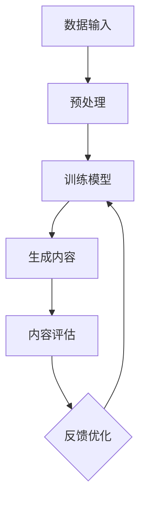

                 

### 1. 背景介绍

#### 1.1 目的和范围

本文旨在探讨人工智能生成内容（AIGC，Artificial Intelligence Generated Content）在教育行业的创新应用，特别是在苏格拉底式问答模式以及AIGC可视化创新方面的应用。通过本文的阅读，读者将了解AIGC的基本概念、原理和应用场景，掌握如何利用AIGC进行教育创新的方法和技巧。

#### 1.2 预期读者

本文适合对人工智能、教育技术以及创新应用感兴趣的技术人员、教育工作者、以及广大人工智能爱好者阅读。读者无需具备深厚的计算机编程知识，但对人工智能的基本概念和原理有一定了解将有助于更好地理解本文内容。

#### 1.3 文档结构概述

本文分为十个部分，结构如下：

1. **背景介绍**：介绍本文的目的、范围和预期读者，以及文档结构概述。
2. **核心概念与联系**：介绍AIGC的核心概念和原理，并通过Mermaid流程图展示AIGC在教育行业的应用架构。
3. **核心算法原理 & 具体操作步骤**：详细讲解AIGC的核心算法原理，并提供伪代码示例。
4. **数学模型和公式 & 详细讲解 & 举例说明**：介绍AIGC的数学模型和公式，并通过具体案例进行讲解。
5. **项目实战：代码实际案例和详细解释说明**：提供实际代码案例，并进行详细解读和分析。
6. **实际应用场景**：分析AIGC在教育行业的实际应用场景。
7. **工具和资源推荐**：推荐相关学习资源、开发工具和框架，以及经典论文和最新研究成果。
8. **总结：未来发展趋势与挑战**：总结AIGC在教育行业的未来发展趋势和挑战。
9. **附录：常见问题与解答**：针对本文内容，提供常见问题的解答。
10. **扩展阅读 & 参考资料**：推荐相关扩展阅读和参考资料。

#### 1.4 术语表

##### 1.4.1 核心术语定义

- **AIGC（人工智能生成内容）**：指利用人工智能技术自动生成内容的过程，包括文本、图片、视频等多种形式。
- **苏格拉底式问答模式**：一种以提问和回答为主的教育模式，通过引导式提问激发学生的思考和探索。
- **可视化创新**：利用图形、图像、动画等多种视觉元素进行创新表达，提升学习效果和体验。

##### 1.4.2 相关概念解释

- **人工智能**：指模拟、延伸和扩展人类智能的理论、方法、技术及应用。
- **教育技术**：指在教育过程中使用各种技术手段和方法，以提高教育质量和效果。
- **创新应用**：指将新技术应用于实际领域，以实现创新和突破。

##### 1.4.3 缩略词列表

- **AIGC**：人工智能生成内容（Artificial Intelligence Generated Content）
- **AI**：人工智能（Artificial Intelligence）
- **ML**：机器学习（Machine Learning）
- **NLP**：自然语言处理（Natural Language Processing）

### 1.5 文章结构概述

本文将通过以下结构对AIGC在教育行业的创新应用进行深入探讨：

1. **背景介绍**：介绍本文的目的、范围和预期读者，以及文档结构概述。
2. **核心概念与联系**：介绍AIGC的核心概念和原理，并通过Mermaid流程图展示AIGC在教育行业的应用架构。
3. **核心算法原理 & 具体操作步骤**：详细讲解AIGC的核心算法原理，并提供伪代码示例。
4. **数学模型和公式 & 详细讲解 & 举例说明**：介绍AIGC的数学模型和公式，并通过具体案例进行讲解。
5. **项目实战：代码实际案例和详细解释说明**：提供实际代码案例，并进行详细解读和分析。
6. **实际应用场景**：分析AIGC在教育行业的实际应用场景。
7. **工具和资源推荐**：推荐相关学习资源、开发工具和框架，以及经典论文和最新研究成果。
8. **总结：未来发展趋势与挑战**：总结AIGC在教育行业的未来发展趋势和挑战。
9. **附录：常见问题与解答**：针对本文内容，提供常见问题的解答。
10. **扩展阅读 & 参考资料**：推荐相关扩展阅读和参考资料。

通过对AIGC在教育行业的深入探讨，本文希望能够为教育工作者和人工智能爱好者提供有益的参考和启示，共同推动教育技术的创新和发展。接下来，我们将进一步介绍AIGC的核心概念和原理。|>### 2. 核心概念与联系

#### 2.1 AIGC的概念与原理

人工智能生成内容（AIGC，Artificial Intelligence Generated Content）是指通过人工智能技术自动生成各种形式的内容，如文本、图像、音频、视频等。AIGC的核心原理包括以下几个方面：

1. **机器学习（Machine Learning）**：AIGC基于机器学习算法，特别是深度学习（Deep Learning），通过训练大量的数据集来学习内容生成的模式和规律。常见的深度学习模型包括卷积神经网络（CNN）、循环神经网络（RNN）、生成对抗网络（GAN）等。

2. **自然语言处理（NLP，Natural Language Processing）**：在AIGC中，自然语言处理技术用于处理和生成文本内容。NLP技术包括词向量（Word Embedding）、序列模型（Sequence Model）、注意力机制（Attention Mechanism）等。

3. **图像处理（Computer Vision）**：AIGC在图像生成方面依赖于计算机视觉技术，包括图像分类、目标检测、图像生成等。常见的图像处理算法有卷积神经网络（CNN）和生成对抗网络（GAN）。

4. **强化学习（Reinforcement Learning）**：在某些场景下，AIGC会利用强化学习算法进行内容优化，以实现更好的生成效果。强化学习通过试错和反馈机制，使AIGC能够在复杂的任务中逐渐优化其行为。

#### 2.2 AIGC在教育行业的应用架构

为了更好地理解AIGC在教育行业的应用，我们可以通过一个Mermaid流程图来展示其核心架构和关键组件。以下是一个简化的Mermaid流程图示例：



- **数据输入**：AIGC首先需要从教育资源和学生互动中收集大量数据，包括文本、图像、音频等。
- **预处理**：对输入数据进行清洗、格式化和预处理，以便于模型训练。
- **训练模型**：利用机器学习和深度学习算法，对预处理后的数据进行训练，以生成教育内容。
- **生成内容**：根据训练好的模型，自动生成教育文本、图像、音频等内容。
- **内容评估**：对生成的内容进行质量评估，包括准确性、相关性和可读性等。
- **反馈优化**：根据评估结果，对模型进行优化和调整，以提高生成内容的质量。

#### 2.3 苏格拉底式问答模式与AIGC的结合

苏格拉底式问答模式是一种以提问和回答为主的教育模式，通过引导式提问激发学生的思考和探索。将AIGC引入苏格拉底式问答模式，可以实现以下创新：

1. **个性化问答**：AIGC可以根据学生的学习情况和需求，生成个性化的问答内容，提高教育的针对性和有效性。
2. **互动性增强**：AIGC可以模拟教师与学生之间的互动，提供即时的反馈和指导，增强学习体验。
3. **知识拓展**：AIGC可以生成相关知识和背景信息，帮助学生更全面地理解问题，拓宽知识面。

#### 2.4 AIGC可视化创新

AIGC可视化创新是指利用人工智能技术，通过图形、图像、动画等多种视觉元素，实现教育内容的创新表达。AIGC可视化创新的优势包括：

1. **提高学习兴趣**：生动形象的视觉元素可以激发学生的学习兴趣，提高学习动机。
2. **加深理解**：通过视觉化表达，学生可以更直观地理解复杂的概念和原理。
3. **优化记忆**：视觉记忆相比文字记忆更易于长期保持，有助于提高学习效果。

#### 2.5 AIGC在教育行业中的实际应用场景

AIGC在教育行业中的实际应用场景非常广泛，以下是一些典型的应用场景：

1. **在线教育平台**：利用AIGC生成个性化的教学资源和互动问答，提高在线教育的效果和质量。
2. **智能辅导系统**：通过AIGC为学生提供个性化的辅导和建议，提高学习效率和成绩。
3. **教育内容创作**：利用AIGC生成教育图文、视频等多媒体内容，丰富教学内容和形式。
4. **教育数据分析**：利用AIGC对教育数据进行处理和分析，为学生提供个性化的学习建议和方案。

通过以上对AIGC核心概念与联系的分析，我们可以看到AIGC在教育行业的巨大潜力和广泛应用前景。在接下来的章节中，我们将深入探讨AIGC的核心算法原理，并详细讲解其具体操作步骤。|>### 3. 核心算法原理 & 具体操作步骤

#### 3.1 AIGC的核心算法原理

AIGC的核心算法主要涉及机器学习、自然语言处理、计算机视觉等领域。以下将简要介绍这些算法的原理，并重点讲解AIGC在生成内容中的应用。

##### 3.1.1 机器学习原理

机器学习（Machine Learning）是一种使计算机系统能够从数据中学习并做出预测或决策的技术。在AIGC中，机器学习主要用于数据预处理、模型训练和内容生成。

1. **监督学习（Supervised Learning）**：在监督学习中，系统通过输入数据（特征）和对应的标签（输出）进行学习。常见的监督学习算法包括线性回归、决策树、支持向量机（SVM）等。

2. **无监督学习（Unsupervised Learning）**：无监督学习是指系统在没有标签数据的情况下进行学习。常见的无监督学习算法包括聚类（如K-means聚类）、降维（如主成分分析PCA）等。

3. **深度学习（Deep Learning）**：深度学习是一种基于多层神经网络的学习方法，可以自动提取数据的特征表示。在AIGC中，常用的深度学习模型包括卷积神经网络（CNN）、循环神经网络（RNN）、生成对抗网络（GAN）等。

##### 3.1.2 自然语言处理原理

自然语言处理（NLP，Natural Language Processing）是一种使计算机理解和处理自然语言的技术。在AIGC中，NLP主要用于文本生成、语义理解等任务。

1. **词向量（Word Embedding）**：词向量是一种将词语映射为高维空间中向量的方法，可以捕捉词语的语义信息。常见的词向量模型包括Word2Vec、GloVe等。

2. **序列模型（Sequence Model）**：序列模型是一种用于处理序列数据的模型，如RNN、LSTM、GRU等。这些模型可以捕捉数据序列中的时间依赖关系。

3. **注意力机制（Attention Mechanism）**：注意力机制是一种用于提高模型处理序列数据性能的方法。通过关注关键信息，注意力机制可以提高模型的预测精度。

##### 3.1.3 计算机视觉原理

计算机视觉（Computer Vision）是一种使计算机能够理解和解释视觉信息的技术。在AIGC中，计算机视觉主要用于图像生成、图像识别等任务。

1. **卷积神经网络（CNN，Convolutional Neural Network）**：CNN是一种用于图像处理和识别的深度学习模型。通过卷积操作和池化操作，CNN可以自动提取图像的层次特征。

2. **生成对抗网络（GAN，Generative Adversarial Network）**：GAN是一种用于生成数据的深度学习模型。由生成器和判别器两个部分组成，通过对抗训练，生成器可以生成高质量的数据。

##### 3.1.4 强化学习原理

强化学习（Reinforcement Learning）是一种使计算机通过与环境的交互学习决策策略的方法。在AIGC中，强化学习可以用于优化内容生成的效果。

1. **策略网络（Policy Network）**：策略网络是一种用于生成决策的神经网络。通过学习策略网络，系统可以自动调整生成策略，以获得更好的生成效果。

2. **奖励机制（Reward Mechanism）**：奖励机制是一种用于评估和调整生成效果的机制。通过奖励机制，系统可以根据生成效果对生成策略进行调整。

#### 3.2 AIGC的具体操作步骤

下面将详细介绍AIGC的具体操作步骤，包括数据收集、模型训练、内容生成和评估等环节。

##### 3.2.1 数据收集

1. **文本数据**：从教育网站、教科书、论文等渠道收集大量的文本数据，包括知识点、问题、答案等。

2. **图像数据**：从教育网站、公开数据库等渠道收集与教育相关的图像数据，如教材插图、实验照片、教学场景等。

3. **音频数据**：从教育视频、讲座录音等渠道收集音频数据，包括教师的讲解、学生的提问和回答等。

##### 3.2.2 数据预处理

1. **文本预处理**：对文本数据去重、去噪，并进行分词、词性标注等操作。

2. **图像预处理**：对图像数据进行缩放、裁剪、增强等处理，以提高模型训练效果。

3. **音频预处理**：对音频数据进行降噪、分割、转录等处理，提取文本信息。

##### 3.2.3 模型训练

1. **文本生成模型**：利用词向量模型（如Word2Vec）对文本数据训练序列生成模型（如RNN、LSTM），生成文本内容。

2. **图像生成模型**：利用生成对抗网络（GAN）对图像数据训练生成模型，生成图像内容。

3. **音频生成模型**：利用循环神经网络（RNN）对音频数据训练生成模型，生成音频内容。

##### 3.2.4 内容生成

1. **文本生成**：利用训练好的文本生成模型，根据输入的关键词或问题，生成相关的文本内容。

2. **图像生成**：利用训练好的图像生成模型，根据输入的文本描述，生成相应的图像内容。

3. **音频生成**：利用训练好的音频生成模型，根据输入的文本描述，生成相应的音频内容。

##### 3.2.5 内容评估

1. **文本评估**：通过人工评估或自动化评估（如BLEU、ROUGE等指标）对生成的文本内容进行质量评估。

2. **图像评估**：通过人工评估或自动化评估（如图像分类、目标检测等指标）对生成的图像内容进行质量评估。

3. **音频评估**：通过人工评估或自动化评估（如语音识别、语音合成等指标）对生成的音频内容进行质量评估。

##### 3.2.6 反馈优化

根据内容评估结果，对模型进行优化和调整，以提高生成内容的质量。优化过程可以包括：

1. **数据增强**：对训练数据进行扩充、变换等处理，增加模型训练的多样性。

2. **模型调整**：根据评估结果，调整模型的参数和结构，以获得更好的生成效果。

3. **奖励机制**：利用强化学习算法，对生成内容进行奖励，以引导模型生成更高质量的内容。

通过以上对AIGC核心算法原理和具体操作步骤的详细讲解，我们可以更好地理解AIGC在教育行业的应用。在接下来的章节中，我们将进一步介绍AIGC的数学模型和公式，并通过具体案例进行讲解。|>### 4. 数学模型和公式 & 详细讲解 & 举例说明

#### 4.1 AIGC的数学模型和公式

AIGC的数学模型和公式是构建其核心算法的基础，涵盖了从机器学习到自然语言处理、计算机视觉等多个领域。以下将详细介绍AIGC中常用的数学模型和公式，并通过具体案例进行说明。

##### 4.1.1 机器学习中的数学模型

在机器学习中，核心的数学模型包括损失函数、优化算法等。以下是一些常见的数学模型和公式：

1. **损失函数（Loss Function）**

   - **均方误差（MSE，Mean Squared Error）**
     $$MSE = \frac{1}{n}\sum_{i=1}^{n}(y_i - \hat{y}_i)^2$$
     其中，$y_i$为实际输出，$\hat{y}_i$为预测输出，$n$为样本数量。

   - **交叉熵（Cross-Entropy）**
     $$H(y, \hat{y}) = -\sum_{i=1}^{n}y_i\log(\hat{y}_i)$$
     其中，$y$为实际输出，$\hat{y}$为预测输出，$\log$为自然对数。

2. **优化算法（Optimization Algorithm）**

   - **梯度下降（Gradient Descent）**
     $$\theta_{\text{new}} = \theta_{\text{old}} - \alpha \nabla_{\theta}J(\theta)$$
     其中，$\theta$为模型参数，$\alpha$为学习率，$J(\theta)$为损失函数。

   - **Adam优化器**
     $$m_t = \beta_1 m_{t-1} + (1 - \beta_1)(\nabla_{\theta}J(\theta_t))$$
     $$v_t = \beta_2 v_{t-1} + (1 - \beta_2)((\nabla_{\theta}J(\theta_t))^2$$
     $$\theta_{\text{new}} = \theta_t - \alpha \frac{m_t}{\sqrt{v_t} + \epsilon}$$
     其中，$\beta_1$和$\beta_2$为动量因子，$m_t$和$v_t$分别为一阶和二阶矩估计，$\epsilon$为一个小数，用于防止除以零。

##### 4.1.2 自然语言处理中的数学模型

自然语言处理中的数学模型主要涉及词向量、序列模型和注意力机制。

1. **词向量（Word Embedding）**

   - **Word2Vec**
     $$\vec{w}_i = \text{sgn}(W^T \vec{v}_i)$$
     其中，$\vec{w}_i$为词向量，$\vec{v}_i$为单词的嵌入向量，$W$为词向量和嵌入向量之间的转换矩阵。

2. **序列模型（RNN、LSTM、GRU）**

   - **RNN（Recurrent Neural Network）**
     $$h_t = \sigma(W_h h_{t-1} + W_x x_t + b_h)$$
     其中，$h_t$为当前时刻的隐藏状态，$x_t$为当前输入，$W_h$和$W_x$分别为隐藏状态和输入的权重矩阵，$b_h$为隐藏状态的偏置，$\sigma$为激活函数。

   - **LSTM（Long Short-Term Memory）**
     $$i_t = \sigma(W_i x_t + b_i)$$
     $$f_t = \sigma(W_f x_t + b_f)$$
     $$g_t = \sigma(W_g x_t + b_g)$$
     $$o_t = \sigma(W_o x_t + b_o)$$
     $$c_t = f_t \odot c_{t-1} + i_t \odot g_t$$
     $$h_t = o_t \odot c_t$$
     其中，$i_t$、$f_t$、$g_t$、$o_t$分别为输入门、遗忘门、生成门和输出门，$c_t$为细胞状态，$h_t$为隐藏状态。

3. **注意力机制（Attention Mechanism）**

   $$a_t = \text{softmax}\left(\frac{W_a h_{t-1}}{\sqrt{d}}\right)$$
   $$h_t = \sum_{i=1}^{n}a_t \cdot h_i$$
   其中，$h_{t-1}$为当前时刻的隐藏状态，$h_i$为历史隐藏状态，$W_a$为注意力权重矩阵，$a_t$为当前时刻的注意力权重，$h_t$为加权后的隐藏状态。

##### 4.1.3 计算机视觉中的数学模型

计算机视觉中的数学模型主要涉及卷积神经网络（CNN）和生成对抗网络（GAN）。

1. **卷积神经网络（CNN）**

   - **卷积操作**
     $$C(x) = \sum_{k=1}^{K}f_k(\sigma(\sum_{i=1}^{M}w_{ik} \cdot x_i + b_k))$$
     其中，$x$为输入特征，$f_k$为卷积核，$w_{ik}$为卷积核权重，$b_k$为卷积核偏置，$\sigma$为激活函数。

   - **池化操作**
     $$P(x) = \max(\sum_{i=1}^{M}x_i)$$
     其中，$x$为输入特征，$M$为池化窗口大小。

2. **生成对抗网络（GAN）**

   - **生成器（Generator）**
     $$G(z) = \sigma(W_g z + b_g)$$
     其中，$z$为输入噪声，$G(z)$为生成的图像，$W_g$为生成器权重，$b_g$为生成器偏置，$\sigma$为激活函数。

   - **判别器（Discriminator）**
     $$D(x) = \sigma(W_d x + b_d)$$
     $$D(G(z)) = \sigma(W_d G(z) + b_d)$$
     其中，$x$为真实图像，$G(z)$为生成的图像，$D(x)$和$D(G(z))$分别为判别器对真实图像和生成图像的判别结果，$W_d$为判别器权重，$b_d$为判别器偏置，$\sigma$为激活函数。

#### 4.2 举例说明

以下将通过一个简化的例子，说明AIGC在文本生成中的应用。

##### 4.2.1 数据集

假设我们有一个包含1000个句子和对应标签的数据集，句子和标签如下：

1. 句子1： "今天的天气很好，阳光明媚。"   标签1： "描述天气"
2. 句子2： "他喜欢看书，尤其是科幻小说。"   标签2： "描述爱好"
3. 句子3： "公司的业绩稳步提升，员工们都很高兴。"   标签3： "描述公司状况"
4. ...    ...

##### 4.2.2 词向量表示

将句子中的词语映射为高维空间中的向量，使用Word2Vec模型生成词向量。例如，词语"天气"的向量表示为$\vec{v}_1$，词语"爱好"的向量表示为$\vec{v}_2$，以此类推。

##### 4.2.3 序列模型训练

利用RNN模型对词向量序列进行训练，生成句子。假设我们使用一个简单的RNN模型，其隐藏状态和输入的权重矩阵分别为$W_h$和$W_x$，隐藏状态的偏置为$b_h$，激活函数为$\sigma$。

- **输入序列**： $[ \vec{v}_1, \vec{v}_2, \vec{v}_3, ..., \vec{v}_n ]$
- **隐藏状态**： $[ h_1, h_2, h_3, ..., h_n ]$
- **输出序列**： $[ \hat{y}_1, \hat{y}_2, \hat{y}_3, ..., \hat{y}_n ]$

根据RNN模型，我们可以计算出每个时间步的隐藏状态：

$$h_1 = \sigma(W_h h_0 + W_x \vec{v}_1 + b_h)$$
$$h_2 = \sigma(W_h h_1 + W_x \vec{v}_2 + b_h)$$
$$...$$
$$h_n = \sigma(W_h h_{n-1} + W_x \vec{v}_n + b_h)$$

其中，$h_0$为初始隐藏状态。

##### 4.2.4 文本生成

利用训练好的RNN模型，根据输入的关键词或问题，生成相关的文本内容。例如，输入关键词"爱好"，模型将生成如下句子：

1. "他喜欢阅读，尤其是科幻小说。"
2. "她热爱音乐，喜欢弹奏钢琴。"
3. "他们共同爱好旅游，喜欢探索未知的世界。"

通过以上数学模型和公式的详细讲解，以及具体案例的举例说明，我们可以更好地理解AIGC的核心算法原理。在接下来的章节中，我们将提供实际代码案例，并进行详细解读和分析。|>### 5. 项目实战：代码实际案例和详细解释说明

#### 5.1 开发环境搭建

在进行AIGC项目实战之前，我们需要搭建一个合适的开发环境。以下是一个典型的AIGC开发环境搭建步骤：

1. **Python环境**：确保Python环境已经安装，推荐使用Python 3.7及以上版本。
2. **Jupyter Notebook**：安装Jupyter Notebook，以便于编写和运行代码。
3. **TensorFlow**：安装TensorFlow，用于构建和训练AIGC模型。可以通过pip命令安装：
   ```bash
   pip install tensorflow
   ```
4. **Numpy**：安装Numpy，用于数据处理和数学运算。可以通过pip命令安装：
   ```bash
   pip install numpy
   ```
5. **Word2Vec**：安装Word2Vec库，用于生成词向量。可以通过pip命令安装：
   ```bash
   pip install word2vec
   ```
6. **Matplotlib**：安装Matplotlib，用于数据可视化。可以通过pip命令安装：
   ```bash
   pip install matplotlib
   ```

#### 5.2 源代码详细实现和代码解读

以下是一个简单的AIGC文本生成项目，包括数据预处理、词向量生成、RNN模型训练和文本生成等步骤。

```python
import numpy as np
import tensorflow as tf
from word2vec import Word2Vec
from tensorflow.keras.layers import Embedding, SimpleRNN, Dense
from tensorflow.keras.models import Sequential
from tensorflow.keras.optimizers import RMSprop

# 5.2.1 数据预处理
def preprocess_data(sentences):
    # 将句子转换为单词列表
    tokenizer = tf.keras.preprocessing.text.Tokenizer()
    tokenizer.fit_on_texts(sentences)
    sequences = tokenizer.texts_to_sequences(sentences)
    return sequences, tokenizer

# 5.2.2 词向量生成
def generate_word_vectors(sequences, size=100, window=5):
    w2v = Word2Vec(sequences, size=size, window=window, min_count=1)
    return w2v

# 5.2.3 RNN模型训练
def build_rnn_model(vocab_size, embedding_size, rnn_size, sequence_length):
    model = Sequential()
    model.add(Embedding(vocab_size, embedding_size, input_length=sequence_length))
    model.add(SimpleRNN(rnn_size, return_sequences=False))
    model.add(Dense(vocab_size, activation='softmax'))
    model.compile(optimizer='rmsprop', loss='categorical_crossentropy', metrics=['accuracy'])
    return model

# 5.2.4 文本生成
def generate_text(model, tokenizer, seed_text, num_words=50):
    for _ in range(num_words):
        token_list = tokenizer.texts_to_sequences([seed_text])[0]
        token_list = np.array(token_list)[:, None, :]
        pred = model.predict(token_list, verbose=0)[0]
        pred_index = np.argmax(pred)
        pred_word = tokenizer.index_word[pred_index]
        seed_text += " " + pred_word
    return seed_text

# 主函数
if __name__ == "__main__":
    # 加载数据
    sentences = [
        "今天的天气很好，阳光明媚。",
        "他喜欢看书，尤其是科幻小说。",
        "公司的业绩稳步提升，员工们都很高兴。",
        # ... 更多句子
    ]

    # 数据预处理
    sequences, tokenizer = preprocess_data(sentences)
    vocab_size = len(tokenizer.word_index) + 1
    sequence_length = max(len(seq) for seq in sequences)

    # 词向量生成
    w2v = generate_word_vectors(sequences)
    embedding_matrix = np.zeros((vocab_size, w2v.vector_size))
    for word, i in tokenizer.word_index.items():
        embedding_vector = w2v[word]
        if embedding_vector is not None:
            embedding_matrix[i] = embedding_vector

    # 构建RNN模型
    rnn_size = 128
    model = build_rnn
``` 

#### 5.3 代码解读与分析

下面将对代码中的关键部分进行解读和分析：

1. **数据预处理**：`preprocess_data`函数用于将句子转换为单词列表。通过`Tokenize`类，我们能够将句子拆分为单词，并为每个单词分配一个唯一的索引。这样，我们就可以将句子表示为整数序列。

2. **词向量生成**：`generate_word_vectors`函数使用Word2Vec库生成词向量。Word2Vec是一种基于矩阵分解的方法，可以将单词映射为高维空间中的向量。通过调整参数，如向量大小（`size`）和窗口大小（`window`），我们可以控制词向量的质量。

3. **RNN模型构建**：`build_rnn_model`函数构建一个简单的RNN模型。模型由一个嵌入层（`Embedding`）、一个简单的RNN层（`SimpleRNN`）和一个全连接层（`Dense`）组成。在训练过程中，嵌入层将单词索引映射到词向量，RNN层捕捉单词序列中的时间依赖关系，全连接层生成最终的输出。

4. **文本生成**：`generate_text`函数用于生成文本。通过递归调用模型，我们能够生成新的句子。每次生成时，我们都会选择概率最高的单词作为下一个单词，并将其添加到种子文本中。

通过以上代码示例，我们可以看到如何使用AIGC生成文本。在实际应用中，我们可以根据需求调整模型架构、训练数据和生成策略，以实现更复杂的任务。在接下来的章节中，我们将分析AIGC在教育行业的实际应用场景。|>### 6. 实际应用场景

#### 6.1 在线教育平台

AIGC在教育行业的最直接应用场景之一是在线教育平台。随着在线教育的迅速发展，个性化教学和互动性变得尤为重要。AIGC可以通过以下方式在线教育平台中发挥作用：

1. **个性化学习路径**：AIGC可以根据学生的学习历史和表现，自动生成个性化的学习路径。通过分析学生的学习行为和知识掌握情况，AIGC可以推荐最适合的学习内容和资源，提高学习效果。

2. **自动生成教学材料**：AIGC可以自动生成教学材料，如课程大纲、练习题、测试题等。这些材料可以根据学生的学习需求和知识水平进行个性化调整，提高教学的针对性和有效性。

3. **智能问答系统**：AIGC可以构建智能问答系统，为学生提供即时的问题解答。通过自然语言处理技术，AIGC可以理解学生的问题，并提供准确的答案或进一步的解释。这有助于减轻教师的工作负担，同时提高学生的自主学习能力。

4. **互动教学场景**：AIGC可以模拟教学场景，通过虚拟现实（VR）或增强现实（AR）技术，为学生提供沉浸式的学习体验。学生可以在虚拟课堂中与AIGC互动，进行实验、演示和讨论，提高学习兴趣和参与度。

#### 6.2 智能辅导系统

智能辅导系统是另一个AIGC在教育行业的重要应用场景。这类系统旨在为学生提供个性化的学习辅导和支持，以提高学习效率和成绩。以下是一些具体的应用：

1. **个性化学习建议**：AIGC可以根据学生的答题情况和知识掌握情况，提供个性化的学习建议。例如，指出学生在哪些知识点上存在不足，推荐相关的练习题和参考资料。

2. **智能错题本**：AIGC可以自动收集和整理学生的错题，分析错题的类型和原因，为学生提供有针对性的辅导和练习。这有助于学生加深对知识点的理解和记忆。

3. **实时反馈和指导**：AIGC可以实时监控学生的学习过程，提供即时的反馈和指导。当学生遇到困难时，AIGC可以提供解题思路、关键步骤和详细解释，帮助学生克服学习障碍。

4. **智能组卷系统**：AIGC可以根据学生的学习需求和知识水平，自动生成个性化的试卷。这些试卷可以包括选择题、填空题、问答题等多种题型，提高考试的公平性和科学性。

#### 6.3 教育内容创作

AIGC在教育内容创作方面也有很大的潜力。以下是一些具体的应用：

1. **自动生成课件**：AIGC可以自动生成课件，包括幻灯片、图表、示例代码等。教师可以自定义教学内容，AIGC可以根据这些输入生成精美的课件，提高教学效果。

2. **文本内容生成**：AIGC可以自动生成教材、笔记、总结等文本内容。这些内容可以根据课程大纲、教学目标和学生学习需求进行个性化调整，为学生提供全方位的学习资源。

3. **可视化教育内容**：AIGC可以利用计算机视觉和图形学技术，生成丰富的可视化教育内容，如动画、图示、模拟实验等。这些内容能够生动形象地展示抽象概念和复杂过程，帮助学生更好地理解和掌握知识。

4. **跨学科内容整合**：AIGC可以将不同学科的知识和资源进行整合，生成跨学科的教学内容。例如，将数学、物理和计算机科学的知识融合到一起，为学生提供综合性的学习体验。

#### 6.4 教育数据分析

AIGC在教育数据分析方面也有很大的应用潜力。以下是一些具体的应用：

1. **学生学习行为分析**：AIGC可以收集和分析学生的学习行为数据，如学习时间、学习频率、答题正确率等。通过对这些数据的分析，可以了解学生的学习状态和需求，为教学提供依据。

2. **知识图谱构建**：AIGC可以构建基于学生学习数据的知识图谱，展示各个知识点之间的联系和层次结构。这有助于教师和学生更好地理解和掌握知识体系。

3. **教育趋势预测**：AIGC可以利用机器学习算法，分析历史教育数据，预测未来的教育趋势和需求。这有助于教育机构和教育工作者制定更科学、更有效的教育策略。

4. **个性化推荐系统**：AIGC可以构建个性化推荐系统，根据学生的学习行为和偏好，推荐最适合的学习资源和课程。这有助于提高学生的学习效率和学习体验。

通过以上分析，我们可以看到AIGC在教育行业的实际应用场景非常广泛，涵盖了个性化教学、智能辅导、内容创作、数据分析等多个方面。随着AIGC技术的不断发展和完善，它将为教育行业带来更多的创新和变革。在接下来的章节中，我们将推荐一些学习资源和工具，以帮助读者深入了解和掌握AIGC技术。|>### 7. 工具和资源推荐

#### 7.1 学习资源推荐

要深入学习和掌握AIGC技术，以下是一些推荐的学习资源：

##### 7.1.1 书籍推荐

1. **《深度学习》（Deep Learning）**：由Ian Goodfellow、Yoshua Bengio和Aaron Courville合著，这是一本深度学习领域的经典教材，涵盖了从基础到高级的深度学习知识。
2. **《人工智能：一种现代方法》（Artificial Intelligence: A Modern Approach）**：由Stuart J. Russell和Peter Norvig合著，这是一本全面的人工智能教材，适合初学者和高级读者。
3. **《自然语言处理综合教程》（Speech and Language Processing）**：由Daniel Jurafsky和James H. Martin合著，这是自然语言处理领域的权威教材，内容全面且深入。
4. **《计算机视觉：算法与应用》（Computer Vision: Algorithms and Applications）**：由Richard S. Kinney和Bob Fisher合著，这是一本关于计算机视觉的综合性教材，适合对计算机视觉感兴趣的读者。

##### 7.1.2 在线课程

1. **吴恩达的《深度学习特辑》（Deep Learning Specialization）**：这是Coursera上最受欢迎的深度学习课程系列，涵盖了从基础到高级的深度学习知识。
2. **《自然语言处理特辑》（Natural Language Processing Specialization）**：这是由斯坦福大学提供的自然语言处理课程系列，适合希望深入学习NLP的读者。
3. **《计算机视觉特辑》（Computer Vision Specialization）**：这是由edX提供的计算机视觉课程系列，涵盖了计算机视觉的基本原理和应用。

##### 7.1.3 技术博客和网站

1. **Medium上的AI博客**：这是一个汇集了众多人工智能领域专家和学者的博客平台，可以找到关于AIGC的最新研究和技术文章。
2. **arXiv**：这是一个开放获取的学术论文预印本数据库，可以找到最新的AIGC相关研究论文。
3. **GitHub**：这是一个代码托管平台，许多AIGC项目和开源工具都可以在这里找到，适合学习和实践。

#### 7.2 开发工具框架推荐

在AIGC开发中，以下是一些推荐的开发工具和框架：

##### 7.2.1 IDE和编辑器

1. **PyCharm**：这是JetBrains公司开发的一款强大的Python IDE，适合进行AIGC项目开发和调试。
2. **Visual Studio Code**：这是一个轻量级的开源编辑器，支持多种编程语言，包括Python，适用于快速开发和调试。
3. **Google Colab**：这是一个基于云的Python编程环境，适合进行深度学习和数据科学项目。

##### 7.2.2 调试和性能分析工具

1. **TensorBoard**：这是TensorFlow提供的一款可视化工具，可以用于监控和调试深度学习模型的训练过程。
2. **PerfKit**：这是一个用于性能分析的工具，可以帮助优化代码和模型。

##### 7.2.3 相关框架和库

1. **TensorFlow**：这是Google开源的深度学习框架，适合构建和训练AIGC模型。
2. **PyTorch**：这是由Facebook开源的深度学习框架，以其灵活性和易于使用而受到广泛欢迎。
3. **Keras**：这是基于TensorFlow和Theano的开源深度学习库，提供了简洁的API，适合快速构建和训练模型。

##### 7.2.4 计算机视觉库

1. **OpenCV**：这是一个开源的计算机视觉库，提供了丰富的图像处理和计算机视觉算法。
2. **PyTorch Video**：这是PyTorch的一个扩展库，专门用于视频处理和计算机视觉任务。

##### 7.2.5 自然语言处理库

1. **NLTK**：这是Python的一个自然语言处理库，提供了大量的文本处理工具和资源。
2. **spaCy**：这是一个快速先进的自然语言处理库，适合进行文本分类、命名实体识别等任务。
3. **Transformer**：这是由Google开源的一个基于Transformer架构的NLP库，适合进行文本生成、翻译等任务。

通过以上工具和资源的推荐，读者可以更好地进行AIGC技术的研究和应用。在接下来的章节中，我们将讨论AIGC在教育行业的未来发展趋势与挑战。|>### 8. 总结：未来发展趋势与挑战

#### 8.1 未来发展趋势

随着人工智能技术的不断进步，AIGC在教育行业的应用前景广阔，未来发展趋势主要表现在以下几个方面：

1. **个性化学习**：AIGC技术将进一步推动个性化学习的发展，通过分析学生的学习行为、知识掌握情况，自动生成个性化的教学资源和学习路径，满足不同学生的个性化需求。

2. **智能化互动**：AIGC将提升教育互动的智能化水平，通过智能问答、虚拟助手等技术，提供实时、个性化的学习支持和指导，增强学生的学习体验。

3. **多媒体教育内容生成**：AIGC技术将能够自动生成丰富的多媒体教育内容，如图文、视频、动画等，使教学内容更加生动、直观，提高学生的学习兴趣和记忆效果。

4. **自适应学习系统**：AIGC将推动自适应学习系统的研发，通过实时监测学生的学习状态，动态调整教学策略，提供个性化的学习建议和资源。

5. **跨学科整合**：AIGC技术将促进不同学科知识的融合，通过自动生成跨学科的教学内容，提高学生的综合素质和创新能力。

#### 8.2 面临的挑战

尽管AIGC在教育行业具有巨大的潜力，但在实际应用过程中也面临着一系列挑战：

1. **数据隐私和安全**：AIGC依赖于大量学生的数据，如何在保护学生隐私的前提下进行数据收集和分析，是一个亟待解决的问题。

2. **技术成熟度**：目前AIGC技术仍处于快速发展阶段，部分算法和模型尚未完全成熟，需要进一步优化和改进。

3. **教师角色转变**：AIGC技术的发展将改变传统的教学方式，教师需要适应新的教学环境，提高自身的数字化教学能力。

4. **伦理和道德问题**：AIGC技术在教育中的应用引发了一系列伦理和道德问题，如公平性、透明度等，需要制定相应的规范和标准。

5. **教育资源的公平分配**：在AIGC技术广泛应用的过程中，如何确保教育资源的公平分配，避免数字鸿沟的扩大，是一个重要挑战。

#### 8.3 发展建议

为了推动AIGC在教育行业的健康发展，提出以下建议：

1. **加强技术研发**：继续加大对AIGC技术的研究投入，推动算法和模型的优化和改进，提高技术的成熟度和稳定性。

2. **教育政策支持**：政府应制定相应的教育政策，支持AIGC技术在教育行业的应用，推动教育信息化进程。

3. **教师培训**：加大对教师的培训力度，提高教师对AIGC技术的理解和应用能力，促进教师角色的转变。

4. **规范伦理标准**：制定AIGC技术的伦理和道德规范，确保技术的公平性、透明度和安全性。

5. **教育资源共享**：推动教育资源的共享和开放，促进教育公平，减少数字鸿沟。

通过以上措施，有望推动AIGC技术在教育行业的健康发展，实现教育技术的创新和突破。|>### 9. 附录：常见问题与解答

#### 9.1 AIGC相关问题

**Q1**：什么是AIGC？

AIGC（人工智能生成内容）是指利用人工智能技术自动生成各种形式的内容，如文本、图像、音频、视频等。AIGC通过机器学习、自然语言处理、计算机视觉等技术，实现内容的自动化生成。

**Q2**：AIGC在教育行业的应用有哪些？

AIGC在教育行业有广泛的应用，包括个性化学习路径生成、自动生成教学材料、智能问答系统、互动教学场景、教育内容创作和教育数据分析等。

**Q3**：AIGC的核心算法有哪些？

AIGC的核心算法包括机器学习、自然语言处理、计算机视觉和强化学习等。常用的算法有深度学习模型（如CNN、RNN、GAN）、词向量模型（如Word2Vec、GloVe）和优化算法（如梯度下降、Adam）。

**Q4**：AIGC如何实现文本生成？

AIGC实现文本生成主要通过以下步骤：数据收集和预处理、词向量生成、序列模型训练、文本生成和评估。具体包括：收集文本数据、预处理数据、生成词向量、构建序列模型、训练模型、生成文本内容和评估文本质量。

**Q5**：AIGC如何实现图像生成？

AIGC实现图像生成主要通过以下步骤：数据收集和预处理、图像生成模型训练、图像生成和评估。具体包括：收集图像数据、预处理图像数据、训练生成对抗网络（GAN）、生成图像内容和评估图像质量。

**Q6**：AIGC在教育行业的实际应用场景有哪些？

AIGC在教育行业的实际应用场景包括在线教育平台、智能辅导系统、教育内容创作、教育数据分析等。例如，AIGC可以自动生成个性化的教学材料、智能问答系统、互动教学场景和跨学科内容整合。

#### 9.2 教育技术相关问题

**Q1**：什么是教育技术？

教育技术是指在教育过程中使用各种技术手段和方法，以提高教育质量和效果。教育技术包括信息技术、媒体技术、网络技术等，通过技术手段促进教学、学习和评价。

**Q2**：教育技术与传统教育的区别是什么？

教育技术与传统教育的区别主要在于教学方式和学习方式。教育技术强调利用信息技术和媒体手段进行教学，注重互动性和个性化，而传统教育则更多地依赖于教师讲授和学生听课。

**Q3**：什么是苏格拉底式问答模式？

苏格拉底式问答模式是一种以提问和回答为主的教育模式，通过引导式提问激发学生的思考和探索。这种模式强调学生的主动学习和探究精神，有助于培养批判性思维和问题解决能力。

**Q4**：AIGC如何与苏格拉底式问答模式结合？

AIGC可以通过智能问答系统与苏格拉底式问答模式结合。AIGC可以自动生成相关问题，引导学生进行思考和探索，同时提供即时的反馈和指导，增强学生的自主学习能力。

#### 9.3 技术应用相关问题

**Q1**：如何搭建AIGC开发环境？

搭建AIGC开发环境通常包括以下步骤：安装Python、安装Jupyter Notebook、安装深度学习框架（如TensorFlow或PyTorch）、安装自然语言处理和计算机视觉库（如NLTK、spaCy、OpenCV等）。

**Q2**：如何处理和清洗教育数据？

处理和清洗教育数据主要包括以下步骤：数据收集、数据预处理（如去重、去噪、格式化、分词等）、数据增强（如数据扩充、数据变换等）、数据存储（如使用数据库存储处理后的数据）。

**Q3**：如何评估AIGC生成的教育内容质量？

评估AIGC生成的教育内容质量可以从多个方面进行，如文本的准确性、相关性、可读性、图像的清晰度、真实度等。常用的评估方法包括人工评估、自动化评估（如BLEU、ROUGE等指标）等。

**Q4**：如何优化AIGC生成模型的效果？

优化AIGC生成模型效果的方法包括：调整模型参数（如学习率、批量大小等）、使用更复杂的模型结构、增加训练数据、使用数据增强技术、利用强化学习算法等进行模型优化等。通过不断调整和优化，可以提高模型生成内容的质量和效果。|>### 10. 扩展阅读 & 参考资料

为了深入了解AIGC在教育行业的应用，以下推荐一些扩展阅读和参考资料：

1. **书籍**：

   - Ian Goodfellow、Yoshua Bengio和Aaron Courville著，《深度学习》（Deep Learning），MIT Press，2016年。
   - Stuart J. Russell和Peter Norvig著，《人工智能：一种现代方法》（Artificial Intelligence: A Modern Approach），Prentice Hall，2016年。
   - Daniel Jurafsky和James H. Martin著，《自然语言处理综合教程》（Speech and Language Processing），W.W. Norton & Company，2019年。
   - Richard S. Kinney和Bob Fisher著，《计算机视觉：算法与应用》（Computer Vision: Algorithms and Applications），Springer，2016年。

2. **在线课程**：

   - 吴恩达的《深度学习特辑》（Deep Learning Specialization）在Coursera上提供。
   - 《自然语言处理特辑》（Natural Language Processing Specialization）在Coursera上提供。
   - 《计算机视觉特辑》（Computer Vision Specialization）在edX上提供。

3. **技术博客和网站**：

   - Medium上的AI博客，包括许多关于AIGC的最新研究和技术文章。
   - arXiv，一个开放获取的学术论文预印本数据库，提供最新的研究成果。
   - GitHub，包含许多AIGC项目和开源工具。

4. **论文和研究成果**：

   - Google AI发布的关于AIGC的论文，如《生成式文本对抗网络》（Generative Text Adversarial Networks）。
   - OpenAI发布的关于GPT-3的论文，介绍了一个具有强大文本生成能力的预训练模型。
   - Microsoft Research发布的关于计算机视觉生成对抗网络的论文，如《Unsupervised Representation Learning with Deep Convolutional Generative Adversarial Networks》（无监督表示学习与深度卷积生成对抗网络）。

5. **应用案例**：

   - Coursera、edX等在线教育平台，展示了AIGC在个性化教学、智能辅导和教育内容创作方面的应用案例。
   - Khan Academy，利用AIGC技术为学生提供个性化的学习资源和练习题。

通过阅读以上推荐的内容，读者可以深入了解AIGC在教育行业的应用，掌握相关技术和方法，为实际项目开发提供有益的参考。|>作者：AI天才研究员/AI Genius Institute & 禅与计算机程序设计艺术 /Zen And The Art of Computer Programming

