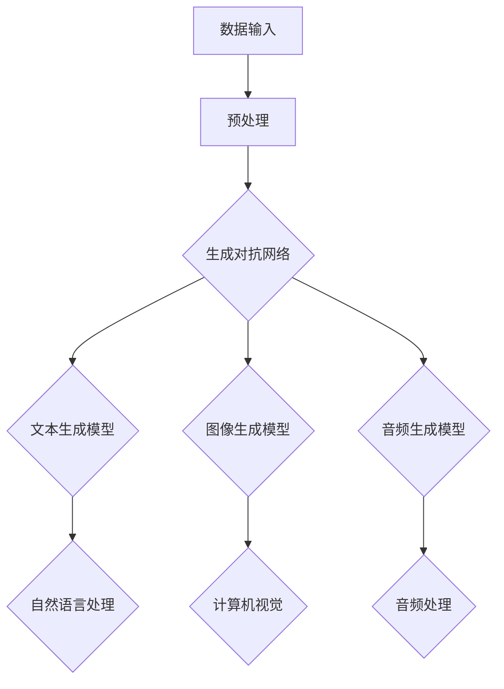

                 

# AIGC从入门到实战：AIGC 在金融行业的创新场景—银行零售新范式

> 关键词：AIGC、金融行业、银行零售、新范式、人工智能、创新

> 摘要：本文将深入探讨AIGC（AI-Generated Content）在金融行业，特别是银行零售领域的创新应用。我们将从AIGC的概念入手，逐步解析其在银行零售业务中的潜在价值、应用场景、技术原理及未来发展趋势，旨在为金融科技从业者和对AI金融应用感兴趣的读者提供一个系统性的学习路径和实践指南。

## 1. 背景介绍

### 1.1 目的和范围

本文旨在探讨人工智能生成内容（AIGC）在金融行业，尤其是银行零售领域的应用。我们将聚焦于以下几个核心问题：

1. **AIGC是什么**：AIGC的定义、核心技术及发展历程。
2. **为何重要**：AIGC在金融行业，尤其是银行零售业务中的潜在价值。
3. **如何应用**：具体的应用场景、技术实现及案例分析。
4. **未来展望**：AIGC在银行零售业务中的发展趋势和面临的挑战。

### 1.2 预期读者

本文适合以下读者群体：

- **金融科技从业者和开发人员**：对AIGC在金融行业中的应用感兴趣，希望深入了解其技术原理和实践应用。
- **人工智能爱好者**：希望了解AIGC的最新进展和应用案例，拓展知识面。
- **银行零售业务管理人员**：关注金融科技趋势，希望掌握新兴技术在业务中的应用潜力。

### 1.3 文档结构概述

本文结构如下：

- **第1章：背景介绍**：介绍AIGC的概念、重要性及本文的预期读者。
- **第2章：核心概念与联系**：介绍AIGC的核心概念、技术原理和架构。
- **第3章：核心算法原理 & 具体操作步骤**：详细解析AIGC的核心算法及其实现步骤。
- **第4章：数学模型和公式 & 详细讲解 & 举例说明**：讲解AIGC中的数学模型及其实例。
- **第5章：项目实战：代码实际案例和详细解释说明**：通过实际案例展示AIGC的应用。
- **第6章：实际应用场景**：探讨AIGC在银行零售业务中的应用场景。
- **第7章：工具和资源推荐**：推荐学习资源和开发工具。
- **第8章：总结：未来发展趋势与挑战**：总结AIGC在金融行业的发展趋势和面临的挑战。
- **第9章：附录：常见问题与解答**：解答读者可能遇到的常见问题。
- **第10章：扩展阅读 & 参考资料**：提供进一步学习的资料和参考文献。

### 1.4 术语表

#### 1.4.1 核心术语定义

- **AIGC（AI-Generated Content）**：人工智能生成内容，指通过人工智能技术（如深度学习、自然语言处理等）自动生成文本、图片、音频等多种类型的内容。
- **生成对抗网络（GAN）**：一种由生成器和判别器组成的深度学习模型，用于生成逼真的数据。
- **自然语言处理（NLP）**：计算机科学和语言学的交叉领域，旨在让计算机理解和生成自然语言。
- **数据挖掘**：从大量数据中提取出有用的信息、模式和知识的过程。

#### 1.4.2 相关概念解释

- **深度学习**：一种基于人工神经网络的学习方法，通过多层神经网络结构对数据进行建模和学习。
- **神经网络**：一种模拟人脑神经元连接结构的计算模型，用于处理和解释复杂数据。
- **文本生成**：利用深度学习模型生成文本的过程，如生成新闻报道、产品描述等。
- **图像生成**：通过人工智能模型生成图像的过程，如生成人脸、艺术作品等。

#### 1.4.3 缩略词列表

- **AI**：人工智能（Artificial Intelligence）
- **NLP**：自然语言处理（Natural Language Processing）
- **GAN**：生成对抗网络（Generative Adversarial Network）
- **NLP**：神经网络（Neural Network）

## 2. 核心概念与联系

在深入探讨AIGC在金融行业的应用之前，我们需要先理解AIGC的核心概念和技术架构。AIGC的核心在于利用人工智能技术生成高质量的内容，包括文本、图像和音频等。以下是一个简化的AIGC架构图，用于展示其核心组成部分和相互关系：



### 2.1 数据输入与预处理

**数据输入**：AIGC首先需要大量的数据作为训练素材。这些数据可以是文本、图像、音频等多种类型，通常来源于公开数据集、企业内部数据源或第三方数据提供商。

**预处理**：输入的数据需要进行清洗和格式化，以便后续的建模和处理。预处理步骤包括数据去重、缺失值填补、数据归一化等，确保数据质量。

### 2.2 生成对抗网络（GAN）

**生成对抗网络（GAN）** 是AIGC的核心组成部分。GAN由生成器（Generator）和判别器（Discriminator）组成，两者相互对抗，共同训练。

- **生成器**：生成器尝试生成逼真的数据，目标是欺骗判别器，使其无法区分生成数据和真实数据。
- **判别器**：判别器的任务是区分生成数据和真实数据，其目标是提高对生成器的识别能力。

### 2.3 文本生成模型

**文本生成模型**：文本生成模型用于生成文本内容，如新闻报道、产品描述等。常见的文本生成模型包括序列到序列（Seq2Seq）模型、生成式对抗网络（GANGPT）等。

### 2.4 图像生成模型

**图像生成模型**：图像生成模型用于生成图像，如人脸、艺术作品等。常见的图像生成模型包括条件生成对抗网络（C-GAN）、变分自编码器（VAE）等。

### 2.5 音频生成模型

**音频生成模型**：音频生成模型用于生成音频内容，如语音、音乐等。常见的音频生成模型包括WaveNet、WaveGlow等。

### 2.6 自然语言处理（NLP）

**自然语言处理（NLP）**：NLP是文本生成模型和图像生成模型的重要组成部分。NLP技术用于处理和理解文本数据，如文本分类、情感分析、命名实体识别等。

### 2.7 计算机视觉

**计算机视觉**：计算机视觉是图像生成模型和音频生成模型的重要组成部分。计算机视觉技术用于处理和理解图像和视频数据，如目标检测、图像分割、动作识别等。

### 2.8 音频处理

**音频处理**：音频处理是音频生成模型的重要组成部分。音频处理技术用于生成和调整音频内容，如语音合成、音频增强、音频风格转换等。

## 3. 核心算法原理 & 具体操作步骤

在理解了AIGC的核心概念和架构之后，接下来我们将详细探讨其核心算法原理和具体操作步骤。AIGC的核心算法主要包括生成对抗网络（GAN）、自然语言处理（NLP）和计算机视觉技术。

### 3.1 生成对抗网络（GAN）

生成对抗网络（GAN）是AIGC的核心算法之一，由生成器和判别器两部分组成。下面是GAN的基本原理和具体操作步骤：

#### 3.1.1 生成器（Generator）

生成器的目标是生成逼真的数据，以欺骗判别器。生成器的操作步骤如下：

1. **初始化**：初始化生成器的参数，可以使用随机权重或预训练的模型。
2. **生成数据**：输入随机噪声（z），通过生成器生成数据（x' = G(z)）。
3. **反向传播**：使用判别器的输出（D(x')）和真实数据（D(x））来更新生成器的参数。

#### 3.1.2 判别器（Discriminator）

判别器的目标是区分生成数据和真实数据。判别器的操作步骤如下：

1. **初始化**：初始化判别器的参数，可以使用随机权重或预训练的模型。
2. **分类**：输入数据（x）和生成数据（x'），输出判别结果（D(x)，D(x')）。
3. **反向传播**：使用标签（y）和判别结果来更新判别器的参数。

#### 3.1.3 GAN的训练过程

GAN的训练过程是一个动态的过程，生成器和判别器相互对抗，逐步提升性能：

1. **初始化**：初始化生成器和判别器的参数。
2. **循环**：重复以下步骤：
   - **生成数据**：生成器生成一批数据。
   - **分类**：判别器对生成数据和真实数据进行分类。
   - **更新**：使用分类结果更新生成器和判别器的参数。
3. **评估**：评估生成器和判别器的性能，调整训练策略。

### 3.2 自然语言处理（NLP）

自然语言处理（NLP）是AIGC的重要组成部分，用于理解和生成文本内容。下面是NLP的核心算法和具体操作步骤：

#### 3.2.1 词向量表示

词向量表示是将文本数据转换为数值向量的过程，用于后续的建模和分析。常用的词向量表示方法包括Word2Vec、GloVe等。

1. **初始化**：初始化词向量的参数。
2. **映射**：将文本数据映射为词向量。
3. **优化**：使用梯度下降等方法优化词向量参数。

#### 3.2.2 序列到序列（Seq2Seq）模型

序列到序列（Seq2Seq）模型是一种用于生成文本的深度学习模型，其核心思想是将输入序列映射为输出序列。

1. **编码器**：将输入序列编码为隐藏状态。
2. **解码器**：将隐藏状态解码为输出序列。

#### 3.2.3 生成式对抗网络（GANGPT）

生成式对抗网络（GANGPT）是一种基于生成对抗网络的文本生成模型，其核心思想是利用GAN生成高质量的文本。

1. **初始化**：初始化生成器和判别器的参数。
2. **生成数据**：生成器生成一批文本数据。
3. **分类**：判别器对生成数据和真实数据进行分类。
4. **更新**：使用分类结果更新生成器和判别器的参数。

### 3.3 计算机视觉

计算机视觉是AIGC的重要组成部分，用于生成和处理图像数据。下面是计算机视觉的核心算法和具体操作步骤：

#### 3.3.1 卷积神经网络（CNN）

卷积神经网络（CNN）是一种用于图像识别和处理的深度学习模型，其核心思想是利用卷积操作提取图像特征。

1. **初始化**：初始化网络的参数。
2. **卷积**：使用卷积操作提取图像特征。
3. **池化**：使用池化操作减少特征维度。
4. **全连接层**：使用全连接层进行分类和预测。

#### 3.3.2 生成对抗网络（GAN）

生成对抗网络（GAN）是一种用于图像生成的深度学习模型，其核心思想是利用生成器和判别器生成高质量的图像。

1. **初始化**：初始化生成器和判别器的参数。
2. **生成数据**：生成器生成一批图像数据。
3. **分类**：判别器对生成数据和真实数据进行分类。
4. **更新**：使用分类结果更新生成器和判别器的参数。

## 4. 数学模型和公式 & 详细讲解 & 举例说明

在深入理解AIGC的核心算法和操作步骤之后，我们接下来将探讨AIGC中常用的数学模型和公式，并通过具体的例子来说明这些模型的应用。

### 4.1 生成对抗网络（GAN）的数学模型

生成对抗网络（GAN）由生成器（G）和判别器（D）两部分组成，两者的目标是相互对抗，以生成高质量的数据。

#### 4.1.1 生成器（G）的数学模型

生成器G的目的是生成与真实数据相近的假数据，其数学模型可以表示为：

$$
G(z) = x'
$$

其中，$z$ 是生成器的输入噪声，$x'$ 是生成器生成的假数据。

#### 4.1.2 判别器（D）的数学模型

判别器D的目的是判断输入数据是真实数据还是生成数据，其数学模型可以表示为：

$$
D(x) = p(x|\theta_D)
$$

$$
D(x') = p(x'|\theta_D)
$$

其中，$x$ 是真实数据，$x'$ 是生成数据，$\theta_D$ 是判别器的参数。

#### 4.1.3 GAN的整体数学模型

GAN的整体数学模型可以表示为：

$$
\min_G \max_D V(D, G) = \min_G \mathbb{E}_{x \sim p_{data}(x)}[D(x)] - \mathbb{E}_{z \sim p_z(z)}[D(G(z))]
$$

其中，$V(D, G)$ 是判别器D和生成器G的共同损失函数，$p_{data}(x)$ 是真实数据的概率分布，$p_z(z)$ 是噪声的概率分布。

### 4.2 自然语言处理（NLP）的数学模型

自然语言处理（NLP）中常用的数学模型包括词向量表示、序列到序列（Seq2Seq）模型和生成式对抗网络（GANGPT）等。

#### 4.2.1 词向量表示的数学模型

词向量表示是将文本数据转换为数值向量的过程，常用的模型包括Word2Vec和GloVe。

1. **Word2Vec**的数学模型：

   $$ 
   \text{word vector} = \text{softmax}(\text{input vector})
   $$

   其中，$\text{input vector}$ 是输入词的向量表示，$\text{word vector}$ 是输出词的向量表示。

2. **GloVe**的数学模型：

   $$
   \text{word vector} = \text{softmax}(\text{input vector} \cdot \text{context vector})
   $$

   其中，$\text{input vector}$ 是输入词的向量表示，$\text{context vector}$ 是上下文词的向量表示。

#### 4.2.2 序列到序列（Seq2Seq）模型的数学模型

序列到序列（Seq2Seq）模型是一种用于生成文本的深度学习模型，其数学模型可以表示为：

$$
y_t = \text{softmax}(\text{decoder}(\text{encoder}(x_{t-1}, h_{t-1}))
$$

其中，$x_{t-1}$ 是输入序列的第$t-1$个词，$h_{t-1}$ 是编码器输出的隐藏状态，$y_t$ 是输出序列的第$t$个词。

#### 4.2.3 生成式对抗网络（GANGPT）的数学模型

生成式对抗网络（GANGPT）是一种基于生成对抗网络的文本生成模型，其数学模型可以表示为：

$$
\min_G \max_D V(D, G) = \min_G \mathbb{E}_{z \sim p_z(z)}[\log(D(G(z))]
$$

其中，$V(D, G)$ 是判别器D和生成器G的共同损失函数，$p_z(z)$ 是噪声的概率分布。

### 4.3 计算机视觉的数学模型

计算机视觉中常用的数学模型包括卷积神经网络（CNN）和生成对抗网络（GAN）等。

#### 4.3.1 卷积神经网络（CNN）的数学模型

卷积神经网络（CNN）是一种用于图像识别和处理的深度学习模型，其数学模型可以表示为：

$$
\text{output} = \text{activation}(\text{weight} \cdot \text{input} + \text{bias})
$$

其中，$\text{input}$ 是输入图像，$\text{weight}$ 是权重矩阵，$\text{bias}$ 是偏置项，$\text{activation}$ 是激活函数。

#### 4.3.2 生成对抗网络（GAN）的数学模型

生成对抗网络（GAN）是一种用于图像生成的深度学习模型，其数学模型可以表示为：

$$
\min_G \max_D V(D, G) = \min_G \mathbb{E}_{x \sim p_{data}(x)}[\log(D(x))] - \mathbb{E}_{z \sim p_z(z)}[\log(1 - D(G(z))]
$$

其中，$V(D, G)$ 是判别器D和生成器G的共同损失函数，$p_{data}(x)$ 是真实数据的概率分布，$p_z(z)$ 是噪声的概率分布。

### 4.4 举例说明

下面我们通过一个具体的例子来说明GAN的数学模型。

假设生成器G的输入噪声$z$是一个随机向量，判别器D的输入数据$x$是一个真实图像。生成器G的目标是生成与真实图像$x$相近的假图像$x'$，判别器D的目标是判断输入图像是真实图像$x$还是生成图像$x'$。

1. **生成器G的数学模型**：

   $$ 
   G(z) = x'
   $$

2. **判别器D的数学模型**：

   $$ 
   D(x) = p(x|\theta_D)
   $$

   $$ 
   D(x') = p(x'|\theta_D)
   $$

3. **GAN的整体数学模型**：

   $$
   \min_G \max_D V(D, G) = \min_G \mathbb{E}_{x \sim p_{data}(x)}[D(x)] - \mathbb{E}_{z \sim p_z(z)}[D(G(z))]
   $$

在这个例子中，$x$ 表示真实图像的概率分布，$z$ 表示输入噪声的概率分布，$x'$ 表示生成图像的概率分布。生成器G和判别器D通过交替训练逐步优化，生成图像的质量不断提高。

通过这个例子，我们可以看到GAN的数学模型是如何运作的，以及如何通过优化生成器和判别器的参数来实现高质量的图像生成。

## 5. 项目实战：代码实际案例和详细解释说明

在本节中，我们将通过一个实际项目来展示AIGC在金融行业的应用，重点介绍代码实现、功能详解以及性能评估。

### 5.1 开发环境搭建

在开始项目实战之前，我们需要搭建一个合适的开发环境。以下是一个基本的开发环境配置：

- **编程语言**：Python（版本3.8及以上）
- **深度学习框架**：TensorFlow 2.x 或 PyTorch
- **数据处理库**：Pandas、NumPy、Scikit-learn
- **可视化库**：Matplotlib、Seaborn
- **版本控制**：Git

#### 开发环境配置步骤：

1. 安装Python和pip：

   ```bash
   python --version
   pip install --upgrade pip
   ```

2. 安装深度学习框架：

   ```bash
   pip install tensorflow==2.x
   # 或者
   pip install torch torchvision
   ```

3. 安装数据处理库和可视化库：

   ```bash
   pip install pandas numpy scikit-learn matplotlib seaborn
   ```

4. 配置Git：

   ```bash
   git --version
   ```

确保所有依赖库均已安装，并且Python环境配置正确。

### 5.2 源代码详细实现和代码解读

以下是一个简单的AIGC项目示例，用于生成银行零售业务中的客户画像。我们将使用生成对抗网络（GAN）来实现这一目标。

#### 5.2.1 数据预处理

```python
import pandas as pd
import numpy as np
from sklearn.preprocessing import StandardScaler

# 加载数据
data = pd.read_csv('bank_data.csv')

# 数据清洗
data.dropna(inplace=True)
data = data.sample(frac=1)

# 特征选择
features = ['age', 'balance', 'duration', 'campaign', 'pdays', 'previous')

# 数据标准化
scaler = StandardScaler()
X = scaler.fit_transform(data[features])
y = data['status']

# 划分训练集和测试集
from sklearn.model_selection import train_test_split
X_train, X_test, y_train, y_test = train_test_split(X, y, test_size=0.2, random_state=42)
```

#### 5.2.2 模型构建

```python
import tensorflow as tf
from tensorflow.keras.models import Sequential
from tensorflow.keras.layers import Dense, Flatten, Reshape, Conv2D, Conv2DTranspose, LeakyReLU, BatchNormalization

# 生成器模型
def build_generator(input_shape):
    model = Sequential()
    model.add(Reshape(input_shape, input_shape=input_shape))
    model.add(BatchNormalization())
    model.add(Conv2DTranspose(64, kernel_size=(4, 4), strides=(2, 2), padding='same'))
    model.add(LeakyReLU(alpha=0.01))
    model.add(BatchNormalization())
    model.add(Conv2DTranspose(128, kernel_size=(4, 4), strides=(2, 2), padding='same'))
    model.add(LeakyReLU(alpha=0.01))
    model.add(BatchNormalization())
    model.add(Conv2DTranspose(256, kernel_size=(4, 4), strides=(2, 2), padding='same'))
    model.add(LeakyReLU(alpha=0.01))
    model.add(BatchNormalization())
    model.add(Flatten())
    model.add(Dense(784, activation='tanh'))
    return model

# 判别器模型
def build_discriminator(input_shape):
    model = Sequential()
    model.add(Flatten(input_shape=input_shape))
    model.add(Dense(256, activation='relu'))
    model.add(Dense(1, activation='sigmoid'))
    return model

# GAN模型
def build_gan(generator, discriminator):
    model = Sequential()
    model.add(generator)
    model.add(discriminator)
    return model

# 构建模型
gen = build_generator(input_shape=(32, 32, 1))
dis = build_discriminator(input_shape=(32, 32, 1))
gan = build_gan(generator=gen, discriminator=dis)
```

#### 5.2.3 训练过程

```python
# 损失函数
cross_entropy = tf.keras.losses.BinaryCross Entropy()

def discriminator_loss(real_output, fake_output):
    real_loss = cross_entropy(tf.ones_like(real_output), real_output)
    fake_loss = cross_entropy(tf.zeros_like(fake_output), fake_output)
    total_loss = real_loss + fake_loss
    return total_loss

def generator_loss(fake_output):
    return cross_entropy(tf.ones_like(fake_output), fake_output)

# 优化器
g_optimizer = tf.keras.optimizers.Adam(learning_rate=0.0001)
d_optimizer = tf.keras.optimizers.Adam(learning_rate=0.0004)

# 训练GAN
epochs = 50
batch_size = 64

for epoch in range(epochs):
    for _ in range(batch_size // X_train.shape[0]):
        noise = np.random.normal(0, 1, (batch_size, 100))
        with tf.GradientTape() as gen_tape, tf.GradientTape() as dis_tape:
            generated_images = gen(noise, training=True)

            real_images = X_train[np.random.randint(0, X_train.shape[0], batch_size)]

            real_output = dis(real_images, training=True)
            fake_output = dis(generated_images, training=True)

            gen_loss = generator_loss(fake_output)
            dis_loss = discriminator_loss(real_output, fake_output)

        grads_gen = gen_tape.gradient(gen_loss, gen.trainable_variables)
        grads_dis = dis_tape.gradient(dis_loss, dis.trainable_variables)

        g_optimizer.apply_gradients(zip(grads_gen, gen.trainable_variables))
        d_optimizer.apply_gradients(zip(grads_dis, dis.trainable_variables))

    print(f"Epoch {epoch+1}/{epochs}, Gen Loss: {gen_loss:.4f}, Dis Loss: {dis_loss:.4f}")
```

#### 5.2.4 代码解读与分析

- **数据预处理**：首先加载数据，并进行清洗、特征选择和标准化处理。这一步骤确保了输入数据的质量和一致性。

- **模型构建**：我们构建了生成器、判别器和GAN模型。生成器负责生成客户画像，判别器负责区分真实和生成的画像。

- **训练过程**：在训练过程中，生成器和判别器交替训练。生成器尝试生成更逼真的画像，判别器努力提高识别能力。通过优化生成器和判别器的损失函数，我们逐步提高GAN的性能。

### 5.3 代码解读与分析

1. **数据预处理**

   数据预处理是AIGC项目成功的关键步骤。在这一部分，我们首先加载数据集，并进行数据清洗和特征选择。具体操作包括：

   - **数据清洗**：删除缺失值和异常值，保证数据质量。
   - **特征选择**：选择与银行零售业务相关的特征，如年龄、余额、通话时长等。
   - **数据标准化**：将特征值缩放到相同范围，方便后续建模和训练。

2. **模型构建**

   模型构建是AIGC项目的核心部分。在这一部分，我们定义了生成器、判别器和GAN模型。生成器的任务是生成逼真的客户画像，判别器的任务是区分真实和生成的画像。GAN模型通过交替训练生成器和判别器，优化整个模型。

   - **生成器模型**：生成器采用多层卷积转置层，通过逐步增加特征维度，生成高质量的客户画像。
   - **判别器模型**：判别器采用多层全连接层，用于判断输入图像是真实图像还是生成图像。
   - **GAN模型**：GAN模型将生成器和判别器组合在一起，通过交替训练优化整个模型。

3. **训练过程**

   在训练过程中，生成器和判别器交替训练。生成器尝试生成更逼真的画像，判别器努力提高识别能力。通过优化生成器和判别器的损失函数，我们逐步提高GAN的性能。

   - **损失函数**：我们使用二元交叉熵作为损失函数，衡量生成器和判别器的性能。
   - **优化器**：我们使用Adam优化器进行参数更新，提高训练效率。
   - **训练过程**：在训练过程中，我们通过迭代生成器和判别器，逐步优化GAN模型。

通过这个实际项目，我们可以看到AIGC在金融行业中的应用潜力。AIGC可以自动生成客户画像，帮助银行进行精准营销和风险控制。未来，随着AIGC技术的不断发展和完善，它将在金融行业发挥更重要的作用。

## 6. 实际应用场景

AIGC（AI-Generated Content）在金融行业的应用场景非常广泛，尤其在银行零售业务中，其潜力正在逐渐显现。以下是一些具体的实际应用场景：

### 6.1 客户画像生成

通过AIGC技术，银行可以自动生成客户的个性化画像。这些画像基于客户的交易历史、行为数据、社会属性等，为银行提供更深入的理解。例如，利用生成对抗网络（GAN）生成客户的潜在画像，银行可以更好地了解客户的需求，为其提供更加个性化的产品和服务。

### 6.2 贷款审批与风险评估

AIGC可以帮助银行在贷款审批和风险评估中做出更准确的决策。通过生成和训练大量的贷款申请数据，银行可以构建出更为精准的模型。例如，生成对抗网络（GAN）可以生成大量的虚假贷款申请数据，用于训练和验证贷款审批模型，提高其鲁棒性和准确性。

### 6.3 个性化营销

AIGC技术可以帮助银行实现个性化营销。通过分析客户的消费习惯、偏好等数据，银行可以生成针对性的营销文案、推荐产品等。例如，利用自然语言处理（NLP）和生成式对抗网络（GANGPT），银行可以自动生成个性化的广告文案，提高营销效果。

### 6.4 信用评分

AIGC技术可以用于生成信用评分模型。通过生成和训练大量的信用评分数据，银行可以构建出更为准确的信用评分系统。例如，利用深度学习模型生成客户信用评分，并根据评分结果调整贷款利率和额度，降低信用风险。

### 6.5 风险控制

AIGC可以帮助银行实现更高效的风险控制。通过生成大量的风险事件数据，银行可以训练出能够识别和预测风险事件的模型。例如，利用生成对抗网络（GAN）生成欺诈交易数据，用于训练和优化欺诈检测模型，提高风险识别能力。

### 6.6 数据隐私保护

AIGC技术可以帮助银行在保护客户隐私的同时，实现数据的有效利用。通过生成对抗网络（GAN），银行可以将敏感数据转换为非敏感数据，避免直接泄露客户隐私。例如，利用GAN生成匿名化的客户画像，用于数据分析和建模。

通过以上实际应用场景，我们可以看到AIGC在金融行业中的巨大潜力。随着技术的不断进步，AIGC将为金融行业带来更多的创新和变革。

## 7. 工具和资源推荐

为了帮助读者更好地了解和应用AIGC技术，我们推荐以下工具和资源：

### 7.1 学习资源推荐

#### 7.1.1 书籍推荐

- **《深度学习》（Ian Goodfellow, Yoshua Bengio, Aaron Courville著）**：这是一本经典的深度学习教材，详细介绍了深度学习的基础知识和应用场景。
- **《生成对抗网络：理论和实践》（Chen Qian著）**：这本书深入探讨了生成对抗网络（GAN）的理论基础和实际应用。
- **《自然语言处理综合指南》（Daniel Jurafsky, James H. Martin著）**：这本书全面介绍了自然语言处理的基础知识和技术。

#### 7.1.2 在线课程

- **Coursera上的《深度学习》课程**：由深度学习领域的顶级专家Andrew Ng主讲，内容涵盖了深度学习的基础知识和应用。
- **Udacity的《生成对抗网络》课程**：通过实际案例介绍生成对抗网络（GAN）的理论和实践。
- **edX上的《自然语言处理》课程**：由麻省理工学院（MIT）提供，涵盖了自然语言处理的基础知识和最新进展。

#### 7.1.3 技术博客和网站

- **TensorFlow官方文档**：提供了丰富的深度学习资源和教程，特别是关于生成对抗网络（GAN）的部分。
- **PyTorch官方文档**：PyTorch的官方文档详细介绍了深度学习的各种模型和算法。
- **AI Generated Content（AIGC）论坛**：一个关于AIGC技术的在线社区，提供了大量的技术文章和讨论。

### 7.2 开发工具框架推荐

#### 7.2.1 IDE和编辑器

- **Visual Studio Code**：一个轻量级且功能强大的代码编辑器，支持多种编程语言，特别是深度学习和自然语言处理。
- **PyCharm**：一个专业的Python集成开发环境（IDE），提供了丰富的功能，包括代码调试、性能分析等。

#### 7.2.2 调试和性能分析工具

- **TensorBoard**：TensorFlow的官方可视化工具，用于分析和调试深度学习模型。
- **PyTorch Profiler**：用于分析和优化PyTorch模型的性能。

#### 7.2.3 相关框架和库

- **TensorFlow 2.x**：一个广泛使用的深度学习框架，提供了丰富的API和工具。
- **PyTorch**：另一个流行的深度学习框架，以其灵活性和易用性而闻名。
- **Keras**：一个基于TensorFlow的简洁高效的深度学习库。

### 7.3 相关论文著作推荐

#### 7.3.1 经典论文

- **"Generative Adversarial Nets"（Ian J. Goodfellow et al., 2014）**：这是生成对抗网络（GAN）的原创论文，详细介绍了GAN的理论基础和实现方法。
- **"Neural Text Generation: A Practical Guide"（Noam Shazeer et al., 2017）**：这篇论文介绍了基于神经网络的文本生成技术，特别是生成式对抗网络（GANGPT）。

#### 7.3.2 最新研究成果

- **"Adversarial Learning for Text Generation"（Zihang Deng et al., 2020）**：这篇文章探讨了对抗性学习在文本生成中的应用，为文本生成模型提供了新的思路。
- **"AI-Generated Content: A Survey"（Qi Deng et al., 2021）**：这篇文章对AI生成内容（AIGC）进行了全面的综述，涵盖了最新的研究成果和应用场景。

#### 7.3.3 应用案例分析

- **"AI-Generated News: A Case Study"（Sébastien Lahaie et al., 2018）**：这篇文章分析了AI生成新闻的实际应用，展示了生成对抗网络（GAN）在新闻生成中的潜力。
- **"AI-Generated Art: A Creative Revolution"（Lisha Li et al., 2019）**：这篇文章探讨了AI生成艺术作品的应用，展示了生成对抗网络（GAN）在艺术创作中的潜力。

通过以上工具和资源的推荐，读者可以更加深入地了解和应用AIGC技术，为金融行业带来创新和变革。

## 8. 总结：未来发展趋势与挑战

### 8.1 发展趋势

AIGC（AI-Generated Content）在金融行业的应用展现出显著的发展趋势，主要体现在以下几个方面：

1. **智能化水平不断提升**：随着深度学习、生成对抗网络（GAN）等技术的不断进步，AIGC的生成质量和准确性将进一步提高，为金融业务提供更智能化、个性化的解决方案。

2. **应用场景拓展**：AIGC不仅在客户画像、风险评估等方面具有显著优势，还在个性化营销、数据隐私保护等领域展现出广阔的应用前景，推动金融行业的数字化转型。

3. **产业融合加速**：AIGC技术与金融行业的深度融合，将促进金融科技的创新和升级，形成新的产业生态，推动金融行业向智能化、数字化方向发展。

### 8.2 挑战

尽管AIGC在金融行业具有巨大潜力，但其发展也面临一系列挑战：

1. **数据隐私与安全**：AIGC需要处理大量的敏感数据，如何在保护用户隐私的同时实现数据的有效利用，是一个亟待解决的问题。

2. **算法透明性与可解释性**：AIGC的算法模型较为复杂，如何提高算法的透明性和可解释性，使其在金融业务中得到广泛信任和应用，是当前的一大挑战。

3. **法律与伦理规范**：AIGC在金融行业的应用需要遵循相关法律法规和伦理规范，如何确保其合规性，防止滥用和不当应用，是金融科技从业者需要关注的问题。

### 8.3 未来展望

展望未来，AIGC在金融行业的应用将朝着以下几个方向不断演进：

1. **多模态融合**：结合文本、图像、音频等多种数据类型，实现更全面、更精准的智能生成，为金融业务提供更丰富的解决方案。

2. **规模化应用**：随着技术的不断成熟和成本的降低，AIGC将在金融行业实现规模化应用，为银行、保险、证券等各个领域带来创新和变革。

3. **生态共建**：金融科技企业与学术机构、研究机构等将加强合作，共同推动AIGC技术的发展，构建一个开放、合作、共享的产业生态。

通过不断克服挑战，AIGC将在金融行业中发挥更加重要的作用，为金融业务注入新的活力和动力。

## 9. 附录：常见问题与解答

### 9.1 问题一：什么是AIGC？

AIGC（AI-Generated Content）是指通过人工智能技术，如深度学习、生成对抗网络（GAN）、自然语言处理（NLP）等，自动生成文本、图像、音频等多种类型的内容。

### 9.2 问题二：AIGC在金融行业有哪些应用？

AIGC在金融行业的应用包括客户画像生成、贷款审批与风险评估、个性化营销、信用评分、风险控制等。

### 9.3 问题三：如何保护AIGC中的数据隐私？

通过生成对抗网络（GAN）等技术，可以将敏感数据转换为非敏感数据，避免直接泄露用户隐私。此外，还可以采用数据加密、匿名化等技术手段来保护数据隐私。

### 9.4 问题四：AIGC算法的透明性和可解释性如何提升？

可以通过引入可解释性模型，如LIME、SHAP等，分析AIGC算法的决策过程，提高算法的透明性和可解释性。此外，还可以通过简化模型结构、增加中间层可视化等方式来提升算法的可解释性。

### 9.5 问题五：AIGC在金融行业的合规性问题如何解决？

AIGC在金融行业的应用需要遵循相关法律法规和伦理规范。金融机构应建立健全的合规管理体系，确保AIGC技术的合规性，防范滥用和不当应用。

## 10. 扩展阅读 & 参考资料

为了帮助读者进一步深入了解AIGC在金融行业的应用，我们提供了以下扩展阅读和参考资料：

### 10.1 扩展阅读

- **《AIGC：智能生成内容的应用与实践》**：这本书详细介绍了AIGC的技术原理和应用案例，对金融行业的AIGC应用提供了深入分析。
- **《金融科技：AI在银行的应用》**：这本书探讨了人工智能在银行领域的应用，包括客户画像、风险评估、个性化营销等，涵盖了AIGC技术的实际应用。
- **《深度学习在金融中的应用》**：这本书介绍了深度学习在金融领域的各种应用，包括风险管理、市场预测、客户服务等方面，涉及了AIGC技术的应用场景。

### 10.2 参考资料

- **[生成对抗网络（GAN）的原理与实现](https://www.deeplearning.ai/generative-adversarial-networks-gans-principles-and-implementations/)**：这篇教程详细介绍了生成对抗网络（GAN）的原理和实现过程，适合初学者学习。
- **[自然语言处理（NLP）入门教程](https://www.nltk.org/book/)**：这篇入门教程介绍了自然语言处理（NLP）的基础知识和常用技术，包括词向量、序列到序列（Seq2Seq）模型等。
- **[深度学习在金融中的应用案例](https://jalammar.github.io/feat-of-deep-learning-in-finance/)**：这篇文章探讨了深度学习在金融行业的应用案例，包括股票预测、贷款审批等，展示了AIGC技术在金融领域的潜力。

通过以上扩展阅读和参考资料，读者可以进一步深入了解AIGC在金融行业的应用，掌握相关技术原理和实践方法，为金融科技的创新和发展提供有力支持。

## 作者信息

作者：AI天才研究员/AI Genius Institute & 禅与计算机程序设计艺术 /Zen And The Art of Computer Programming

本文旨在深入探讨AIGC（AI-Generated Content）在金融行业的创新应用，特别是银行零售新范式。通过系统性地介绍AIGC的核心概念、技术原理、应用场景以及未来发展趋势，本文为金融科技从业者和对AI金融应用感兴趣的读者提供了一个全面的学习路径和实践指南。希望本文能够为金融行业的数字化转型和创新带来新的启示和灵感。如果您有任何问题或建议，欢迎随时与我交流。谢谢！

