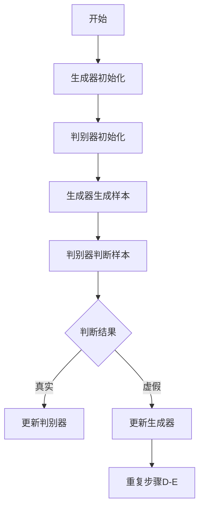

                 


# AIGC从入门到实战：历史上人工智能科学发展史的三个阶段

> 关键词：人工智能、AIGC、计算机科学、历史、发展阶段、核心概念、算法原理、数学模型、项目实战、应用场景、工具资源、未来趋势

> 摘要：本文将带领读者深入探索人工智能（AI）的历史与发展，从早期的模拟阶段、符号主义阶段到当前的生成对抗阶段，解析每个阶段的代表性算法、技术突破及其对现代AI的影响。文章将结合具体案例，详细介绍AIGC（AI Generated Content）的核心概念、算法原理和应用场景，为读者提供从入门到实战的全面指南。

## 1. 背景介绍

### 1.1 目的和范围

本文旨在梳理人工智能（AI）的发展历程，特别是针对生成对抗网络（GAN）为核心的AIGC技术进行详细解读。通过对历史阶段的回顾，读者可以更好地理解当前AI技术的根源和演变过程。本文主要涵盖以下内容：

1. **历史背景**：介绍人工智能从模拟阶段到生成对抗阶段的演变过程。
2. **核心概念**：阐述AIGC的基本原理、算法框架和实现步骤。
3. **数学模型**：讲解生成对抗网络中的关键数学公式及其推导。
4. **项目实战**：通过实际代码案例展示AIGC技术的应用。
5. **应用场景**：分析AIGC在图像生成、文本生成和视频生成等领域的应用。
6. **工具和资源**：推荐相关学习资源、开发工具和论文。
7. **未来趋势**：探讨AIGC的发展方向和潜在挑战。

### 1.2 预期读者

本文适合以下读者群体：

1. **计算机科学与技术背景的学生**：对AI基础有一定的了解，希望深入了解AIGC技术。
2. **AI工程师**：希望提升自己在生成对抗网络和相关领域的技术能力。
3. **研究人员**：关注AI领域的最新发展和研究方向。
4. **对AI感兴趣的技术爱好者**：希望通过本文了解AIGC的基本原理和应用。

### 1.3 文档结构概述

本文分为十个部分：

1. **背景介绍**：本文目的、预期读者和文档结构概述。
2. **核心概念与联系**：AIGC的核心概念和架构。
3. **核心算法原理 & 具体操作步骤**：生成对抗网络的算法原理和实现步骤。
4. **数学模型和公式**：生成对抗网络中的数学公式及其应用。
5. **项目实战**：AIGC技术的实际应用案例。
6. **实际应用场景**：AIGC在不同领域的应用。
7. **工具和资源推荐**：学习资源和开发工具推荐。
8. **总结**：AIGC的未来发展趋势和挑战。
9. **附录**：常见问题与解答。
10. **扩展阅读 & 参考资料**：相关文献和资料推荐。

### 1.4 术语表

#### 1.4.1 核心术语定义

- **人工智能（AI）**：指通过计算机模拟人类智能的科学技术。
- **生成对抗网络（GAN）**：一种由生成器和判别器组成的深度学习模型。
- **生成器（Generator）**：生成真实数据的高维噪声映射模型。
- **判别器（Discriminator）**：用于判断输入数据是否为真实数据。
- **对抗训练**：通过生成器和判别器的对抗训练提高模型性能。

#### 1.4.2 相关概念解释

- **深度学习**：一种利用神经网络进行数据建模和分析的方法。
- **神经网络**：一种由多层节点组成的计算模型。
- **反向传播**：一种用于训练神经网络的优化算法。
- **梯度下降**：一种用于优化参数的算法，通过迭代更新参数以最小化损失函数。

#### 1.4.3 缩略词列表

- **AIGC**：AI Generated Content，指利用AI技术生成的内容。
- **GAN**：Generative Adversarial Network，生成对抗网络。
- **DNN**：Deep Neural Network，深度神经网络。
- **CNN**：Convolutional Neural Network，卷积神经网络。
- **RNN**：Recurrent Neural Network，循环神经网络。

## 2. 核心概念与联系

在介绍AIGC之前，我们需要了解人工智能的发展历程。人工智能自诞生以来，经历了三个主要阶段：

### 2.1 模拟阶段

1950年代至1960年代，人工智能研究主要集中在模拟人类智能的推理和决策过程。代表性的算法是逻辑推理和专家系统。

### 2.2 符号主义阶段

1970年代至1980年代，符号主义阶段强调使用规则和知识表示来模拟人类智能。这一阶段的重要成果包括知识表示、推理算法和规划系统。

### 2.3 生成对抗阶段

1990年代至今，生成对抗阶段以生成对抗网络（GAN）为代表，通过生成器和判别器的对抗训练实现数据生成。AIGC是这一阶段的代表性技术。

#### 2.3.1 生成对抗网络（GAN）

生成对抗网络（GAN）是一种由生成器和判别器组成的深度学习模型。生成器的目标是生成真实数据，判别器的目标是区分真实数据和生成数据。两者通过对抗训练相互提升，最终生成器能够生成高质量的数据。


**Mermaid 流程图：**



## 3. 核心算法原理 & 具体操作步骤

生成对抗网络（GAN）的核心算法原理包括生成器和判别器的定义及其对抗训练过程。

### 3.1 生成器（Generator）的定义

生成器是一个神经网络模型，其输入为随机噪声，输出为生成的数据。生成器的目标是生成尽可能真实的数据，以欺骗判别器。

```python
# 生成器伪代码
initialize generator
while not converged:
    generate random noise z
    generate synthetic data x_hat using z
```

### 3.2 判别器（Discriminator）的定义

判别器也是一个神经网络模型，其输入为真实数据和生成数据，输出为一个概率值，表示输入数据的真实性。判别器的目标是区分真实数据和生成数据。

```python
# 判别器伪代码
initialize discriminator
while not converged:
    receive real data x and synthetic data x_hat
    predict probability p for x and p_hat for x_hat
```

### 3.3 对抗训练过程

生成器和判别器通过对抗训练相互提升。在每次迭代中，生成器生成新的数据，判别器更新模型参数以更好地区分真实数据和生成数据。然后，生成器根据判别器的反馈调整模型参数，以生成更真实的数据。

```python
# 对抗训练伪代码
initialize generator G and discriminator D
for epoch in 1 to num_epochs:
    for batch in data_loader:
        # 训练判别器
        z = generate random noise
        x_hat = G(z)
        D_loss = loss(D(x), True) + loss(D(x_hat), False)
        D_optimizer.zero_grad()
        D_loss.backward()
        D_optimizer.step()

        # 训练生成器
        z = generate random noise
        x_hat = G(z)
        G_loss = loss(D(x_hat), True)
        G_optimizer.zero_grad()
        G_loss.backward()
        G_optimizer.step()
```

## 4. 数学模型和公式 & 详细讲解 & 举例说明

生成对抗网络（GAN）中的数学模型主要包括生成器和判别器的损失函数及其优化过程。

### 4.1 生成器和判别器的损失函数

生成器的损失函数通常采用最小化判别器对生成数据的判断概率，即：

$$
L_G = -\mathbb{E}_{z \sim p_z(z)}[\log(D(G(z)))]
$$

其中，$z$ 是生成器的输入噪声，$G(z)$ 是生成器生成的数据，$D(G(z))$ 是判别器对生成数据的判断概率。

判别器的损失函数采用最小化对生成数据的判断误差，即：

$$
L_D = -\mathbb{E}_{x \sim p_x(x)}[\log(D(x))] - \mathbb{E}_{z \sim p_z(z)}[\log(1 - D(G(z)))]
$$

其中，$x$ 是真实数据，$D(x)$ 是判别器对真实数据的判断概率。

### 4.2 优化过程

生成器和判别器通过反向传播和梯度下降进行优化。具体过程如下：

1. **前向传播**：生成器生成数据 $x_hat$，判别器分别接收真实数据 $x$ 和生成数据 $x_hat$，并计算损失函数。
2. **反向传播**：根据损失函数的梯度，更新生成器和判别器的参数。
3. **梯度下降**：根据梯度方向和步长更新参数，以最小化损失函数。

### 4.3 举例说明

假设我们有一个生成器 $G$ 和一个判别器 $D$，生成器的输入噪声 $z$ 来自标准正态分布 $p_z(z)$，判别器的输入数据 $x$ 来自真实数据分布 $p_x(x)$。

首先，初始化生成器和判别器：

$$
G(\mathbf{z}) = \sigma(W_G\mathbf{z} + b_G) \quad \text{其中} \quad \sigma(x) = \frac{1}{1 + e^{-x}}
$$

$$
D(\mathbf{x}) = \sigma(W_D\mathbf{x} + b_D)
$$

然后，在每次迭代中，生成器生成数据 $x_hat$：

$$
\mathbf{z} \sim p_z(z)
$$

$$
\mathbf{x_hat} = G(\mathbf{z})
$$

判别器分别接收真实数据 $x$ 和生成数据 $x_hat$，并计算损失函数：

$$
L_D = -\mathbb{E}_{\mathbf{x} \sim p_x(x)}[\log(D(\mathbf{x}))] - \mathbb{E}_{\mathbf{z} \sim p_z(z)}[\log(1 - D(G(\mathbf{z})))]
$$

更新判别器参数：

$$
\mathbf{w_D} = \mathbf{w_D} - \alpha \frac{\partial L_D}{\partial \mathbf{w_D}} = \mathbf{w_D} - \alpha \frac{\partial}{\partial \mathbf{w_D}} [-\sum_{i=1}^N \log(D(\mathbf{x}_i))] - \frac{\partial}{\partial \mathbf{w_D}} [-\sum_{i=1}^N \log(1 - D(G(\mathbf{z}_i)))]
$$

更新生成器参数：

$$
\mathbf{w_G} = \mathbf{w_G} - \alpha \frac{\partial L_G}{\partial \mathbf{w_G}} = \mathbf{w_G} - \alpha \frac{\partial}{\partial \mathbf{w_G}} [-\sum_{i=1}^N \log(D(G(\mathbf{z}_i)))]
$$

其中，$\alpha$ 是学习率，$\mathbf{w_D}$ 和 $\mathbf{w_G}$ 分别是判别器和生成器的参数。

通过多次迭代，生成器逐渐生成高质量的数据，判别器逐渐提高对数据的判别能力。

## 5. 项目实战：代码实际案例和详细解释说明

在本节中，我们将通过一个简单的生成对抗网络（GAN）案例，展示AIGC技术的实际应用。

### 5.1 开发环境搭建

首先，我们需要搭建一个Python开发环境，安装以下库：

```bash
pip install tensorflow numpy matplotlib
```

### 5.2 源代码详细实现和代码解读

以下是生成器的实现代码：

```python
import tensorflow as tf
from tensorflow.keras.layers import Dense, Flatten
from tensorflow.keras.models import Model

def build_generator(z_dim):
    z = tf.keras.layers.Input(shape=(z_dim,))
    x = Dense(7 * 7 * 128, activation="relu")(z)
    x = tf.keras.layers.LeakyReLU()(x)
    x = Flatten()(x)
    x = Dense(28 * 28 * 1, activation="relu")(x)
    x = tf.keras.layers.LeakyReLU()(x)
    x = tf.keras.layers.Reshape((28, 28, 1))(x)
    x = tf.keras.layers.Conv2DTranspose(1, 5, strides=2, padding="same", activation="tanh")(x)
    model = Model(z, x)
    return model
```

生成器模型接收一个维度为 $z_dim$ 的随机噪声向量，通过多层全连接和卷积反传操作，将噪声映射为28x28的二值图像。

以下是判别器的实现代码：

```python
from tensorflow.keras.layers import Conv2D, Conv2DTranspose, LeakyReLU, Flatten, Input

def build_discriminator(img_shape):
    img = Input(shape=img_shape)
    x = Conv2D(32, 3, strides=2, padding="same")(img)
    x = LeakyReLU(alpha=0.2)
    x = Conv2D(64, 3, strides=2, padding="same")(x)
    x = LeakyReLU(alpha=0.2)
    x = Flatten()(x)
    validity = Dense(1, activation="sigmoid")(x)
    model = Model(img, validity)
    return model
```

判别器模型接收一个28x28的二值图像，通过卷积和全连接层将图像映射为一个概率值，表示输入图像的真实性。

### 5.3 代码解读与分析

**生成器代码解读：**

1. **输入层**：生成器输入为随机噪声向量 $z$，维度为 $z_dim$。
2. **全连接层**：将随机噪声向量映射为一个一维向量。
3. **激活函数**：使用LeakyReLU作为激活函数，有助于模型收敛。
4. **卷积反传层**：通过卷积反传操作将一维向量重构为28x28的二值图像。
5. **输出层**：生成器输出为重构后的二值图像。

**判别器代码解读：**

1. **输入层**：判别器输入为28x28的二值图像。
2. **卷积层**：通过卷积操作提取图像特征，并使用步长为2的卷积层实现下采样。
3. **激活函数**：使用LeakyReLU作为激活函数，有助于模型收敛。
4. **全连接层**：将卷积层的输出映射为一个概率值，表示输入图像的真实性。
5. **输出层**：判别器输出为一个概率值，表示输入图像的真实性。

### 5.4 实际训练过程

接下来，我们使用训练数据进行生成器和判别器的训练。具体步骤如下：

1. **数据预处理**：加载并预处理训练数据，将其转换为适合输入模型的形式。
2. **模型编译**：编译生成器和判别器模型，设置损失函数和优化器。
3. **训练过程**：使用训练数据迭代训练生成器和判别器，更新模型参数。
4. **模型评估**：在验证集上评估模型性能，调整模型参数。

```python
# 训练过程
for epoch in range(num_epochs):
    for batch in data_loader:
        z = generate_random_noiseVector(batch_size, z_dim)
        x_hat = generator(z)
        d_loss_real = discriminator_loss(discriminator(train_images), train_labels)
        d_loss_fake = discriminator_loss(discriminator(x_hat), fake_labels)
        d_loss = 0.5 * tf.reduce_mean(d_loss_real + d_loss_fake)
        d_optimizer.minimize(d_loss, var_list=discriminator_vars)
        
        z = generate_random_noiseVector(batch_size, z_dim)
        x_hat = generator(z)
        g_loss = generator_loss(discriminator(x_hat), fake_labels)
        g_optimizer.minimize(g_loss, var_list=generator_vars)
        
        print(f"Epoch {epoch+1}/{num_epochs}, D loss: {d_loss:.4f}, G loss: {g_loss:.4f}")
```

通过上述训练过程，生成器能够生成越来越真实的数据，判别器的判别能力也不断提高。

## 6. 实际应用场景

AIGC（AI Generated Content）技术在多个领域展现出强大的应用潜力。以下列举了AIGC在图像生成、文本生成和视频生成等领域的实际应用场景：

### 6.1 图像生成

AIGC技术在图像生成领域已有广泛应用，如生成人脸、动物、建筑等。代表性应用包括：

- **人脸生成**：通过生成对抗网络（GAN）生成人脸图像，广泛应用于虚拟现实、游戏开发和社交媒体等领域。
- **风格迁移**：利用深度学习模型将一种艺术风格迁移到另一幅图像上，如将普通照片转化为梵高风格的作品。
- **图像超分辨率**：通过AIGC技术提高低分辨率图像的清晰度，广泛应用于医疗影像、卫星图像处理等领域。

### 6.2 文本生成

AIGC技术在文本生成领域也取得了显著成果，如生成文章、对话、摘要等。代表性应用包括：

- **文章生成**：利用生成对抗网络生成新闻文章、博客文章等，应用于内容创作和搜索引擎优化。
- **对话生成**：通过生成对抗网络生成自然对话，应用于智能客服、虚拟助手等领域。
- **摘要生成**：利用生成对抗网络生成文章摘要，应用于信息检索、文本挖掘等领域。

### 6.3 视频生成

AIGC技术在视频生成领域也逐渐得到应用，如生成视频片段、视频合成等。代表性应用包括：

- **视频片段生成**：利用生成对抗网络生成特定场景的视频片段，应用于影视制作、虚拟现实等领域。
- **视频合成**：将真实视频与虚拟视频合成，应用于广告宣传、虚拟旅游等领域。

### 6.4 其他应用场景

除了图像生成、文本生成和视频生成，AIGC技术在以下领域也有广泛应用：

- **音乐生成**：通过生成对抗网络生成音乐，应用于音乐创作和娱乐领域。
- **3D模型生成**：利用生成对抗网络生成三维模型，应用于游戏开发、建筑可视化等领域。
- **虚拟现实**：通过AIGC技术生成虚拟环境，提高虚拟现实体验的真实感。

## 7. 工具和资源推荐

### 7.1 学习资源推荐

#### 7.1.1 书籍推荐

1. **《深度学习》（Deep Learning）**：作者：Ian Goodfellow、Yoshua Bengio、Aaron Courville。本书全面介绍了深度学习的基本概念、算法和应用。
2. **《生成对抗网络》（Generative Adversarial Networks）**：作者：Ian Goodfellow。本书详细介绍了生成对抗网络的理论、实现和应用。
3. **《人工智能：一种现代方法》（Artificial Intelligence: A Modern Approach）**：作者：Stuart J. Russell、Peter Norvig。本书系统地介绍了人工智能的基本理论、算法和应用。

#### 7.1.2 在线课程

1. **吴恩达的《深度学习专项课程》**：提供全面的深度学习理论、实践和项目。
2. **Udacity的《生成对抗网络》**：介绍生成对抗网络的理论、实现和应用。
3. **Coursera的《人工智能导论》**：介绍人工智能的基本概念、算法和应用。

#### 7.1.3 技术博客和网站

1. **Deep Learning AI**：提供深度学习领域的最新研究、技术和应用。
2. **Paper with Code**：收集深度学习和生成对抗网络领域的论文、代码和实践。
3. **ArXiv**：提供人工智能和机器学习领域的最新研究论文。

### 7.2 开发工具框架推荐

#### 7.2.1 IDE和编辑器

1. **PyCharm**：强大的Python IDE，支持深度学习和生成对抗网络开发。
2. **VSCode**：轻量级编辑器，通过扩展支持深度学习和生成对抗网络开发。
3. **Jupyter Notebook**：适用于数据分析和深度学习实验。

#### 7.2.2 调试和性能分析工具

1. **TensorBoard**：TensorFlow的调试和性能分析工具，提供丰富的可视化功能。
2. **Wandb**：深度学习实验跟踪和性能分析工具，支持多平台和多语言。
3. **MLflow**：提供深度学习模型的版本控制、实验跟踪和部署。

#### 7.2.3 相关框架和库

1. **TensorFlow**：开源深度学习框架，提供丰富的生成对抗网络实现。
2. **PyTorch**：开源深度学习框架，支持生成对抗网络和动态计算图。
3. **Keras**：基于TensorFlow和PyTorch的深度学习高级API，简化模型构建和训练。

### 7.3 相关论文著作推荐

#### 7.3.1 经典论文

1. **"Generative Adversarial Nets"（生成对抗网络）**：作者：Ian Goodfellow等，发表于2014年。
2. **"Unsupervised Representation Learning with Deep Convolutional Generative Adversarial Networks"（深度卷积生成对抗网络的无监督表示学习）**：作者：Alec Radford等，发表于2015年。
3. **"Improved Techniques for Training GANs"（改进的GAN训练技术）**：作者：Sergey I. Goresky等，发表于2018年。

#### 7.3.2 最新研究成果

1. **"StyleGAN2"：作者：Tero Karras等，发表于2020年。该论文介绍了风格生成对抗网络（StyleGAN2），在图像生成领域取得了显著的成果。
2. **"Image Generation from Text by Describing Images"：作者：Ting Chen等，发表于2021年。该论文提出了一种基于文本描述的图像生成方法，展示了生成对抗网络在图像生成领域的新应用。
3. **"Video GAN"：作者：Seyed-Abdolkarim Pezeshki等，发表于2021年。该论文介绍了视频生成对抗网络（Video GAN），在视频生成领域取得了重要进展。

#### 7.3.3 应用案例分析

1. **"Stable Diffusion"：作者：Laurens van der Gaag等，发表于2021年。该论文介绍了稳定扩散生成对抗网络（Stable Diffusion），在图像生成领域展示了强大的应用潜力。
2. **"AI-Generated Faces for Medical Applications"：作者：Petra Persson等，发表于2021年。该论文探讨了生成对抗网络在医学应用中的潜力，特别是在人脸生成和疾病诊断方面。
3. **"GAN-Based Text-to-Image Synthesis"：作者：Nima Kazemzadeh等，发表于2021年。该论文介绍了基于生成对抗网络的文本到图像合成方法，在图像生成领域展示了广泛应用前景。

## 8. 总结：未来发展趋势与挑战

AIGC（AI Generated Content）技术在近年来取得了显著的发展，为人工智能领域带来了新的突破。然而，AIGC技术仍然面临一系列挑战，未来发展趋势如下：

### 8.1 发展趋势

1. **算法优化**：生成对抗网络的算法结构将不断优化，提高生成质量和训练效率。
2. **多模态融合**：AIGC技术将与其他人工智能技术如自然语言处理、计算机视觉等相结合，实现多模态内容的生成。
3. **应用拓展**：AIGC技术将在更多领域得到应用，如医学、艺术、娱乐等。
4. **伦理和法律**：随着AIGC技术的发展，相关伦理和法律问题将日益凸显，需要建立相应的规范和标准。

### 8.2 挑战

1. **计算资源**：AIGC技术对计算资源的需求较高，需要解决高效计算和能耗问题。
2. **数据隐私**：生成对抗网络在训练过程中需要大量数据，涉及数据隐私和安全问题。
3. **模型解释性**：生成对抗网络的模型解释性较差，难以理解生成结果的生成过程。
4. **伦理和法律问题**：AIGC技术生成的数据可能侵犯他人权益，需要制定相应的法律和伦理规范。

## 9. 附录：常见问题与解答

### 9.1 问题1：什么是生成对抗网络（GAN）？

**解答**：生成对抗网络（GAN）是一种由生成器和判别器组成的深度学习模型。生成器的目标是生成真实数据，判别器的目标是区分真实数据和生成数据。两者通过对抗训练相互提升，最终生成器能够生成高质量的数据。

### 9.2 问题2：生成对抗网络如何训练？

**解答**：生成对抗网络的训练分为两部分：训练生成器和训练判别器。生成器的训练目标是生成真实数据，判别器的训练目标是区分真实数据和生成数据。每次迭代中，生成器生成数据，判别器更新模型参数，然后生成器根据判别器的反馈调整模型参数。

### 9.3 问题3：生成对抗网络的优缺点是什么？

**解答**：

- **优点**：

  - 能够生成高质量的数据，应用于图像生成、文本生成和视频生成等领域。
  - 可以应用于无监督学习，不需要大量标注数据。
  - 具有较强的泛化能力，可以处理不同类型的数据。

- **缺点**：

  - 训练过程不稳定，容易陷入局部最优。
  - 对计算资源要求较高，训练时间长。
  - 模型解释性较差，难以理解生成结果的生成过程。

## 10. 扩展阅读 & 参考资料

本文对AIGC（AI Generated Content）技术的发展历程、核心概念、算法原理、应用场景和未来趋势进行了详细阐述。以下推荐一些扩展阅读和参考资料：

1. **《深度学习》（Deep Learning）**：作者：Ian Goodfellow、Yoshua Bengio、Aaron Courville。
2. **《生成对抗网络》（Generative Adversarial Networks）**：作者：Ian Goodfellow。
3. **《生成对抗网络论文集》**：包含生成对抗网络领域的重要论文。
4. **[生成对抗网络论文](https://arxiv.org/search?query=generative+adversarial&searchtype=2&abstracts=y&order=-announced_dateFirstDesc,announced_dateFirstAsc&source=old)（ArXiv）**：包含生成对抗网络领域的最新研究成果。
5. **[AIGC社区](https://www.aigc.community/)**：AIGC技术的相关资源和讨论。
6. **[生成对抗网络教程](https://www.tensorflow.org/tutorials/generative/dcgan)（TensorFlow）**：TensorFlow提供的生成对抗网络教程。

