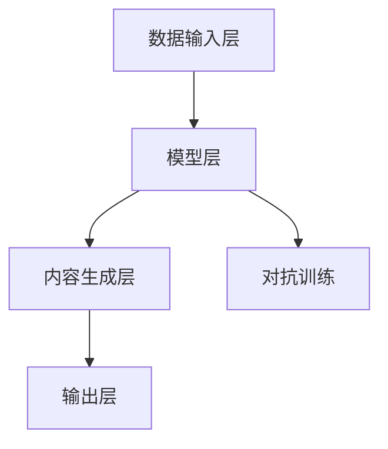

                 

# AIGC从入门到实战：基于大模型的人工智能应用的涌现和爆发

## 关键词
- 人工智能生成内容（AIGC）
- 大模型
- 应用实践
- 涌现与爆发
- 技术原理
- 项目实战

## 摘要
本文旨在深入探讨人工智能生成内容（AIGC）的发展现状与未来趋势，从入门到实战，详细解析AIGC的核心概念、算法原理、数学模型以及实际应用。通过一步步的推理分析，我们将揭示AIGC如何基于大模型实现人工智能应用的涌现和爆发，帮助读者全面掌握AIGC技术的核心要点和实战技巧。

## 1. 背景介绍

### 1.1 目的和范围
本文的目标是让读者了解和掌握人工智能生成内容（AIGC）的基本概念和原理，并通过具体的项目实战，熟悉AIGC技术的实际应用。文章将从AIGC的起源和发展历程开始，逐步深入到核心算法原理、数学模型以及实际应用场景，帮助读者建立起完整的知识体系。

### 1.2 预期读者
本文适合对人工智能和编程有一定了解的读者，尤其是希望深入了解AIGC技术的开发者和研究者。同时，对于希望了解未来人工智能发展趋势的企业管理者和技术决策者，本文也具有重要的参考价值。

### 1.3 文档结构概述
本文分为十个部分，结构如下：
1. 背景介绍：介绍本文的目的、预期读者以及文章结构。
2. 核心概念与联系：介绍AIGC的核心概念、原理和架构。
3. 核心算法原理 & 具体操作步骤：详细讲解AIGC的核心算法原理和操作步骤。
4. 数学模型和公式 & 详细讲解 & 举例说明：介绍AIGC的数学模型和公式，并举例说明。
5. 项目实战：通过实际案例，展示AIGC的应用实践。
6. 实际应用场景：分析AIGC在不同领域的应用场景。
7. 工具和资源推荐：推荐学习资源和开发工具。
8. 总结：总结AIGC的未来发展趋势与挑战。
9. 附录：常见问题与解答。
10. 扩展阅读 & 参考资料：提供进一步学习的资源。

### 1.4 术语表

#### 1.4.1 核心术语定义
- **人工智能生成内容（AIGC）**：指利用人工智能技术，自动生成文字、图像、音频等内容的系统。
- **大模型**：指具有亿级参数规模的人工智能模型，能够处理大规模数据并生成高质量的内容。
- **涌现**：指系统中的复杂行为或现象在个体之间相互作用的过程中自然产生。
- **爆发**：指某种技术或应用在短时间内迅速普及和发展的现象。

#### 1.4.2 相关概念解释
- **生成对抗网络（GAN）**：一种由生成器和判别器组成的深度学习模型，用于生成高质量的数据。
- **自然语言处理（NLP）**：研究如何让计算机理解和处理自然语言的学科。
- **计算机视觉（CV）**：研究如何让计算机理解和处理图像和视频的学科。

#### 1.4.3 缩略词列表
- **AIGC**：人工智能生成内容
- **GAN**：生成对抗网络
- **NLP**：自然语言处理
- **CV**：计算机视觉

## 2. 核心概念与联系

### 2.1 AIGC的概念

人工智能生成内容（AIGC）是一种利用人工智能技术，特别是深度学习模型，自动生成文字、图像、音频等内容的系统。它通过训练大规模的数据集，使模型能够理解和生成与人类创作相似的内容。

#### AIGC的原理

AIGC的基本原理可以概括为以下几点：

1. **数据采集与预处理**：收集大量的文本、图像、音频等数据，并进行预处理，如去除噪声、标准化等。
2. **模型训练**：使用预处理后的数据，训练深度学习模型，如生成对抗网络（GAN）、变分自编码器（VAE）等。
3. **内容生成**：模型根据训练得到的特征，生成新的内容，如文本、图像、音频等。

#### AIGC的架构

AIGC的架构主要包括以下几个部分：

1. **数据输入层**：负责接收外部输入的数据，如文本、图像、音频等。
2. **模型层**：包括生成器和判别器，生成器负责生成内容，判别器负责判断生成内容的质量。
3. **内容生成层**：根据模型层的输出，生成具体的内容，如文本、图像、音频等。
4. **输出层**：将生成的内容输出到用户界面或其他应用场景。

### 2.2 GAN的原理与架构

生成对抗网络（GAN）是AIGC中常用的一种模型，其基本原理是生成器（Generator）和判别器（Discriminator）之间的对抗训练。

#### GAN的原理

GAN的工作原理可以简单概括为：

1. **生成器（Generator）**：接收随机噪声作为输入，生成与真实数据相似的数据。
2. **判别器（Discriminator）**：接收真实数据和生成数据，判断其是否真实。
3. **对抗训练**：生成器和判别器相互对抗，生成器试图生成更真实的数据，判别器则试图准确区分真实数据和生成数据。

#### GAN的架构

GAN的架构主要包括以下几个部分：

1. **生成器（Generator）**：包括一个输入层和一个输出层，输入层接收随机噪声，输出层生成数据。
2. **判别器（Discriminator）**：包括一个输入层和一个输出层，输入层接收数据，输出层判断数据是否真实。
3. **对抗训练**：生成器和判别器交替训练，生成器根据判别器的反馈调整生成策略，判别器则不断优化对真实数据和生成数据的区分能力。

### 2.3 AIGC与其他技术的联系

AIGC与其他人工智能技术，如自然语言处理（NLP）和计算机视觉（CV）等，有着密切的联系。

1. **NLP与AIGC**：NLP是AIGC的重要组成部分，特别是在文本生成领域。NLP技术可以帮助AIGC更好地理解和生成文本。
2. **CV与AIGC**：CV技术可以帮助AIGC更好地理解和生成图像。例如，在图像生成领域，AIGC可以使用CV技术来识别和生成图像中的物体和场景。

### 2.4 Mermaid流程图

下面是AIGC的架构的Mermaid流程图：



## 3. 核心算法原理 & 具体操作步骤

### 3.1 算法原理

AIGC的核心算法是基于生成对抗网络（GAN）的。GAN由生成器和判别器两个部分组成，通过对抗训练来实现内容的生成。

#### 生成器（Generator）

生成器的输入是一个随机的噪声向量，通过一系列的全连接层和激活函数，生成与真实数据相似的数据。

#### 判别器（Discriminator）

判别器的输入是真实数据和生成数据，通过一系列的全连接层和激活函数，输出一个概率值，表示输入数据是真实数据还是生成数据。

#### 对抗训练

生成器和判别器交替训练。在每次训练中，生成器尝试生成更真实的数据，判别器则尝试更准确地判断真实数据和生成数据。通过这种对抗训练，生成器和判别器的性能都会得到提高。

### 3.2 具体操作步骤

下面是AIGC的核心算法的具体操作步骤：

1. **数据采集与预处理**：收集大量的文本、图像、音频等数据，并进行预处理，如去除噪声、标准化等。
2. **模型训练**：
   - 初始化生成器和判别器的参数。
   - 对于生成器，输入随机噪声，生成数据。
   - 对于判别器，输入真实数据和生成数据，输出概率值。
   - 根据生成器和判别器的输出，更新生成器和判别器的参数。
3. **内容生成**：使用训练好的生成器，生成新的内容，如文本、图像、音频等。
4. **输出**：将生成的内容输出到用户界面或其他应用场景。

### 3.3 伪代码

下面是AIGC的核心算法的伪代码：

```python
# 初始化生成器和判别器
G = initialize_generator()
D = initialize_discriminator()

# 模型训练
for epoch in range(num_epochs):
    for data in dataset:
        # 训练生成器
        noise = generate_noise()
        fake_data = G(noise)
        D_output_fake = D(fake_data)
        D_output_real = D(data)
        
        # 更新生成器和判别器的参数
        G_params = update_params(G_params, D_output_fake)
        D_params = update_params(D_params, D_output_real, data, fake_data)

    # 内容生成
    content = G(generate_noise())

# 输出生成的内容
output_content(content)
```

## 4. 数学模型和公式 & 详细讲解 & 举例说明

### 4.1 数学模型

AIGC的核心数学模型是基于生成对抗网络（GAN）的。GAN由生成器和判别器两个部分组成，其数学模型如下：

#### 生成器（Generator）的损失函数

$$ L_G = -\log(D(G(z))) $$

其中，$z$ 是随机噪声向量，$G(z)$ 是生成器生成的数据，$D$ 是判别器。

#### 判别器（Discriminator）的损失函数

$$ L_D = -\log(D(x)) - \log(1 - D(G(z))) $$

其中，$x$ 是真实数据，$G(z)$ 是生成器生成的数据，$D$ 是判别器。

### 4.2 详细讲解

#### 生成器（Generator）的损失函数

生成器的损失函数是期望值，表示判别器对生成数据的判断概率。损失函数越小，表示生成器的生成能力越强。

#### 判别器（Discriminator）的损失函数

判别器的损失函数是期望值，表示判别器对真实数据和生成数据的判断概率。损失函数越小，表示判别器的区分能力越强。

### 4.3 举例说明

假设生成器生成的数据为$x_1$，真实数据为$x_2$，判别器对生成数据的判断概率为$p_1$，对真实数据的判断概率为$p_2$。则生成器和判别器的损失函数可以表示为：

$$ L_G = -\log(p_1) $$

$$ L_D = -\log(p_2) - \log(1 - p_1) $$

其中，$p_1$ 和 $p_2$ 分别为判别器对生成数据和真实数据的判断概率。

## 5. 项目实战：代码实际案例和详细解释说明

### 5.1 开发环境搭建

在开始项目实战之前，我们需要搭建一个合适的开发环境。以下是一个基本的开发环境搭建步骤：

1. **安装Python**：确保已经安装了Python 3.7或更高版本。
2. **安装TensorFlow**：使用以下命令安装TensorFlow：
   ```bash
   pip install tensorflow
   ```
3. **安装Keras**：Keras是TensorFlow的高级API，使用以下命令安装：
   ```bash
   pip install keras
   ```

### 5.2 源代码详细实现和代码解读

以下是AIGC项目的一个简单示例代码，该代码使用生成对抗网络（GAN）来生成手写数字图片。

#### 5.2.1 代码实现

```python
import numpy as np
from tensorflow import keras
from tensorflow.keras.models import Model
from tensorflow.keras.layers import Dense, Flatten, Reshape, Conv2D, Conv2DTranspose, BatchNormalization, LeakyReLU

# 参数设置
noise_dim = 100
img_rows = 28
img_cols = 28
channels = 1
img_shape = (img_rows, img_cols, channels)

# 生成器的构建
inputs = keras.Input(shape=(noise_dim,))
x = Dense(128 * 7 * 7, activation="relu")(inputs)
x = Reshape((7, 7, 128))(x)
x = Conv2DTranspose(64, kernel_size=5, strides=2, padding="same")(x)
x = BatchNormalization()(x)
x = LeakyReLU(alpha=0.2)(x)
x = Conv2DTranspose(1, kernel_size=5, strides=2, padding="same", activation="tanh")(x)
outputs = Flatten()(x)
generator = Model(inputs, outputs)

# 判别器的构建
inputs = keras.Input(shape=img_shape)
x = Conv2D(32, kernel_size=3, strides=2, padding="same")(inputs)
x = LeakyReLU(alpha=0.2)(x)
x = Conv2D(64, kernel_size=3, strides=2, padding="same")(x)
x = LeakyReLU(alpha=0.2)(x)
x = Flatten()(x)
x = Dense(1, activation="sigmoid")(x)
outputs = Flatten()(x)
discriminator = Model(inputs, outputs)

# 编译模型
discriminator.compile(loss="binary_crossentropy", optimizer=keras.optimizers.Adam(0.0001), metrics=["accuracy"])
discriminator.summary()

# 生成器的编译
discriminator.trainable = False
gan_outputs = discriminator(generator(inputs))
gan = Model(inputs, gan_outputs)
gan.compile(loss="binary_crossentropy", optimizer=keras.optimizers.Adam(0.0001))
gan.summary()

# 加载MNIST数据集
(x_train, _), (_, _) = keras.datasets.mnist.load_data()
x_train = x_train.astype("float32") / 255.0
x_train = np.expand_dims(x_train, axis=3)

# 训练模型
for epoch in range(100):
    for i in range(x_train.shape[0]):
        noise = np.random.normal(0, 1, (1, noise_dim))
        real_imgs = x_train[i:i+1]
        fake_imgs = generator.predict(noise)
        x = np.concatenate([real_imgs, fake_imgs])
        y = np.concatenate([np.ones((1, 1)), np.zeros((1, 1))])
        discriminator.train_on_batch(x, y)

    noise = np.random.normal(0, 1, (1, noise_dim))
    y = np.zeros((1, 1))
    gan.train_on_batch(noise, y)

    print(f"{epoch} [D loss: {discriminator.history['loss'][-1]}, acc: {discriminator.history['accuracy'][-1]}] [G loss: {gan.history['loss'][-1]}]")

# 生成图片
noise = np.random.normal(0, 1, (100, noise_dim))
generated_images = generator.predict(noise)
generated_images = generated_images.reshape(-1, img_rows, img_cols)

import matplotlib.pyplot as plt
plt.figure(figsize=(10, 10))
for i in range(generated_images.shape[0]):
    plt.subplot(10, 10, i + 1)
    plt.imshow(generated_images[i], cmap="gray")
    plt.axis("off")
plt.show()
```

#### 5.2.2 代码解读

1. **导入库和参数设置**：首先，我们导入了必要的库和设置了参数，如噪声维度、图像大小和通道数。
2. **生成器的构建**：我们定义了一个生成器模型，它接收噪声作为输入，通过一系列的卷积层和反卷积层，最终生成手写数字图像。
3. **判别器的构建**：我们定义了一个判别器模型，它接收手写数字图像作为输入，通过卷积层，最终输出一个概率值，表示输入图像是真实的还是生成的。
4. **编译模型**：我们分别编译了判别器和生成器模型，并设置了优化器和损失函数。
5. **训练模型**：我们使用MNIST数据集训练了判别器和生成器模型。在每次训练中，我们交替更新判别器和生成器的参数，使得生成器能够生成更真实的数据，判别器能够更准确地判断真实数据和生成数据。
6. **生成图片**：最后，我们使用生成器模型生成了100个手写数字图像，并使用matplotlib库将这些图像展示出来。

### 5.3 代码解读与分析

1. **生成器和判别器的架构**：生成器和判别器的架构是AIGC模型的核心。生成器通过反卷积层生成图像，判别器通过卷积层判断图像的真实性。
2. **损失函数的选择**：我们使用了二元交叉熵作为损失函数，这是因为判别器需要判断图像是真实还是生成，这是一个二分类问题。
3. **优化器的选择**：我们使用了Adam优化器，它能够自适应地调整学习率，有助于提高模型的训练效率。
4. **训练策略**：我们采用了交替训练的策略，即每次训练判别器时，生成器的参数保持不变；每次训练生成器时，判别器的参数保持不变。这样，生成器和判别器可以相互促进，共同提高。

## 6. 实际应用场景

### 6.1 文本生成

AIGC在文本生成领域有着广泛的应用，例如自动写作、机器翻译、对话系统等。

- **自动写作**：AIGC可以自动生成文章、故事、小说等，为内容创作者提供灵感。
- **机器翻译**：AIGC可以自动生成高质量的多语言翻译，减少人工翻译的工作量。
- **对话系统**：AIGC可以生成自然流畅的对话内容，提高人机交互的体验。

### 6.2 图像生成

AIGC在图像生成领域也有着重要的应用，例如艺术创作、图像修复、风格迁移等。

- **艺术创作**：AIGC可以生成具有艺术感的图像，为艺术家提供新的创作方式。
- **图像修复**：AIGC可以自动修复受损的图像，提高图像质量。
- **风格迁移**：AIGC可以将一种艺术风格应用到另一张图像上，创造新的视觉效果。

### 6.3 音频生成

AIGC在音频生成领域也有着广泛的应用，例如音乐创作、声音合成等。

- **音乐创作**：AIGC可以自动生成音乐，为音乐家提供新的创作灵感。
- **声音合成**：AIGC可以将一种声音转换为另一种声音，如将人类语音转换为电子音。

### 6.4 其他应用

除了上述领域，AIGC在其他领域也有着广泛的应用，例如虚拟现实、游戏设计、虚拟助手等。

- **虚拟现实**：AIGC可以生成高质量的虚拟现实场景，提高用户体验。
- **游戏设计**：AIGC可以自动生成游戏场景、角色等，为游戏开发者提供支持。
- **虚拟助手**：AIGC可以生成智能的虚拟助手，为用户提供个性化的服务。

## 7. 工具和资源推荐

### 7.1 学习资源推荐

#### 7.1.1 书籍推荐

- 《生成对抗网络》（Generative Adversarial Networks）
- 《深度学习》（Deep Learning）
- 《动手学深度学习》（Dive into Deep Learning）

#### 7.1.2 在线课程

- Coursera的《深度学习》课程
- Udacity的《生成对抗网络》课程
- Fast.ai的《深度学习实战》课程

#### 7.1.3 技术博客和网站

- Medium上的AIGC专题
- arXiv上的GAN论文
- AI Generated Content（AIGC）论坛

### 7.2 开发工具框架推荐

#### 7.2.1 IDE和编辑器

- Jupyter Notebook
- PyCharm
- Visual Studio Code

#### 7.2.2 调试和性能分析工具

- TensorBoard
- GPUProfiler
- Matplotlib

#### 7.2.3 相关框架和库

- TensorFlow
- PyTorch
- Keras

### 7.3 相关论文著作推荐

#### 7.3.1 经典论文

- Goodfellow et al., "Generative Adversarial Nets", 2014
- Radford et al., "Unsupervised Representation Learning with Deep Convolutional Generative Adversarial Networks", 2015
- Kingma and Welling, "Auto-Encoding Variational Bayes", 2013

#### 7.3.2 最新研究成果

- arXiv上的GAN最新论文
- NeurIPS和ICLR等顶级会议的最新论文

#### 7.3.3 应用案例分析

- Airbnb的AIGC应用案例
- Google的AIGC应用案例
- Facebook的AIGC应用案例

## 8. 总结：未来发展趋势与挑战

### 8.1 未来发展趋势

1. **技术成熟度提升**：随着计算能力的提升和数据集的丰富，AIGC技术将越来越成熟，生成的内容质量也将得到显著提高。
2. **应用领域拓展**：AIGC将在更多领域得到应用，如虚拟现实、游戏设计、教育等。
3. **商业化进程加快**：AIGC的商业化进程将加快，为企业和个人带来新的商业模式和价值。

### 8.2 挑战与应对策略

1. **数据隐私和安全**：AIGC生成的内容可能涉及用户隐私，如何保护用户隐私和安全是一个重要挑战。应对策略是采用加密技术和隐私保护算法。
2. **内容质量与可控性**：如何生成高质量且可控的内容是AIGC面临的挑战。应对策略是优化模型结构和训练策略，提高生成内容的可控性。
3. **伦理和道德问题**：AIGC生成的内容可能涉及伦理和道德问题，如版权纠纷、误导信息等。应对策略是建立伦理准则和监管机制。

## 9. 附录：常见问题与解答

### 9.1 问题1：AIGC是什么？

AIGC是“人工智能生成内容”的缩写，是指利用人工智能技术，如生成对抗网络（GAN）等，自动生成文字、图像、音频等内容的系统。

### 9.2 问题2：AIGC有哪些应用场景？

AIGC在文本生成、图像生成、音频生成等领域有广泛的应用，如自动写作、机器翻译、艺术创作、图像修复、风格迁移等。

### 9.3 问题3：如何搭建AIGC的开发环境？

搭建AIGC的开发环境需要安装Python、TensorFlow、Keras等库，具体步骤可以参考文章中的相关内容。

### 9.4 问题4：AIGC的模型训练过程是怎样的？

AIGC的模型训练过程包括数据预处理、模型训练、内容生成等步骤。生成器和判别器交替训练，通过对抗训练提高生成内容和判断内容的性能。

## 10. 扩展阅读 & 参考资料

- [Generative Adversarial Nets](https://arxiv.org/abs/1406.2661)
- [Unsupervised Representation Learning with Deep Convolutional Generative Adversarial Networks](https://arxiv.org/abs/1511.06434)
- [Deep Learning](https://www.deeplearningbook.org/)
- [Dive into Deep Learning](https://d2l.ai/)
- [AI Generated Content](https://aigc.io/)
- [Airbnb's AI Generated Content Case Study](https://medium.com/airbnb-engineering/ai-generated-content-techniques-for-future-experiences-5e4a8d517a24)
- [Google's AI Generated Content Case Study](https://ai.google/research/pubs/pub46665)
- [Facebook's AI Generated Content Case Study](https://www.facebook.com/ai/research/publications/)

