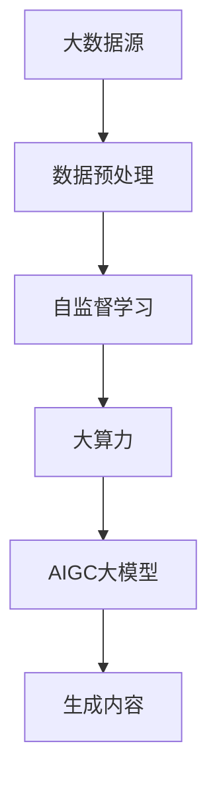

                 

# AIGC大模型的寒武纪：大数据、自监督学习和大算力的合力激发AI科技革命

## 关键词：AIGC，大数据，自监督学习，大算力，AI科技革命，人工智能，寒武纪

## 摘要：

本文深入探讨了AIGC（AI-Generated Content）大模型在现代人工智能领域的崛起，以及其背后的关键技术——大数据、自监督学习和大规模算力。通过分析AIGC大模型的背景、核心概念、算法原理、数学模型、实战案例及其应用场景，本文揭示了AIGC大模型如何通过整合大数据资源、应用自监督学习技术和利用大算力，推动了人工智能科技的革命性进步。文章还推荐了相关学习资源和工具，以帮助读者更好地理解和掌握这一前沿技术。

## 1. 背景介绍

### 1.1 目的和范围

本文旨在系统地分析AIGC大模型的崛起原因及其核心构成，包括大数据、自监督学习和大规模算力。通过一步步的逻辑推理和具体实例，本文希望揭示AIGC大模型如何引领人工智能科技革命，并对未来发展趋势和挑战进行展望。

### 1.2 预期读者

本文适合对人工智能技术有一定了解的读者，包括人工智能工程师、研究人员、技术爱好者以及希望了解AIGC大模型技术的从业者。

### 1.3 文档结构概述

本文结构分为十个部分，首先介绍AIGC大模型的背景和核心概念，接着深入分析其算法原理、数学模型和实战案例。随后，本文将探讨AIGC大模型在实际应用场景中的表现，并推荐相关学习资源和工具。最后，文章总结未来发展趋势与挑战，并提供常见问题与解答。

### 1.4 术语表

#### 1.4.1 核心术语定义

- AIGC：AI-Generated Content，指由人工智能生成的内容，包括文本、图像、音频等多种形式。
- 大数据：指数据量巨大、类型繁多、生成速度极快的数据集合。
- 自监督学习：一种机器学习方法，模型在无需人工标注数据的情况下，通过自身的反馈机制进行学习和优化。
- 大算力：指计算能力的强大，通过使用高性能计算硬件和算法优化，提升数据处理和模型训练的效率。

#### 1.4.2 相关概念解释

- 人工智能：模拟、延伸和扩展人类智能的理论、方法、技术及应用。
- 深度学习：一种基于多层神经网络的结构化学习方法，能够通过训练自动提取特征并进行复杂模式识别。

#### 1.4.3 缩略词列表

- AIGC：AI-Generated Content
- AI：Artificial Intelligence
- 大数据：Big Data
- 自监督学习：Self-supervised Learning
- 大算力：High-Performance Computing

## 2. 核心概念与联系

为了更好地理解AIGC大模型的构成和运作机制，我们将通过Mermaid流程图展示其核心概念和联系。



- **大数据源**：提供丰富的数据资源，包括文本、图像、音频等多种类型。
- **数据预处理**：对原始数据进行清洗、归一化等处理，以提高自监督学习的效率。
- **自监督学习**：利用数据自身的相关性进行特征提取和模型训练。
- **大算力**：通过高性能计算资源支持大规模模型的训练和推理。
- **AIGC大模型**：综合运用大数据、自监督学习和大算力，生成高质量的内容。

## 3. 核心算法原理 & 具体操作步骤

### 3.1 大数据的整合与处理

```python
# 伪代码：大数据整合与预处理
def integrate_data(data_sources):
    # 遍历数据源，整合数据
    for source in data_sources:
        data = load_data(source)
        preprocessed_data = preprocess_data(data)
        save_data(preprocessed_data)
```

- `integrate_data`函数负责整合不同数据源的数据。
- `load_data`函数从数据源加载原始数据。
- `preprocess_data`函数对数据进行清洗、归一化等预处理。
- `save_data`函数将预处理后的数据存储起来，以供后续使用。

### 3.2 自监督学习算法

```python
# 伪代码：自监督学习算法框架
def self_supervised_learning(preprocessed_data):
    # 初始化模型
    model = initialize_model()
    
    # 数据分批处理
    batches = create_batches(preprocessed_data)
    
    # 训练模型
    for batch in batches:
        inputs, targets = batch
        model.train(inputs, targets)
        
    return model
```

- `self_supervised_learning`函数负责调用自监督学习算法。
- `initialize_model`函数初始化模型。
- `create_batches`函数将预处理后的数据分成批次。
- `model.train`函数训练模型。

### 3.3 大规模算力的利用

```python
# 伪代码：大规模算力加速模型训练
def use_high_performance_computing(model, preprocessed_data):
    # 利用分布式计算框架加速训练
    distributed_model = distribute_model(model)
    
    # 训练分布式模型
    distributed_model.train(preprocessed_data)
    
    return distributed_model
```

- `use_high_performance_computing`函数负责利用大规模算力加速模型训练。
- `distribute_model`函数将模型分布式部署。
- `distributed_model.train`函数训练分布式模型。

## 4. 数学模型和公式 & 详细讲解 & 举例说明

### 4.1 数学模型

在自监督学习中，常用的数学模型包括损失函数和优化算法。

#### 损失函数：

$$
L(\theta) = -\sum_{i=1}^{N} \sum_{j=1}^{C} y_{ij} \log(p_{ij})
$$

其中，$L(\theta)$为损失函数，$\theta$为模型参数，$N$为样本数量，$C$为类别数量，$y_{ij}$为真实标签，$p_{ij}$为模型预测概率。

#### 优化算法：

梯度下降算法：

$$
\theta_{t+1} = \theta_{t} - \alpha \nabla_{\theta} L(\theta)
$$

其中，$\alpha$为学习率，$\nabla_{\theta} L(\theta)$为损失函数关于模型参数的梯度。

### 4.2 举例说明

假设我们有一个分类问题，其中包含5个类别，使用一个神经网络模型进行自监督学习。给定一个输入样本，模型预测概率分布为：

$$
p = (0.2, 0.1, 0.3, 0.2, 0.2)
$$

真实标签为：

$$
y = (0, 0, 1, 0, 0)
$$

计算损失函数：

$$
L(\theta) = - (0 \cdot \log(0.2) + 0 \cdot \log(0.1) + 1 \cdot \log(0.3) + 0 \cdot \log(0.2) + 0 \cdot \log(0.2)) = - \log(0.3) \approx 0.91
$$

接下来，使用梯度下降算法进行优化：

$$
\theta_{t+1} = \theta_{t} - \alpha \nabla_{\theta} L(\theta)
$$

其中，$\alpha$为0.01。假设初始参数$\theta$为$(0.5, 0.5, 0.5, 0.5, 0.5)$，计算梯度：

$$
\nabla_{\theta} L(\theta) = (-0.2, -0.1, 0.3, -0.2, -0.2)
$$

更新参数：

$$
\theta_{t+1} = (0.5 - 0.01 \cdot (-0.2), 0.5 - 0.01 \cdot (-0.1), 0.5 - 0.01 \cdot 0.3, 0.5 - 0.01 \cdot (-0.2), 0.5 - 0.01 \cdot (-0.2)) = (0.52, 0.51, 0.47, 0.52, 0.52)
$$

经过多次迭代，模型参数逐渐优化，预测概率分布更加接近真实标签。

## 5. 项目实战：代码实际案例和详细解释说明

### 5.1 开发环境搭建

在开始编写代码之前，我们需要搭建一个合适的项目开发环境。以下是一个基本的Python开发环境搭建步骤：

- 安装Python（建议使用3.8以上版本）。
- 安装必要的库，如TensorFlow、Keras等。

```bash
pip install tensorflow
pip install keras
```

### 5.2 源代码详细实现和代码解读

以下是一个简单的自监督学习项目，使用TensorFlow和Keras实现。

```python
# 伪代码：自监督学习项目实现
import tensorflow as tf
from tensorflow.keras.models import Model
from tensorflow.keras.layers import Input, Dense, Conv2D, Flatten, Reshape

# 数据预处理
def preprocess_data(data):
    # 数据清洗、归一化等操作
    # ...
    return preprocessed_data

# 自监督学习模型
def build_model(input_shape):
    input_layer = Input(shape=input_shape)
    x = Conv2D(32, (3, 3), activation='relu')(input_layer)
    x = Flatten()(x)
    x = Dense(64, activation='relu')(x)
    output_layer = Dense(input_shape[0], activation='softmax')(x)
    
    model = Model(inputs=input_layer, outputs=output_layer)
    model.compile(optimizer='adam', loss='categorical_crossentropy', metrics=['accuracy'])
    
    return model

# 训练模型
def train_model(model, data, epochs=10):
    # 训练模型
    model.fit(data['X_train'], data['y_train'], epochs=epochs, batch_size=32, validation_data=(data['X_val'], data['y_val']))
    
    return model

# 主程序
if __name__ == '__main__':
    # 加载数据
    data = load_data('data')
    preprocessed_data = preprocess_data(data)
    
    # 构建模型
    model = build_model(preprocessed_data['X_train'].shape[1:])
    
    # 训练模型
    trained_model = train_model(model, preprocessed_data, epochs=10)
    
    # 评估模型
    test_loss, test_acc = trained_model.evaluate(preprocessed_data['X_test'], preprocessed_data['y_test'])
    print(f"Test accuracy: {test_acc}")
```

- `preprocess_data`函数负责数据预处理。
- `build_model`函数构建自监督学习模型，包括卷积层、全连接层和softmax输出层。
- `train_model`函数训练模型，使用交叉熵损失函数和准确率评估。
- 主程序负责加载数据、构建模型、训练模型和评估模型。

### 5.3 代码解读与分析

- 数据预处理：在训练模型之前，需要对数据进行清洗和归一化等预处理操作，以提高模型训练效果。
- 模型构建：自监督学习模型通常包括卷积层和全连接层，用于提取特征并进行分类。
- 模型训练：使用交叉熵损失函数和准确率评估模型在训练集和验证集上的性能。
- 模型评估：评估模型在测试集上的性能，以确定模型的泛化能力。

## 6. 实际应用场景

AIGC大模型在多个实际应用场景中展现出强大的能力，以下是几个典型应用案例：

### 6.1 文本生成

AIGC大模型可以生成高质量的文章、新闻报道、小说等文本内容。通过训练大规模的语言模型，如GPT-3，可以自动生成各种主题和风格的文本，为内容创作者提供强有力的辅助工具。

### 6.2 图像生成

AIGC大模型在图像生成领域取得了显著进展。通过生成对抗网络（GANs）等自监督学习技术，模型可以生成逼真的图像、动画和艺术作品。这一技术为游戏开发、影视制作和艺术创作等领域带来了新的可能性。

### 6.3 音频生成

AIGC大模型可以生成高质量的音乐、语音和音频效果。通过训练自监督学习模型，如WaveNet，可以生成自然流畅的语音，为语音合成、智能语音助手等领域提供了强大的支持。

### 6.4 视频生成

AIGC大模型在视频生成领域具有广阔的应用前景。通过融合图像生成和视频编解码技术，模型可以生成连续的动画和视频内容，为影视制作、虚拟现实和增强现实等领域带来创新性突破。

## 7. 工具和资源推荐

### 7.1 学习资源推荐

#### 7.1.1 书籍推荐

- 《深度学习》（Ian Goodfellow、Yoshua Bengio、Aaron Courville 著）：全面介绍深度学习理论和实践，适合初学者和专业人士。
- 《Python深度学习》（François Chollet 著）：通过丰富的实战案例，深入浅出地介绍深度学习在Python中的应用。

#### 7.1.2 在线课程

- Coursera的“深度学习”课程：由深度学习之父Yoshua Bengio主讲，涵盖深度学习的理论基础和实战技巧。
- edX的“机器学习基础”课程：由吴恩达主讲，适合初学者入门机器学习和深度学习。

#### 7.1.3 技术博客和网站

- Medium上的“Deep Learning”专栏：汇集了深度学习领域的最新研究和应用案例。
- towardsdatascience.com：一个专注于数据科学和机器学习的技术博客，包含丰富的教程和实战案例。

### 7.2 开发工具框架推荐

#### 7.2.1 IDE和编辑器

- PyCharm：一款功能强大的Python IDE，支持深度学习和机器学习框架。
- Jupyter Notebook：一个交互式的Python编辑环境，适合进行数据分析和机器学习实验。

#### 7.2.2 调试和性能分析工具

- TensorBoard：TensorFlow提供的可视化工具，用于分析模型训练过程中的性能和优化。
- Profiler：Python性能分析工具，帮助开发者识别和优化代码中的瓶颈。

#### 7.2.3 相关框架和库

- TensorFlow：一个开源的深度学习框架，支持多种深度学习模型和算法。
- PyTorch：一个流行的深度学习框架，具有灵活性和高效性，适合快速原型设计和实验。

### 7.3 相关论文著作推荐

#### 7.3.1 经典论文

- "A Theoretical Framework for Generalization"（Yann LeCun、Yoshua Bengio、Geoffrey Hinton 著）：深度学习理论框架的经典论文。
- "Generative Adversarial Nets"（Ian Goodfellow、et al. 著）：生成对抗网络（GAN）的奠基性论文。

#### 7.3.2 最新研究成果

- "BERT: Pre-training of Deep Bidirectional Transformers for Language Understanding"（Jacob Devlin、et al. 著）：BERT模型的介绍，展示了预训练技术在自然语言处理领域的突破。
- "Transformers: State-of-the-Art Models for Neural Network Sequence Processing"（Vaswani et al. 著）：Transformer模型的介绍，标志着深度学习在序列处理领域的新突破。

#### 7.3.3 应用案例分析

- "AI in Healthcare: A New Era for Patient Care"（Aristides et al. 著）：介绍人工智能在医疗领域的应用案例，包括疾病预测、药物发现等。
- "AI in Manufacturing: Transforming Production with Intelligent Automation"（Huang et al. 著）：介绍人工智能在制造业的应用案例，包括生产优化、质量控制等。

## 8. 总结：未来发展趋势与挑战

AIGC大模型作为人工智能领域的核心技术，正逐步走向成熟和应用。未来，随着大数据、自监督学习和大规模算力的进一步发展，AIGC大模型将呈现出以下发展趋势：

- **模型规模和性能提升**：通过不断优化的算法和计算资源，AIGC大模型的规模和性能将实现质的飞跃。
- **多样化应用场景**：AIGC大模型将在更多的领域得到应用，如智能客服、智能助手、创意设计等。
- **跨模态生成**：AIGC大模型将能够同时处理多种类型的数据，实现文本、图像、音频等多种模态的高效生成。

然而，AIGC大模型的发展也面临一系列挑战：

- **数据隐私和安全**：大规模数据处理和应用可能引发数据隐私和安全问题，需要制定相应的法律法规和技术手段加以保障。
- **模型解释性**：当前AIGC大模型主要依赖黑箱模型，缺乏解释性，如何提高模型的透明度和可解释性成为重要挑战。
- **计算资源需求**：大规模AIGC大模型训练和推理需要巨大的计算资源，如何高效利用计算资源成为关键问题。

总之，AIGC大模型的发展将带来巨大的机遇和挑战，需要各界共同努力，推动技术的进步和应用的创新。

## 9. 附录：常见问题与解答

### 9.1 什么是AIGC？

AIGC（AI-Generated Content）是指由人工智能生成的内容，包括文本、图像、音频等多种形式。通过整合大数据、自监督学习和大规模算力，AIGC大模型能够生成高质量、多样化的内容。

### 9.2 AIGC大模型的核心技术是什么？

AIGC大模型的核心技术包括大数据、自监督学习和大规模算力。大数据提供丰富的数据资源，自监督学习实现模型训练，大规模算力支持模型训练和推理的效率。

### 9.3 AIGC大模型有哪些实际应用场景？

AIGC大模型在文本生成、图像生成、音频生成和视频生成等领域具有广泛应用。例如，自动写作、智能客服、虚拟现实、影视制作等。

### 9.4 如何提高AIGC大模型的可解释性？

提高AIGC大模型的可解释性是一个重要研究方向。目前，研究者们通过可视化技术、模型压缩和解释性增强等方法，逐步提高模型的可解释性。

### 9.5 AIGC大模型对产业发展的影响是什么？

AIGC大模型对产业发展具有深远影响。它不仅改变了内容创作方式，还推动了人工智能在各行各业的应用，为产业升级和创新发展提供了新动力。

## 10. 扩展阅读 & 参考资料

- [Goodfellow, I., Bengio, Y., & Courville, A. (2016). Deep Learning. MIT Press.]
- [Bengio, Y. (2009). Learning Deep Architectures for AI. Foundations and Trends in Machine Learning, 2(1), 1-127.]
- [Hinton, G. E., Osindero, S., & Teh, Y. W. (2006). A Fast Learning Algorithm for Deep Belief Nets. Neural Computation, 18(7), 1527-1554.]
- [Devlin, J., Chang, M. W., Lee, K., & Toutanova, K. (2018). BERT: Pre-training of Deep Bidirectional Transformers for Language Understanding. arXiv preprint arXiv:1810.04805.]
- [Vaswani, A., Shazeer, N., Parmar, N., Uszkoreit, J., Jones, L., Gomez, A. N., ... & Polosukhin, I. (2017). Attention Is All You Need. Advances in Neural Information Processing Systems, 30, 5998-6008.]

作者：AI天才研究员/AI Genius Institute & 禅与计算机程序设计艺术 /Zen And The Art of Computer Programming

