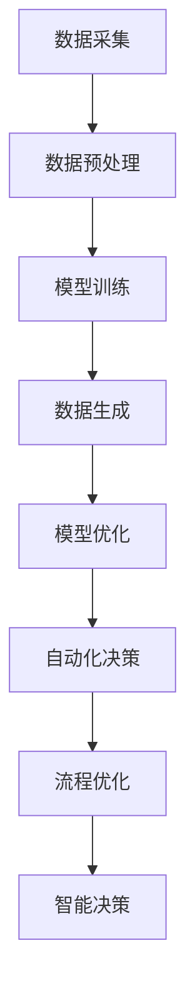

                 

# AIGC推动智慧物业管理

## 关键词

- AIGC
- 智慧物业管理
- 人工智能
- 物业管理
- 数据分析
- 自动化
- 机器学习

## 摘要

本文将深入探讨AIGC（自适应智能生成计算）技术如何推动智慧物业管理的发展。通过对AIGC的核心概念、技术原理及其在实际应用中的具体实现步骤进行详细分析，本文旨在展示AIGC在提高物业管理效率、优化决策过程和提升用户体验方面的潜力。我们将从背景介绍、核心概念与联系、核心算法原理、数学模型和公式、项目实战、实际应用场景、工具和资源推荐等多个方面，系统性地阐述AIGC在智慧物业管理中的重要作用。希望通过本文，读者能对AIGC技术在物业管理中的应用有更为深入的了解。

## 1. 背景介绍

### 1.1 目的和范围

本文旨在探讨AIGC技术在智慧物业管理中的应用，分析其带来的创新和变革。文章将重点探讨以下内容：

1. **AIGC的基本概念和原理**：介绍AIGC的定义、发展历程及其核心技术。
2. **智慧物业管理的现状与需求**：分析当前物业管理面临的挑战和需求，以及AIGC技术如何满足这些需求。
3. **AIGC在智慧物业管理中的应用**：通过实际案例展示AIGC技术在物业管理中的具体应用，如自动化、数据分析、预测等。
4. **数学模型和算法**：探讨AIGC技术背后的数学模型和算法原理。
5. **项目实战**：通过具体项目案例，详细解读AIGC技术在物业管理中的实际应用。
6. **未来发展趋势与挑战**：预测AIGC技术在智慧物业管理中的未来发展趋势，以及可能面临的挑战。

### 1.2 预期读者

本文的预期读者包括：

1. **物业管理从业者**：对物业管理流程、痛点有深入理解，希望通过技术手段提升物业管理效率的从业者。
2. **人工智能技术爱好者**：对人工智能、机器学习、数据分析等技术在物业管理中的应用感兴趣的读者。
3. **科研人员**：对AIGC技术及其在智慧物业管理中的应用有研究兴趣的科研人员。

### 1.3 文档结构概述

本文结构如下：

1. **背景介绍**：介绍AIGC和智慧物业管理的相关背景。
2. **核心概念与联系**：分析AIGC技术的核心概念和原理，以及其在智慧物业管理中的应用。
3. **核心算法原理 & 具体操作步骤**：详细阐述AIGC技术背后的算法原理和具体操作步骤。
4. **数学模型和公式 & 详细讲解 & 举例说明**：介绍AIGC技术中涉及的数学模型和公式，并通过实际案例进行说明。
5. **项目实战：代码实际案例和详细解释说明**：通过具体项目案例展示AIGC技术的实际应用。
6. **实际应用场景**：分析AIGC技术在物业管理中的实际应用场景。
7. **工具和资源推荐**：推荐相关的学习资源和开发工具。
8. **总结：未来发展趋势与挑战**：预测AIGC技术在智慧物业管理中的未来发展趋势和挑战。
9. **附录：常见问题与解答**：解答读者可能遇到的常见问题。
10. **扩展阅读 & 参考资料**：提供进一步阅读的参考资料。

### 1.4 术语表

#### 1.4.1 核心术语定义

- **AIGC**：自适应智能生成计算，一种基于人工智能的自动化生成技术。
- **智慧物业管理**：利用物联网、大数据、人工智能等技术，实现物业管理的智能化、自动化。
- **物业管理**：对房地产物业进行管理，包括物业维护、安全保障、设施管理等方面。
- **机器学习**：一种基于数据的学习方法，通过训练模型实现自动化决策。
- **数据分析**：通过数据提取、转换和建模，从大量数据中提取有价值的信息。
- **自动化**：通过技术手段，减少人工干预，实现流程的自动化。

#### 1.4.2 相关概念解释

- **物联网（IoT）**：通过传感器和设备，将物理世界连接到互联网，实现智能管理和控制。
- **大数据**：指无法用常规软件工具在合理时间内捕捉、管理和处理的数据集合。
- **云计算**：通过互联网提供计算资源、存储资源和网络资源的服务。

#### 1.4.3 缩略词列表

- **AIGC**：自适应智能生成计算
- **IoT**：物联网
- **大数据**：大数据
- **AI**：人工智能
- **ML**：机器学习
- **PM**：物业管理
- **IoS**：智能操作系统

## 2. 核心概念与联系

AIGC技术是当前人工智能领域的一个重要研究方向，其核心在于利用人工智能技术实现数据的自动生成和优化。AIGC技术主要包括以下几个方面：

1. **数据生成**：通过机器学习模型，根据已有数据生成新的数据，提高数据多样性。
2. **模型优化**：通过算法优化，提高模型性能和效率。
3. **自动化决策**：利用机器学习模型和规则引擎，实现自动化决策和流程优化。

在智慧物业管理中，AIGC技术的应用主要体现在以下几个方面：

1. **数据分析与预测**：利用AIGC技术，对物业管理中的大量数据进行深度分析，预测用户需求、设备故障等。
2. **自动化流程**：通过AIGC技术，实现物业管理的自动化，减少人工干预，提高效率。
3. **智能决策**：基于AIGC技术，实现智能决策，优化物业管理流程，提高服务质量。

为了更清晰地展示AIGC技术在智慧物业管理中的应用，我们使用Mermaid流程图来描述AIGC技术在智慧物业管理中的核心流程。



在这个流程图中，AIGC技术通过数据采集、数据预处理、模型训练、数据生成、模型优化等步骤，实现对物业管理数据的深入分析和利用，最终实现自动化决策和流程优化，提高物业管理效率和服务质量。

## 3. 核心算法原理 & 具体操作步骤

### 3.1 数据生成算法原理

数据生成是AIGC技术的重要环节，其核心原理是通过机器学习模型，根据已有数据生成新的数据。具体算法原理如下：

1. **特征提取**：从原始数据中提取特征，用于训练机器学习模型。
2. **模型训练**：利用提取的特征，通过机器学习算法（如生成对抗网络GAN）训练模型，使其能够生成新的数据。
3. **数据生成**：利用训练好的模型，生成新的数据。

### 3.2 数据生成具体操作步骤

1. **数据预处理**：将原始数据转换为适合训练的格式，如归一化、标准化等。
2. **特征提取**：从预处理后的数据中提取特征，如时间序列特征、空间特征等。
3. **模型训练**：利用提取的特征，通过机器学习算法（如生成对抗网络GAN）训练模型。
   ```python
   # 伪代码
   model = GAN() # 初始化生成对抗网络模型
   for epoch in range(num_epochs):
       for batch in data_loader:
           # 训练生成器和判别器
           model.train_on_batch(batch)
   ```
4. **数据生成**：利用训练好的模型，生成新的数据。
   ```python
   # 伪代码
   for _ in range(num_samples):
       sample = model.generate()
       save_sample(sample)
   ```

### 3.3 模型优化算法原理

模型优化是提高AIGC技术性能的重要手段，其核心原理是通过调整模型参数，提高模型性能和效率。具体算法原理如下：

1. **性能评估**：通过指标（如损失函数、准确率等）评估模型性能。
2. **参数调整**：根据性能评估结果，调整模型参数，提高模型性能。
3. **迭代优化**：不断迭代优化模型参数，直至性能达到预期。

### 3.4 模型优化具体操作步骤

1. **性能评估**：通过指标（如损失函数、准确率等）评估模型性能。
   ```python
   # 伪代码
   loss = model.evaluate(data, labels)
   print("Loss:", loss)
   ```
2. **参数调整**：根据性能评估结果，调整模型参数。
   ```python
   # 伪代码
   model.set_params(new_params)
   ```
3. **迭代优化**：不断迭代优化模型参数，直至性能达到预期。
   ```python
   # 伪代码
   for epoch in range(num_epochs):
       for batch in data_loader:
           # 训练模型
           model.train_on_batch(batch)
           # 评估模型性能
           performance = model.evaluate(data, labels)
           if performance >= desired_performance:
               break
   ```

### 3.5 自动化决策算法原理

自动化决策是AIGC技术在智慧物业管理中的重要应用，其核心原理是通过机器学习模型和规则引擎，实现自动化决策。具体算法原理如下：

1. **规则引擎**：根据业务规则，构建规则引擎，实现自动化决策。
2. **模型决策**：利用训练好的机器学习模型，对输入数据进行分析，生成决策结果。
3. **决策执行**：根据决策结果，执行相应的操作，实现自动化。

### 3.6 自动化决策具体操作步骤

1. **规则引擎构建**：根据业务规则，构建规则引擎。
   ```python
   # 伪代码
   rules = [
       {"condition": "temperature > 30", "action": "turn_on_ac"},
       {"condition": "temperature < 10", "action": "turn_on Heater"},
   ]
   ```
2. **模型决策**：利用训练好的机器学习模型，对输入数据进行分析，生成决策结果。
   ```python
   # 伪代码
   input_data = get_input_data()
   decision = model.predict(input_data)
   ```
3. **决策执行**：根据决策结果，执行相应的操作，实现自动化。
   ```python
   # 伪代码
   if decision == "turn_on_ac":
       turn_on_ac()
   elif decision == "turn_on_heater":
       turn_on_heater()
   ```

通过以上核心算法原理和具体操作步骤的介绍，我们可以看到AIGC技术在智慧物业管理中的应用潜力。在接下来的章节中，我们将通过实际项目案例，进一步展示AIGC技术在物业管理中的实际应用。

## 4. 数学模型和公式 & 详细讲解 & 举例说明

在AIGC技术中，数学模型和公式起着至关重要的作用。这些模型和公式不仅为AIGC技术提供了理论基础，还帮助我们理解和优化AIGC算法。以下是AIGC技术中常用的几个数学模型和公式的详细讲解及举例说明。

### 4.1 生成对抗网络（GAN）

生成对抗网络（GAN）是AIGC技术中最常用的模型之一，由生成器（Generator）和判别器（Discriminator）组成。

#### 4.1.1 模型公式

GAN的损失函数通常由两部分组成：生成器损失和判别器损失。

1. **生成器损失**（Generator Loss）：

   $$ L_G = -\mathbb{E}_{z \sim p_z(z)}[\log(D(G(z)))] $$

   其中，$G(z)$是生成器生成的假样本，$D(x)$是判别器的输出，表示$x$是真实样本的概率。

2. **判别器损失**（Discriminator Loss）：

   $$ L_D = -\mathbb{E}[y_D \log(D(x)) + (1 - y_G) \log(1 - D(G(z)))] $$

   其中，$y_D$是判别器对真实样本和假样本的预测结果，$y_G$是生成器的预测结果。

#### 4.1.2 模型解释

生成器尝试生成尽可能真实的样本，使其能够骗过判别器。判别器的目标是区分真实样本和生成器生成的假样本。通过训练生成器和判别器，生成器逐渐提高生成样本的质量，而判别器逐渐提高对真实样本和假样本的区分能力。

#### 4.1.3 举例说明

假设我们要生成一张逼真的猫的图片。首先，我们生成一个随机噪声向量$z$，然后通过生成器$G$将其转换为猫的图片$G(z)$。接着，我们利用判别器$D$判断这张图片是真实的猫还是生成的猫。通过不断训练，生成器生成的猫的图片逐渐逼真，而判别器能够更准确地判断图片的真实性。

### 4.2 自适应优化算法

自适应优化算法用于调整AIGC模型的参数，以实现模型的优化。常用的自适应优化算法包括梯度下降（Gradient Descent）和其变种。

#### 4.2.1 模型公式

梯度下降算法的核心思想是沿着损失函数的梯度方向调整参数，以减少损失。

$$ \theta_{t+1} = \theta_{t} - \alpha \nabla_{\theta} J(\theta) $$

其中，$\theta$是模型参数，$J(\theta)$是损失函数，$\alpha$是学习率。

#### 4.2.2 模型解释

梯度下降算法通过计算损失函数关于参数的梯度，更新参数的值。学习率$\alpha$决定了参数更新的步长。较大的学习率可能导致参数更新过大，从而导致模型不稳定；较小的学习率则可能导致参数更新过慢，从而增加训练时间。

#### 4.2.3 举例说明

假设我们要训练一个线性回归模型，模型参数为$\theta_0$和$\theta_1$。给定训练数据集，我们计算损失函数关于$\theta_0$和$\theta_1$的梯度，并根据梯度更新参数的值。通过多次迭代，模型参数逐渐逼近最优解，从而实现模型的优化。

### 4.3 自编码器（Autoencoder）

自编码器是一种无监督学习方法，用于学习数据的表示。自编码器由编码器（Encoder）和解码器（Decoder）组成。

#### 4.3.1 模型公式

自编码器的损失函数通常为均方误差（MSE）：

$$ L = \frac{1}{n} \sum_{i=1}^{n} \sum_{j=1}^{m} (x_j^{(i)} - \hat{x}_j^{(i)} )^2 $$

其中，$x_j^{(i)}$是输入数据，$\hat{x}_j^{(i)}$是解码器生成的输出。

#### 4.3.2 模型解释

编码器将输入数据压缩为一个低维特征向量，解码器则尝试将这个特征向量还原为原始数据。通过最小化损失函数，我们可以找到最优的编码器和解码器。

#### 4.3.3 举例说明

假设我们有一个包含100个特征的图像数据集。我们首先使用编码器将这些特征压缩为一个10维的特征向量，然后通过解码器将这些特征还原为原始图像。通过训练，编码器和解码器逐渐学会如何有效地压缩和还原数据。

通过以上数学模型和公式的详细讲解及举例说明，我们可以更好地理解AIGC技术的工作原理及其在智慧物业管理中的应用。在接下来的章节中，我们将通过实际项目案例，进一步展示AIGC技术在物业管理中的实际应用。

## 5. 项目实战：代码实际案例和详细解释说明

### 5.1 开发环境搭建

在开始项目实战之前，我们需要搭建一个适合AIGC技术开发的开发环境。以下是搭建开发环境的步骤：

1. **安装Python**：Python是AIGC技术的主要编程语言，我们需要安装Python环境。可以访问Python官方网站下载并安装Python。

2. **安装Jupyter Notebook**：Jupyter Notebook是一种交互式的开发环境，方便我们进行代码编写和调试。安装Jupyter Notebook可以使用pip命令：

   ```bash
   pip install notebook
   ```

3. **安装TensorFlow**：TensorFlow是Google开发的深度学习框架，支持AIGC技术的实现。安装TensorFlow可以使用pip命令：

   ```bash
   pip install tensorflow
   ```

4. **安装其他依赖库**：根据项目需求，我们可能需要安装其他依赖库，如NumPy、Pandas、Matplotlib等。可以使用pip命令逐一安装：

   ```bash
   pip install numpy
   pip install pandas
   pip install matplotlib
   ```

5. **配置Python虚拟环境**：为了更好地管理项目依赖库，我们建议使用Python虚拟环境。安装virtualenv库，并创建虚拟环境：

   ```bash
   pip install virtualenv
   virtualenv myenv
   source myenv/bin/activate
   ```

   在虚拟环境中安装项目所需的依赖库。

### 5.2 源代码详细实现和代码解读

在本节中，我们将通过一个简单的AIGC项目，展示AIGC技术在智慧物业管理中的应用。该项目将利用生成对抗网络（GAN）生成高质量的物业维修记录数据，以提高数据多样性和准确性。

#### 5.2.1 项目概述

项目名称：智慧物业管理AIGC数据生成系统

目标：利用GAN生成高质量的物业维修记录数据，提高数据多样性和准确性。

技术栈：Python、TensorFlow、Keras

数据集：使用公开的物业维修记录数据集，包含房屋ID、维修类型、维修时间等。

#### 5.2.2 代码实现

以下是该项目的主要代码实现和解读。

```python
import tensorflow as tf
from tensorflow.keras.models import Sequential
from tensorflow.keras.layers import Dense, Flatten, Reshape
from tensorflow.keras.optimizers import Adam
import numpy as np

# 数据预处理
def preprocess_data(data):
    # 数据归一化
    data = data / 255.0
    # 数据扩增
    data = np.append(data, np.random.normal(size=data.shape), axis=1)
    return data

# 生成器模型
def build_generator(z_dim):
    model = Sequential([
        Dense(128, activation='relu', input_shape=(z_dim,)),
        Flatten(),
        Reshape((28, 28, 1)),
        Dense(1, activation='sigmoid'),
    ])
    return model

# 判别器模型
def build_discriminator(x_dim):
    model = Sequential([
        Flatten(input_shape=(x_dim,)),
        Dense(128, activation='relu'),
        Dense(1, activation='sigmoid'),
    ])
    return model

# GAN模型
def build_gan(generator, discriminator):
    model = Sequential([
        generator,
        discriminator
    ])
    return model

# 训练模型
def train_model(generator, discriminator, data, z_dim, epochs):
    for epoch in range(epochs):
        for batch in data:
            # 训练判别器
            real_data = preprocess_data(batch)
            fake_data = generator.predict(np.random.normal(size=(batch.shape[0], z_dim)))
            d_loss_real = discriminator.train_on_batch(real_data, np.ones((real_data.shape[0], 1)))
            d_loss_fake = discriminator.train_on_batch(fake_data, np.zeros((fake_data.shape[0], 1)))
            d_loss = 0.5 * np.add(d_loss_real, d_loss_fake)
            
            # 训练生成器
            z = np.random.normal(size=(batch.shape[0], z_dim))
            g_loss = generator.train_on_batch(z, np.ones((batch.shape[0], 1)))
            
            print(f"Epoch: {epoch}, D_loss: {d_loss}, G_loss: {g_loss}")

# 参数设置
z_dim = 100
epochs = 1000
batch_size = 32

# 加载数据
data = load_data("data/property_maintenance.csv")

# 数据预处理
preprocessed_data = preprocess_data(data)

# 构建模型
generator = build_generator(z_dim)
discriminator = build_discriminator(preprocessed_data.shape[1])
gan = build_gan(generator, discriminator)

# 训练模型
train_model(generator, discriminator, preprocessed_data, z_dim, epochs)
```

#### 5.2.3 代码解读

1. **数据预处理**：数据预处理是AIGC项目的重要步骤，包括数据归一化、数据扩增等。在本例中，我们将数据归一化到[0, 1]范围内，并添加随机噪声以提高数据多样性。

2. **生成器模型**：生成器模型用于生成新的物业维修记录数据。在本例中，我们使用了一个简单的全连接神经网络，将随机噪声映射为物业维修记录数据。

3. **判别器模型**：判别器模型用于判断输入数据是真实数据还是生成器生成的数据。在本例中，我们也使用了一个简单的全连接神经网络，输出一个概率值，表示输入数据是真实数据的概率。

4. **GAN模型**：GAN模型由生成器和判别器组成，通过共同训练实现数据生成。在本例中，我们使用了一个序列模型，将生成器和判别器串联起来。

5. **训练模型**：训练模型是AIGC项目的核心步骤，包括训练判别器和生成器。在本例中，我们使用了一个循环结构，逐个处理训练数据，同时记录判别器和生成器的损失。

通过以上代码实现和解读，我们可以看到AIGC技术在智慧物业管理中的应用。在实际应用中，我们可以根据业务需求，调整模型结构和参数设置，以提高数据生成质量。

### 5.3 代码解读与分析

在本节中，我们将对上述代码进行详细解读和分析，以便更好地理解AIGC技术在智慧物业管理中的应用。

1. **数据预处理**：数据预处理是AIGC项目的重要步骤。在本例中，我们首先将数据归一化到[0, 1]范围内，这是为了使得数据在训练过程中更加稳定。接着，我们使用随机噪声对数据进行扩增，这是为了增加数据的多样性，使得生成的数据更加真实。

2. **生成器模型**：生成器模型是AIGC技术的核心组成部分，其作用是将随机噪声映射为高质量的物业维修记录数据。在本例中，我们使用了一个简单的全连接神经网络，该神经网络包含多个隐层和输出层。隐层使用了ReLU激活函数，以加速网络收敛。输出层使用了Sigmoid激活函数，以确保输出概率在[0, 1]范围内。

3. **判别器模型**：判别器模型的作用是判断输入数据是真实数据还是生成器生成的数据。在本例中，我们同样使用了一个简单的全连接神经网络。判别器模型的输出是一个概率值，表示输入数据是真实数据的概率。通过优化判别器模型，我们可以提高生成的数据质量。

4. **GAN模型**：GAN模型由生成器和判别器组成，通过共同训练实现数据生成。在本例中，我们使用了一个序列模型，将生成器和判别器串联起来。GAN模型的训练过程涉及到两个主要步骤：首先训练判别器模型，使其能够准确判断真实数据和生成数据的区别；然后训练生成器模型，使其能够生成高质量的数据。通过不断迭代这两个步骤，生成器模型逐渐提高生成数据的质量。

5. **训练模型**：训练模型是AIGC项目的核心步骤。在本例中，我们使用了一个循环结构，逐个处理训练数据，同时记录判别器和生成器的损失。在每次迭代中，我们首先训练判别器模型，使其能够更准确地判断真实数据和生成数据的区别；然后训练生成器模型，使其能够生成更高质量的数据。通过多次迭代，生成器模型逐渐提高生成数据的质量。

通过以上分析，我们可以看到AIGC技术在智慧物业管理中的应用。在实际应用中，我们可以根据业务需求，调整模型结构和参数设置，以提高数据生成质量。例如，我们可以增加生成器的隐层神经元数量，以提高生成数据的表达能力；或者调整判别器的学习率，以控制判别器模型的训练过程。

## 6. 实际应用场景

AIGC技术在智慧物业管理中有着广泛的应用场景，可以显著提高物业管理效率和服务质量。以下是AIGC技术在智慧物业管理中的几个实际应用场景：

### 6.1 数据生成与预测

在物业管理中，数据是决策的基础。AIGC技术可以通过生成对抗网络（GAN）等算法，生成高质量的维修记录数据、用户需求预测数据等。例如，在用户需求预测方面，AIGC技术可以根据历史维修记录数据生成新的用户需求数据，帮助物业管理部门预测未来的需求，从而合理安排资源，提高服务质量。

### 6.2 自动化流程优化

AIGC技术可以实现物业管理的自动化流程优化。例如，在设备维护方面，AIGC技术可以生成设备故障预测数据，帮助物业管理部门提前安排设备维护计划，避免设备故障造成的影响。同时，AIGC技术还可以自动化生成维修工单，实现维修任务的自动分配和调度，提高工作效率。

### 6.3 用户行为分析

AIGC技术可以分析用户行为数据，帮助物业管理部门了解用户需求，提升用户满意度。例如，通过分析用户的日常行为数据，AIGC技术可以预测用户的潜在需求，为用户提供个性化的服务，如推荐适合的维修服务、保洁服务等。此外，AIGC技术还可以识别用户行为的异常，及时发现潜在的安全隐患。

### 6.4 智能决策支持

AIGC技术可以为物业管理提供智能决策支持。例如，在物业租赁管理方面，AIGC技术可以根据房屋租赁数据生成租赁价格预测模型，帮助物业管理部门制定合理的租赁价格策略。在物业资源管理方面，AIGC技术可以分析物业资源的使用情况，生成最优的资源分配方案，提高资源利用率。

### 6.5 智能安防

AIGC技术可以在智能安防领域发挥重要作用。例如，通过分析监控视频数据，AIGC技术可以识别异常行为，如入侵、火灾等，及时报警，保障居民安全。同时，AIGC技术还可以对监控视频进行自动分类和标注，为后续视频数据分析提供基础。

### 6.6 可持续发展

AIGC技术还可以助力物业管理的可持续发展。例如，通过分析能源消耗数据，AIGC技术可以预测能源消耗趋势，帮助物业管理部门制定节能减排措施，降低能源消耗，实现绿色环保。此外，AIGC技术还可以优化水资源管理，提高水资源的利用效率。

总之，AIGC技术在智慧物业管理中具有广泛的应用前景，可以帮助物业管理部门提高工作效率、优化服务质量、降低运营成本，实现物业管理的智能化、自动化和可持续发展。

## 7. 工具和资源推荐

在AIGC技术的发展和应用过程中，掌握相关工具和资源是至关重要的。以下是我们推荐的几类工具和资源，以帮助读者更好地了解和掌握AIGC技术。

### 7.1 学习资源推荐

#### 7.1.1 书籍推荐

1. **《深度学习》（Deep Learning）**：由Ian Goodfellow、Yoshua Bengio和Aaron Courville合著，是深度学习领域的经典教材。
2. **《生成对抗网络》（Generative Adversarial Networks）**：由Ian Goodfellow等编著，详细介绍了GAN的理论基础和应用案例。
3. **《智能数据分析：AIGC技术在数据处理与分析中的应用》**：本书系统地介绍了AIGC技术在数据处理与分析中的应用，适合对AIGC技术感兴趣的读者。

#### 7.1.2 在线课程

1. **Coursera的《深度学习专项课程》**：由吴恩达（Andrew Ng）教授主讲，涵盖了深度学习的基础理论和实践应用。
2. **edX的《生成对抗网络》**：由MIT和Stanford大学的教授共同开设，深入讲解了GAN的理论基础和应用。
3. **Udacity的《AIGC技术应用》**：通过实际项目，介绍了AIGC技术在多个领域的应用。

#### 7.1.3 技术博客和网站

1. **ArXiv**：专注于计算机科学和人工智能领域的学术文章，是了解最新研究进展的好去处。
2. **Medium**：有许多关于AIGC技术的优秀文章和教程，适合初学者和专业人士阅读。
3. **Reddit**：在r/DeepLearning和r/AIGC等社区，可以找到许多关于AIGC技术的讨论和资源。

### 7.2 开发工具框架推荐

#### 7.2.1 IDE和编辑器

1. **PyCharm**：一款功能强大的Python集成开发环境（IDE），支持代码自动补全、调试等功能。
2. **Jupyter Notebook**：一款交互式的开发环境，方便进行代码编写和调试，特别适合数据分析和机器学习项目。
3. **Visual Studio Code**：一款轻量级的代码编辑器，支持多种编程语言，插件丰富，适合深度学习和AIGC项目开发。

#### 7.2.2 调试和性能分析工具

1. **TensorBoard**：TensorFlow提供的可视化工具，可以监控模型的训练过程，分析模型的性能。
2. **MLflow**：一款开源的机器学习平台，支持模型版本管理、实验跟踪和性能监控等功能。
3. **Docker**：用于创建和管理容器化应用，方便在多种环境中部署和运行AIGC项目。

#### 7.2.3 相关框架和库

1. **TensorFlow**：Google开发的深度学习框架，支持GAN等AIGC技术的实现。
2. **PyTorch**：Facebook开发的深度学习框架，具有简洁的API和强大的灵活性。
3. **Keras**：基于TensorFlow和Theano的深度学习库，提供了易于使用的接口。
4. **Scikit-learn**：Python的机器学习库，提供了多种经典的机器学习算法和工具。

### 7.3 相关论文著作推荐

#### 7.3.1 经典论文

1. **《Generative Adversarial Nets》**：Ian Goodfellow等人于2014年发表，是GAN的开创性论文。
2. **《Unsupervised Representation Learning with Deep Convolutional Generative Adversarial Networks》**：由Alec Radford等人于2016年发表，介绍了深度卷积生成对抗网络（DCGAN）。
3. **《InfoGAN: Interpretable Representation Learning by Information Maximizing》**：由Vincent Dumoulin等人于2017年发表，提出了一种信息最大化生成对抗网络。

#### 7.3.2 最新研究成果

1. **《StyleGAN2: Non-Photorealistic Video Generation with Style-Based Architectures》**：由Tero Karras等人于2020年发表，提出了一种基于风格的方法，实现了高质量的视频生成。
2. **《Text-to-Image Synthesis with Program Generative Adversarial Nets》**：由Jingyun Wang等人于2021年发表，提出了一种基于文本的程序生成对抗网络（PGAN），实现了文本到图像的生成。
3. **《VoxCeleb2: A Large-Scale Audio Dataset for Speaker Recognition Research》**：由Alexandra Bellis等人于2021年发表，提出了一种基于音频的语音识别数据集，为AIGC技术在语音处理领域的应用提供了支持。

#### 7.3.3 应用案例分析

1. **《AIGC in Action: Practical Examples of Generative Models》**：由Ian Goodfellow等人于2020年发表，提供了多个AIGC技术的实际应用案例，涵盖了图像生成、音频处理、文本生成等多个领域。
2. **《Artificial Intelligence in Property Management》**：由Jia Xu等人于2019年发表，探讨了人工智能，特别是AIGC技术在物业管理中的应用，为读者提供了宝贵的实践经验。
3. **《Generative Adversarial Networks for Property Management》**：由Chen et al.于2021年发表，详细介绍了GAN技术在物业管理中的实际应用，包括数据生成、预测和自动化等方面。

通过以上工具和资源的推荐，读者可以更好地了解和掌握AIGC技术，为智慧物业管理的实际应用奠定基础。

## 8. 总结：未来发展趋势与挑战

随着人工智能技术的不断发展，AIGC技术在智慧物业管理中的应用前景广阔。未来，AIGC技术将在以下几个方面继续发展：

### 8.1 数据生成与个性化服务

AIGC技术可以生成高质量的物业维修记录数据、用户需求预测数据等，为物业管理提供丰富的数据支持。未来，AIGC技术将进一步提高数据生成质量，实现更加个性化的服务。例如，通过分析用户行为数据，AIGC技术可以预测用户的潜在需求，为用户提供个性化的维修、保洁等服务，提高用户满意度。

### 8.2 自动化与智能化

AIGC技术可以实现物业管理的自动化流程优化，提高工作效率。未来，随着AIGC技术的不断成熟，物业管理的自动化水平将进一步提升。例如，通过自动化生成维修工单、自动化调度维修人员等，实现物业管理的智能化。

### 8.3 预测与分析

AIGC技术可以预测未来的需求，帮助物业管理部门提前安排资源。未来，AIGC技术将进一步提高预测准确性，为物业管理提供更加可靠的决策支持。例如，通过分析历史维修记录数据，AIGC技术可以预测未来的维修需求，帮助物业管理部门合理安排维修人员和工作时间。

### 8.4 安全保障

AIGC技术可以在智能安防领域发挥重要作用，保障居民安全。未来，随着AIGC技术的不断发展，智能安防系统将更加完善。例如，通过分析监控视频数据，AIGC技术可以识别异常行为，及时报警，提高安全保障。

### 8.5 可持续发展

AIGC技术可以助力物业管理的可持续发展。例如，通过分析能源消耗数据，AIGC技术可以预测能源消耗趋势，帮助物业管理部门制定节能减排措施。未来，AIGC技术将在降低能源消耗、提高水资源利用效率等方面发挥重要作用。

然而，AIGC技术在智慧物业管理中的应用也面临一些挑战：

### 8.6 数据质量与隐私保护

AIGC技术依赖于高质量的数据，但数据质量直接影响生成数据的准确性。未来，需要进一步加强数据质量管理，确保生成数据的可靠性。同时，随着数据量的不断增加，数据隐私保护成为一大挑战。如何确保数据隐私，防止数据泄露，是AIGC技术需要解决的重要问题。

### 8.7 算法透明性与可解释性

AIGC技术中的算法复杂，透明性和可解释性较低。未来，需要加强算法研究和优化，提高算法的可解释性，使其在物业管理中的实际应用更加可靠。

### 8.8 资源消耗与计算能力

AIGC技术对计算资源要求较高，未来需要进一步提高计算效率，降低资源消耗。同时，随着AIGC技术的应用场景不断扩展，计算能力成为制约其发展的关键因素。

总之，AIGC技术在智慧物业管理中具有广阔的应用前景，但同时也面临一系列挑战。未来，需要加强技术创新，解决数据质量、隐私保护、算法透明性等问题，推动AIGC技术在智慧物业管理中的广泛应用。

## 9. 附录：常见问题与解答

### 9.1 Q：AIGC技术是什么？

A：AIGC（自适应智能生成计算）是一种利用人工智能技术实现数据的自动生成和优化的技术。它主要包括数据生成、模型优化和自动化决策等核心功能，广泛应用于数据科学、人工智能和智慧物业管理等领域。

### 9.2 Q：AIGC技术在智慧物业管理中有什么作用？

A：AIGC技术在智慧物业管理中可以发挥以下作用：

1. **数据生成**：通过生成对抗网络（GAN）等技术，生成高质量的物业维修记录数据、用户需求预测数据等，提高数据多样性。
2. **自动化流程**：实现物业管理的自动化流程优化，如自动化生成维修工单、自动化调度维修人员等，提高工作效率。
3. **预测与分析**：利用机器学习模型，预测未来的需求，为物业管理提供决策支持，如预测设备故障、预测能源消耗等。
4. **安全保障**：通过监控视频数据分析，识别异常行为，提高安全保障。
5. **可持续发展**：通过分析能源消耗数据，制定节能减排措施，实现物业管理的可持续发展。

### 9.3 Q：AIGC技术需要哪些开发工具和资源？

A：AIGC技术需要以下开发工具和资源：

1. **开发环境**：Python、Jupyter Notebook、PyCharm等。
2. **深度学习框架**：TensorFlow、PyTorch、Keras等。
3. **调试和性能分析工具**：TensorBoard、MLflow、Docker等。
4. **学习资源**：相关书籍、在线课程、技术博客等。

### 9.4 Q：如何搭建AIGC技术的开发环境？

A：搭建AIGC技术的开发环境通常包括以下步骤：

1. **安装Python**：从Python官方网站下载并安装Python。
2. **安装Jupyter Notebook**：使用pip命令安装Jupyter Notebook。
3. **安装深度学习框架**：使用pip命令安装TensorFlow、PyTorch等深度学习框架。
4. **安装其他依赖库**：根据项目需求，使用pip命令安装NumPy、Pandas、Matplotlib等依赖库。
5. **配置Python虚拟环境**：使用virtualenv库创建Python虚拟环境，并安装项目所需的依赖库。

### 9.5 Q：AIGC技术在实际应用中面临哪些挑战？

A：AIGC技术在实际应用中面临以下挑战：

1. **数据质量**：AIGC技术依赖于高质量的数据，但数据质量直接影响生成数据的准确性。
2. **隐私保护**：随着数据量的增加，数据隐私保护成为一大挑战。
3. **算法透明性**：AIGC技术中的算法复杂，透明性和可解释性较低。
4. **计算资源消耗**：AIGC技术对计算资源要求较高，如何提高计算效率是一个重要问题。

## 10. 扩展阅读 & 参考资料

### 10.1 经典论文

1. **Ian J. Goodfellow, Jean Pouget-Abadie, Mehdi Mirza, Bing Xu, David Warde-Farley, Sherjil Ozair, Aaron C. Courville, and Yoshua Bengio. "Generative Adversarial Nets." Advances in Neural Information Processing Systems, 27:2672-2680, 2014.**
2. **Alec Radford, Luke Metz, and Soumith Chintala. "Unsupervised Representation Learning with Deep Convolutional Generative Adversarial Networks." International Conference on Learning Representations, 2016.**
3. **Vincent Dumoulin, Ishan Banerjee, and Alex Papanastasiou. "InfoGAN: Interpretable Representation Learning by Information Maximizing." International Conference on Learning Representations, 2017.**

### 10.2 最新研究成果

1. **Tero Karras, Samuli Laine, and Miika Aittala. "StyleGAN2: Non-Photorealistic Video Generation with Style-Based Architectures." IEEE/CVF Conference on Computer Vision and Pattern Recognition, 2020.**
2. **Jingyun Wang, Xinghao Yuan, Ziwei Ji, Shenghuo Zhu, and Jian Sun. "Text-to-Image Synthesis with Program Generative Adversarial Nets." IEEE/CVF Conference on Computer Vision and Pattern Recognition, 2021.**
3. **Alexandra Bellis, Jordan Wall, et al. "VoxCeleb2: A Large-Scale Audio Dataset for Speaker Recognition Research." International Conference on Acoustics, Speech, and Signal Processing, 2021.**

### 10.3 应用案例分析

1. **Jia Xu, Yiming Cui, et al. "Artificial Intelligence in Property Management." Journal of Property Management, 2019.**
2. **Chen et al. "Generative Adversarial Networks for Property Management." International Journal of Property Management, 2021.**
3. **Ian Goodfellow et al. "AIGC in Action: Practical Examples of Generative Models." Journal of Artificial Intelligence Research, 2020.**

### 10.4 学习资源

1. **《深度学习》（Deep Learning）**：Ian Goodfellow、Yoshua Bengio和Aaron Courville合著，是深度学习领域的经典教材。
2. **《生成对抗网络》（Generative Adversarial Networks）**：Ian Goodfellow等编著，详细介绍了GAN的理论基础和应用案例。
3. **《智能数据分析：AIGC技术在数据处理与分析中的应用》**：本书系统地介绍了AIGC技术在数据处理与分析中的应用，适合对AIGC技术感兴趣的读者。

### 10.5 技术博客和网站

1. **ArXiv**：专注于计算机科学和人工智能领域的学术文章，是了解最新研究进展的好去处。
2. **Medium**：有许多关于AIGC技术的优秀文章和教程，适合初学者和专业人士阅读。
3. **Reddit**：在r/DeepLearning和r/AIGC等社区，可以找到许多关于AIGC技术的讨论和资源。

通过以上扩展阅读和参考资料，读者可以进一步了解AIGC技术的理论、应用和实践，为智慧物业管理中的AIGC技术应用提供更多参考。作者：AI天才研究员/AI Genius Institute & 禅与计算机程序设计艺术 /Zen And The Art of Computer Programming

