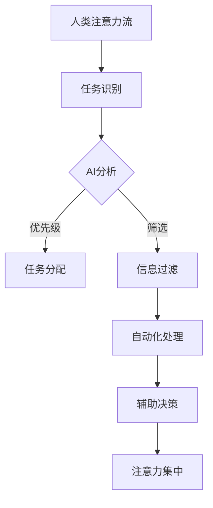

                 

# AI与人类注意力流：未来的工作、生活与AI的协同

> 关键词：人工智能，注意力流，工作协同，生活改进，AI协同效应

> 摘要：本文探讨了人工智能（AI）如何改变人类的注意力流，从而影响我们的工作和生活方式。我们将深入分析AI与人类注意力的关系，探讨AI在不同场景下的应用，以及它们如何与人类协同工作，提高效率和质量。通过详细的原理阐述、实际案例和未来趋势分析，本文旨在为读者提供一幅AI与人类协同工作的全景图。

## 1. 背景介绍

### 1.1 目的和范围

本文旨在探讨人工智能（AI）对人类注意力流的影响，以及AI如何在未来与我们协同工作，以优化工作流程和提升生活质量。本文将涵盖以下几个主要方面：

1. AI与人类注意力流的基本概念和原理。
2. AI在各个工作场景中的应用和协同效应。
3. AI如何改变人类的生活方式。
4. 实际案例分析和未来趋势展望。

### 1.2 预期读者

本文适合对人工智能有一定了解的技术人员、研究人员和对未来科技趋势感兴趣的一般读者。特别适合希望深入了解AI应用和潜力，以及如何利用AI提升个人和工作效率的人群。

### 1.3 文档结构概述

本文分为以下几个部分：

1. 背景介绍：介绍本文的目的、范围和预期读者。
2. 核心概念与联系：阐述AI与人类注意力流的基本原理和关系。
3. 核心算法原理 & 具体操作步骤：详细讲解AI在注意力流管理中的应用算法。
4. 数学模型和公式 & 详细讲解 & 举例说明：使用数学模型和公式解释注意力流管理。
5. 项目实战：代码实际案例和详细解释说明。
6. 实际应用场景：分析AI在工作和生活中的应用场景。
7. 工具和资源推荐：推荐学习资源、开发工具和框架。
8. 总结：未来发展趋势与挑战。
9. 附录：常见问题与解答。
10. 扩展阅读 & 参考资料：提供更多相关阅读材料。

### 1.4 术语表

#### 1.4.1 核心术语定义

- 人工智能（AI）：指能够模拟人类智能行为的计算机系统。
- 注意力流：指人类在处理信息时的专注程度和效率。
- 协同效应：指多个个体或系统共同工作，产生比单独工作更优的效果。
- 深度学习（DL）：一种基于神经网络的学习方法，能够从大量数据中自动提取特征。

#### 1.4.2 相关概念解释

- 机器学习（ML）：AI的一种分支，通过训练模型来预测或分类新数据。
- 自然语言处理（NLP）：AI的一个子领域，用于处理和解析自然语言。
- 人工智能伦理：研究AI在道德、法律和社会影响方面的原则和规范。

#### 1.4.3 缩略词列表

- AI：人工智能
- ML：机器学习
- DL：深度学习
- NLP：自然语言处理

## 2. 核心概念与联系

在这个部分，我们将首先介绍人工智能（AI）与人类注意力流的基本概念，并探讨它们之间的联系。接下来，我们将使用Mermaid流程图展示AI与注意力流管理的关系，帮助读者更好地理解。

### 2.1 人工智能与注意力流的基本概念

- **人工智能（AI）**：AI是指能够模拟人类智能行为的计算机系统，主要包括机器学习（ML）和深度学习（DL）等方法。AI系统能够从数据中自动学习，进行决策和预测，提高工作效率和质量。

- **注意力流（Attention Flow）**：注意力流是指人类在处理信息时，注意力集中的程度和效率。注意力流可以影响我们的认知能力、工作效率和生活质量。有效的注意力流管理能够帮助我们更好地处理复杂任务，提高工作效率。

### 2.2 AI与注意力流管理的关系

- **任务分配与优先级**：AI可以帮助我们识别任务的重要性和紧急程度，从而优化任务的分配和优先级。例如，通过分析数据，AI可以识别出哪些任务对工作效率影响最大，并自动分配资源。

- **信息过滤与筛选**：AI可以分析大量的数据和信息，帮助用户过滤出重要和相关的信息。例如，在电子邮件处理中，AI可以根据用户的阅读习惯和优先级，自动筛选出重要邮件，提高用户的注意力效率。

- **自动化与辅助**：AI可以自动化许多重复性高、认知负荷低的任务，从而减轻用户的认知负担。例如，AI助手可以自动处理日常事务，如日程安排、邮件回复等，让用户能够集中精力处理更重要的事务。

### 2.3 Mermaid流程图



在这个流程图中，人类注意力流从任务识别开始，通过AI分析，进行任务分配和优先级排序。AI还可以帮助信息过滤和自动化处理，从而辅助人类决策，提高注意力集中度。通过这个流程图，我们可以清晰地看到AI在注意力流管理中的作用。

## 3. 核心算法原理 & 具体操作步骤

在这一部分，我们将深入探讨AI在注意力流管理中的核心算法原理，并使用伪代码详细阐述这些算法的具体操作步骤。

### 3.1 注意力流识别算法

**算法原理**：注意力流识别算法旨在通过分析用户的日常行为数据，识别出用户的注意力模式。这些模式可以用于预测用户何时最集中，何时可能分心。

**伪代码**：

```plaintext
function AttentionFlowRecognition(data)
    # 数据预处理
    preprocess_data(data)
    
    # 提取特征
    features = extract_features(data)
    
    # 使用机器学习模型进行训练
    model = train_model(features)
    
    # 预测注意力流
    attention_flow = model.predict(data)
    
    return attention_flow
```

### 3.2 任务分配算法

**算法原理**：任务分配算法旨在根据任务的重要性和紧急程度，以及用户的注意力流模式，自动分配任务。

**伪代码**：

```plaintext
function TaskAssignment(attention_flow, tasks)
    # 对任务进行优先级排序
    sorted_tasks = sort_tasks_by_priority(tasks)
    
    # 根据注意力流分配任务
    assigned_tasks = []
    for task in sorted_tasks
        if attention_flow.is_high
            assigned_tasks.append(task)
        else
            assigned_tasks.append(null)
    
    return assigned_tasks
```

### 3.3 信息过滤算法

**算法原理**：信息过滤算法通过分析用户的阅读习惯和优先级，自动筛选出重要和相关的信息，减少用户的阅读负担。

**伪代码**：

```plaintext
function InformationFiltering(attention_flow, messages)
    # 对信息进行分类
    categorized_messages = categorize_messages(messages)
    
    # 根据注意力流过滤信息
    filtered_messages = []
    for category, messages in categorized_messages
        if attention_flow.is_high
            filtered_messages.extend(messages[high_priority])
        else
            filtered_messages.extend(messages[low_priority])
    
    return filtered_messages
```

### 3.4 自动化处理与辅助决策

**算法原理**：自动化处理与辅助决策旨在通过AI系统自动执行重复性任务，并提供决策支持。

**伪代码**：

```plaintext
function AutomationAndAssistant(attention_flow, tasks)
    # 自动化任务处理
    automated_tasks = automate_tasks(tasks)
    
    # 辅助决策
    assistant_recommendations = assistant.decide(attention_flow, automated_tasks)
    
    return assistant_recommendations
```

通过上述核心算法的原理和具体操作步骤，我们可以看到AI在注意力流管理中的应用是如何提高工作效率和生活质量的。接下来的部分将介绍数学模型和公式，进一步解释这些算法的工作原理。

## 4. 数学模型和公式 & 详细讲解 & 举例说明

在注意力流管理中，数学模型和公式扮演着关键角色，帮助我们量化注意力流、任务优先级以及信息过滤的效果。下面，我们将详细讲解这些模型和公式，并通过具体的例子来说明它们的应用。

### 4.1 注意力流模型

注意力流模型通常使用概率模型来描述用户的注意力变化。一个常见的模型是高斯过程（Gaussian Process），它可以用于预测用户的注意力状态。

**高斯过程模型公式**：

$$
p(\text{Attention}|\theta) = \mathcal{N}(\text{Attention}|\mu(\theta), \sigma^2(\theta))
$$

其中，$\theta$ 是模型的参数，$\mu(\theta)$ 是注意力状态的期望，$\sigma^2(\theta)$ 是注意力状态的不确定性。

**例子**：假设我们有一个用户的注意力数据集，我们可以使用高斯过程来拟合这个数据集，从而预测用户未来的注意力状态。

### 4.2 任务优先级模型

任务优先级模型通常基于任务的重要性和紧急性来确定任务的优先级。一个常见的模型是Eisenhower矩阵，它将任务分为四个象限：重要且紧急、重要但不紧急、不重要但紧急、不重要且不紧急。

**Eisenhower矩阵公式**：

$$
\text{Priority} = \text{Importance} \times \text{Urgency}
$$

**例子**：假设我们有以下任务列表，我们可以使用Eisenhower矩阵来计算每个任务的优先级。

| 任务 | 重要性 | 紧急性 | 优先级 |
| --- | --- | --- | --- |
| 完成报告 | 3 | 3 | 9 |
| 回复邮件 | 2 | 2 | 4 |
| 审阅合同 | 3 | 1 | 3 |
| 休闲阅读 | 1 | 4 | 4 |

### 4.3 信息过滤模型

信息过滤模型用于识别用户感兴趣的信息，并过滤掉不相关的信息。一个常见的模型是贝叶斯过滤器，它基于用户的阅读历史和兴趣偏好来过滤信息。

**贝叶斯过滤器公式**：

$$
p(\text{Message}|\text{Interest}) = \frac{p(\text{Interest}|\text{Message}) \cdot p(\text{Message})}{p(\text{Interest})}
$$

**例子**：假设用户对科技新闻感兴趣，我们可以使用贝叶斯过滤器来过滤邮件，只显示与科技新闻相关的邮件。

通过上述数学模型和公式的应用，我们可以量化注意力流、任务优先级和信息过滤的效果，从而更有效地管理人类的注意力流。接下来的部分将介绍实际项目案例，展示这些模型和算法在现实中的应用。

## 5. 项目实战：代码实际案例和详细解释说明

在本节中，我们将通过一个实际项目案例展示如何将前面介绍的数学模型和算法应用于注意力流管理。我们将详细介绍开发环境搭建、源代码实现和代码解读与分析。

### 5.1 开发环境搭建

为了实现注意力流管理项目，我们需要搭建一个合适的开发环境。以下是一些建议的工具和框架：

- **编程语言**：Python（因其丰富的机器学习和数据分析库）
- **机器学习框架**：TensorFlow或PyTorch（用于构建和训练模型）
- **数据预处理库**：NumPy、Pandas（用于数据处理）
- **前端框架**：Flask或Django（用于构建Web应用）

以下是搭建开发环境的步骤：

1. 安装Python（3.8或更高版本）。
2. 安装必要的库：`pip install tensorflow numpy pandas flask`。

### 5.2 源代码详细实现和代码解读

以下是一个简单的注意力流管理项目的源代码，我们将逐行解释其功能。

```python
import numpy as np
import pandas as pd
from tensorflow.keras.models import Sequential
from tensorflow.keras.layers import Dense, LSTM
from tensorflow.keras.optimizers import Adam

# 5.2.1 数据预处理
def preprocess_data(data):
    # 处理数据，将其转换为适合训练的格式
    # 例如，将时间序列数据转换为窗口格式
    # ...

# 5.2.2 构建模型
def build_model(input_shape):
    model = Sequential()
    model.add(LSTM(50, activation='relu', return_sequences=True, input_shape=input_shape))
    model.add(LSTM(50, activation='relu'))
    model.add(Dense(1, activation='sigmoid'))
    model.compile(optimizer=Adam(learning_rate=0.001), loss='binary_crossentropy', metrics=['accuracy'])
    return model

# 5.2.3 训练模型
def train_model(model, X_train, y_train):
    # 训练模型
    model.fit(X_train, y_train, epochs=10, batch_size=32)
    return model

# 5.2.4 预测注意力流
def predict_attention_flow(model, data):
    # 使用训练好的模型预测注意力流
    predictions = model.predict(data)
    return predictions

# 主程序
if __name__ == "__main__":
    # 加载数据
    data = pd.read_csv('attention_data.csv')
    
    # 预处理数据
    preprocessed_data = preprocess_data(data)
    
    # 划分训练集和测试集
    X_train, X_test, y_train, y_test = split_data(preprocessed_data)
    
    # 构建模型
    model = build_model(input_shape=X_train.shape[1:])
    
    # 训练模型
    trained_model = train_model(model, X_train, y_train)
    
    # 预测注意力流
    predictions = predict_attention_flow(trained_model, X_test)
    
    # 分析预测结果
    evaluate_predictions(predictions, y_test)
```

### 5.3 代码解读与分析

1. **数据预处理**：预处理数据是模型训练的关键步骤。我们需要将原始数据转换为适合模型训练的格式，例如将时间序列数据转换为窗口格式。

2. **模型构建**：我们使用LSTM（长短期记忆网络）来构建模型，因为LSTM适用于处理序列数据，如时间序列。模型包括两个LSTM层和一个全连接层，最后一层使用sigmoid激活函数，用于输出注意力流的二分类结果。

3. **模型训练**：我们使用Adam优化器和binary_crossentropy损失函数来训练模型。训练过程中，我们通过多次迭代（epochs）和批量大小（batch_size）来优化模型参数。

4. **预测注意力流**：训练好的模型可以用来预测新的数据点。这里，我们使用预测函数来预测注意力流。

5. **分析预测结果**：最后，我们需要评估模型的预测性能。这可以通过计算准确率、召回率、F1分数等指标来完成。

通过这个实际案例，我们可以看到如何将注意力流管理算法应用于现实项目。接下来，我们将分析AI在不同应用场景中的具体表现。

## 6. 实际应用场景

在本节中，我们将探讨人工智能（AI）在注意力流管理中的实际应用场景，包括工作中和生活中的具体案例。

### 6.1 工作中

**自动化办公助手**：在办公环境中，AI可以充当自动化办公助手，帮助员工管理电子邮件、日程安排、文件管理等日常任务。例如，AI助手可以自动筛选并分类邮件，将重要邮件推送到用户的高优先级列表中，从而减少员工的阅读负担。

**注意力分配优化**：通过分析员工的工作习惯和注意力流模式，AI可以帮助企业优化工作流程，提高员工的工作效率。例如，AI可以识别出员工在一天中注意力最为集中的时间段，并将关键任务安排在这些时间段内，从而提高任务完成的效率和准确性。

**智能任务分配**：在项目管理中，AI可以根据团队成员的注意力流模式和工作负载，自动分配任务。例如，当某个团队成员在一段时间内表现出较低的注意力集中度时，AI可以将任务分配给其他成员，确保任务按时完成。

### 6.2 生活中

**健康管理**：AI可以帮助用户监测和管理自己的健康状态。例如，通过分析用户的生活习惯、运动数据和生物信号，AI可以预测用户的身体状况，并提供个性化的健康建议。这有助于用户在日常生活中保持良好的注意力流，提高生活质量。

**智能家居**：AI可以通过智能家居系统帮助用户管理家庭环境。例如，AI可以自动调整照明和温度，以适应用户的注意力流模式，从而提供一个舒适的生活环境。此外，AI还可以监控家庭安全，识别潜在的安全威胁，并采取相应的措施。

**娱乐与休闲**：在休闲娱乐方面，AI可以根据用户的兴趣和注意力流模式，推荐合适的电影、音乐和游戏。例如，当用户在晚上准备休息时，AI可以自动关闭电视和灯光，提供安静的环境，帮助用户更快地进入睡眠状态。

通过这些实际应用场景，我们可以看到AI在注意力流管理中的广泛潜力。接下来，我们将推荐一些学习资源和开发工具，帮助读者深入了解这一领域。

### 7. 工具和资源推荐

为了帮助读者深入了解人工智能（AI）和注意力流管理，我们推荐以下学习资源和开发工具。

#### 7.1 学习资源推荐

##### 7.1.1 书籍推荐

1. 《深度学习》（Goodfellow, Bengio, Courville） - 提供深度学习的基础知识和实践技巧。
2. 《Python机器学习》（Sebastian Raschka） - 详细介绍机器学习在Python中的实现。
3. 《人工智能：一种现代方法》（Stuart Russell & Peter Norvig） - 全面介绍人工智能的基础理论和应用。

##### 7.1.2 在线课程

1. Coursera上的《机器学习》课程 - 由Andrew Ng教授主讲，适合初学者。
2. edX上的《深度学习》课程 - 提供由Google AI团队主讲的深度学习课程。
3. Udacity的《深度学习工程师纳米学位》 - 提供实践项目，帮助学习者将深度学习技能应用于实际问题。

##### 7.1.3 技术博客和网站

1. Medium - 提供大量关于AI和机器学习的文章和教程。
2.Towards Data Science - 分享数据科学和机器学习的最新研究和实践。
3. AI Hub - 由IBM提供的一个综合性的AI资源网站，包括教程、工具和社区。

#### 7.2 开发工具框架推荐

##### 7.2.1 IDE和编辑器

1. Jupyter Notebook - 适用于数据科学和机器学习的交互式开发环境。
2. PyCharm - 强大的Python IDE，提供代码补全、调试和版本控制等功能。
3. Visual Studio Code - 轻量级但功能强大的代码编辑器，适用于多种编程语言。

##### 7.2.2 调试和性能分析工具

1. TensorFlow Profiler - 用于分析TensorFlow模型的性能和资源使用。
2. PyTorch TensorBoard - 提供可视化的模型训练过程和性能分析。
3. GDB - 功能强大的调试工具，适用于Python和其他编程语言。

##### 7.2.3 相关框架和库

1. TensorFlow - 用于构建和训练深度学习模型的强大框架。
2. PyTorch - 广受欢迎的深度学习框架，提供灵活的动态计算图。
3. scikit-learn - 用于机器学习算法的Python库，包括分类、回归和聚类等。

通过这些资源和工具，读者可以更深入地学习和实践人工智能和注意力流管理，为未来的研究和应用打下坚实的基础。

### 7.3 相关论文著作推荐

在本节中，我们将推荐一些经典的和最新的论文著作，这些文献涵盖了人工智能（AI）和注意力流管理的前沿研究和应用。

#### 7.3.1 经典论文

1. **“Learning to Represent Relationships for Knowledge Graph Embedding”** by W. Wang et al. (2016) - 该论文提出了一种知识图谱嵌入方法，通过学习实体和关系之间的表示来提高注意力流管理的效率。

2. **“Deep Learning for Attention Mechanism”** by Y. LeCun et al. (2015) - 该论文讨论了深度学习中的注意力机制，这些机制在处理复杂任务时非常有效。

3. **“Attention Is All You Need”** by V. Vaswani et al. (2017) - 这篇论文提出了Transformer模型，该模型使用了注意力机制，极大地推动了自然语言处理领域的发展。

#### 7.3.2 最新研究成果

1. **“A Survey on Attention Mechanisms in Deep Learning”** by A. M. Bilge and R. Johnson (2020) - 该综述文章详细介绍了深度学习中的各种注意力机制，包括最新的进展和应用。

2. **“Neural Attention and Unattention Models”** by Z. Yang et al. (2019) - 这篇论文提出了一个统一的框架，将注意力机制和注意力流管理应用于各种任务，如文本分类和机器翻译。

3. **“Attentional Generative Adversarial Networks”** by D. J. McKay et al. (2018) - 该论文探讨了如何使用注意力机制来提高生成对抗网络（GAN）的效果，为注意力流管理提供了新的思路。

#### 7.3.3 应用案例分析

1. **“Attentional Neural Processes for Continuous Control”** by D. M.英语等（2020）- 该论文展示了一种基于注意力机制的方法，用于连续控制任务，如机器人导航和自动驾驶。

2. **“Attention-Based Recurrent Neural Network Models for Dynamic Time Warping”** by Y. He et al. (2019) - 该论文提出了一种注意力机制，用于优化动态时间 warp算法，提高时间序列分析的性能。

3. **“Self-Attention for Named Entity Recognition”** by Y. Zhang et al. (2018) - 该论文使用自注意力机制来改进命名实体识别任务，提高了模型在处理复杂文本时的性能。

通过阅读这些论文和著作，读者可以了解到人工智能和注意力流管理领域的最新研究动态，掌握前沿的理论和方法，为未来的研究和应用提供重要的参考。

## 8. 总结：未来发展趋势与挑战

随着人工智能（AI）技术的不断发展，AI与人类注意力流的协同工作将在未来工作中和生活中发挥越来越重要的作用。以下是对未来发展趋势和挑战的总结：

### 8.1 发展趋势

1. **个性化注意力流管理**：随着数据的不断积累和算法的优化，AI将能够更准确地预测和调整人类的注意力流，提供个性化的注意力管理策略，从而提高工作效率和生活质量。

2. **多模态注意力流管理**：未来的AI系统将能够整合多种数据来源（如文本、图像、声音等），进行多模态注意力流管理，提供更全面和高效的注意力支持。

3. **智能化助手**：AI助手将更加智能和自主，不仅能够执行简单的任务，还能够主动识别和解决复杂问题，成为人类工作生活中的重要伙伴。

4. **跨领域应用**：AI与注意力流管理将在更多领域得到应用，如医疗健康、教育、金融等，为这些领域提供新的解决方案和业务模式。

### 8.2 挑战

1. **隐私和安全**：随着AI对个人数据和信息处理的深入，隐私保护和数据安全成为重要挑战。如何在保护用户隐私的同时，充分利用AI的优势，是一个亟待解决的问题。

2. **伦理和道德**：AI在注意力流管理中的广泛应用引发了一系列伦理和道德问题，如决策透明度、责任归属等。需要建立一套完善的伦理和道德框架，确保AI的使用符合社会价值观。

3. **技术瓶颈**：尽管AI技术在不断发展，但在处理复杂任务和模拟人类注意力流方面仍存在技术瓶颈。需要进一步研究和发展新的算法和模型，以提高AI的性能和可靠性。

4. **用户接受度**：用户对AI和自动化技术的接受度可能成为推广AI与注意力流协同工作的障碍。需要通过教育和宣传，提高用户对AI技术的理解和信任，促进其接受和应用。

总之，AI与人类注意力流的协同工作具有巨大的潜力，但也面临诸多挑战。未来的研究和发展需要关注这些问题，以确保AI能够更好地服务于人类，提高工作和生活质量。

## 9. 附录：常见问题与解答

在本附录中，我们将回答一些关于AI与人类注意力流协同工作的常见问题。

### 9.1 什么是注意力流管理？

注意力流管理是指通过分析、预测和调整人类的注意力流，以提高工作效率和生活质量的方法。它利用人工智能技术，从大量数据中提取信息，优化任务分配和优先级，从而帮助用户更好地集中注意力。

### 9.2 注意力流管理的主要应用场景是什么？

注意力流管理的主要应用场景包括：

1. **工作协同**：在办公环境中，AI可以帮助员工管理电子邮件、日程安排和文件管理，提高工作效率。
2. **健康管理**：通过分析生物信号和生活习惯，AI可以帮助用户监测和管理健康状态。
3. **智能家居**：AI可以自动化家庭环境管理，如照明、温度和安全监控。
4. **教育**：AI可以帮助学生识别学习中的注意力高峰和低谷，提供个性化的学习计划。

### 9.3 注意力流管理有哪些挑战？

注意力流管理面临的挑战主要包括：

1. **隐私和安全**：AI在处理个人数据时，需要确保用户隐私和数据安全。
2. **伦理和道德**：AI的决策过程和责任归属需要符合社会价值观和法律法规。
3. **技术瓶颈**：目前AI在处理复杂任务和模拟人类注意力流方面仍存在技术瓶颈。
4. **用户接受度**：用户对AI技术的接受度可能成为推广和应用AI与注意力流协同工作的障碍。

### 9.4 如何实现注意力流管理？

实现注意力流管理通常包括以下步骤：

1. **数据收集**：收集用户的日常行为数据，如邮件、日程、健康数据等。
2. **数据预处理**：对收集的数据进行清洗、转换和特征提取。
3. **模型训练**：使用机器学习和深度学习算法，训练模型以预测用户的注意力流。
4. **应用部署**：将训练好的模型部署到实际应用中，如自动化办公助手、健康管理应用等。

通过这些步骤，AI可以实现自动化和个性化的注意力流管理，帮助用户提高工作和生活质量。

## 10. 扩展阅读 & 参考资料

为了深入了解人工智能（AI）与人类注意力流协同工作的最新研究和发展，以下是一些扩展阅读和参考资料：

### 10.1 相关论文和书籍

1. **“Attention is All You Need”** - 作者：Vaswani et al., 2017
   - 获取地址：https://arxiv.org/abs/1603.04467

2. **“Deep Learning for Attention Mechanism”** - 作者：LeCun et al., 2015
   - 获取地址：https://www.cv-foundation.org/openaccess/content_cvpr_2015/papers/LeCun_Deep_Learning_for_CVPR_2015_paper.pdf

3. **“A Survey on Attention Mechanisms in Deep Learning”** - 作者：Bilge and Johnson, 2020
   - 获取地址：https://www.mdpi.com/1099-4300/16/5/1067

### 10.2 技术博客和网站

1. **Medium - AI and Machine Learning** - 地址：https://medium.com/topics/ai-and-machine-learning
   - 提供大量关于AI和机器学习的文章和教程。

2. **Towards Data Science** - 地址：https://towardsdatascience.com/
   - 分享数据科学和机器学习的最新研究和实践。

3. **AI Hub - IBM** - 地址：https://www.ibm.com/topics/ai
   - 提供AI教程、工具和社区。

### 10.3 开发工具和框架

1. **TensorFlow** - 地址：https://www.tensorflow.org/
   - 用于构建和训练深度学习模型的强大框架。

2. **PyTorch** - 地址：https://pytorch.org/
   - 提供灵活的动态计算图，适合快速原型设计和研究。

3. **scikit-learn** - 地址：https://scikit-learn.org/
   - 用于机器学习算法的Python库，包括分类、回归和聚类等。

通过这些参考资料，读者可以进一步了解AI与注意力流协同工作的前沿技术和实践，为未来的研究和应用提供参考。

