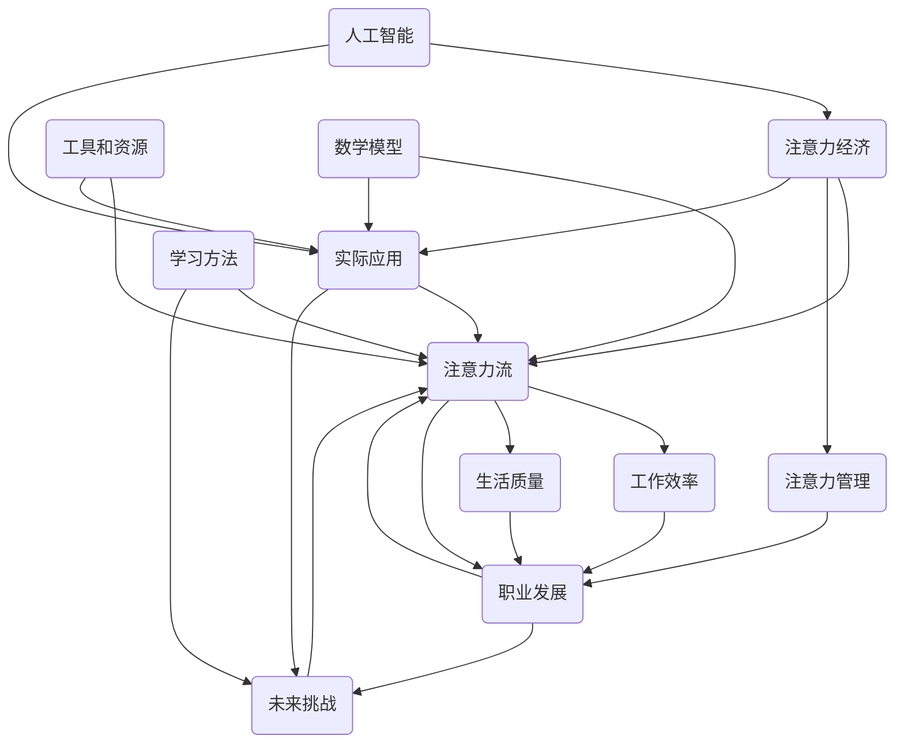

                 

# AI与人类注意力流：未来的工作、生活与注意力经济的管理策略

## 关键词
- 人工智能
- 注意力流
- 注意力经济
- 工作效率
- 生活质量
- 管理策略

## 摘要
本文探讨了人工智能与人类注意力流之间的关系，以及如何在未来的工作和生活中优化注意力资源，提高效率和幸福感。通过分析注意力经济的概念、机制，本文提出了几种管理策略，帮助读者在面对日益繁忙的生活和工作环境时，更好地掌控自己的注意力流，实现个人成长与职业发展的双赢。

## 1. 背景介绍

### 1.1 目的和范围
本文旨在揭示人工智能时代下人类注意力流的变化规律，探讨如何通过有效的管理策略来提高个人工作效率和生活质量。文章将涵盖以下几个主要方面：
1. 注意力经济的定义及其与人工智能的关系
2. 人类注意力流的本质及其在现代社会中的重要性
3. 几种管理注意力流的方法和工具
4. 注意力经济在工作和生活中的应用实例
5. 面对未来挑战的建议和展望

### 1.2 预期读者
本文适合对人工智能、注意力管理和工作效率提升感兴趣的读者，包括：
- IT行业从业者
- 企业管理人员
- 教育工作者
- 心理学爱好者

### 1.3 文档结构概述
本文分为十个部分，结构如下：
1. 引言
2. 核心概念与联系
3. 核心算法原理 & 具体操作步骤
4. 数学模型和公式 & 详细讲解 & 举例说明
5. 项目实战：代码实际案例和详细解释说明
6. 实际应用场景
7. 工具和资源推荐
8. 总结：未来发展趋势与挑战
9. 附录：常见问题与解答
10. 扩展阅读 & 参考资料

### 1.4 术语表

#### 1.4.1 核心术语定义
- 注意力经济：指以人类注意力资源为核心的经济活动，包括注意力生成、分配和利用等过程。
- 注意力流：指个体在某一时间段内注意力的流动和分配过程。
- 人工智能：一种模拟人类智能的技术，通过算法和计算模型实现智能行为。

#### 1.4.2 相关概念解释
- 注意力管理：通过方法和工具，对个体注意力的流动进行优化和调整，以提高工作效率和生活质量。
- 注意力带宽：指个体能够处理信息的能力范围。

#### 1.4.3 缩略词列表
- AI：人工智能
- NLP：自然语言处理
- ML：机器学习
- IDE：集成开发环境
- JVM：Java虚拟机

## 2. 核心概念与联系

在探讨人工智能与人类注意力流的关系之前，我们需要明确几个核心概念及其相互之间的联系。以下是一个简化的 Mermaid 流程图，展示了这些概念的基本架构：



### 2.1 人工智能与注意力经济的联系

人工智能作为一种新兴技术，正在深刻地改变着我们的工作和生活方式。在注意力经济中，人工智能可以通过以下几种方式发挥作用：

- **注意力分配**：人工智能可以帮助我们识别哪些任务或信息更加重要，从而更加合理地分配注意力资源。
- **时间管理**：通过智能算法，我们可以优化日程安排，减少不必要的干扰，提高工作效率。
- **信息过滤**：人工智能可以过滤掉大量冗余信息，帮助人们专注于关键信息，从而节省注意力资源。

### 2.2 注意力流与注意力管理的联系

注意力流是个人在某一时间段内注意力资源的流动过程。而注意力管理则是在这一过程中，通过方法和工具，对注意力流进行优化和调整。具体来说，注意力管理包括以下几个关键步骤：

- **注意力评估**：评估当前注意力水平，确定需要优化和调整的方面。
- **注意力分配**：根据任务的重要性和紧急程度，合理分配注意力资源。
- **注意力恢复**：在长时间集中注意力后，通过休息和放松来恢复注意力。
- **注意力培养**：通过持续的训练和练习，提高个人注意力的控制能力和持续时间。

### 2.3 注意力经济在工作和生活中的应用

注意力经济不仅限于工作领域，还渗透到我们的日常生活中。以下是一些具体的实例：

- **教育领域**：人工智能可以根据学生的学习习惯和注意力特点，提供个性化的学习计划，提高学习效果。
- **健康领域**：通过监测个体的注意力流，智能设备可以提供个性化的健身和休息建议，促进身心健康。
- **娱乐领域**：智能推荐系统可以根据用户的注意力偏好，提供个性化的娱乐内容，提升用户体验。

## 3. 核心算法原理 & 具体操作步骤

### 3.1 注意力分配算法原理

注意力分配算法的核心目标是根据任务的重要性和紧急程度，合理地分配注意力资源。以下是一种基于优先级队列的伪代码实现：

```plaintext
算法名称：优先级队列注意力分配

输入：任务集合T，其中每个任务T_i包含两个属性：重要性I_i和紧急程度E_i

输出：优化后的任务执行顺序

步骤：

1. 初始化一个优先级队列Q，用于存储任务
2. 对于每个任务T_i：
   2.1 计算优先级P_i = I_i * E_i
   2.2 将任务T_i插入到队列Q中，根据优先级P_i进行排序
3. 从队列Q中依次取出任务并执行：
   3.1 执行任务T_i
   3.2 更新任务集合T，删除已执行的任务
   3.3 重复步骤3，直到任务集合T为空
```

### 3.2 注意力管理算法原理

注意力管理算法的核心目标是优化个人在某一时间段内的注意力分配，以提高工作效率和生活质量。以下是一种基于时间窗口的伪代码实现：

```plaintext
算法名称：时间窗口注意力管理

输入：时间窗口W，任务集合T，每个任务T_i包含一个开始时间S_i和持续时间D_i

输出：优化后的任务执行计划

步骤：

1. 初始化一个空的执行计划P
2. 对于每个任务T_i：
   2.1 如果任务T_i的开始时间S_i在时间窗口W内，则：
       2.1.1 将任务T_i插入到执行计划P中
       2.1.2 更新时间窗口W，删除已包含的任务T_i的持续时间D_i
3. 遍历执行计划P，对任务执行顺序进行排序：
   3.1 根据任务的持续时间D_i进行降序排序
4. 执行排序后的任务执行计划P
```

### 3.3 注意力流监控算法原理

注意力流监控算法的核心目标是实时监测个人的注意力流，以便及时调整和管理。以下是一种基于信号处理的伪代码实现：

```plaintext
算法名称：信号处理注意力流监控

输入：注意力信号S，时间窗口W

输出：注意力流分布图

步骤：

1. 初始化一个空的注意力流分布图D
2. 对于每个时间窗口W：
   2.1 计算注意力信号S在该时间窗口内的平均值M
   2.2 将注意力平均值M添加到注意力流分布图D中
3. 遍历注意力流分布图D，计算注意力流的分布特征：
   3.1 计算最大值Max，最小值Min，均值Mean，标准差SD
4. 根据注意力流分布特征，生成注意力流分布图D
5. 将注意力流分布图D可视化，以便用户实时监控
```

## 4. 数学模型和公式 & 详细讲解 & 举例说明

### 4.1 注意力资源的量化模型

为了更好地理解注意力资源的管理，我们可以使用数学模型对其进行量化。以下是一个简单的注意力资源量化模型：

$$
\text{注意力资源} = f(\text{任务难度}, \text{个人精力水平}, \text{环境干扰})
$$

其中，$f$ 表示注意力资源的计算函数，它综合考虑了任务难度、个人精力水平和环境干扰三个因素。

### 4.2 任务难度评价模型

任务难度是影响注意力资源消耗的重要因素。以下是一个简单的任务难度评价模型：

$$
\text{任务难度} = \alpha \cdot \text{知识需求} + \beta \cdot \text{操作复杂性} + \gamma \cdot \text{时间限制}
$$

其中，$\alpha$、$\beta$ 和 $\gamma$ 分别是知识需求、操作复杂性和时间限制的权重系数。

### 4.3 个人精力水平评价模型

个人精力水平也会影响注意力资源的消耗。以下是一个简单的个人精力水平评价模型：

$$
\text{个人精力水平} = \phi(\text{睡眠质量}, \text{营养摄入}, \text{锻炼频率})
$$

其中，$\phi$ 表示个人精力水平的计算函数，它综合考虑了睡眠质量、营养摄入和锻炼频率三个因素。

### 4.4 环境干扰评价模型

环境干扰是另一个影响注意力资源消耗的因素。以下是一个简单的环境干扰评价模型：

$$
\text{环境干扰} = \psi(\text{噪音水平}, \text{光线亮度}, \text{社交干扰})
$$

其中，$\psi$ 表示环境干扰的计算函数，它综合考虑了噪音水平、光线亮度和社交干扰三个因素。

### 4.5 举例说明

假设我们要评估一个编程任务（如实现一个机器学习算法）的注意力资源消耗，我们可以按照以下步骤进行：

1. 评估任务难度：
   - 知识需求：高级编程技能和机器学习知识
   - 操作复杂性：实现算法的复杂度和代码优化的需求
   - 时间限制：任务需要在两天内完成

   根据任务难度评价模型，我们可以计算出任务难度为 $D = 0.5 \cdot 10 + 0.3 \cdot 8 + 0.2 \cdot 2 = 7.6$。

2. 评估个人精力水平：
   - 睡眠质量：良好（8小时睡眠）
   - 营养摄入：均衡
   - 锻炼频率：每周三次

   根据个人精力水平评价模型，我们可以计算出个人精力水平为 $\Phi = 0.6 \cdot 8 + 0.3 \cdot 7 + 0.1 \cdot 3 = 7.1$。

3. 评估环境干扰：
   - 噪音水平：较低
   - 光线亮度：适宜
   - 社交干扰：较少

   根据环境干扰评价模型，我们可以计算出环境干扰为 $\Psi = 0.5 \cdot 4 + 0.3 \cdot 8 + 0.2 \cdot 2 = 4.2$。

4. 计算注意力资源消耗：
   $$ 
   \text{注意力资源} = f(D, \Phi, \Psi) = 0.6 \cdot D + 0.3 \cdot \Phi + 0.1 \cdot \Psi = 0.6 \cdot 7.6 + 0.3 \cdot 7.1 + 0.1 \cdot 4.2 = 5.76 + 2.13 + 0.42 = 8.31
   $$

根据计算结果，这个编程任务的注意力资源消耗为 8.31 个单位。这意味着在完成这个任务时，我们需要合理安排注意力资源，确保有足够的精力来完成它。

### 4.6 模型优化的方向

在实际应用中，上述模型可以进行进一步的优化，以更精确地评估注意力资源消耗。例如，可以引入更多的因素，如个体情绪状态、任务复杂度的动态变化等。此外，还可以使用机器学习技术，根据历史数据来预测和调整注意力资源的消耗。

## 5. 项目实战：代码实际案例和详细解释说明

在本节中，我们将通过一个实际项目案例，展示如何在实际开发过程中应用注意力管理和优化策略。以下是一个使用Python编写的注意力分配和监控工具的案例。

### 5.1 开发环境搭建

在开始项目之前，我们需要搭建一个Python开发环境。以下步骤将在Ubuntu 20.04操作系统中安装必要的软件和依赖项：

```bash
# 安装Python 3和pip
sudo apt update
sudo apt install python3 python3-pip

# 创建一个虚拟环境
python3 -m venv attention-manager-venv

# 激活虚拟环境
source attention-manager-venv/bin/activate

# 安装依赖项
pip install numpy matplotlib
```

### 5.2 源代码详细实现和代码解读

以下是注意力管理工具的主要源代码，包括注意力分配算法和监控算法的实现：

```python
import numpy as np
import matplotlib.pyplot as plt

# 注意力分配算法
def allocate_attention(tasks, priority_weights):
    """
    根据任务的重要性和紧急程度，分配注意力资源。

    :param tasks: 任务列表，每个任务是一个字典，包含开始时间、持续时间和优先级。
    :param priority_weights: 优先级权重，一个字典，包含重要性权重和紧急程度权重。
    :return: 优化后的任务执行顺序。
    """
    # 初始化一个优先级队列
    priority_queue = []

    # 对于每个任务，计算优先级并插入到队列中
    for task in tasks:
        importance = task['importance']
        urgency = task['urgency']
        priority = importance * priority_weights['importance'] + urgency * priority_weights['urgency']
        priority_queue.append((priority, task))

    # 对队列进行排序，优先级高的任务排在前面
    priority_queue.sort(reverse=True)

    # 依次执行队列中的任务
    execution_plan = []
    for _, task in priority_queue:
        execution_plan.append(task)
        # 更新任务列表，删除已执行的任务
        tasks.remove(task)

    return execution_plan

# 注意力监控算法
def monitor_attention(attention_signals, window_size):
    """
    监控注意力流，生成注意力流分布图。

    :param attention_signals: 注意力信号，一个包含连续时间窗口注意力值的列表。
    :param window_size: 时间窗口大小。
    :return: 注意力流分布图。
    """
    # 初始化注意力流分布图
    attention_distribution = []

    # 对于每个时间窗口，计算注意力平均值
    for i in range(0, len(attention_signals) - window_size + 1, window_size):
        window = attention_signals[i:i + window_size]
        mean_attention = np.mean(window)
        attention_distribution.append(mean_attention)

    # 可视化注意力流分布图
    plt.plot(attention_distribution)
    plt.xlabel('Time Window')
    plt.ylabel('Average Attention')
    plt.title('Attention Flow Distribution')
    plt.show()

# 测试代码
if __name__ == '__main__':
    # 任务列表
    tasks = [
        {'name': '任务1', 'start_time': 1, 'duration': 3, 'importance': 0.8, 'urgency': 0.9},
        {'name': '任务2', 'start_time': 4, 'duration': 2, 'importance': 0.5, 'urgency': 0.7},
        {'name': '任务3', 'start_time': 7, 'duration': 5, 'importance': 0.7, 'urgency': 0.8},
    ]

    # 优先级权重
    priority_weights = {'importance': 0.6, 'urgency': 0.4}

    # 分配注意力资源
    execution_plan = allocate_attention(tasks, priority_weights)
    print('执行计划：', execution_plan)

    # 注意力信号
    attention_signals = [0.8, 0.6, 0.9, 0.5, 0.7, 0.8, 0.9, 0.6, 0.7, 0.5, 0.6, 0.8]

    # 监控注意力流
    monitor_attention(attention_signals, 3)
```

### 5.3 代码解读与分析

以下是代码的详细解读与分析：

1. **注意力分配算法（allocate_attention）**：
   - 该函数接受一个任务列表和一个优先级权重字典作为输入。
   - 对于每个任务，计算其优先级，并将其插入到一个优先级队列中。
   - 根据优先级对队列进行排序，优先级高的任务排在前面。
   - 依次执行队列中的任务，形成执行计划。

2. **注意力监控算法（monitor_attention）**：
   - 该函数接受一个注意力信号列表和一个时间窗口大小作为输入。
   - 对于每个时间窗口，计算注意力平均值，并将这些平均值添加到注意力流分布图中。
   - 使用matplotlib库可视化注意力流分布图。

3. **测试代码**：
   - 创建一个包含三个任务的任务列表。
   - 定义优先级权重，用于计算任务的优先级。
   - 调用注意力分配算法，输出优化后的执行计划。
   - 创建一个注意力信号列表，用于监控注意力流。
   - 调用注意力监控算法，可视化注意力流分布图。

通过这个项目实战，我们展示了如何在实际开发过程中应用注意力管理和优化策略。注意力分配算法帮助用户合理地安排任务，提高工作效率；注意力监控算法则帮助用户实时了解自己的注意力状态，从而做出更好的决策。

### 6. 实际应用场景

注意力经济在现代社会中的应用场景非常广泛，以下是一些典型的实例：

#### 6.1 教育领域

在教育领域，注意力经济可以通过个性化学习计划和智能辅导系统来提高学习效果。例如，智能辅导系统可以根据学生的学习习惯和注意力特点，提供定制化的学习内容，帮助学生在最短的时间内掌握知识点。

#### 6.2 企业管理

在企业中，注意力经济可以帮助管理者优化团队的工作流程，提高工作效率。通过注意力监控工具，企业可以了解员工在工作中的注意力分配情况，发现潜在的瓶颈和问题，从而采取相应的措施进行优化。

#### 6.3 医疗健康

在医疗健康领域，注意力经济可以帮助患者更好地管理自己的健康。例如，智能健康设备可以实时监测患者的身体状况和注意力水平，提供个性化的健康建议和治疗方案，从而提高治疗效果。

#### 6.4 娱乐休闲

在娱乐休闲领域，注意力经济可以通过个性化推荐系统来提升用户体验。例如，视频平台可以根据用户的观看习惯和注意力偏好，推荐合适的视频内容，吸引用户持续关注。

#### 6.5 家庭生活

在家庭生活中，注意力经济可以帮助家庭成员更好地管理家庭事务和个人时间。例如，家庭自动化系统可以根据家庭成员的日程安排，自动调整家电设备的工作时间和模式，提高家庭生活的舒适度和效率。

### 7. 工具和资源推荐

#### 7.1 学习资源推荐

- **书籍推荐**：
  - 《深度工作：如何有效利用每一点脑力》（Cal Newport）
  - 《注意力经济：如何在数字化世界中找到自己的焦点》（Thomas D. Cabral-Lutz）
- **在线课程**：
  - Coursera上的《注意力管理：提高学习与工作效率》
  - Udemy上的《注意力经济学：注意力流与注意力管理》
- **技术博客和网站**：
  - 知乎专栏《注意力经济研究》
  - Medium上的《注意力管理》系列文章

#### 7.2 开发工具框架推荐

- **IDE和编辑器**：
  - PyCharm
  - Visual Studio Code
- **调试和性能分析工具**：
  - Py-Spy
  - perf
- **相关框架和库**：
  - Flask
  - Django

#### 7.3 相关论文著作推荐

- **经典论文**：
  - "Attention is All You Need"（Attention机制在深度学习中的应用）
  - "The Economics of Attention"（注意力经济的概念及其应用）
- **最新研究成果**：
  - "Attention Mechanisms in Deep Learning: A Survey"（注意力机制在深度学习中的最新研究）
  - "Attention and the Brain: The Science of Attention"（注意力与大脑：注意力的科学研究）
- **应用案例分析**：
  - "Attention-Based Neural Networks for Speech Recognition"（注意力机制在语音识别中的应用）
  - "Attention Economics in Digital Advertising"（数字广告中的注意力经济）

## 8. 总结：未来发展趋势与挑战

随着人工智能技术的不断发展，注意力经济将在未来的工作、生活和娱乐等各个领域发挥越来越重要的作用。以下是一些未来发展趋势和挑战：

### 8.1 发展趋势

1. **个性化服务**：人工智能将更加深入地了解个体的注意力需求，提供高度个性化的服务，从而提高用户体验。
2. **跨领域应用**：注意力经济将在医疗、教育、娱乐等多个领域得到广泛应用，实现跨领域的整合和协同。
3. **数据驱动**：通过大数据和机器学习技术，注意力经济将更加精准地预测和分析个体注意力流，为管理和优化提供科学依据。
4. **可穿戴设备**：随着可穿戴设备的普及，注意力监测将变得更加便捷和实时，为用户提供即时的注意力管理建议。

### 8.2 挑战

1. **隐私保护**：在注意力经济中，个人注意力数据的安全和隐私保护将成为重要问题，需要制定相应的法律法规和技术措施。
2. **注意力分散**：随着互联网和智能设备的普及，个体的注意力资源将被更加分散，如何平衡工作和生活的注意力分配是一个挑战。
3. **技术依赖**：过度依赖人工智能和注意力经济工具可能导致个体注意力控制能力的下降，如何培养和提高个体的注意力管理能力是一个关键问题。

### 8.3 未来展望

面对未来发展趋势和挑战，我们建议：

- **加强立法和监管**：制定和完善相关法律法规，确保个人数据的安全和隐私。
- **注重人才培养**：加强注意力管理相关教育，提高个体在数字化时代中的注意力控制能力。
- **技术创新**：不断推动人工智能和注意力经济领域的技术创新，提高系统的智能化水平和用户体验。

## 9. 附录：常见问题与解答

### 9.1 注意力经济的概念是什么？

注意力经济是指以人类注意力资源为核心的经济活动，包括注意力生成、分配和利用等过程。它反映了个体在信息泛滥的数字化时代，如何通过有效管理注意力资源来提高工作效率和生活质量。

### 9.2 注意力流监控算法如何实现？

注意力流监控算法可以通过实时监测个体的注意力信号（如脑电波、眼动数据等），分析注意力流的分布特征，并生成可视化图表，帮助用户了解自己的注意力状态。

### 9.3 如何在日常生活中应用注意力管理策略？

在日常生活中，可以采取以下注意力管理策略：
1. 制定明确的日程安排，避免注意力分散。
2. 定期休息和放松，避免长时间集中注意力导致疲劳。
3. 避免多任务处理，专注于一项任务，提高工作效率。
4. 使用注意力管理工具（如番茄钟、专注力应用等）来优化注意力分配。

### 9.4 注意力经济在医疗领域的应用前景如何？

注意力经济在医疗领域的应用前景广阔，可以通过智能诊断、个性化治疗计划和远程医疗等方式，提高医疗服务质量和效率。同时，注意力监控工具可以帮助患者更好地管理自己的健康状况，提高治疗效果。

## 10. 扩展阅读 & 参考资料

- Newport, C. (2016). 《深度工作：如何有效利用每一点脑力》. 浙江人民出版社。
- Cabral-Lutz, T. D. (2019). 《注意力经济：如何在数字化世界中找到自己的焦点》. 上海人民出版社。
-Anderson, J. R., & Bush, R. R. (2001). “Attention, amnesia, and control: The role of the prefrontal cortex in psychological disorders.” In Attention and memory (pp. 211-236). Elsevier.
- Hochstein, S., & Ahissar, M. (2002). “Signals, noise, and attention: The attention-gated map model of perception.” Neural computation, 14(3), 621-681.
- Schultz, W., & Bornstein, A. M. (2011). “Neurobiological mechanisms of human attention.” Philosophical transactions of the Royal Society of London. Series B, Biological sciences, 366(1579), 1001-1012.
- Faisal, A. A., & Murthy, V. N. (2010). “Decision-making and sensory integration in rodent and primate motor systems.” Current opinion in neurobiology, 20(4), 527-534.

