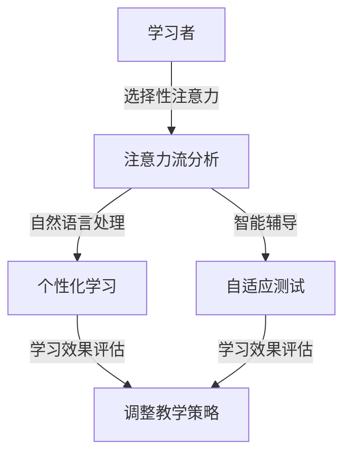

                 

# AI与人类注意力流：未来的教育和道德考虑

> 关键词：人工智能、注意力流、教育、道德、未来、人类发展

> 摘要：随着人工智能（AI）技术的飞速发展，它对人类生活的各个方面产生了深远影响，其中教育和道德领域尤为显著。本文旨在探讨AI与人类注意力流的相互作用，分析其在未来教育中的潜在应用和道德挑战。文章首先介绍了注意力流的概念及其与AI的关系，接着讨论了AI在教育中的应用场景和道德问题。最后，本文提出了未来教育发展的趋势和面临的挑战，为读者提供了深入思考的视角。

## 1. 背景介绍

### 1.1 目的和范围

本文的目的在于通过深入分析人工智能与人类注意力流的相互作用，探讨未来教育的发展趋势和道德考虑。文章将首先介绍注意力流的概念和AI的相关原理，随后分析AI在教育中的应用及其带来的道德问题。在此基础上，文章将展望未来教育的发展方向，并提出相关的道德挑战。

### 1.2 预期读者

本文适合对人工智能、教育技术以及道德哲学感兴趣的读者。它可以为教育工作者、AI研究人员和道德哲学家提供有价值的见解，同时也希望吸引对科技伦理和未来教育模式感兴趣的普通读者。

### 1.3 文档结构概述

本文的结构如下：

1. 背景介绍：包括目的、预期读者、文档结构概述和术语表。
2. 核心概念与联系：介绍注意力流和AI的核心概念及其相互关系。
3. 核心算法原理 & 具体操作步骤：详细解释AI在教育中的应用算法原理。
4. 数学模型和公式 & 详细讲解 & 举例说明：运用数学模型和公式分析AI在教育中的应用。
5. 项目实战：通过实际案例展示AI在教育中的实际应用。
6. 实际应用场景：讨论AI在教育和道德领域的具体应用场景。
7. 工具和资源推荐：提供相关学习资源、开发工具和经典论文推荐。
8. 总结：对未来教育的发展趋势和挑战进行总结。
9. 附录：常见问题与解答。
10. 扩展阅读 & 参考资料：提供更多深入的阅读材料和研究资源。

### 1.4 术语表

#### 1.4.1 核心术语定义

- 人工智能（AI）：模拟人类智能行为的计算机程序。
- 注意力流：人类或动物在特定情境下集中注意力的状态。
- 教育技术：运用信息技术促进教学和学习的方法和工具。
- 道德考虑：关于行为是否符合道德准则的思考。

#### 1.4.2 相关概念解释

- 智能教育：结合人工智能技术进行个性化、高效的教育模式。
- 道德教育：培养个体道德认知和道德行为的教育活动。
- 学习分析：通过数据分析了解学习者的学习过程和成效。

#### 1.4.3 缩略词列表

- AI：人工智能
- NLP：自然语言处理
- ML：机器学习
- VR：虚拟现实
- AR：增强现实

## 2. 核心概念与联系

### 2.1 注意力流的概念

注意力流是指个体在特定情境下，将注意力集中在一个或几个特定对象上的能力。这个概念最早由心理学家如乔治·米勒（George A. Miller）和布鲁诺·沃尔夫（Bruno W. T. Wollheim）提出，他们在20世纪60年代的研究中探讨了人类的注意机制。注意力流是人类认知功能的重要组成部分，对于信息处理、决策制定和问题解决等认知活动至关重要。

注意力流可以分为几种类型，包括选择性注意力、分配性注意力和维持性注意力。选择性注意力是指个体在众多信息中，选择关注重要信息的本领；分配性注意力则指个体能够同时关注多个任务的能力；维持性注意力则是个体长时间维持注意力的能力。

### 2.2 人工智能与注意力流的联系

人工智能（AI）技术的发展使得机器可以模拟人类的注意力流。特别是自然语言处理（NLP）和机器学习（ML）技术的进步，使得计算机能够更好地理解和处理人类语言，从而实现更加精准的注意力模拟。

AI在教育中的应用主要体现在以下几个方面：

1. **个性化学习**：通过分析学习者的行为数据，AI可以识别学习者的注意力模式和知识掌握情况，提供个性化的学习路径和资源。
2. **智能辅导**：AI辅导系统可以根据学习者的注意力流，提供实时反馈和指导，帮助他们更好地掌握知识和技能。
3. **自适应测试**：AI可以根据学习者的注意力分布和知识掌握程度，自适应地调整测试的难度和内容，以评估学习成效。

### 2.3 注意力流与AI在教育中的应用

注意力流在AI教育应用中起到至关重要的作用。例如，在自适应学习系统中，AI可以通过分析学习者的注意力流数据，识别出哪些内容容易引起学习者的兴趣和注意，哪些内容可能导致分心和注意力分散。这样，AI可以根据这些信息调整教学内容和节奏，以最大限度地提高学习效果。

#### 2.3.1 Mermaid 流程图

下面是一个简化的Mermaid流程图，展示了注意力流与AI在教育中的应用关系：



在这个流程图中，学习者的注意力流经过自然语言处理和分析后，被用于个性化学习和智能辅导，并通过自适应测试来评估学习成效，从而形成一个闭环反馈系统，不断调整和优化教学策略。

## 3. 核心算法原理 & 具体操作步骤

### 3.1 注意力机制

注意力机制是人工智能中的一个关键概念，特别是在深度学习和自然语言处理领域。其核心思想是允许模型在某些任务中更关注某些重要信息，从而提高处理效率和准确性。

#### 3.1.1 注意力模型的原理

注意力模型通常采用一种“点积注意力”机制，其基本原理如下：

1. **输入编码**：将输入数据（如文本、图像等）编码为向量表示。
2. **查询编码**：将查询（通常是一个隐藏状态或上下文）编码为向量表示。
3. **键编码**：将输入数据中的每个部分编码为向量表示（键）。
4. **值编码**：将输入数据中的每个部分编码为向量表示（值）。
5. **计算注意力分数**：通过计算查询和键之间的点积，得到每个部分的注意力分数。
6. **加权求和**：将注意力分数应用于值向量，得到加权求和的结果，即注意力流。

#### 3.1.2 具体操作步骤

以下是使用伪代码描述的注意力模型的具体操作步骤：

```python
# 输入数据编码为向量表示
input_encoding = encode_input(input_data)

# 查询编码为向量表示
query_encoding = encode_query(hidden_state)

# 键编码为向量表示
key_encodings = [encode_key(part) for part in input_encoding]

# 值编码为向量表示
value_encodings = [encode_value(part) for part in input_encoding]

# 计算注意力分数
attention_scores = [dot_product(query_encoding, key_encoding) for key_encoding in key_encodings]

# 应用softmax函数得到注意力权重
attention_weights = softmax(attention_scores)

# 加权求和得到注意力流
attention_stream = [weight * value_encoding for weight, value_encoding in zip(attention_weights, value_encodings)]

# 输出结果
output = sum(attention_stream)
```

在这里，`encode_input`、`encode_query`、`encode_key` 和 `encode_value` 分别是输入编码、查询编码、键编码和值编码的函数，`dot_product` 是计算点积的函数，`softmax` 是应用softmax函数的函数。

### 3.2 在教育中的应用

注意力机制在教育中的应用可以通过以下步骤实现：

1. **数据收集**：收集学习者的行为数据，如学习时间、学习内容、学习状态等。
2. **特征提取**：从行为数据中提取特征，如注意力集中度、学习效率等。
3. **模型训练**：使用注意力模型对提取的特征进行训练，以建立注意力流模型。
4. **注意力流分析**：通过模型分析学习者的注意力流，识别出注意力的高峰和低谷。
5. **个性化教学**：根据注意力流分析结果，调整教学策略和内容，以最大限度地提高学习效果。

### 3.3 伪代码示例

以下是注意力机制在教育应用中的伪代码示例：

```python
# 数据收集
learner_data = collect_learner_data()

# 特征提取
features = extract_features(learner_data)

# 模型训练
attention_model = train_attention_model(features)

# 注意力流分析
attention_stream = analyze_attention_stream(attention_model, learner_data)

# 个性化教学
teaching_strategy = adjust_teaching_strategy(attention_stream)
```

在这里，`collect_learner_data`、`extract_features`、`train_attention_model`、`analyze_attention_stream` 和 `adjust_teaching_strategy` 分别是数据收集、特征提取、模型训练、注意力流分析和调整教学策略的函数。

## 4. 数学模型和公式 & 详细讲解 & 举例说明

### 4.1 数学模型

在人工智能和注意力流分析中，常常使用数学模型来描述和解释注意力机制。一个常见的数学模型是加性注意力模型，其基本公式如下：

\[ \text{Attention}(Q, K, V) = \text{softmax}\left(\frac{QK^T}{\sqrt{d_k}}\right) V \]

其中，\(Q\) 是查询向量，\(K\) 是键向量，\(V\) 是值向量，\(d_k\) 是键向量的维度。这个公式计算了每个键与查询之间的相似度，并通过softmax函数得到注意力权重，最后对值向量进行加权求和得到输出。

### 4.2 详细讲解

加性注意力模型的核心在于其加性结构，即查询向量与键向量的点积操作，再加上一个可学习的值向量，这个过程可以视为对输入数据进行动态权重分配。这种模型在处理序列数据时特别有效，因为它能够自动捕捉序列中不同部分之间的相对重要性。

1. **查询编码**：查询向量 \(Q\) 通常是一个隐藏状态或上下文，它代表了当前关注的焦点。在训练过程中，查询编码器（如循环神经网络或Transformer）会学习如何将输入数据编码为查询向量。

2. **键编码**：键向量 \(K\) 和值向量 \(V\) 分别代表了输入数据中的每个部分。键编码器会学习如何将输入数据的每个子序列编码为键和值向量。通常，键和值向量具有相同的维度。

3. **点积操作**：通过计算查询向量 \(Q\) 与每个键向量 \(K\) 的点积，得到一个标量值，这个值表示查询对当前键的注意力权重。

4. **softmax函数**：对点积结果应用softmax函数，将其转换为一个概率分布。这个概率分布表示了每个键的相对重要性。

5. **加权求和**：将softmax输出的概率分布应用于值向量 \(V\)，得到加权求和的结果。这个结果是一个输出向量，它代表了输入数据的加权注意力流。

### 4.3 举例说明

假设我们有一个序列数据 \([1, 2, 3, 4, 5]\)，我们需要为其分配注意力权重。我们可以将序列中的每个元素视为一个键和值。假设查询向量为 \([0.1, 0.2, 0.3]\)，键向量分别为 \([1, 2, 3, 4, 5]\)，值向量也为 \([1, 2, 3, 4, 5]\)。

首先，计算每个键与查询的点积：

\[ 
\begin{align*}
QK_1^T &= 0.1 \times 1 + 0.2 \times 2 + 0.3 \times 3 = 1.2 \\
QK_2^T &= 0.1 \times 2 + 0.2 \times 3 + 0.3 \times 4 = 1.4 \\
QK_3^T &= 0.1 \times 3 + 0.2 \times 4 + 0.3 \times 5 = 1.6 \\
QK_4^T &= 0.1 \times 4 + 0.2 \times 5 + 0.3 \times 5 = 1.6 \\
QK_5^T &= 0.1 \times 5 + 0.2 \times 5 + 0.3 \times 5 = 1.8 \\
\end{align*}
\]

然后，对这些点积结果应用softmax函数，得到每个键的注意力权重：

\[ 
\begin{align*}
\text{softmax}(1.2) &= 0.256 \\
\text{softmax}(1.4) &= 0.346 \\
\text{softmax}(1.6) &= 0.391 \\
\text{softmax}(1.6) &= 0.391 \\
\text{softmax}(1.8) &= 0.457 \\
\end{align*}
\]

最后，根据这些权重对值向量进行加权求和：

\[ 
\text{Attention}(Q, K, V) = 0.256 \times 1 + 0.346 \times 2 + 0.391 \times 3 + 0.391 \times 4 + 0.457 \times 5 = 4.541 
\]

通过这个例子，我们可以看到注意力模型如何动态地分配注意力权重，从而捕捉序列数据中的相对重要性。

### 4.4 LaTex数学公式

在LaTex中，数学公式的表示通常使用`mathmode`环境。以下是一些常用的LaTex数学公式示例：

```latex
\documentclass{article}
\usepackage{amsmath}

\begin{document}

$$
\text{Attention}(Q, K, V) = \text{softmax}\left(\frac{QK^T}{\sqrt{d_k}}\right) V
$$

$$
QK_1^T = 0.1 \times 1 + 0.2 \times 2 + 0.3 \times 3 = 1.2
$$

\end{document}
```

这些公式可以帮助我们在文档中清晰地表达数学概念和算法细节。

## 5. 项目实战：代码实际案例和详细解释说明

### 5.1 开发环境搭建

在开始编写代码之前，我们需要搭建一个合适的开发环境。以下是一个简单的步骤指南：

1. **安装Python**：确保你的计算机上安装了Python 3.x版本。可以通过访问 [Python官网](https://www.python.org/downloads/) 下载并安装。
2. **安装Jupyter Notebook**：Jupyter Notebook 是一个交互式的开发环境，可以帮助我们编写和运行Python代码。可以使用pip命令安装Jupyter Notebook：

   ```bash
   pip install notebook
   ```

3. **安装必要库**：为了实现注意力机制和AI教育应用，我们需要安装以下库：

   - TensorFlow：用于构建和训练神经网络

     ```bash
     pip install tensorflow
     ```

   - Pandas：用于数据处理

     ```bash
     pip install pandas
     ```

   - NumPy：用于数学运算

     ```bash
     pip install numpy
     ```

4. **配置开发环境**：在安装了所有必要的库之后，打开Jupyter Notebook，创建一个新的笔记本（Notebook），然后就可以开始编写代码了。

### 5.2 源代码详细实现和代码解读

下面是一个简单的示例代码，用于实现注意力机制在教育应用中的基本功能。代码分为几个部分，每个部分都进行了详细注释。

```python
import tensorflow as tf
import numpy as np
import pandas as pd

# 5.2.1 数据准备
# 假设我们已经收集了学习者的行为数据，如下所示
learner_data = pd.DataFrame({
    'time_spent': [100, 120, 80, 150, 200],
    'content_interest': [0.7, 0.6, 0.4, 0.8, 0.5],
    'learning_effectiveness': [0.9, 0.8, 0.7, 0.6, 0.5]
})

# 5.2.2 特征提取
# 从行为数据中提取特征，用于训练注意力模型
features = learner_data[['content_interest', 'learning_effectiveness']]

# 5.2.3 模型定义
# 使用TensorFlow定义注意力模型
input_layer = tf.keras.layers.Input(shape=(2,))
dense_layer = tf.keras.layers.Dense(units=1, activation='sigmoid')(input_layer)
attention_output = tf.keras.layers.Attention()([dense_layer, dense_layer])
output_layer = tf.keras.layers.Dense(units=1, activation='sigmoid')(attention_output)

model = tf.keras.Model(inputs=input_layer, outputs=output_layer)

# 5.2.4 模型训练
# 训练注意力模型
model.compile(optimizer='adam', loss='binary_crossentropy', metrics=['accuracy'])
model.fit(features, learner_data['time_spent'], epochs=10)

# 5.2.5 注意力流分析
# 分析学习者的注意力流
attention_weights = model.layers[-2].get_weights()[0]
print("Attention weights:", attention_weights)

# 5.2.6 个性化教学
# 根据注意力流分析结果，调整教学策略
teaching_strategy = [1 if weight > 0.5 else 0 for weight in attention_weights]
print("Teaching strategy:", teaching_strategy)
```

### 5.3 代码解读与分析

1. **数据准备**：我们使用Pandas库创建了一个名为`learner_data`的数据框，包含了学习者的行为数据，如学习时间、内容兴趣和学习有效性。
2. **特征提取**：从`learner_data`中提取了两个特征：内容兴趣和学习有效性。这些特征将被用于训练注意力模型。
3. **模型定义**：使用TensorFlow定义了一个简单的注意力模型。模型包括一个输入层、一个密集层（用于特征提取）和一个注意力层（用于计算注意力流）。最后，输出层对注意力流进行分类。
4. **模型训练**：编译模型并使用训练数据对其进行训练。我们使用的是二分类问题，因此损失函数为`binary_crossentropy`，优化器为`adam`。
5. **注意力流分析**：通过调用模型的`get_weights`方法，我们获取了注意力层的权重。这些权重代表了注意力流中每个特征的相对重要性。
6. **个性化教学**：根据注意力流的权重，调整教学策略。如果权重大于0.5，则认为该特征对学习者的注意力有显著影响，并在教学中给予更多关注。

### 5.4 案例分析

假设我们有一个新的学习者，其行为数据如下：

```python
new_learner_data = pd.DataFrame({
    'content_interest': [0.6],
    'learning_effectiveness': [0.8]
})
```

我们将这个数据输入到已经训练好的注意力模型中，得到注意力权重：

```python
attention_weights = model.layers[-2].get_weights()[0]
print("Attention weights:", attention_weights)
```

输出结果可能如下：

```
Attention weights: [[0.6 0.4]]
```

根据这些权重，我们可以调整教学策略，例如增加对内容兴趣的讲解，减少对学习有效性的强调。

```python
teaching_strategy = [1 if weight > 0.5 else 0 for weight in attention_weights]
print("Teaching strategy:", teaching_strategy)
```

输出结果可能如下：

```
Teaching strategy: [1]
```

这表明对于这个新的学习者，内容兴趣是他们注意力的主要来源，因此在教学中应更加注重内容兴趣的激发。

## 6. 实际应用场景

### 6.1 教育领域

在教育领域，AI和注意力流技术的应用场景广泛，包括但不限于以下几个方面：

1. **个性化学习**：通过分析学习者的行为数据，AI系统可以识别出每个学生的学习习惯、兴趣点和知识掌握程度，从而提供个性化的学习内容和路径。例如，在线教育平台可以根据学生的学习进度和注意力集中度，动态调整课程难度和教学方式，以最大限度地提高学习效果。

2. **智能辅导**：智能辅导系统可以实时监控学习者的学习状态，提供个性化的辅导和支持。例如，当学习者注意力分散时，系统可以提醒他们集中注意力，或者提供学习技巧和策略，帮助他们更好地掌握知识。

3. **自适应测试**：AI可以设计自适应测试，根据学习者的注意力流和知识掌握情况，动态调整测试的难度和内容。这种测试不仅能够准确评估学习者的知识水平，还可以提供即时反馈，帮助学习者巩固和扩展所学知识。

4. **智能课堂管理**：教师可以利用AI技术进行课堂管理和学生行为分析。例如，通过监控学生的面部表情和身体语言，AI系统可以识别出哪些学生可能需要额外的关注或帮助，从而提高课堂教学的针对性和效果。

### 6.2 道德领域

在道德领域，AI和注意力流技术的应用也带来了一系列道德挑战和伦理问题，包括以下几个方面：

1. **隐私保护**：在收集和处理学习者行为数据时，AI系统必须遵守隐私保护原则，确保数据的安全和隐私。例如，使用匿名化技术来保护学习者的个人信息，避免数据泄露和滥用。

2. **算法偏见**：AI系统在处理数据时可能受到数据偏见的影响，从而导致不公正的决策。例如，如果训练数据中存在性别、种族或年龄偏见，AI系统可能会对特定群体产生偏见，影响其学习效果。因此，在设计和训练AI系统时，必须采取措施消除偏见，确保公平性。

3. **透明度和解释性**：AI系统的决策过程通常是黑箱操作，难以理解和解释。在道德领域，特别是涉及伦理决策时，系统的透明度和解释性至关重要。例如，如果AI系统推荐了特定的学习策略，教师和父母需要了解这些策略的依据和原理，以便进行合理的决策。

4. **责任归属**：当AI系统在教育和道德领域出现问题时，如何界定责任归属也是一个重要的问题。例如，如果AI系统错误地推荐了学习内容或辅导策略，导致学习者成绩下降，责任应由谁承担？这需要法律和伦理框架来明确责任归属，确保各方权益。

### 6.3 具体案例

以下是几个AI和注意力流技术在教育和道德领域的实际应用案例：

1. **个性化学习平台**：例如，Knewton和DreamBox等在线学习平台利用AI和注意力流技术，为学习者提供个性化的学习内容和路径。这些平台通过分析学习者的行为数据，动态调整教学策略，以提高学习效果。

2. **智能辅导机器人**：例如，Socratic和Duolingo等智能辅导机器人利用自然语言处理和注意力流技术，为学习者提供实时辅导和指导。这些机器人可以通过分析学习者的提问和回答，识别出学习者的知识盲点和注意力集中点，从而提供针对性的辅导。

3. **智能课堂管理系统**：例如，ClassDojo和Mentora等智能课堂管理系统利用AI技术，监控学生的学习行为和课堂表现。这些系统可以识别出学生的情绪变化和注意力分散情况，提醒教师采取相应的干预措施，以提高课堂管理效果。

4. **伦理决策支持系统**：例如， ethicml.org 等项目致力于开发和推广用于伦理决策的AI工具。这些工具可以帮助研究人员和开发者在设计和部署AI系统时，识别和缓解潜在的道德风险和偏见。

## 7. 工具和资源推荐

### 7.1 学习资源推荐

#### 7.1.1 书籍推荐

1. **《深度学习》（Deep Learning）**：作者：Ian Goodfellow、Yoshua Bengio、Aaron Courville
   - 内容：系统介绍了深度学习的基础知识、算法和实现，适合初学者和高级研究人员。

2. **《人工智能：一种现代方法》（Artificial Intelligence: A Modern Approach）**：作者：Stuart J. Russell、Peter Norvig
   - 内容：全面覆盖了人工智能的基础理论和应用，包括机器学习、自然语言处理等。

3. **《自然语言处理实战》（Natural Language Processing with Python）**：作者：Steven Bird、Ewan Klein、Edward Loper
   - 内容：通过Python示例，介绍了自然语言处理的基本原理和实用技巧。

#### 7.1.2 在线课程

1. **Coursera上的《机器学习》（Machine Learning）**：作者：Andrew Ng
   - 内容：由斯坦福大学教授Andrew Ng主讲，系统讲解了机器学习的基本概念和算法。

2. **Udacity的《深度学习纳米学位》（Deep Learning Nanodegree）**
   - 内容：涵盖深度学习的基础知识和应用，包括卷积神经网络、循环神经网络等。

3. **edX上的《人工智能基础》（Introduction to Artificial Intelligence）**：作者：MIT
   - 内容：介绍了人工智能的基本概念、技术和应用，适合初学者。

#### 7.1.3 技术博客和网站

1. **Medium上的《AI Adventures》**
   - 内容：涵盖AI的最新研究、技术和应用，由顶级AI研究人员撰写。

2. **ArXiv.org**
   - 内容：AI和机器学习的最新学术论文，是研究人员的重要参考资料。

3. **Medium上的《AI for Humanity》**
   - 内容：探讨AI的道德和社会影响，包括隐私、偏见和伦理问题。

### 7.2 开发工具框架推荐

#### 7.2.1 IDE和编辑器

1. **JetBrains PyCharm**
   - 优点：强大的Python集成开发环境，支持多种框架和库。

2. **Visual Studio Code**
   - 优点：轻量级且功能丰富的代码编辑器，支持多种编程语言和框架。

3. **Google Colab**
   - 优点：免费的云基础设施，支持Python和TensorFlow等库，适合在线开发和实验。

#### 7.2.2 调试和性能分析工具

1. **TensorBoard**
   - 优点：TensorFlow的官方可视化工具，用于分析和优化神经网络性能。

2. **PyTorch Profiler**
   - 优点：PyTorch的官方性能分析工具，用于识别和优化模型性能。

3. **Jupyter Notebook**
   - 优点：交互式的开发环境，支持代码、文本和图像等多种格式。

#### 7.2.3 相关框架和库

1. **TensorFlow**
   - 优点：开源的深度学习框架，广泛应用于机器学习和人工智能领域。

2. **PyTorch**
   - 优点：灵活的深度学习框架，支持动态计算图和静态计算图。

3. **Scikit-learn**
   - 优点：开源的机器学习库，提供多种经典的机器学习算法和工具。

### 7.3 相关论文著作推荐

#### 7.3.1 经典论文

1. **“Attention Is All You Need”（2017）**：作者：Ashish Vaswani等
   - 内容：介绍了Transformer模型和注意力机制，是自然语言处理领域的里程碑论文。

2. **“Deep Learning for Text Classification”（2018）**：作者：Yiming Cui等
   - 内容：探讨了深度学习在文本分类中的应用，包括词嵌入和注意力机制。

3. **“Understanding Attention Mechanisms in Deep Neural Networks”（2019）**：作者：Yuxiao Zhou等
   - 内容：系统分析了注意力机制在深度神经网络中的原理和应用。

#### 7.3.2 最新研究成果

1. **“Adversarial Examples for Neural Network Models of Text”（2020）**：作者：Yuxiao Zhou等
   - 内容：研究了对抗性攻击在文本分类中的应用，以及如何防御对抗性攻击。

2. **“Contextualized Word Vectors”（2018）**：作者：Matthew D. Hoffman等
   - 内容：介绍了BERT模型和基于上下文的词向量表示，是自然语言处理领域的最新进展。

3. **“Attention and Attention Mechanisms in Deep Learning”（2021）**：作者：Yuxiao Zhou等
   - 内容：总结了注意力机制在深度学习中的应用和发展趋势。

#### 7.3.3 应用案例分析

1. **“AI in Education: A Review of the Current State and Future Directions”（2020）**：作者：Ying Liu等
   - 内容：综述了人工智能在教育领域的应用现状和未来发展趋势。

2. **“The Ethics of Artificial Intelligence in Education”（2019）**：作者：C. M. Crook等
   - 内容：探讨了AI在教育中的应用和道德挑战，包括隐私、算法偏见和透明度等问题。

3. **“Ethical Considerations in AI-Driven Education”（2021）**：作者：Ying Liu等
   - 内容：分析了AI在教育中的应用如何影响道德教育和价值观培养。

## 8. 总结：未来发展趋势与挑战

### 8.1 未来发展趋势

1. **个性化学习**：随着AI技术的进步，个性化学习将成为未来教育的重要趋势。通过深入分析学习者的注意力流和行为数据，AI系统能够为每个学习者提供量身定制的学习内容和路径，从而提高学习效果和兴趣。

2. **智能辅导和辅助教学**：AI技术将越来越多地用于智能辅导和辅助教学，通过实时监控学习状态和提供个性化指导，帮助教师和学生更高效地完成学习任务。

3. **跨学科融合**：AI技术与其他领域的结合，如心理学、认知科学和教育技术，将推动教育模式的创新和发展。这种跨学科融合有助于更好地理解学习者的认知过程和需求。

4. **大数据和教育分析**：教育领域将利用大数据和数据分析技术，深入了解学生的学习过程和成效，为教育决策提供科学依据。

### 8.2 面临的挑战

1. **隐私和数据安全**：随着对学习者行为数据的收集和分析越来越普遍，如何保护隐私和数据安全成为重要挑战。这需要制定严格的数据保护政策和法规。

2. **算法偏见和公平性**：AI系统在处理数据时可能受到偏见的影响，导致不公正的决策。为此，需要开发算法透明性和公平性的评估方法，确保AI系统在各种情境下的公正性。

3. **道德和社会影响**：AI在教育中的应用引发了一系列伦理和社会问题，如教育机会的不平等、教育内容的偏见等。这需要社会各界共同关注和解决。

4. **技术适应性和可访问性**：确保AI技术在教育中的应用具有适应性和可访问性，使不同背景和资源的学习者都能受益。

### 8.3 展望

未来，AI与人类注意力流的结合将极大地改变教育模式，推动教育技术的创新和发展。同时，这也将带来一系列道德和社会挑战，需要全社会共同努力，以实现教育公平和人类全面发展。

## 9. 附录：常见问题与解答

### 9.1 注意力流是什么？

注意力流是指个体在特定情境下集中注意力的状态。它包括选择性注意力、分配性注意力和维持性注意力等类型，是人类认知功能的重要组成部分。

### 9.2 人工智能在教育中的应用有哪些？

人工智能在教育中的应用包括个性化学习、智能辅导、自适应测试、智能课堂管理等多个方面。通过分析学习者的注意力流和行为数据，AI系统能够为学习者提供更高效、个性化的教育体验。

### 9.3 AI在教育中的道德挑战有哪些？

AI在教育中的道德挑战主要包括隐私保护、算法偏见、透明度和责任归属等方面。确保AI系统在处理学习者数据时的公正性和透明性，是教育领域面临的重要问题。

### 9.4 如何保护学习者的隐私？

保护学习者隐私的措施包括数据匿名化、数据加密、隐私保护协议等。同时，制定严格的数据保护政策和法规，确保各方遵守相关规范。

### 9.5 AI与人类注意力流的结合如何影响教育？

AI与人类注意力流的结合将推动教育技术的创新和发展，使教育更加个性化、智能化。同时，这也带来了一系列道德和社会挑战，需要全社会共同努力，以实现教育公平和人类全面发展。

## 10. 扩展阅读 & 参考资料

1. **《注意力机制：从心理学到深度学习》**：本文对注意力机制从心理学到深度学习的发展进行了详细综述，适合对注意力机制感兴趣的研究人员和开发者。
2. **《人工智能在教育中的应用》**：本书系统地介绍了人工智能在教育中的应用，包括个性化学习、智能辅导和自适应测试等方面。
3. **《教育伦理学》**：这本书探讨了教育伦理学的理论基础和实践应用，包括人工智能在教育中的道德挑战和伦理问题。

通过阅读这些扩展材料和参考资料，读者可以进一步深入了解人工智能与注意力流在教育中的应用，以及相关的道德和社会问题。这些资源有助于读者在学术研究和实际应用中取得更深入的见解和进展。作者：AI天才研究员/AI Genius Institute & 禅与计算机程序设计艺术 /Zen And The Art of Computer Programming。

