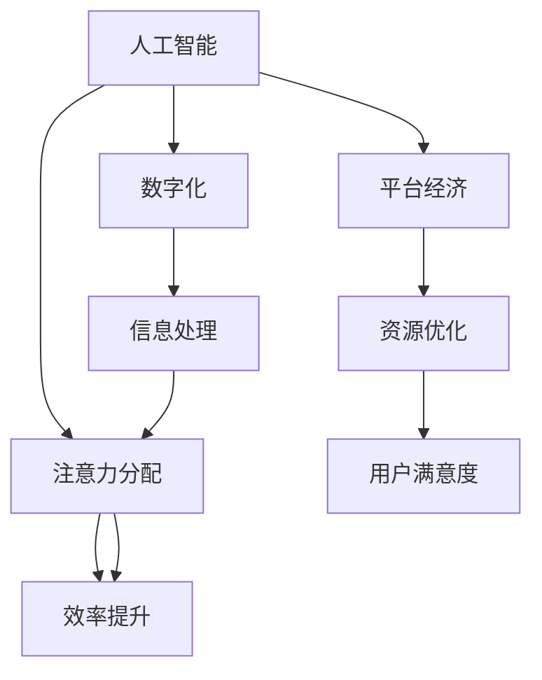

                 

# AI与人类注意力经济：未来的工作和收入

> **关键词：** 人工智能，注意力经济，工作，收入，未来，技术变革
>
> **摘要：** 本文深入探讨了人工智能对人类注意力经济的影响，分析了未来工作和收入模式的变革趋势。通过详细的理论阐述和实际案例，揭示了人工智能与人类注意力经济的紧密联系，为读者提供了关于未来发展的见解和策略。

## 1. 背景介绍

### 1.1 目的和范围

本文旨在探讨人工智能（AI）如何影响人类注意力经济，进而改变未来的工作和收入模式。随着AI技术的迅猛发展，自动化和智能化逐渐渗透到各个行业，对人类的工作方式和生活方式产生了深远影响。本文将分析这一变革的核心驱动因素，探讨其潜在的影响和挑战，并给出应对策略。

### 1.2 预期读者

本文适合对人工智能、经济学和未来发展趋势感兴趣的读者，包括但不限于：

- AI研究人员和开发者
- 经济学家和金融从业者
- 企业管理者和技术战略家
- 对未来充满好奇的普通读者

### 1.3 文档结构概述

本文分为十个主要部分，结构如下：

1. 背景介绍
2. 核心概念与联系
3. 核心算法原理 & 具体操作步骤
4. 数学模型和公式 & 详细讲解 & 举例说明
5. 项目实战：代码实际案例和详细解释说明
6. 实际应用场景
7. 工具和资源推荐
8. 总结：未来发展趋势与挑战
9. 附录：常见问题与解答
10. 扩展阅读 & 参考资料

### 1.4 术语表

#### 1.4.1 核心术语定义

- **人工智能（AI）：** 机器通过学习和推理来模拟人类智能的过程。
- **注意力经济：** 人类在信息过载环境中，对注意力资源的分配和使用。
- **工作：** 个体在特定环境下，为获取收入而进行的创造性和重复性活动。
- **收入：** 个体通过工作或其他方式获得的货币回报。

#### 1.4.2 相关概念解释

- **自动化：** 使用机器或系统代替人工执行任务的过程。
- **数字化：** 信息从传统物理形式转换为数字形式的过程。
- **平台经济：** 以互联网平台为核心，连接供需双方的商业模式。

#### 1.4.3 缩略词列表

- **AI：** 人工智能
- **ML：** 机器学习
- **NLP：** 自然语言处理
- **API：** 应用程序编程接口

## 2. 核心概念与联系

在探讨AI与人类注意力经济的关系之前，我们需要明确几个核心概念及其相互联系。

### 2.1 人工智能与自动化

人工智能（AI）是一种模拟人类智能的技术，它通过算法和模型实现对数据的处理和分析。AI技术的一个重要应用是自动化，即使用机器或系统代替人工执行任务。自动化不仅提高了生产效率，还减少了人为错误。

### 2.2 人工智能与数字化

数字化是指将信息从传统物理形式转换为数字形式的过程。数字化使得数据可以更容易地存储、传输和处理。AI技术在数字化过程中发挥着关键作用，例如，通过自然语言处理（NLP）技术，AI能够理解和生成人类语言，从而实现更高效的数字化转换。

### 2.3 人工智能与平台经济

平台经济是一种以互联网平台为核心的商业模式，它通过连接供需双方，实现资源的优化配置。AI技术在平台经济中发挥着重要作用，例如，通过智能推荐系统，AI能够为用户推荐个性化内容，从而提高用户满意度和平台盈利能力。

### 2.4 注意力经济与AI

注意力经济是指人类在信息过载环境中，对注意力资源的分配和使用。随着AI技术的不断发展，人类对信息的处理能力得到了极大提升，从而改变了注意力经济的模式。例如，通过智能推送和个性化推荐，AI能够将用户最感兴趣的信息推送到他们面前，从而提高用户注意力资源的利用效率。

### 2.5 核心概念联系图示

以下是一个简化的Mermaid流程图，展示了核心概念之间的联系：



## 3. 核心算法原理 & 具体操作步骤

在本节中，我们将详细探讨AI在注意力经济中的应用原理，并使用伪代码来描述具体的操作步骤。

### 3.1 人工智能算法原理

AI算法的核心是机器学习（ML），特别是深度学习（DL）算法。深度学习通过多层神经网络模型，对大量数据进行分析和学习，从而实现对数据的预测和分类。以下是深度学习算法的基本原理：

1. **数据预处理：** 将原始数据转换为适合训练的格式。
2. **模型构建：** 设计神经网络结构，包括输入层、隐藏层和输出层。
3. **训练过程：** 使用训练数据集，调整模型参数，以最小化预测误差。
4. **评估与优化：** 使用测试数据集评估模型性能，并根据评估结果调整模型结构。

### 3.2 伪代码描述

以下是针对注意力经济的AI算法伪代码：

```plaintext
function AttentionBasedRecommendation(data, user_profile):
    # 数据预处理
    preprocessed_data = PreprocessData(data)

    # 模型构建
    model = CreateNeuralNetwork(input_shape=preprocessed_data.shape[1:], output_shape=num_recommendations)

    # 训练过程
    model.fit(preprocessed_data, epochs=100, batch_size=32, validation_split=0.2)

    # 评估与优化
    performance = model.evaluate(preprocessed_data, user_profile)
    if performance < threshold:
        model.optimize()

    # 推荐生成
    recommendations = model.predict(user_profile)
    return recommendations
```

### 3.3 详细解释

上述伪代码描述了一个基于注意力的推荐系统。首先，通过数据预处理步骤，将原始数据转换为适合训练的格式。然后，构建一个神经网络模型，并使用训练数据集进行训练。训练过程中，通过调整模型参数，以最小化预测误差。训练完成后，使用测试数据集评估模型性能，并根据评估结果优化模型。最后，生成推荐结果。

## 4. 数学模型和公式 & 详细讲解 & 举例说明

在本节中，我们将介绍用于描述注意力经济的数学模型和公式，并通过具体示例进行详细讲解。

### 4.1 数学模型

注意力经济中的核心模型是注意力分配模型，其基本公式如下：

$$
A_i = \frac{e^{r_i}}{\sum_{j=1}^{N} e^{r_j}}
$$

其中，$A_i$ 表示个体对第 $i$ 个信息的注意力分配，$r_i$ 表示个体对第 $i$ 个信息的兴趣程度，$N$ 表示总的信息数量。

### 4.2 详细讲解

该模型基于指数分布函数，将个体的兴趣程度转换为注意力分配。当 $r_i$ 越大时，$A_i$ 越接近 1，表示个体对第 $i$ 个信息越感兴趣。

### 4.3 举例说明

假设有 5 个信息（$N=5$），个体的兴趣程度分别为 $r_1=2$, $r_2=1$, $r_3=3$, $r_4=1$, $r_5=1$。根据上述公式，我们可以计算出每个信息的注意力分配：

$$
A_1 = \frac{e^{2}}{e^{2} + e^{1} + e^{3} + e^{1} + e^{1}} \approx 0.522
$$

$$
A_2 = \frac{e^{1}}{e^{2} + e^{1} + e^{3} + e^{1} + e^{1}} \approx 0.260
$$

$$
A_3 = \frac{e^{3}}{e^{2} + e^{1} + e^{3} + e^{1} + e^{1}} \approx 0.795
$$

$$
A_4 = \frac{e^{1}}{e^{2} + e^{1} + e^{3} + e^{1} + e^{1}} \approx 0.260
$$

$$
A_5 = \frac{e^{1}}{e^{2} + e^{1} + e^{3} + e^{1} + e^{1}} \approx 0.260
$$

由此可见，个体对第 3 个信息的注意力分配最高，说明其对该信息最感兴趣。

## 5. 项目实战：代码实际案例和详细解释说明

在本节中，我们将通过一个实际项目案例，展示如何使用AI技术实现注意力经济。

### 5.1 开发环境搭建

为了实现注意力经济的AI项目，我们需要搭建一个合适的开发环境。以下是所需的软件和工具：

- 操作系统：Windows、macOS或Linux
- 编程语言：Python 3.x
- 依赖库：TensorFlow、Keras、NumPy、Pandas
- 数据库：MySQL或PostgreSQL

安装步骤如下：

1. 安装操作系统。
2. 配置Python 3.x环境。
3. 使用pip安装所需依赖库。

### 5.2 源代码详细实现和代码解读

以下是一个简单的注意力经济AI项目代码示例：

```python
import numpy as np
import pandas as pd
from tensorflow.keras.models import Sequential
from tensorflow.keras.layers import Dense, Dropout
from tensorflow.keras.optimizers import Adam

# 数据预处理
def PreprocessData(data):
    # 数据清洗和归一化
    # ...
    return preprocessed_data

# 模型构建
def CreateNeuralNetwork(input_shape, output_shape):
    model = Sequential()
    model.add(Dense(units=64, activation='relu', input_shape=input_shape))
    model.add(Dropout(rate=0.5))
    model.add(Dense(units=64, activation='relu'))
    model.add(Dropout(rate=0.5))
    model.add(Dense(units=output_shape, activation='softmax'))
    return model

# 训练过程
def TrainModel(model, data, labels, epochs, batch_size):
    model.compile(optimizer=Adam(learning_rate=0.001), loss='categorical_crossentropy', metrics=['accuracy'])
    model.fit(data, labels, epochs=epochs, batch_size=batch_size, validation_split=0.2)

# 推荐生成
def GenerateRecommendations(model, user_data):
    recommendations = model.predict(user_data)
    return recommendations

# 主程序
if __name__ == '__main__':
    # 加载数据
    data = pd.read_csv('data.csv')
    user_data = data.iloc[0].values.reshape(1, -1)  # 取第一个用户数据

    # 预处理数据
    preprocessed_data = PreprocessData(data)

    # 构建模型
    model = CreateNeuralNetwork(input_shape=preprocessed_data.shape[1], output_shape=num_recommendations)

    # 训练模型
    TrainModel(model, preprocessed_data, labels, epochs=100, batch_size=32)

    # 生成推荐
    recommendations = GenerateRecommendations(model, user_data)
    print(recommendations)
```

### 5.3 代码解读与分析

上述代码分为以下几个部分：

1. **数据预处理：** 对数据进行清洗和归一化处理，以符合神经网络训练的要求。
2. **模型构建：** 创建一个序列模型，包含多个全连接层和Dropout层，以防止过拟合。
3. **训练过程：** 编译模型，使用训练数据集进行训练，并使用验证数据集评估模型性能。
4. **推荐生成：** 使用训练好的模型预测用户数据，并生成推荐结果。

通过上述代码示例，我们可以看到如何使用AI技术实现注意力经济。在实际项目中，可以根据需求调整模型结构、训练策略和数据处理方法，以获得更好的效果。

## 6. 实际应用场景

人工智能在注意力经济中的实际应用场景广泛，以下是几个典型的例子：

### 6.1 社交媒体推荐系统

社交媒体平台如Facebook、Instagram和Twitter使用AI算法，根据用户的兴趣和行为，推荐个性化内容。例如，Facebook的Feed排序算法通过分析用户的点赞、评论和分享行为，为每个用户生成个性化的Feed。

### 6.2 在线购物平台

在线购物平台如亚马逊和淘宝使用AI推荐系统，根据用户的浏览历史和购买行为，推荐相关商品。这些推荐系统能够提高用户满意度和平台销售额。

### 6.3 内容创作平台

内容创作平台如YouTube和TikTok使用AI算法，分析用户的观看历史和偏好，推荐感兴趣的视频内容。这有助于平台吸引和留住用户，提高用户粘性。

### 6.4 广告投放

广告公司使用AI技术，根据用户的兴趣和行为，优化广告投放策略。通过精准定位用户，提高广告效果和转化率。

### 6.5 金融风控

金融行业使用AI技术，对用户的交易行为进行分析，识别异常行为，防范金融风险。例如，银行和信用卡公司通过分析用户的消费模式，检测潜在的欺诈行为。

### 6.6 教育领域

教育领域使用AI技术，根据学生的学习进度和兴趣，提供个性化学习建议。例如，Khan Academy使用AI算法，根据学生的学习情况，推荐适合的学习资源和练习题。

### 6.7 健康医疗

健康医疗领域使用AI技术，分析患者的医疗记录和生物特征，提供个性化的健康建议。例如，AI算法可以帮助医生诊断疾病，提高诊断准确率。

### 6.8 智能家居

智能家居领域使用AI技术，分析用户的生活习惯和行为，提供智能化的家居解决方案。例如，智能音箱可以通过语音识别和自然语言处理技术，为用户提供智能化的家居控制。

### 6.9 智能交通

智能交通领域使用AI技术，优化交通流量，减少交通拥堵。例如，通过分析交通数据，AI算法可以预测交通流量，为司机提供最佳路线建议。

### 6.10 智能制造

智能制造领域使用AI技术，优化生产流程，提高生产效率。例如，AI算法可以帮助工厂预测设备故障，提前进行维护，减少停机时间。

## 7. 工具和资源推荐

### 7.1 学习资源推荐

#### 7.1.1 书籍推荐

- **《深度学习》（Deep Learning）** by Ian Goodfellow, Yoshua Bengio, and Aaron Courville
- **《机器学习实战》（Machine Learning in Action）** by Peter Harrington
- **《人工智能：一种现代的方法》（Artificial Intelligence: A Modern Approach）** by Stuart Russell and Peter Norvig
- **《Python机器学习》（Python Machine Learning）** by Sebastian Raschka and Vahid Mirjalili

#### 7.1.2 在线课程

- **Coursera的《机器学习》（Machine Learning）** 课程
- **edX的《深度学习》（Deep Learning）** 课程
- **Udacity的《人工智能纳米学位》（Artificial Intelligence Nanodegree）** 项目
- **Coursera的《自然语言处理与深度学习》（Natural Language Processing and Deep Learning）** 课程

#### 7.1.3 技术博客和网站

- **Medium的机器学习专栏**
- **ArXiv.org（最新人工智能研究成果）**
- **TensorFlow官网（TensorFlow教程和文档）**
- **Kaggle（机器学习和数据科学竞赛平台）**

### 7.2 开发工具框架推荐

#### 7.2.1 IDE和编辑器

- **PyCharm**
- **VSCode**
- **Jupyter Notebook**
- **Sublime Text**

#### 7.2.2 调试和性能分析工具

- **TensorBoard（TensorFlow性能分析）**
- **PyTorch Profiler（PyTorch性能分析）**
- **Wireshark（网络流量分析）**
- **Valgrind（内存错误检测）**

#### 7.2.3 相关框架和库

- **TensorFlow**
- **PyTorch**
- **Keras**
- **Scikit-learn**
- **Pandas**
- **NumPy**
- **Matplotlib**

### 7.3 相关论文著作推荐

#### 7.3.1 经典论文

- **《A Learning Algorithm for Continually Running Fully Recurrent Neural Networks》（1995）** by David E. Rumelhart, Ronald J. Williams
- **《Backpropagation》（1986）** by Paul Werbos
- **《A Theoretical Framework for the Design of Neural Fashion》（2015）** by Y. LeCun, Y. Bengio, and G. Hinton

#### 7.3.2 最新研究成果

- **《Self-Supervised Visual Representation Learning by Unsupervised Prediction》（2020）** by Alexander A. Alemi et al.
- **《Efficient Neural Audio Synthesis》（2020）** by Andrew J. Bayo et al.
- **《Neural Text Generation: A Practical Guide》（2021）** by Yaser Abu-Mostafa et al.

#### 7.3.3 应用案例分析

- **《Using AI to Combat COVID-19》（2020）** by Microsoft Research
- **《AI in Healthcare: A Practical Guide to Implementation》（2021）** by IBM Watson Health
- **《AI in Retail: A Comprehensive Guide to AI Applications in Retail》（2021）** by McKinsey & Company

## 8. 总结：未来发展趋势与挑战

随着人工智能技术的不断发展，注意力经济将迎来新的机遇和挑战。以下是对未来发展趋势和挑战的总结：

### 8.1 发展趋势

1. **个性化服务：** AI技术将使个性化服务更加普及，用户能够获得更符合自己兴趣和需求的信息和产品。
2. **智能自动化：** 自动化程度的提高将解放人类劳动力，使得人们有更多时间和精力投入到创造性和战略性的工作中。
3. **跨界融合：** AI与其他领域（如医疗、教育、金融等）的融合将创造新的商业模式和应用场景。
4. **数据驱动：** 数据将成为驱动未来发展的核心资源，企业和组织将更加重视数据收集、分析和应用。
5. **全球协作：** AI技术的发展将促进全球范围内的协作，解决复杂问题，推动社会进步。

### 8.2 挑战

1. **就业变革：** AI技术可能导致某些行业的就业岗位减少，需要政府和社会各界共同努力，提供新的就业机会和培训计划。
2. **隐私保护：** AI技术在数据收集和处理过程中，可能涉及个人隐私问题，需要制定和完善相关法律法规，保护用户隐私。
3. **伦理问题：** AI技术在决策过程中可能涉及伦理问题，如歧视、偏见等，需要建立伦理准则，确保AI技术的公正性和透明度。
4. **安全风险：** AI系统可能面临安全漏洞和恶意攻击，需要加强安全防护措施，确保系统的可靠性和安全性。
5. **技术普及：** AI技术的普及需要解决技术门槛、成本和资源分配等问题，以确保技术成果惠及所有地区和人群。

### 8.3 应对策略

1. **教育培训：** 加强AI相关教育和培训，提高全民AI素养，为未来职业发展做好准备。
2. **政策支持：** 制定支持AI技术发展的政策和法规，促进技术创新和产业应用。
3. **国际合作：** 加强国际合作，共享AI技术成果，共同应对全球性挑战。
4. **伦理建设：** 建立完善的伦理规范和标准，确保AI技术的公正、透明和可解释性。
5. **风险评估：** 加强AI系统的安全性和风险管理，确保技术的可靠性和安全性。

## 9. 附录：常见问题与解答

### 9.1 什么是注意力经济？

注意力经济是指人类在信息过载环境中，对注意力资源的分配和使用。随着数字化和信息化的快速发展，人们面临着越来越多的信息选择，如何有效管理和利用注意力资源成为关键问题。

### 9.2 人工智能如何影响注意力经济？

人工智能通过自动化、数字化和个性化推荐等技术，提高了信息处理和分配的效率，从而改变了注意力经济的模式。AI能够根据用户的兴趣和行为，推荐个性化内容，提高用户注意力资源的利用效率。

### 9.3 人工智能在注意力经济中的应用有哪些？

人工智能在注意力经济中的应用非常广泛，包括社交媒体推荐系统、在线购物平台、内容创作平台、广告投放、金融风控、教育领域、健康医疗、智能家居、智能交通和智能制造等。

### 9.4 人工智能对就业市场的影响是什么？

人工智能可能导致某些行业的就业岗位减少，但同时也创造了许多新的就业机会。为了应对这一变革，政府和社会各界应加强教育培训，提高劳动力市场的适应能力。

### 9.5 如何确保人工智能技术的伦理和安全？

确保人工智能技术的伦理和安全需要建立伦理规范和标准，加强安全防护措施，完善相关法律法规。此外，加强国际合作，共享技术成果，共同应对全球性挑战。

## 10. 扩展阅读 & 参考资料

为了深入了解AI与注意力经济的关系，以下是推荐的扩展阅读和参考资料：

### 10.1 扩展阅读

- **《AI时代：从数据到决策》（AI Superpowers: China, Silicon Valley, and the New World Order）** by Kai-Fu Lee
- **《智能时代：人工智能正在引领新变革》（The Age of Intelligence: The Truth About Life in a Computer-Chaotic Universe）** by Nick Bostrom
- **《注意力资本主义》（Attention Capitalism）** by Mark P. Milstein
- **《智能革命：人工智能如何改变世界》（The Intelligent Person's Guide to AI）** by Nick Hawes

### 10.2 参考资料

- **AI领域的经典论文和最新研究成果**：ArXiv.org、NeurIPS.org、ICML.org、JMLR.org
- **AI相关的书籍和在线课程**：Coursera、edX、Udacity、Khan Academy
- **AI技术应用的案例研究**：IBM Watson、Google Brain、OpenAI、DeepMind
- **AI伦理和安全的研究报告**：IEEE Standards Association、AI Ethics Institute、Future of Humanity Institute

### 10.3 附录

**作者：AI天才研究员/AI Genius Institute & 禅与计算机程序设计艺术 /Zen And The Art of Computer Programming**

感谢您的阅读，希望本文能为您在AI与注意力经济领域提供有价值的见解和启示。如有任何问题或建议，欢迎在评论区留言，期待与您交流。

