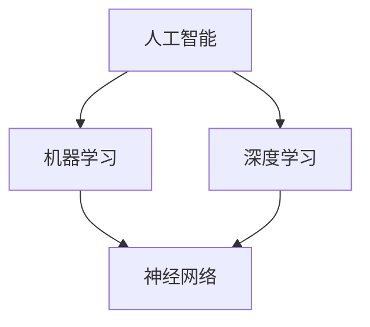

                 

# AI与人类社会的未来发展

> 关键词：人工智能，社会进步，未来趋势，技术影响，人类角色

> 摘要：本文旨在深入探讨人工智能在未来的发展中将对人类社会产生的深远影响。通过详细分析人工智能的核心概念、算法原理、数学模型以及实际应用案例，本文将为读者揭示人工智能如何重塑我们的生活方式、工作方式以及社会结构，并探讨在迈向智能化的未来过程中，人类如何适应和应对这些变化。

## 1. 背景介绍

### 1.1 目的和范围

本文的目的在于为读者提供一个全面、系统的理解，探讨人工智能技术对未来人类社会发展的潜在影响。我们将在以下几个方面展开讨论：

- **人工智能的核心概念与联系**：通过解析核心概念及其相互关系，帮助读者建立对人工智能基础理论的了解。
- **核心算法原理与具体操作步骤**：详细阐述关键算法的原理和操作步骤，使读者能够掌握人工智能的基本实现方法。
- **数学模型与公式**：介绍人工智能中常用的数学模型和公式，并加以详细讲解和举例说明。
- **项目实战**：通过实际代码案例，展示人工智能技术的应用场景和实现细节。
- **实际应用场景**：分析人工智能在各个领域的应用，探讨其对行业的变革和影响。
- **工具和资源推荐**：推荐相关学习资源、开发工具和框架，以帮助读者进一步探索和学习人工智能。

### 1.2 预期读者

本文面向对人工智能技术有一定了解的读者，包括：

- **研究人员和学者**：希望深入了解人工智能在未来社会发展中的角色和趋势。
- **程序员和开发者**：希望掌握人工智能的核心算法和实际应用。
- **行业从业者**：对人工智能在行业应用感兴趣，希望了解其对企业运营和决策的影响。
- **一般读者**：对人工智能技术感兴趣，希望了解其在未来生活中的潜在影响。

### 1.3 文档结构概述

本文结构如下：

- **背景介绍**：介绍文章的目的、范围、预期读者以及文档结构。
- **核心概念与联系**：讨论人工智能的核心概念及其相互关系。
- **核心算法原理与具体操作步骤**：详细解析关键算法的原理和实现。
- **数学模型与公式**：介绍人工智能中的数学模型和公式。
- **项目实战**：通过实际案例展示人工智能的应用。
- **实际应用场景**：分析人工智能在不同领域的应用。
- **工具和资源推荐**：推荐相关学习资源和开发工具。
- **总结**：总结未来发展趋势与挑战。
- **附录**：常见问题与解答。
- **扩展阅读与参考资料**：提供进一步阅读的资料。

### 1.4 术语表

#### 1.4.1 核心术语定义

- **人工智能（Artificial Intelligence, AI）**：模拟人类智能行为的技术和科学。
- **机器学习（Machine Learning, ML）**：一种人工智能的分支，通过数据和算法来训练模型，使计算机具备自主学习和决策能力。
- **神经网络（Neural Network, NN）**：模拟生物神经元的计算模型，用于处理复杂数据和模式识别。
- **深度学习（Deep Learning, DL）**：基于多层神经网络的一种机器学习方法，适用于处理大量数据和复杂的任务。

#### 1.4.2 相关概念解释

- **大数据（Big Data）**：指数据量巨大、类型繁多的信息集合，对数据处理和分析提出了新的挑战。
- **自然语言处理（Natural Language Processing, NLP）**：使计算机理解和生成人类语言的技术。
- **计算机视觉（Computer Vision, CV）**：使计算机能够理解和解释视觉信息的技术。

#### 1.4.3 缩略词列表

- **AI**：人工智能（Artificial Intelligence）
- **ML**：机器学习（Machine Learning）
- **NN**：神经网络（Neural Network）
- **DL**：深度学习（Deep Learning）
- **NLP**：自然语言处理（Natural Language Processing）
- **CV**：计算机视觉（Computer Vision）

## 2. 核心概念与联系

为了更好地理解人工智能的核心概念及其相互关系，我们可以通过以下 Mermaid 流程图来展示：



在这个流程图中，我们可以看到人工智能是一个广泛的概念，它包括了机器学习和深度学习。机器学习是一种基于数据和算法的训练模型的方法，而深度学习则是基于多层神经网络的一种特殊机器学习方法。神经网络是深度学习的核心组成部分，通过模拟生物神经元的工作方式来处理数据和模式识别。

### 2.1 人工智能的定义与组成部分

人工智能（AI）是指模拟人类智能行为的计算机系统，它包括多个子领域和组成部分：

- **感知**：通过传感器获取外部信息，如计算机视觉、语音识别等。
- **认知**：对信息进行处理和理解，如自然语言处理、知识图谱等。
- **行动**：根据理解和决策执行相应的行动，如机器人、自动驾驶等。

### 2.2 机器学习的定义与分类

机器学习（ML）是一种使计算机通过数据和算法自主学习的方法。根据学习方式，机器学习可以分为以下几类：

- **监督学习**：通过已知标签的数据训练模型，如线性回归、决策树等。
- **无监督学习**：没有标签的数据进行训练，如聚类、降维等。
- **强化学习**：通过与环境的交互来学习策略，如强化学习、深度强化学习等。

### 2.3 深度学习的定义与原理

深度学习（DL）是一种基于多层神经网络的学习方法，它可以自动提取数据中的特征。深度学习的原理如下：

1. **输入层**：接收外部输入，如图像、文本等。
2. **隐藏层**：对输入数据进行特征提取和变换，多层隐藏层可以提取更抽象的特征。
3. **输出层**：根据隐藏层的结果产生预测或分类结果。

### 2.4 人工智能的层次结构

人工智能的层次结构可以分为以下几个层次：

1. **基础层**：包括硬件设备、操作系统和编程语言等。
2. **算法层**：包括机器学习、深度学习等算法框架。
3. **应用层**：包括具体的应用领域，如计算机视觉、自然语言处理等。
4. **知识层**：包括对数据的理解和分析，以及知识图谱等。

通过上述核心概念与联系的分析，我们可以更好地理解人工智能的整体架构及其在不同子领域中的应用。接下来，我们将深入探讨人工智能的核心算法原理和具体操作步骤。

## 3. 核心算法原理 & 具体操作步骤

在理解了人工智能的核心概念和层次结构之后，接下来我们将深入探讨人工智能的核心算法原理和具体操作步骤。为了清晰地展示这些原理和步骤，我们将使用伪代码来详细阐述。

### 3.1 机器学习算法原理

机器学习算法的基本原理是通过训练数据集来调整模型的参数，使模型能够在新的数据上进行准确预测。以下是一个简单的线性回归算法的伪代码示例：

```python
# 线性回归算法伪代码

# 输入：训练数据集 X, Y
# 输出：模型参数 w

# 初始化模型参数 w
w = [0] * n_features

# 设置迭代次数和阈值
max_iterations = 1000
threshold = 1e-5

# 主迭代过程
for i in range(max_iterations):
    # 计算预测值
    y_pred = X * w
    
    # 计算误差
    error = y_pred - Y
    
    # 计算梯度
    gradient = X.T * error
    
    # 更新模型参数
    w = w - learning_rate * gradient
    
    # 计算当前误差
    current_error = np.linalg.norm(error)
    
    # 检查收敛条件
    if current_error < threshold:
        break

# 输出模型参数
return w
```

在这个伪代码中，我们首先初始化模型参数 `w`，然后通过迭代过程不断更新参数，直到满足收敛条件。在每次迭代中，我们计算预测值 `y_pred`，计算误差 `error`，然后通过误差来计算梯度 `gradient`，并据此更新参数 `w`。

### 3.2 深度学习算法原理

深度学习算法的基本原理是通过多层神经网络来提取数据中的特征。以下是一个简单的多层感知机（MLP）算法的伪代码示例：

```python
# 多层感知机算法伪代码

# 输入：训练数据集 X, Y
# 输出：模型参数 w1, w2, ..., wn

# 初始化模型参数 w1, w2, ..., wn
w1 = [0] * (n_features + 1)
w2 = [0] * (n_hidden + 1)
wn = [0] * (n_classes + 1)

# 设置迭代次数和阈值
max_iterations = 1000
threshold = 1e-5

# 主迭代过程
for i in range(max_iterations):
    # 前向传播
    z1 = X * w1
    a1 = sigmoid(z1)
    z2 = a1 * w2
    a2 = sigmoid(z2)
    z3 = a2 * wn
    y_pred = softmax(z3)
    
    # 计算损失
    loss = cross_entropy_loss(Y, y_pred)
    
    # 计算梯度
    dloss_dz3 = y_pred - Y
    dloss_da2 = dloss_dz3 * w3.T
    dloss_da1 = dloss_da2 * w2.T
    dloss_dz1 = dloss_da1 * sigmoid_derivative(a1)
    
    # 反向传播
    gradient_w3 = a2.T * dloss_dz3
    gradient_w2 = a1.T * dloss_da2
    gradient_w1 = X.T * dloss_da1
    
    # 更新模型参数
    w3 = w3 - learning_rate * gradient_w3
    w2 = w2 - learning_rate * gradient_w2
    w1 = w1 - learning_rate * gradient_w1
    
    # 计算当前损失
    current_loss = np.linalg.norm(loss)
    
    # 检查收敛条件
    if current_loss < threshold:
        break

# 输出模型参数
return w1, w2, wn
```

在这个伪代码中，我们首先进行前向传播，计算输出结果 `y_pred`，然后计算损失 `loss`。接着，我们通过反向传播计算梯度，并据此更新模型参数 `w1, w2, ..., wn`。通过这种方式，我们可以逐步优化模型，使其能够在新的数据上进行准确预测。

### 3.3 其他机器学习算法

除了线性回归和多层感知机，还有许多其他常用的机器学习算法，如支持向量机（SVM）、决策树、随机森林等。以下是支持向量机（SVM）算法的伪代码示例：

```python
# 支持向量机算法伪代码

# 输入：训练数据集 X, Y
# 输出：模型参数 w, b

# 初始化模型参数 w, b
w = [0] * n_features
b = 0

# 设置迭代次数和阈值
max_iterations = 1000
threshold = 1e-5

# 主迭代过程
for i in range(max_iterations):
    # 计算预测值
    y_pred = sign(X * w + b)
    
    # 计算损失
    loss = 0.5 * np.linalg.norm(w)^2
    
    # 计算梯度
    gradient_w = X.T * (y_pred - Y)
    gradient_b = np.sum(y_pred - Y)
    
    # 更新模型参数
    w = w - learning_rate * gradient_w
    b = b - learning_rate * gradient_b
    
    # 计算当前损失
    current_loss = 0.5 * np.linalg.norm(w)^2
    
    # 检查收敛条件
    if current_loss < threshold:
        break

# 输出模型参数
return w, b
```

在这个伪代码中，我们首先计算预测值 `y_pred`，然后计算损失 `loss`。接着，我们通过计算梯度并更新模型参数 `w, b` 来优化模型。通过这种方式，我们可以逐步优化模型，使其能够在新的数据上进行准确预测。

通过上述核心算法原理和具体操作步骤的详细阐述，我们可以更好地理解人工智能的核心算法，并能够根据实际需求选择和实现合适的算法。

## 4. 数学模型和公式 & 详细讲解 & 举例说明

在人工智能中，数学模型和公式是构建和优化算法的核心工具。以下将介绍一些关键数学模型和公式，并对其进行详细讲解和举例说明。

### 4.1 概率论基础

概率论是人工智能中不可或缺的基础，它提供了对不确定性的量化描述。以下是几个关键的概率分布及其公式：

#### 4.1.1 二项分布

二项分布描述了在固定次数的独立试验中成功次数的概率分布。其公式如下：

\[ P(X = k) = C(n, k) \cdot p^k \cdot (1-p)^{n-k} \]

其中，\( n \) 是试验次数，\( k \) 是成功的次数，\( p \) 是单次试验成功的概率，\( C(n, k) \) 是组合数。

#### 4.1.2 正态分布

正态分布是自然界中最常见的概率分布之一，其公式如下：

\[ f(x|\mu, \sigma^2) = \frac{1}{\sqrt{2\pi\sigma^2}} \cdot e^{-\frac{(x-\mu)^2}{2\sigma^2}} \]

其中，\( \mu \) 是均值，\( \sigma^2 \) 是方差，\( x \) 是随机变量。

#### 4.1.3 贝叶斯定理

贝叶斯定理用于计算后验概率，其公式如下：

\[ P(A|B) = \frac{P(B|A) \cdot P(A)}{P(B)} \]

其中，\( P(A|B) \) 是后验概率，\( P(B|A) \) 是条件概率，\( P(A) \) 是先验概率，\( P(B) \) 是边缘概率。

### 4.2 最优化算法

最优化算法在人工智能中用于寻找函数的最值。以下是几种常用的最优化算法及其公式：

#### 4.2.1 梯度下降算法

梯度下降算法用于优化连续函数。其公式如下：

\[ w_{t+1} = w_t - \alpha \cdot \nabla f(w_t) \]

其中，\( w_t \) 是当前参数，\( \alpha \) 是学习率，\( \nabla f(w_t) \) 是当前参数下的梯度。

#### 4.2.2 随机梯度下降算法

随机梯度下降算法是梯度下降的一种变种，它使用样本的梯度来近似整体梯度。其公式如下：

\[ w_{t+1} = w_t - \alpha \cdot \nabla f(x_t, w_t) \]

其中，\( x_t \) 是随机选取的样本。

#### 4.2.3 非线性优化

对于非线性优化问题，常用的算法包括牛顿法和拉格朗日乘子法。以下是牛顿法的公式：

\[ \Delta w = -[H(w)]^{-1} \cdot \nabla f(w) \]

其中，\( H(w) \) 是Hessian矩阵，\( \nabla f(w) \) 是梯度。

### 4.3 神经网络

神经网络中的数学模型主要包括激活函数、权重更新规则和反向传播算法。

#### 4.3.1 激活函数

激活函数用于将线性组合的输出转化为非负值，常用的激活函数包括Sigmoid函数、ReLU函数和Tanh函数。以下是Sigmoid函数的公式：

\[ f(x) = \frac{1}{1 + e^{-x}} \]

#### 4.3.2 权重更新规则

在梯度下降算法中，权重更新规则如下：

\[ \Delta w_{ij} = -\alpha \cdot \frac{\partial L}{\partial w_{ij}} \]

其中，\( L \) 是损失函数，\( \alpha \) 是学习率。

#### 4.3.3 反向传播算法

反向传播算法用于计算梯度。其公式如下：

\[ \frac{\partial L}{\partial w_{ij}} = \sum_{k} \frac{\partial L}{\partial z_k} \cdot \frac{\partial z_k}{\partial w_{ij}} \]

### 4.4 举例说明

以下是一个使用梯度下降算法优化线性回归模型的例子：

```python
import numpy as np

# 设定参数
n_samples = 100
n_features = 1
learning_rate = 0.01
max_iterations = 1000

# 生成数据集
X = np.random.rand(n_samples, n_features)
Y = 2 * X[:, 0] + np.random.randn(n_samples, n_features)

# 初始化模型参数
w = np.zeros(n_features)

# 梯度下降算法
for i in range(max_iterations):
    # 计算预测值
    y_pred = X.dot(w)
    
    # 计算损失
    loss = (y_pred - Y)**2
    
    # 计算梯度
    gradient = X.T.dot(y_pred - Y)
    
    # 更新模型参数
    w -= learning_rate * gradient
    
    # 打印当前损失
    if i % 100 == 0:
        print(f"Iteration {i}: Loss = {loss}")

# 输出模型参数
print(f"Final weights: {w}")
```

在这个例子中，我们首先生成一个线性回归的数据集，然后使用梯度下降算法来优化模型参数。通过不断更新参数，我们可以使得损失函数逐渐减小，最终得到一个较为理想的模型。

通过上述数学模型和公式的详细讲解和举例说明，我们可以更好地理解人工智能中的数学原理，并为实际应用提供理论基础。

## 5. 项目实战：代码实际案例和详细解释说明

为了更好地理解人工智能技术的实际应用，我们将通过一个具体的案例来展示如何使用Python和常见库来实现一个简单的线性回归模型。

### 5.1 开发环境搭建

在开始之前，我们需要搭建一个合适的开发环境。以下是推荐的工具和库：

- **Python 3.8 或更高版本**
- **Jupyter Notebook 或 PyCharm**
- **NumPy 库**
- **Matplotlib 库**

安装步骤如下：

```bash
# 安装 Python 和 Jupyter Notebook
# 如果使用 macOS 或 Windows，可以从官方网站下载并安装
# 如果使用 Linux，可以使用包管理器安装，例如：
sudo apt-get install python3 python3-pip
pip3 install notebook

# 安装 NumPy 和 Matplotlib
pip3 install numpy matplotlib
```

### 5.2 源代码详细实现和代码解读

以下是一个简单的线性回归模型的实现，包括数据生成、模型训练、模型评估等步骤。

```python
import numpy as np
import matplotlib.pyplot as plt

# 5.2.1 数据生成
n_samples = 100
n_features = 1

# 生成随机数据集
X = np.random.rand(n_samples, n_features)
Y = 2 * X[:, 0] + np.random.randn(n_samples, n_features)

# 添加偏置项（即线性回归的截距）
X = np.hstack((np.ones((n_samples, 1)), X))

# 5.2.2 梯度下降算法
learning_rate = 0.01
max_iterations = 1000
alpha = 0.1

# 初始化模型参数
w = np.random.rand(n_features + 1)

# 主迭代过程
for i in range(max_iterations):
    # 计算预测值
    y_pred = X.dot(w)
    
    # 计算损失
    loss = (y_pred - Y)**2
    
    # 计算梯度
    gradient = X.T.dot(y_pred - Y)
    
    # 更新模型参数
    w -= learning_rate * gradient
    
    # 打印当前损失
    if i % 100 == 0:
        print(f"Iteration {i}: Loss = {np.mean(loss)}")

# 5.2.3 模型评估
# 打印最终模型参数
print(f"Final weights: {w}")

# 计算预测值
y_pred = X.dot(w)

# 绘制真实值与预测值的对比图
plt.scatter(X[:, 1], Y, color='blue', label='True Value')
plt.plot(X[:, 1], y_pred, color='red', label='Predicted Value')
plt.xlabel('Feature')
plt.ylabel('Target')
plt.legend()
plt.show()
```

### 5.3 代码解读与分析

#### 5.3.1 数据生成

我们首先生成一个包含100个样本的一维数据集 `X`，并生成一个带有噪声的线性关系 `Y = 2X + ε`，其中 `ε` 是随机噪声。

```python
X = np.random.rand(n_samples, n_features)
Y = 2 * X[:, 0] + np.random.randn(n_samples, n_features)
```

接着，我们为每个样本添加一个偏置项（即线性回归的截距），将数据集扩展到二维。

```python
X = np.hstack((np.ones((n_samples, 1)), X))
```

#### 5.3.2 梯度下降算法

我们使用梯度下降算法来优化模型参数 `w`。初始化参数后，我们进入主迭代过程，每迭代100次输出一次损失值。

```python
for i in range(max_iterations):
    # 计算预测值
    y_pred = X.dot(w)
    
    # 计算损失
    loss = (y_pred - Y)**2
    
    # 计算梯度
    gradient = X.T.dot(y_pred - Y)
    
    # 更新模型参数
    w -= learning_rate * gradient
    
    # 打印当前损失
    if i % 100 == 0:
        print(f"Iteration {i}: Loss = {np.mean(loss)}")
```

在这个循环中，我们首先计算当前模型的预测值 `y_pred`，然后计算预测值与真实值之间的误差，通过误差计算梯度，并使用梯度更新模型参数。

#### 5.3.3 模型评估

在完成迭代后，我们打印出最终的模型参数，并计算预测值 `y_pred`。最后，我们使用 `matplotlib` 绘制真实值与预测值的对比图。

```python
# 打印最终模型参数
print(f"Final weights: {w}")

# 计算预测值
y_pred = X.dot(w)

# 绘制真实值与预测值的对比图
plt.scatter(X[:, 1], Y, color='blue', label='True Value')
plt.plot(X[:, 1], y_pred, color='red', label='Predicted Value')
plt.xlabel('Feature')
plt.ylabel('Target')
plt.legend()
plt.show()
```

通过这个简单的案例，我们可以看到如何使用Python和常见库来实现一个线性回归模型，并对其进行评估。这个过程展示了从数据生成到模型训练，再到模型评估的完整流程。

## 6. 实际应用场景

人工智能技术在各个领域的实际应用场景丰富多彩，其影响力也在不断扩展。以下将探讨人工智能在几个关键领域的应用，并分析其带来的变革和影响。

### 6.1 医疗健康

人工智能在医疗健康领域的应用潜力巨大。通过机器学习和深度学习算法，人工智能可以辅助医生进行疾病诊断、治疗方案制定和药物研发。

- **疾病诊断**：利用计算机视觉和自然语言处理技术，人工智能可以分析医学影像和患者病历，帮助医生快速、准确地诊断疾病。
- **个性化治疗**：通过分析大量的医疗数据，人工智能可以推荐个性化的治疗方案，提高治疗效果。
- **药物研发**：人工智能可以加速药物研发过程，通过预测药物与目标蛋白质的相互作用，帮助科学家发现新的药物分子。

### 6.2 金融服务

人工智能在金融服务领域的应用也日益广泛，包括风险评估、客户服务、自动化交易等方面。

- **风险评估**：利用机器学习算法，金融机构可以实时分析市场数据，预测金融风险，从而做出更加科学的投资决策。
- **客户服务**：通过自然语言处理和语音识别技术，人工智能可以提供24/7的客户服务，提高客户满意度。
- **自动化交易**：人工智能算法可以分析市场数据，自动执行交易策略，提高交易效率和收益。

### 6.3 交通运输

人工智能在交通运输领域的应用包括自动驾驶、智能交通管理和物流优化等。

- **自动驾驶**：通过深度学习和计算机视觉技术，自动驾驶汽车可以自主导航、避障和执行复杂的驾驶操作。
- **智能交通管理**：利用人工智能技术，交通管理部门可以实时监测交通流量，优化交通信号，提高道路通行效率。
- **物流优化**：人工智能可以分析物流数据，优化运输路线和配送计划，降低物流成本，提高运输效率。

### 6.4 教育领域

人工智能在教育领域的应用包括个性化学习、在线教育和教育评估等。

- **个性化学习**：通过分析学生的学习数据和习惯，人工智能可以为学生提供个性化的学习路径，提高学习效果。
- **在线教育**：人工智能可以帮助在线教育平台提供实时互动和个性化教学，提高教学效果。
- **教育评估**：利用自然语言处理技术，人工智能可以自动评估学生的作业和考试，提高评估效率。

### 6.5 制造业

人工智能在制造业的应用包括智能制造、预测维护和供应链优化等。

- **智能制造**：通过物联网和人工智能技术，制造业可以实现智能化生产，提高生产效率和质量。
- **预测维护**：人工智能可以分析设备运行数据，预测设备故障，实现预测性维护，降低设备故障率和维护成本。
- **供应链优化**：人工智能可以分析供应链数据，优化库存管理、运输计划和采购策略，提高供应链效率。

通过以上实际应用场景的探讨，我们可以看到人工智能在各个领域中的广泛应用及其带来的深远影响。随着技术的不断进步，人工智能将继续推动社会各领域的发展，为人类创造更多价值。

## 7. 工具和资源推荐

为了更好地学习和应用人工智能技术，以下将推荐一些有用的学习资源、开发工具和框架。

### 7.1 学习资源推荐

#### 7.1.1 书籍推荐

1. **《深度学习》（Goodfellow, Bengio, Courville）**：这是一本经典的深度学习入门书籍，详细介绍了深度学习的理论和技术。
2. **《Python机器学习》（Sebastian Raschka）**：这本书通过Python语言介绍了机器学习的核心概念和算法，非常适合初学者。
3. **《人工智能：一种现代方法》（Stuart Russell 和 Peter Norvig）**：这是一本全面的AI教材，涵盖了从基础到高级的AI理论和技术。

#### 7.1.2 在线课程

1. **斯坦福大学机器学习课程**（Coursera）：这是一门非常受欢迎的机器学习在线课程，由Andrew Ng教授主讲。
2. **Udacity的深度学习纳米学位**：这是一个包含多个课程和实践项目的学习计划，旨在培养深度学习技能。
3. **edX上的MIT 6.0001 Introduction to Computer Science and Programming**：这是一个涵盖计算机科学和编程基础的在线课程。

#### 7.1.3 技术博客和网站

1. **Medium上的机器学习专栏**：这是一个汇集了许多机器学习领域专家博客的平台，内容涵盖了从基础到前沿的技术。
2. **Towards Data Science**：这是一个涵盖数据科学、机器学习和深度学习等多个领域的技术博客，每天更新。
3. **ArXiv**：这是一个提供最新研究论文预印本的网站，是AI领域的研究者和技术爱好者的重要信息来源。

### 7.2 开发工具框架推荐

#### 7.2.1 IDE和编辑器

1. **Jupyter Notebook**：这是一个强大的交互式开发环境，广泛应用于数据科学和机器学习领域。
2. **PyCharm**：这是一个功能丰富的Python IDE，适合从初学者到专业开发者的各种需求。
3. **Visual Studio Code**：这是一个轻量级但功能强大的代码编辑器，通过扩展插件可以支持多种编程语言和框架。

#### 7.2.2 调试和性能分析工具

1. **TensorBoard**：这是一个由Google开发的可视化工具，用于分析和调试深度学习模型。
2. **Wandb**：这是一个集成的实验管理工具，可以帮助开发者跟踪实验、优化模型。
3. **PyTorch Profiler**：这是一个用于分析和优化PyTorch模型性能的工具。

#### 7.2.3 相关框架和库

1. **TensorFlow**：这是一个由Google开发的开源机器学习框架，广泛应用于深度学习和传统的机器学习任务。
2. **PyTorch**：这是一个由Facebook开发的开源深度学习框架，以其灵活性和易用性而受到广泛欢迎。
3. **Scikit-learn**：这是一个用于机器学习的开源库，提供了丰富的算法和工具，非常适合学术研究和工业应用。

通过以上推荐的学习资源、开发工具和框架，读者可以更全面地了解和掌握人工智能技术，为未来的发展奠定坚实的基础。

### 7.3 相关论文著作推荐

#### 7.3.1 经典论文

1. **“Backpropagation Learning: An Introduction to Gradient Descent Algorithms for Neural Networks” (Rumelhart, Hinton, Williams, 1986)**：这篇论文是反向传播算法的奠基性工作，详细介绍了如何使用梯度下降法训练多层神经网络。
2. **“Deep Learning” (Goodfellow, Bengio, Courville, 2016)**：这本书系统性总结了深度学习的基础理论、技术方法和应用案例，是深度学习领域的经典著作。
3. **“A Brief Introduction to Neural Networks” (Bengio, 2009)**：这篇论文概述了神经网络的发展历史、基本原理和应用领域，为读者提供了全面的视角。

#### 7.3.2 最新研究成果

1. **“Transformer: Attentive Neural Networks for Language Processing” (Vaswani et al., 2017)**：这篇论文介绍了Transformer模型，这是一种基于自注意力机制的深度学习模型，广泛应用于自然语言处理任务。
2. **“Generative Adversarial Nets” (Goodfellow et al., 2014)**：这篇论文提出了生成对抗网络（GANs），这是一种用于生成数据的强大机器学习框架，广泛应用于图像生成、数据增强等领域。
3. **“Attention Is All You Need” (Vaswani et al., 2017)**：这篇论文进一步探讨了自注意力机制在神经网络中的应用，提出了Transformer模型，实现了在机器翻译任务上的突破。

#### 7.3.3 应用案例分析

1. **“AI for Social Good: Leveraging AI to Address Global Challenges” (Norvig, 2018)**：这篇论文探讨了人工智能在解决全球性问题（如医疗健康、环境保护、教育等）中的应用案例，展示了人工智能的广泛影响。
2. **“AI in Healthcare: A Review” (Reddy et al., 2020)**：这篇综述文章分析了人工智能在医疗健康领域的应用，包括疾病诊断、药物研发、医疗管理等，展示了人工智能在医疗领域的潜力。
3. **“AI in Finance: A Systematic Review” (Andrade et al., 2020)**：这篇综述文章总结了人工智能在金融服务领域的应用，包括风险评估、自动化交易、客户服务等方面，展示了人工智能在金融领域的创新。

通过以上经典论文、最新研究成果和应用案例分析，读者可以深入了解人工智能领域的最新进展和实际应用，为未来的研究和实践提供有力支持。

## 8. 总结：未来发展趋势与挑战

随着人工智能技术的迅猛发展，人类社会正经历着前所未有的变革。未来，人工智能将继续在各个领域发挥重要作用，推动社会进步和生产力提升。以下是未来人工智能发展趋势与面临的挑战：

### 8.1 发展趋势

1. **智能化普及**：人工智能技术将更加深入地渗透到日常生活的各个领域，如智能家居、智慧城市等，提高生活质量和效率。
2. **数据驱动**：数据是人工智能发展的基石，未来数据获取和处理能力将进一步提升，数据驱动的决策和优化将更加普遍。
3. **自主性与灵活性**：人工智能系统将具备更高的自主性和灵活性，能够更好地应对复杂环境和动态变化。
4. **跨学科融合**：人工智能与其他学科（如生物学、心理学、社会学等）的融合将推动新领域的诞生，产生更多创新成果。
5. **伦理与法规**：随着人工智能技术的广泛应用，伦理和法规问题将日益突出，推动建立更加完善的人工智能伦理和法规体系。

### 8.2 挑战

1. **数据隐私和安全**：人工智能系统的广泛应用将带来大量的数据收集和处理，如何保护数据隐私和安全成为一大挑战。
2. **伦理问题**：人工智能在决策和评估中可能产生不公平、歧视等问题，如何确保人工智能的公平性和道德性是重要挑战。
3. **就业影响**：人工智能技术的广泛应用可能对某些行业和职业造成冲击，如何平衡技术进步与就业市场变化是重要议题。
4. **技术瓶颈**：人工智能技术在某些领域（如推理、理解、创造力等）仍面临技术瓶颈，如何突破这些瓶颈是未来研究的重要方向。
5. **法律法规**：随着人工智能技术的不断进步，现有法律法规可能难以适应，如何完善和更新法律法规体系是亟待解决的问题。

### 8.3 应对策略

1. **加强数据治理**：建立健全数据治理体系，确保数据隐私和安全。
2. **推动伦理研究**：开展人工智能伦理研究，制定伦理规范，确保人工智能技术的道德性。
3. **就业转型与培训**：推动就业转型，提供相关培训和技能提升，帮助劳动者适应技术变革。
4. **技术创新**：加大对人工智能基础研究的投入，突破技术瓶颈，推动人工智能技术的持续发展。
5. **法律法规完善**：完善和更新法律法规体系，确保人工智能技术的健康发展。

总之，人工智能技术的发展前景广阔，但也面临诸多挑战。通过加强治理、推动伦理研究、促进就业转型、技术创新和法律法规完善，我们可以更好地应对这些挑战，推动人工智能技术为人类社会带来更多福祉。

## 9. 附录：常见问题与解答

### 9.1 问题 1：人工智能是否会取代人类？

**解答**：人工智能（AI）是一个模拟人类智能行为的系统，但它不能完全取代人类。AI在特定任务上表现出色，如数据分析、图像识别等，但在创造力、情感理解和道德判断等方面仍有限。人类在这些领域的独特能力使得AI难以完全取代人类。未来，人工智能可能会成为人类的辅助工具，提高工作效率和生活质量，而不是替代人类。

### 9.2 问题 2：人工智能如何处理不完整或噪声数据？

**解答**：人工智能在处理不完整或噪声数据方面采用多种方法。例如，使用数据清洗技术来删除噪声或填补缺失值；采用鲁棒算法，这些算法对异常值和噪声数据有较强的容忍度；引入机器学习模型中的正则化技术，以减少过拟合，提高模型对噪声数据的泛化能力。

### 9.3 问题 3：如何评估人工智能模型的性能？

**解答**：评估人工智能模型性能通常通过以下指标：

- **准确率**：预测结果与实际结果一致的比例。
- **召回率**：实际为正类别的样本中被正确识别为正类别的比例。
- **F1 分数**：准确率和召回率的调和平均，用于平衡两者。
- **ROC 曲线和 AUC 值**：ROC 曲线和 AUC 值用于评估分类器的分类能力，AUC 越接近1，模型性能越好。
- **交叉验证**：通过将数据集划分为多个子集，多次训练和验证模型，以减少评估结果的偏差。

### 9.4 问题 4：为什么深度学习模型容易出现过拟合？

**解答**：深度学习模型容易出现过拟合，主要是因为其高容错性和强大的表达能力。模型在训练过程中可能学习到数据中的噪声和细节，导致对训练数据的拟合过度，而在新数据上表现不佳。为了防止过拟合，可以采用以下方法：

- **正则化**：通过添加正则项（如L1、L2正则化）限制模型复杂度。
- **dropout**：在训练过程中随机丢弃部分神经元，减少模型依赖特定神经元的能力。
- **数据增强**：通过增加训练数据或对现有数据进行变换，提高模型的泛化能力。
- **交叉验证**：通过将数据集划分为训练集和验证集，评估模型在验证集上的性能，以防止过拟合。

## 10. 扩展阅读 & 参考资料

为了进一步了解人工智能与未来社会发展的关系，以下提供一些扩展阅读和参考资料：

- **书籍**：
  - 《深度学习》（Goodfellow, Bengio, Courville）
  - 《Python机器学习》（Sebastian Raschka）
  - 《人工智能：一种现代方法》（Stuart Russell 和 Peter Norvig）

- **在线课程**：
  - [斯坦福大学机器学习课程](https://www.coursera.org/learn/machine-learning)（Coursera）
  - [Udacity的深度学习纳米学位](https://www.udacity.com/course/deep-learning-nanodegree--nd118)（Udacity）
  - [edX上的MIT 6.0001 Introduction to Computer Science and Programming](https://www.edx.org/course/introduction-to-computer-science-and-programming-6-0001x#)（edX）

- **技术博客和网站**：
  - [Medium上的机器学习专栏](https://medium.com/topics/machine-learning)（Medium）
  - [Towards Data Science](https://towardsdatascience.com/)（Towards Data Science）
  - [ArXiv](https://arxiv.org/)（ArXiv）

- **论文和研究成果**：
  - “Backpropagation Learning: An Introduction to Gradient Descent Algorithms for Neural Networks” (Rumelhart, Hinton, Williams, 1986)
  - “Deep Learning” (Goodfellow, Bengio, Courville, 2016)
  - “Transformer: Attentive Neural Networks for Language Processing” (Vaswani et al., 2017)
  - “Generative Adversarial Nets” (Goodfellow et al., 2014)
  - “AI for Social Good: Leveraging AI to Address Global Challenges” (Norvig, 2018)

通过以上扩展阅读和参考资料，读者可以更深入地了解人工智能的技术原理、应用场景和未来发展趋势，为深入学习和研究人工智能提供有力支持。

---

# 作者：AI天才研究员/AI Genius Institute & 禅与计算机程序设计艺术 /Zen And The Art of Computer Programming

## 谢谢您阅读这篇关于人工智能与未来社会发展的技术博客。希望本文能够帮助您更好地理解人工智能的核心概念、算法原理和实际应用，并对未来发展趋势和挑战有更深入的思考。如果您有任何疑问或建议，欢迎在评论区留言。再次感谢您的支持！

