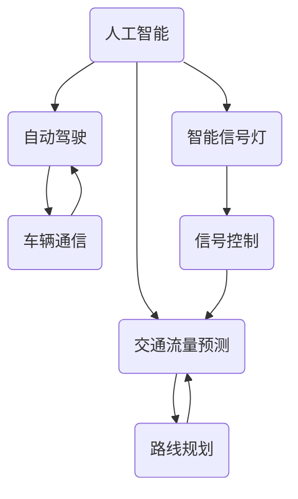
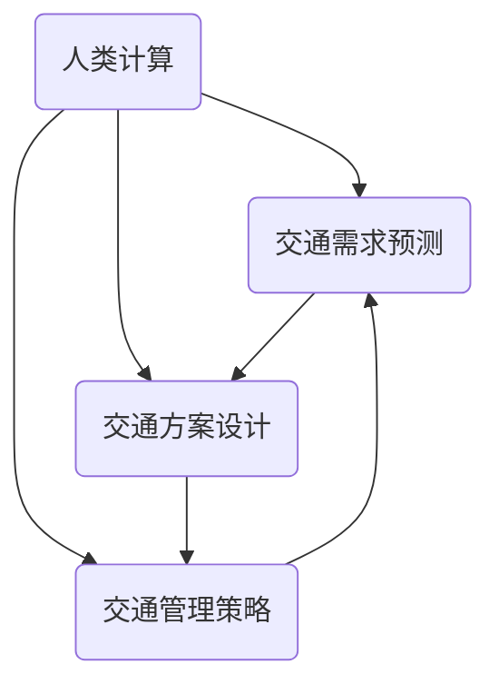
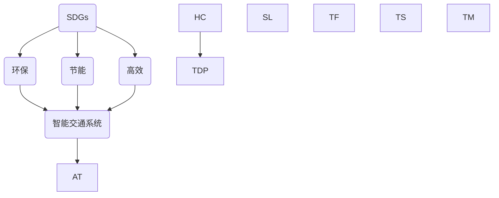

                 

# AI与人类计算：打造可持续发展的城市交通系统与规划

> **关键词**：人工智能、城市交通、可持续发展、计算规划、智能交通系统

> **摘要**：本文将探讨如何利用人工智能与人类计算相结合，打造一个可持续发展的城市交通系统与规划。通过对核心概念、算法原理、数学模型、实战案例的分析与讲解，我们将深入理解这一领域的挑战与机遇，为未来城市交通的发展提供有益的思路。

## 1. 背景介绍

### 1.1 目的和范围

本文的目的是探讨如何利用人工智能与人类计算，通过优化城市交通系统与规划，实现可持续发展。本文将涵盖以下主要内容：

1. 城市交通系统的现状与问题。
2. 人工智能在交通领域的应用与价值。
3. 人类计算在城市交通规划中的作用。
4. 可持续发展理念在城市交通系统中的体现。
5. 实战案例与未来发展趋势。

### 1.2 预期读者

本文适合对城市交通系统、人工智能、可持续发展等领域有一定了解的技术人员、城市规划师、政策制定者等。同时，也欢迎对相关领域感兴趣的研究者、学生等进行阅读。

### 1.3 文档结构概述

本文结构如下：

1. 背景介绍：介绍本文的目的、预期读者、文档结构等。
2. 核心概念与联系：阐述本文涉及的核心概念与联系。
3. 核心算法原理 & 具体操作步骤：讲解城市交通系统的核心算法原理与操作步骤。
4. 数学模型和公式 & 详细讲解 & 举例说明：介绍城市交通系统的数学模型和公式，并进行详细讲解和举例说明。
5. 项目实战：通过实际案例展示如何利用人工智能与人类计算优化城市交通系统。
6. 实际应用场景：分析城市交通系统在实际应用场景中的挑战与解决方案。
7. 工具和资源推荐：推荐相关学习资源、开发工具和框架。
8. 总结：总结本文的主要内容，探讨未来发展趋势与挑战。
9. 附录：提供常见问题与解答。
10. 扩展阅读 & 参考资料：推荐相关阅读资料。

### 1.4 术语表

#### 1.4.1 核心术语定义

- **人工智能（AI）**：模拟、延伸和扩展人的智能的理论、方法、技术及应用系统。
- **城市交通系统**：包括公共交通、私人交通、步行和骑行等在内的城市出行方式及其设施、服务的总体。
- **可持续发展**：在不损害未来世代满足自身需求能力的前提下，满足当代人需求的经济发展模式。
- **智能交通系统（ITS）**：利用先进的信息通信技术，实现交通系统的智能化管理。

#### 1.4.2 相关概念解释

- **交通流量**：单位时间内通过道路、桥梁、隧道等交通设施的车流量。
- **交通拥堵**：交通流量过大，导致车辆在道路上行驶缓慢甚至停滞的现象。
- **交通效率**：交通系统在满足出行需求的同时，所耗费的时间、能源等资源的最小化。

#### 1.4.3 缩略词列表

- **AI**：人工智能（Artificial Intelligence）
- **ITS**：智能交通系统（Intelligent Transportation System）
- **SDGs**：可持续发展目标（Sustainable Development Goals）
- **UTC**：城市交通规划（Urban Transportation Planning）

## 2. 核心概念与联系

### 2.1 人工智能与城市交通系统

人工智能在交通领域的应用越来越广泛，如自动驾驶、智能信号灯、交通流量预测等。以下是一个简化的 Mermaid 流程图，展示了人工智能在交通系统中的应用架构：

### 2.2 人类计算与城市交通规划

人类计算在城市交通规划中发挥着重要作用，如交通需求预测、交通方案设计、交通管理策略制定等。以下是一个简化的 Mermaid 流程图，展示了人类计算在城市交通规划中的应用：

### 2.3 可持续发展理念与城市交通系统

可持续发展理念要求在城市交通系统中实现环保、节能、高效等目标。以下是一个简化的 Mermaid 流程图，展示了可持续发展理念在交通系统中的体现：

通过上述核心概念与联系的分析，我们可以看到人工智能、人类计算和可持续发展理念在城市交通系统与规划中的紧密联系。接下来，我们将进一步探讨城市交通系统的核心算法原理与具体操作步骤。

