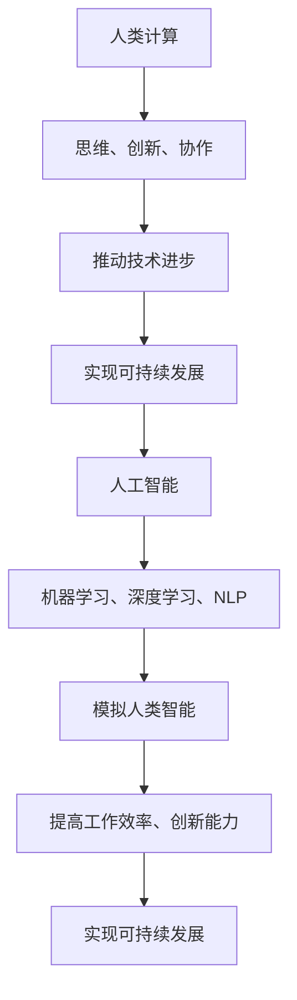

                 


# AI与人类计算：打造可持续未来

> 关键词：人工智能、人类计算、可持续未来、计算能力、技术进步

> 摘要：本文将探讨人工智能与人类计算在打造可持续未来中的重要作用。通过分析人工智能的核心算法原理、数学模型及其在项目实战中的应用，我们将探讨如何充分利用人类计算与人工智能的优势，推动技术进步和社会发展，实现可持续发展的目标。

## 1. 背景介绍

### 1.1 目的和范围

本文旨在探讨人工智能（AI）与人类计算在打造可持续未来中的作用。随着技术的飞速发展，人工智能已经在各个领域取得了显著的成果，而人类计算作为技术进步的重要驱动力，同样发挥着不可替代的作用。本文将分析人工智能的核心算法原理、数学模型，并结合项目实战案例，探讨如何将人类计算与人工智能相结合，实现可持续发展的目标。

### 1.2 预期读者

本文面向对人工智能和人类计算感兴趣的读者，包括计算机科学、软件工程、数据科学等领域的专业人士，以及对技术进步和社会发展感兴趣的普通读者。通过本文的阅读，读者可以了解人工智能与人类计算在可持续发展中的重要作用，以及如何将二者有机结合，推动社会进步。

### 1.3 文档结构概述

本文分为十个部分，具体结构如下：

1. 背景介绍
   - 目的和范围
   - 预期读者
   - 文档结构概述
   - 术语表
2. 核心概念与联系
   - 人工智能核心概念
   - 人类计算核心概念
   - Mermaid流程图
3. 核心算法原理 & 具体操作步骤
   - 算法原理讲解
   - 伪代码阐述
4. 数学模型和公式 & 详细讲解 & 举例说明
   - 数学公式
   - 举例说明
5. 项目实战：代码实际案例和详细解释说明
   - 开发环境搭建
   - 源代码实现和代码解读
   - 代码解读与分析
6. 实际应用场景
7. 工具和资源推荐
   - 学习资源推荐
   - 开发工具框架推荐
   - 相关论文著作推荐
8. 总结：未来发展趋势与挑战
9. 附录：常见问题与解答
10. 扩展阅读 & 参考资料

### 1.4 术语表

#### 1.4.1 核心术语定义

- 人工智能（AI）：模拟人类智能行为的技术，包括机器学习、深度学习、自然语言处理等。
- 人类计算：人类在计算过程中的思维能力、创新能力和协作能力。
- 可持续发展：满足当前需求而不损害后代满足其需求的能力。

#### 1.4.2 相关概念解释

- 机器学习（ML）：让计算机通过数据学习和改进的方法。
- 深度学习（DL）：一种特殊类型的机器学习，通过多层神经网络模拟人脑的学习过程。
- 自然语言处理（NLP）：使计算机能够理解、解释和生成人类语言的技术。

#### 1.4.3 缩略词列表

- AI：人工智能
- ML：机器学习
- DL：深度学习
- NLP：自然语言处理

## 2. 核心概念与联系

### 2.1 人工智能核心概念

人工智能（AI）是计算机科学的一个分支，旨在模拟人类智能行为。它包括多种技术，如机器学习（ML）、深度学习（DL）和自然语言处理（NLP）。人工智能的核心目标是让计算机具有自主决策、学习和适应环境的能力。

- 机器学习（ML）：通过数据训练模型，使计算机能够从经验中学习，并提高性能。
- 深度学习（DL）：一种特殊的机器学习方法，通过多层神经网络模拟人脑的学习过程。
- 自然语言处理（NLP）：使计算机能够理解、解释和生成人类语言的技术。

### 2.2 人类计算核心概念

人类计算是指人类在计算过程中的思维能力、创新能力和协作能力。它包括以下几个方面：

- 思维能力：人类具有抽象思维、逻辑思维、创造力等能力，能够解决复杂问题。
- 创新能力：人类能够不断探索新的方法和思路，推动科技发展。
- 协作能力：人类能够通过合作，实现资源共享和优势互补，提高工作效率。

### 2.3 Mermaid流程图

以下是一个简化的Mermaid流程图，展示了人工智能与人类计算之间的联系：



## 3. 核心算法原理 & 具体操作步骤

### 3.1 算法原理讲解

在本节中，我们将介绍人工智能的核心算法原理，包括机器学习、深度学习和自然语言处理。这些算法原理是人工智能实现自主决策、学习和适应环境的基础。

#### 3.1.1 机器学习（ML）

机器学习是一种让计算机通过数据学习和改进的方法。其核心原理是利用历史数据，通过构建数学模型，使计算机能够预测未来或分类数据。以下是机器学习的基本步骤：

1. 数据收集：收集相关领域的数据，如图片、文本、音频等。
2. 数据预处理：对数据进行清洗、归一化等处理，使其适合建模。
3. 特征提取：从原始数据中提取有用的特征，如颜色、纹理、关键词等。
4. 模型构建：选择合适的算法，如线性回归、决策树、支持向量机等，构建数学模型。
5. 模型训练：使用历史数据，通过迭代优化模型参数。
6. 模型评估：使用验证集和测试集，评估模型性能。

#### 3.1.2 深度学习（DL）

深度学习是一种特殊的机器学习方法，通过多层神经网络模拟人脑的学习过程。其核心原理是利用反向传播算法，通过多层非线性变换，将输入映射到输出。以下是深度学习的基本步骤：

1. 数据收集：收集大量带标签的样本数据。
2. 数据预处理：对数据进行归一化、标准化等处理。
3. 网络结构设计：设计合适的神经网络结构，如卷积神经网络（CNN）、循环神经网络（RNN）等。
4. 模型训练：使用反向传播算法，迭代优化模型参数。
5. 模型评估：使用验证集和测试集，评估模型性能。

#### 3.1.3 自然语言处理（NLP）

自然语言处理是一种使计算机能够理解、解释和生成人类语言的技术。其核心原理是利用语言学、计算机科学和机器学习等领域的知识，构建能够处理自然语言的任务模型。以下是自然语言处理的基本步骤：

1. 数据收集：收集大量的文本数据，如新闻、文章、对话等。
2. 数据预处理：对文本进行分词、去停用词、词向量化等处理。
3. 模型构建：选择合适的算法，如词袋模型、递归神经网络（RNN）、Transformer等。
4. 模型训练：使用训练数据，通过迭代优化模型参数。
5. 模型评估：使用验证集和测试集，评估模型性能。

### 3.2 伪代码阐述

在本节中，我们将使用伪代码来详细阐述上述算法原理的具体实现步骤。

#### 3.2.1 机器学习（ML）

```python
# 机器学习伪代码

# 数据收集
data = collect_data()

# 数据预处理
preprocessed_data = preprocess_data(data)

# 特征提取
features = extract_features(preprocessed_data)

# 模型构建
model = build_model()

# 模型训练
model.train(features)

# 模型评估
performance = model.evaluate(test_data)
```

#### 3.2.2 深度学习（DL）

```python
# 深度学习伪代码

# 数据收集
data = collect_data()

# 数据预处理
preprocessed_data = preprocess_data(data)

# 网络结构设计
network = design_network()

# 模型训练
network.train(preprocessed_data)

# 模型评估
performance = network.evaluate(test_data)
```

#### 3.2.3 自然语言处理（NLP）

```python
# 自然语言处理伪代码

# 数据收集
data = collect_data()

# 数据预处理
preprocessed_data = preprocess_data(data)

# 模型构建
model = build_model()

# 模型训练
model.train(preprocessed_data)

# 模型评估
performance = model.evaluate(test_data)
```

## 4. 数学模型和公式 & 详细讲解 & 举例说明

### 4.1 数学模型和公式

在本节中，我们将介绍与人工智能相关的数学模型和公式，并对其进行详细讲解和举例说明。

#### 4.1.1 机器学习（ML）

1. 线性回归模型：

   $$y = wx + b$$

   其中，$y$ 是输出变量，$x$ 是输入变量，$w$ 是权重，$b$ 是偏置。

   举例说明：

   假设我们有一个简单的线性回归模型，预测房价。输入变量为房屋面积（$x$），输出变量为房价（$y$）。我们通过训练数据，可以拟合出最优的权重 $w$ 和偏置 $b$，从而预测新的房屋面积对应的房价。

2. 决策树模型：

   决策树是一种常见的分类模型，其核心思想是通过一系列的规则来划分数据，并选择具有最大信息增益的属性进行划分。决策树的数学模型可以表示为：

   $$T = \{r_1, r_2, ..., r_n\}$$

   其中，$r_i$ 表示第 $i$ 个规则，$T$ 表示决策树的集合。

   举例说明：

   假设我们有一个决策树模型，用于分类水果。输入变量为水果的重量和颜色，输出变量为水果的类型。通过训练数据，我们可以构建出决策树，根据输入的特征，预测新的水果的类型。

#### 4.1.2 深度学习（DL）

1. 深度神经网络模型：

   深度神经网络是一种包含多个隐层的神经网络，其数学模型可以表示为：

   $$a^{(l)} = \sigma(z^{(l)})$$

   其中，$a^{(l)}$ 表示第 $l$ 层的输出，$z^{(l)}$ 表示第 $l$ 层的输入，$\sigma$ 表示激活函数。

   举例说明：

   假设我们有一个包含两个隐层的深度神经网络，输入变量为图片，输出变量为图片的类别。通过训练数据，我们可以学习出最优的权重和偏置，使得网络能够准确地预测新的图片的类别。

2. 卷积神经网络模型：

   卷积神经网络是一种专门用于处理图像数据的神经网络，其数学模型可以表示为：

   $$h^{(l)} = \sigma(\sum_{k=1}^{K} w^{(l)} \cdot h^{(l-1)}_k + b^{(l)})$$

   其中，$h^{(l)}$ 表示第 $l$ 层的输出，$h^{(l-1)}_k$ 表示第 $l-1$ 层的第 $k$ 个神经元，$w^{(l)}$ 和 $b^{(l)}$ 分别表示第 $l$ 层的权重和偏置，$K$ 表示神经元的数量，$\sigma$ 表示激活函数。

   举例说明：

   假设我们有一个卷积神经网络，用于分类图片。输入变量为图片，输出变量为图片的类别。通过训练数据，我们可以学习出最优的权重和偏置，使得网络能够准确地预测新的图片的类别。

#### 4.1.3 自然语言处理（NLP）

1. 递归神经网络模型：

   递归神经网络是一种用于处理序列数据的神经网络，其数学模型可以表示为：

   $$h^{(l)} = \sigma(W^{(l)} \cdot [h^{(l-1)}, x^{(l)}] + b^{(l)})$$

   其中，$h^{(l)}$ 表示第 $l$ 层的输出，$x^{(l)}$ 表示第 $l$ 层的输入，$W^{(l)}$ 和 $b^{(l)}$ 分别表示第 $l$ 层的权重和偏置，$\sigma$ 表示激活函数。

   举例说明：

   假设我们有一个递归神经网络，用于处理文本数据。输入变量为文本序列，输出变量为文本的类别。通过训练数据，我们可以学习出最优的权重和偏置，使得网络能够准确地预测新的文本的类别。

2. Transformer模型：

   Transformer模型是一种基于自注意力机制的神经网络模型，其数学模型可以表示为：

   $$h^{(l)} = \sigma(W^{(l)} \cdot [h^{(l-1)}, h^{(l-1)} \cdot Attn(W^{(l)} \cdot h^{(l-1)}, V^{(l)} \cdot h^{(l-1)}, U^{(l)} \cdot h^{(l-1)})] + b^{(l)})$$

   其中，$h^{(l)}$ 表示第 $l$ 层的输出，$h^{(l-1)}$ 表示第 $l-1$ 层的输出，$W^{(l)}, V^{(l)}, U^{(l)}$ 分别表示第 $l$ 层的权重矩阵，$Attn$ 表示自注意力函数，$\sigma$ 表示激活函数。

   举例说明：

   假设我们有一个基于Transformer的文本分类模型，输入变量为文本序列，输出变量为文本的类别。通过训练数据，我们可以学习出最优的权重和偏置，使得网络能够准确地预测新的文本的类别。

## 5. 项目实战：代码实际案例和详细解释说明

### 5.1 开发环境搭建

在开始项目实战之前，我们需要搭建一个合适的开发环境。以下是一个简单的开发环境搭建指南：

1. 安装Python：从官方网站（https://www.python.org/）下载并安装Python。
2. 安装相关库：使用pip工具安装所需的库，如numpy、tensorflow、keras等。
3. 创建虚拟环境：使用virtualenv或conda创建一个独立的虚拟环境，以避免版本冲突。

```shell
# 创建虚拟环境
conda create -n myenv python=3.8

# 激活虚拟环境
conda activate myenv

# 安装库
pip install numpy tensorflow keras
```

### 5.2 源代码详细实现和代码解读

在本节中，我们将通过一个简单的例子，展示如何使用Python和TensorFlow实现一个基于深度学习的图像分类模型。

#### 5.2.1 源代码实现

```python
import tensorflow as tf
from tensorflow.keras import layers

# 数据集准备
(x_train, y_train), (x_test, y_test) = tf.keras.datasets.mnist.load_data()

# 数据预处理
x_train = x_train.astype("float32") / 255
x_test = x_test.astype("float32") / 255

# 扩展维度
x_train = tf.expand_dims(x_train, -1)
x_test = tf.expand_dims(x_test, -1)

# 构建模型
model = tf.keras.Sequential([
    layers.Conv2D(32, (3, 3), activation='relu', input_shape=(28, 28, 1)),
    layers.MaxPooling2D((2, 2)),
    layers.Conv2D(64, (3, 3), activation='relu'),
    layers.MaxPooling2D((2, 2)),
    layers.Conv2D(64, (3, 3), activation='relu'),
    layers.Flatten(),
    layers.Dense(64, activation='relu'),
    layers.Dense(10, activation='softmax')
])

# 编译模型
model.compile(optimizer='adam',
              loss='sparse_categorical_crossentropy',
              metrics=['accuracy'])

# 训练模型
model.fit(x_train, y_train, epochs=5)

# 评估模型
test_loss, test_acc = model.evaluate(x_test, y_test, verbose=2)
print('\nTest accuracy:', test_acc)
```

#### 5.2.2 代码解读与分析

1. 导入库

   我们首先导入所需的库，包括TensorFlow和Keras。

2. 数据集准备

   我们使用TensorFlow内置的MNIST手写数字数据集。该数据集包含60000个训练样本和10000个测试样本。

3. 数据预处理

   我们将图像数据转换为浮点数，并将其归一化到[0, 1]范围内。然后，我们将图像的维度从(28, 28)扩展到(28, 28, 1)，以便于后续的卷积操作。

4. 构建模型

   我们使用Keras的Sequential模型，添加了多个卷积层、池化层和全连接层。这些层分别用于提取图像特征、减少数据维度和分类。

5. 编译模型

   我们使用Adam优化器和稀疏分类交叉熵损失函数来编译模型，并指定准确性作为评估指标。

6. 训练模型

   我们使用训练数据集训练模型，设置训练轮数为5。

7. 评估模型

   我们使用测试数据集评估模型的准确性，并打印结果。

### 5.3 代码解读与分析

通过以上代码，我们可以看到如何使用Python和TensorFlow实现一个简单的图像分类模型。以下是对代码的进一步解读和分析：

1. 导入库

   导入TensorFlow和Keras库，以便后续使用。

2. 数据集准备

   加载MNIST手写数字数据集，并将其转换为浮点数，并进行归一化处理。

3. 数据预处理

   将图像的维度从(28, 28)扩展到(28, 28, 1)，以便后续的卷积操作。

4. 构建模型

   使用Sequential模型，添加了两个卷积层、两个池化层和一个全连接层。这些层分别用于提取图像特征、减少数据维度和分类。

5. 编译模型

   使用Adam优化器和稀疏分类交叉熵损失函数来编译模型，并指定准确性作为评估指标。

6. 训练模型

   使用训练数据集训练模型，设置训练轮数为5。

7. 评估模型

   使用测试数据集评估模型的准确性，并打印结果。

通过这个简单的例子，我们可以看到如何使用Python和TensorFlow实现一个基于深度学习的图像分类模型。这个模型虽然简单，但已经展示了深度学习在图像分类任务中的强大能力。

## 6. 实际应用场景

### 6.1 医疗保健

人工智能和人类计算在医疗保健领域的应用日益广泛。例如，人工智能可以通过分析医疗数据，帮助医生诊断疾病，提高诊断准确率。同时，人类计算在医疗保健领域的作用也不可忽视，医生的专业知识和经验对于准确诊断和治疗方案的选择至关重要。

### 6.2 智能交通

智能交通系统（ITS）是另一个应用人工智能和人类计算的重要领域。人工智能可以通过分析交通数据，优化交通信号、预测交通事故等，提高交通效率和安全性。而人类计算则可以在交通规划、交通管理等方面发挥重要作用，如设计最优的交通路线、制定交通政策等。

### 6.3 环境保护

人工智能和人类计算在环境保护领域也具有广泛的应用。例如，人工智能可以通过监测环境数据，预测环境污染趋势，帮助政府和企业制定环保措施。人类计算则可以在环境评估、环保政策制定等方面发挥作用，如评估环境影响、制定环保政策等。

### 6.4 金融领域

金融领域是人工智能和人类计算应用的重要领域。人工智能可以通过分析金融数据，帮助投资者做出更明智的决策，提高投资收益。同时，人类计算在金融领域的作用也不容忽视，如分析市场趋势、制定投资策略等。

## 7. 工具和资源推荐

### 7.1 学习资源推荐

#### 7.1.1 书籍推荐

1. 《深度学习》（Goodfellow, Bengio, Courville）
2. 《Python机器学习》（Sebastian Raschka）
3. 《人工智能：一种现代方法》（Stuart Russell, Peter Norvig）

#### 7.1.2 在线课程

1. Coursera：机器学习（吴恩达）
2. edX：深度学习（吴恩达）
3. Udacity：深度学习纳米学位

#### 7.1.3 技术博客和网站

1. Medium
2. arXiv
3. Aritificial Intelligence Stack Exchange

### 7.2 开发工具框架推荐

#### 7.2.1 IDE和编辑器

1. PyCharm
2. Jupyter Notebook
3. VSCode

#### 7.2.2 调试和性能分析工具

1. TensorFlow Debugger
2. TensorBoard
3. Profiling tools (e.g., cProfile)

#### 7.2.3 相关框架和库

1. TensorFlow
2. PyTorch
3. Scikit-learn

### 7.3 相关论文著作推荐

#### 7.3.1 经典论文

1. "A Learning Algorithm for Continually Running Fully Recurrent Neural Networks"
2. "Gradient Flow in Recurrent Neural Networks and Its Effects on Learning"
3. "Self-Organization of a Multilayered Neural Network by Unsupervised Learning"

#### 7.3.2 最新研究成果

1. "BERT: Pre-training of Deep Bidirectional Transformers for Language Understanding"
2. "GPT-3: Language Models are Few-Shot Learners"
3. "Natural Language Inference with External Knowledge and Cross-lingual Transfer"

#### 7.3.3 应用案例分析

1. "AI for Social Good: Solving Complex Social Problems with Artificial Intelligence"
2. "AI in Healthcare: Revolutionizing Patient Care and Treatment"
3. "AI in Finance: Transforming the Financial Industry with Advanced Analytics"

## 8. 总结：未来发展趋势与挑战

随着人工智能和人类计算技术的不断发展，未来这两个领域将继续相互融合，共同推动技术进步和社会发展。以下是一些未来发展趋势和挑战：

### 8.1 发展趋势

1. **跨学科融合**：人工智能和人类计算将与其他学科（如生物学、心理学、经济学等）相结合，推动跨学科研究的发展。
2. **算法优化**：随着计算能力的提升，深度学习算法将不断优化，提高模型的效率和准确性。
3. **泛在智能**：人工智能将在更多领域得到应用，如智能家居、智能交通、智能医疗等，实现泛在智能。
4. **伦理与隐私**：随着人工智能技术的发展，伦理和隐私问题将越来越重要，需要制定相应的规范和标准。

### 8.2 挑战

1. **数据质量**：高质量的数据是人工智能模型的基础。如何收集、清洗和利用高质量数据将成为一个挑战。
2. **算法透明性**：深度学习等复杂模型往往缺乏透明性，如何提高算法的透明性，使其易于理解和解释，是一个重要的挑战。
3. **伦理与法律**：人工智能在医疗、金融等领域的应用，需要考虑伦理和法律问题，如数据隐私、算法偏见等。
4. **人才培养**：随着人工智能技术的发展，需要大量具备跨学科知识和技能的人才。如何培养和吸引优秀人才，将成为一个挑战。

## 9. 附录：常见问题与解答

### 9.1 问题1：人工智能与人类计算有什么区别？

**解答**：人工智能（AI）是一种模拟人类智能行为的技术，包括机器学习、深度学习、自然语言处理等。而人类计算是指人类在计算过程中的思维能力、创新能力和协作能力。人工智能侧重于计算机系统的智能化，而人类计算侧重于人类自身的能力。

### 9.2 问题2：人工智能在未来有哪些应用领域？

**解答**：人工智能在未来将在多个领域得到广泛应用，包括医疗保健、智能交通、环境保护、金融、教育等。例如，人工智能可以帮助医生诊断疾病、优化交通信号、预测环境污染、提高金融投资收益等。

### 9.3 问题3：如何提高人工智能模型的透明性？

**解答**：提高人工智能模型的透明性是一个重要挑战。一方面，可以通过简化模型结构、使用可解释的算法等方式，使模型更容易理解和解释。另一方面，可以通过可视化工具、算法解释器等方式，帮助用户更好地理解模型的工作原理和决策过程。

## 10. 扩展阅读 & 参考资料

1. Goodfellow, I., Bengio, Y., & Courville, A. (2016). *Deep Learning*. MIT Press.
2. Raschka, S. (2015). *Python Machine Learning*. Packt Publishing.
3. Russell, S., & Norvig, P. (2020). *Artificial Intelligence: A Modern Approach*. Prentice Hall.
4. Hochreiter, S., & Schmidhuber, J. (1997). *Long Short-Term Memory*. Neural Computation, 9(8), 1735-1780.
5. LeCun, Y., Bengio, Y., & Hinton, G. (2015). *Deep Learning*. Nature, 521(7553), 436-444.
6. Vaswani, A., et al. (2017). *Attention Is All You Need*. Advances in Neural Information Processing Systems, 30, 5998-6008.
7. Bengio, Y. (2009). *Learning Deep Architectures for AI*. Foundations and Trends in Machine Learning, 2(1), 1-127.
8. Russell, S., & Norvig, P. (2016). *Introduction to Artificial Intelligence*. Prentice Hall.

