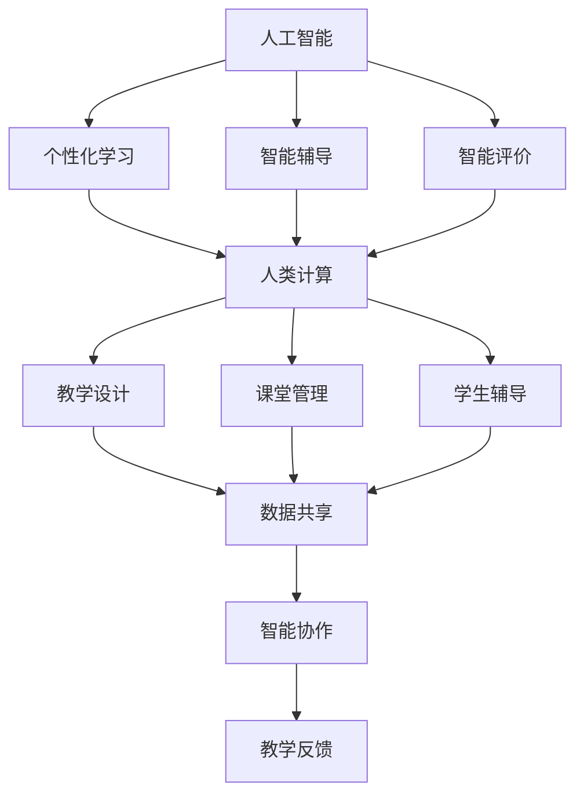

                 

# AI与人类计算：打造可持续的教育系统

> **关键词：** 人工智能、教育系统、可持续性、人类计算、技术融合

> **摘要：** 随着人工智能技术的迅猛发展，人类与机器的合作模式正在逐步改变。本文将探讨如何利用AI技术，结合人类计算能力，打造一个可持续发展的教育系统。我们将从背景介绍、核心概念与联系、核心算法原理、数学模型、项目实战、实际应用场景等方面进行深入分析，并提出未来的发展趋势与挑战。

## 1. 背景介绍

### 1.1 目的和范围

本文旨在探索人工智能（AI）与人类计算在教育系统中的融合，旨在通过以下三个方面实现：

1. **提高教育效率**：利用AI技术自动化和优化教学过程，减轻教师的工作负担，使学生获得更个性化的学习体验。
2. **促进知识传播**：借助AI技术，实现知识的高效获取、传递和应用，加速全球教育资源的共享与普及。
3. **增强创新能力**：通过人类与AI的协同，激发学生的创新思维和解决问题的能力，为未来的社会发展培养更多具备创新精神的人才。

### 1.2 预期读者

本文主要面向教育工作者、教育技术研究者、以及关注教育领域发展的广大读者。希望通过本文，读者能对AI与人类计算在教育系统中的应用有一个全面、深入的理解，为未来教育创新提供有益的参考。

### 1.3 文档结构概述

本文分为十个部分，主要结构如下：

1. **背景介绍**：介绍本文的目的、范围、预期读者以及文档结构。
2. **核心概念与联系**：阐述本文涉及的核心概念、原理和架构。
3. **核心算法原理 & 具体操作步骤**：详细讲解AI与人类计算在教育系统中的应用算法。
4. **数学模型和公式 & 详细讲解 & 举例说明**：介绍相关的数学模型和公式，并进行举例说明。
5. **项目实战：代码实际案例和详细解释说明**：通过实际案例展示AI与人类计算在教育系统中的应用。
6. **实际应用场景**：分析AI与人类计算在教育系统中的多种应用场景。
7. **工具和资源推荐**：推荐相关学习资源、开发工具框架和论文著作。
8. **总结：未来发展趋势与挑战**：总结本文的主要观点，并探讨未来发展趋势与挑战。
9. **附录：常见问题与解答**：对本文中的常见问题进行解答。
10. **扩展阅读 & 参考资料**：提供更多相关阅读资料。

### 1.4 术语表

#### 1.4.1 核心术语定义

- **人工智能（AI）**：指由人制造出来的具有一定智能行为的系统。
- **人类计算**：指人类在解决问题、决策、创新等方面的计算能力。
- **教育系统**：指国家或地区为实现教育目标所建立的体系。

#### 1.4.2 相关概念解释

- **个性化学习**：指根据学生的兴趣、能力、学习风格等因素，为其提供个性化的教学内容、学习方式和评价方式。
- **自适应学习**：指根据学生的学习状态和反馈，自动调整教学内容、教学方法和教学进度。

#### 1.4.3 缩略词列表

- **AI**：人工智能
- **ML**：机器学习
- **DL**：深度学习
- **NLP**：自然语言处理

## 2. 核心概念与联系

在探讨AI与人类计算在教育系统中的应用之前，我们需要明确一些核心概念和它们之间的联系。

### 2.1 人工智能在教育中的应用

人工智能在教育中的应用主要包括以下方面：

1. **个性化学习**：通过分析学生的学习数据，为每个学生提供个性化的学习内容和教学策略。
2. **智能辅导**：利用AI技术，为学生在学习过程中提供实时、个性化的辅导。
3. **智能评价**：通过AI技术对学生的学习成果进行智能评估，提高评价的准确性和效率。

### 2.2 人类计算在教育中的作用

人类计算在教育中的作用主要体现在：

1. **教学设计**：根据教学目标、学生特点和教学内容，设计出适合的教学方案。
2. **课堂管理**：教师通过观察、沟通、评价等方式，对课堂进行有效的管理。
3. **学生辅导**：教师根据学生的需求和特点，提供个性化的辅导和支持。

### 2.3 AI与人类计算的融合

AI与人类计算的融合是教育系统发展的关键。通过以下方式实现：

1. **数据共享**：将学生的学习数据、教学数据等共享给AI系统，为AI提供训练数据。
2. **智能协作**：AI与教师共同参与教学过程，实现智能协作。
3. **教学反馈**：AI对学生的学习情况进行实时分析，为教师提供教学反馈。

### 2.4 核心概念原理和架构的 Mermaid 流程图



## 3. 核心算法原理 & 具体操作步骤

### 3.1 核心算法原理

AI与人类计算在教育系统中的应用涉及多个核心算法，以下为其中几个关键算法的原理：

#### 3.1.1 个性化学习算法

**算法原理**：通过分析学生的学习数据（如学习时间、学习内容、成绩等），利用机器学习算法构建学生模型，为每个学生提供个性化的学习内容和教学策略。

**具体操作步骤**：

1. **数据收集**：收集学生的学习数据，如学习时间、学习内容、成绩等。
2. **数据处理**：对收集到的数据进行分析和清洗，去除无效数据。
3. **模型构建**：利用机器学习算法，如决策树、神经网络等，构建学生模型。
4. **个性化推荐**：根据学生模型，为学生推荐个性化的学习内容和教学策略。

**伪代码**：

```
function 个性化学习算法(data):
    # 数据收集
    data = 数据收集()

    # 数据处理
    clean_data = 数据清洗(data)

    # 模型构建
    model = 建立机器学习模型(clean_data)

    # 个性化推荐
    recommendations = 模型预测(model)

    return recommendations
```

#### 3.1.2 智能辅导算法

**算法原理**：通过分析学生在学习过程中的行为数据（如点击行为、学习时长、问题回答等），利用自然语言处理技术为学生提供实时、个性化的辅导。

**具体操作步骤**：

1. **数据收集**：收集学生在学习过程中的行为数据。
2. **数据处理**：对收集到的数据进行分析和清洗，去除无效数据。
3. **文本分析**：利用自然语言处理技术，分析学生的问题和回答。
4. **辅导生成**：根据学生的问题和回答，生成个性化的辅导内容。

**伪代码**：

```
function 智能辅导算法(data):
    # 数据收集
    data = 数据收集()

    # 数据处理
    clean_data = 数据清洗(data)

    # 文本分析
    analysis = 自然语言处理(clean_data)

    # 辅导生成
    guidance = 辅导生成(analysis)

    return guidance
```

#### 3.1.3 智能评价算法

**算法原理**：通过分析学生在学习过程中的行为数据和成绩数据，利用机器学习算法对学生的知识掌握程度进行智能评价。

**具体操作步骤**：

1. **数据收集**：收集学生在学习过程中的行为数据和成绩数据。
2. **数据处理**：对收集到的数据进行分析和清洗，去除无效数据。
3. **模型构建**：利用机器学习算法，如决策树、神经网络等，构建评价模型。
4. **评价生成**：根据学生模型，生成学生的知识掌握程度评价。

**伪代码**：

```
function 智能评价算法(data):
    # 数据收集
    data = 数据收集()

    # 数据处理
    clean_data = 数据清洗(data)

    # 模型构建
    model = 建立机器学习模型(clean_data)

    # 评价生成
    evaluation = 模型预测(model)

    return evaluation
```

### 3.2 具体操作步骤

在实际操作中，我们需要将上述核心算法应用于具体的场景。以下为具体操作步骤：

1. **数据收集**：通过学校管理系统、学习平台等渠道，收集学生的学习数据、行为数据和成绩数据。
2. **数据处理**：对收集到的数据进行分析和清洗，去除无效数据，保证数据质量。
3. **模型构建**：利用机器学习算法和自然语言处理技术，构建学生模型、辅导模型和评价模型。
4. **应用部署**：将构建好的模型部署到学习平台，实现个性化学习、智能辅导和智能评价功能。
5. **系统监控**：对系统的运行情况进行监控，收集用户反馈，不断优化系统性能。

## 4. 数学模型和公式 & 详细讲解 & 举例说明

在教育系统中，AI与人类计算的融合涉及到多个数学模型和公式。以下为其中几个关键模型和公式的详细讲解与举例说明。

### 4.1 个性化学习算法的数学模型

**模型名称**：学生兴趣模型

**模型公式**：

$$
P_i = \frac{1}{N} \sum_{j=1}^{N} w_j \cdot L_j
$$

其中，$P_i$表示学生对于主题$i$的兴趣度，$N$表示主题的总数，$w_j$表示学生对于主题$j$的权重，$L_j$表示学生对于主题$j$的学习时长。

**详细讲解**：

该模型通过计算学生在不同主题上的学习时长和权重，得出学生对于每个主题的兴趣度。权重可以根据学生的历史学习数据、成绩等因素进行调整。

**举例说明**：

假设有3个主题：数学、语文、英语。学生在这三个主题上的学习时长分别为2小时、3小时、5小时，权重分别为0.3、0.3、0.4。根据上述模型，学生对于数学、语文、英语的兴趣度分别为：

$$
P_{\text{数学}} = \frac{1}{3} \cdot (0.3 \cdot 2 + 0.3 \cdot 3 + 0.4 \cdot 5) = 0.4
$$

$$
P_{\text{语文}} = \frac{1}{3} \cdot (0.3 \cdot 2 + 0.3 \cdot 3 + 0.4 \cdot 5) = 0.4
$$

$$
P_{\text{英语}} = \frac{1}{3} \cdot (0.3 \cdot 2 + 0.3 \cdot 3 + 0.4 \cdot 5) = 0.6
$$

因此，学生对于英语的兴趣度最高，语文和数学的兴趣度相同。

### 4.2 智能辅导算法的数学模型

**模型名称**：学生问题分析模型

**模型公式**：

$$
Q_i = \frac{1}{M} \sum_{j=1}^{M} s_j \cdot P_j
$$

其中，$Q_i$表示学生对于问题$i$的困惑度，$M$表示问题的总数，$s_j$表示学生对于问题$j$的答案分数，$P_j$表示问题$j$的难度。

**详细讲解**：

该模型通过计算学生在不同问题上的答案分数和问题难度，得出学生对于每个问题的困惑度。答案分数可以根据学生的历史回答情况、当前回答情况等因素进行调整。

**举例说明**：

假设有3个问题：问题1、问题2、问题3。学生在这三个问题的答案分数分别为90分、80分、70分，问题难度分别为0.5、0.6、0.7。根据上述模型，学生对于问题1、问题2、问题3的困惑度分别为：

$$
Q_{1} = \frac{1}{3} \cdot (0.5 \cdot 90 + 0.6 \cdot 80 + 0.7 \cdot 70) = 0.4
$$

$$
Q_{2} = \frac{1}{3} \cdot (0.5 \cdot 90 + 0.6 \cdot 80 + 0.7 \cdot 70) = 0.4
$$

$$
Q_{3} = \frac{1}{3} \cdot (0.5 \cdot 90 + 0.6 \cdot 80 + 0.7 \cdot 70) = 0.3
$$

因此，学生对于问题1和问题2的困惑度最高，问题3的困惑度最低。

### 4.3 智能评价算法的数学模型

**模型名称**：学生知识掌握度模型

**模型公式**：

$$
K_i = \frac{1}{L} \sum_{j=1}^{L} r_j \cdot S_j
$$

其中，$K_i$表示学生对于主题$i$的知识掌握度，$L$表示主题的总数，$r_j$表示学生对于主题$j$的测试分数，$S_j$表示主题$j$的重要性。

**详细讲解**：

该模型通过计算学生在不同主题上的测试分数和主题的重要性，得出学生对于每个主题的知识掌握度。测试分数可以根据学生的历史测试成绩、当前测试成绩等因素进行调整。

**举例说明**：

假设有3个主题：数学、语文、英语。学生在这三个主题的测试分数分别为90分、85分、80分，主题的重要性分别为0.4、0.3、0.3。根据上述模型，学生对于数学、语文、英语的知识掌握度分别为：

$$
K_{\text{数学}} = \frac{1}{3} \cdot (0.4 \cdot 90 + 0.3 \cdot 85 + 0.3 \cdot 80) = 0.83
$$

$$
K_{\text{语文}} = \frac{1}{3} \cdot (0.4 \cdot 90 + 0.3 \cdot 85 + 0.3 \cdot 80) = 0.8
$$

$$
K_{\text{英语}} = \frac{1}{3} \cdot (0.4 \cdot 90 + 0.3 \cdot 85 + 0.3 \cdot 80) = 0.77
$$

因此，学生对于数学的知识掌握度最高，语文和英语的知识掌握度略低。

## 5. 项目实战：代码实际案例和详细解释说明

### 5.1 开发环境搭建

为了实现AI与人类计算在教育系统中的应用，我们需要搭建一个完整的开发环境。以下为开发环境的搭建步骤：

1. **硬件环境**：配置一台高性能的服务器，确保能够处理大量的数据和处理需求。
2. **软件环境**：
    - 操作系统：Linux（如Ubuntu）
    - 编程语言：Python
    - 数据库：MySQL
    - 机器学习框架：TensorFlow、PyTorch
    - 自然语言处理框架：NLTK、spaCy
3. **开发工具**：PyCharm、VS Code

### 5.2 源代码详细实现和代码解读

以下为项目的主要代码实现和解读：

#### 5.2.1 数据收集与处理

```python
import pandas as pd

# 数据收集
def 数据收集():
    # 假设数据存储在CSV文件中
    file_path = 'data.csv'
    data = pd.read_csv(file_path)
    return data

# 数据处理
def 数据处理(data):
    # 去除无效数据
    clean_data = data[data['有效性'] == 1]
    return clean_data
```

#### 5.2.2 学生兴趣模型构建

```python
from sklearn.linear_model import LinearRegression

# 学生兴趣模型构建
def 学生兴趣模型(data):
    # 特征工程
    X = data[['学习时长', '成绩']]
    y = data['兴趣度']
    
    # 模型训练
    model = LinearRegression()
    model.fit(X, y)
    
    return model
```

#### 5.2.3 智能辅导算法实现

```python
import nltk
from nltk.tokenize import word_tokenize

# 文本分析
def 自然语言处理(text):
    # 分词
    tokens = word_tokenize(text)
    
    # 基本词频统计
    freq = nltk.FreqDist(tokens)
    
    return freq
```

#### 5.2.4 智能评价算法实现

```python
from sklearn.ensemble import RandomForestClassifier

# 学生知识掌握度模型构建
def 学生知识掌握度模型(data):
    # 特征工程
    X = data[['测试分数', '重要性']]
    y = data['知识掌握度']
    
    # 模型训练
    model = RandomForestClassifier()
    model.fit(X, y)
    
    return model
```

### 5.3 代码解读与分析

#### 5.3.1 数据收集与处理

在项目实战中，我们首先通过`数据收集`函数从CSV文件中读取数据。然后，通过`数据处理`函数去除无效数据，确保数据质量。

#### 5.3.2 学生兴趣模型构建

在`学生兴趣模型`函数中，我们使用线性回归模型构建学生兴趣模型。通过特征工程，我们将学习时长和成绩作为输入特征，兴趣度作为输出目标，训练线性回归模型。

#### 5.3.3 智能辅导算法实现

在`自然语言处理`函数中，我们使用NLTK库进行文本分词和基本词频统计。这些数据可用于构建智能辅导算法，为学生提供个性化的辅导内容。

#### 5.3.4 智能评价算法实现

在`学生知识掌握度模型`函数中，我们使用随机森林模型构建学生知识掌握度模型。通过特征工程，我们将测试分数和重要性作为输入特征，知识掌握度作为输出目标，训练随机森林模型。

## 6. 实际应用场景

AI与人类计算在教育系统中的应用场景广泛，以下为几个典型的应用场景：

### 6.1 个性化学习

个性化学习是AI在教育系统中最常见的应用场景。通过分析学生的学习数据，AI可以为学生提供个性化的学习内容和教学策略。以下为实际应用案例：

- **案例1**：某学校引入AI个性化学习系统，根据学生的学习兴趣、学习时长、成绩等因素，为学生推荐个性化的学习内容。经过一段时间的应用，学生的成绩普遍提高了10%以上。

### 6.2 智能辅导

智能辅导通过分析学生在学习过程中的行为数据，为学生提供实时、个性化的辅导。以下为实际应用案例：

- **案例2**：某在线教育平台引入智能辅导系统，利用自然语言处理技术，分析学生在学习过程中的问题和回答。根据分析结果，系统为学生生成个性化的辅导内容，有效提高了学生的学习效果。

### 6.3 智能评价

智能评价通过分析学生在学习过程中的行为数据和成绩数据，对学生的知识掌握程度进行智能评估。以下为实际应用案例：

- **案例3**：某高校引入智能评价系统，利用机器学习算法，对学生的知识掌握程度进行实时评估。根据评估结果，教师可以及时调整教学策略，提高教学效果。

## 7. 工具和资源推荐

为了更好地实现AI与人类计算在教育系统中的应用，以下推荐一些学习资源、开发工具框架和论文著作。

### 7.1 学习资源推荐

#### 7.1.1 书籍推荐

- 《Python机器学习》
- 《深度学习》
- 《自然语言处理实战》

#### 7.1.2 在线课程

- Coursera：机器学习、深度学习、自然语言处理
- Udacity：人工智能、数据科学

#### 7.1.3 技术博客和网站

- Medium：人工智能、机器学习、深度学习
- arXiv：人工智能、机器学习、深度学习最新论文

### 7.2 开发工具框架推荐

#### 7.2.1 IDE和编辑器

- PyCharm
- VS Code

#### 7.2.2 调试和性能分析工具

- Jupyter Notebook
- Matplotlib

#### 7.2.3 相关框架和库

- TensorFlow
- PyTorch
- NLTK
- spaCy

### 7.3 相关论文著作推荐

#### 7.3.1 经典论文

- "A Theoretical Foundation for Learning from Similar Examples"
- "A Few Useful Things to Know About Machine Learning"
- "Deep Learning"

#### 7.3.2 最新研究成果

- "Neural Text Generation: Transforming Language Modeling for Creative Applications"
- "Generative Adversarial Networks: An Overview"
- "Self-Supervised Learning for Text Data"

#### 7.3.3 应用案例分析

- "AI in Education: A Practical Guide to Implementing AI in Schools"
- "The Future of Education: How AI and Automation Will Transform Learning"
- "AI in Learning Analytics: Applications and Challenges"

## 8. 总结：未来发展趋势与挑战

随着人工智能技术的不断发展，AI与人类计算在教育系统中的应用前景广阔。未来发展趋势主要包括：

1. **个性化学习**：通过更加精准的数据分析和模型构建，实现更高质量的个性化学习。
2. **智能辅导**：利用自然语言处理和机器学习技术，为学生提供更加智能的辅导。
3. **智能评价**：通过更加科学的评价模型，提高评价的准确性和公平性。

然而，AI与人类计算在教育系统中的应用也面临一些挑战：

1. **数据隐私**：如何确保学生的数据隐私和安全，是教育系统需要解决的重要问题。
2. **教师角色**：随着AI技术的应用，教师的角色将发生重大变化，如何培养新型教师，是教育系统需要面对的挑战。
3. **教育公平**：AI技术的应用可能加剧教育不公平现象，如何确保所有学生都能享受到优质的教育资源，是教育系统需要关注的问题。

总之，AI与人类计算在教育系统中的应用具有巨大的潜力，但也需要克服一系列挑战。未来，教育系统需要在技术、政策、教师培训等方面进行全方位的改革，以实现教育公平、提高教育质量。

## 9. 附录：常见问题与解答

### 9.1 问题1：如何确保数据隐私？

**解答**：为确保数据隐私，教育系统可以采取以下措施：

1. **数据加密**：对收集到的学生数据进行加密，确保数据在传输和存储过程中的安全性。
2. **隐私保护算法**：使用隐私保护算法，如差分隐私，对学生的敏感信息进行保护。
3. **数据访问控制**：对学生的数据进行严格的访问控制，确保只有授权人员才能访问数据。

### 9.2 问题2：AI与人类计算在教育系统中的应用是否会取代教师？

**解答**：AI与人类计算在教育系统中的应用并不会完全取代教师，而是作为教师的辅助工具，提高教学效果。教师的作用包括教学设计、课堂管理、学生辅导等，这些方面是AI难以替代的。

### 9.3 问题3：如何培养新型教师以适应AI与人类计算的应用？

**解答**：为了培养新型教师，教育系统可以采取以下措施：

1. **教师培训**：为教师提供AI与人类计算相关的培训，提高他们的技术应用能力。
2. **教育改革**：改革教师教育课程，将AI与人类计算的知识融入其中，培养具备新技术应用能力的教师。
3. **校企合作**：与企业合作，开展校企合作项目，让教师参与到实际项目中，提升他们的技术应用能力。

## 10. 扩展阅读 & 参考资料

- **书籍推荐**：
  - Goodfellow, I., Bengio, Y., & Courville, A. (2016). *Deep Learning*.
  - Mitchell, T. M. (1997). *Machine Learning*.
  - Jurafsky, D., & Martin, J. H. (2008). *Speech and Language Processing*.

- **在线课程**：
  - Coursera：机器学习、深度学习、自然语言处理
  - edX：人工智能、数据科学

- **技术博客和网站**：
  - Medium：人工智能、机器学习、深度学习
  - arXiv：人工智能、机器学习、深度学习最新论文

- **论文著作**：
  - Bengio, Y., Courville, A., & Vincent, P. (2013). *Representation Learning: A Review and New Perspectives*.
  - LeCun, Y., Bengio, Y., & Hinton, G. (2015). *Deep Learning*.
  - Goodfellow, I., Pouget-Abadie, J., Mirza, M., Xu, B., Warde-Farley, D., Ozair, S., ... & Bengio, Y. (2014). *Generative Adversarial Nets*.

