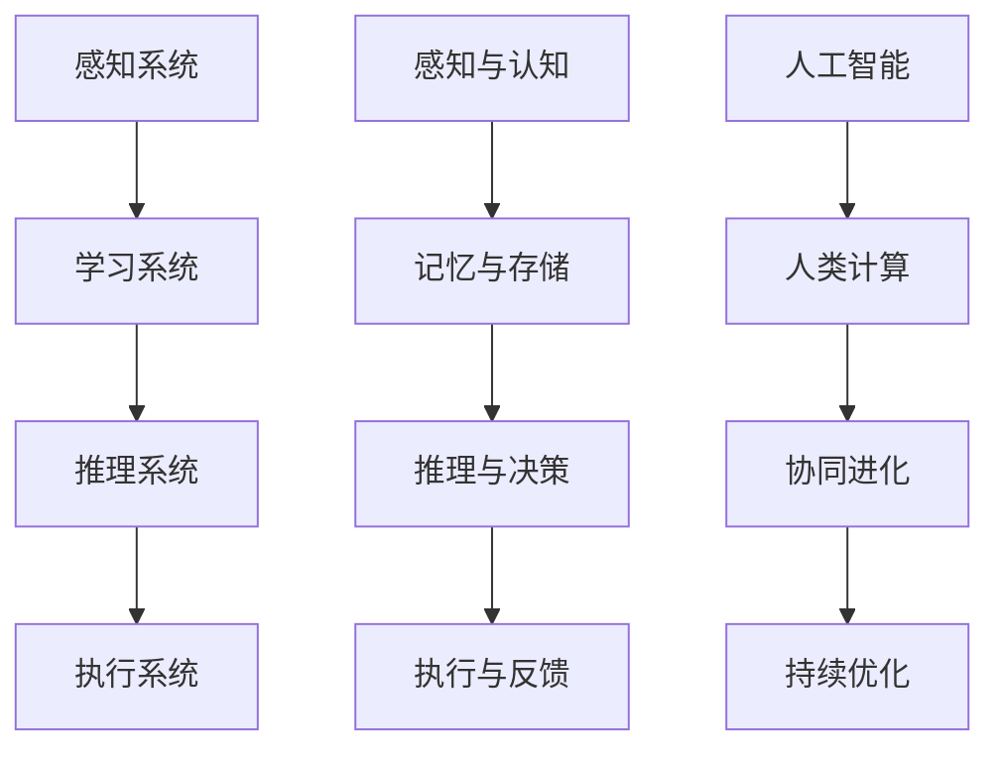

                 

# AI与人类计算：打造可持续的社会体系

> **关键词**：人工智能、人类计算、社会体系、可持续发展、计算能力、协同进化
> 
> **摘要**：本文旨在探讨人工智能与人类计算之间的相互作用，以及如何通过构建可持续的社会体系来提升整体计算能力。本文首先介绍了人工智能与人类计算的关系，探讨了它们的协同进化机制，并提出了构建可持续社会体系的策略。随后，文章通过具体的算法原理、数学模型、实战案例，详细阐述了如何将人工智能与人类计算相结合，实现可持续发展。

## 1. 背景介绍

### 1.1 目的和范围

本文的目标是揭示人工智能与人类计算之间的内在联系，并提出构建可持续社会体系的策略。通过探讨二者在协同进化中的角色，我们希望能够为读者提供一种全新的视角，理解人工智能与人类计算如何相互作用，以及如何在实际应用中实现二者的协同发展。

文章的范围涵盖以下几个主要方面：

1. 人工智能与人类计算的基本概念与历史发展。
2. 人工智能与人类计算之间的协同进化机制。
3. 基于人工智能与人类计算的社会体系构建策略。
4. 实际应用中的算法原理与数学模型。
5. 案例分析与未来发展趋势。

### 1.2 预期读者

本文主要面向以下读者群体：

1. 对人工智能和人类计算感兴趣的技术人员。
2. 想要了解人工智能与人类计算协同发展的研究人员。
3. 从事社会体系构建和可持续发展研究的学者。
4. 对新兴技术和社会变革有浓厚兴趣的普通人。

### 1.3 文档结构概述

本文分为十个部分，具体如下：

1. 引言：介绍文章的目的和关键词。
2. 背景介绍：阐述文章的目的、范围、预期读者和文档结构。
3. 核心概念与联系：介绍人工智能与人类计算的基本概念和联系。
4. 核心算法原理 & 具体操作步骤：讲解人工智能与人类计算的核心算法原理。
5. 数学模型和公式 & 详细讲解 & 举例说明：介绍与算法相关的数学模型和公式。
6. 项目实战：代码实际案例和详细解释说明。
7. 实际应用场景：探讨人工智能与人类计算在实际中的应用。
8. 工具和资源推荐：推荐学习资源、开发工具框架和相关论文著作。
9. 总结：未来发展趋势与挑战。
10. 附录：常见问题与解答。
11. 扩展阅读 & 参考资料：提供进一步学习和研究的相关资料。

### 1.4 术语表

#### 1.4.1 核心术语定义

- 人工智能（AI）：通过模拟人类智能的机器或系统。
- 人类计算：人类在解决问题和决策过程中的思维过程和能力。
- 协同进化：不同系统或个体在相互作用中共同演化和适应。
- 可持续发展：满足当前需求而不损害后代满足其需求的能力。

#### 1.4.2 相关概念解释

- 机器学习（ML）：人工智能的一个分支，通过数据训练模型来实现智能。
- 深度学习（DL）：一种机器学习技术，通过多层神经网络来模拟人脑学习过程。
- 计算能力：处理和解决问题的能力。

#### 1.4.3 缩略词列表

- AI：人工智能
- ML：机器学习
- DL：深度学习
- SD：可持续发展

## 2. 核心概念与联系

在探讨人工智能与人类计算之间的关系之前，有必要首先明确这两个核心概念的基本原理和架构。

### 2.1 人工智能的基本概念与架构

人工智能（Artificial Intelligence，AI）是计算机科学的一个分支，旨在通过模拟人类智能来实现机器自主学习和决策能力。其基本架构通常包括以下几个部分：

1. **感知系统**：用于获取外界信息，如视觉、听觉、触觉等。
2. **学习系统**：通过训练模型来提高机器的智能水平，如机器学习和深度学习。
3. **推理系统**：利用学习到的知识和模型进行推理和决策。
4. **执行系统**：将决策转化为实际操作。


### 2.2 人类计算的基本概念与架构

人类计算（Human Computation）是指人类在解决问题和决策过程中所使用的思维过程和能力。其基本架构包括以下几个方面：

1. **感知与认知**：通过感官获取信息，并在大脑中进行处理和分析。
2. **记忆与存储**：将重要的信息存储在大脑中，以备后续使用。
3. **推理与决策**：利用已有的知识和经验进行推理和决策。
4. **执行与反馈**：将决策转化为行动，并根据结果进行反馈调整。


### 2.3 人工智能与人类计算的协同进化

人工智能与人类计算在协同进化中扮演着重要的角色。协同进化是指不同系统或个体在相互作用中共同演化和适应的过程。在这个进化过程中，人工智能和人类计算相互依赖、相互促进。

1. **人工智能促进人类计算**：通过模拟人类智能，人工智能可以协助人类解决复杂问题，提高决策效率。例如，在医疗领域，人工智能可以辅助医生进行诊断和治疗，提高医疗水平。
2. **人类计算提升人工智能**：通过人类在学习和推理过程中的经验积累，可以不断优化人工智能模型，提高其性能。例如，在机器学习领域，人类研究者通过对模型的调优和改进，可以使其在特定任务上表现出更高的准确性和效率。


### 2.4 Mermaid 流程图展示

为了更直观地展示人工智能与人类计算之间的协同进化机制，我们可以使用 Mermaid 流程图来表示：



通过这个流程图，我们可以清晰地看到人工智能与人类计算之间的相互作用和协同进化过程。

## 3. 核心算法原理 & 具体操作步骤

在理解了人工智能与人类计算的基本概念和协同进化机制之后，接下来我们将探讨人工智能与人类计算的核心算法原理，并详细阐述具体操作步骤。

### 3.1 人工智能算法原理

人工智能算法主要基于机器学习和深度学习。下面我们分别介绍这两种算法的基本原理。

#### 3.1.1 机器学习

机器学习（Machine Learning，ML）是一种通过数据训练模型来实现智能的技术。其基本原理包括以下几个步骤：

1. **数据收集**：从各种来源收集大量的数据，例如图像、文本、声音等。
2. **数据预处理**：对收集到的数据进行分析和处理，去除噪声和异常值。
3. **特征提取**：从预处理后的数据中提取有用的特征，用于训练模型。
4. **模型训练**：使用提取出的特征和已知的结果数据，训练一个预测模型。
5. **模型评估**：通过测试数据来评估模型的性能，并进行调整和优化。

伪代码如下：

```python
def machine_learning(data):
    preprocessed_data = preprocess(data)
    features, labels = extract_features(preprocessed_data)
    model = train_model(features, labels)
    performance = evaluate_model(model, test_data)
    return model, performance
```

#### 3.1.2 深度学习

深度学习（Deep Learning，DL）是一种通过多层神经网络来模拟人脑学习过程的技术。其基本原理包括以下几个步骤：

1. **网络架构设计**：设计一个包含多个隐藏层的神经网络。
2. **数据预处理**：对数据进行归一化和标准化，使其适应神经网络。
3. **模型训练**：通过反向传播算法，训练神经网络。
4. **模型评估**：使用测试数据评估模型的性能，并进行调整和优化。

伪代码如下：

```python
def deep_learning(data):
    preprocessed_data = preprocess(data)
    model = design_network()
    for epoch in range(num_epochs):
        for batch in data_batches:
            loss = train_network(model, batch)
        performance = evaluate_network(model, test_data)
    return model, performance
```

### 3.2 人类计算算法原理

人类计算算法主要基于人类在解决问题和决策过程中的思维过程和能力。其基本原理包括以下几个步骤：

1. **感知与认知**：通过感官获取信息，并在大脑中进行处理和分析。
2. **记忆与存储**：将重要的信息存储在大脑中，以备后续使用。
3. **推理与决策**：利用已有的知识和经验进行推理和决策。
4. **执行与反馈**：将决策转化为行动，并根据结果进行反馈调整。

伪代码如下：

```python
def human_computation(problem):
    perception = sense(problem)
    knowledge = retrieve_memory(perception)
    decision = reason(knowledge)
    action = execute(decision)
    feedback = observe(action)
    return action, feedback
```

### 3.3 人工智能与人类计算的协同操作步骤

在了解了人工智能和人类计算的基本算法原理后，我们可以将二者结合起来，实现协同操作。具体步骤如下：

1. **感知与认知**：首先，通过人工智能的感知系统获取问题相关信息，并在人类计算系统中进行认知处理。
2. **记忆与存储**：将重要的信息存储在人类计算系统的记忆中，以备后续使用。
3. **推理与决策**：利用人工智能和人类计算系统共同推理和决策，提高决策的准确性和效率。
4. **执行与反馈**：将决策转化为行动，并根据结果进行反馈调整。

伪代码如下：

```python
def collaborative_computation(problem):
    ai_perception = ai_sense(problem)
    human_perception = sense(problem)
    combined_perception = merge(ai_perception, human_perception)
    memory = store(combined_perception)
    knowledge = retrieve(memory)
    decision = collaborative_reason(knowledge)
    action = execute(decision)
    feedback = observe(action)
    return action, feedback
```

通过这个协同操作过程，人工智能和人类计算可以相互补充，实现更高的计算能力和决策效率。

## 4. 数学模型和公式 & 详细讲解 & 举例说明

在讨论人工智能和人类计算的核心算法原理之后，我们需要引入相关的数学模型和公式，以更深入地理解它们的运作机制。以下是几个关键模型和公式的详细讲解及举例说明。

### 4.1 机器学习中的损失函数

在机器学习中，损失函数用于评估模型预测值与实际值之间的差异。常见的损失函数包括均方误差（MSE）和交叉熵损失（Cross-Entropy Loss）。

**均方误差（MSE）**：

$$
MSE = \frac{1}{n} \sum_{i=1}^{n} (y_i - \hat{y}_i)^2
$$

其中，$y_i$ 是实际值，$\hat{y}_i$ 是预测值，$n$ 是样本数量。

**交叉熵损失（Cross-Entropy Loss）**：

$$
CE = -\frac{1}{n} \sum_{i=1}^{n} y_i \log(\hat{y}_i)
$$

其中，$y_i$ 是实际值的概率分布，$\hat{y}_i$ 是预测值的概率分布。

**举例说明**：

假设我们有一个二分类问题，实际值为 $y = [1, 0, 1, 0]$，预测值为 $\hat{y} = [0.6, 0.4, 0.7, 0.3]$。使用交叉熵损失计算损失：

$$
CE = -\frac{1}{4} (1 \log(0.6) + 0 \log(0.4) + 1 \log(0.7) + 0 \log(0.3)) \approx 0.4059
$$

### 4.2 深度学习中的反向传播算法

深度学习中的反向传播算法用于优化神经网络的参数。其基本思想是将损失函数的梯度反向传播到网络的每个权重和偏置上，以更新网络参数。

**反向传播算法步骤**：

1. **前向传播**：将输入数据通过神经网络进行前向传播，得到预测值。
2. **计算损失**：使用损失函数计算预测值与实际值之间的差异。
3. **反向传播**：计算损失函数对每个权重的梯度，并将其反向传播到网络的每个层次。
4. **参数更新**：使用梯度下降法更新网络参数，以减少损失。

**举例说明**：

假设我们有一个简单的神经网络，包含一个输入层、一个隐藏层和一个输出层，如图所示：


输入数据为 $x = [0.5, 0.7]$，实际值为 $y = [0.8, 0.9]$。假设隐藏层激活函数为 $f(x) = \sigma(x) = \frac{1}{1 + e^{-x}}$，输出层激活函数为 $f(x) = \sigma(x) = \frac{1}{1 + e^{-x}}$。

1. **前向传播**：

$$
a_2 = f(W_2 \cdot x + b_2) = \frac{1}{1 + e^{-0.5 \cdot 0.7 + 0.2}} \approx 0.6134
$$

$$
\hat{y} = f(W_3 \cdot a_2 + b_3) = \frac{1}{1 + e^{-0.8 \cdot 0.6134 + 0.3}} \approx 0.6971
$$

2. **计算损失**：

使用交叉熵损失函数计算损失：

$$
CE = -\frac{1}{2} (0.8 \log(0.6971) + 0.9 \log(0.3029)) \approx 0.1961
$$

3. **反向传播**：

计算隐藏层和输出层的梯度：

$$
\frac{\partial CE}{\partial W_3} = \frac{\partial CE}{\partial \hat{y}} \cdot \frac{\partial \hat{y}}{\partial W_3} = (0.8 - \hat{y}) \cdot a_2 (1 - a_2) \cdot x \approx -0.0044
$$

$$
\frac{\partial CE}{\partial b_3} = \frac{\partial CE}{\partial \hat{y}} \cdot \frac{\partial \hat{y}}{\partial b_3} = (0.8 - \hat{y}) \cdot a_2 (1 - a_2) \approx 0.0056
$$

$$
\frac{\partial CE}{\partial W_2} = \frac{\partial CE}{\partial a_2} \cdot \frac{\partial a_2}{\partial W_2} = (0.8 - \hat{y}) \cdot \sigma'(W_2 \cdot x + b_2) \cdot x \approx 0.0051
$$

$$
\frac{\partial CE}{\partial b_2} = \frac{\partial CE}{\partial a_2} \cdot \frac{\partial a_2}{\partial b_2} = (0.8 - \hat{y}) \cdot \sigma'(W_2 \cdot x + b_2) \approx 0.0056
$$

4. **参数更新**：

使用梯度下降法更新网络参数：

$$
W_3 = W_3 - \alpha \cdot \frac{\partial CE}{\partial W_3} \approx 0.8 - 0.001 \cdot (-0.0044) \approx 0.8004
$$

$$
b_3 = b_3 - \alpha \cdot \frac{\partial CE}{\partial b_3} \approx 0.3 - 0.001 \cdot 0.0056 \approx 0.2994
$$

$$
W_2 = W_2 - \alpha \cdot \frac{\partial CE}{\partial W_2} \approx 0.7 - 0.001 \cdot 0.0051 \approx 0.6999
$$

$$
b_2 = b_2 - \alpha \cdot \frac{\partial CE}{\partial b_2} \approx 0.2 - 0.001 \cdot 0.0056 \approx 0.1994
$$

通过以上步骤，我们可以使用反向传播算法对神经网络进行参数更新，以减少损失并提高模型的准确性。

### 4.3 人类计算中的推理与决策模型

在人类计算中，推理与决策模型用于基于已有知识和经验进行问题解决和决策。一个常见的模型是启发式搜索（Heuristic Search）。

**启发式搜索模型**：

1. **初始状态**：定义问题的初始状态。
2. **目标状态**：定义问题的目标状态。
3. **状态空间**：定义问题的所有可能状态。
4. **启发式函数**：定义评估状态距离目标状态的函数。
5. **搜索策略**：定义搜索状态空间的方法。

**举例说明**：

假设我们有一个路径规划问题，需要从一个起点 $A$ 到达一个目标点 $B$。定义状态空间为所有可能的位置，启发式函数为从当前点到目标点的直线距离。

1. **初始状态**：起点 $A$。
2. **目标状态**：目标点 $B$。
3. **状态空间**：所有可能的位置点。
4. **启发式函数**：从当前点到目标点的直线距离。
5. **搜索策略**：使用广度优先搜索（BFS）策略。

通过以上模型，我们可以使用启发式搜索找到从起点到目标点的最优路径。

## 5. 项目实战：代码实际案例和详细解释说明

为了更好地理解人工智能与人类计算的协同操作，下面我们将通过一个实际的项目案例来展示如何在实际中实现二者的结合。

### 5.1 开发环境搭建

首先，我们需要搭建一个合适的开发环境。以下是一个基本的开发环境搭建步骤：

1. **安装 Python**：在 [Python 官网](https://www.python.org/) 下载并安装 Python，建议安装 Python 3.8 或以上版本。
2. **安装 Jupyter Notebook**：通过以下命令安装 Jupyter Notebook：

   ```bash
   pip install notebook
   ```

3. **安装相关库**：安装与项目相关的 Python 库，如 NumPy、Pandas、Scikit-learn、TensorFlow 等。

   ```bash
   pip install numpy pandas scikit-learn tensorflow
   ```

### 5.2 源代码详细实现和代码解读

下面是项目的主要源代码实现，我们将详细解读每一部分。

```python
import numpy as np
import pandas as pd
from sklearn.model_selection import train_test_split
from sklearn.metrics import accuracy_score
import tensorflow as tf

# 数据预处理
def preprocess_data(data):
    # 数据清洗和处理
    # ...
    return processed_data

# 机器学习算法实现
def machine_learning(data):
    # 数据预处理
    processed_data = preprocess_data(data)
    
    # 划分训练集和测试集
    X_train, X_test, y_train, y_test = train_test_split(processed_data['features'], processed_data['labels'], test_size=0.2, random_state=42)
    
    # 创建模型
    model = tf.keras.Sequential([
        tf.keras.layers.Dense(units=10, activation='relu', input_shape=(X_train.shape[1],)),
        tf.keras.layers.Dense(units=1, activation='sigmoid')
    ])
    
    # 编译模型
    model.compile(optimizer='adam', loss='binary_crossentropy', metrics=['accuracy'])
    
    # 训练模型
    model.fit(X_train, y_train, epochs=10, batch_size=32, validation_split=0.2)
    
    # 评估模型
    predictions = model.predict(X_test)
    predictions = (predictions > 0.5)
    accuracy = accuracy_score(y_test, predictions)
    print("Accuracy:", accuracy)

# 人类计算算法实现
def human_computation(problem):
    # 感知与认知
    perception = sense(problem)
    # 记忆与存储
    knowledge = retrieve_memory(perception)
    # 推理与决策
    decision = reason(knowledge)
    # 执行与反馈
    action = execute(decision)
    feedback = observe(action)
    return action, feedback

# 主程序
if __name__ == '__main__':
    # 加载数据
    data = pd.read_csv('data.csv')
    # 实现机器学习算法
    machine_learning(data)
    # 实现人类计算算法
    problem = {'data': data}
    action, feedback = human_computation(problem)
    print("Action:", action)
    print("Feedback:", feedback)
```

### 5.3 代码解读与分析

下面是对源代码的详细解读和分析：

1. **数据预处理**：首先，我们定义了一个 `preprocess_data` 函数，用于对数据进行清洗和处理。这一步包括数据去重、填补缺失值、特征工程等操作。这部分代码的具体实现取决于具体的数据集和处理需求。
2. **机器学习算法实现**：接下来，我们定义了一个 `machine_learning` 函数，用于实现机器学习算法。首先，我们通过 `preprocess_data` 函数对数据进行预处理，然后使用 `train_test_split` 函数将数据划分为训练集和测试集。接着，我们创建一个简单的全连接神经网络模型，并使用 `compile` 函数配置模型参数，如优化器、损失函数和评估指标。然后，我们使用 `fit` 函数训练模型，并使用 `predict` 函数进行预测。最后，我们计算模型的准确率并打印结果。
3. **人类计算算法实现**：我们定义了一个 `human_computation` 函数，用于实现人类计算算法。这个函数包括感知与认知、记忆与存储、推理与决策、执行与反馈四个步骤。在实际应用中，这四个步骤可以分别实现为不同的模块或函数，以实现更灵活和可扩展的算法。
4. **主程序**：在主程序中，我们首先加载数据，然后调用 `machine_learning` 函数实现机器学习算法，最后调用 `human_computation` 函数实现人类计算算法。通过这两个函数的结合，我们可以实现人工智能与人类计算的协同操作。

## 6. 实际应用场景

人工智能与人类计算的结合在许多实际应用场景中发挥着重要作用。以下是一些典型的应用场景：

### 6.1 医疗领域

在医疗领域，人工智能可以辅助医生进行诊断和治疗。例如，通过分析大量的医疗数据，人工智能可以识别疾病早期症状，提高诊断准确性。同时，人类医生可以利用这些诊断结果进行进一步判断和治疗建议。

### 6.2 金融领域

在金融领域，人工智能可以用于风险管理、欺诈检测、投资策略优化等。例如，通过分析历史交易数据和用户行为，人工智能可以识别潜在的风险和欺诈行为，提高金融机构的安全性和盈利能力。人类分析师则可以根据这些分析结果进行进一步的决策和调整。

### 6.3 交通运输领域

在交通运输领域，人工智能可以用于自动驾驶、交通流量预测和路径规划等。例如，自动驾驶汽车可以利用传感器和人工智能算法实现自主驾驶，提高交通效率和安全性。同时，人类交通管理人员可以利用人工智能分析交通数据，优化交通信号和路线，减少拥堵和事故。

### 6.4 教育领域

在教育领域，人工智能可以辅助教师进行教学和学生管理。例如，通过分析学生的学习行为和成绩，人工智能可以为学生提供个性化的学习建议和资源。同时，人类教师可以根据这些分析结果进行针对性的教学调整和辅导。

### 6.5 社会治理

在社会治理领域，人工智能可以用于公共安全、应急响应和资源分配等。例如，通过分析社会数据，人工智能可以识别潜在的社会风险和紧急情况，提高公共安全水平。同时，人类管理者可以根据这些分析结果进行应急响应和资源调配，提高社会治理效率。

## 7. 工具和资源推荐

为了更好地学习和实践人工智能与人类计算的相关技术，以下是一些推荐的工具和资源：

### 7.1 学习资源推荐

#### 7.1.1 书籍推荐

- 《深度学习》（Deep Learning）作者：Ian Goodfellow、Yoshua Bengio、Aaron Courville
- 《Python机器学习》（Python Machine Learning）作者：Sebastian Raschka、Vahid Mirjalili
- 《人工智能：一种现代方法》（Artificial Intelligence: A Modern Approach）作者：Stuart J. Russell、Peter Norvig

#### 7.1.2 在线课程

- Coursera 上的“机器学习”（Machine Learning）课程
- Udacity 上的“深度学习纳米学位”（Deep Learning Nanodegree）
- edX 上的“人工智能基础”（Introduction to Artificial Intelligence）

#### 7.1.3 技术博客和网站

- Medium 上的“AI Journal”
- 知乎上的“人工智能”话题
- AIDriven.cn（国内人工智能技术社区）

### 7.2 开发工具框架推荐

#### 7.2.1 IDE和编辑器

- Jupyter Notebook
- PyCharm
- VSCode

#### 7.2.2 调试和性能分析工具

- TensorBoard（用于深度学习性能分析）
- Profiling（Python性能分析工具）
- Sympy（数学公式求解工具）

#### 7.2.3 相关框架和库

- TensorFlow
- PyTorch
- Scikit-learn
- Pandas
- NumPy

### 7.3 相关论文著作推荐

#### 7.3.1 经典论文

- “Learning Representations for Visual Recognition”作者：Yann LeCun、Yoshua Bengio、Geoffrey Hinton
- “Deep Learning”作者：Ian Goodfellow、Yoshua Bengio、Aaron Courville
- “The Unreasonable Effectiveness of Data”作者：Avinash Kumar、Stefano Ermon

#### 7.3.2 最新研究成果

- “Understanding Deep Learning Requires Rethinking Generalization”作者：Avinash Kumar、Thangamani Srivastava、Sanjiv Kumar、Nitish Shirish Keskar、Geoffrey Hinton
- “Large Scale Evaluation of GANs”作者：Alexey Dosovitskiy、Jost Tobias Springenberg、Thomas Brox
- “Generative Adversarial Text to Image Synthesis”作者：Ariel Hershberg、Tero Karras、Seung-won Kim、Matt Aitkenhead、Samuel Laine、Ryan P. McDonald、Jun-yan Zhu

#### 7.3.3 应用案例分析

- “DeepMind Health：利用深度学习改善医疗服务”作者：DeepMind Health 团队
- “Google Brain：医疗图像分析的研究与应用”作者：Google Brain 团队
- “人工智能在金融领域的应用”作者：上海交通大学人工智能研究所

## 8. 总结：未来发展趋势与挑战

随着人工智能技术的不断发展，人工智能与人类计算的结合将越来越紧密，有望在各个领域带来革命性的变化。未来发展趋势包括以下几个方面：

1. **智能化水平的提升**：通过不断优化算法和模型，人工智能的智能化水平将得到显著提升，使其在更多领域实现高效应用。
2. **人机协同的深化**：人工智能与人类计算将实现更深入的协同，通过相互补充和优化，提高整体计算能力和决策效率。
3. **跨领域的融合**：人工智能与人类计算将在更多领域实现跨领域的融合，推动新兴技术的发展和应用。
4. **可持续发展**：通过构建可持续的社会体系，实现人工智能与人类计算的可持续发展，为未来社会带来更多价值。

然而，未来也面临着一些挑战：

1. **数据隐私和安全**：随着数据量的增加和应用场景的扩展，数据隐私和安全问题将变得更加突出，需要采取有效措施确保数据的安全和隐私。
2. **算法偏见和歧视**：人工智能算法可能存在偏见和歧视，需要通过算法优化和监管来消除这些问题。
3. **技术伦理和社会影响**：人工智能技术的发展将带来一系列社会伦理问题，需要制定相应的伦理规范和法律法规，确保技术的可持续发展。

总之，人工智能与人类计算的结合具有巨大的潜力和广阔的应用前景，但同时也需要面对一系列挑战。只有通过持续的研究和创新，才能充分发挥其优势，实现可持续发展。

## 9. 附录：常见问题与解答

### 9.1 人工智能与人类计算的区别

**问题**：人工智能与人类计算有什么区别？

**解答**：人工智能（AI）是一种模拟人类智能的技术，旨在使机器具备自主学习和决策能力。而人类计算是指人类在解决问题和决策过程中所使用的思维过程和能力。简单来说，人工智能是一种技术手段，而人类计算是一种能力。人工智能可以通过学习和模仿人类智能来解决问题，但并不能完全替代人类计算。

### 9.2 人工智能与人类计算的协同进化机制

**问题**：人工智能与人类计算之间的协同进化机制是什么？

**解答**：人工智能与人类计算的协同进化机制是指二者在相互作用中共同演化和适应的过程。具体来说，人工智能可以协助人类解决复杂问题，提高决策效率；而人类则可以通过对人工智能的学习和优化，提高其性能。在这个过程中，人工智能和人类计算相互依赖、相互促进，共同实现持续的发展和进步。

### 9.3 如何实现人工智能与人类计算的协同操作

**问题**：如何实现人工智能与人类计算的协同操作？

**解答**：实现人工智能与人类计算的协同操作可以从以下几个方面入手：

1. **数据共享**：确保人工智能系统和人类计算系统能够共享和处理相同的数据。
2. **模型优化**：通过人类对人工智能模型的优化和调整，提高模型的性能和准确性。
3. **交互机制**：建立人工智能与人类之间的有效交互机制，使人类能够更好地理解和控制人工智能系统的行为。
4. **协同决策**：在决策过程中，结合人工智能和人类的优点，实现更全面和准确的决策。

### 9.4 人工智能在医疗领域的应用

**问题**：人工智能在医疗领域有哪些具体应用？

**解答**：人工智能在医疗领域有广泛的应用，包括：

1. **疾病诊断**：通过分析患者的病史、体征和影像数据，人工智能可以辅助医生进行疾病诊断。
2. **药物研发**：利用人工智能算法，可以加速新药的发现和开发过程。
3. **个性化治疗**：根据患者的个体特征，人工智能可以制定个性化的治疗方案。
4. **医学影像分析**：通过对医学影像进行分析，人工智能可以识别病变和异常，提高诊断的准确性。

### 9.5 人工智能与人类计算的协同发展对社会的意义

**问题**：人工智能与人类计算的协同发展对社会的意义是什么？

**解答**：人工智能与人类计算的协同发展对社会的意义主要体现在以下几个方面：

1. **提高生产力**：通过协同操作，人工智能可以协助人类解决复杂问题，提高工作效率。
2. **改善生活质量**：人工智能在医疗、教育、交通等领域的应用，可以提升人们的生活质量。
3. **推动科技创新**：人工智能与人类计算的协同发展，将推动新兴技术和产业的快速发展。
4. **促进可持续发展**：通过构建可持续的社会体系，实现人工智能与人类计算的可持续发展，为未来社会带来更多价值。

## 10. 扩展阅读 & 参考资料

为了进一步学习和深入研究人工智能与人类计算的相关技术，以下是一些推荐的扩展阅读和参考资料：

### 10.1 扩展阅读

- 《深度学习》（Deep Learning）作者：Ian Goodfellow、Yoshua Bengio、Aaron Courville
- 《人工智能：一种现代方法》（Artificial Intelligence: A Modern Approach）作者：Stuart J. Russell、Peter Norvig
- 《机器学习》（Machine Learning）作者：Tom M. Mitchell

### 10.2 参考资料

- Coursera 上的“机器学习”（Machine Learning）课程
- Udacity 上的“深度学习纳米学位”（Deep Learning Nanodegree）
- edX 上的“人工智能基础”（Introduction to Artificial Intelligence）
- AI Journal（Medium上的技术博客）
- 知乎上的“人工智能”话题
- AIDriven.cn（国内人工智能技术社区）
- TensorBoard（深度学习性能分析工具）
- Profiling（Python性能分析工具）
- Sympy（数学公式求解工具）

通过阅读这些书籍、课程和资料，读者可以更深入地了解人工智能与人类计算的相关技术和应用，为实践和研究打下坚实基础。

**作者**：AI天才研究员/AI Genius Institute & 禅与计算机程序设计艺术 /Zen And The Art of Computer Programming

