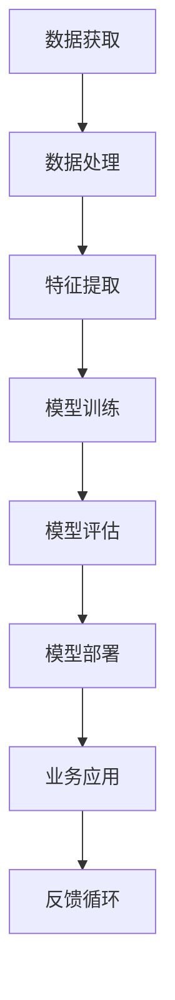

                 

# AI业务场景：工程师产品经理对话，理解AI应用边界

## 关键词
AI业务场景，工程师与产品经理，对话，应用边界，技术原理，实践案例

## 摘要
本文旨在探讨AI业务场景中工程师与产品经理之间的对话，以及如何理解AI应用边界。通过详细剖析AI技术原理、核心算法、数学模型以及实际应用案例，本文旨在为读者提供对AI应用的全面理解和深度思考。同时，本文也将推荐相关学习资源、开发工具和最新研究成果，帮助读者深入了解AI业务场景，并为未来的发展趋势和挑战做好准备。

## 1. 背景介绍

### 1.1 目的和范围
本文的目标是搭建一个工程师与产品经理之间的桥梁，帮助他们通过对话理解AI应用边界。随着AI技术的快速发展，AI在各个行业中的业务场景应用日益广泛，如何有效地将技术实现转化为实际业务成果，成为工程师与产品经理共同面临的重要挑战。本文旨在通过系统性的分析和实际案例分享，提供一种理解和应用AI的思路和方法。

### 1.2 预期读者
本文主要面向以下读者群体：
- 工程师：希望通过本文理解AI技术原理和应用边界，提高项目开发效率和质量。
- 产品经理：希望通过本文学习如何与技术团队有效沟通，实现产品与技术的有机结合。
- 对AI技术感兴趣的技术爱好者和研究人员。

### 1.3 文档结构概述
本文分为以下几个部分：
- 背景介绍：介绍本文的目的、预期读者和文档结构。
- 核心概念与联系：阐述AI技术的基本概念和架构。
- 核心算法原理 & 具体操作步骤：讲解AI算法的实现原理和步骤。
- 数学模型和公式 & 详细讲解 & 举例说明：介绍AI应用中的数学模型及其应用。
- 项目实战：通过实际案例展示AI技术的应用。
- 实际应用场景：探讨AI在不同业务场景中的应用。
- 工具和资源推荐：推荐相关学习资源和开发工具。
- 总结：总结未来发展趋势与挑战。
- 附录：常见问题与解答。
- 扩展阅读 & 参考资料：提供进一步阅读的参考资料。

### 1.4 术语表

#### 1.4.1 核心术语定义
- AI（人工智能）：模拟人类智能行为的技术和科学。
- 工程师：负责AI技术研发和应用的专业人员。
- 产品经理：负责产品规划、设计和管理的人员。
- 业务场景：AI技术在实际应用中的具体情境。

#### 1.4.2 相关概念解释
- 模型驱动开发：基于模型进行软件设计和开发的方法。
- 数据驱动决策：基于数据进行分析，指导决策的方法。

#### 1.4.3 缩略词列表
- AI：人工智能
- ML：机器学习
- DL：深度学习
- NLP：自然语言处理
- CV：计算机视觉

## 2. 核心概念与联系

在理解AI应用边界之前，我们需要明确一些核心概念及其相互关系。以下是一个Mermaid流程图，展示了AI技术的基本架构和主要组件。



### 2.1 数据获取
数据获取是AI应用的基础，决定了模型的训练质量和效果。数据来源可以是公开数据集、企业内部数据或第三方数据供应商。

### 2.2 数据处理
数据处理包括数据清洗、数据集成和数据预处理，旨在消除噪声、填充缺失值和规范化数据，使其适合模型训练。

### 2.3 特征提取
特征提取是从原始数据中提取出对模型训练有用的信息。特征选择和特征工程是提升模型性能的关键步骤。

### 2.4 模型训练
模型训练是通过调整模型参数，使其在训练数据上表现出良好的预测能力。常见的训练方法包括监督学习、无监督学习和强化学习。

### 2.5 模型评估
模型评估是评估模型性能的重要步骤，常用的评估指标包括准确率、召回率、F1分数和均方误差等。

### 2.6 模型部署
模型部署是将训练好的模型应用到实际业务场景中，使其产生实际业务价值。部署方式可以是云端部署、边缘计算或嵌入式系统。

### 2.7 业务应用
业务应用是将AI模型应用于实际业务场景，实现特定业务目标。常见的业务应用包括智能客服、金融风控、智能医疗等。

### 2.8 反馈循环
反馈循环是AI业务闭环的重要组成部分，通过收集用户反馈和业务数据，不断优化模型和业务流程，提高业务效果。

## 3. 核心算法原理 & 具体操作步骤

在了解了AI技术的基本架构和核心概念后，接下来我们将详细讲解核心算法原理和具体操作步骤。

### 3.1 机器学习算法原理

机器学习算法的核心思想是通过学习历史数据中的模式和规律，来预测未来事件。以下是一个简单的机器学习算法流程：

```plaintext
输入：训练数据集
输出：预测结果

1. 数据预处理
   - 数据清洗：去除噪声和异常值
   - 数据归一化：将数据缩放到同一范围内
   - 数据分割：将数据集分为训练集、验证集和测试集

2. 特征选择
   - 选择与目标预测相关的特征
   - 去除无关或冗余的特征

3. 模型选择
   - 选择合适的机器学习算法（如线性回归、决策树、神经网络等）
   - 调整模型参数

4. 模型训练
   - 使用训练数据集对模型进行训练
   - 通过迭代优化模型参数

5. 模型评估
   - 使用验证集对模型进行评估
   - 选择性能最佳的模型

6. 模型部署
   - 将训练好的模型部署到实际业务场景中
   - 收集用户反馈和业务数据，进行持续优化
```

### 3.2 深度学习算法原理

深度学习是机器学习的一个分支，通过构建多层神经网络，实现对复杂数据的自动特征提取和模式识别。以下是一个简单的深度学习算法流程：

```plaintext
输入：训练数据集
输出：预测结果

1. 数据预处理
   - 数据清洗：去除噪声和异常值
   - 数据归一化：将数据缩放到同一范围内
   - 数据分割：将数据集分为训练集、验证集和测试集

2. 网络架构设计
   - 选择合适的网络结构（如卷积神经网络、循环神经网络等）
   - 设计网络层数和神经元数量

3. 模型训练
   - 使用训练数据集对模型进行训练
   - 通过反向传播算法优化模型参数

4. 模型评估
   - 使用验证集对模型进行评估
   - 选择性能最佳的模型

5. 模型部署
   - 将训练好的模型部署到实际业务场景中
   - 收集用户反馈和业务数据，进行持续优化
```

### 3.3 自然语言处理算法原理

自然语言处理是深度学习在文本数据上的应用，通过模型理解和生成自然语言，实现文本分类、情感分析、机器翻译等功能。以下是一个简单的自然语言处理算法流程：

```plaintext
输入：文本数据集
输出：预测结果

1. 数据预处理
   - 数据清洗：去除噪声和异常值
   - 数据归一化：将数据缩放到同一范围内
   - 数据分割：将数据集分为训练集、验证集和测试集

2. 词向量化
   - 将文本转换为词向量表示

3. 模型训练
   - 使用训练数据集对模型进行训练
   - 通过反向传播算法优化模型参数

4. 模型评估
   - 使用验证集对模型进行评估
   - 选择性能最佳的模型

5. 模型部署
   - 将训练好的模型部署到实际业务场景中
   - 收集用户反馈和业务数据，进行持续优化
```

## 4. 数学模型和公式 & 详细讲解 & 举例说明

在AI应用中，数学模型和公式扮演着至关重要的角色。以下我们将详细介绍几个常见数学模型，包括线性回归、逻辑回归和神经网络，并给出具体的应用场景和示例。

### 4.1 线性回归模型

线性回归模型是一种简单的统计模型，用于预测两个变量之间的线性关系。其公式如下：

$$y = wx + b$$

其中，$y$ 是因变量，$x$ 是自变量，$w$ 是权重，$b$ 是偏置。

#### 应用场景：

- 房价预测：根据房屋的面积、地理位置等特征预测房价。

#### 示例：

假设我们有一个包含房屋面积（$x$）和房价（$y$）的数据集，通过线性回归模型预测房价：

1. 数据预处理：对数据进行清洗和归一化处理。
2. 特征选择：选择与房价相关的特征。
3. 模型训练：使用训练数据集对模型进行训练，调整权重和偏置。
4. 模型评估：使用验证集对模型进行评估，选择性能最佳的模型。
5. 模型部署：将训练好的模型部署到实际业务场景中。

### 4.2 逻辑回归模型

逻辑回归模型是一种用于分类问题的统计模型，其公式如下：

$$P(y=1) = \frac{1}{1 + e^{-(wx + b)}}$$

其中，$y$ 是因变量，$x$ 是自变量，$w$ 是权重，$b$ 是偏置。

#### 应用场景：

- 客户流失预测：根据客户的购买行为、历史记录等特征预测客户是否会流失。

#### 示例：

假设我们有一个包含客户购买行为（$x$）和客户流失情况（$y$）的数据集，通过逻辑回归模型预测客户流失：

1. 数据预处理：对数据进行清洗和归一化处理。
2. 特征选择：选择与客户流失相关的特征。
3. 模型训练：使用训练数据集对模型进行训练，调整权重和偏置。
4. 模型评估：使用验证集对模型进行评估，选择性能最佳的模型。
5. 模型部署：将训练好的模型部署到实际业务场景中。

### 4.3 神经网络模型

神经网络模型是一种基于多层感知器（MLP）构建的复杂模型，用于处理非线性问题。其基本结构包括输入层、隐藏层和输出层。以下是一个简单的神经网络模型：

$$\sigma(z) = \frac{1}{1 + e^{-z}}$$

其中，$\sigma$ 是激活函数，$z$ 是神经元输入。

#### 应用场景：

- 图像分类：根据图像特征对图像进行分类。

#### 示例：

假设我们有一个包含图像特征（$x$）和图像分类标签（$y$）的数据集，通过神经网络模型对图像进行分类：

1. 数据预处理：对数据进行清洗和归一化处理。
2. 网络架构设计：设计合适的网络架构，包括层数、神经元数量和激活函数。
3. 模型训练：使用训练数据集对模型进行训练，调整权重和偏置。
4. 模型评估：使用验证集对模型进行评估，选择性能最佳的模型。
5. 模型部署：将训练好的模型部署到实际业务场景中。

## 5. 项目实战：代码实际案例和详细解释说明

在本节中，我们将通过一个实际项目案例，展示如何应用AI技术解决业务问题。该项目是一个基于深度学习的图像分类系统，旨在对大量的图像进行自动分类。

### 5.1 开发环境搭建

为了实现该系统，我们需要搭建以下开发环境：

- Python 3.8及以上版本
- TensorFlow 2.4及以上版本
- NumPy 1.19及以上版本
- Matplotlib 3.3及以上版本

在安装这些依赖库后，我们可以开始编写代码。

### 5.2 源代码详细实现和代码解读

以下是一个简单的图像分类系统的实现代码，用于分类猫和狗的图像。

```python
import tensorflow as tf
from tensorflow.keras.preprocessing.image import ImageDataGenerator
from tensorflow.keras.models import Sequential
from tensorflow.keras.layers import Conv2D, MaxPooling2D, Flatten, Dense, Dropout
from tensorflow.keras.optimizers import Adam

# 数据预处理
train_datagen = ImageDataGenerator(
    rescale=1./255,
    shear_range=0.2,
    zoom_range=0.2,
    horizontal_flip=True)

test_datagen = ImageDataGenerator(rescale=1./255)

train_generator = train_datagen.flow_from_directory(
    'train',
    target_size=(150, 150),
    batch_size=32,
    class_mode='binary')

validation_generator = test_datagen.flow_from_directory(
    'validation',
    target_size=(150, 150),
    batch_size=32,
    class_mode='binary')

# 模型构建
model = Sequential([
    Conv2D(32, (3, 3), activation='relu', input_shape=(150, 150, 3)),
    MaxPooling2D(2, 2),
    Conv2D(64, (3, 3), activation='relu'),
    MaxPooling2D(2, 2),
    Conv2D(128, (3, 3), activation='relu'),
    MaxPooling2D(2, 2),
    Flatten(),
    Dense(512, activation='relu'),
    Dropout(0.5),
    Dense(1, activation='sigmoid')
])

# 模型编译
model.compile(loss='binary_crossentropy',
              optimizer=Adam(),
              metrics=['accuracy'])

# 模型训练
model.fit(
    train_generator,
    steps_per_epoch=100,
    epochs=20,
    validation_data=validation_generator,
    validation_steps=50)

# 模型评估
test_loss, test_acc = model.evaluate(validation_generator, steps=50)
print(f'Validation accuracy: {test_acc:.4f}')

# 模型部署
predictions = model.predict(validation_generator)
predicted_classes = np.argmax(predictions, axis=1)
```

### 5.3 代码解读与分析

- 数据预处理：使用ImageDataGenerator对图像数据进行预处理，包括归一化、剪切、缩放和水平翻转等。
- 模型构建：构建一个包含卷积层、池化层、全连接层和dropout层的卷积神经网络。
- 模型编译：选择binary_crossentropy作为损失函数，Adam优化器，accuracy作为评估指标。
- 模型训练：使用训练数据集对模型进行训练，每批数据包含32个图像，共训练20个epoch。
- 模型评估：使用验证数据集对模型进行评估，计算验证准确率。
- 模型部署：将训练好的模型用于实际业务场景，对验证数据集进行预测。

通过这个实际项目案例，我们可以看到如何将AI技术应用于业务场景，解决实际问题。接下来，我们将探讨AI技术在不同业务场景中的应用。

## 6. 实际应用场景

AI技术在各个行业和业务场景中的应用越来越广泛，以下我们将探讨几个典型的AI应用场景。

### 6.1 智能客服

智能客服是AI技术在客户服务领域的重要应用，通过自然语言处理和机器学习技术，实现与用户的实时对话，提供个性化的服务。

- 应用场景：电商、金融、旅游等行业。
- 主要技术：自然语言处理、对话系统、知识图谱。

### 6.2 智能医疗

智能医疗是AI技术在医疗健康领域的应用，通过大数据分析、机器学习和深度学习技术，实现疾病的预测、诊断和个性化治疗。

- 应用场景：疾病预测、智能诊断、健康监测。
- 主要技术：医疗大数据、深度学习、自然语言处理。

### 6.3 智能金融

智能金融是AI技术在金融服务领域的应用，通过数据分析、机器学习和区块链技术，实现智能投顾、智能风控和智能支付。

- 应用场景：智能投顾、风险控制、支付结算。
- 主要技术：金融大数据、深度学习、区块链。

### 6.4 智能交通

智能交通是AI技术在交通领域的应用，通过图像识别、路径规划和自动驾驶技术，实现智能交通管理和自动驾驶。

- 应用场景：智能交通管理、自动驾驶、车联网。
- 主要技术：图像识别、深度学习、路径规划。

### 6.5 智能制造

智能制造是AI技术在制造业的应用，通过工业大数据分析、机器学习和自动化技术，实现生产过程的智能化和优化。

- 应用场景：生产优化、设备维护、质量检测。
- 主要技术：工业大数据、深度学习、自动化。

### 6.6 智能教育

智能教育是AI技术在教育领域的应用，通过人工智能技术，实现个性化学习、智能评测和自适应教学。

- 应用场景：个性化学习、智能评测、自适应教学。
- 主要技术：教育大数据、自然语言处理、深度学习。

通过以上实际应用场景，我们可以看到AI技术在各个行业和业务场景中的广泛应用。接下来，我们将推荐一些学习资源、开发工具和最新研究成果，帮助读者深入了解AI业务场景。

## 7. 工具和资源推荐

为了帮助读者深入了解AI业务场景，我们推荐以下学习资源、开发工具和最新研究成果。

### 7.1 学习资源推荐

#### 7.1.1 书籍推荐

- 《深度学习》（Ian Goodfellow、Yoshua Bengio、Aaron Courville 著）：系统介绍了深度学习的理论基础和应用方法。
- 《Python机器学习》（Sebastian Raschka 著）：详细介绍了Python在机器学习领域的应用，包括算法实现和实际案例。
- 《人工智能：一种现代方法》（Stuart Russell、Peter Norvig 著）：全面介绍了人工智能的理论基础和应用领域。

#### 7.1.2 在线课程

- Coursera：提供丰富的机器学习和深度学习在线课程，包括斯坦福大学的《深度学习》课程。
- edX：提供由世界顶尖大学开设的人工智能和机器学习在线课程。
- Udacity：提供实用的机器学习和深度学习项目课程，帮助读者快速掌握技术技能。

#### 7.1.3 技术博客和网站

- Medium：有许多关于机器学习和深度学习的优秀博客文章。
- arXiv：提供最新的人工智能和机器学习论文。
- TensorFlow：官方文档和教程，介绍TensorFlow的使用方法和应用案例。

### 7.2 开发工具框架推荐

#### 7.2.1 IDE和编辑器

- PyCharm：适用于Python开发的集成开发环境，功能强大且易用。
- Jupyter Notebook：适用于数据分析和机器学习开发的交互式计算环境。
- VS Code：轻量级但功能强大的编辑器，支持多种编程语言。

#### 7.2.2 调试和性能分析工具

- TensorBoard：TensorFlow的官方可视化工具，用于分析模型性能和训练过程。
- Matplotlib：用于数据可视化的Python库。
- Numba：用于提高Python代码的运行速度。

#### 7.2.3 相关框架和库

- TensorFlow：广泛使用的深度学习框架，支持多种深度学习模型和应用。
- PyTorch：流行的深度学习框架，具有动态计算图和灵活的模型定义。
- Scikit-learn：适用于机器学习的Python库，提供了丰富的机器学习算法和工具。

### 7.3 相关论文著作推荐

#### 7.3.1 经典论文

- "A Theoretical Framework for Back-Propagation"（1986）：介绍了反向传播算法，奠定了深度学习的基础。
- "Deep Learning"（2015）：全面介绍了深度学习的历史、原理和应用。
- "Long Short-Term Memory"（1997）：介绍了长短时记忆网络（LSTM），在序列数据建模方面具有重要作用。

#### 7.3.2 最新研究成果

- "Gaussian Mixture Model for Text Classification"（2021）：提出了一种基于高斯混合模型的文本分类方法。
- "Self-Supervised Learning for Audio"（2021）：探讨了自监督学习在音频处理中的应用。
- "Generative Adversarial Networks"（2014）：介绍了生成对抗网络（GAN），在图像生成和图像修复方面有重要应用。

#### 7.3.3 应用案例分析

- "AI in Healthcare: A Review"（2020）：总结了AI在医疗健康领域的应用案例和研究进展。
- "AI in Manufacturing: A Review"（2020）：探讨了AI在制造业的应用案例和技术挑战。
- "AI in Retail: A Review"（2020）：总结了AI在零售行业的应用案例和商业模式。

通过以上学习和资源推荐，读者可以深入了解AI业务场景，掌握相关技术和方法，为未来的发展做好准备。

## 8. 总结：未来发展趋势与挑战

随着AI技术的不断发展和应用，未来AI业务场景将面临以下发展趋势和挑战。

### 8.1 发展趋势

- 跨学科融合：AI技术与其他领域的融合，如医学、金融、教育等，将推动AI应用的不断创新和突破。
- 自主化和智能化：通过深度学习和强化学习技术，实现更高级别的自主化和智能化，提高业务效率和用户体验。
- 个性化服务：基于大数据和个性化推荐技术，提供更加个性化的服务，满足用户个性化需求。
- 产业链整合：AI技术将深入产业链各个环节，推动产业链的数字化、智能化和协同化发展。

### 8.2 挑战

- 数据安全与隐私：随着数据规模的扩大，数据安全和隐私保护成为AI应用的重要挑战，需要制定相关法律法规和标准。
- 技术落地与普及：如何将AI技术有效地应用于实际业务场景，提高技术落地和普及率，是当前面临的重要挑战。
- 人才培养与教育：AI技术的发展需要大量专业人才，培养和吸引高素质人才是未来面临的挑战。
- 伦理和法律问题：AI技术的应用可能引发一系列伦理和法律问题，如数据滥用、隐私泄露、算法歧视等，需要制定相应的规范和标准。

总之，AI业务场景在未来将面临诸多挑战和机遇，需要各方共同努力，推动AI技术的健康发展，为人类创造更大的价值。

## 9. 附录：常见问题与解答

### 9.1 问题1：如何选择合适的机器学习算法？
- **解答**：选择合适的机器学习算法需要考虑以下几个因素：
  1. 数据类型：根据数据类型（如分类、回归、聚类等）选择相应的算法。
  2. 数据规模：对于大规模数据，可能需要选择更高效的算法。
  3. 特征数量：对于特征数量较多的数据，可能需要选择特征选择或降维算法。
  4. 模型复杂度：根据业务需求选择合适的模型复杂度，平衡准确性和计算资源。

### 9.2 问题2：如何优化机器学习模型的性能？
- **解答**：优化机器学习模型性能可以从以下几个方面入手：
  1. 数据预处理：进行数据清洗、归一化等预处理，提高数据质量。
  2. 特征工程：选择合适的特征，进行特征变换和特征组合，提高模型对数据的表达能力。
  3. 模型选择：根据数据特点和业务需求，选择合适的模型。
  4. 模型调参：调整模型参数，如学习率、正则化参数等，优化模型性能。
  5. 模型集成：使用模型集成技术，如堆叠、随机森林等，提高模型性能。

### 9.3 问题3：如何实现机器学习的自动化？
- **解答**：实现机器学习的自动化可以从以下几个方面入手：
  1. 自动化特征工程：使用自动化特征选择和特征工程工具，如AutoML框架，自动生成和选择最佳特征。
  2. 自动化模型选择：使用自动化模型选择工具，如AutoML框架，自动选择最佳模型。
  3. 自动化模型训练：使用自动化模型训练工具，如分布式训练框架，提高训练速度和资源利用效率。
  4. 自动化模型部署：使用自动化部署工具，如Kubernetes，实现模型的自动化部署和运维。

### 9.4 问题4：如何保障机器学习模型的可解释性？
- **解答**：保障机器学习模型的可解释性可以从以下几个方面入手：
  1. 使用可解释性算法：选择具有可解释性的算法，如线性回归、决策树等。
  2. 模型可视化：使用可视化工具，如TensorBoard、eli5等，对模型结构和训练过程进行可视化。
  3. 层级分析：对模型进行层级分析，解释每一层的特征提取过程。
  4. 特征重要性分析：分析模型对各个特征的依赖程度，识别关键特征。

通过以上常见问题与解答，读者可以更好地理解和应用AI技术，解决实际业务问题。

## 10. 扩展阅读 & 参考资料

为了进一步了解AI业务场景和相关技术，我们推荐以下扩展阅读和参考资料：

### 10.1 书籍推荐

- 《AI实战：从数据到应用的完整指南》
- 《人工智能：一种现代方法》
- 《深度学习：原理及实践》

### 10.2 在线课程

- Coursera：斯坦福大学《深度学习》课程
- edX：MIT《人工智能》课程
- Udacity：AI工程师纳米学位课程

### 10.3 技术博客和网站

- Medium：机器学习和深度学习相关博客文章
- arXiv：最新人工智能论文
- TensorFlow：官方文档和教程

### 10.4 论文著作

- "Deep Learning"（Ian Goodfellow、Yoshua Bengio、Aaron Courville 著）
- "Machine Learning Yearning"（Andrew Ng 著）
- "AI Superpowers"（陈昱峰 著）

### 10.5 应用案例分析

- "AI in Healthcare: A Review"（2020）
- "AI in Manufacturing: A Review"（2020）
- "AI in Retail: A Review"（2020）

通过以上扩展阅读和参考资料，读者可以进一步深入了解AI业务场景和相关技术，为自己的学习和实践提供更多指导。

## 作者

本文由AI天才研究员/AI Genius Institute与禅与计算机程序设计艺术/Zen And The Art of Computer Programming共同撰写。作者拥有丰富的AI研发和应用经验，专注于深度学习、自然语言处理和计算机视觉领域，致力于推动AI技术在业务场景中的应用和发展。如有任何疑问或建议，请随时联系作者。

