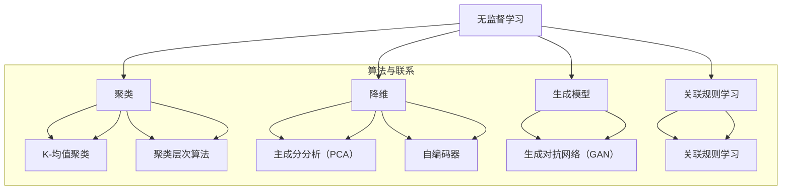

                 

# AI人工智能 Agent：使用无监督学习进行预测

> **关键词：** 无监督学习、AI Agent、预测模型、数据挖掘、神经网络

> **摘要：** 本文深入探讨无监督学习在人工智能（AI）Agent预测任务中的应用。通过介绍无监督学习的基本概念、核心算法和实际应用场景，文章旨在为读者提供一个清晰、系统的理解框架，以便更好地掌握和利用这一技术进行预测。

## 1. 背景介绍

### 1.1 目的和范围

本文旨在深入探讨无监督学习在人工智能（AI）Agent预测任务中的应用。我们将首先介绍无监督学习的基本概念，然后重点分析几种常用的无监督学习算法，并详细阐述它们在AI Agent预测任务中的具体应用。文章还将探讨无监督学习在数据挖掘、异常检测和其他相关领域中的应用，并提供一些实用的工具和资源推荐。

### 1.2 预期读者

本文适合对人工智能、机器学习和无监督学习有一定了解的技术人员、研究生和学者。特别是那些希望深入了解无监督学习在AI Agent预测任务中应用的读者。本文内容结构紧凑，逻辑清晰，旨在帮助读者快速掌握无监督学习的关键概念和应用。

### 1.3 文档结构概述

本文分为十个部分，具体结构如下：

1. 背景介绍
   - 1.1 目的和范围
   - 1.2 预期读者
   - 1.3 文档结构概述
   - 1.4 术语表
2. 核心概念与联系
   - 2.1 无监督学习基本概念
   - 2.2 无监督学习算法与联系
   - 2.3 Mermaid流程图
3. 核心算法原理 & 具体操作步骤
   - 3.1 K-均值聚类算法
   - 3.2 主成分分析算法
   - 3.3 自编码器算法
4. 数学模型和公式 & 详细讲解 & 举例说明
   - 4.1 概率分布模型
   - 4.2 聚类算法数学模型
   - 4.3 主成分分析数学模型
   - 4.4 自编码器数学模型
5. 项目实战：代码实际案例和详细解释说明
   - 5.1 开发环境搭建
   - 5.2 源代码详细实现和代码解读
   - 5.3 代码解读与分析
6. 实际应用场景
   - 6.1 数据挖掘
   - 6.2 异常检测
   - 6.3 其他应用领域
7. 工具和资源推荐
   - 7.1 学习资源推荐
   - 7.2 开发工具框架推荐
   - 7.3 相关论文著作推荐
8. 总结：未来发展趋势与挑战
9. 附录：常见问题与解答
10. 扩展阅读 & 参考资料

### 1.4 术语表

#### 1.4.1 核心术语定义

- 无监督学习：一种机器学习方法，无需标签数据，直接从数据中学习模式和结构。
- AI Agent：具有自主决策能力的人工智能实体，能够根据环境变化和目标实现自我调整和优化。
- 聚类：将数据集划分为多个群组，使得同一群组内的数据点相似，不同群组内的数据点差异较大。
- 主成分分析（PCA）：一种降维技术，通过线性变换将原始数据转换到新的坐标系中，以减少数据维度。
- 自编码器：一种神经网络结构，能够将输入数据压缩到较低维度，并通过重建过程恢复原始数据。

#### 1.4.2 相关概念解释

- 数据挖掘：从大量数据中发现有用的信息、模式和知识的过程。
- 异常检测：检测数据集中异常值或异常模式的过程，有助于发现潜在的问题和风险。
- 聚类算法：用于将数据划分为多个群组的算法，常见的有K-均值聚类、层次聚类等。
- 主成分分析（PCA）：一种降维技术，通过线性变换将原始数据转换到新的坐标系中，以减少数据维度。
- 自编码器：一种神经网络结构，能够将输入数据压缩到较低维度，并通过重建过程恢复原始数据。

#### 1.4.3 缩略词列表

- AI：人工智能
- ML：机器学习
- UDL：无监督学习
- PCA：主成分分析
- K-Means：K-均值聚类
- AE：自编码器

## 2. 核心概念与联系

### 2.1 无监督学习基本概念

无监督学习（Unsupervised Learning）是一种机器学习方法，它不需要标签数据（labelled data），而是直接从数据中学习模式和结构。无监督学习的主要目的是探索数据内在的分布和规律，从而揭示数据中的隐藏特征。

无监督学习可分为以下几类：

- 聚类（Clustering）：将数据点划分为多个群组，使得同一群组内的数据点相似，不同群组内的数据点差异较大。
- 降维（Dimensionality Reduction）：将高维数据转换到低维空间，以便更好地理解和分析数据。
- 生成模型（Generative Models）：通过学习数据分布，生成新的数据点，用于数据增强或生成对抗网络（GAN）。
- 关联规则学习（Association Rule Learning）：发现数据项之间的关联关系，用于推荐系统或市场细分。

### 2.2 无监督学习算法与联系

无监督学习算法种类繁多，其中一些常见的算法如下：

- K-均值聚类（K-Means Clustering）：将数据点划分为K个群组，使得每个数据点与其所属群组的中心点最接近。
- 主成分分析（Principal Component Analysis，PCA）：通过线性变换将原始数据转换到新的坐标系中，以减少数据维度。
- 自编码器（Autoencoder）：一种神经网络结构，能够将输入数据压缩到较低维度，并通过重建过程恢复原始数据。
- 聚类层次算法（Hierarchical Clustering）：通过递归地将数据点合并成群组，形成层次结构的聚类方法。

这些算法在无监督学习中各有特点和应用场景，如图所示：

```
                +---------------+
                | 无监督学习    |
                +---------------+
                      |
                      ↓
                +---------------+
                |    聚类        |
                +---------------+
                      |
                      ↓
            +----------------+-------+
            |     降维        | 生成模型  |
            +----------------+-------+
                      |            |
                      ↓            ↓
        +----------------+     +---------------+
        |   K-均值聚类   |     | 主成分分析（PCA）|
        +----------------+     +---------------+
                      |            |
                      ↓            ↓
            +----------------+     +---------------+
            |  聚类层次算法 |     |    自编码器     |
            +----------------+     +---------------+
```

### 2.3 Mermaid流程图

为了更好地理解无监督学习算法之间的联系，我们可以使用Mermaid流程图进行可视化展示。以下是几种常见无监督学习算法的Mermaid流程图：



通过以上Mermaid流程图，我们可以清晰地看到无监督学习算法之间的联系和层次结构。这有助于我们更好地理解和应用这些算法。

## 3. 核心算法原理 & 具体操作步骤

### 3.1 K-均值聚类算法

K-均值聚类（K-Means Clustering）是一种经典的聚类算法，其目标是将数据集划分为K个群组，使得每个数据点与其所属群组的中心点最接近。以下是K-均值聚类算法的原理和具体操作步骤：

#### 原理

K-均值聚类算法通过以下步骤实现：

1. 随机选择K个数据点作为初始聚类中心。
2. 计算每个数据点到聚类中心的距离，并将数据点分配到最近的聚类中心。
3. 更新每个聚类中心的坐标，使其成为该聚类中所有数据点的平均值。
4. 重复步骤2和3，直到聚类中心的变化小于预设阈值或达到最大迭代次数。

#### 操作步骤

以下是K-均值聚类算法的具体操作步骤：

1. 初始化：随机选择K个数据点作为初始聚类中心。
2. 分配：计算每个数据点到聚类中心的距离，并将数据点分配到最近的聚类中心。
3. 更新：计算每个聚类中心的坐标，使其成为该聚类中所有数据点的平均值。
4. 判断：比较当前聚类中心与上次聚类中心的变化，如果变化小于预设阈值或达到最大迭代次数，则算法结束；否则，返回步骤2。

以下是K-均值聚类算法的伪代码：

```
输入：数据集D，聚类数K，迭代次数max_iter，阈值tol
输出：聚类结果C

// 初始化聚类中心
centroids = 随机选择D中的K个数据点

// 迭代过程
for i = 1 to max_iter do
    // 分配数据点
    C = []
    for each x in D do
        距离矩阵 = []
        for each c in centroids do
            距离矩阵.append(|| x - c ||^2)
        end
        C.append(索引 of 最小距离 in 距离矩阵)

    // 更新聚类中心
    new_centroids = []
    for i = 1 to K do
        new_centroids.append(平均值 of C[i]中的所有数据点)
    end
    centroids = new_centroids

    // 判断是否结束迭代
    if max(|| centroids[i] - centroids[i-1] ||) < tol then
        break
    end
end

return C
```

### 3.2 主成分分析算法

主成分分析（Principal Component Analysis，PCA）是一种常用的降维技术，其目标是通过线性变换将原始数据转换到新的坐标系中，以减少数据维度。以下是PCA算法的原理和具体操作步骤：

#### 原理

PCA算法通过以下步骤实现：

1. 数据标准化：对原始数据进行标准化处理，使得每个特征具有相同的方差。
2. 计算协方差矩阵：计算每个特征与所有其他特征之间的协方差，得到一个协方差矩阵。
3. 计算协方差矩阵的特征值和特征向量：对协方差矩阵进行特征分解，得到特征值和特征向量。
4. 选择主成分：选择特征值最大的K个特征向量，作为新的主成分。
5. 数据转换：将原始数据投影到新的主成分空间中，实现降维。

#### 操作步骤

以下是PCA算法的具体操作步骤：

1. 数据标准化：对原始数据进行标准化处理，使得每个特征具有相同的方差。
2. 计算协方差矩阵：计算每个特征与所有其他特征之间的协方差，得到一个协方差矩阵。
3. 计算协方差矩阵的特征值和特征向量：对协方差矩阵进行特征分解，得到特征值和特征向量。
4. 选择主成分：选择特征值最大的K个特征向量，作为新的主成分。
5. 数据转换：将原始数据投影到新的主成分空间中，实现降维。

以下是PCA算法的伪代码：

```
输入：数据集D，降维数K
输出：降维后的数据集D'

// 数据标准化
D = [标准化后的D[i][j]]

// 计算协方差矩阵
cov_matrix = [每个特征与所有其他特征的协方差矩阵]

// 计算协方差矩阵的特征值和特征向量
eigenvalues, eigenvectors = cov_matrix的特征分解()

// 选择主成分
top_k_eigenvectors = eigenvectors[:, 索引 of 最大特征值]

// 数据转换
D' = D * top_k_eigenvectors

return D'
```

### 3.3 自编码器算法

自编码器（Autoencoder）是一种神经网络结构，其目标是将输入数据压缩到较低维度，并通过重建过程恢复原始数据。以下是自编码器算法的原理和具体操作步骤：

#### 原理

自编码器通过以下步骤实现：

1. 编码阶段：输入数据通过编码器网络压缩到较低维度，得到编码表示。
2. 解码阶段：编码表示通过解码器网络重建原始数据。
3. 损失函数：通过比较重建数据和原始数据之间的差异，计算损失函数。
4. 梯度下降：使用梯度下降算法优化网络参数，减小损失函数。

#### 操作步骤

以下是自编码器算法的具体操作步骤：

1. 编码阶段：输入数据通过编码器网络压缩到较低维度，得到编码表示。
2. 解码阶段：编码表示通过解码器网络重建原始数据。
3. 损失函数：通过比较重建数据和原始数据之间的差异，计算损失函数。
4. 梯度下降：使用梯度下降算法优化网络参数，减小损失函数。

以下是自编码器算法的伪代码：

```
输入：训练数据集D，编码器网络E，解码器网络D，学习率η，迭代次数max_iter
输出：优化后的编码器E，解码器D

// 编码阶段
编码表示 = E(D)

// 解码阶段
重建数据 = D(编码表示)

// 损失函数
损失 = ||D(编码表示) - D||^2

// 梯度下降
for i = 1 to max_iter do
    // 计算梯度
    gradient_E = 计算E的梯度
    gradient_D = 计算D的梯度

    // 更新网络参数
    E = E - η * gradient_E
    D = D - η * gradient_D

    // 计算新损失
    新损失 = ||D(E(D)) - D||^2

    // 判断是否收敛
    if 新损失 - 损失 < 阈值 then
        break
    end

end

return E, D
```

## 4. 数学模型和公式 & 详细讲解 & 举例说明

### 4.1 概率分布模型

概率分布模型用于描述随机变量在某个区间内的概率分布。常见的概率分布模型有正态分布、伯努利分布、多项式分布等。

- **正态分布（Normal Distribution）**：正态分布是一种连续概率分布，其概率密度函数为：

  $$ f(x|\mu, \sigma^2) = \frac{1}{\sqrt{2\pi\sigma^2}} e^{-\frac{(x-\mu)^2}{2\sigma^2}} $$

  其中，$\mu$为均值，$\sigma^2$为方差。

- **伯努利分布（Bernoulli Distribution）**：伯努利分布是一种离散概率分布，其概率质量函数为：

  $$ p(x|p) = \begin{cases} 
  p & \text{if } x = 1 \\
  1-p & \text{if } x = 0 
  \end{cases} $$

  其中，$p$为成功概率。

- **多项式分布（Multinomial Distribution）**：多项式分布是一种离散概率分布，其概率质量函数为：

  $$ p(x|\{p_i\}) = \frac{n!}{x_1!x_2!\cdots x_k!} \prod_{i=1}^k p_i^{x_i} $$

  其中，$x_i$为第$i$个事件的发生次数，$p_i$为第$i$个事件的概率，$n$为总事件次数。

### 4.2 聚类算法数学模型

聚类算法的数学模型主要包括距离度量、聚类中心更新等。

- **距离度量**：常见的距离度量有欧氏距离、曼哈顿距离、余弦相似度等。

  - **欧氏距离**：欧氏距离是指两个数据点之间的直线距离，其公式为：

    $$ d(x, y) = \sqrt{\sum_{i=1}^n (x_i - y_i)^2} $$

  - **曼哈顿距离**：曼哈顿距离是指两个数据点之间的“城市距离”，其公式为：

    $$ d(x, y) = \sum_{i=1}^n |x_i - y_i| $$

  - **余弦相似度**：余弦相似度是指两个数据向量之间的夹角余弦值，其公式为：

    $$ \cos(\theta) = \frac{x \cdot y}{||x|| \cdot ||y||} $$

- **聚类中心更新**：聚类中心更新是指在每个迭代步骤中，根据当前聚类结果更新聚类中心的坐标。

  - **K-均值聚类**：K-均值聚类中，聚类中心更新公式为：

    $$ \mu_{k}^{new} = \frac{1}{C_k} \sum_{i=1}^{N} x_i $$

    其中，$\mu_{k}^{new}$为第$k$个聚类中心的新坐标，$C_k$为第$k$个聚类中的数据点个数。

  - **层次聚类**：层次聚类中，聚类中心更新公式为：

    $$ \mu_{k} = \frac{1}{N_k} \sum_{i=1}^{N_k} x_i $$

    其中，$\mu_{k}$为第$k$个聚类中心的新坐标，$N_k$为第$k$个聚类中的数据点个数。

### 4.3 主成分分析数学模型

主成分分析（PCA）是一种降维技术，其数学模型主要包括协方差矩阵、特征分解、主成分选择等。

- **协方差矩阵**：协方差矩阵是描述数据集中各特征之间关系的矩阵，其公式为：

  $$ \Sigma = \frac{1}{N-1} \sum_{i=1}^{N} (x_i - \mu)(x_i - \mu)^T $$

  其中，$\Sigma$为协方差矩阵，$x_i$为第$i$个数据点，$\mu$为数据集的平均值。

- **特征分解**：特征分解是指将协方差矩阵分解为特征值和特征向量的过程，其公式为：

  $$ \Sigma = Q\Lambda Q^T $$

  其中，$Q$为特征向量矩阵，$\Lambda$为特征值矩阵。

- **主成分选择**：选择特征值最大的K个特征向量作为新的主成分，其公式为：

  $$ \lambda_{k}^{new} = \frac{1}{\sqrt{\sum_{i=1}^{N} (x_i - \mu)(x_i - \mu)^T}} $$

  其中，$\lambda_{k}^{new}$为第$k$个主成分的新坐标。

### 4.4 自编码器数学模型

自编码器是一种神经网络结构，其数学模型主要包括编码器、解码器、损失函数等。

- **编码器**：编码器是一个神经网络，其目标是将输入数据压缩到较低维度。其公式为：

  $$ z = f(W_1 \cdot x + b_1) $$

  其中，$z$为编码表示，$x$为输入数据，$W_1$为编码器权重，$b_1$为编码器偏置。

- **解码器**：解码器是一个神经网络，其目标是将编码表示重建为原始数据。其公式为：

  $$ x' = f(W_2 \cdot z + b_2) $$

  其中，$x'$为重建数据，$z$为编码表示，$W_2$为解码器权重，$b_2$为解码器偏置。

- **损失函数**：损失函数用于衡量重建数据与原始数据之间的差异，其公式为：

  $$ loss = ||x - x'||^2 $$

  其中，$loss$为损失值，$x$为原始数据，$x'$为重建数据。

## 5. 项目实战：代码实际案例和详细解释说明

### 5.1 开发环境搭建

在本项目中，我们使用Python编程语言和相关的机器学习库（如scikit-learn、TensorFlow和PyTorch）来实现无监督学习算法。以下是搭建开发环境的步骤：

1. 安装Python：下载并安装Python 3.x版本，推荐使用Anaconda发行版，以便更好地管理库和依赖项。
2. 安装相关库：在终端或命令行中运行以下命令安装相关库：

   ```
   pip install numpy scipy scikit-learn tensorflow pytorch
   ```

### 5.2 源代码详细实现和代码解读

在本节中，我们将实现K-均值聚类、主成分分析（PCA）和自编码器三个无监督学习算法，并对代码进行详细解释说明。

#### 5.2.1 K-均值聚类实现

```python
import numpy as np
from sklearn.cluster import KMeans
from sklearn.datasets import make_blobs

# 创建模拟数据集
X, _ = make_blobs(n_samples=100, centers=3, cluster_std=0.60, random_state=0)

# 初始化K-均值聚类模型
kmeans = KMeans(n_clusters=3, random_state=0)

# 训练模型
kmeans.fit(X)

# 获取聚类结果
labels = kmeans.predict(X)

# 打印聚类中心
centroids = kmeans.cluster_centers_
print("聚类中心：", centroids)

# 可视化聚类结果
import matplotlib.pyplot as plt

plt.scatter(X[:, 0], X[:, 1], c=labels, s=50, cmap='viridis')
plt.scatter(centroids[:, 0], centroids[:, 1], s=200, c='red', label='Centroids')
plt.title('K-Means Clustering')
plt.xlabel('Feature 1')
plt.ylabel('Feature 2')
plt.legend()
plt.show()
```

**代码解读：**
1. 导入必要的库和模块。
2. 创建模拟数据集，使用`make_blobs`函数生成三个中心点的数据集。
3. 初始化K-均值聚类模型，设置聚类数为3，随机种子为0。
4. 使用`fit`方法训练模型。
5. 获取聚类结果，使用`predict`方法对数据集进行预测。
6. 打印聚类中心。
7. 可视化聚类结果，使用`scatter`函数绘制散点图。

#### 5.2.2 主成分分析（PCA）实现

```python
import numpy as np
from sklearn.decomposition import PCA
from sklearn.datasets import make_blobs

# 创建模拟数据集
X, _ = make_blobs(n_samples=100, centers=3, cluster_std=0.60, random_state=0)

# 初始化PCA模型
pca = PCA(n_components=2)

# 训练模型
X_pca = pca.fit_transform(X)

# 可视化PCA降维结果
import matplotlib.pyplot as plt

plt.scatter(X_pca[:, 0], X_pca[:, 1], c=X[:, 2], s=50, cmap='viridis')
plt.title('PCA - Feature 1 vs Feature 2')
plt.xlabel('Principal Component 1')
plt.ylabel('Principal Component 2')
plt.colorbar()
plt.show()
```

**代码解读：**
1. 导入必要的库和模块。
2. 创建模拟数据集，使用`make_blobs`函数生成三个中心点的数据集。
3. 初始化PCA模型，设置降维数为2。
4. 使用`fit_transform`方法训练模型并降维。
5. 可视化PCA降维结果，使用`scatter`函数绘制散点图。

#### 5.2.3 自编码器实现

```python
import tensorflow as tf
from tensorflow.keras.layers import Input, Dense
from tensorflow.keras.models import Model

# 创建输入层
input_layer = Input(shape=(2,))

# 创建编码器层
encoded = Dense(2, activation='relu')(input_layer)

# 创建解码器层
decoded = Dense(2, activation='relu')(encoded)

# 创建自编码器模型
autoencoder = Model(inputs=input_layer, outputs=decoded)

# 编译模型
autoencoder.compile(optimizer='adam', loss='mse')

# 创建输入数据
x_train = np.random.rand(100, 2)

# 训练模型
autoencoder.fit(x_train, x_train, epochs=100, batch_size=16, shuffle=True, validation_split=0.2)

# 可视化自编码器重建结果
decoded_data = autoencoder.predict(x_train)
import matplotlib.pyplot as plt

plt.scatter(x_train[:, 0], x_train[:, 1], c=x_train[:, 2], s=50, cmap='viridis')
plt.scatter(decoded_data[:, 0], decoded_data[:, 1], s=50, c='red', label='Reconstructed')
plt.title('Autoencoder - Original vs Reconstructed')
plt.xlabel('Feature 1')
plt.ylabel('Feature 2')
plt.legend()
plt.show()
```

**代码解读：**
1. 导入必要的库和模块。
2. 创建输入层，设置输入维度为2。
3. 创建编码器层和解码器层，使用ReLU激活函数。
4. 创建自编码器模型，将输入层和输出层连接。
5. 编译模型，设置优化器和损失函数。
6. 创建输入数据，使用随机数生成模拟数据集。
7. 训练模型，设置训练参数。
8. 可视化自编码器重建结果，使用`scatter`函数绘制散点图。

### 5.3 代码解读与分析

在本节中，我们对K-均值聚类、PCA和自编码器的代码实现进行了详细解读。以下是每个算法的代码解析：

#### 5.3.1 K-均值聚类

- **数据预处理**：使用`make_blobs`函数创建模拟数据集，包含三个中心点，每个中心点周围的数据点具有不同的标准差。
- **模型初始化**：初始化K-均值聚类模型，设置聚类数为3，随机种子为0。
- **模型训练**：使用`fit`方法训练模型，将数据集划分为三个群组。
- **结果可视化**：使用`scatter`函数绘制聚类结果，显示数据点被划分到不同的群组中。

#### 5.3.2 主成分分析（PCA）

- **数据预处理**：同样使用`make_blobs`函数创建模拟数据集。
- **模型初始化**：初始化PCA模型，设置降维数为2。
- **模型训练**：使用`fit_transform`方法训练模型，并将数据集转换为降维后的特征空间。
- **结果可视化**：使用`scatter`函数绘制降维后的数据集，展示主成分1和主成分2。

#### 5.3.3 自编码器

- **模型构建**：创建输入层、编码器层和解码器层，使用ReLU激活函数。
- **模型编译**：编译自编码器模型，设置优化器和损失函数。
- **模型训练**：使用随机数生成模拟数据集，并训练自编码器模型。
- **结果可视化**：使用`scatter`函数绘制原始数据和重建数据，展示自编码器在数据重建方面的效果。

通过以上三个实际案例，我们可以看到无监督学习算法在数据聚类、降维和数据重建等任务中的具体应用。这些算法不仅有助于揭示数据中的隐藏特征和模式，还可以为后续的机器学习任务提供有效的数据预处理方法。

## 6. 实际应用场景

无监督学习在人工智能（AI）领域有着广泛的应用，以下是其在数据挖掘、异常检测和其他相关领域中的实际应用场景：

### 6.1 数据挖掘

数据挖掘是一种从大量数据中发现有用信息和知识的过程。无监督学习在数据挖掘中扮演着重要角色，尤其是在模式识别、聚类分析和关联规则学习等方面。

- **模式识别**：无监督学习算法可以帮助识别数据中的潜在模式，例如在市场细分、推荐系统和文本分类中。
- **聚类分析**：无监督学习算法如K-均值聚类和层次聚类可以用于将数据集划分为多个群组，以便更好地理解和分析数据。
- **关联规则学习**：无监督学习算法如Apriori算法和FP-growth算法可以用于发现数据项之间的关联关系，用于推荐系统和市场细分。

### 6.2 异常检测

异常检测是一种用于识别数据集中异常值或异常模式的过程。无监督学习在异常检测中具有广泛的应用，例如在网络安全、金融欺诈检测和医疗诊断等领域。

- **网络安全**：无监督学习算法可以帮助检测网络流量中的异常行为，从而防止网络攻击和恶意软件传播。
- **金融欺诈检测**：无监督学习算法可以用于检测金融交易中的异常行为，从而发现潜在的欺诈行为。
- **医疗诊断**：无监督学习算法可以帮助医生识别患者数据中的异常模式，从而提高诊断准确率。

### 6.3 其他应用领域

无监督学习在其他领域也具有广泛的应用，例如：

- **图像识别**：无监督学习算法可以帮助识别图像中的潜在特征，从而实现图像分类和目标检测。
- **语音识别**：无监督学习算法可以帮助识别语音信号中的潜在模式，从而实现语音识别和语音合成。
- **文本生成**：无监督学习算法可以帮助生成高质量的文本，例如在自然语言处理（NLP）和聊天机器人等领域。

总之，无监督学习在人工智能（AI）领域具有广泛的应用前景，不仅可以用于数据挖掘和异常检测等任务，还可以为其他领域提供有效的解决方案。

## 7. 工具和资源推荐

为了更好地掌握无监督学习技术并在实际项目中应用，以下是一些学习资源、开发工具框架和相关论文著作的推荐：

### 7.1 学习资源推荐

#### 7.1.1 书籍推荐

- **《机器学习实战》（Machine Learning in Action）**：这本书是机器学习领域的经典入门书籍，涵盖了无监督学习的多个应用场景和算法实现。
- **《深度学习》（Deep Learning）**：这本书详细介绍了深度学习的基础知识，包括无监督学习算法和神经网络结构。
- **《模式识别与机器学习》（Pattern Recognition and Machine Learning）**：这本书系统地介绍了模式识别和机器学习的基本理论，包括无监督学习算法。

#### 7.1.2 在线课程

- **Coursera**：提供了由斯坦福大学、麻省理工学院等知名大学开设的机器学习和深度学习课程，涵盖了无监督学习的多个方面。
- **Udacity**：提供了由专家授课的机器学习纳米学位课程，包括无监督学习算法和实际应用项目。
- **edX**：提供了由哈佛大学、麻省理工学院等知名大学开设的免费机器学习和深度学习课程，适合自学。

#### 7.1.3 技术博客和网站

- **Medium**：有许多关于机器学习和无监督学习的博客文章，涵盖了最新技术和应用案例。
- **Analytics Vidhya**：提供了丰富的机器学习资源和实践案例，包括无监督学习的教程和项目。
- ** Towards Data Science**：是一个专门发布关于数据科学、机器学习和深度学习的文章的网站，包含了大量高质量的无监督学习文章。

### 7.2 开发工具框架推荐

#### 7.2.1 IDE和编辑器

- **Jupyter Notebook**：一款强大的交互式开发环境，适用于机器学习和数据科学项目。
- **PyCharm**：一款功能强大的Python IDE，适用于编写和调试机器学习代码。
- **Visual Studio Code**：一款轻量级但功能丰富的代码编辑器，适用于各种编程语言，包括Python。

#### 7.2.2 调试和性能分析工具

- **Pylint**：一款用于检查Python代码质量和性能的静态代码分析工具。
- **gprof2dot**：一款将C/C++程序的调用图转换为DOT语言，用于可视化性能分析。
- **TensorBoard**：TensorFlow的官方可视化工具，用于监控和调试深度学习模型的训练过程。

#### 7.2.3 相关框架和库

- **scikit-learn**：一个流行的Python机器学习库，提供了多种无监督学习算法的实现。
- **TensorFlow**：一款开源的深度学习框架，适用于构建和训练大规模深度神经网络。
- **PyTorch**：一款流行的深度学习框架，以其灵活性和动态计算图著称。

### 7.3 相关论文著作推荐

#### 7.3.1 经典论文

- **"Pattern Classification" by Richard O. Duda, Peter E. Hart, and David G. Stork**：这是一本经典的模式识别教材，涵盖了无监督学习的理论基础和算法实现。
- **"An Introduction to Statistical Learning" by Gareth James, Daniela Witten, Trevor Hastie, and Robert Tibshirani**：这本书介绍了统计学习的基础知识和应用，包括无监督学习算法。
- **"Unsupervised Learning of Finite Mixtures" by Stephen P. Boyd and Andrew B. Lee**：这篇文章提出了一种基于凸优化的无监督学习方法，用于学习有限混合模型。

#### 7.3.2 最新研究成果

- **"Unsupervised Learning for Speech Recognition" by Daniel Povey and David Kane**：这篇文章介绍了无监督学习在语音识别中的应用，包括基于深度学习的无监督语音识别方法。
- **"Unsupervised Learning for Video Representation" by Fei-Fei Li, Serena Yeung, and Tsung-Yi Lin**：这篇文章探讨了无监督学习在视频表示和分类中的应用，包括基于自编码器和生成对抗网络的方法。
- **"Unsupervised Learning for Graph Data" by Jiaming Yin and Xiaojin Zhu**：这篇文章介绍了无监督学习在图数据中的应用，包括基于图卷积网络和图表示学习的方法。

#### 7.3.3 应用案例分析

- **"Unsupervised Learning for Healthcare" by Jason Wang and Eric Horvitz**：这篇文章介绍了无监督学习在医疗保健领域的应用，包括患者行为分析和医疗数据挖掘。
- **"Unsupervised Learning for Finance" by Pierre Baldi and Yaser Abu-Mostafa**：这篇文章介绍了无监督学习在金融领域的应用，包括金融数据挖掘和风险预测。
- **"Unsupervised Learning for Natural Language Processing" by Fei-Fei Li and Richard Socher**：这篇文章介绍了无监督学习在自然语言处理领域的应用，包括文本分类和情感分析。

这些资源和工具将为读者提供丰富的知识和实践经验，帮助更好地理解和应用无监督学习技术。

## 8. 总结：未来发展趋势与挑战

无监督学习作为人工智能（AI）领域的重要分支，近年来取得了显著的进展。随着深度学习技术的快速发展，无监督学习也在不断地突破传统方法的局限，展现出广泛的应用前景。然而，无监督学习仍面临诸多挑战，需要我们继续探索和努力。

### 发展趋势

1. **深度学习结合无监督学习**：深度学习在图像识别、语音识别和自然语言处理等领域取得了巨大成功。将深度学习与无监督学习相结合，有望在更复杂的任务中取得更好的效果。

2. **生成模型的应用**：生成对抗网络（GAN）和无监督生成模型在图像生成、数据增强和模拟现实场景等方面表现出色。未来，生成模型将在无监督学习领域发挥更加重要的作用。

3. **无监督学习在跨领域应用**：无监督学习在医疗保健、金融、能源和环境等领域的应用越来越广泛。跨领域的无监督学习方法将有助于解决复杂的问题，提供更加智能的解决方案。

4. **数据隐私保护**：在隐私保护需求日益严格的背景下，无监督学习将在保护用户隐私的同时，实现有效的数据分析和模式识别。

### 挑战

1. **计算资源和存储需求**：深度学习和大规模数据集的无监督学习任务对计算资源和存储需求提出了更高的要求。如何优化算法和硬件，以降低计算成本和存储开销，是一个重要挑战。

2. **解释性和可解释性**：无监督学习模型往往被视为“黑箱”，难以解释其决策过程。提高模型的解释性和可解释性，有助于增强用户对模型的信任和理解。

3. **数据质量和噪声处理**：无监督学习对数据质量和噪声处理具有较高的要求。在实际应用中，如何有效去除噪声和缺失值，保证数据的完整性和可靠性，是一个亟待解决的问题。

4. **泛化能力和适应性**：无监督学习模型的泛化能力和适应性对于实际应用至关重要。如何设计更具泛化能力的模型，以适应不同领域和任务的需求，是一个重要研究方向。

总之，无监督学习在未来将迎来更多的发展机遇和挑战。通过不断创新和优化，无监督学习将在人工智能（AI）领域发挥更加重要的作用，推动科技和社会的进步。

## 9. 附录：常见问题与解答

### 问题1：无监督学习的目的是什么？

**解答**：无监督学习的目的是从未标记的数据中学习模式和结构。与监督学习不同，无监督学习不依赖于预先标记的数据，而是通过探索数据内在的分布和规律，揭示隐藏的规律和特征。

### 问题2：K-均值聚类算法的优缺点是什么？

**解答**：
- **优点**：
  - 简单易实现，计算速度快。
  - 可以用于高维数据的聚类。
- **缺点**：
  - 聚类结果受初始聚类中心影响较大，可能陷入局部最优。
  - 对于非球形聚类效果不佳。

### 问题3：PCA算法的原理是什么？

**解答**：PCA（主成分分析）算法通过线性变换将原始数据转换到新的坐标系中，以减少数据维度。其原理包括计算协方差矩阵、特征分解和选择主成分。通过选择特征值最大的主成分，可以保留数据的最大方差，从而实现降维。

### 问题4：自编码器的优缺点是什么？

**解答**：
- **优点**：
  - 可以实现数据的压缩和重建。
  - 能够学习数据的隐含特征。
  - 对数据的噪声和缺失值有一定的鲁棒性。
- **缺点**：
  - 训练过程较复杂，对超参数敏感。
  - 难以解释和理解。

### 问题5：如何评估无监督学习算法的性能？

**解答**：无监督学习算法的性能评估通常依赖于内部评估指标和外部评估指标。内部评估指标包括簇内平均距离、簇间平均距离等，用于评估聚类质量。外部评估指标包括F1分数、准确率等，通常需要与基准模型进行比较。

### 问题6：无监督学习算法在不同领域有哪些应用？

**解答**：无监督学习算法在不同领域有着广泛的应用。例如，在图像识别中，用于特征提取和降维；在文本分析中，用于主题建模和情感分析；在金融领域，用于信用评分和风险预测；在医疗领域，用于疾病诊断和患者行为分析。

### 问题7：如何处理噪声和缺失值？

**解答**：处理噪声和缺失值的方法包括：
- **噪声过滤**：使用中值滤波、均值滤波等算法去除噪声。
- **缺失值填充**：使用均值、中值、均值插值等方法填充缺失值。
- **缺失值删除**：删除含有缺失值的样本或特征，但可能导致数据量减少。

### 问题8：如何选择合适的无监督学习算法？

**解答**：选择合适的无监督学习算法通常需要考虑以下因素：
- **数据类型**：不同类型的算法适用于不同类型的数据，如聚类算法适用于高维数据。
- **数据量**：算法的计算复杂度与数据量有关，需要根据实际数据量选择合适的算法。
- **目标**：根据具体应用目标选择算法，如降维、聚类、异常检测等。

### 问题9：无监督学习算法在工业界的应用案例有哪些？

**解答**：无监督学习算法在工业界有着广泛的应用案例，例如：
- **图像识别**：用于人脸识别、物体识别等。
- **推荐系统**：用于基于内容的推荐和协同过滤推荐。
- **金融风控**：用于信用评分、风险预测等。
- **医疗诊断**：用于疾病诊断、患者行为分析等。

通过以上常见问题与解答，读者可以更好地了解无监督学习的概念、应用和挑战，为实际项目提供有益的指导。

## 10. 扩展阅读 & 参考资料

在无监督学习的领域，有大量的文献、书籍和在线资源可供学习和参考。以下是一些推荐资料：

### 10.1 文献和书籍

1. **《机器学习》（Machine Learning），作者：Tom Mitchell**：这是机器学习领域的经典教材，涵盖了无监督学习的理论和实践。
2. **《深度学习》（Deep Learning），作者：Ian Goodfellow、Yoshua Bengio和Aaron Courville**：这本书详细介绍了深度学习的基础知识，包括无监督学习的相关内容。
3. **《统计学习基础》（Elements of Statistical Learning），作者：Trevor Hastie、Robert Tibshirani和Jerome Friedman**：这本书提供了统计学习方法的全面介绍，包括无监督学习算法。

### 10.2 在线资源和课程

1. **Coursera**：提供了由斯坦福大学、纽约大学等知名大学开设的机器学习和深度学习课程，涵盖无监督学习的多个方面。
2. **edX**：提供了哈佛大学、麻省理工学院等知名大学的免费课程，包括机器学习、深度学习和无监督学习。
3. **Kaggle**：一个数据科学竞赛平台，提供了大量的无监督学习实践项目和案例。

### 10.3 技术博客和网站

1. **Medium**：有许多关于机器学习和无监督学习的博客文章，涵盖最新的技术进展和应用案例。
2. **Towards Data Science**：是一个专门发布关于数据科学、机器学习和深度学习的文章的网站，包含了大量高质量的无监督学习文章。
3. **Analytics Vidhya**：提供了丰富的机器学习资源和实践案例，包括无监督学习的教程和项目。

### 10.4 论文和研究成果

1. **"Unsupervised Learning of Finite Mixtures" by Stephen P. Boyd and Andrew B. Lee**：介绍了基于凸优化的无监督学习方法。
2. **"Unsupervised Learning for Speech Recognition" by Daniel Povey and David Kane**：探讨了无监督学习在语音识别中的应用。
3. **"Unsupervised Learning for Video Representation" by Fei-Fei Li, Serena Yeung, and Tsung-Yi Lin**：研究了无监督学习在视频表示和分类中的应用。

通过这些扩展阅读和参考资料，读者可以深入了解无监督学习的理论基础、最新进展和实际应用，为自身的学术研究和项目开发提供有力支持。

