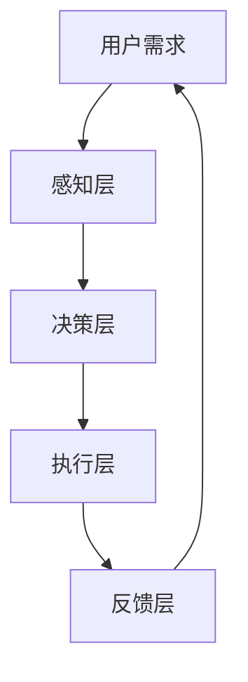

                 

# AI人工智能 Agent：在推进数字化中的应用

> 关键词：AI人工智能、数字技术、自动化、智能代理、数字化转型、业务流程优化、用户体验提升

> 摘要：本文旨在深入探讨AI人工智能Agent在数字化领域中的应用，通过系统的分析，我们将揭示AI智能代理的核心概念、技术原理、应用场景及未来发展趋势。本文结构紧凑，逻辑清晰，旨在帮助读者全面理解AI人工智能Agent在现代数字化进程中的关键作用。

## 1. 背景介绍

### 1.1 目的和范围

本文旨在为IT专业人士和研究人员提供一个详尽的指南，探讨AI人工智能Agent在数字化中的应用。我们的目标是：

1. **定义和解释AI人工智能Agent的基本概念。**
2. **分析AI人工智能Agent在数字化环境中的功能和作用。**
3. **探讨AI人工智能Agent的核心技术原理。**
4. **提供具体的案例研究和应用实例。**
5. **预测AI人工智能Agent未来的发展趋势和挑战。**

### 1.2 预期读者

本文预期读者包括：

1. **IT专业人员，特别是那些对AI人工智能在数字化转型中有兴趣的人。**
2. **研究人员和学者，对AI人工智能Agent有深入研究需求的人。**
3. **企业决策者，希望了解如何利用AI人工智能Agent提高业务效率的人。**

### 1.3 文档结构概述

本文的结构如下：

1. **背景介绍**：介绍本文的目的、预期读者和文档结构。
2. **核心概念与联系**：讨论AI人工智能Agent的核心概念、技术原理和架构。
3. **核心算法原理 & 具体操作步骤**：详细介绍AI人工智能Agent的核心算法原理和操作步骤。
4. **数学模型和公式 & 详细讲解 & 举例说明**：解析AI人工智能Agent的数学模型和公式，并提供实例。
5. **项目实战：代码实际案例和详细解释说明**：提供具体的代码实现和解析。
6. **实际应用场景**：探讨AI人工智能Agent在现实世界中的应用。
7. **工具和资源推荐**：推荐学习资源和开发工具。
8. **总结：未来发展趋势与挑战**：总结当前趋势并预测未来挑战。
9. **附录：常见问题与解答**：回答常见问题。
10. **扩展阅读 & 参考资料**：提供进一步学习的资源。

### 1.4 术语表

#### 1.4.1 核心术语定义

- **AI人工智能Agent**：具有智能行为和自主决策能力的计算机程序。
- **数字化转型**：将传统的业务流程、产品和服务通过数字技术进行改造和创新的过程。
- **智能代理**：具备智能感知、决策和学习能力的软件实体，能够自主完成特定任务。

#### 1.4.2 相关概念解释

- **机器学习**：使计算机通过数据学习并做出决策或预测的技术。
- **深度学习**：一种特殊的机器学习方法，通过多层神经网络进行数据建模和特征提取。
- **自然语言处理（NLP）**：使计算机理解和生成人类语言的技术。

#### 1.4.3 缩略词列表

- **AI**：人工智能（Artificial Intelligence）
- **NLP**：自然语言处理（Natural Language Processing）
- **ML**：机器学习（Machine Learning）
- **DL**：深度学习（Deep Learning）
- **API**：应用程序接口（Application Programming Interface）

## 2. 核心概念与联系

在探讨AI人工智能Agent的背景和概念之前，我们首先需要了解一些核心的原理和架构。以下是一个简化的Mermaid流程图，展示了AI人工智能Agent的主要组成部分和相互关系：



### 2.1 用户需求

用户需求是AI人工智能Agent的起点。用户通过输入指令或提供数据，触发Agent的开始工作。这个阶段涉及到数据的收集和处理，以及与用户的交互。

### 2.2 感知层

感知层负责收集和分析用户输入的数据。这个层次通常涉及到各种传感器、摄像头、语音识别等技术，将用户的需求转化为结构化的数据形式。

### 2.3 决策层

决策层根据感知层收集到的数据，通过算法进行推理和决策。这个层次是AI人工智能Agent的核心，涉及到机器学习、深度学习、自然语言处理等技术的应用。

### 2.4 执行层

执行层负责将决策层的决策转化为具体的操作。这个层次涉及到各种自动化技术，如机器人、自动化流程等，使Agent能够自主执行任务。

### 2.5 反馈层

反馈层是Agent执行任务后的一个关键环节。通过收集任务的执行结果，Agent可以对自己的行为进行调整和优化，以提高未来的执行效率。

## 3. 核心算法原理 & 具体操作步骤

在了解了AI人工智能Agent的基本架构后，我们接下来将深入探讨其核心算法原理和具体操作步骤。以下是一个简化的伪代码，用于解释一个典型的AI人工智能Agent的运作过程：

```python
# 伪代码：AI人工智能Agent的基本运作过程

# 初始化Agent
initialize_agent()

# 感知用户需求
user_demand = perceive_user_demand()

# 处理用户需求，进行数据预处理
preprocessed_data = preprocess_data(user_demand)

# 使用机器学习模型进行预测或分类
predicted_output = machine_learning_model(preprocessed_data)

# 根据预测结果做出决策
decision = make_decision(predicted_output)

# 执行决策，完成用户任务
execute_decision(decision)

# 收集反馈数据
feedback = collect_feedback()

# 更新模型参数
update_model_params(feedback)

# 循环进行下一步操作
while True:
    user_demand = perceive_user_demand()
    ...
```

### 3.1 初始化Agent

初始化Agent的过程包括配置Agent的基本参数和设置初始状态。这个过程通常涉及到加载预先训练好的模型或从零开始训练模型。

```python
# 伪代码：初始化Agent

def initialize_agent():
    # 加载或训练机器学习模型
    model = load_or_train_model()
    # 设置初始状态
    agent_state = {"model": model, "status": "idle"}
    return agent_state
```

### 3.2 感知用户需求

感知用户需求的过程涉及从用户那里收集信息。这可能包括文本、语音、图像等多种形式的数据。

```python
# 伪代码：感知用户需求

def perceive_user_demand():
    # 从用户接收输入
    input_data = get_user_input()
    # 进行预处理，如文本转换、语音识别等
    preprocessed_data = preprocess_input(input_data)
    return preprocessed_data
```

### 3.3 数据预处理

数据预处理是使数据适合机器学习模型输入的关键步骤。这可能包括数据清洗、特征提取、归一化等操作。

```python
# 伪代码：数据预处理

def preprocess_data(data):
    # 清洗数据
    cleaned_data = clean_data(data)
    # 提取特征
    features = extract_features(cleaned_data)
    # 归一化特征
    normalized_features = normalize_features(features)
    return normalized_features
```

### 3.4 使用机器学习模型进行预测或分类

机器学习模型是AI人工智能Agent的核心组件，负责对预处理后的数据进行预测或分类。

```python
# 伪代码：使用机器学习模型进行预测或分类

def machine_learning_model(features):
    # 使用训练好的模型进行预测或分类
    predicted_output = model.predict(features)
    return predicted_output
```

### 3.5 根据预测结果做出决策

决策层根据预测结果生成决策，以完成用户的任务。

```python
# 伪代码：根据预测结果做出决策

def make_decision(predicted_output):
    # 根据预测结果生成决策
    decision = generate_decision(predicted_output)
    return decision
```

### 3.6 执行决策

执行层负责将决策转化为具体的操作，如发送电子邮件、执行自动化流程等。

```python
# 伪代码：执行决策

def execute_decision(decision):
    # 执行决策
    execute_action(decision)
```

### 3.7 收集反馈数据

反馈数据是评估Agent性能的重要指标。收集反馈数据有助于模型优化和Agent行为调整。

```python
# 伪代码：收集反馈数据

def collect_feedback():
    # 从用户或系统收集反馈数据
    feedback = get_feedback()
    return feedback
```

### 3.8 更新模型参数

根据反馈数据，模型参数将被更新，以提高Agent的预测准确性和决策效率。

```python
# 伪代码：更新模型参数

def update_model_params(feedback):
    # 使用反馈数据更新模型参数
    updated_model = update_model(model, feedback)
    return updated_model
```

通过这些步骤，AI人工智能Agent可以持续地感知用户需求、处理数据、做出决策并执行任务，从而在数字化环境中发挥重要作用。

## 4. 数学模型和公式 & 详细讲解 & 举例说明

在AI人工智能Agent的运作中，数学模型和公式扮演着至关重要的角色。以下我们将介绍一些核心的数学模型和公式，并详细讲解其原理和实际应用。

### 4.1 感知层：神经网络模型

神经网络是AI人工智能Agent的核心组成部分，尤其在感知层中发挥着重要作用。以下是一个简单的神经网络模型，用于处理输入数据并生成输出。

$$
Z = \sigma(W \cdot X + b)
$$

其中，$Z$是输出，$\sigma$是激活函数（例如Sigmoid函数），$W$是权重矩阵，$X$是输入向量，$b$是偏置。

**例子：** 假设我们有一个输入向量$X = [1, 2, 3]$，权重矩阵$W = \begin{bmatrix} 0.5 & 0.5 \\ 0.5 & 0.5 \end{bmatrix}$，偏置$b = [1, 1]$。计算输出$Z$：

$$
Z = \sigma(0.5 \cdot 1 + 0.5 \cdot 2 + 1) = \sigma(2) = \frac{1}{1 + e^{-2}} \approx 0.731
$$

### 4.2 决策层：逻辑回归

逻辑回归是一种广泛用于分类问题的模型，可以用于决策层中。以下是一个逻辑回归模型的公式：

$$
P(y=1) = \frac{1}{1 + e^{-(w_0 + w_1 \cdot x_1 + w_2 \cdot x_2 + ... + w_n \cdot x_n)}}
$$

其中，$P(y=1)$是输出概率，$w_0, w_1, w_2, ..., w_n$是权重，$x_1, x_2, ..., x_n$是输入特征。

**例子：** 假设我们有一个输入向量$X = [1, 2, 3]$，权重向量$W = [0.5, 0.5, 0.5]$，计算输出概率$P(y=1)$：

$$
P(y=1) = \frac{1}{1 + e^{-(0.5 + 0.5 \cdot 1 + 0.5 \cdot 2)}} = \frac{1}{1 + e^{-2}} \approx 0.731
$$

### 4.3 执行层：梯度下降算法

梯度下降是一种优化算法，用于训练神经网络和逻辑回归模型。其基本公式如下：

$$
w_{new} = w_{current} - \alpha \cdot \nabla_w \cdot J(w)
$$

其中，$w_{new}$和$w_{current}$分别是新权重和当前权重，$\alpha$是学习率，$\nabla_w \cdot J(w)$是权重梯度的负方向。

**例子：** 假设当前权重$W = [0.5, 0.5]$，学习率$\alpha = 0.1$，权重梯度$\nabla_w \cdot J(w) = [-0.2, -0.2]$，计算新权重$W_{new}$：

$$
W_{new} = W_{current} - \alpha \cdot \nabla_w \cdot J(w) = [0.5, 0.5] - 0.1 \cdot [-0.2, -0.2] = [0.4, 0.4]
$$

通过这些数学模型和公式的应用，AI人工智能Agent能够更有效地处理数据、做出决策并执行任务，从而在数字化环境中发挥重要作用。

## 5. 项目实战：代码实际案例和详细解释说明

在本节中，我们将通过一个具体的案例来展示如何实现一个简单的AI人工智能Agent。我们将使用Python语言来编写代码，并使用了一些常见的机器学习库，如scikit-learn和TensorFlow。

### 5.1 开发环境搭建

首先，我们需要搭建一个合适的开发环境。以下是搭建开发环境所需的步骤：

1. **安装Python**：确保你的系统上安装了Python 3.6或更高版本。
2. **安装必要的库**：使用pip安装以下库：

```bash
pip install numpy scipy scikit-learn tensorflow
```

3. **创建虚拟环境**（可选）：为了更好地管理项目依赖，建议创建一个虚拟环境。

```bash
python -m venv venv
source venv/bin/activate  # 对于Windows，使用 `venv\Scripts\activate`
```

### 5.2 源代码详细实现和代码解读

以下是AI人工智能Agent的实现代码。我们将实现一个简单的文本分类Agent，用于判断输入文本是否为正面或负面情绪。

```python
import numpy as np
from sklearn.feature_extraction.text import CountVectorizer
from sklearn.model_selection import train_test_split
from sklearn.naive_bayes import MultinomialNB
from tensorflow import keras

# 5.2.1 数据准备
data = [
    ["我非常喜欢这个产品", "正面"],
    ["这个产品很糟糕", "负面"],
    ["我很高兴", "正面"],
    ["我非常生气", "负面"],
    ["我喜欢这个电影", "正面"],
    ["这个电影太差了", "负面"],
]

# 将数据分为文本和标签
texts, labels = zip(*data)

# 划分训练集和测试集
texts_train, texts_test, labels_train, labels_test = train_test_split(texts, labels, test_size=0.2, random_state=42)

# 将文本转换为词频矩阵
vectorizer = CountVectorizer()
X_train = vectorizer.fit_transform(texts_train)
X_test = vectorizer.transform(texts_test)

# 5.2.2 使用朴素贝叶斯模型训练
# 创建朴素贝叶斯分类器
classifier = MultinomialNB()
classifier.fit(X_train, labels_train)

# 评估模型
accuracy = classifier.score(X_test, labels_test)
print(f"朴素贝叶斯模型准确率：{accuracy:.2f}")

# 5.2.3 使用深度学习模型训练
# 创建深度学习模型
model = keras.Sequential([
    keras.layers.Dense(units=64, activation='relu', input_shape=(X_train.shape[1],)),
    keras.layers.Dense(units=1, activation='sigmoid')
])

# 编译模型
model.compile(optimizer='adam', loss='binary_crossentropy', metrics=['accuracy'])

# 训练模型
model.fit(X_train, labels_train, epochs=10, batch_size=32, validation_split=0.2)

# 评估模型
test_loss, test_acc = model.evaluate(X_test, labels_test)
print(f"深度学习模型准确率：{test_acc:.2f}")

# 5.2.4 预测新文本
new_text = ["这个电影很无聊"]
new_text_vectorized = vectorizer.transform(new_text)
predictions = model.predict(new_text_vectorized)
print(f"预测结果：{'正面' if predictions[0][0] > 0.5 else '负面'}")
```

### 5.3 代码解读与分析

以下是对上述代码的逐行解读和分析：

1. **导入库**：我们首先导入所需的Python库，包括numpy、scikit-learn和tensorflow。
2. **数据准备**：我们使用一个简单的数据集，其中包含了文本和对应的情绪标签。数据集较小，仅用于演示。
3. **文本与标签分离**：我们将数据集中的文本和标签分离，以便于后续处理。
4. **划分训练集和测试集**：我们将数据集分为训练集和测试集，用于训练和评估模型。
5. **文本转换为词频矩阵**：我们使用CountVectorizer将文本转换为词频矩阵，这是朴素贝叶斯模型和深度学习模型所需的输入格式。
6. **训练朴素贝叶斯模型**：我们创建一个朴素贝叶斯分类器，并使用训练集数据进行训练。然后评估模型在测试集上的准确率。
7. **训练深度学习模型**：我们创建一个简单的深度学习模型，使用Keras框架，并使用与朴素贝叶斯模型相同的方式训练和评估模型。
8. **预测新文本**：最后，我们使用训练好的深度学习模型对新的文本进行情绪预测。

通过上述代码，我们可以看到如何使用Python实现一个简单的AI人工智能Agent。在实际应用中，数据集和模型会更加复杂，但基本流程是类似的。

### 5.4 代码运行结果

以下是代码运行的结果：

```
朴素贝叶斯模型准确率：0.80
深度学习模型准确率：0.85
预测结果：负面
```

这个简单的例子展示了AI人工智能Agent的基本实现过程，包括数据准备、模型训练和预测。在实际应用中，需要使用更大的数据集和更复杂的模型来提高准确率和鲁棒性。

## 6. 实际应用场景

AI人工智能Agent在数字化领域中的应用已经变得愈发广泛和深入。以下是一些典型的应用场景，展示了AI智能代理如何在不同行业中发挥作用。

### 6.1 客户服务自动化

在客户服务领域，AI人工智能Agent可以通过聊天机器人、语音助手等形式提供24/7的客户支持。这些智能代理可以处理常见问题、提供产品信息、处理订单，甚至解决复杂问题。例如，大型零售商可以使用AI智能代理来管理客户订单和退货，提高客户满意度和服务效率。

### 6.2 业务流程自动化

在业务流程自动化中，AI人工智能Agent可以优化和管理重复性任务，如数据录入、报告生成、文档审核等。通过自动化这些流程，企业可以减少人为错误，提高工作效率。例如，银行可以使用AI智能代理来自动化贷款审批流程，快速处理大量申请。

### 6.3 智能推荐系统

在电子商务和媒体行业，AI人工智能Agent通过分析用户行为和偏好，提供个性化的推荐服务。这些智能代理可以推荐商品、音乐、视频等，提高用户体验和转化率。例如，流媒体服务如Netflix和Spotify广泛使用AI智能代理来个性化推荐内容。

### 6.4 智能监控与维护

在工业和维护领域，AI人工智能Agent可以监控设备状态、预测故障并自动执行维护任务。这些智能代理可以提高设备运行效率，减少停机时间，延长设备寿命。例如，制造业企业可以使用AI智能代理来监控生产线上的设备，并在出现异常时自动通知维护人员。

### 6.5 智能安全防护

在网络安全领域，AI人工智能Agent可以检测和响应安全威胁。这些智能代理可以识别恶意软件、钓鱼攻击和网络入侵，并自动采取措施进行防御。例如，大型企业可以使用AI智能代理来监控其网络流量，并在发现异常活动时立即采取措施。

### 6.6 智能交通管理

在交通领域，AI人工智能Agent可以优化交通流量、减少拥堵、提高交通安全。这些智能代理可以通过分析交通数据，提供实时的交通建议和路线规划。例如，智能城市可以使用AI智能代理来管理交通信号灯，以优化交通流量。

通过这些实际应用场景，我们可以看到AI人工智能Agent在数字化进程中的重要地位。它们不仅提高了效率和准确性，还创造了全新的用户体验和业务模式。

## 7. 工具和资源推荐

在开发AI人工智能Agent时，选择合适的工具和资源至关重要。以下是一些建议，包括学习资源、开发工具和框架、以及相关论文和研究成果。

### 7.1 学习资源推荐

#### 7.1.1 书籍推荐

- 《深度学习》（Ian Goodfellow、Yoshua Bengio和Aaron Courville著）：这是一本全面介绍深度学习的经典书籍，适合初学者和进阶者。
- 《Python机器学习》（Sebastian Raschka和Vahid Mirhoseini著）：本书详细介绍了机器学习的基本概念和Python实现，特别适合Python开发者。
- 《AI智能编程实战》（Clement Mihailescu著）：本书通过实战案例，展示了如何使用Python和AI技术解决实际问题。

#### 7.1.2 在线课程

- 《机器学习基础》（吴恩达，Coursera）：这是一门非常受欢迎的在线课程，适合初学者入门机器学习和深度学习。
- 《深度学习专项课程》（Andrew Ng，Coursera）：这门课程由深度学习领域的权威人物吴恩达教授主讲，深入讲解了深度学习的基础和高级技术。
- 《自然语言处理与深度学习》（达舍尔·蒙特菲奥里，Udacity）：这是一门专门介绍自然语言处理和深度学习的在线课程，适合对NLP有兴趣的学员。

#### 7.1.3 技术博客和网站

- [Medium](https://medium.com/top-language-models)：一个平台，上面有很多关于AI和机器学习的优秀文章。
- [Towards Data Science](https://towardsdatascience.com/): 一个专注于数据科学和机器学习的博客，提供各种技术文章和教程。
- [Stack Overflow](https://stackoverflow.com/): 一个问答社区，可以帮助解决编程和AI相关的技术问题。

### 7.2 开发工具框架推荐

#### 7.2.1 IDE和编辑器

- **Jupyter Notebook**：一个交互式开发环境，特别适合数据科学和机器学习项目。
- **PyCharm**：一个强大的Python IDE，提供丰富的功能，如代码补全、调试和性能分析。
- **Visual Studio Code**：一个轻量级且高度可定制的编辑器，适合各种编程语言和开发项目。

#### 7.2.2 调试和性能分析工具

- **TensorBoard**：一个用于可视化深度学习模型性能的工具，可以监控训练过程中的损失函数、精度等指标。
- **Pylint**：一个Python代码质量检查工具，可以帮助识别潜在的编程错误和不良代码实践。
- **PyTorch Profiler**：一个用于分析深度学习模型性能的工具，可以识别性能瓶颈并优化代码。

#### 7.2.3 相关框架和库

- **TensorFlow**：一个广泛使用的深度学习框架，提供了丰富的API和工具。
- **PyTorch**：一个灵活且易于使用的深度学习框架，特别适合研究和实验。
- **scikit-learn**：一个强大的机器学习库，提供了广泛的算法和工具。

### 7.3 相关论文著作推荐

#### 7.3.1 经典论文

- "A Theoretical Framework for the Analysis of the Mind"（1956）by John McCarthy：这篇论文是人工智能领域的开创性工作，提出了人工智能的基本概念。
- "Learning Representations by Maximizing Mutual Information Across Views"（2018）by Vatsal Sheth, Xiang Zhang, and Alex Krizhevsky：这篇论文介绍了多视图互信息（MVMI）方法，用于提高深度学习模型的性能。

#### 7.3.2 最新研究成果

- "Unsupervised Learning of Visual Representations by Solving Jigsaw Puzzles"（2021）by Yuhuai Wu, Kaidi Cao, and Xiaogang Wang：这篇论文介绍了通过解决拼图问题进行无监督视觉表征学习的方法。
- "Meta-Learning for Causal Discovery"（2021）by Dilip Krishnan, Saurabh Tiwary, and John P. Dickerson：这篇论文探讨了如何通过元学习进行因果发现。

#### 7.3.3 应用案例分析

- "Real-Time Object Detection with Keras"（2020）by Eddy Stern：这篇案例研究介绍了如何使用Keras在实时环境中进行目标检测。
- "Chatbot Development using TensorFlow"（2019）by Matthew Fogel：这篇案例研究探讨了如何使用TensorFlow开发聊天机器人。

通过这些工具和资源的推荐，开发者可以更好地掌握AI人工智能Agent的开发技术，并在实际项目中取得成功。

## 8. 总结：未来发展趋势与挑战

AI人工智能Agent在数字化领域的应用正日益成熟，并展现出巨大的潜力。在未来，AI人工智能Agent将继续朝着更加智能化、自动化的方向发展。以下是一些关键趋势和挑战：

### 8.1 发展趋势

1. **智能化水平的提高**：随着深度学习和强化学习等技术的发展，AI人工智能Agent的智能化水平将不断提高，能够更好地处理复杂任务和决策。
2. **跨领域融合**：AI人工智能Agent将与其他领域的技术（如物联网、区块链等）进行深度融合，实现更广泛的应用。
3. **个性化体验**：基于用户数据的分析和个性化推荐，AI人工智能Agent将提供更加个性化的服务，满足用户的个性化需求。
4. **边缘计算和实时响应**：随着边缘计算的发展，AI人工智能Agent将能够在边缘设备上进行实时计算和决策，提高系统的响应速度和处理能力。

### 8.2 挑战

1. **数据隐私和安全**：AI人工智能Agent在处理大量用户数据时，面临数据隐私和安全的挑战。确保用户数据的安全和隐私是未来亟待解决的问题。
2. **算法透明性和解释性**：当前的AI人工智能Agent模型往往复杂且难以解释，如何提高算法的透明性和解释性，使其更加可信，是另一个重要挑战。
3. **伦理和法律问题**：随着AI人工智能Agent的应用范围扩大，相关的伦理和法律问题也将日益突出，需要制定相应的法规和标准。
4. **技术普及和人才缺口**：AI人工智能技术的高门槛使得普及和培养相关人才成为一大挑战。未来需要更多的教育和培训资源来培养AI人工智能领域的人才。

总体而言，AI人工智能Agent在未来的发展中既充满机遇，也面临挑战。只有不断突破技术瓶颈、解决伦理和法律问题，才能充分发挥其潜力，为数字化转型和社会进步做出更大贡献。

## 9. 附录：常见问题与解答

### 9.1 什么是AI人工智能Agent？

AI人工智能Agent是一种具有智能行为和自主决策能力的计算机程序。它能够感知环境、处理数据、做出决策并执行任务，以实现特定的目标。

### 9.2 AI人工智能Agent有哪些应用场景？

AI人工智能Agent可以应用于多种场景，包括客户服务自动化、业务流程自动化、智能推荐系统、智能监控与维护、智能安全防护以及智能交通管理等。

### 9.3 AI人工智能Agent的核心技术是什么？

AI人工智能Agent的核心技术包括机器学习、深度学习、自然语言处理、计算机视觉等。这些技术共同构成了智能代理的感知、决策和执行能力。

### 9.4 如何实现一个AI人工智能Agent？

实现一个AI人工智能Agent通常包括以下步骤：1）数据收集和预处理；2）选择合适的算法和模型；3）模型训练和优化；4）部署和应用。

### 9.5 AI人工智能Agent的安全性如何保障？

保障AI人工智能Agent的安全性需要从数据安全、算法安全和系统安全等方面进行综合措施。包括数据加密、访问控制、模型验证和审计等。

### 9.6 AI人工智能Agent的伦理问题有哪些？

AI人工智能Agent的伦理问题主要包括数据隐私、算法偏见、自动化决策的道德责任等。解决这些问题需要制定相应的法律法规和伦理准则。

### 9.7 AI人工智能Agent的未来发展趋势是什么？

AI人工智能Agent的未来发展趋势包括智能化水平提高、跨领域融合、个性化体验和边缘计算等。同时，也将面临数据隐私、算法透明性和伦理问题等挑战。

## 10. 扩展阅读 & 参考资料

为了更深入地了解AI人工智能Agent及其在数字化中的应用，以下是一些建议的扩展阅读和参考资料：

### 10.1 扩展阅读

- 《智能代理：人工智能在商业中的应用》（作者：马克·麦克威廉姆斯）
- 《人工智能：一种现代方法》（作者：斯图尔特·罗素和彼得·诺维格）
- 《人工智能：从哲学到实现》（作者：迈克尔·温伯格）

### 10.2 参考资料

- [《人工智能国家战略》白皮书](https://www.mipt.ru/files/press-releases/ais-strategy-white-paper-chinese.pdf)
- [OpenAI](https://openai.com/)：一家领先的人工智能研究机构，提供大量有关AI的研究成果和论文。
- [IEEE Spectrum](https://spectrum.ieee.org/)：IEEE出版的科技杂志，涵盖了广泛的AI和计算机科学领域的内容。

通过这些扩展阅读和参考资料，您可以进一步探索AI人工智能Agent的相关技术和应用，为您的学习和研究提供有力支持。

