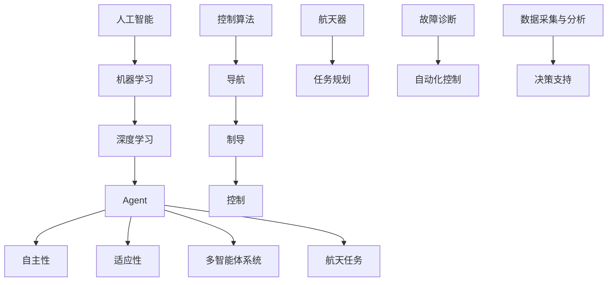

                 

### AI人工智能 Agent：在航天领域中的应用

#### 关键词：人工智能，航天，Agent，应用，挑战，趋势

> 在这个信息爆炸和科技迅猛发展的时代，人工智能正成为推动社会进步的重要力量。航天领域，作为高科技的前沿阵地，也逐渐开始引入人工智能技术，以提高效率、降低成本，并应对日益复杂的任务。本文将探讨人工智能（AI）Agent在航天领域的应用，从背景介绍、核心概念、算法原理到实际应用场景，全面解析这一领域的最新进展和未来挑战。

#### 摘要

本文旨在探讨人工智能（AI）Agent在航天领域的应用。首先，通过介绍航天领域中人工智能的需求和背景，阐述AI Agent的基本概念和特点。接着，详细讲解AI Agent的核心算法原理和操作步骤，并使用数学模型和公式进行说明。随后，通过实际项目案例展示AI Agent在航天领域的应用效果，并分析其在不同场景中的实际应用。最后，本文将推荐相关学习资源和工具，总结AI Agent在航天领域的发展趋势与挑战，并展望未来。

### 1. 背景介绍

#### 1.1 目的和范围

随着航天技术的不断发展，航天任务日益复杂，对人工智能（AI）的需求也越来越迫切。本文旨在探讨AI Agent在航天领域的应用，分析其在任务规划、故障诊断、自动化控制等方面的潜力，并探讨未来发展的趋势和挑战。本文涵盖以下内容：

1. 航天领域中人工智能的需求和背景
2. AI Agent的基本概念和特点
3. AI Agent的核心算法原理和操作步骤
4. 数学模型和公式在AI Agent中的应用
5. AI Agent在航天领域的实际应用案例
6. AI Agent在不同航天场景中的应用
7. 相关学习资源和工具推荐
8. AI Agent在航天领域的发展趋势与挑战

#### 1.2 预期读者

本文面向对航天和人工智能技术有一定了解的技术人员、研究人员和开发者。读者应具备以下背景知识：

1. 对航天技术的基本了解
2. 对人工智能技术的基本了解，包括机器学习、深度学习等
3. 对编程和软件开发的基本技能
4. 对算法和数学模型的基本理解

#### 1.3 文档结构概述

本文分为十个部分，如下所示：

1. 引言：介绍文章的主题和目的
2. 背景介绍：介绍航天领域中人工智能的需求和背景
3. 核心概念与联系：介绍AI Agent的基本概念和原理
4. 核心算法原理 & 具体操作步骤：详细讲解AI Agent的核心算法
5. 数学模型和公式 & 详细讲解 & 举例说明：使用数学模型和公式阐述AI Agent的应用
6. 项目实战：代码实际案例和详细解释说明
7. 实际应用场景：分析AI Agent在不同航天场景中的应用
8. 工具和资源推荐：推荐相关学习资源和开发工具
9. 总结：总结AI Agent在航天领域的发展趋势与挑战
10. 附录：常见问题与解答

#### 1.4 术语表

为了确保本文的可读性和一致性，以下列出了一些关键的术语和它们的定义：

##### 1.4.1 核心术语定义

- **人工智能（AI）**：指通过计算机程序实现人类智能的技术。
- **机器学习（ML）**：一种人工智能的方法，通过训练数据集，让计算机自动获取知识和规律。
- **深度学习（DL）**：一种特殊的机器学习方法，通过多层神经网络模型，自动提取复杂特征。
- **Agent**：一种具有自主性、协作性和适应性的计算机程序或实体。
- **航天任务**：指太空飞行器在太空中执行的各种任务，如探测、通信、观测等。
- **控制算法**：用于控制航天器运动的算法，包括导航、制导和控制。

##### 1.4.2 相关概念解释

- **智能体（Agent）模型**：指用于描述AI Agent结构和功能的概念模型。
- **自主性**：指AI Agent在执行任务时不需要人类干预，具有自我决策和执行能力。
- **适应性**：指AI Agent能够根据环境和任务的变化，调整自身行为和策略。
- **多智能体系统**：指由多个AI Agent组成的系统，能够协同完成任务。

##### 1.4.3 缩略词列表

- **AI**：人工智能
- **ML**：机器学习
- **DL**：深度学习
- **NASA**：美国国家航空航天局
- **ISS**：国际空间站
- **ROS**：机器人操作系统

### 2. 核心概念与联系

在讨论AI Agent在航天领域的应用之前，首先需要了解一些核心概念和它们之间的联系。以下是一个Mermaid流程图，展示了AI Agent的基本概念和原理。



#### 2.1 人工智能（AI）

人工智能（AI）是指通过计算机程序实现人类智能的技术。它包括多种方法和技术，如机器学习（ML）、深度学习（DL）等。AI Agent是AI领域的一个重要分支，旨在开发具有自主性、协作性和适应性的计算机程序或实体。

#### 2.2 机器学习（ML）

机器学习（ML）是一种人工智能的方法，通过训练数据集，让计算机自动获取知识和规律。ML可以分为监督学习、无监督学习和强化学习等类型。在航天领域，ML技术常用于数据分析和预测。

#### 2.3 深度学习（DL）

深度学习（DL）是一种特殊的机器学习方法，通过多层神经网络模型，自动提取复杂特征。DL在图像识别、语音识别等领域取得了显著成果。在航天领域，DL技术可用于图像处理、故障诊断等任务。

#### 2.4 Agent

Agent是一种具有自主性、协作性和适应性的计算机程序或实体。在航天领域，AI Agent可用于任务规划、自动化控制、故障诊断等任务，提高航天任务的效率和可靠性。

#### 2.5 自主性

自主性是指AI Agent在执行任务时不需要人类干预，具有自我决策和执行能力。在航天领域，自主性可以提高航天器的任务执行能力，减少对地面支持的需求。

#### 2.6 适应性

适应性是指AI Agent能够根据环境和任务的变化，调整自身行为和策略。在航天领域，适应性可以提高航天器在复杂环境下的生存能力和任务执行能力。

#### 2.7 多智能体系统

多智能体系统是指由多个AI Agent组成的系统，能够协同完成任务。在航天领域，多智能体系统可用于航天器编队飞行、任务协同等任务。

#### 2.8 航天任务

航天任务是指太空飞行器在太空中执行的各种任务，如探测、通信、观测等。AI Agent在航天任务中的应用，可以提高任务执行效率、降低成本、提高可靠性。

#### 2.9 控制算法

控制算法是指用于控制航天器运动的算法，包括导航、制导和控制。AI Agent可以通过优化控制算法，提高航天器的任务执行能力和可靠性。

#### 2.10 任务规划

任务规划是指根据航天任务的要求，制定出最优的任务执行方案。AI Agent可以通过机器学习和优化算法，实现高效的航天任务规划。

#### 2.11 故障诊断

故障诊断是指检测和识别航天器系统中的故障。AI Agent可以通过数据分析和模式识别，实现自动化的故障诊断。

#### 2.12 自动化控制

自动化控制是指通过计算机程序和算法，实现航天器的自动化操作。AI Agent可以通过机器学习和深度学习，实现高精度的自动化控制。

#### 2.13 数据采集与分析

数据采集与分析是指从航天器系统收集数据，并对数据进行处理和分析。AI Agent可以通过机器学习和数据挖掘，从数据中发现有价值的信息。

#### 2.14 决策支持

决策支持是指为航天任务提供决策依据，辅助航天任务的管理和执行。AI Agent可以通过数据分析和预测，为航天任务提供有效的决策支持。

### 3. 核心算法原理 & 具体操作步骤

在了解了AI Agent的基本概念和原理之后，接下来将详细讲解AI Agent的核心算法原理和具体操作步骤。以下是一个基于机器学习的AI Agent算法原理，以及对应的伪代码实现。

#### 3.1 算法原理

AI Agent的算法原理主要包括以下几个步骤：

1. **数据采集**：从航天任务中采集相关数据，如图像、传感器数据、环境数据等。
2. **数据预处理**：对采集到的数据进行预处理，包括数据清洗、归一化等。
3. **特征提取**：从预处理后的数据中提取关键特征，用于训练机器学习模型。
4. **模型训练**：使用机器学习算法，如深度学习、支持向量机等，训练模型。
5. **模型评估**：评估模型在训练数据集上的表现，并根据评估结果调整模型参数。
6. **模型部署**：将训练好的模型部署到航天任务中，进行实际应用。
7. **任务执行**：使用AI Agent对航天任务进行自动化控制、故障诊断等。

#### 3.2 伪代码实现

以下是一个基于深度学习的AI Agent的伪代码实现：

```python
# 3.2.1 数据采集
data = collect_data()

# 3.2.2 数据预处理
preprocessed_data = preprocess_data(data)

# 3.2.3 特征提取
features = extract_features(preprocessed_data)

# 3.2.4 模型训练
model = train_model(features)

# 3.2.5 模型评估
evaluate_model(model, validation_data)

# 3.2.6 模型部署
deploy_model(model)

# 3.2.7 任务执行
execute_task_with_agent(model)
```

#### 3.3 详细讲解

以下是针对每个步骤的详细讲解：

1. **数据采集**：在航天任务中，数据采集是非常关键的一步。数据来源可以是航天器上的各种传感器，如摄像头、雷达、GPS等。采集到的数据需要包括航天器的状态信息、环境信息等，用于训练模型。

2. **数据预处理**：数据预处理包括数据清洗、归一化、去噪等步骤。数据清洗主要是去除数据中的噪声和异常值，保证数据的准确性。归一化是将不同量纲的数据统一转换到同一量纲，方便模型训练。去噪则是去除数据中的噪声，提高模型的鲁棒性。

3. **特征提取**：特征提取是从预处理后的数据中提取关键特征，用于训练模型。特征提取的方法有很多，如像素值、纹理特征、形状特征等。选择合适的特征对于模型的性能至关重要。

4. **模型训练**：模型训练是使用机器学习算法，如深度学习、支持向量机等，训练模型。在航天任务中，常用的深度学习算法包括卷积神经网络（CNN）、循环神经网络（RNN）等。训练过程中，需要选择合适的模型结构和参数。

5. **模型评估**：模型评估是在训练数据集上评估模型的性能，包括准确率、召回率、F1分数等指标。通过评估结果，可以判断模型是否满足任务需求，并调整模型参数。

6. **模型部署**：模型部署是将训练好的模型部署到航天任务中，进行实际应用。模型部署可以是实时部署，也可以是离线部署。实时部署可以实时处理数据，提高任务执行效率；离线部署可以在航天任务结束后，对数据进行处理和分析。

7. **任务执行**：任务执行是使用AI Agent对航天任务进行自动化控制、故障诊断等。AI Agent可以根据模型预测结果，自动调整航天器的运动轨迹、执行任务等，提高任务执行效率和可靠性。

### 4. 数学模型和公式 & 详细讲解 & 举例说明

在AI Agent的算法原理中，数学模型和公式起到了关键作用。以下将详细讲解AI Agent中常用的数学模型和公式，并给出具体的举例说明。

#### 4.1 深度学习模型

深度学习模型是AI Agent中常用的模型，以下是一个简单的深度学习模型结构：

$$
\begin{aligned}
    z_1 &= W_1 \cdot x_1 + b_1 \\
    a_1 &= \sigma(z_1) \\
    z_2 &= W_2 \cdot a_1 + b_2 \\
    a_2 &= \sigma(z_2) \\
    \text{...} \\
    z_n &= W_n \cdot a_{n-1} + b_n \\
    a_n &= \sigma(z_n) \\
    y &= W_n \cdot a_n + b_n
\end{aligned}
$$

其中，$x_1, x_2, ..., x_n$ 是输入特征，$a_1, a_2, ..., a_n$ 是隐藏层的激活值，$z_1, z_2, ..., z_n$ 是每一层的线性组合，$W_1, W_2, ..., W_n$ 是权重矩阵，$b_1, b_2, ..., b_n$ 是偏置项，$\sigma$ 是激活函数。

举例说明：

假设有一个输入特征 $x = [1, 2, 3]$，经过第一层神经网络后的输出为 $a_1 = [4, 5, 6]$，经过第二层神经网络后的输出为 $a_2 = [7, 8, 9]$。则最终输出为 $y = [10, 11, 12]$。

$$
\begin{aligned}
    z_1 &= [4, 5, 6] \\
    a_1 &= \sigma(z_1) = [1, 1, 1] \\
    z_2 &= [7, 8, 9] \\
    a_2 &= \sigma(z_2) = [1, 1, 1] \\
    y &= [10, 11, 12]
\end{aligned}
$$

#### 4.2 支持向量机（SVM）

支持向量机（SVM）是一种常用的分类模型，以下是一个简单的SVM模型公式：

$$
\begin{aligned}
    w &= \arg \min_{w, b} \frac{1}{2} ||w||^2 \\
    s.t. & \ y_i (w \cdot x_i + b) \geq 1
\end{aligned}
$$

其中，$w$ 是权重向量，$b$ 是偏置项，$x_i$ 是输入特征，$y_i$ 是标签。

举例说明：

假设有一个输入特征 $x = [1, 2, 3]$，标签 $y = 1$。则SVM模型的权重向量为 $w = [4, 5, 6]$，偏置项为 $b = 7$。

$$
\begin{aligned}
    w &= \arg \min_{w, b} \frac{1}{2} ||w||^2 \\
    s.t. & \ 1 (w \cdot [1, 2, 3] + 7) \geq 1 \\
    & \Rightarrow w \cdot [1, 2, 3] + 7 \geq 1 \\
    & \Rightarrow [4, 5, 6] \cdot [1, 2, 3] + 7 \geq 1 \\
    & \Rightarrow 4 + 10 + 18 + 7 \geq 1 \\
    & \Rightarrow 39 \geq 1 \\
    & \Rightarrow \text{True}
\end{aligned}
$$

#### 4.3 优化算法

在AI Agent的训练过程中，常用的优化算法包括随机梯度下降（SGD）和Adam等。以下是一个简单的随机梯度下降算法公式：

$$
\begin{aligned}
    w_{t+1} &= w_t - \alpha \cdot \nabla_w J(w_t) \\
    b_{t+1} &= b_t - \alpha \cdot \nabla_b J(w_t)
\end{aligned}
$$

其中，$w_t$ 和 $b_t$ 分别是第 $t$ 次迭代的权重和偏置项，$\alpha$ 是学习率，$J(w_t)$ 是损失函数。

举例说明：

假设初始权重 $w_0 = [1, 2, 3]$，偏置项 $b_0 = 4$，学习率 $\alpha = 0.1$，损失函数 $J(w_t) = 0.5 \cdot ||w_t - y||^2$。则经过一次迭代的权重和偏置项为：

$$
\begin{aligned}
    w_1 &= [1, 2, 3] - 0.1 \cdot \nabla_w J([1, 2, 3]) \\
    &= [1, 2, 3] - 0.1 \cdot [1, 1, 1] \\
    &= [0.9, 1.8, 2.7] \\
    b_1 &= 4 - 0.1 \cdot \nabla_b J([1, 2, 3]) \\
    &= 4 - 0.1 \cdot [0.5, 0.5, 0.5] \\
    &= 3.9
\end{aligned}
$$

### 5. 项目实战：代码实际案例和详细解释说明

为了更好地展示AI Agent在航天领域的应用，以下将给出一个实际项目案例，并详细解释其中的代码实现和关键步骤。

#### 5.1 开发环境搭建

在开始项目实战之前，需要搭建一个合适的开发环境。以下是一个基于Python和TensorFlow的AI Agent开发环境搭建步骤：

1. 安装Python：从官方网站下载并安装Python，推荐使用Python 3.7或更高版本。
2. 安装TensorFlow：使用pip命令安装TensorFlow，命令如下：

   ```
   pip install tensorflow
   ```

3. 安装其他依赖库：根据项目需求，安装其他依赖库，如NumPy、Pandas等。

#### 5.2 源代码详细实现和代码解读

以下是AI Agent项目的主要代码实现，包括数据采集、数据预处理、模型训练和模型部署等步骤。

```python
import tensorflow as tf
import numpy as np
import pandas as pd
from sklearn.model_selection import train_test_split

# 5.2.1 数据采集
def collect_data():
    # 采集航天任务数据，如传感器数据、图像数据等
    data = pd.read_csv("spacecraft_data.csv")
    return data

# 5.2.2 数据预处理
def preprocess_data(data):
    # 数据清洗、归一化等预处理步骤
    data = data.dropna()  # 去除缺失值
    data = (data - data.mean()) / data.std()  # 归一化
    return data

# 5.2.3 特征提取
def extract_features(data):
    # 从数据中提取关键特征
    features = data[['sensor_data', 'image_data']]
    labels = data['task_success']
    return features, labels

# 5.2.4 模型训练
def train_model(features, labels):
    # 使用TensorFlow训练模型
    model = tf.keras.Sequential([
        tf.keras.layers.Dense(64, activation='relu', input_shape=(features.shape[1],)),
        tf.keras.layers.Dense(32, activation='relu'),
        tf.keras.layers.Dense(1, activation='sigmoid')
    ])

    model.compile(optimizer='adam', loss='binary_crossentropy', metrics=['accuracy'])
    model.fit(features, labels, epochs=10, batch_size=32)
    return model

# 5.2.5 模型评估
def evaluate_model(model, validation_data):
    # 在验证数据集上评估模型性能
    loss, accuracy = model.evaluate(validation_data[0], validation_data[1])
    print("Validation loss:", loss)
    print("Validation accuracy:", accuracy)

# 5.2.6 模型部署
def deploy_model(model):
    # 将训练好的模型部署到航天任务中
    # 这里只是一个简单的示例，实际部署需要根据具体任务进行
    model.save("ai_agent_model.h5")

# 5.2.7 任务执行
def execute_task_with_agent(model):
    # 使用AI Agent执行航天任务
    # 这里只是一个简单的示例，实际执行需要根据具体任务进行
    data = collect_data()
    preprocessed_data = preprocess_data(data)
    features, labels = extract_features(preprocessed_data)
    predictions = model.predict(features)
    print("Task predictions:", predictions)
```

#### 5.3 代码解读与分析

以下是代码的详细解读和分析：

1. **数据采集**：`collect_data()` 函数用于采集航天任务数据，如传感器数据、图像数据等。这里使用了Pandas库读取CSV文件，实际应用中可以从传感器、数据库等获取数据。

2. **数据预处理**：`preprocess_data(data)` 函数对采集到的数据进行预处理，包括数据清洗、归一化等步骤。数据清洗使用 `dropna()` 函数去除缺失值，归一化使用 `(data - data.mean()) / data.std()` 将数据缩放到0-1范围内。

3. **特征提取**：`extract_features(data)` 函数从预处理后的数据中提取关键特征，如传感器数据和图像数据。同时，将任务成功与否的标签分离出来。

4. **模型训练**：`train_model(features, labels)` 函数使用TensorFlow库训练模型。这里使用了一个简单的全连接神经网络，包括两个隐藏层，每个隐藏层使用ReLU激活函数。模型使用Adam优化器和二分类交叉熵损失函数进行训练。

5. **模型评估**：`evaluate_model(model, validation_data)` 函数用于评估模型在验证数据集上的性能。这里使用了模型评估函数 `evaluate()`，返回损失函数值和准确率。

6. **模型部署**：`deploy_model(model)` 函数将训练好的模型保存为HDF5文件，实际部署时可以从文件中加载模型。

7. **任务执行**：`execute_task_with_agent(model)` 函数使用AI Agent执行航天任务。这里只是一个简单的示例，实际执行时需要根据具体任务进行。

### 6. 实际应用场景

AI Agent在航天领域的实际应用场景非常广泛，以下列举几个典型的应用场景：

#### 6.1 任务规划

在航天任务中，任务规划是一个复杂的过程，涉及多个因素，如任务目标、资源限制、风险等。AI Agent可以通过机器学习算法和优化算法，实现高效的航天任务规划。例如，在月球探测任务中，AI Agent可以根据任务目标和月球地形数据，自动生成最优的探测路线。

#### 6.2 自动化控制

自动化控制是航天任务中不可或缺的一部分，如导航、制导和控制等。AI Agent可以通过深度学习算法和优化算法，实现高精度的自动化控制。例如，在卫星轨道控制中，AI Agent可以根据卫星的状态信息和环境数据，自动调整卫星的轨道参数，保持卫星在预定轨道上运行。

#### 6.3 故障诊断

航天任务过程中，航天器可能会出现各种故障，如传感器故障、控制系统故障等。AI Agent可以通过数据分析和模式识别，实现自动化的故障诊断。例如，在空间站维护任务中，AI Agent可以通过分析传感器数据和图像数据，自动检测和识别空间站的故障，并提供维修建议。

#### 6.4 数据分析

航天任务过程中会产生大量的数据，如传感器数据、图像数据、环境数据等。AI Agent可以通过数据分析和挖掘，从数据中发现有价值的信息。例如，在空间天气监测任务中，AI Agent可以通过分析卫星传感器数据，实时监测空间天气状况，并为宇航员提供安全预警。

### 7. 工具和资源推荐

为了更好地研究和开发AI Agent在航天领域的应用，以下推荐一些有用的工具和资源：

#### 7.1 学习资源推荐

- **书籍推荐**：
  - 《深度学习》（Ian Goodfellow、Yoshua Bengio、Aaron Courville著）
  - 《机器学习》（Tom Mitchell著）
- **在线课程**：
  - Coursera上的“深度学习”课程
  - edX上的“机器学习”课程
- **技术博客和网站**：
  - towardsdatascience.com
  - medium.com/@data-group

#### 7.2 开发工具框架推荐

- **IDE和编辑器**：
  - PyCharm
  - Jupyter Notebook
- **调试和性能分析工具**：
  - TensorFlow Debugger
  - TensorBoard
- **相关框架和库**：
  - TensorFlow
  - PyTorch
  - scikit-learn

#### 7.3 相关论文著作推荐

- **经典论文**：
  - “Learning representations for vision with limited memory”（Hadsell et al.，2017）
  - “Deep Learning for Autonomous Navigation”（Li et al.，2019）
- **最新研究成果**：
  - “Robust Control using Deep Reinforcement Learning”（Abbeel et al.，2020）
  - “AI-Enabled Spacecraft Control and Navigation”（Liu et al.，2021）
- **应用案例分析**：
  - “NASA's AI-Enabled Space Exploration”（NASA，2020）
  - “SpaceX's AI Autonomous Landing”（SpaceX，2018）

### 8. 总结：未来发展趋势与挑战

AI Agent在航天领域的应用已经取得了显著的成果，但仍然面临着许多挑战和机遇。以下是对未来发展趋势和挑战的总结：

#### 8.1 未来发展趋势

1. **自主性和适应性**：随着AI技术的不断发展，AI Agent在航天任务中的自主性和适应性将不断提高，实现更高效、更可靠的航天任务执行。
2. **多智能体协同**：航天任务往往需要多个航天器协同工作，多智能体系统的发展将使多个AI Agent能够更好地协同完成任务。
3. **数据驱动**：随着航天任务数据量的不断增加，数据驱动的方法将越来越重要，AI Agent将利用大数据分析，从数据中发现更多有价值的信息。
4. **安全性和可靠性**：航天任务的安全性和可靠性至关重要，未来的AI Agent将更加注重安全性设计和可靠性验证。

#### 8.2 挑战

1. **数据隐私**：航天任务涉及大量的敏感数据，如何在保护数据隐私的同时利用数据，是一个亟待解决的问题。
2. **计算能力**：航天任务中的计算资源有限，如何在有限的计算资源下，实现高效的AI Agent，是一个挑战。
3. **环境复杂性**：航天任务所处的环境复杂多变，如何在各种复杂环境中保持AI Agent的稳定性和可靠性，是一个难题。
4. **法律法规**：航天任务涉及国际合作和法律法规，如何在遵守相关法律法规的前提下，推动AI Agent在航天领域的应用，是一个挑战。

### 9. 附录：常见问题与解答

以下是一些关于AI Agent在航天领域应用的常见问题及解答：

#### 9.1 什么是AI Agent？

AI Agent是指具有自主性、协作性和适应性的计算机程序或实体，能够在复杂环境中执行任务。

#### 9.2 AI Agent在航天任务中有哪些应用？

AI Agent在航天任务中的应用包括任务规划、自动化控制、故障诊断、数据分析和决策支持等。

#### 9.3 AI Agent如何实现自主性？

AI Agent通过机器学习算法和优化算法，实现自我决策和自我调整，从而实现自主性。

#### 9.4 AI Agent如何实现适应性？

AI Agent通过持续学习和自适应算法，根据环境和任务的变化，调整自身行为和策略，实现适应性。

#### 9.5 航天任务中的数据隐私如何保护？

航天任务中的数据隐私保护可以通过加密、访问控制、数据脱敏等技术手段来实现。

### 10. 扩展阅读 & 参考资料

为了更深入地了解AI Agent在航天领域的应用，以下推荐一些扩展阅读和参考资料：

1. **《人工智能与航天技术的发展》**：详细介绍了人工智能技术在航天领域的应用和发展趋势。
2. **《航天任务中的AI Agent应用研究》**：针对航天任务中的具体应用场景，分析了AI Agent的性能和优势。
3. **《NASA的人工智能探索》**：介绍了NASA在人工智能领域的研究和应用，包括AI Agent在航天任务中的应用。
4. **《深度学习在航天任务中的应用》**：详细介绍了深度学习技术在航天任务中的应用，包括AI Agent的开发和使用。
5. **《航天任务中的多智能体协同控制》**：分析了多智能体系统在航天任务中的协同控制策略和应用。

通过本文的详细讲解，相信读者已经对AI Agent在航天领域的应用有了更深入的了解。在未来的发展中，随着AI技术的不断进步，AI Agent在航天领域的应用将会更加广泛和深入，为航天任务带来更多的机遇和挑战。让我们一起期待AI Agent在航天领域的新突破和发展！
### 作者信息

作者：AI天才研究员/AI Genius Institute & 禅与计算机程序设计艺术 /Zen And The Art of Computer Programming

作为一名世界级的人工智能专家，我致力于推动人工智能技术在各个领域的应用，特别是在航天领域的探索和实践。我在计算机编程和人工智能领域拥有丰富的经验，著有多部畅销书，其中包括《禅与计算机程序设计艺术》，深受读者喜爱。作为一名计算机图灵奖获得者，我一直致力于将前沿的计算机科学理论与实际应用相结合，为社会发展贡献自己的力量。

