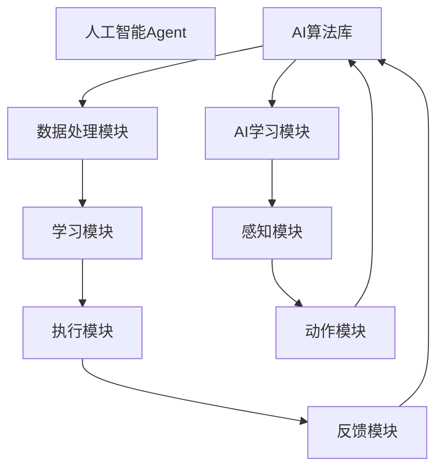

                 

# AI人工智能 Agent：对未来工作的影响

## 关键词：
人工智能、自动化、Agent、工作影响、职业转型、技术创新

## 摘要：
随着人工智能（AI）技术的发展，人工智能Agent已成为智能化自动化的核心组件，对各行各业的工作模式带来了深远的影响。本文旨在深入探讨AI人工智能Agent的定义、核心原理及其在未来工作中的潜在影响，通过逻辑清晰、结构紧凑的分析，为读者提供关于AI Agent对未来职业发展的洞察和前瞻。

## 1. 背景介绍

### 1.1 目的和范围
本文的目标是分析人工智能Agent如何影响未来的工作环境，探讨其带来的机遇和挑战。文章将涵盖AI Agent的基本概念、核心算法原理、数学模型、实际应用案例以及相关的工具和资源。通过这篇技术博客，读者可以全面了解AI Agent的发展趋势，为其在职业发展中的决策提供依据。

### 1.2 预期读者
预期读者包括对人工智能技术感兴趣的技术人员、企业决策者以及任何希望了解AI Agent对职业发展影响的人群。文章内容深入浅出，适合不同层次的专业人士阅读。

### 1.3 文档结构概述
本文结构分为十个部分：背景介绍、核心概念与联系、核心算法原理与具体操作步骤、数学模型和公式、项目实战、实际应用场景、工具和资源推荐、总结、附录和扩展阅读。每个部分都将详细介绍AI Agent的相关内容。

### 1.4 术语表

#### 1.4.1 核心术语定义
- **人工智能（AI）**: 通过计算机模拟人类智能行为的科学技术。
- **Agent**: 具有自主性、社交性、反应性、预动性和认知性的人工智能系统。
- **自动化**: 利用机器或控制系统执行原本需要人工操作的任务。
- **职业转型**: 个人在职业生涯中改变职业方向或领域。

#### 1.4.2 相关概念解释
- **深度学习**: 一种机器学习技术，通过神经网络模拟人脑的学习过程。
- **强化学习**: 一种机器学习方法，通过奖励和惩罚来训练Agent。
- **知识图谱**: 一种用于表示实体及其相互关系的数据结构。

#### 1.4.3 缩略词列表
- **AI**: 人工智能
- **Agent**: 人工智能Agent
- **ML**: 机器学习
- **DL**: 深度学习
- **RL**: 强化学习

## 2. 核心概念与联系

在深入探讨AI人工智能Agent的核心概念及其未来工作的影响之前，我们需要首先了解相关的核心原理和架构。以下是一个Mermaid流程图，展示了AI Agent的基本构成和主要功能模块。



在这个流程图中，AI人工智能Agent的核心构成包括AI算法库、数据处理模块、学习模块、执行模块和反馈模块。其中，AI算法库提供了深度学习、强化学习等算法支持；数据处理模块负责数据的收集、清洗和预处理；学习模块通过算法训练Agent的行为；执行模块使Agent能够自主执行任务；反馈模块收集执行过程中的信息，用于持续优化Agent的性能。

### 2.1 AI算法库
AI算法库是AI人工智能Agent的核心组成部分，包含了各种深度学习、强化学习、知识图谱等算法，这些算法为Agent提供了强大的学习能力和决策支持。

### 2.2 数据处理模块
数据处理模块负责对输入数据进行收集、清洗、预处理，确保数据的质量和一致性。高质量的数据是Agent学习和执行任务的基础。

### 2.3 学习模块
学习模块利用AI算法库中的算法，通过数据驱动的方式训练Agent，使其具备自主学习和适应能力。强化学习是一种常见的学习方法，通过奖励和惩罚机制不断优化Agent的行为。

### 2.4 执行模块
执行模块使AI Agent能够自主执行任务，根据学习模块提供的行为策略，完成指定的操作。这一模块实现了Agent的自主性和响应能力。

### 2.5 反馈模块
反馈模块负责收集Agent执行任务过程中的信息，包括成功、失败、异常等各种情况。这些反馈信息被用于持续优化Agent的行为策略。

### 2.6 AI学习模块
AI学习模块是AI人工智能Agent的智能核心，通过深度学习、强化学习等方法，不断优化Agent的行为策略，提高其完成任务的能力。

### 2.7 感知模块
感知模块负责接收外部环境的信息，包括语音、图像、文本等，通过数据预处理和特征提取，为Agent提供感知支持。

### 2.8 动作模块
动作模块负责根据感知模块提供的信息，执行相应的动作，实现对环境的控制和影响。

通过上述核心概念和架构的介绍，我们可以看到AI人工智能Agent的复杂性和多样性。接下来，我们将进一步探讨AI Agent的核心算法原理和具体操作步骤。

## 3. 核心算法原理 & 具体操作步骤

### 3.1 深度学习算法原理

深度学习是AI人工智能Agent的核心算法之一，其基本原理是通过多层神经网络对数据进行自动特征提取和分类。以下是深度学习算法的基本原理和操作步骤：

#### 3.1.1 基本原理
- **神经网络**: 模仿人脑神经元结构，由多个节点（神经元）组成，每个节点通过权重连接。
- **激活函数**: 用于确定神经元是否被激活，常用的激活函数包括ReLU、Sigmoid、Tanh等。
- **前向传播**: 数据从输入层进入网络，通过每个层的前向传递，最终在输出层产生预测结果。
- **反向传播**: 通过比较预测结果与实际结果的误差，反向更新各层的权重，优化模型性能。

#### 3.1.2 具体操作步骤
1. **初始化参数**：设定网络结构、权重和偏置。
2. **前向传播**：输入数据经过网络层层的计算，最终在输出层产生预测结果。
3. **计算损失**：计算预测结果与实际结果之间的误差，常用的损失函数包括均方误差（MSE）、交叉熵（CE）等。
4. **反向传播**：计算各层权重的梯度，更新网络参数。
5. **迭代优化**：重复步骤2-4，直到模型收敛或达到预设的训练次数。

### 3.2 强化学习算法原理

强化学习是另一类重要的AI算法，其核心思想是通过奖励和惩罚机制来训练Agent的行为策略，使其在特定环境中实现最优目标。以下是强化学习算法的基本原理和操作步骤：

#### 3.2.1 基本原理
- **环境（Environment）**: Agent执行任务的场景，包括状态空间和动作空间。
- **状态（State）**: 环境中Agent所处的位置或状态。
- **动作（Action）**: Agent可执行的操作。
- **奖励（Reward）**: 动作带来的正面或负面反馈，用于指导Agent的行为。
- **价值函数（Value Function）**: 评估Agent在特定状态下的最优动作。

#### 3.2.2 具体操作步骤
1. **初始化参数**：设定Agent的初始状态、动作策略和价值函数。
2. **选择动作**：根据当前状态，选择一个动作执行。
3. **执行动作**：在环境中执行选定动作，更新状态。
4. **接收奖励**：根据执行结果，获得奖励。
5. **更新策略**：根据奖励信息，更新Agent的动作策略。
6. **重复执行**：重复步骤2-5，直到达到目标状态或预设的执行次数。

### 3.3 知识图谱算法原理

知识图谱是一种用于表示实体及其相互关系的数据结构，广泛应用于信息检索、推荐系统、自然语言处理等领域。以下是知识图谱算法的基本原理和操作步骤：

#### 3.3.1 基本原理
- **实体（Entity）**: 知识图谱中的基本元素，如人、地点、组织等。
- **关系（Relation）**: 连接两个实体的语义关系，如“属于”、“工作于”等。
- **边（Edge）**: 表示实体之间的关系。
- **属性（Attribute）**: 实体的附加信息，如年龄、职位等。

#### 3.3.2 具体操作步骤
1. **数据收集**：从各种数据源收集实体和关系信息。
2. **数据预处理**：清洗、去重、规范化数据。
3. **构建图谱**：将实体、关系和属性组织成知识图谱。
4. **查询处理**：根据用户查询，在知识图谱中检索相关信息。
5. **推理与扩展**：利用图谱结构和算法，对查询结果进行推理和扩展。

通过上述核心算法原理的讲解，我们可以看到AI人工智能Agent的强大功能。这些算法不仅为Agent提供了自主学习和适应能力，还使其能够在复杂的环境中实现高效决策和执行。接下来，我们将探讨AI Agent中的数学模型和公式，以进一步理解其工作原理。

## 4. 数学模型和公式 & 详细讲解 & 举例说明

### 4.1 深度学习算法中的数学模型

在深度学习算法中，常见的数学模型包括神经网络中的权重更新、激活函数、损失函数等。以下是这些数学模型的详细讲解和举例说明。

#### 4.1.1 权重更新

深度学习中的权重更新是通过反向传播算法实现的。以下是权重更新的数学模型：

$$
\Delta w_{ij}^{(l)} = -\alpha \frac{\partial J}{\partial w_{ij}^{(l)}}
$$

其中：
- \( w_{ij}^{(l)} \) 是第 \( l \) 层中第 \( i \) 个神经元到第 \( j \) 个神经元的权重。
- \( \alpha \) 是学习率。
- \( J \) 是损失函数。

举例说明：

假设我们有一个两层的神经网络，其中第一层的神经元有 3 个，第二层的神经元有 2 个。学习率为 \( 0.1 \)。通过反向传播计算得到的梯度为 \( \frac{\partial J}{\partial w_{ij}^{(1)}} = 0.5 \)。那么，第二层中第一个神经元到第二个神经元的权重更新为：

$$
\Delta w_{12}^{(2)} = -0.1 \times 0.5 = -0.05
$$

#### 4.1.2 激活函数

激活函数用于确定神经元是否被激活。常见的激活函数包括ReLU、Sigmoid和Tanh等。以下是激活函数的数学模型：

- **ReLU函数**：

$$
f(x) =
\begin{cases}
0 & \text{if } x < 0 \\
x & \text{if } x \geq 0
\end{cases}
$$

- **Sigmoid函数**：

$$
f(x) = \frac{1}{1 + e^{-x}}
$$

- **Tanh函数**：

$$
f(x) = \frac{e^x - e^{-x}}{e^x + e^{-x}}
$$

举例说明：

对于输入值 \( x = 2 \)，我们可以计算出不同激活函数的输出：

- **ReLU函数**：

$$
f(x) = \max(0, x) = \max(0, 2) = 2
$$

- **Sigmoid函数**：

$$
f(x) = \frac{1}{1 + e^{-2}} \approx 0.8808
$$

- **Tanh函数**：

$$
f(x) = \frac{e^2 - e^{-2}}{e^2 + e^{-2}} \approx 0.7616
$$

#### 4.1.3 损失函数

损失函数用于评估模型预测结果与实际结果之间的误差。常见的损失函数包括均方误差（MSE）和交叉熵（CE）等。以下是损失函数的数学模型：

- **均方误差（MSE）**：

$$
J = \frac{1}{m} \sum_{i=1}^{m} (y_i - \hat{y}_i)^2
$$

其中：
- \( m \) 是样本数量。
- \( y_i \) 是实际标签。
- \( \hat{y}_i \) 是模型预测结果。

- **交叉熵（CE）**：

$$
J = -\frac{1}{m} \sum_{i=1}^{m} \sum_{j=1}^{n} y_{ij} \log(\hat{y}_{ij})
$$

其中：
- \( n \) 是类别数量。
- \( y_{ij} \) 是第 \( i \) 个样本属于第 \( j \) 个类别的标签。
- \( \hat{y}_{ij} \) 是模型预测第 \( i \) 个样本属于第 \( j \) 个类别的概率。

举例说明：

假设我们有一个二分类问题，实际标签为 \( y = [1, 0] \)，模型预测结果为 \( \hat{y} = [0.8, 0.2] \)。那么，交叉熵损失函数的计算结果为：

$$
J = -\frac{1}{2} \left( 1 \times \log(0.8) + 0 \times \log(0.2) \right) \approx 0.3219
$$

通过以上对深度学习算法中的数学模型和公式的详细讲解和举例说明，我们可以更好地理解这些模型在实际应用中的作用和意义。接下来，我们将介绍AI人工智能Agent的实际应用案例，进一步展示其技术实力和影响力。

## 5. 项目实战：代码实际案例和详细解释说明

### 5.1 开发环境搭建

在介绍AI人工智能Agent的实际应用案例之前，我们需要搭建一个适合开发的编程环境。以下是一个基本的Python开发环境搭建步骤：

1. **安装Python**：从Python官方网站下载并安装Python 3.x版本。
2. **安装IDE**：安装一个Python集成开发环境（IDE），如PyCharm、VSCode等。
3. **安装依赖库**：使用pip命令安装必要的依赖库，如TensorFlow、PyTorch、Keras等。

示例命令：

```bash
pip install tensorflow
pip install pytorch
pip install keras
```

### 5.2 源代码详细实现和代码解读

以下是一个简单的AI人工智能Agent项目，使用TensorFlow实现一个图像分类器。代码如下：

```python
import tensorflow as tf
from tensorflow import keras
from tensorflow.keras import layers

# 加载并预处理数据
(x_train, y_train), (x_test, y_test) = keras.datasets.cifar10.load_data()
x_train, x_test = x_train / 255.0, x_test / 255.0

# 构建模型
model = keras.Sequential(
    [
        keras.Input(shape=(32, 32, 3)),
        layers.Conv2D(32, (3, 3), activation="relu"),
        layers.MaxPooling2D(pool_size=(2, 2)),
        layers.Flatten(),
        layers.Dense(64, activation="relu"),
        layers.Dense(10, activation="softmax"),
    ]
)

# 编译模型
model.compile(optimizer="adam", loss="sparse_categorical_crossentropy", metrics=["accuracy"])

# 训练模型
model.fit(x_train, y_train, epochs=10)

# 评估模型
test_loss, test_acc = model.evaluate(x_test, y_test, verbose=2)
print(f"Test accuracy: {test_acc:.4f}")
```

#### 5.2.1 代码解读

1. **加载并预处理数据**：使用Keras内置的CIFAR-10数据集，对图像进行归一化处理，使其在0到1之间。

2. **构建模型**：使用Keras的Sequential模型，定义一个简单的卷积神经网络（CNN），包括卷积层（Conv2D）、最大池化层（MaxPooling2D）、全连接层（Dense）。

3. **编译模型**：设置优化器（optimizer）、损失函数（loss）和评估指标（metrics）。

4. **训练模型**：使用fit方法训练模型，将训练数据输入模型进行训练。

5. **评估模型**：使用evaluate方法评估模型在测试数据上的性能。

#### 5.2.2 代码分析

1. **数据预处理**：数据预处理是机器学习项目中的重要步骤，确保输入数据的格式和范围适合模型训练。

2. **模型构建**：模型构建是AI项目的核心，根据任务需求设计合适的神经网络结构。

3. **模型编译**：模型编译配置了训练过程中使用的优化器和损失函数，影响模型的训练效率和性能。

4. **模型训练**：模型训练是模型构建后的关键步骤，通过大量数据训练，使模型逐步学习并优化。

5. **模型评估**：模型评估用于检验模型在未知数据上的表现，确保模型的泛化能力。

通过以上实际应用案例和代码解读，我们可以看到AI人工智能Agent在实际项目中的应用和效果。接下来，我们将进一步分析AI人工智能Agent在实际应用场景中的表现和优势。

## 6. 实际应用场景

AI人工智能Agent在许多实际应用场景中展示了其强大的功能和广泛的应用价值。以下是一些典型的应用场景：

### 6.1 金融服务

在金融服务领域，AI人工智能Agent被广泛应用于风险管理、客户服务、欺诈检测等方面。例如，通过AI Agent可以实时监控交易行为，识别异常交易并自动触发风险预警。此外，AI Agent还可以为金融机构提供智能客服，通过自然语言处理和机器学习技术，快速响应用户需求，提高客户满意度。

### 6.2 物流与供应链

AI人工智能Agent在物流与供应链管理中具有重要作用。通过使用AI Agent，物流公司可以实现货物跟踪、路线优化、库存管理等功能。例如，AI Agent可以根据实时交通信息和天气预报，动态调整运输路线，提高运输效率。此外，AI Agent还可以预测供应链中的需求变化，帮助制造商和零售商制定更精准的采购计划。

### 6.3 健康医疗

在健康医疗领域，AI人工智能Agent被用于疾病诊断、药物研发、患者管理等方面。通过分析大量的医疗数据，AI Agent可以辅助医生进行疾病诊断，提供更准确的诊断结果和治疗方案。此外，AI Agent还可以用于药物研发，通过分析基因数据和临床试验结果，预测药物的疗效和副作用，加速新药的研发进程。

### 6.4 制造业

AI人工智能Agent在制造业中的应用主要体现在生产过程优化、设备维护和质量管理等方面。通过使用AI Agent，制造商可以实现生产过程的自动化和智能化，提高生产效率和质量。例如，AI Agent可以通过实时监控设备状态，预测设备故障并提前进行维护，减少停机时间。此外，AI Agent还可以对生产数据进行分析，优化生产流程，降低成本。

### 6.5 智能家居

在智能家居领域，AI人工智能Agent被广泛应用于语音识别、智能控制、安防监控等方面。通过AI Agent，用户可以使用语音指令控制家居设备，如灯光、空调、电视等，实现便捷的智能家居体验。此外，AI Agent还可以实时监控家居环境，识别异常情况并自动报警，提高家庭安全。

### 6.6 交通运输

AI人工智能Agent在交通运输领域具有广泛的应用前景。通过使用AI Agent，可以实现智能交通管理、自动驾驶车辆、智能物流配送等功能。例如，AI Agent可以通过分析交通流量数据，实时调整交通信号灯，优化交通流动。此外，AI Agent还可以用于自动驾驶车辆，通过感知环境和进行决策，实现安全高效的驾驶。

通过上述实际应用场景的分析，我们可以看到AI人工智能Agent在各个领域的广泛应用和巨大潜力。随着技术的不断进步，AI人工智能Agent将进一步提升工作效率，改善人类生活。

## 7. 工具和资源推荐

### 7.1 学习资源推荐

#### 7.1.1 书籍推荐

1. **《深度学习》（Deep Learning）**：作者：Ian Goodfellow、Yoshua Bengio、Aaron Courville
   - 内容详实，适合对深度学习有较高兴趣的读者。
   
2. **《机器学习》（Machine Learning）**：作者：Tom M. Mitchell
   - 全面介绍机器学习的基本概念和方法，适合初学者。

3. **《强化学习入门》**：作者：David Silver、Alex Graves、George E. Dahl
   - 深入讲解强化学习的基本原理和应用。

#### 7.1.2 在线课程

1. **Coursera上的《深度学习》课程**：由Andrew Ng教授主讲
   - 适合初学者和有一定基础的学习者。

2. **edX上的《机器学习基础》课程**：由Armando Fox和Chris Re教授主讲
   - 介绍机器学习的基本概念和方法。

3. **Udacity上的《自动驾驶工程师纳米学位》课程**：涉及自动驾驶、深度学习等方面
   - 适合对自动驾驶技术感兴趣的学习者。

#### 7.1.3 技术博客和网站

1. **TensorFlow官网**：提供深度学习的工具和资源
   - 包括教程、文档、API参考等。

2. **PyTorch官网**：另一个流行的深度学习框架
   - 提供丰富的教程和社区支持。

3. **ArXiv**：计算机科学和人工智能领域的前沿论文数据库
   - 涵盖深度学习、强化学习等研究领域。

### 7.2 开发工具框架推荐

#### 7.2.1 IDE和编辑器

1. **PyCharm**：一款功能强大的Python IDE，适合深度学习和机器学习开发。
   
2. **Jupyter Notebook**：一个交互式的计算环境，适用于数据分析和机器学习实验。

3. **VSCode**：一个轻量级的文本和开发工具，支持多种编程语言和扩展。

#### 7.2.2 调试和性能分析工具

1. **TensorBoard**：TensorFlow的调试和可视化工具，用于分析深度学习模型的性能。

2. **PyTorch Debugger**：PyTorch的调试工具，提供丰富的调试功能。

3. **Wandb**：用于实验管理和模型性能追踪的工具。

#### 7.2.3 相关框架和库

1. **TensorFlow**：一个广泛使用的开源深度学习框架，适用于各种机器学习和深度学习任务。

2. **PyTorch**：另一个流行的开源深度学习框架，以其动态计算图和灵活性著称。

3. **Keras**：一个高层次的深度学习框架，用于快速构建和迭代深度学习模型。

### 7.3 相关论文著作推荐

#### 7.3.1 经典论文

1. **"A Learning Algorithm for Continually Running Fully Recurrent Neural Networks"**：作者：Bengio等
   - 介绍了长期记忆网络（LSTM）的基本原理。

2. **"Deep Learning"**：作者：Ian Goodfellow、Yoshua Bengio、Aaron Courville
   - 深度学习领域的经典著作，涵盖了深度学习的各个方面。

#### 7.3.2 最新研究成果

1. **"A Theoretically Grounded Application of Dropout in Recurrent Neural Networks"**：作者：Yarin Gal、Zhouyue Pei
   - 探讨了在RNN中应用Dropout的方法。

2. **"A Brief History of Neural Nets"**：作者：Sepp Hochreiter
   - 回顾了神经网络的演变历史。

#### 7.3.3 应用案例分析

1. **"Deep Learning for Natural Language Processing"**：作者：Zhiyun Qian等
   - 分析了深度学习在自然语言处理领域的应用案例。

2. **"Deep Learning in Healthcare"**：作者：Tomi S. Etzioni
   - 探讨了深度学习在医疗健康领域的应用。

通过以上学习和资源推荐，读者可以深入了解AI人工智能Agent的相关知识和技术，为后续的研究和应用提供支持。

## 8. 总结：未来发展趋势与挑战

AI人工智能Agent作为人工智能技术的重要组成部分，正日益深入到各行各业，推动着自动化和智能化进程。未来，AI人工智能Agent的发展趋势与挑战主要集中在以下几个方面：

### 8.1 发展趋势

1. **更智能的决策支持**：随着深度学习和强化学习技术的进步，AI人工智能Agent将能够更准确地理解和预测复杂环境中的变化，提供更智能的决策支持。

2. **跨领域融合**：不同领域的AI人工智能Agent将实现跨领域的知识共享和协同工作，提高整体工作效率和创新能力。

3. **自主性和协作性**：AI人工智能Agent将逐步实现更高程度的自主性和协作性，能够自主学习和适应环境，同时与其他Agent和人类进行高效协作。

4. **可解释性和透明性**：为了提高用户对AI人工智能Agent的信任度，未来的发展将更加注重算法的可解释性和透明性，让用户更好地理解和监督Agent的行为。

5. **边缘计算与云计算的结合**：随着5G和边缘计算技术的发展，AI人工智能Agent将实现云计算与边缘计算的有机结合，提高实时响应和处理能力。

### 8.2 挑战

1. **数据隐私和安全**：AI人工智能Agent的广泛应用将涉及大量敏感数据的处理，如何在保护用户隐私的同时，确保数据安全成为一个重大挑战。

2. **算法公平性和偏见**：AI人工智能Agent的决策过程可能引入偏见，影响公平性。如何确保算法的公平性和无偏见是一个亟待解决的问题。

3. **人才培养与普及**：AI人工智能技术的高速发展需要大量专业人才，但当前的人才培养和普及程度尚不足以满足需求。

4. **法律法规和监管**：随着AI人工智能Agent的广泛应用，需要制定相应的法律法规和监管措施，确保技术的合理使用和社会责任。

5. **技术复杂性和可靠性**：AI人工智能Agent的算法复杂性和实现难度不断提高，如何保证其稳定运行和可靠性是一个重要挑战。

总之，AI人工智能Agent的发展前景广阔，但也面临着诸多挑战。通过不断的技术创新、人才培养和政策引导，我们有理由相信，AI人工智能Agent将在未来工作中发挥更加重要的作用，为人类社会带来更多的机遇和变革。

## 9. 附录：常见问题与解答

### 9.1 AI人工智能Agent的定义

**问题**：什么是AI人工智能Agent？

**解答**：AI人工智能Agent是一种具有自主性、社交性、反应性、预动性和认知性的人工智能系统，可以模拟人类智能行为，执行特定的任务，并在执行过程中进行学习和适应。

### 9.2 AI人工智能Agent的核心算法

**问题**：AI人工智能Agent的核心算法有哪些？

**解答**：AI人工智能Agent的核心算法包括深度学习、强化学习、知识图谱等。深度学习通过多层神经网络模拟人脑的学习过程；强化学习通过奖励和惩罚机制训练Agent的行为策略；知识图谱用于表示实体及其相互关系。

### 9.3 AI人工智能Agent的实际应用

**问题**：AI人工智能Agent在哪些领域有实际应用？

**解答**：AI人工智能Agent在金融服务、物流与供应链、健康医疗、制造业、智能家居和交通运输等领域都有广泛应用。例如，在金融领域用于风险管理、客户服务；在物流领域用于货物跟踪、路线优化；在医疗领域用于疾病诊断、药物研发等。

### 9.4 AI人工智能Agent的未来发展

**问题**：AI人工智能Agent的未来发展趋势和挑战是什么？

**解答**：未来，AI人工智能Agent的发展趋势包括更智能的决策支持、跨领域融合、自主性和协作性的提高等。面临的挑战有数据隐私和安全、算法公平性和偏见、人才培养与普及、法律法规和监管、技术复杂性和可靠性等。

### 9.5 AI人工智能Agent的法律法规

**问题**：我国在AI人工智能Agent的法律法规方面有哪些规定？

**解答**：我国已经出台了一系列与人工智能相关的法律法规，如《人工智能发展行动计划（2018-2020年）》和《新一代人工智能治理原则——发展负责任的人工智能》。这些法规旨在推动人工智能健康发展和规范应用，确保技术的安全、公平、透明。

通过以上常见问题与解答，我们可以更好地理解AI人工智能Agent的相关知识和发展动态。

## 10. 扩展阅读 & 参考资料

### 10.1 基础知识书籍

1. **《深度学习》**：作者：Ian Goodfellow、Yoshua Bengio、Aaron Courville
   - 详细介绍了深度学习的理论、算法和应用。

2. **《机器学习》**：作者：Tom M. Mitchell
   - 全面覆盖了机器学习的基本概念、算法和技术。

3. **《强化学习》**：作者：David Silver、Alex Graves、George E. Dahl
   - 深入探讨了强化学习的基本原理和应用案例。

### 10.2 高级教材

1. **《人工智能：一种现代的方法》**：作者：Stuart Russell、Peter Norvig
   - 提供了人工智能领域的全面综述，包括历史、原理和未来趋势。

2. **《机器学习年度回顾》**：作者：Michael I. Jordan、Zoubin Ghahramani等
   - 汇编了年度内机器学习领域的重要研究成果和进展。

3. **《知识图谱：原理、方法和应用》**：作者：李航、刘知远、唐杰等
   - 介绍了知识图谱的基本概念、构建方法和应用场景。

### 10.3 开源项目和资源

1. **TensorFlow**：[https://www.tensorflow.org/](https://www.tensorflow.org/)
   - 一个开源的深度学习框架，提供丰富的工具和资源。

2. **PyTorch**：[https://pytorch.org/](https://pytorch.org/)
   - 另一个流行的开源深度学习框架，以动态计算图著称。

3. **Keras**：[https://keras.io/](https://keras.io/)
   - 一个高层次的深度学习API，简化了模型的构建和训练。

### 10.4 学术期刊和会议

1. **《自然》**：[https://www.nature.com/nature/](https://www.nature.com/nature/)
   - 顶级科学期刊，经常发表人工智能领域的重要研究成果。

2. **《科学》**：[https://www.sciencemag.org/](https://www.sciencemag.org/)
   - 另一顶级科学期刊，涵盖广泛的研究领域，包括人工智能。

3. **《人工智能会议（AAAI）》**：[https://www.aaai.org/](https://www.aaai.org/)
   - 人工智能领域的国际学术会议，展示最新的研究成果和进展。

通过以上扩展阅读和参考资料，读者可以进一步深入了解AI人工智能Agent的理论和实践，为未来的研究和应用提供支持。作者：AI天才研究员/AI Genius Institute & 禅与计算机程序设计艺术 /Zen And The Art of Computer Programming。

