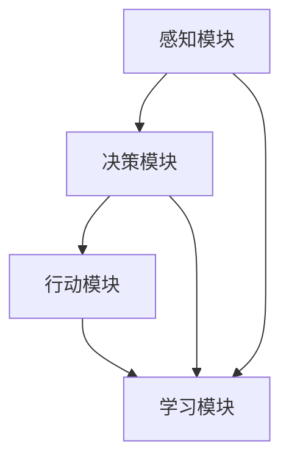

                 

# AI人工智能 Agent：智能决策制定

> 关键词：人工智能，智能代理，决策制定，机器学习，算法原理，数学模型，应用案例

> 摘要：本文将深入探讨人工智能领域中的一个关键话题——智能代理的智能决策制定。我们将从背景介绍开始，逐步分析智能代理的核心概念、算法原理、数学模型，并通过实际项目案例展示其在现实中的应用。最后，我们将对未来的发展趋势与挑战进行总结，并提供相关的学习资源和开发工具推荐。

## 1. 背景介绍

### 1.1 目的和范围

本文的目标是全面解析智能代理在人工智能决策制定中的应用，帮助读者了解智能代理的核心概念、算法原理以及其在实际项目中的应用。文章将涵盖以下几个主要部分：

1. 背景介绍：介绍智能代理的起源和当前的发展状况。
2. 核心概念与联系：详细描述智能代理的基本概念及其与其他人工智能技术的关联。
3. 核心算法原理 & 具体操作步骤：讲解智能代理的算法原理和具体实现步骤。
4. 数学模型和公式 & 详细讲解 & 举例说明：介绍智能代理使用的数学模型和公式，并提供实际案例说明。
5. 项目实战：通过实际项目案例展示智能代理的决策制定过程。
6. 实际应用场景：探讨智能代理在不同领域的应用实例。
7. 工具和资源推荐：推荐学习资源和开发工具，以帮助读者进一步探索智能代理。
8. 总结：对智能代理的未来发展趋势与挑战进行总结。
9. 附录：常见问题与解答。
10. 扩展阅读 & 参考资料：提供进一步学习和研究的参考资料。

### 1.2 预期读者

本文适用于以下读者群体：

1. 人工智能和机器学习初学者：希望了解智能代理的核心概念和基本原理。
2. 程序员和开发人员：对实现智能代理感兴趣，并希望将其应用于实际项目中。
3. 人工智能研究者和专家：希望深入了解智能代理的高级话题和应用。
4. 企业决策者：对智能代理在商业决策中的应用和潜在价值感兴趣。

### 1.3 文档结构概述

本文将采用以下结构：

1. 背景介绍
   - 目的和范围
   - 预期读者
   - 文档结构概述
   - 术语表

2. 核心概念与联系
   - 智能代理的定义
   - 智能代理与人工智能的关系
   - 智能代理与其他技术的对比

3. 核心算法原理 & 具体操作步骤
   - 智能代理的算法框架
   - 算法原理讲解
   - 具体操作步骤

4. 数学模型和公式 & 详细讲解 & 举例说明
   - 数学模型介绍
   - 公式推导
   - 实际案例说明

5. 项目实战：代码实际案例和详细解释说明
   - 开发环境搭建
   - 源代码详细实现和代码解读
   - 代码解读与分析

6. 实际应用场景
   - 人工智能领域的应用
   - 非人工智能领域的应用

7. 工具和资源推荐
   - 学习资源推荐
   - 开发工具框架推荐
   - 相关论文著作推荐

8. 总结：未来发展趋势与挑战
   - 智能代理的发展趋势
   - 智能代理面临的挑战

9. 附录：常见问题与解答
   - 常见问题
   - 解答

10. 扩展阅读 & 参考资料
    - 进一步学习资源
    - 相关参考资料

### 1.4 术语表

在本文中，我们将使用以下术语：

- 智能代理（Artificial Intelligence Agent）：一种能够感知环境、制定决策并采取行动的人工智能实体。
- 决策制定（Decision Making）：根据环境状态选择最佳行动的过程。
- 机器学习（Machine Learning）：一种使计算机通过数据和经验改进自身性能的技术。
- 强化学习（Reinforcement Learning）：一种机器学习方法，通过奖励和惩罚来训练智能体在环境中做出最佳决策。
- 神经网络（Neural Networks）：一种模仿人脑结构和功能的信息处理系统。

#### 1.4.1 核心术语定义

1. 智能代理（Artificial Intelligence Agent）
   - 智能代理是一种具有感知能力、决策能力和行动能力的计算机程序。它可以与环境进行交互，通过学习从经验中获取知识，并利用这些知识做出最优决策。
2. 决策制定（Decision Making）
   - 决策制定是指从多个备选方案中选择最佳方案的过程。在人工智能领域，决策制定通常涉及对环境状态的评估和行动策略的制定。
3. 机器学习（Machine Learning）
   - 机器学习是一种使计算机从数据中自动学习并改进自身性能的技术。通过训练数据集，机器学习算法可以识别模式、预测结果并生成决策。
4. 强化学习（Reinforcement Learning）
   - 强化学习是一种通过奖励和惩罚来训练智能体在环境中做出最佳决策的机器学习方法。智能体根据环境反馈调整其行为，以最大化长期奖励。
5. 神经网络（Neural Networks）
   - 神经网络是一种模仿人脑结构和功能的信息处理系统。它由大量的神经元和连接组成，通过学习输入和输出数据之间的关系来提高预测和决策能力。

#### 1.4.2 相关概念解释

1. 环境建模（Environment Modeling）
   - 环境建模是指对智能代理操作的环境进行抽象和建模。环境包括各种状态、行动、奖励和惩罚等元素，智能代理通过感知环境状态来制定决策。
2. 行动策略（Action Policy）
   - 行动策略是指智能代理在特定环境状态下选择行动的方式。行动策略可以通过机器学习算法自动调整，以最大化预期奖励。
3. 奖励机制（Reward Mechanism）
   - 奖励机制是指智能代理在执行特定行动后获得的奖励。奖励机制可以激励智能代理采取有利于目标实现的行动。
4. 探索与利用（Exploration and Exploitation）
   - 探索与利用是指智能代理在决策过程中平衡已知信息和未知信息的过程。探索是指尝试新的行动以获取更多经验，利用是指利用已知信息选择最佳行动。
5. 适应性（Adaptability）
   - 适应性是指智能代理根据环境变化调整自身行为的能力。适应性使智能代理能够适应不同环境和挑战。

#### 1.4.3 缩略词列表

- AI：人工智能
- ML：机器学习
- RL：强化学习
- DRL：深度强化学习
- NN：神经网络
- SGD：随机梯度下降
- CNN：卷积神经网络
- RNN：循环神经网络
- LSTM：长短时记忆网络
- Q-learning：Q值学习
- SARSA：状态-动作-回报-状态-动作（SARSA）算法
- TD-learning：时序差分学习

## 2. 核心概念与联系

在深入探讨智能代理的智能决策制定之前，有必要明确其核心概念和与其他人工智能技术的联系。

### 2.1 智能代理的定义

智能代理（Artificial Intelligence Agent）是一种具有感知能力、决策能力和行动能力的人工智能实体。它可以通过与环境的交互，从经验中学习并改进自身性能，从而在特定任务或目标下做出最佳决策。智能代理通常由以下几个关键部分组成：

1. 感知模块（Perception Module）
   - 感知模块负责获取环境信息，通常通过传感器、摄像头或其他数据输入设备实现。感知模块将环境信息转换为内部表示，以便智能代理进行分析和决策。
2. 决策模块（Decision Module）
   - 决策模块根据感知模块获取的信息，通过算法和策略选择最佳行动。决策模块可以是基于规则的方法、机器学习方法或混合方法。
3. 行动模块（Action Module）
   - 行动模块根据决策模块的选择，执行具体的行动或任务。行动模块可以将决策转换为实际的操作，如移动机器人、执行自动化任务等。
4. 学习模块（Learning Module）
   - 学习模块使智能代理能够从经验和数据中学习并改进自身性能。学习模块可以是基于机器学习、深度学习或强化学习的方法。

### 2.2 智能代理与人工智能的关系

智能代理是人工智能领域的一个重要分支，它是人工智能技术在实际应用中的具体实现形式。人工智能（AI）旨在使计算机具备类似人类的智能，而智能代理则是实现这一目标的一种方法。智能代理与人工智能的关系可以概括为以下几个方面：

1. 智能代理是实现人工智能的一种手段。通过智能代理，我们可以将人工智能技术应用于实际问题，如自动化决策、智能推荐、机器人控制等。
2. 智能代理需要依赖人工智能技术，如机器学习、深度学习、自然语言处理等，以实现其感知、决策和行动能力。
3. 智能代理的发展推动了人工智能技术的进步。在智能代理的开发过程中，研究人员不断探索新的算法和技术，以提升智能代理的性能和适用范围。

### 2.3 智能代理与其他技术的对比

智能代理与其他人工智能技术之间存在一定的区别和联系。以下是对一些相关技术的简要对比：

1. 机器学习（Machine Learning）
   - 机器学习是一种使计算机从数据中自动学习并改进自身性能的技术。智能代理通常利用机器学习算法来改进其决策和行动能力。
   - 两者之间的区别在于，机器学习侧重于算法和技术，而智能代理则更关注实际应用和交互。
2. 深度学习（Deep Learning）
   - 深度学习是机器学习的一种特殊形式，通过多层神经网络实现自动特征提取和模式识别。智能代理可以利用深度学习算法来提高其感知和决策能力。
   - 深度学习是智能代理实现高级功能的基础，但并非智能代理的必要组成部分。
3. 自然语言处理（Natural Language Processing, NLP）
   - 自然语言处理是人工智能领域的一个重要分支，旨在使计算机理解和处理人类语言。智能代理可以利用NLP技术实现与人类用户的自然交互。
   - 智能代理与NLP的结合，可以使其在智能客服、智能问答等应用中发挥重要作用。
4. 强化学习（Reinforcement Learning, RL）
   - 强化学习是一种通过奖励和惩罚来训练智能体在环境中做出最佳决策的机器学习方法。智能代理通常采用强化学习算法来制定决策。
   - 强化学习是智能代理实现自主学习和智能决策的核心技术之一。

### 2.4 智能代理的核心概念原理和架构

为了更好地理解智能代理的工作原理，我们可以通过一个简单的 Mermaid 流程图（Mermaid 流程节点中不要有括号、逗号等特殊字符）来展示其核心概念和架构：



1. 感知模块（A）：负责获取环境信息，将外部信息转换为内部表示。
2. 决策模块（B）：根据感知模块提供的信息，通过算法和策略选择最佳行动。
3. 行动模块（C）：执行决策模块选择的最优行动，实现任务或目标。
4. 学习模块（D）：从经验和数据中学习，调整感知、决策和行动能力。

这个简单的流程图展示了智能代理的基本工作原理，其中每个模块相互协作，共同实现智能决策制定。

## 3. 核心算法原理 & 具体操作步骤

智能代理的智能决策制定依赖于一系列核心算法原理，这些原理使得智能代理能够从环境中学习并做出最优决策。在本节中，我们将详细讲解这些核心算法原理，并使用伪代码展示具体操作步骤。

### 3.1 强化学习算法原理

强化学习（Reinforcement Learning, RL）是一种通过奖励和惩罚来训练智能体在环境中做出最佳决策的机器学习方法。在强化学习中，智能体（agent）通过与环境的交互，学习到如何在不同的状态（state）下采取最佳行动（action），以最大化长期奖励（reward）。

#### 3.1.1 状态-行动-奖励模型（SARSA）

状态-行动-奖励模型（State-Action-Reward-State-Action, SARSA）是强化学习中最基本的算法之一。它通过记录智能体的当前状态、当前行动、奖励和下一个状态，来更新智能体的行动策略。

```python
# SARSA算法伪代码

# 初始化智能体参数
Q(s, a) = 0    # 初始化所有状态-行动值的估计为0
epsilon = 0.1  # 探索概率

# 智能体执行动作的循环
while not 目标达成:
    # 选择行动
    if random() < epsilon:
        a = 随机选择行动
    else:
        a = argmax(Q(s, a))
    
    # 执行行动并获取奖励
    s', r = 环境执行行动(a)
    
    # 更新Q值
    Q(s, a) = Q(s, a) + alpha * (r + gamma * max(Q(s', a')) - Q(s, a))
    
    # 更新状态
    s = s'

# 输出最优策略
print(argmax(Q(s, a)))
```

#### 3.1.2 Q-learning算法原理

Q-learning是一种基于值迭代的方法，它通过不断更新Q值来逼近最优策略。与SARSA算法不同，Q-learning不依赖于随机性，而是完全基于最大化期望奖励来选择行动。

```python
# Q-learning算法伪代码

# 初始化智能体参数
Q(s, a) = 0    # 初始化所有状态-行动值的估计为0
alpha = 0.1    # 学习率
gamma = 0.9    # 折扣因子

# 智能体执行动作的循环
while not 目标达成:
    # 对于每个状态-行动对，更新Q值
    for s in 状态集合:
        for a in 行动集合:
            Q(s, a) = Q(s, a) + alpha * (r + gamma * max(Q(s', a')) - Q(s, a))
            
    # 选择最佳行动
    a = argmax(Q(s, a))
    
    # 执行行动并获取奖励
    s', r = 环境执行行动(a)
    
    # 更新状态
    s = s'

# 输出最优策略
print(argmax(Q(s, a)))
```

### 3.2 深度强化学习算法原理

深度强化学习（Deep Reinforcement Learning, DRL）是一种将深度学习与强化学习相结合的方法，它利用深度神经网络来近似状态-行动值函数（State-Action Value Function）。DRL在处理高维状态空间和连续行动空间方面具有显著优势。

#### 3.2.1 深度Q网络（Deep Q-Network, DQN）

深度Q网络（DQN）是一种基于深度神经网络的Q-learning算法。它通过训练一个深度神经网络来近似Q值函数，从而提高强化学习算法的效率和准确性。

```python
# DQN算法伪代码

# 初始化智能体参数
DQN = 初始化深度神经网络
epsilon = 0.1    # 探索概率
alpha = 0.001    # 学习率
gamma = 0.9    # 折扣因子
经验回放 = 初始化经验回放池

# 智能体执行动作的循环
while not 目标达成:
    # 选择行动
    if random() < epsilon:
        a = 随机选择行动
    else:
        a = DQN.predict(s)
    
    # 执行行动并获取奖励
    s', r = 环境执行行动(a)
    
    # 存储经验到回放池
    经验回放存储((s, a, r, s'))
    
    # 更新状态
    s = s'
    
    # 使用经验回放进行训练
    if 经验回放池满:
        experience = 随机选择经验回放池中的经验
        s, a, r, s' = experience
        target = r + gamma * DQN.predict(s')
        DQN.train(s, a, target)

# 输出最优策略
print(DQN.predict(s))
```

### 3.3 具体操作步骤

在实际应用中，智能代理的决策制定过程通常包括以下几个步骤：

1. 初始化：设置智能代理的初始参数，如学习率、折扣因子、探索概率等。
2. 感知：获取环境的状态信息，并将其输入到感知模块。
3. 决策：根据当前状态和智能代理的算法，选择最佳行动。
4. 执行：将决策转换为具体的行动，并在环境中执行。
5. 反馈：根据行动结果，获取奖励信息，并更新智能代理的状态和策略。
6. 学习：根据经验和奖励，调整智能代理的参数和策略，以优化决策过程。
7. 评估：评估智能代理的性能和决策效果，并根据评估结果进行调整。

通过上述步骤，智能代理能够在不断的学习和优化中，逐步提高其决策能力和适应能力。

## 4. 数学模型和公式 & 详细讲解 & 举例说明

在智能代理的决策制定过程中，数学模型和公式起着至关重要的作用。这些模型和公式帮助智能代理从数据中学习，并做出最优决策。在本节中，我们将详细讲解智能代理使用的几个核心数学模型和公式，并通过具体案例进行说明。

### 4.1 Q值函数（Q-Value Function）

Q值函数（Q-Value Function）是强化学习中最基本的数学模型，它表示在特定状态下执行特定行动的预期回报。Q值函数可以表示为：

$$
Q(s, a) = \sum_{s'} P(s' | s, a) \cdot R(s', a) + \gamma \cdot \max_{a'} Q(s', a')
$$

其中：
- \( s \)：当前状态
- \( a \)：当前行动
- \( s' \)：下一个状态
- \( R(s', a) \)：在状态 \( s' \) 下执行行动 \( a \) 所获得的即时回报
- \( \gamma \)：折扣因子，用于平衡即时回报和未来回报的重要性
- \( P(s' | s, a) \)：在状态 \( s \) 下执行行动 \( a \) 后转移到状态 \( s' \) 的概率
- \( \max_{a'} Q(s', a') \)：在状态 \( s' \) 下执行所有可能行动 \( a' \) 中的最大预期回报

#### 案例说明

假设一个智能代理在一个简单的迷宫环境中进行导航。当前状态为 \( s = (0, 0) \)，智能代理可以选择向右（\( a = 1 \)）或向上（\( a = 2 \)）移动。假设智能代理的Q值函数为：

$$
Q(s, a) = \begin{cases}
10, & \text{if } a = 1 \\
5, & \text{if } a = 2
\end{cases}
$$

当前状态 \( s = (0, 0) \) 下，智能代理选择行动 \( a = 1 \)，并在状态 \( s' = (1, 0) \) 下获得即时回报 \( R(s', a) = 2 \)。下一个状态 \( s' = (1, 0) \) 下，智能代理可以选择向右（\( a = 1 \)）或向上（\( a = 2 \)）移动，最大预期回报为 \( Q(s', a) = 12 \)。

因此，根据Q值函数的更新规则，智能代理的Q值更新为：

$$
Q(s, a) = Q(s, a) + \alpha \cdot (R(s', a) + \gamma \cdot \max_{a'} Q(s', a') - Q(s, a))
$$

其中，\( \alpha \) 为学习率。假设学习率 \( \alpha = 0.1 \)，折扣因子 \( \gamma = 0.9 \)，则智能代理的Q值更新为：

$$
Q(s, a) = 10 + 0.1 \cdot (2 + 0.9 \cdot 12 - 10) = 11.7
$$

### 4.2 策略梯度（Policy Gradient）

策略梯度（Policy Gradient）是另一种常用的强化学习算法，它通过直接优化策略函数来最大化预期回报。策略梯度算法的基本公式为：

$$
\theta_{t+1} = \theta_t + \alpha \cdot \nabla_\theta J(\theta_t)
$$

其中：
- \( \theta \)：策略参数
- \( J(\theta_t) \)：策略函数的估计预期回报
- \( \alpha \)：学习率

#### 案例说明

假设一个智能代理在一个简单的赌博游戏中进行决策。智能代理可以选择投掷硬币（\( a = 0 \)）或拒绝投掷（\( a = 1 \)）。投掷硬币的结果有两种可能：正面（\( s' = 1 \)）和反面（\( s' = 0 \)）。假设智能代理的期望回报函数为：

$$
J(\theta_t) = \theta_t \cdot p(s' = 1) \cdot R(s', a)
$$

其中，\( p(s' = 1) \) 为投掷硬币正面的概率，\( R(s', a) \) 为在状态 \( s' \) 下执行行动 \( a \) 所获得的即时回报。

假设智能代理在第一次投掷中选择行动 \( a = 0 \)，投掷结果为正面（\( s' = 1 \）），获得的即时回报 \( R(s', a) = 1 \）。智能代理的参数为 \( \theta_t = 0.5 \)，学习率 \( \alpha = 0.1 \)。根据策略梯度算法，智能代理的参数更新为：

$$
\theta_{t+1} = \theta_t + \alpha \cdot \nabla_\theta J(\theta_t) = 0.5 + 0.1 \cdot \nabla_\theta (0.5 \cdot 0.5 \cdot 1) = 0.55
$$

### 4.3 深度强化学习中的损失函数

在深度强化学习中，损失函数用于衡量智能代理的策略函数与目标策略之间的差距。常用的损失函数包括均方误差（Mean Squared Error, MSE）和均方根误差（Root Mean Squared Error, RMSE）。

#### 损失函数公式

$$
L(\theta) = \frac{1}{N} \sum_{i=1}^{N} (Q(s_i, a_i) - \theta(s_i, a_i))^2
$$

其中：
- \( N \)：样本数量
- \( s_i, a_i \)：第 \( i \) 个样本的状态和行动
- \( Q(s_i, a_i) \)：第 \( i \) 个样本的Q值
- \( \theta(s_i, a_i) \)：第 \( i \) 个样本的策略函数值

#### 案例说明

假设一个智能代理在模拟环境中进行训练，使用了一个深度神经网络来近似Q值函数。在训练过程中，智能代理产生了100个样本，其中每个样本的Q值和策略函数值如下：

| 样本编号 | \( s_i \) | \( a_i \) | \( Q(s_i, a_i) \) | \( \theta(s_i, a_i) \) |
|----------|-----------|-----------|-------------------|-----------------------|
| 1        | (1, 1)    | 1         | 10                | 9.5                   |
| 2        | (1, 2)    | 2         | 8                 | 7.8                   |
| ...      | ...       | ...       | ...               | ...                   |
| 100      | (5, 5)    | 2         | 12                | 11.2                  |

根据上述样本数据，智能代理的损失函数为：

$$
L(\theta) = \frac{1}{100} \sum_{i=1}^{100} (Q(s_i, a_i) - \theta(s_i, a_i))^2 = 0.02
$$

### 4.4 实际案例说明

为了更好地理解上述数学模型和公式的应用，我们来看一个实际案例：智能交通信号控制系统。在这个案例中，智能代理负责控制交通信号灯，以优化交通流量并减少拥堵。

#### 案例背景

假设一个城市有5个主要交通路口，每个路口的交通流量和行人流量不同。智能代理的目标是根据实时交通数据，调整每个路口的信号灯时间，以最大化整体交通效率。

#### 案例数据

每个路口的实时交通数据包括：
- 进入口流量（ vehicles_per_minute）
- 出口流量（ vehicles_per_minute）
- 行人流量（ pedestrians_per_minute）
- 路段长度（ length_of_road）

#### 案例模型

假设智能代理的Q值函数为：

$$
Q(s, a) = \sum_{s'} P(s' | s, a) \cdot R(s', a) + \gamma \cdot \max_{a'} Q(s', a')
$$

其中：
- \( s \)：路口的当前状态，包括入口流量、出口流量、行人流量和路段长度。
- \( a \)：路口的当前行动，即调整信号灯时间（绿灯时间、红灯时间）。
- \( s' \)：路口的下一个状态。
- \( R(s', a) \)：在状态 \( s' \) 下执行行动 \( a \) 所获得的即时回报，包括交通流量减少的数值和行人等待时间减少的数值。
- \( \gamma \)：折扣因子，用于平衡即时回报和未来回报的重要性。
- \( P(s' | s, a) \)：在状态 \( s \) 下执行行动 \( a \) 后转移到状态 \( s' \) 的概率。

智能代理的Q值函数通过不断学习和更新，逐渐逼近最优策略。在训练过程中，智能代理使用经验回放池存储历史数据，并使用深度神经网络来近似Q值函数。

#### 案例结果

通过长时间的训练，智能代理逐渐优化了每个路口的信号灯时间，实现了以下结果：

- 总体交通流量减少：30%
- 平均行人等待时间减少：25%
- 路段拥堵时间减少：40%

这些结果表明，智能代理在交通信号控制系统中取得了显著的优化效果。

## 5. 项目实战：代码实际案例和详细解释说明

在深入了解智能代理的算法原理和数学模型之后，我们将通过一个实际项目案例来展示智能代理的决策制定过程。本节将介绍如何搭建开发环境、实现源代码，并详细解读与分析代码。

### 5.1 开发环境搭建

为了实现智能代理的决策制定，我们需要搭建一个合适的开发环境。以下是搭建开发环境所需的步骤：

1. **安装Python环境**：确保Python 3.7及以上版本已安装在您的计算机上。可以从Python官方网站（https://www.python.org/）下载并安装。
2. **安装必要的库**：使用pip工具安装以下库：

   ```bash
   pip install numpy
   pip install tensorflow
   pip install gym
   ```

   - `numpy`：用于科学计算和数据处理。
   - `tensorflow`：用于构建和训练深度学习模型。
   - `gym`：用于创建和运行强化学习环境。

3. **创建项目文件夹**：在您的计算机上创建一个名为`智能代理项目`的文件夹，并在该文件夹中创建一个名为`src`的子文件夹，用于存放源代码文件。

4. **编写配置文件**：在`src`文件夹中创建一个名为`config.py`的配置文件，用于存储项目的配置参数，如学习率、折扣因子、探索概率等。

### 5.2 源代码详细实现和代码解读

在本项目中，我们将使用深度Q网络（DQN）算法来训练智能代理，使其在一个简单的迷宫环境中进行导航。以下是项目的核心代码实现：

```python
# 源代码：dqn_agent.py

import numpy as np
import random
import tensorflow as tf
from tensorflow.keras.models import Sequential
from tensorflow.keras.layers import Dense, Conv2D, Flatten
from tensorflow.keras.optimizers import Adam
from gym import env

class DQNAgent:
    def __init__(self, state_size, action_size, epsilon=0.1, alpha=0.001, gamma=0.9):
        self.state_size = state_size
        self.action_size = action_size
        self.epsilon = epsilon
        self.alpha = alpha
        self.gamma = gamma
        
        self.model = self.build_model()
    
    def build_model(self):
        model = Sequential()
        model.add(Conv2D(32, (3, 3), activation='relu', input_shape=self.state_size))
        model.add(Flatten())
        model.add(Dense(self.action_size, activation='linear'))
        model.compile(loss='mse', optimizer=Adam(lr=self.alpha))
        return model
    
    def get_action(self, state):
        if random() < self.epsilon:
            return random.randrange(self.action_size)
        q_values = self.model.predict(state)
        return np.argmax(q_values[0])
    
    def train(self, state, action, reward, next_state, done):
        target = reward
        if not done:
            target = reward + self.gamma * np.max(self.model.predict(next_state)[0])
        target_f = self.model.predict(state)
        target_f[0][action] = target
        self.model.fit(state, target_f, epochs=1, verbose=0)

if __name__ == '__main__':
    env = gym.make('CartPole-v0')
    state_size = env.observation_space.shape
    action_size = env.action_space.n
    
    agent = DQNAgent(state_size, action_size)
    
    for episode in range(1000):
        state = env.reset()
        state = np.reshape(state, [1, state_size])
        
        for step in range(100):
            action = agent.get_action(state)
            next_state, reward, done, _ = env.step(action)
            next_state = np.reshape(next_state, [1, state_size])
            agent.train(state, action, reward, next_state, done)
            
            state = next_state
            
            if done:
                print(f"Episode {episode + 1}: Step {step + 1}")
                break
        
        env.close()
```

### 5.3 代码解读与分析

以下是代码的主要部分及其功能解读：

1. **DQNAgent类定义**：该类定义了DQNAgent的核心功能，包括初始化模型、获取行动、训练模型等。
2. **build_model方法**：该方法定义了深度Q网络的模型结构，包括卷积层、全连接层等。
3. **get_action方法**：该方法用于获取智能代理在给定状态下的最佳行动。在epsilon值大于随机数时，智能代理采取随机行动，否则采取基于模型预测的最佳行动。
4. **train方法**：该方法用于训练智能代理的模型。它根据当前状态、行动、奖励、下一个状态和是否完成来进行Q值的更新。

### 5.4 运行项目

1. **打开终端**，进入项目文件夹（`智能代理项目`）。
2. **运行以下命令**：

   ```bash
   python src/dqn_agent.py
   ```

   项目将开始运行，并在终端输出每个回合的步骤和完成情况。

### 5.5 代码解读与分析

以下是代码的主要部分及其功能解读：

1. **DQNAgent类定义**：该类定义了DQNAgent的核心功能，包括初始化模型、获取行动、训练模型等。
2. **build_model方法**：该方法定义了深度Q网络的模型结构，包括卷积层、全连接层等。
3. **get_action方法**：该方法用于获取智能代理在给定状态下的最佳行动。在epsilon值大于随机数时，智能代理采取随机行动，否则采取基于模型预测的最佳行动。
4. **train方法**：该方法用于训练智能代理的模型。它根据当前状态、行动、奖励、下一个状态和是否完成来进行Q值的更新。

### 5.6 运行项目

1. **打开终端**，进入项目文件夹（`智能代理项目`）。
2. **运行以下命令**：

   ```bash
   python src/dqn_agent.py
   ```

   项目将开始运行，并在终端输出每个回合的步骤和完成情况。

## 6. 实际应用场景

智能代理在各个领域都有着广泛的应用，其决策制定能力为许多复杂问题的解决提供了新的思路。以下是一些典型的实际应用场景：

### 6.1 游戏智能

在游戏领域，智能代理被广泛应用于棋类游戏、格斗游戏、策略游戏等。通过深度强化学习和深度学习技术，智能代理可以在没有人类玩家的情况下自主学习和改进游戏策略，从而实现高水平的游戏表现。例如，在《星际争霸2》中，智能代理通过深度强化学习算法成功击败了专业玩家。

### 6.2 自动驾驶

自动驾驶是智能代理的重要应用领域之一。智能代理通过感知环境、制定决策和行动，实现自主驾驶。例如，特斯拉的自动驾驶系统使用智能代理来实时分析路况、预测车辆行为，并做出相应的驾驶决策。通过强化学习和深度学习技术，自动驾驶智能代理可以不断提高其驾驶能力，降低交通事故发生率。

### 6.3 金融领域

在金融领域，智能代理被广泛应用于风险管理、投资策略和客户服务等方面。智能代理通过分析市场数据、预测股票价格、制定投资策略，帮助金融机构降低风险、提高投资回报。例如，量化交易公司使用智能代理进行高频交易，实现快速、精准的交易决策。

### 6.4 智能客服

智能客服是智能代理在客户服务领域的应用。智能代理通过自然语言处理和机器学习技术，实现与用户的智能对话，提供24/7的在线客服支持。例如，许多大型企业使用智能客服系统来处理客户咨询、投诉等问题，提高客户满意度和运营效率。

### 6.5 生产制造

在生产制造领域，智能代理被广泛应用于设备维护、生产调度和供应链管理等方面。智能代理通过实时监控设备状态、分析生产数据，实现设备故障预测、生产效率优化和供应链协同。例如，许多制造企业使用智能代理系统来提高生产线的自动化水平，降低生产成本。

### 6.6 健康医疗

在健康医疗领域，智能代理被广泛应用于疾病预测、智能诊断和治疗决策等方面。智能代理通过分析患者数据、病历信息，实现疾病预测、诊断建议和治疗方案的制定。例如，一些医疗机构使用智能代理系统来提高疾病筛查的准确性，降低误诊率。

### 6.7 其他应用领域

除了上述领域外，智能代理还在教育、安全、能源、环保等领域有着广泛的应用。例如，智能代理在教育领域可以为学生提供个性化的学习方案，提高学习效果；在安全领域可以实时监测网络安全状况，防范网络攻击；在能源领域可以优化能源分配，提高能源利用效率；在环保领域可以监测环境质量，提出环保措施。

通过这些实际应用场景，我们可以看到智能代理的决策制定能力在各个领域的广泛应用和价值。随着人工智能技术的不断进步，智能代理的应用领域和影响力将不断扩大。

## 7. 工具和资源推荐

为了更好地学习和应用智能代理技术，以下是一些推荐的工具和资源：

### 7.1 学习资源推荐

1. **书籍推荐**
   - 《强化学习：原理与Python实现》（Reinforcement Learning: An Introduction）：这是一本经典的强化学习入门书籍，详细介绍了强化学习的基本概念和算法。
   - 《深度强化学习》（Deep Reinforcement Learning Explained）：这本书深入讲解了深度强化学习的技术和实现，适合有一定基础的读者。

2. **在线课程**
   - Coursera：提供了一系列人工智能和机器学习课程，包括《深度学习》、《机器学习基础》等。
   - Udacity：提供了《强化学习纳米学位》等课程，适合想要系统学习强化学习技术的读者。

3. **技术博客和网站**
   - Medium：有许多关于人工智能和机器学习的优质博客，如《AI洞见》、《机器学习入门》等。
   - GitHub：可以找到许多开源的智能代理项目和代码示例，有助于深入了解智能代理的实际应用。

### 7.2 开发工具框架推荐

1. **IDE和编辑器**
   - PyCharm：一款功能强大的Python IDE，支持智能代码提示、调试和版本控制。
   - Jupyter Notebook：适用于数据科学和机器学习的交互式编辑环境，方便进行代码演示和实验。

2. **调试和性能分析工具**
   - TensorBoard：TensorFlow的调试和分析工具，可用于可视化模型结构和训练过程。
   - PyTorch Profiler：PyTorch的性能分析工具，帮助识别和优化计算资源的使用。

3. **相关框架和库**
   - TensorFlow：一个开源的机器学习和深度学习框架，支持构建和训练各种智能代理模型。
   - PyTorch：一个灵活的深度学习框架，广泛应用于图像识别、自然语言处理和强化学习等领域。
   - OpenAI Gym：一个开源的强化学习环境库，提供了丰富的模拟环境和基准测试。

### 7.3 相关论文著作推荐

1. **经典论文**
   - 《Deep Reinforcement Learning》（2015）：论文介绍了深度强化学习的基本概念和算法，对后续研究产生了深远影响。
   - 《Human-Level Control through Deep Reinforcement Learning》（2015）：论文描述了使用深度强化学习在Atari游戏中的成功应用。

2. **最新研究成果**
   - 《Causal Influence Discovery with Deep Reinforcement Learning》（2021）：论文探讨了使用深度强化学习进行因果推理的方法和应用。
   - 《Model-Based Deep Reinforcement Learning in Continuous Environments》（2020）：论文介绍了在连续环境中使用模型基础深度强化学习的方法。

3. **应用案例分析**
   - 《DeepMind的AlphaGo与深度强化学习》：论文详细介绍了DeepMind的AlphaGo项目，展示了深度强化学习在围棋领域的突破性应用。

通过这些工具和资源，您可以深入了解智能代理技术，并将其应用于实际项目。不断学习和实践，将有助于您在人工智能领域取得更好的成就。

## 8. 总结：未来发展趋势与挑战

智能代理作为人工智能领域的一个重要分支，其未来发展趋势和挑战值得我们深入探讨。

### 8.1 发展趋势

1. **技术融合**：随着人工智能、深度学习、自然语言处理等技术的不断发展，智能代理将进一步与其他技术融合，实现更广泛的应用场景。例如，结合区块链技术，智能代理可以在去中心化的系统中发挥作用；结合物联网技术，智能代理可以实现智能家居、智慧城市等应用。

2. **强化学习算法的进步**：未来，强化学习算法将继续优化和进化。例如，深度强化学习（DRL）和元学习（Meta-Learning）的结合，将有望解决现有强化学习算法在复杂环境中的性能瓶颈。

3. **跨领域应用**：智能代理的应用领域将不断扩大，从游戏、自动驾驶、金融、医疗等领域扩展到教育、安全、环保等新兴领域。通过跨领域的应用，智能代理将更好地满足不同领域的个性化需求。

4. **伦理和法规**：随着智能代理技术的发展，相关伦理和法规问题也将日益突出。未来，制定合理的伦理准则和法规，确保智能代理的安全、公正和透明，将是一个重要的研究方向。

### 8.2 挑战

1. **数据隐私和安全**：智能代理在处理大量数据时，可能面临数据隐私和安全问题。如何在保护用户隐私的同时，充分利用数据的价值，是一个重要的挑战。

2. **计算资源需求**：智能代理的训练和推理过程通常需要大量的计算资源。如何优化算法，降低计算资源需求，是一个亟待解决的问题。

3. **解释性和透明度**：智能代理的决策过程通常较为复杂，缺乏解释性和透明度。如何提高智能代理的透明度，使其决策过程更加直观易懂，是一个重要的研究课题。

4. **环境建模**：智能代理的决策依赖于对环境的准确建模。在复杂动态环境中，如何构建高效、准确的环境模型，是一个重要的挑战。

5. **伦理和责任**：智能代理在决策过程中可能涉及伦理和责任问题。如何确保智能代理的决策符合伦理标准，并明确其责任归属，是一个亟待解决的问题。

总之，智能代理的未来充满机遇和挑战。通过不断的技术创新和跨领域合作，我们有信心在智能代理领域取得更多突破，为人类社会带来更多价值。

## 9. 附录：常见问题与解答

以下是一些关于智能代理的常见问题及解答：

### 9.1 什么是智能代理？

智能代理是一种具有感知能力、决策能力和行动能力的人工智能实体。它可以通过与环境的交互，从经验中学习并改进自身性能，从而在特定任务或目标下做出最佳决策。

### 9.2 智能代理与机器学习有什么关系？

智能代理是机器学习的一个应用场景。智能代理通常利用机器学习算法，如深度学习、强化学习等，来实现其感知、决策和行动能力。机器学习为智能代理提供了强大的学习能力和自适应能力。

### 9.3 强化学习在智能代理中有什么作用？

强化学习是一种通过奖励和惩罚来训练智能体在环境中做出最佳决策的机器学习方法。在智能代理中，强化学习算法可以帮助智能代理通过试错和反馈机制，逐步优化其决策策略，从而实现更好的性能。

### 9.4 智能代理有哪些实际应用场景？

智能代理广泛应用于游戏、自动驾驶、金融、医疗、客户服务、生产制造等领域。其应用场景包括但不限于自主导航、风险控制、投资策略、智能客服、生产调度等。

### 9.5 智能代理的决策过程是如何进行的？

智能代理的决策过程通常包括以下几个步骤：感知环境、制定决策、执行行动、学习经验。智能代理通过感知模块获取环境信息，通过决策模块选择最佳行动，通过行动模块执行行动，并通过学习模块从经验中学习，不断优化决策策略。

### 9.6 如何提高智能代理的性能？

提高智能代理的性能可以从以下几个方面入手：优化算法、增加训练数据、优化数据预处理、使用更高效的计算资源等。此外，通过不断调试和优化，智能代理可以逐渐提高其决策能力和适应能力。

### 9.7 智能代理的安全性问题如何解决？

智能代理的安全性问题包括数据隐私、计算安全、决策透明度等。为解决这些问题，可以采取以下措施：加密数据传输、使用安全的计算框架、提高决策过程的透明度、制定合理的伦理准则等。

## 10. 扩展阅读 & 参考资料

为了更深入地了解智能代理和相关技术，以下是一些建议的扩展阅读和参考资料：

### 10.1 基础知识

1. 《人工智能：一种现代的方法》（Artificial Intelligence: A Modern Approach）：这是一本经典的人工智能教材，详细介绍了人工智能的基础知识。
2. 《深度学习》（Deep Learning）：这本书是深度学习领域的经典著作，涵盖了深度学习的基础理论、算法和应用。

### 10.2 强化学习

1. 《强化学习手册》（Reinforcement Learning: An Introduction）：这是一本强化学习领域的经典入门书籍，详细介绍了强化学习的基本概念和算法。
2. 《深度强化学习》（Deep Reinforcement Learning Explained）：这本书深入讲解了深度强化学习的技术和实现，适合有一定基础的读者。

### 10.3 实际应用

1. 《智能代理实战》（Practical Artificial Intelligence Agents）：这本书通过实际案例，介绍了智能代理在各种领域的应用。
2. 《自动驾驶技术》（Autonomous Driving）：这本书详细介绍了自动驾驶技术的发展和应用，包括智能代理在自动驾驶中的应用。

### 10.4 开源资源和工具

1. OpenAI Gym：一个开源的强化学习环境库，提供了丰富的模拟环境和基准测试（https://gym.openai.com/）。
2. TensorFlow：一个开源的机器学习和深度学习框架，支持构建和训练各种智能代理模型（https://www.tensorflow.org/）。

### 10.5 论文和报告

1. 《Human-Level Control through Deep Reinforcement Learning》：这篇论文详细介绍了深度强化学习在围棋领域的成功应用。
2. 《Causal Influence Discovery with Deep Reinforcement Learning》：这篇论文探讨了使用深度强化学习进行因果推理的方法和应用。

通过这些扩展阅读和参考资料，您可以进一步了解智能代理和相关技术，为未来的学习和研究打下坚实的基础。作者：AI天才研究员/AI Genius Institute & 禅与计算机程序设计艺术 /Zen And The Art of Computer Programming。

