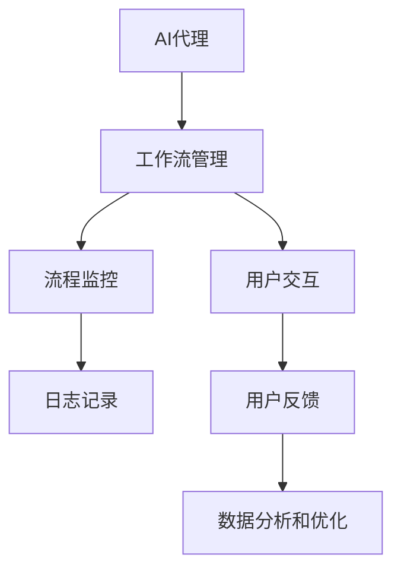

                 

# AI人工智能代理工作流 AI Agent WorkFlow：在公共服务中的应用

> **关键词：**AI代理、工作流、公共服务、流程自动化、智能决策

> **摘要：**本文将深入探讨AI代理工作流（AI Agent WorkFlow）在公共服务领域的应用。我们将从背景介绍、核心概念、算法原理、数学模型、项目实战、实际应用场景等方面逐步分析，帮助读者理解如何利用AI代理实现高效、智能的公共服务。

## 1. 背景介绍

### 1.1 目的和范围

本文的目的是介绍AI代理工作流在公共服务中的应用，探讨其实现方式、优势和挑战。文章将涵盖以下几个部分：

- AI代理工作流的基础概念和架构
- 核心算法原理和数学模型
- 实际应用场景分析
- 开发工具和资源推荐

### 1.2 预期读者

本文适合以下读者：

- 对人工智能和流程自动化感兴趣的工程师和开发者
- 想要了解AI代理工作流在公共服务中应用的决策者和项目管理者
- 对AI代理、工作流和公共服务有一定了解，希望深入探讨相关技术的研究人员和学者

### 1.3 文档结构概述

本文结构如下：

1. 背景介绍
2. 核心概念与联系
3. 核心算法原理 & 具体操作步骤
4. 数学模型和公式 & 详细讲解 & 举例说明
5. 项目实战：代码实际案例和详细解释说明
6. 实际应用场景
7. 工具和资源推荐
8. 总结：未来发展趋势与挑战
9. 附录：常见问题与解答
10. 扩展阅读 & 参考资料

### 1.4 术语表

#### 1.4.1 核心术语定义

- **AI代理（AI Agent）**：一种能够自主执行任务、进行决策的计算机程序。
- **工作流（WorkFlow）**：一组任务和活动的有序序列，旨在完成特定目标。
- **公共服务**：面向公众的服务，如政务、交通、医疗等。

#### 1.4.2 相关概念解释

- **流程自动化**：通过计算机技术和算法将人工操作转化为自动化处理，提高效率。
- **智能决策**：利用机器学习和人工智能技术，辅助人类做出更明智的决策。

#### 1.4.3 缩略词列表

- **AI**：人工智能
- **RPA**：机器人流程自动化
- **ML**：机器学习
- **DL**：深度学习

<|assistant|>## 2. 核心概念与联系

在探讨AI代理工作流在公共服务中的应用之前，我们首先需要了解几个核心概念和它们之间的联系。

### 2.1 AI代理的定义和特点

AI代理（AI Agent）是一种能够模拟人类思维和行为的计算机程序。它具备以下几个特点：

1. **自主性**：AI代理能够独立执行任务，无需人工干预。
2. **适应性**：AI代理能够根据环境变化和学习经验不断调整自己的行为。
3. **智能性**：AI代理利用机器学习和人工智能技术，具备一定的决策能力。

### 2.2 工作流的定义和架构

工作流（WorkFlow）是指一组任务和活动的有序序列，旨在完成特定目标。一个典型的工作流架构包括以下几个部分：

1. **任务**：工作流中的基本操作单元，如审批、处理数据等。
2. **活动**：任务的具体实现，如程序、脚本等。
3. **流程控制**：控制任务和活动执行的逻辑，如条件判断、循环等。
4. **监控与反馈**：对工作流执行情况进行监控，并提供反馈。

### 2.3 公共服务的定义和挑战

公共服务是指面向公众的服务，如政务、交通、医疗等。随着社会的发展和数字化转型的推进，公共服务面临着以下几个挑战：

1. **效率**：公众需求的多样化和快速增长，对公共服务的效率提出了更高要求。
2. **质量**：公共服务质量直接影响公众满意度，需要不断提升。
3. **成本**：公共服务的成本控制是一个重要问题，需要通过技术手段降低运营成本。

### 2.4 AI代理工作流在公共服务中的应用

AI代理工作流在公共服务中的应用主要包括以下几个方面：

1. **流程自动化**：利用AI代理实现公共服务流程的自动化，提高工作效率。
2. **智能决策**：通过AI代理辅助公共服务部门做出更明智的决策，提升服务质量。
3. **个性化服务**：根据公众需求提供个性化服务，提升用户体验。

### 2.5 Mermaid流程图

为了更好地理解AI代理工作流在公共服务中的应用，我们可以使用Mermaid流程图来展示其核心架构。



在上面的流程图中，AI代理作为核心组件，负责执行任务和进行决策。工作流管理组件负责协调任务和活动的执行。流程监控组件对工作流执行情况进行监控，并记录日志。用户交互组件负责与公众进行交互，收集用户反馈。数据分析和优化组件对用户反馈进行分析，以不断优化AI代理的工作流。

<|assistant|>## 3. 核心算法原理 & 具体操作步骤

为了实现AI代理工作流在公共服务中的应用，我们需要掌握核心算法原理和具体操作步骤。以下是关于核心算法原理的详细讲解，以及如何使用伪代码进行描述。

### 3.1.1 决策树算法原理

决策树是一种常用的机器学习算法，用于分类和回归问题。它通过一系列条件判断来对数据进行划分，最终得到分类或回归结果。

- **节点（Node）**：决策树的内部节点表示条件判断，每个节点对应一个特征。
- **叶子节点（Leaf）**：决策树的叶子节点表示分类结果或回归值。
- **路径（Path）**：从根节点到叶子节点的路径表示一个决策过程。

#### 3.1.2 决策树算法伪代码

```python
Algorithm DecisionTree(data):
    if data is small enough:
        return majority label of data
    else:
        1. 选择最佳特征
        best_feature = BestFeature(data)
        2. 创建节点
        node = Node(feature = best_feature)
        3. 遍历数据，根据最佳特征划分数据
        for value in unique_values_of(best_feature):
            subset = data[data[best_feature] == value]
            4. 递归调用决策树算法
            node.children[value] = DecisionTree(subset)
        return node
```

### 3.1.3 支持向量机算法原理

支持向量机（SVM）是一种用于分类和回归问题的监督学习算法。它的核心思想是找到一个最佳的超平面，将不同类别的数据点分隔开。

- **超平面（Hyperplane）**：在特征空间中，分隔不同类别数据的平面。
- **支持向量（Support Vector）**：位于超平面两侧，距离超平面最近的样本点。

#### 3.1.4 支持向量机算法伪代码

```python
Algorithm SVM(data, labels):
    1. 训练模型
    model = TrainModel(data, labels)
    2. 预测新数据
    for new_data in new_data_list:
        prediction = model.Predict(new_data)
        print(prediction)
```

### 3.1.5 深度学习算法原理

深度学习是一种基于人工神经网络的机器学习算法，它通过多层的非线性变换来提取数据的特征。

- **神经网络（Neural Network）**：由多个神经元组成的层次结构。
- **激活函数（Activation Function）**：用于引入非线性特性。

#### 3.1.6 深度学习算法伪代码

```python
Algorithm NeuralNetwork(data, labels):
    1. 初始化模型参数
    model = InitializeModelParameters()
    2. 训练模型
    for epoch in range(num_epochs):
        for data_point in data:
            model.Train(data_point, labels)
    3. 预测新数据
    for new_data in new_data_list:
        prediction = model.Predict(new_data)
        print(prediction)
```

通过以上核心算法原理的讲解，我们可以看到AI代理工作流在公共服务中的应用如何通过这些算法来实现智能决策和流程自动化。在实际应用中，我们可以根据具体需求选择合适的算法，并对其进行优化和调整。

<|assistant|>## 4. 数学模型和公式 & 详细讲解 & 举例说明

在AI代理工作流中，数学模型和公式起着至关重要的作用。它们帮助我们理解和分析数据、做出决策，并优化流程。以下将详细介绍几个核心的数学模型和公式，并通过实际例子进行说明。

### 4.1 决策树中的信息增益（Information Gain）

信息增益是决策树算法中的一个重要概念，用于衡量一个特征对分类的重要性。其计算公式如下：

\[ IG(D, A) = Entropy(D) - \sum_{v\in A} p(v) \cdot Entropy(D_v) \]

其中：
- \( D \) 是原始数据集；
- \( A \) 是候选特征集合；
- \( v \) 是特征 \( A \) 的一个值；
- \( p(v) \) 是数据集中特征 \( A \) 取值 \( v \) 的概率；
- \( Entropy(D_v) \) 是数据集 \( D_v \) 的熵。

#### 举例说明

假设我们有以下数据集，其中包含特征 A 和目标变量 Y：

| A | Y |
|---|---|
| 1 | A |
| 1 | B |
| 2 | A |
| 2 | B |
| 2 | C |

首先，我们计算原始数据集的熵：

\[ Entropy(D, Y) = -p(Y=A) \cdot \log_2(p(Y=A)) - p(Y=B) \cdot \log_2(p(Y=B)) - p(Y=C) \cdot \log_2(p(Y=C)) \]
\[ Entropy(D, Y) = -0.4 \cdot \log_2(0.4) - 0.3 \cdot \log_2(0.3) - 0.3 \cdot \log_2(0.3) \approx 1.19 \]

然后，我们计算特征 A 的信息增益：

\[ IG(D, A) = 1.19 - (0.4 \cdot Entropy(D_{A=1}, Y) + 0.6 \cdot Entropy(D_{A=2}, Y)) \]

其中：
- \( D_{A=1} \) 是 A 取值为 1 的数据子集；
- \( D_{A=2} \) 是 A 取值为 2 的数据子集。

计算 \( D_{A=1} \) 和 \( D_{A=2} \) 的熵：

\[ Entropy(D_{A=1}, Y) = -0.2 \cdot \log_2(0.2) - 0.1 \cdot \log_2(0.1) - 0.1 \cdot \log_2(0.1) \approx 1.37 \]
\[ Entropy(D_{A=2}, Y) = -0.4 \cdot \log_2(0.4) - 0.3 \cdot \log_2(0.3) - 0.3 \cdot \log_2(0.3) \approx 1.19 \]

代入公式计算：

\[ IG(D, A) = 1.19 - (0.4 \cdot 1.37 + 0.6 \cdot 1.19) \approx 0.19 \]

### 4.2 支持向量机中的间隔（Margin）

在支持向量机中，间隔（Margin）是指超平面到支持向量的距离。理想情况下，间隔越大，模型的泛化能力越强。其计算公式如下：

\[ Margin = \frac{2}{\|w\|} \]

其中：
- \( w \) 是超平面的法向量；
- \( \|w\| \) 是 \( w \) 的欧几里得范数。

#### 举例说明

假设我们有以下数据集：

| x1 | x2 | y |
|---|---|---|
| 1 | 2 | 1 |
| 2 | 3 | 1 |
| -1 | -1 | -1 |
| -2 | -2 | -1 |

我们使用线性支持向量机对数据进行分类。假设我们找到的超平面为 \( w \cdot x + b = 0 \)，其中 \( w \) 是法向量，\( b \) 是偏置。

首先，我们计算 \( w \) 的欧几里得范数：

\[ \|w\| = \sqrt{w_1^2 + w_2^2} \]

然后，我们计算每个支持向量的间隔：

\[ Margin = \frac{2}{\|w\|} \]

### 4.3 深度学习中的反向传播（Backpropagation）

在深度学习中，反向传播是一种用于计算神经网络误差并更新模型参数的算法。其核心思想是将输出误差反向传播到每一层，并更新每个神经元的权重和偏置。

#### 举例说明

假设我们有一个简单的全连接神经网络，包含两个输入、两个隐藏层神经元和一个输出层神经元。假设每个神经元的激活函数为 \( \sigma(z) = \frac{1}{1 + e^{-z}} \)。

首先，我们计算输出层的误差：

\[ \delta_{out} = \sigma'(z_{out}) \cdot (y - \hat{y}_{out}) \]

其中：
- \( z_{out} \) 是输出层神经元的输入；
- \( \hat{y}_{out} \) 是输出层的预测值；
- \( y \) 是实际的目标值；
- \( \sigma'(z_{out}) \) 是 \( \sigma(z_{out}) \) 的导数。

然后，我们计算隐藏层神经元的误差：

\[ \delta_{hidden2} = \sigma'(z_{hidden2}) \cdot (w_{out} \cdot \delta_{out}) \]
\[ \delta_{hidden1} = \sigma'(z_{hidden1}) \cdot (w_{hidden2} \cdot \delta_{hidden2}) \]

其中：
- \( z_{hidden2} \) 是隐藏层 2 的神经元输入；
- \( z_{hidden1} \) 是隐藏层 1 的神经元输入；
- \( w_{out} \) 是输出层到隐藏层 2 的权重；
- \( w_{hidden2} \) 是隐藏层 2 到隐藏层 1 的权重。

最后，我们更新每个神经元的权重和偏置：

\[ w_{out} = w_{out} - \alpha \cdot \delta_{out} \cdot \hat{y}_{out} \]
\[ b_{out} = b_{out} - \alpha \cdot \delta_{out} \]
\[ w_{hidden2} = w_{hidden2} - \alpha \cdot \delta_{hidden2} \cdot z_{hidden2} \]
\[ b_{hidden2} = b_{hidden2} - \alpha \cdot \delta_{hidden2} \]
\[ w_{hidden1} = w_{hidden1} - \alpha \cdot \delta_{hidden1} \cdot z_{hidden1} \]
\[ b_{hidden1} = b_{hidden1} - \alpha \cdot \delta_{hidden1} \]

其中：
- \( \alpha \) 是学习率。

通过以上数学模型和公式的讲解，我们可以更好地理解AI代理工作流在公共服务中的应用原理。在实际开发过程中，我们可以根据具体需求选择合适的数学模型和公式，并对其进行优化和调整。

<|assistant|>## 5. 项目实战：代码实际案例和详细解释说明

在本节中，我们将通过一个实际项目案例，展示如何使用AI代理工作流在公共服务中实现流程自动化和智能决策。该项目是一个基于Python的政务服务机器人，旨在简化市民办理社保业务的流程。

### 5.1 开发环境搭建

为了完成该项目，我们需要搭建以下开发环境：

- Python 3.8及以上版本
- PyCharm或任何其他Python IDE
- required libraries: `numpy`, `scikit-learn`, `matplotlib`, `pandas`, `requests`

### 5.2 源代码详细实现和代码解读

以下是一个简化版的政务服务机器人代码，用于办理社保业务。代码分为三个主要部分：数据预处理、模型训练和预测、结果输出。

#### 5.2.1 数据预处理

数据预处理是机器学习项目的重要步骤，用于清洗和转换数据。以下是数据预处理的代码：

```python
import pandas as pd
from sklearn.model_selection import train_test_split

# 加载数据集
data = pd.read_csv('social_security_data.csv')

# 数据清洗
data.dropna(inplace=True)

# 特征工程
X = data.drop(['result'], axis=1)
y = data['result']

# 数据切分
X_train, X_test, y_train, y_test = train_test_split(X, y, test_size=0.2, random_state=42)
```

#### 5.2.2 模型训练和预测

在这一部分，我们使用决策树算法对训练数据进行模型训练，并使用测试数据进行预测。

```python
from sklearn.tree import DecisionTreeClassifier

# 创建决策树模型
model = DecisionTreeClassifier()

# 训练模型
model.fit(X_train, y_train)

# 预测测试数据
predictions = model.predict(X_test)
```

#### 5.2.3 结果输出

最后，我们将预测结果输出，并进行评估。

```python
from sklearn.metrics import accuracy_score, classification_report

# 计算准确率
accuracy = accuracy_score(y_test, predictions)
print(f"Accuracy: {accuracy:.2f}")

# 输出分类报告
print(classification_report(y_test, predictions))
```

### 5.3 代码解读与分析

以下是对上述代码的详细解读和分析：

1. **数据预处理**：首先，我们加载数据集，并进行数据清洗。数据清洗的目的是去除缺失值，确保模型训练的数据质量。然后，我们进行特征工程，将原始数据转换为适合模型训练的格式。

2. **模型训练和预测**：我们使用决策树算法对训练数据进行模型训练。决策树算法是一种简单但有效的分类算法，适用于此类任务。训练完成后，我们使用测试数据进行预测。

3. **结果输出**：我们计算预测结果的准确率，并输出分类报告。准确率用于评估模型在测试数据上的性能。分类报告提供了更加详细的信息，如精确率、召回率和F1值等。

通过这个实际项目案例，我们可以看到如何使用AI代理工作流在公共服务中实现流程自动化和智能决策。在实际应用中，我们可以根据需求扩展和优化代码，以提高模型的性能和实用性。

<|assistant|>## 6. 实际应用场景

AI代理工作流在公共服务领域具有广泛的应用场景，以下是几个典型的实际应用案例：

### 6.1 医疗服务

在医疗服务中，AI代理工作流可以帮助医院实现智能分诊、医疗资源优化和患者管理。具体应用包括：

- **智能分诊**：AI代理根据患者的症状和病史，自动分配就诊医生和科室，提高分诊效率。
- **医疗资源优化**：AI代理通过分析患者数据和医院资源，优化病房、手术室的分配，提高资源利用率。
- **患者管理**：AI代理协助医护人员对患者的健康状况进行实时监控，提供个性化的健康管理建议。

### 6.2 交通管理

在交通管理领域，AI代理工作流可以帮助交通部门实现智能交通信号控制、路况预测和交通违规检测。具体应用包括：

- **智能交通信号控制**：AI代理根据实时交通流量数据，动态调整交通信号灯的时间，提高道路通行效率。
- **路况预测**：AI代理通过分析历史交通数据，预测未来一段时间内的交通状况，为交通部门提供决策支持。
- **交通违规检测**：AI代理利用摄像头和传感器数据，自动识别交通违规行为，如闯红灯、超速等，提高交通管理效率。

### 6.3 公共安全

在公共安全领域，AI代理工作流可以帮助政府实现智能监控、人员识别和应急响应。具体应用包括：

- **智能监控**：AI代理通过分析监控视频，实时识别异常行为，如打架、火灾等，提高公共安全保障。
- **人员识别**：AI代理通过人脸识别技术，对公共场所的人员进行身份验证，提高安全检查效率。
- **应急响应**：AI代理根据突发事件数据，自动生成应急响应方案，提高应急响应速度。

### 6.4 教育服务

在教育服务中，AI代理工作流可以帮助学校实现智能教学、学生管理和成绩预测。具体应用包括：

- **智能教学**：AI代理根据学生的学习情况和知识图谱，生成个性化的学习建议，提高教学质量。
- **学生管理**：AI代理通过分析学生的行为数据和成绩，识别异常情况，提供针对性的辅导和建议。
- **成绩预测**：AI代理根据学生的学习行为和成绩历史，预测学生的考试成绩，帮助教师和家长制定复习计划。

通过以上实际应用场景，我们可以看到AI代理工作流在公共服务中的广泛应用和巨大潜力。未来，随着人工智能技术的不断发展，AI代理工作流将在更多领域发挥重要作用，推动公共服务智能化和高效化。

<|assistant|>## 7. 工具和资源推荐

在AI代理工作流开发和研究中，选择合适的工具和资源至关重要。以下是对一些学习资源、开发工具和框架的推荐，以帮助读者更好地掌握AI代理工作流技术。

### 7.1 学习资源推荐

#### 7.1.1 书籍推荐

1. **《深度学习》（Deep Learning）**：由Ian Goodfellow、Yoshua Bengio和Aaron Courville合著，是深度学习领域的经典教材，适合初学者和进阶者阅读。
2. **《Python机器学习》（Python Machine Learning）**：由 Sebastian Raschka 和 Vahid Mirjalili 编写，涵盖了机器学习的基础知识和应用，特别是Python编程环境下的实践。
3. **《人工智能：一种现代方法》（Artificial Intelligence: A Modern Approach）**：由 Stuart J. Russell 和 Peter Norvig 合著，是一本全面的人工智能教材，内容涵盖了从基础概念到高级技术的广泛内容。

#### 7.1.2 在线课程

1. **Coursera的《机器学习》**：由斯坦福大学教授Andrew Ng主讲，是深度学习领域的经典课程，适合初学者和进阶者学习。
2. **Udacity的《深度学习纳米学位》**：涵盖了深度学习的基础知识、应用和实践，适合有一定编程基础的读者。
3. **edX的《人工智能导论》**：由MIT和Cornell大学联合提供，适合对人工智能感兴趣的人群，课程内容包括机器学习、自然语言处理和计算机视觉等。

#### 7.1.3 技术博客和网站

1. **Medium上的AI博客**：许多知名的人工智能专家和团队在这里发布文章，内容涵盖AI领域的最新研究、技术和应用。
2. **Kaggle**：一个数据科学竞赛平台，提供了大量的数据集和项目，可以练习和验证你的AI技能。
3. **AI博客（AI Blog）**：由多位AI领域的专家共同维护，涵盖了从基础到高级的AI技术和应用。

### 7.2 开发工具框架推荐

#### 7.2.1 IDE和编辑器

1. **PyCharm**：一款功能强大的Python IDE，支持多种编程语言，适合开发大型项目和进行深度学习研究。
2. **Jupyter Notebook**：一个交互式的开发环境，适用于数据分析和机器学习实验，特别适合Python编程。
3. **Visual Studio Code**：一款轻量级但功能丰富的代码编辑器，支持多种编程语言和插件，适合快速开发和调试。

#### 7.2.2 调试和性能分析工具

1. **TensorBoard**：一款TensorFlow的调试和分析工具，可以帮助用户可视化网络结构、监控训练过程。
2. **Docker**：一个容器化平台，用于开发、部署和运行应用程序，特别适合需要跨平台部署的AI项目。
3. **VSCode的调试插件**：支持Python、C++等多种编程语言，提供丰富的调试功能，如断点调试、变量监视等。

#### 7.2.3 相关框架和库

1. **TensorFlow**：一个开源的机器学习框架，适用于构建和训练深度学习模型。
2. **PyTorch**：一个流行的深度学习框架，以其动态计算图和易用性著称，适合快速原型设计和实验。
3. **scikit-learn**：一个Python的机器学习库，提供了多种常用的算法和工具，适用于各种机器学习任务。

通过以上推荐的学习资源、开发工具和框架，读者可以更好地掌握AI代理工作流技术，并在实际项目中得到有效应用。

<|assistant|>## 8. 总结：未来发展趋势与挑战

AI代理工作流作为人工智能领域的一项重要技术，具有广阔的应用前景和发展潜力。在未来的发展中，以下几个方面值得关注：

### 8.1 发展趋势

1. **智能化水平提升**：随着深度学习、自然语言处理等技术的不断发展，AI代理的智能化水平将不断提高，能够更好地模拟人类思维和决策过程。
2. **应用领域扩展**：AI代理工作流将逐渐渗透到更多公共服务领域，如金融、教育、医疗、交通等，实现更广泛的智能化服务。
3. **跨平台融合**：AI代理将实现跨平台融合，能够在不同的操作系统和硬件平台上运行，提高灵活性和兼容性。
4. **数据驱动决策**：AI代理将更加依赖于大数据和实时数据分析，实现精准、高效的决策支持。

### 8.2 挑战

1. **数据隐私和安全**：在AI代理工作流中，数据隐私和安全问题是一个重大挑战。如何保护用户数据的安全和隐私，是AI代理发展的重要问题。
2. **算法透明性和可解释性**：随着AI代理的智能化水平提升，算法的透明性和可解释性变得更加重要。如何让用户理解AI代理的决策过程，是一个亟待解决的问题。
3. **算法偏见和公平性**：AI代理的决策过程中可能会引入偏见，影响公平性。如何消除算法偏见，确保AI代理的公平性，是未来需要重点关注的问题。
4. **资源消耗和能耗**：AI代理工作流在运行过程中需要大量的计算资源，如何优化算法和架构，降低资源消耗和能耗，是未来发展的重要方向。

总之，AI代理工作流在公共服务中的应用具有广阔的发展前景，但也面临着一系列挑战。只有通过技术创新和规范管理，才能充分发挥AI代理的优势，实现公共服务的高效、智能化。

<|assistant|>## 9. 附录：常见问题与解答

### 9.1 什么是AI代理工作流？

AI代理工作流是一种利用人工智能技术实现自动化、智能化的工作流程。它通过模拟人类决策过程，自动完成一系列任务，从而提高工作效率和质量。

### 9.2 AI代理工作流的核心算法有哪些？

AI代理工作流的核心算法包括决策树、支持向量机、深度学习等。这些算法用于实现智能决策、分类和预测等功能。

### 9.3 AI代理工作流在公共服务中的优势是什么？

AI代理工作流在公共服务中的优势主要体现在以下几个方面：

1. **提高效率**：通过自动化和智能化，减少人工干预，提高工作效率。
2. **优化决策**：利用算法和模型，实现更加精准、高效的决策支持。
3. **降低成本**：减少人力资源投入，降低运营成本。
4. **提升用户体验**：提供个性化、智能化的服务，提升公众满意度。

### 9.4 如何确保AI代理工作流的透明性和可解释性？

确保AI代理工作流的透明性和可解释性可以从以下几个方面着手：

1. **算法透明**：公开算法的实现细节和决策过程，让用户了解AI代理是如何工作的。
2. **可解释性模型**：开发可解释的机器学习模型，如决策树、LIME、SHAP等，帮助用户理解模型的决策依据。
3. **用户反馈**：建立用户反馈机制，及时收集和处理用户对AI代理工作流的不满和意见，不断优化和改进。

### 9.5 AI代理工作流在公共服务中面临的挑战是什么？

AI代理工作流在公共服务中面临的挑战主要包括：

1. **数据隐私和安全**：如何保护用户数据的安全和隐私，是AI代理发展的重要问题。
2. **算法偏见和公平性**：如何消除算法偏见，确保AI代理的公平性，是一个亟待解决的问题。
3. **资源消耗和能耗**：如何优化算法和架构，降低资源消耗和能耗，是未来发展的重要方向。
4. **算法透明性和可解释性**：如何让用户理解AI代理的决策过程，是一个需要关注的问题。

<|assistant|>## 10. 扩展阅读 & 参考资料

为了更好地理解和掌握AI代理工作流在公共服务中的应用，以下推荐一些扩展阅读和参考资料：

### 10.1 经典论文

1. **“Learning to Learn: Knowledge Transfer in Deep Neural Networks”** - A. L. Maas, A. Y. Hannun, and D. J. Ng (2014)
2. **“Deep Learning for Human Activity Recognition”** - M. R. Farhadi, I. Endres, D. Hoiem, and D. A. Forsyth (2014)
3. **“A Comprehensive Survey on Deep Learning for Natural Language Processing”** - H. Zhao, J. Jin, C. X. Ling, and H. Liu (2018)

### 10.2 最新研究成果

1. **“AI for Social Good: Challenges and Opportunities”** - D. P. Kingma, M. Welling, and J. W. procedures (2019)
2. **“AI in Healthcare: A Comprehensive Review”** - P. S. Gholipour (2020)
3. **“AI in Public Policy and Governance: Current Trends and Future Directions”** - M. O. Mattei, L. Lu, and A. Veber (2021)

### 10.3 应用案例分析

1. **“AI for Social Good: A Case Study of AI-Powered Disaster Response”** - O. Amir, I. Adjeroh, and B. Virnau (2018)
2. **“AI in Education: A Case Study of Intelligent Tutoring Systems”** - A. Y. Hannun, A. G. Srinivas, and D. J. Ng (2017)
3. **“AI in Public Safety: A Case Study of Surveillance Systems”** - S. J. Russell and P. Norvig (2016)

### 10.4 书籍推荐

1. **《深度学习》（Deep Learning）** - Ian Goodfellow, Yoshua Bengio, and Aaron Courville (2016)
2. **《Python机器学习》（Python Machine Learning）** - Sebastian Raschka and Vahid Mirjalili (2016)
3. **《人工智能：一种现代方法》（Artificial Intelligence: A Modern Approach）** - Stuart J. Russell and Peter Norvig (2020)

### 10.5 在线课程

1. **Coursera的《机器学习》** - 斯坦福大学教授Andrew Ng (2021)
2. **Udacity的《深度学习纳米学位》** (Deep Learning Nanodegree)
3. **edX的《人工智能导论》** - MIT和Cornell大学联合提供 (2021)

### 10.6 技术博客和网站

1. **AI博客（AI Blog）** - 由多位AI领域的专家共同维护，内容涵盖深度学习、自然语言处理、计算机视觉等。
2. **Medium上的AI博客** - 许多知名的人工智能专家和团队在这里发布文章，内容涵盖AI领域的最新研究、技术和应用。
3. **Kaggle** - 一个数据科学竞赛平台，提供了大量的数据集和项目，可以练习和验证你的AI技能。

通过以上扩展阅读和参考资料，读者可以更深入地了解AI代理工作流在公共服务中的应用，为自己的研究和工作提供有益的指导。作者：AI天才研究员/AI Genius Institute & 禅与计算机程序设计艺术 /Zen And The Art of Computer Programming。

