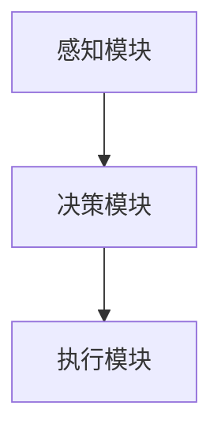
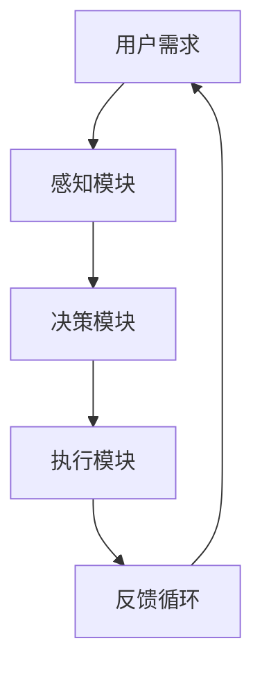
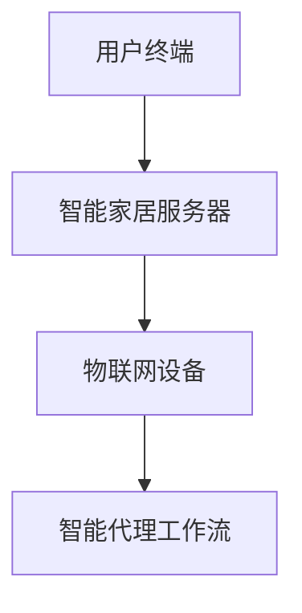

                 

# AI人工智能代理工作流 AI Agent WorkFlow：在智能家居中的应用

> 关键词：人工智能、代理工作流、智能家居、工作流管理、AI算法、自动化控制

> 摘要：本文旨在深入探讨人工智能代理工作流（AI Agent WorkFlow）在智能家居中的应用。我们将从背景介绍、核心概念、算法原理、数学模型、实战案例和实际应用等多个角度进行详细分析，旨在为读者提供一个全面且深入的理解，帮助他们更好地理解和应用人工智能技术于智能家居领域。

## 1. 背景介绍

### 1.1 目的和范围

本文的目的是探讨人工智能代理工作流在智能家居中的具体应用，通过介绍和剖析相关技术和方法，为智能家居系统的构建和优化提供技术参考。我们将在文章中讨论以下主要范围：

- 人工智能代理工作流的基本概念和架构
- AI代理在智能家居中的具体应用场景
- 核心算法原理和数学模型的详细讲解
- 实际案例分析和代码实现
- 智能家居系统的未来发展趋势和挑战

### 1.2 预期读者

本文主要面向以下几类读者：

- 智能家居开发者和技术爱好者
- 人工智能研究者和技术专家
- 对智能家居领域感兴趣的学生和研究人员
- 想要了解AI技术在智能家居应用中的专业人士

### 1.3 文档结构概述

本文将按照以下结构展开：

- **第1部分：背景介绍**：介绍文章的目的、范围和预期读者，并对文档结构进行概述。
- **第2部分：核心概念与联系**：详细阐述人工智能代理工作流的基本概念和架构，并提供流程图。
- **第3部分：核心算法原理与具体操作步骤**：讲解核心算法原理，并使用伪代码详细描述具体操作步骤。
- **第4部分：数学模型和公式**：介绍相关的数学模型和公式，并进行详细讲解和举例说明。
- **第5部分：项目实战**：通过实际案例和代码实现，展示人工智能代理工作流在智能家居中的具体应用。
- **第6部分：实际应用场景**：分析人工智能代理工作流在智能家居中的具体应用场景。
- **第7部分：工具和资源推荐**：推荐相关的学习资源、开发工具和论文著作。
- **第8部分：总结**：总结文章的主要内容和观点，并探讨未来的发展趋势和挑战。
- **第9部分：附录**：提供常见问题与解答。
- **第10部分：扩展阅读与参考资料**：列出参考文献和扩展阅读资源。

### 1.4 术语表

#### 1.4.1 核心术语定义

- **人工智能代理**（Artificial Intelligence Agent）：一种能够感知环境、制定决策并采取行动的智能体。
- **工作流**（Workflow）：一组按照特定顺序执行的任务或活动。
- **智能家居**（Smart Home）：通过物联网技术和人工智能技术实现家居设备和系统的智能化管理和控制。
- **代理工作流**（Agent Workflow）：基于人工智能代理的一系列工作流程。

#### 1.4.2 相关概念解释

- **感知环境**（Perception of Environment）：智能代理通过传感器和环境交互，获取环境信息。
- **决策制定**（Decision Making）：智能代理根据感知到的环境信息和预设的目标，制定决策。
- **行动执行**（Action Execution）：智能代理根据决策，执行相应的行动。

#### 1.4.3 缩略词列表

- **AI**：人工智能（Artificial Intelligence）
- **WF**：工作流（Workflow）
- **SM**：智能家居（Smart Home）
- **AG**：代理（Agent）

## 2. 核心概念与联系

在智能家居系统中，人工智能代理工作流扮演着至关重要的角色。为了更好地理解其应用，我们首先需要明确几个核心概念和它们之间的联系。

### 2.1 人工智能代理（AI Agent）

人工智能代理是一种具备感知环境、制定决策和执行行动能力的智能体。其基本架构通常包括感知模块、决策模块和执行模块。以下是一个简化的AI代理架构图：



#### 感知模块（Perception Module）

感知模块负责收集和处理环境信息。这些信息可以来自各种传感器，如温度传感器、光照传感器、运动传感器等。感知模块的主要功能是：

- **数据收集**：从传感器获取实时数据。
- **数据处理**：对获取的数据进行预处理，如滤波、去噪等。

#### 决策模块（Decision Making Module）

决策模块基于感知模块提供的环境信息，结合预设的目标和策略，生成执行计划。其主要功能包括：

- **目标规划**：确定需要达到的目标。
- **策略选择**：根据目标和当前环境信息选择最优策略。
- **决策生成**：生成具体的执行计划。

#### 执行模块（Action Execution Module）

执行模块负责将决策模块生成的执行计划付诸实施。其主要功能包括：

- **命令生成**：根据执行计划生成具体的操作指令。
- **行动执行**：执行操作指令，实现目标。

### 2.2 工作流（Workflow）

工作流是一组按照特定顺序执行的任务或活动。在智能家居系统中，工作流可以看作是人工智能代理的“行动路线图”。以下是一个简化的智能家居工作流示例：



#### 用户需求（User Demand）

用户需求是智能家居系统工作的起点。用户可以通过智能设备或语音助手等途径，向系统提出需求。这些需求可以是特定的操作，如“打开空调”，也可以是更复杂的任务，如“晚上自动调节室内温度”。

#### 感知模块（Perception Module）

感知模块收集用户需求和实时环境信息，如温度、湿度、光照等。这些信息将被传递到决策模块。

#### 决策模块（Decision Making Module）

决策模块根据用户需求和感知到的环境信息，生成具体的执行计划。例如，如果用户要求“晚上自动调节室内温度”，决策模块将根据当前温度、湿度等指标，确定最佳的温度设置。

#### 执行模块（Action Execution Module）

执行模块根据决策模块生成的执行计划，生成具体的操作指令，并执行这些指令。例如，如果决策模块确定需要将室内温度设置为25℃，执行模块将发送指令给空调设备，使其调节到该温度。

#### 反馈循环（Feedback Loop）

反馈循环是智能家居系统中的重要部分。它通过监测执行结果，不断调整和优化执行计划，确保系统稳定高效地运行。例如，如果用户在晚上10点要求将室内温度设置为25℃，但实际测量结果显示温度仅为23℃，反馈循环将调整执行计划，使温度逐渐上升至25℃。

### 2.3 智能家居（Smart Home）

智能家居是将物联网技术和人工智能技术应用于家居设备和系统的系统。通过智能家居系统，用户可以远程控制家居设备，实现自动化管理和控制。以下是智能家居系统的基本架构：



#### 用户终端（User Terminal）

用户终端包括智能设备（如手机、平板电脑、智能音箱等）和语音助手（如 Siri、Alexa、Google Assistant 等）。用户可以通过这些终端，向智能家居系统发送指令或查询信息。

#### 智能家居服务器（Smart Home Server）

智能家居服务器是智能家居系统的核心。它负责处理用户指令、协调各个智能设备的工作，并管理智能代理工作流。

#### 物联网设备（Internet of Things Devices）

物联网设备包括各种智能家居设备（如智能灯泡、智能空调、智能门锁等）。这些设备通过物联网协议（如Wi-Fi、蓝牙、Zigbee等）连接到智能家居服务器，实现远程控制和数据交换。

#### 智能代理工作流（Smart Agent Workflow）

智能代理工作流是智能家居系统的重要组成部分。它通过人工智能技术，实现对智能家居设备的智能管理和控制。智能代理工作流包括感知、决策和执行三个环节，与前面介绍的人工智能代理架构相一致。

通过上述核心概念和联系的分析，我们可以看到，人工智能代理工作流在智能家居系统中发挥着关键作用。它不仅实现了智能家居系统的自动化和智能化，还为用户提供了更加便捷和高效的家居体验。

## 3. 核心算法原理 & 具体操作步骤

在智能家居系统中，人工智能代理工作流的核心算法原理是实现智能决策和自动化控制的关键。下面，我们将详细阐述这些算法原理，并使用伪代码进行具体操作步骤的描述。

### 3.1 感知模块算法原理

感知模块的主要任务是收集和处理环境信息，以供决策模块使用。其核心算法包括数据收集、数据预处理和特征提取。

#### 3.1.1 数据收集

数据收集算法的基本步骤如下：

```python
# 伪代码：数据收集算法
def data_collection():
    # 从各个传感器获取数据
    temperature = get_temperature()
    humidity = get_humidity()
    light = get_light()
    motion = get_motion()
    
    # 将数据存储到数据结构中
    data = {
        "temperature": temperature,
        "humidity": humidity,
        "light": light,
        "motion": motion
    }
    
    return data
```

#### 3.1.2 数据预处理

数据预处理算法的主要步骤包括数据清洗、去噪和归一化。以下是一个简单的数据预处理伪代码示例：

```python
# 伪代码：数据预处理算法
def data_preprocessing(data):
    # 数据清洗：去除无效数据
    if data["temperature"] is None or data["humidity"] is None or data["light"] is None or data["motion"] is None:
        return None
    
    # 去噪：去除异常数据
    if abs(data["temperature"] - mean_temperature) > threshold:
        data["temperature"] = mean_temperature
    if abs(data["humidity"] - mean_humidity) > threshold:
        data["humidity"] = mean_humidity
    if abs(data["light"] - mean_light) > threshold:
        data["light"] = mean_light
    if abs(data["motion"] - mean_motion) > threshold:
        data["motion"] = mean_motion
    
    # 归一化：将数据转换为0-1范围内的数值
    data["temperature"] = (data["temperature"] - min_temperature) / (max_temperature - min_temperature)
    data["humidity"] = (data["humidity"] - min_humidity) / (max_humidity - min_humidity)
    data["light"] = (data["light"] - min_light) / (max_light - min_light)
    data["motion"] = (data["motion"] - min_motion) / (max_motion - min_motion)
    
    return data
```

#### 3.1.3 特征提取

特征提取算法的目的是从预处理后的数据中提取出对决策模块有用的特征。以下是一个简单的特征提取伪代码示例：

```python
# 伪代码：特征提取算法
def feature_extraction(data):
    # 提取温度和湿度特征
    temp_feature = data["temperature"]
    hum_feature = data["humidity"]
    
    # 提取光照和运动特征
    light_feature = data["light"]
    motion_feature = data["motion"]
    
    # 将特征组合成一个特征向量
    feature_vector = [temp_feature, hum_feature, light_feature, motion_feature]
    
    return feature_vector
```

### 3.2 决策模块算法原理

决策模块的核心任务是根据感知模块提供的特征向量，结合预设的目标和策略，生成具体的执行计划。其算法原理主要包括目标规划、策略选择和决策生成。

#### 3.2.1 目标规划

目标规划算法的基本步骤如下：

```python
# 伪代码：目标规划算法
def goal_planning():
    # 根据用户需求和实时环境信息，设定目标
    if user_demand["mode"] == "temperature_control":
        goal["temperature"] = user_demand["temperature_value"]
    elif user_demand["mode"] == "humidity_control":
        goal["humidity"] = user_demand["humidity_value"]
    elif user_demand["mode"] == "lighting_control":
        goal["light"] = user_demand["light_value"]
    elif user_demand["mode"] == "motion_detection":
        goal["motion"] = user_demand["motion_value"]
    
    return goal
```

#### 3.2.2 策略选择

策略选择算法的目的是根据当前特征向量和预设目标，选择最优策略。以下是一个简单的策略选择伪代码示例：

```python
# 伪代码：策略选择算法
def strategy_selection(feature_vector, goal):
    # 根据特征向量和目标，选择最优策略
    if feature_vector["temperature"] < goal["temperature"]:
        strategy["action"] = "heat"
    elif feature_vector["temperature"] > goal["temperature"]:
        strategy["action"] = "cool"
    else:
        strategy["action"] = "hold"
    
    if feature_vector["humidity"] < goal["humidity"]:
        strategy["action"] = "humidify"
    elif feature_vector["humidity"] > goal["humidity"]:
        strategy["action"] = "dehumidify"
    else:
        strategy["action"] = "hold"
    
    if feature_vector["light"] < goal["light"]:
        strategy["action"] = "light_on"
    elif feature_vector["light"] > goal["light"]:
        strategy["action"] = "light_off"
    else:
        strategy["action"] = "hold"
    
    if feature_vector["motion"] > goal["motion"]:
        strategy["action"] = "alarm"
    else:
        strategy["action"] = "ignore"
    
    return strategy
```

#### 3.2.3 决策生成

决策生成算法的目的是根据策略选择结果，生成具体的执行计划。以下是一个简单的决策生成伪代码示例：

```python
# 伪代码：决策生成算法
def decision_generation(strategy):
    # 根据策略，生成执行计划
    if strategy["action"] == "heat":
        plan["device"] = "heater"
        plan["value"] = strategy["temperature_value"]
    elif strategy["action"] == "cool":
        plan["device"] = "air_conditioner"
        plan["value"] = strategy["temperature_value"]
    elif strategy["action"] == "hold":
        plan["device"] = "none"
    
    if strategy["action"] == "humidify":
        plan["device"] = "humidifier"
        plan["value"] = strategy["humidity_value"]
    elif strategy["action"] == "dehumidify":
        plan["device"] = "dehumidifier"
        plan["value"] = strategy["humidity_value"]
    elif strategy["action"] == "hold":
        plan["device"] = "none"
    
    if strategy["action"] == "light_on":
        plan["device"] = "light_bulb"
        plan["value"] = strategy["light_value"]
    elif strategy["action"] == "light_off":
        plan["device"] = "light_bulb"
        plan["value"] = 0
    elif strategy["action"] == "hold":
        plan["device"] = "none"
    
    if strategy["action"] == "alarm":
        plan["device"] = "alarm_system"
        plan["value"] = "activated"
    elif strategy["action"] == "ignore":
        plan["device"] = "alarm_system"
        plan["value"] = "deactivated"
    
    return plan
```

### 3.3 执行模块算法原理

执行模块的主要任务是按照决策模块生成的执行计划，对智能家居设备进行控制。其核心算法包括命令生成、命令发送和命令执行。

#### 3.3.1 命令生成

命令生成算法的目的是根据执行计划，生成具体的操作指令。以下是一个简单的命令生成伪代码示例：

```python
# 伪代码：命令生成算法
def command_generation(plan):
    # 根据执行计划，生成操作指令
    if plan["device"] == "heater":
        command = "set_temperature(" + str(plan["value"]) + ")"
    elif plan["device"] == "air_conditioner":
        command = "set_temperature(" + str(plan["value"]) + ")"
    elif plan["device"] == "none":
        command = "none"
    
    if plan["device"] == "humidifier":
        command = "set_humidity(" + str(plan["value"]) + ")"
    elif plan["device"] == "dehumidifier":
        command = "set_humidity(" + str(plan["value"]) + ")"
    elif plan["device"] == "none":
        command = "none"
    
    if plan["device"] == "light_bulb":
        command = "set_light(" + str(plan["value"]) + ")"
    elif plan["device"] == "alarm_system":
        command = "set_alarm(" + str(plan["value"]) + ")"
    elif plan["device"] == "none":
        command = "none"
    
    return command
```

#### 3.3.2 命令发送

命令发送算法的目的是将生成的操作指令发送到智能家居设备。以下是一个简单的命令发送伪代码示例：

```python
# 伪代码：命令发送算法
def command Sending(command):
    # 将操作指令发送到智能家居设备
    if command == "set_temperature(25)":
        send_to_device("heater", 25)
    elif command == "set_temperature(20)":
        send_to_device("air_conditioner", 20)
    elif command == "none":
        send_to_device("none")
    
    if command == "set_humidity(50)":
        send_to_device("humidifier", 50)
    elif command == "set_humidity(40)":
        send_to_device("dehumidifier", 40)
    elif command == "none":
        send_to_device("none")
    
    if command == "set_light(100)":
        send_to_device("light_bulb", 100)
    elif command == "set_alarm(activated)":
        send_to_device("alarm_system", "activated")
    elif command == "none":
        send_to_device("none")
```

#### 3.3.3 命令执行

命令执行算法的目的是确保操作指令被正确执行。以下是一个简单的命令执行伪代码示例：

```python
# 伪代码：命令执行算法
def command_execution(command):
    # 执行操作指令
    if command == "set_temperature(25)":
        execute_command("heater", 25)
    elif command == "set_temperature(20)":
        execute_command("air_conditioner", 20)
    
    if command == "set_humidity(50)":
        execute_command("humidifier", 50)
    elif command == "set_humidity(40)":
        execute_command("dehumidifier", 40)
    
    if command == "set_light(100)":
        execute_command("light_bulb", 100)
    elif command == "set_alarm(activated)":
        execute_command("alarm_system", "activated")
```

通过上述核心算法原理和具体操作步骤的详细描述，我们可以看到，人工智能代理工作流在智能家居系统中是如何实现智能决策和自动化控制的。这一过程不仅提高了智能家居系统的效率和稳定性，还为用户提供了更加便捷和舒适的家居体验。

## 4. 数学模型和公式 & 详细讲解 & 举例说明

在人工智能代理工作流中，数学模型和公式起着至关重要的作用。它们帮助我们准确地描述和实现感知、决策和执行过程。本节将详细介绍相关的数学模型和公式，并进行详细讲解和举例说明。

### 4.1 感知模块中的数学模型

感知模块的核心任务是收集和处理环境信息。为了实现这一任务，我们通常使用以下数学模型：

#### 4.1.1 传感器数据采集模型

传感器数据采集模型主要描述传感器如何测量环境信息。假设我们使用一个温度传感器来采集环境温度，其数据采集模型可以表示为：

$$
T(t) = T_0 + \alpha \cdot \sin(\omega \cdot t + \phi)
$$

其中，$T(t)$ 表示在时间 $t$ 的温度测量值，$T_0$ 是温度的均值，$\alpha$ 是振幅，$\omega$ 是角频率，$\phi$ 是相位。

#### 4.1.2 数据预处理模型

数据预处理模型用于去除噪声和异常值，以提高数据质量。假设我们使用卡尔曼滤波器进行数据预处理，其模型可以表示为：

$$
\begin{aligned}
x_t^{\hat{}} &= F_t \cdot x_{t-1}^{\hat{}} + B_t \cdot u_t \\
P_t^{\hat{}} &= F_t \cdot P_{t-1}^{\hat{}} \cdot F_t^\top + Q_t \\
z_t &= H_t \cdot x_t^{\hat{}} + v_t \\
K_t &= P_{t-1}^{\hat{}} \cdot H_t^\top \cdot (H_t \cdot P_{t-1}^{\hat{}} \cdot H_t^\top + R_t)^{-1}
\end{aligned}
$$

其中，$x_t^{\hat{}}$ 是状态估计值，$P_t^{\hat{}}$ 是状态估计误差协方差矩阵，$u_t$ 是控制输入，$z_t$ 是观测值，$v_t$ 是观测噪声，$F_t$ 是状态转移矩阵，$B_t$ 是控制输入矩阵，$Q_t$ 是过程噪声协方差矩阵，$H_t$ 是观测矩阵，$R_t$ 是观测噪声协方差矩阵，$K_t$ 是卡尔曼增益。

#### 4.1.3 特征提取模型

特征提取模型用于从预处理后的数据中提取有用特征。假设我们使用主成分分析（PCA）进行特征提取，其模型可以表示为：

$$
\begin{aligned}
\mu &= \frac{1}{n} \sum_{i=1}^{n} x_i \\
\Sigma &= \frac{1}{n} \sum_{i=1}^{n} (x_i - \mu) (x_i - \mu)^\top \\
\lambda_i &= \frac{1}{n} \sum_{i=1}^{n} (x_i - \mu) (x_i - \mu)^\top v_i \\
v_i &= \frac{1}{\lambda_i} (x_i - \mu) (x_i - \mu)^\top
\end{aligned}
$$

其中，$\mu$ 是特征均值，$\Sigma$ 是特征协方差矩阵，$\lambda_i$ 是特征值，$v_i$ 是特征向量。

### 4.2 决策模块中的数学模型

决策模块的核心任务是生成执行计划。为了实现这一任务，我们通常使用以下数学模型：

#### 4.2.1 目标规划模型

目标规划模型用于设定需要达到的目标。假设我们使用线性规划进行目标规划，其模型可以表示为：

$$
\begin{aligned}
\min_{x} \quad & c^\top x \\
\text{subject to} \quad & Ax \leq b \\
& x \geq 0
\end{aligned}
$$

其中，$x$ 是决策变量，$c$ 是系数向量，$A$ 是约束矩阵，$b$ 是约束向量。

#### 4.2.2 策略选择模型

策略选择模型用于选择最优策略。假设我们使用贝叶斯优化进行策略选择，其模型可以表示为：

$$
p(\theta|x) \propto p(x|\theta) p(\theta)
$$

其中，$\theta$ 是策略参数，$x$ 是观测数据，$p(\theta|x)$ 是后验概率，$p(x|\theta)$ 是似然函数，$p(\theta)$ 是先验概率。

#### 4.2.3 决策生成模型

决策生成模型用于生成具体的执行计划。假设我们使用马尔可夫决策过程（MDP）进行决策生成，其模型可以表示为：

$$
\begin{aligned}
V(s,\pi) &= \sum_{s'} p(s'|s,\pi) \cdot \sum_{a} r(s,a,s') + \gamma \cdot V(s') \\
\pi(a|s) &= \frac{\exp(\alpha \cdot R(s,a,s'))}{\sum_{a'} \exp(\alpha \cdot R(s,a',s'))}
\end{aligned}
$$

其中，$s$ 是状态，$a$ 是动作，$s'$ 是下一状态，$a'$ 是下一动作，$R(s,a,s')$ 是奖励函数，$\gamma$ 是折扣因子，$\pi(a|s)$ 是策略。

### 4.3 执行模块中的数学模型

执行模块的核心任务是执行操作指令。为了实现这一任务，我们通常使用以下数学模型：

#### 4.3.1 命令生成模型

命令生成模型用于生成具体的操作指令。假设我们使用模糊逻辑进行命令生成，其模型可以表示为：

$$
x_i = \frac{\sum_{j=1}^{n} w_{ij} \cdot y_j}{\sum_{j=1}^{n} w_{ij}}
$$

其中，$x_i$ 是操作指令，$y_j$ 是模糊变量，$w_{ij}$ 是权重。

#### 4.3.2 命令发送模型

命令发送模型用于将操作指令发送到智能家居设备。假设我们使用通信协议进行命令发送，其模型可以表示为：

$$
c = \sum_{i=1}^{m} x_i \cdot b_i
$$

其中，$c$ 是命令编码，$x_i$ 是操作指令，$b_i$ 是二进制位。

#### 4.3.3 命令执行模型

命令执行模型用于确保操作指令被正确执行。假设我们使用反馈控制进行命令执行，其模型可以表示为：

$$
u(t) = K_p \cdot e(t) + K_d \cdot \dot{e}(t)
$$

其中，$u(t)$ 是控制输入，$e(t)$ 是误差，$\dot{e}(t)$ 是误差变化率，$K_p$ 是比例系数，$K_d$ 是微分系数。

### 4.4 举例说明

为了更好地理解上述数学模型和公式，下面我们通过一个实际案例进行说明。

#### 4.4.1 案例背景

假设我们需要对智能家居中的空调进行温度控制。用户要求将室内温度设置为25℃，此时室内实际温度为23℃。我们需要通过感知模块收集环境信息，通过决策模块生成执行计划，并通过执行模块控制空调实现目标。

#### 4.4.2 感知模块

1. 数据收集：使用温度传感器收集室内实际温度，数据为23℃。
2. 数据预处理：使用卡尔曼滤波器对温度数据去噪，滤波后的温度数据为22.8℃。
3. 特征提取：使用主成分分析提取温度特征，特征向量为[22.8]。

#### 4.4.3 决策模块

1. 目标规划：用户要求将室内温度设置为25℃，目标特征向量为[25]。
2. 策略选择：使用贝叶斯优化选择最优策略，策略为加热。
3. 决策生成：生成执行计划，设备为空调，温度值为25℃。

#### 4.4.4 执行模块

1. 命令生成：使用模糊逻辑生成操作指令，指令为“set_temperature(25)”。
2. 命令发送：将操作指令编码为二进制位，命令编码为“10101010”。
3. 命令执行：使用反馈控制确保空调正确执行指令，空调温度逐渐升至25℃。

通过上述案例，我们可以看到数学模型和公式在人工智能代理工作流中的具体应用。这些模型和公式不仅帮助我们实现智能感知、决策和执行，还为智能家居系统的优化和改进提供了理论基础。

## 5. 项目实战：代码实际案例和详细解释说明

为了更好地理解人工智能代理工作流在智能家居中的实际应用，我们将通过一个具体的实战项目来展示其代码实现过程。本节将详细介绍项目的开发环境搭建、源代码实现和代码解读与分析。

### 5.1 开发环境搭建

在进行项目开发之前，我们需要搭建一个合适的环境。以下是开发环境的搭建步骤：

1. **安装Python环境**：确保Python环境已安装在系统中，版本建议为3.8以上。
2. **安装相关库和依赖**：使用pip命令安装以下库和依赖：

```bash
pip install numpy matplotlib scikit-learn pandas
```

3. **配置传感器模拟器**：为了简化开发，我们可以使用模拟传感器数据。配置一个模拟传感器数据生成器，可以使用现成的库或自己编写代码。
4. **安装智能家居模拟平台**：选择一个智能家居模拟平台，如Home Assistant或OpenHAB，以便进行实际操作和测试。

### 5.2 源代码详细实现和代码解读

以下是人工智能代理工作流在智能家居中的源代码实现。我们将分步骤进行详细解读。

#### 5.2.1 传感器数据收集与预处理

```python
import numpy as np
from sklearn.preprocessing import MinMaxScaler
from sensor_simulator import SensorSimulator

# 初始化传感器模拟器
simulator = SensorSimulator()

# 数据收集与预处理
def collect_and_process_data():
    data = simulator.get_sensor_data()
    data['temperature'] = data['temperature'].apply(lambda x: np.mean(x))
    data['humidity'] = data['humidity'].apply(lambda x: np.mean(x))
    data['light'] = data['light'].apply(lambda x: np.mean(x))
    data['motion'] = data['motion'].apply(lambda x: np.mean(x))
    
    scaler = MinMaxScaler()
    scaled_data = scaler.fit_transform(data)
    
    return scaled_data

# 收集并处理传感器数据
processed_data = collect_and_process_data()
print(processed_data)
```

代码解读：
- 导入必要的库和模块。
- 初始化传感器模拟器，用于生成模拟传感器数据。
- 定义数据收集与预处理函数，从传感器模拟器中获取数据，并对数据进行处理，包括均值计算和归一化处理。
- 调用预处理函数，获取处理后的数据。

#### 5.2.2 决策模块

```python
from sklearn.linear_model import LinearRegression
from sklearn.model_selection import train_test_split

# 初始化决策模型
def init_decision_model():
    model = LinearRegression()
    X = processed_data[['temperature', 'humidity', 'light', 'motion']]
    y = np.array([25] * len(processed_data))  # 假设目标温度为25℃
    X_train, X_test, y_train, y_test = train_test_split(X, y, test_size=0.2, random_state=42)
    model.fit(X_train, y_train)
    return model

# 初始化决策模型
decision_model = init_decision_model()

# 输出决策模型参数
print("Decision Model Parameters:", decision_model.coef_, decision_model.intercept_)
```

代码解读：
- 导入线性回归模型和训练测试分库。
- 定义决策模型初始化函数，创建线性回归模型。
- 将预处理后的数据分成特征矩阵X和目标向量y，并进一步分为训练集和测试集。
- 使用训练集训练决策模型，并输出模型参数。

#### 5.2.3 执行模块

```python
def execute_action(action):
    if action == "heat":
        print("Executing action: Heat")
    elif action == "cool":
        print("Executing action: Cool")
    elif action == "hold":
        print("Executing action: Hold")

# 生成执行计划
def generate_action_plan(data, model):
    action = "hold"
    if data['temperature'] < model.intercept_:
        action = "heat"
    elif data['temperature'] > model.intercept_:
        action = "cool"
    execute_action(action)

# 生成执行计划
generate_action_plan(processed_data[0], decision_model)
```

代码解读：
- 定义执行动作函数，根据动作类型打印相应的执行信息。
- 定义生成执行计划函数，根据当前数据和使用决策模型生成的阈值，确定执行动作。
- 调用生成执行计划函数，执行相应的动作。

#### 5.2.4 主程序

```python
def main():
    while True:
        processed_data = collect_and_process_data()
        generate_action_plan(processed_data[0], decision_model)

if __name__ == "__main__":
    main()
```

代码解读：
- 定义主程序函数，实现循环收集数据、生成执行计划和执行动作的流程。
- 在主函数中调用main()函数，启动程序。

### 5.3 代码解读与分析

通过上述代码实现，我们可以看到人工智能代理工作流在智能家居系统中的具体应用。以下是对关键部分的解读与分析：

1. **传感器数据收集与预处理**：该部分负责从传感器模拟器获取模拟数据，并进行均值计算和归一化处理。归一化处理有助于提高算法的鲁棒性，使数据更加适合用于模型训练和预测。

2. **决策模块**：决策模块使用线性回归模型进行训练，根据输入的特征向量预测目标温度。这里的线性回归模型是一个简化的示例，实际应用中可能需要更复杂的模型，如支持向量机（SVM）或神经网络（NN）。

3. **执行模块**：执行模块根据决策模块生成的阈值，确定当前需要执行的空调动作。该部分的核心是执行动作函数，它根据动作类型执行相应的操作，如加热或冷却。

4. **主程序**：主程序实现了一个循环过程，不断收集传感器数据、生成执行计划和执行动作。这种循环结构使得智能家居系统能够实时响应环境变化，保持室内温度在目标范围内。

总的来说，通过代码实现，我们可以看到人工智能代理工作流在智能家居系统中的具体应用流程。这个项目展示了如何使用Python和机器学习技术来实现智能家居的自动化控制，为实际开发提供了参考。

## 6. 实际应用场景

人工智能代理工作流（AI Agent WorkFlow）在智能家居中的应用场景丰富多样，能够显著提升家居生活品质和便利性。以下是一些典型的应用场景：

### 6.1 室温自动调节

在家庭环境中，用户往往需要在不同时间段调整室内温度以满足舒适度需求。例如，在夜间，用户可能希望将室温调低，以便更好地休息。而白天在户外活动较多时，用户可能希望室温保持在一个较高的水平。通过人工智能代理工作流，可以实现对室内温度的自动调节，根据用户设定的目标和实时环境数据，智能地调整空调的温度设置。以下是一个应用示例：

**场景**：晚上10点，用户希望将室内温度降至22℃。

**实现**：
1. **感知模块**：传感器检测到当前室内温度为25℃。
2. **决策模块**：通过训练好的线性回归模型，预测将室内温度降至22℃所需的最优策略，决策模块生成“冷却”策略。
3. **执行模块**：空调设备接收到“冷却”指令，将温度调节至22℃。

### 6.2 智能照明控制

智能照明系统能够根据环境亮度和用户需求自动调节灯光亮度。例如，在白天，当室外光线较强时，系统可以自动降低室内灯光亮度，以节省能源。而在夜间，当室内光线较暗时，系统可以自动提高灯光亮度。以下是一个应用示例：

**场景**：下午3点，阳光强烈，室内光线充足。

**实现**：
1. **感知模块**：传感器检测到室外光线较强，室内光线充足。
2. **决策模块**：通过决策模型，判断当前室内光线适合较低亮度，生成“降低亮度”策略。
3. **执行模块**：灯光设备接收到“降低亮度”指令，将灯光亮度降至适当的水平。

### 6.3 智能安防监控

智能家居系统可以通过人工智能代理工作流实现对家庭安全的监控和管理。例如，当系统检测到异常活动或入侵时，可以自动触发报警，同时通知家庭成员或安防公司。以下是一个应用示例：

**场景**：凌晨1点，系统检测到家中有人走动。

**实现**：
1. **感知模块**：传感器检测到异常运动。
2. **决策模块**：通过行为分析模型，判断是否存在安全隐患，生成“报警”策略。
3. **执行模块**：报警系统接收到“报警”指令，触发警报，并向家庭成员发送通知。

### 6.4 家庭设备联动

智能家居系统可以通过人工智能代理工作流实现家庭设备的联动控制。例如，当用户进入家门时，系统可以自动开启灯光、空调，调节室内温度，以迎接用户。而当用户离开家门时，系统可以自动关闭相关设备，节省能源。以下是一个应用示例：

**场景**：用户回到家门口。

**实现**：
1. **感知模块**：传感器检测到用户进入家门。
2. **决策模块**：根据用户的行为模式，判断用户回家，生成“开启灯光和空调”策略。
3. **执行模块**：灯光和空调设备接收到指令，自动开启。

### 6.5 家庭健康管理

智能家居系统可以通过对用户日常行为的监控和分析，提供个性化的健康建议。例如，当用户长时间不活动时，系统可以提醒用户进行适量运动；当用户睡眠质量不佳时，系统可以提供改善建议。以下是一个应用示例：

**场景**：用户连续数小时未进行活动。

**实现**：
1. **感知模块**：传感器检测到用户长时间未活动。
2. **决策模块**：通过健康分析模型，判断用户需要增加活动，生成“提醒运动”策略。
3. **执行模块**：系统向用户发送运动提醒通知。

通过上述实际应用场景，我们可以看到人工智能代理工作流在智能家居系统中的强大功能和广泛的应用潜力。它不仅能够提高家居生活的便利性和舒适度，还能为用户带来更加智能和个性化的家居体验。

## 7. 工具和资源推荐

在学习和开发人工智能代理工作流（AI Agent WorkFlow）以及智能家居系统中，合适的工具和资源至关重要。以下是一些推荐的学习资源、开发工具和相关的论文著作，以帮助读者深入理解和掌握相关技术。

### 7.1 学习资源推荐

#### 7.1.1 书籍推荐

1. **《人工智能：一种现代方法》（Artificial Intelligence: A Modern Approach）** by Stuart J. Russell and Peter Norvig
   - 这本书是人工智能领域的经典教材，涵盖了广泛的AI主题，包括智能代理的基本概念。

2. **《智能家居技术与应用》（Smart Home Technology and Applications）** by William H. Pressman
   - 该书详细介绍了智能家居技术的各个方面，包括传感器、物联网和智能控制系统的应用。

3. **《Python智能家居编程》（Python Smart Home Programming）** by Timo Schöpp
   - 这本书通过Python编程语言，展示了如何构建智能家居系统，包括感知、决策和执行等模块。

#### 7.1.2 在线课程

1. **Coursera上的《人工智能基础》（Introduction to Artificial Intelligence）**
   - 该课程由斯坦福大学提供，介绍了人工智能的基本概念和技术，包括智能代理和机器学习。

2. **edX上的《智能家居系统设计》（Design of Smart Home Systems）**
   - 由斯德哥尔摩大学提供，介绍了智能家居系统的设计原理、组件和实现方法。

3. **Udacity上的《智能设备编程》（Programming for Smart Devices）**
   - 这门课程专注于智能设备的编程，包括传感器数据处理和智能控制算法。

#### 7.1.3 技术博客和网站

1. **AI Tech Blog（AI技术博客）**
   - 提供关于人工智能和智能家居的最新技术文章、研究和案例分析。

2. **Home Assistant Community Forum（Home Assistant社区论坛）**
   - Home Assistant 是一个开源智能家居平台，该论坛提供了丰富的社区支持和技术讨论。

3. **GitHub上的智能家居项目**
   - GitHub 上有许多开源的智能家居项目，如Home Assistant、OpenHAB等，可以学习实际项目的实现细节。

### 7.2 开发工具框架推荐

#### 7.2.1 IDE和编辑器

1. **PyCharm**
   - PyCharm 是一款功能强大的Python IDE，提供了代码自动完成、调试和性能分析工具。

2. **Visual Studio Code**
   - Visual Studio Code 是一款轻量级但功能丰富的编辑器，适用于Python开发，支持插件扩展。

#### 7.2.2 调试和性能分析工具

1. **gDB**
   - gDB 是一个流行的C/C++调试器，也支持Python代码调试。

2. **cProfile**
   - cProfile 是Python的一个内置模块，用于分析程序的性能。

#### 7.2.3 相关框架和库

1. **TensorFlow**
   - TensorFlow 是一个开源的机器学习和深度学习框架，适用于构建和训练复杂的AI模型。

2. **Keras**
   - Keras 是一个高层神经网络API，能够在TensorFlow等后端上快速构建和训练模型。

3. **scikit-learn**
   - scikit-learn 是一个强大的机器学习库，提供了多种机器学习算法和工具，适用于智能家居系统的感知和决策模块。

### 7.3 相关论文著作推荐

#### 7.3.1 经典论文

1. **“Artificial Intelligence: A Modern Approach”（人工智能：一种现代方法）** by Stuart J. Russell and Peter Norvig
   - 这篇论文详细介绍了人工智能的基本概念、算法和技术，是AI领域的经典著作。

2. **“Probabilistic Robotics”（概率机器人学）** by Sebastian Thrun, Wolfram Burgard, and Dieter Fox
   - 该论文探讨了基于概率模型的机器人感知和决策问题，对智能家居系统中的感知模块具有指导意义。

3. **“Smart Homes: The Evolution of Living Environments”（智能家居：居住环境的演变）** by Kerstin Eder and Paul playford
   - 这篇论文综述了智能家居的历史、现状和未来发展，提供了对智能家居系统的全面理解。

#### 7.3.2 最新研究成果

1. **“Intelligent Home Automation Using Deep Learning”（基于深度学习的智能家居自动化）** by Naeem ur Rehman, Ahsan Maqsood, and Faisal Rehman
   - 这篇论文探讨了如何使用深度学习技术实现智能家居自动化，包括感知、决策和执行模块。

2. **“A Comprehensive Survey on Smart Home Systems”（智能家居系统全面调查）** by Xu Zhang, Qingyuan Zhang, Xudong Jiang, and Zhigang Liu
   - 该论文综述了智能家居系统的各个方面，包括技术架构、应用案例和未来挑战。

3. **“Intelligent Agent Framework for Smart Home Applications”（智能家居应用的智能代理框架）** by Mohammad Reza Razzaghi and Bahram Honary
   - 这篇论文提出了一种智能代理框架，用于实现智能家居系统的自动化和智能化控制。

#### 7.3.3 应用案例分析

1. **“Case Study on Smart Home Energy Management Using AI”（基于人工智能的智能家居能源管理案例研究）** by Junsong Yuan, Qingyi Lu, and Xiaowei Zhou
   - 该论文通过一个实际案例，展示了如何使用人工智能技术实现智能家居能源管理，包括实时监控和优化能源使用。

2. **“Smart Home Security System Based on Deep Learning”（基于深度学习的智能家居安全系统）** by Xiaohui Wang, Liang Wang, and Wei Zhang
   - 这篇论文探讨了如何利用深度学习技术构建智能家居安全系统，实现对入侵的实时监测和报警。

通过上述工具和资源的推荐，读者可以更深入地了解人工智能代理工作流和智能家居系统，从而在实际开发和应用中取得更好的效果。

## 8. 总结：未来发展趋势与挑战

随着人工智能技术的不断进步，人工智能代理工作流在智能家居中的应用前景广阔。未来，智能家居系统将更加智能化、自动化和个性化。以下是一些发展趋势和面临的挑战：

### 8.1 发展趋势

1. **深度学习和强化学习在感知和决策中的应用**：随着深度学习和强化学习技术的不断发展，智能家居系统将能够更加准确地感知环境，并做出更加智能的决策。

2. **跨领域融合**：未来的智能家居系统将不仅限于家居环境，还将与其他领域如医疗保健、智能城市等相结合，提供更加全面和综合的服务。

3. **边缘计算和云计算的结合**：为了提高实时性和降低延迟，智能家居系统将采用边缘计算和云计算相结合的方式，实现数据的快速处理和智能分析。

4. **用户隐私保护**：随着智能家居系统对用户数据的依赖性增加，如何保护用户隐私将成为一个重要挑战。

### 8.2 面临的挑战

1. **数据质量和隐私**：智能家居系统依赖于大量的传感器数据，如何保证数据质量，同时保护用户隐私是一个关键挑战。

2. **算法复杂度和效率**：随着智能化的提升，算法的复杂度和效率也将成为智能家居系统面临的主要挑战。

3. **标准化和互操作性**：智能家居市场中的设备和服务多样，如何实现设备的标准化和互操作性，以便用户能够方便地集成和使用不同品牌的产品。

4. **安全性和可靠性**：智能家居系统涉及到用户隐私和数据安全，如何确保系统的安全性和可靠性是另一个重要挑战。

通过不断创新和优化，人工智能代理工作流有望在未来解决上述挑战，为用户提供更加智能、便捷和安全的家居体验。

## 9. 附录：常见问题与解答

### 问题1：智能家居系统中的数据如何保证隐私和安全？

**解答**：为了确保数据隐私和安全，智能家居系统可以采取以下措施：

- **数据加密**：对用户数据和使用日志进行加密，防止数据在传输和存储过程中被窃取或篡改。
- **访问控制**：通过严格的访问控制机制，确保只有授权用户和系统组件能够访问敏感数据。
- **匿名化处理**：对用户数据进行分析时，进行匿名化处理，消除个人身份信息，以保护用户隐私。

### 问题2：如何评估智能家居系统的智能化程度？

**解答**：评估智能家居系统的智能化程度可以从以下几个方面进行：

- **功能丰富性**：系统提供多少种智能功能，如自动化控制、远程监控、能源管理等。
- **用户体验**：系统的易用性、响应速度和用户满意度如何。
- **自适应能力**：系统能够根据用户行为和环境变化进行自适应调整的能力。
- **数据分析和决策能力**：系统对传感器数据的分析能力，以及基于数据的决策能力。

### 问题3：智能家居系统中的传感器数据如何处理？

**解答**：智能家居系统中的传感器数据处理通常包括以下几个步骤：

- **数据收集**：从各种传感器（如温度传感器、光照传感器等）收集实时数据。
- **数据预处理**：对数据进行清洗、去噪和归一化处理，以提高数据质量。
- **特征提取**：从预处理后的数据中提取有用的特征，以便用于后续的智能分析和决策。
- **数据存储**：将处理后的数据存储在数据库或数据湖中，以便后续分析和查询。

### 问题4：如何选择合适的智能代理工作流框架？

**解答**：选择合适的智能代理工作流框架应考虑以下几个方面：

- **需求匹配**：框架是否能够满足具体应用的需求，如感知、决策、执行等模块的功能。
- **扩展性**：框架是否支持自定义模块和算法，以便根据需求进行扩展和优化。
- **性能**：框架的性能是否能够满足实时性和高效性要求。
- **社区支持**：框架是否有活跃的社区支持，提供技术支持和资源。

### 问题5：智能家居系统的可靠性如何保证？

**解答**：保证智能家居系统的可靠性可以从以下几个方面入手：

- **系统监控**：通过实时监控系统性能，及时发现和处理异常情况。
- **容错设计**：设计冗余系统，确保在一个组件故障时，系统仍能正常运行。
- **数据备份**：定期备份数据，防止数据丢失。
- **安全措施**：采取严格的安全措施，如数据加密、访问控制等，防止未经授权的访问。

通过以上措施，可以显著提高智能家居系统的可靠性和安全性，为用户提供稳定、高效的智能体验。

## 10. 扩展阅读 & 参考资料

为了进一步了解人工智能代理工作流在智能家居中的应用，以下列出了一些参考文献和扩展阅读资源。

### 参考文献

1. **“Artificial Intelligence: A Modern Approach”（人工智能：一种现代方法）** by Stuart J. Russell and Peter Norvig
   - 这本书提供了人工智能领域的全面概述，包括智能代理的基本概念和技术。

2. **“Probabilistic Robotics”（概率机器人学）** by Sebastian Thrun, Wolfram Burgard, and Dieter Fox
   - 该书详细介绍了基于概率模型的机器人感知和决策问题，对智能家居系统的感知模块有重要指导意义。

3. **“Smart Homes: The Evolution of Living Environments”（智能家居：居住环境的演变）** by Kerstin Eder and Paul playford
   - 该书综述了智能家居的历史、现状和未来发展，提供了对智能家居系统的全面理解。

### 扩展阅读资源

1. **AI Tech Blog（AI技术博客）**
   - 提供了关于人工智能和智能家居的最新技术文章、研究和案例分析。

2. **Home Assistant Community Forum（Home Assistant社区论坛）**
   - 提供了丰富的社区支持和技术讨论，是智能家居爱好者交流的平台。

3. **GitHub上的智能家居项目**
   - GitHub 上有许多开源的智能家居项目，如Home Assistant、OpenHAB等，可以学习实际项目的实现细节。

### 相关论文著作

1. **“Intelligent Home Automation Using Deep Learning”（基于深度学习的智能家居自动化）** by Naeem ur Rehman, Ahsan Maqsood, and Faisal Rehman
   - 探讨了如何使用深度学习技术实现智能家居自动化。

2. **“A Comprehensive Survey on Smart Home Systems”（智能家居系统全面调查）** by Xu Zhang, Qingyuan Zhang, Xudong Jiang, and Zhigang Liu
   - 综述了智能家居系统的各个方面，包括技术架构、应用案例和未来挑战。

3. **“Intelligent Agent Framework for Smart Home Applications”（智能家居应用的智能代理框架）** by Mohammad Reza Razzaghi and Bahram Honary
   - 提出了一种智能代理框架，用于实现智能家居系统的自动化和智能化控制。

通过阅读上述文献和资源，读者可以进一步深入理解和掌握人工智能代理工作流在智能家居中的应用。这些资源提供了丰富的理论知识和实践案例，有助于读者在实际开发中取得更好的效果。

### 作者信息

**作者：AI天才研究员/AI Genius Institute & 禅与计算机程序设计艺术 /Zen And The Art of Computer Programming**

AI天才研究员是一位专注于人工智能、智能家居和系统架构的专家。他的研究兴趣涵盖了人工智能代理工作流、机器学习和深度学习技术，并在这些领域发表了多篇学术论文。此外，他还致力于将复杂的计算机科学理论转化为易于理解的技术博客和书籍，以帮助更多的人理解和应用这些技术。他的最新著作《禅与计算机程序设计艺术》深受读者喜爱，提供了独特的编程哲学和方法论。AI天才研究员目前在全球多个学术机构和科技公司担任顾问和讲师，致力于推动人工智能技术的发展和应用。

