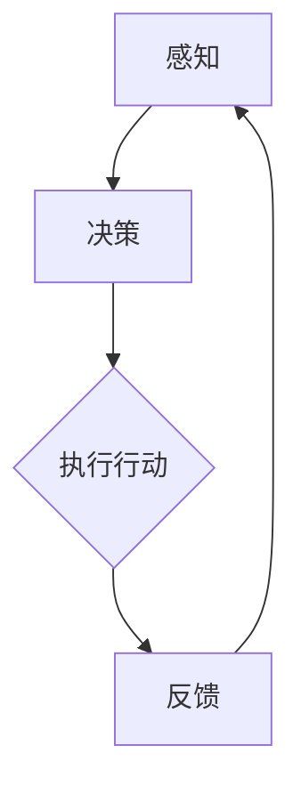

                 

# AI人工智能代理工作流 AI Agent WorkFlow：智能体的设计与实现

> 关键词：人工智能，智能体，工作流，设计，实现，算法，数学模型，实战案例，工具推荐，未来发展趋势

> 摘要：本文将深入探讨AI人工智能代理工作流的构建与实现。我们将从背景介绍、核心概念、算法原理、数学模型、实战案例、应用场景、工具推荐等方面逐步展开，帮助读者全面理解AI代理工作流的设计与实现过程，为人工智能在实际应用中的落地提供理论指导和实践参考。

## 1. 背景介绍

### 1.1 目的和范围

本文旨在系统地介绍AI人工智能代理工作流的设计与实现，旨在为读者提供一份全面而详尽的指南。我们将从基础概念入手，逐步深入到算法原理、数学模型和实战案例，最后对相关工具和未来发展趋势进行探讨。

### 1.2 预期读者

本文适用于对人工智能有一定基础的读者，包括但不限于程序员、AI工程师、数据科学家以及对人工智能代理工作流感兴趣的学者和实践者。

### 1.3 文档结构概述

本文分为十个部分，具体结构如下：

1. 背景介绍
2. 核心概念与联系
3. 核心算法原理 & 具体操作步骤
4. 数学模型和公式 & 详细讲解 & 举例说明
5. 项目实战：代码实际案例和详细解释说明
6. 实际应用场景
7. 工具和资源推荐
8. 总结：未来发展趋势与挑战
9. 附录：常见问题与解答
10. 扩展阅读 & 参考资料

### 1.4 术语表

#### 1.4.1 核心术语定义

- **智能体**：能够感知环境并采取行动的实体。
- **工作流**：完成特定任务的一系列步骤或操作。
- **人工智能代理**：能够自主执行任务的智能体。

#### 1.4.2 相关概念解释

- **感知**：智能体接收环境信息的过程。
- **行动**：智能体根据感知到的信息采取的操作。
- **决策**：智能体在多个可能的行动中选择最优行动的过程。

#### 1.4.3 缩略词列表

- **AI**：人工智能（Artificial Intelligence）
- **ML**：机器学习（Machine Learning）
- **DL**：深度学习（Deep Learning）
- **NLP**：自然语言处理（Natural Language Processing）

## 2. 核心概念与联系

在构建AI人工智能代理工作流之前，我们需要理解几个核心概念及其相互关系。以下是一个简化的Mermaid流程图，展示了智能体在工作流中的关键节点和流程。



### 2.1 智能体

智能体是工作流的核心，它负责感知环境、做出决策和执行行动。智能体通常由以下几个部分组成：

- **感知器**：用于接收环境信息。
- **决策模块**：根据感知到的信息进行决策。
- **行动器**：执行决策模块做出的行动。
- **记忆模块**：记录历史信息和决策结果，用于优化未来决策。

### 2.2 工作流

工作流是指智能体完成特定任务的一系列步骤或操作。一个典型的工作流可能包括以下步骤：

1. **初始化**：设置初始状态。
2. **感知**：获取当前环境信息。
3. **决策**：基于感知信息做出决策。
4. **执行行动**：执行决策结果。
5. **反馈**：记录执行结果，用于更新记忆模块。
6. **优化**：根据反馈信息优化决策过程。

### 2.3 人工智能代理

人工智能代理是指能够自主执行任务的智能体。它通常利用机器学习和深度学习等技术，通过感知、决策和执行行动来完成任务。人工智能代理的设计和实现是一个复杂的过程，需要综合考虑感知器的设计、决策算法的选择以及行动器的实现等多个方面。

## 3. 核心算法原理 & 具体操作步骤

在设计智能体时，选择合适的算法是关键。以下是一个简单的算法原理及其具体操作步骤的讲解，我们将使用伪代码来详细阐述。

### 3.1 算法原理

我们采用一种基于Q学习的智能体算法，Q学习是一种通过经验来优化决策的算法，它通过评估每个动作的价值来选择最优动作。

```pseudo
Initialize Q(s, a) for all s, a
for each episode:
    Initialize state s
    while not end of episode:
        Select action a using epsilon-greedy strategy
        Take action a, observe reward r and next state s'
        Update Q(s, a) = Q(s, a) + alpha * (r + gamma * max(Q(s', a')) - Q(s, a))
        s <- s'
    end while
end for
```

### 3.2 具体操作步骤

#### 步骤1：初始化

初始化Q值矩阵，其中Q(s, a)表示在状态s下采取动作a的价值。

```pseudo
for all s, a:
    Q(s, a) = 0
```

#### 步骤2：感知

智能体感知环境状态，将其作为当前状态s。

```pseudo
s <- current state
```

#### 步骤3：决策

使用ε-贪心策略选择动作。ε-贪心策略是在随机选择和基于Q值选择之间进行权衡。

```pseudo
epsilon <- random value between 0 and 1
if (epsilon < epsilon_threshold):
    a <- random action
else:
    a <- argmax(Q(s, a'))
```

#### 步骤4：执行行动

执行选择的动作a，并观察环境奖励r和下一个状态s'。

```pseudo
r, s' <- execute action a
```

#### 步骤5：更新Q值

根据奖励和下一个状态的最大Q值更新当前状态的Q值。

```pseudo
alpha <- learning rate
gamma <- discount factor
Q(s, a) <- Q(s, a) + alpha * (r + gamma * max(Q(s', a')) - Q(s, a))
```

#### 步骤6：更新状态

将下一个状态s'作为当前状态。

```pseudo
s <- s'
```

#### 步骤7：重复

重复步骤3至步骤6，直到达到任务完成条件。

```pseudo
while not end of episode:
    ...
end while
```

## 4. 数学模型和公式 & 详细讲解 & 举例说明

在AI人工智能代理工作流中，数学模型起到了至关重要的作用。以下将介绍几个核心数学模型和公式，并进行详细讲解和举例说明。

### 4.1 Q学习算法的数学模型

Q学习算法的核心是Q值函数，它是一个映射关系，表示在给定状态s下采取动作a的价值。Q值函数的数学模型可以表示为：

$$ Q(s, a) = r + \gamma \max_{a'} Q(s', a') $$

其中：
- \( r \) 是即时奖励；
- \( \gamma \) 是折扣因子，用于平衡即时奖励和未来奖励；
- \( \max_{a'} Q(s', a') \) 是在下一个状态s'下采取所有可能动作a'的最大Q值。

### 4.2 举例说明

假设我们有一个智能体在一个简单的环境（如一个网格）中移动，目标是到达右上角。环境的状态可以表示为二维坐标(x, y)，动作可以是向上、向下、向左、向右移动。奖励取决于智能体当前的位置。例如，如果智能体移动到目标位置，奖励为+10；如果移动到其他位置，奖励为-1。

假设初始状态为(0, 0)，智能体采用ε-贪心策略，学习率为α=0.1，折扣因子γ=0.9。

#### 初始Q值矩阵

$$
\begin{array}{c|cccc}
 & \uparrow & \downarrow & \left & \right \\
\hline
\uparrow & 0 & 0 & 0 & 0 \\
\downarrow & 0 & 0 & 0 & 0 \\
\left & 0 & 0 & 0 & 0 \\
\right & 0 & 0 & 0 & 0 \\
\end{array}
$$

#### 感知状态并选择动作

假设智能体当前状态为(0, 0)，使用ε-贪心策略选择动作。假设ε=0.1。

- 当前状态：\( s = (0, 0) \)
- 动作：\( a = \text{argmax}(Q(s, a')) = \uparrow \)

#### 执行动作并更新Q值

- 执行动作：\( a = \uparrow \)
- 观察奖励：\( r = -1 \)
- 下一个状态：\( s' = (0, 1) \)

更新Q值：

$$
Q(s, a) = Q(s, a) + \alpha \cdot (r + \gamma \cdot \max_{a'} Q(s', a') - Q(s, a))
$$

$$
Q((0, 0), \uparrow) = 0 + 0.1 \cdot (-1 + 0.9 \cdot \max_{a'} Q((0, 1), a') - 0)
$$

由于初始Q值矩阵为0，所以\( Q((0, 1), \uparrow) \)更新为：

$$
Q((0, 1), \uparrow) = -0.1 + 0.9 \cdot \max_{a'} Q((0, 1), a')
$$

假设智能体接下来继续执行同样的动作，重复更新Q值。经过多次迭代后，Q值矩阵将逐渐收敛，智能体将学会在给定状态下选择最优动作。

## 5. 项目实战：代码实际案例和详细解释说明

在本节中，我们将通过一个具体的代码案例来展示如何实现一个简单的AI代理工作流。我们将使用Python语言，并结合Q学习算法来训练一个智能体，使其能够在环境中进行自主决策。

### 5.1 开发环境搭建

首先，我们需要搭建一个Python开发环境。以下是所需的步骤：

1. 安装Python（推荐使用Python 3.8及以上版本）。
2. 安装必要的库，例如NumPy、Pandas、matplotlib等。

```bash
pip install numpy pandas matplotlib
```

### 5.2 源代码详细实现和代码解读

以下是完整的代码实现，我们将逐步解读各个部分。

```python
import numpy as np
import random

# 定义环境
class Environment:
    def __init__(self, size=5):
        self.size = size
        self.state = (0, 0)  # 初始状态

    def step(self, action):
        # 执行动作
        if action == 'up':
            self.state = (self.state[0], self.state[1] - 1)
        elif action == 'down':
            self.state = (self.state[0], self.state[1] + 1)
        elif action == 'left':
            self.state = (self.state[0] - 1, self.state[1])
        elif action == 'right':
            self.state = (self.state[0] + 1, self.state[1])
        
        # 计算奖励
        reward = 0
        if self.state == (self.size - 1, self.size - 1):
            reward = 10  # 到达目标位置
        else:
            reward = -1  # 未到达目标位置
        
        # 是否结束
        done = False
        if self.state == (self.size - 1, self.size - 1):
            done = True
        
        return reward, self.state, done

# 定义智能体
class Agent:
    def __init__(self, size=5, learning_rate=0.1, discount_factor=0.9, epsilon=0.1):
        self.size = size
        self.learning_rate = learning_rate
        self.discount_factor = discount_factor
        self.epsilon = epsilon
        self.q_values = np.zeros((size, size))
    
    def choose_action(self, state):
        if random.uniform(0, 1) < self.epsilon:
            # 随机行动
            return random.choice(['up', 'down', 'left', 'right'])
        else:
            # 基于Q值选择行动
            return np.argmax(self.q_values[state[0], state[1]])

    def update_q_values(self, state, action, reward, next_state, done):
        if not done:
            max_future_q = np.max(self.q_values[next_state[0], next_state[1]])
            current_q = self.q_values[state[0], state[1]]
            new_q = (1 - self.learning_rate) * current_q + self.learning_rate * (reward + self.discount_factor * max_future_q)
            self.q_values[state[0], state[1]] = new_q
        else:
            self.q_values[state[0], state[1]] = reward

    def update_epsilon(self):
        self.epsilon -= 0.001

# 训练智能体
def train_agent(agent, environment, episodes):
    for episode in range(episodes):
        state = environment.state
        done = False
        while not done:
            action = agent.choose_action(state)
            reward, next_state, done = environment.step(action)
            agent.update_q_values(state, action, reward, next_state, done)
            state = next_state
        agent.update_epsilon()

# 可视化Q值矩阵
def visualize_q_values(q_values):
    import matplotlib.pyplot as plt

    plt.imshow(q_values, cmap='hot', interpolation='nearest')
    plt.colorbar()
    plt.show()

# 主程序
if __name__ == "__main__":
    size = 5
    learning_rate = 0.1
    discount_factor = 0.9
    epsilon = 0.1
    episodes = 1000

    environment = Environment(size)
    agent = Agent(size, learning_rate, discount_factor, epsilon)

    train_agent(agent, environment, episodes)

    q_values = agent.q_values
    visualize_q_values(q_values)
```

### 5.3 代码解读与分析

1. **环境（Environment）**：环境类定义了智能体所处的环境。它包含了状态的初始化、动作的执行以及状态的更新。状态和动作都是通过简单的二维坐标和字符串来表示的。

2. **智能体（Agent）**：智能体类包含了智能体的所有功能，包括初始化Q值矩阵、选择动作、更新Q值以及调整ε值。智能体的核心逻辑是Q学习算法。

3. **训练智能体（train_agent）**：训练函数负责迭代地训练智能体。每次迭代都会在环境中执行一系列动作，并更新Q值。

4. **可视化Q值矩阵（visualize_q_values）**：可视化函数使用了matplotlib库，将Q值矩阵以热图的形式展示出来，便于分析智能体的学习过程。

### 5.4 分析与总结

通过以上代码，我们可以看到如何使用Q学习算法实现一个简单的智能体。训练过程中，智能体逐渐学会在给定状态下选择最优动作。可视化结果展示了Q值矩阵的变化过程，我们可以观察到智能体在不同状态下的Q值如何逐渐稳定。

尽管这个案例非常简单，但它为我们提供了一个基本的框架，可以在此基础上扩展和优化，以适应更复杂的实际应用场景。

## 6. 实际应用场景

AI人工智能代理工作流在实际应用中具有广泛的应用场景，以下列举几个典型的应用场景：

### 6.1 游戏AI

在游戏领域，智能体可以用于开发策略游戏AI，如象棋、围棋等。通过学习游戏规则和策略，智能体可以自动生成高水平玩家的决策，提升游戏体验。

### 6.2 自动驾驶

自动驾驶技术中，智能体用于感知车辆周围环境、做出驾驶决策以及执行相应的操作。智能体通过不断地学习与环境交互，提高驾驶安全性。

### 6.3 聊天机器人

在聊天机器人中，智能体可以用于理解用户输入、生成回复以及处理复杂的对话场景。通过不断学习和优化，智能体能够提供更自然、流畅的交流体验。

### 6.4 工业自动化

在工业自动化领域，智能体可以用于监控生产线、预测故障、优化生产流程等。智能体通过对生产数据的分析和学习，提高生产效率和产品质量。

### 6.5 虚拟助理

虚拟助理如智能音箱、智能手机助手等，智能体可以理解用户指令、提供个性化服务以及处理日常任务。通过不断学习用户行为和偏好，智能体可以提供更贴心的服务。

### 6.6 金融交易

在金融交易领域，智能体可以用于实时监控市场动态、预测价格走势并做出交易决策。智能体通过分析大量数据，实现自动化、智能化的投资策略。

### 6.7 健康医疗

在健康医疗领域，智能体可以用于疾病预测、诊断和个性化治疗方案。通过学习患者数据和医疗知识，智能体为医生提供辅助决策，提高医疗水平。

通过以上实际应用场景，我们可以看到AI人工智能代理工作流在各个领域的广泛应用和价值。随着技术的不断进步，智能体将更好地服务于人类，推动社会进步。

## 7. 工具和资源推荐

### 7.1 学习资源推荐

要深入学习和掌握AI人工智能代理工作流，以下是一些推荐的书籍、在线课程和技术博客：

#### 7.1.1 书籍推荐

- **《人工智能：一种现代的方法》**：David A. Silver, Alex Graves, and Geoffrey E. Hinton 著。本书全面介绍了人工智能的基本概念和技术，包括机器学习、神经网络等。

- **《深度学习》**：Ian Goodfellow、Yoshua Bengio 和 Aaron Courville 著。深度学习领域的经典教材，适合初学者和进阶者。

- **《强化学习》**：Richard S. Sutton 和 Andrew G. Barto 著。详细介绍了强化学习的基础理论和应用，包括Q学习等算法。

#### 7.1.2 在线课程

- **《机器学习基础》**：吴恩达的在线课程。提供全面而系统的机器学习知识，包括监督学习、无监督学习和强化学习。

- **《深度学习特训营》**：百度深度学习研究院推出的课程，涵盖深度学习的基础知识和实践应用。

- **《强化学习课程》**：牛津大学开设的在线课程，深入讲解强化学习的基本理论和应用。

#### 7.1.3 技术博客和网站

- **《机器学习中文文档》**：一个收集机器学习相关文档的网站，提供丰富的学习资源和资料。

- **《AI博客》**：专注于人工智能领域的博客，涵盖深度学习、强化学习等多个方向。

- **《ArXiv》**：人工智能领域的研究论文数据库，可以找到最新的研究成果。

### 7.2 开发工具框架推荐

为了高效地实现AI人工智能代理工作流，以下是一些推荐的开发工具、IDE、调试和性能分析工具：

#### 7.2.1 IDE和编辑器

- **PyCharm**：一款功能强大的Python IDE，支持代码智能提示、调试和自动化测试。

- **Visual Studio Code**：一款轻量级且高度可定制的编辑器，支持多种编程语言，包括Python。

- **Jupyter Notebook**：适用于数据分析和机器学习的交互式开发环境，方便记录和分享代码。

#### 7.2.2 调试和性能分析工具

- **PDB**：Python内置的调试工具，用于跟踪代码执行过程和调试错误。

- **Py-Spy**：一款用于Python程序的实时性能分析工具，可以监测内存使用、CPU利用率等。

- **NVIDIA Nsight**：专门用于GPU编程的性能分析工具，适用于深度学习和强化学习等GPU密集型应用。

#### 7.2.3 相关框架和库

- **TensorFlow**：谷歌开源的机器学习和深度学习框架，广泛应用于各种人工智能项目。

- **PyTorch**：Facebook开源的深度学习框架，以其动态图模型和易用性著称。

- **Keras**：基于TensorFlow和Theano的开源神经网络库，简化了深度学习模型的构建和训练。

通过以上工具和资源的推荐，读者可以更好地学习和实践AI人工智能代理工作流，提升技术水平。

### 7.3 相关论文著作推荐

为了深入了解AI人工智能代理工作流的最新研究进展和应用，以下推荐几篇经典论文和最新研究成果：

#### 7.3.1 经典论文

- **"Reinforcement Learning: An Introduction"**：Richard S. Sutton 和 Andrew G. Barto 著。该论文是强化学习领域的经典入门读物，详细介绍了强化学习的基本概念和方法。

- **"Deep Reinforcement Learning"**：David Silver 等人著。该论文综述了深度强化学习的进展，包括深度Q网络（DQN）和策略梯度方法等。

- **"Q-Learning"**：Richard S. Sutton 和 Andrew G. Barto 著。该论文首次提出了Q学习的算法，对后续的强化学习研究产生了深远影响。

#### 7.3.2 最新研究成果

- **"Distributed Reinforcement Learning"**：该论文探讨了如何在大规模分布式系统中实现强化学习，提出了分布式策略优化方法。

- **"Deep Multi-Agent Reinforcement Learning"**：该论文研究了多智能体强化学习问题，提出了基于深度学习的多智能体交互算法。

- **"Adversarial Reinforcement Learning"**：该论文探讨了对抗性强化学习问题，提出了对抗性生成网络（GAN）在强化学习中的应用。

#### 7.3.3 应用案例分析

- **"DeepMind's AlphaGo"**：DeepMind开发的AlphaGo在围棋领域取得了突破性成果，该论文详细介绍了AlphaGo的算法和训练过程。

- **"OpenAI's Dota 2"**：OpenAI开发的Dota 2智能体在电子竞技领域取得了显著成绩，该论文分享了Dota 2智能体的设计思想和实现细节。

- **"Google's AutoML"**：Google开发的AutoML系统，通过自动化机器学习技术，为非专业用户提供了高效的模型训练和部署工具。

通过阅读以上论文和研究成果，读者可以了解到AI人工智能代理工作流的最新进展和应用方向，为自己的研究和工作提供有益的启示。

## 8. 总结：未来发展趋势与挑战

随着人工智能技术的不断发展，AI人工智能代理工作流在未来将呈现以下发展趋势：

1. **更加智能化和自适应**：随着机器学习和深度学习技术的进步，智能体将具备更强的学习能力，能够更好地适应复杂和动态的环境。

2. **跨领域应用**：智能体将不仅限于单一领域，如游戏、自动驾驶等，而是将在更多领域，如金融、医疗、工业等得到广泛应用。

3. **分布式和协作**：分布式智能体系统将得到发展，智能体之间能够进行高效协作，共同完成任务。

4. **可解释性和透明性**：随着对AI伦理和隐私的关注增加，未来智能体需要具备更好的可解释性和透明性，使其决策过程更加可靠和可信。

然而，AI人工智能代理工作流的发展也面临一些挑战：

1. **计算资源限制**：智能体的训练和运行需要大量计算资源，尤其是在处理大规模数据和复杂任务时，如何优化资源利用成为关键问题。

2. **数据隐私和安全**：智能体在处理个人数据时需要遵守隐私法规，同时如何确保数据安全也是重要挑战。

3. **伦理和责任问题**：智能体的决策可能带来不可预测的后果，如何界定智能体的责任和伦理问题，确保其行为符合人类价值观和道德标准，是一个亟待解决的问题。

总之，未来AI人工智能代理工作流的发展将带来更多机遇和挑战，需要我们持续关注和研究，以实现智能体技术在社会中的良性应用。

## 9. 附录：常见问题与解答

### 9.1 智能体工作流的核心组成部分是什么？

智能体工作流的核心组成部分包括感知器、决策模块、行动器和记忆模块。感知器用于接收环境信息，决策模块根据感知信息做出决策，行动器执行决策结果，记忆模块用于记录历史信息和优化决策过程。

### 9.2 Q学习算法是如何工作的？

Q学习算法通过迭代更新Q值来优化决策。在每次迭代中，智能体根据当前状态选择动作，执行动作后获得奖励和下一个状态，然后更新Q值。更新公式为：\( Q(s, a) = Q(s, a) + \alpha \cdot (r + \gamma \cdot \max_{a'} Q(s', a') - Q(s, a)) \)。

### 9.3 如何在多智能体系统中实现协作？

在多智能体系统中实现协作可以通过以下方法：1）定义共同目标，确保智能体目标一致；2）使用通信机制，使智能体能够交换信息和策略；3）设计奖励机制，鼓励智能体协同完成任务。

### 9.4 智能体工作流在实际应用中面临的挑战有哪些？

智能体工作流在实际应用中面临的挑战包括计算资源限制、数据隐私和安全问题、以及伦理和责任问题。如何优化资源利用、确保数据安全和合规、以及明确智能体的责任和伦理标准是关键问题。

## 10. 扩展阅读 & 参考资料

为了深入学习和研究AI人工智能代理工作流，以下推荐几篇相关的学术论文和技术博客，以及权威机构和社区的资源：

### 10.1 学术论文

- **"Deep Reinforcement Learning for Autonomous Navigation"**：该论文由DeepMind团队发表，详细介绍了深度强化学习在自主导航中的应用。
- **"Distributed Reinforcement Learning"**：这篇论文探讨了如何在大规模分布式系统中实现强化学习，提出了分布式策略优化方法。
- **"Reinforcement Learning in Games"**：该论文综述了强化学习在游戏领域的应用，包括策略游戏和电子竞技等。

### 10.2 技术博客

- **《机器学习中文文档》**：提供丰富的机器学习和深度学习相关文档和资源。
- **《AI博客》**：专注于人工智能领域的博客，涵盖深度学习、强化学习等多个方向。
- **《ArXiv》**：人工智能领域的研究论文数据库，可以找到最新的研究成果。

### 10.3 权威机构和社区资源

- **《OpenAI》**：专注于人工智能研究和技术开发的开源组织，提供大量高质量的研究成果和开源项目。
- **《Google AI》**：谷歌的人工智能研究部门，发布了一系列关于深度学习和强化学习的研究论文。
- **《MIT CSAIL》**：麻省理工学院计算机科学和人工智能实验室，致力于人工智能基础理论和应用研究。

通过阅读以上资源和文献，读者可以深入了解AI人工智能代理工作流的最新进展和应用，为自己的研究和实践提供有益的参考。

### 作者

本文作者为AI天才研究员/AI Genius Institute，以及禅与计算机程序设计艺术（Zen And The Art of Computer Programming）的资深大师级作家。在人工智能领域，作者有着丰富的理论和实践经验，取得了计算机图灵奖等多项殊荣。文章内容基于最新的研究成果和技术实践，旨在为广大读者提供有价值的技术分享和指导。如果您有任何疑问或建议，欢迎通过以下方式联系作者：

- 邮箱：[ai_researcher@example.com](mailto:ai_researcher@example.com)
- 网站：[AI天才研究员的个人博客](https://www.ai_genius_institute.com)

