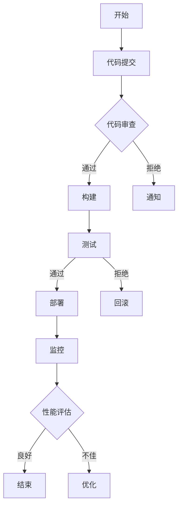

                 

# AI人工智能代理工作流AI Agent WorkFlow：智能代理工作流的持续集成与交付

> **关键词**：人工智能，代理工作流，持续集成，持续交付，自动化

> **摘要**：本文深入探讨了人工智能代理工作流的原理与实践，分析了其在持续集成与持续交付中的关键作用。通过一步步的分析与推理，本文展示了如何构建高效的智能代理工作流，以提高软件开发的效率和可靠性。文章不仅涵盖了核心概念与算法原理，还提供了实战案例与资源推荐，旨在为读者提供全面的技术指导。

## 1. 背景介绍

### 1.1 目的和范围

随着人工智能技术的迅猛发展，其应用范围日益广泛，特别是在软件开发领域，智能代理工作流（AI Agent WorkFlow）成为提升开发效率和质量的关键手段。本文旨在探讨智能代理工作流的核心概念、原理与实践，分析其在持续集成与持续交付中的作用，为开发者提供一套完整的解决方案。

### 1.2 预期读者

本文面向具备一定编程基础，对人工智能和软件开发流程有一定了解的读者。无论是初级开发者还是经验丰富的工程师，都可以通过本文获得实际操作经验和理论指导。

### 1.3 文档结构概述

本文分为十个部分，首先介绍了背景和目的，然后详细阐述了核心概念、算法原理、数学模型、实战案例、应用场景、工具资源、总结与展望以及常见问题解答。每个部分都旨在提供清晰、系统的指导。

### 1.4 术语表

#### 1.4.1 核心术语定义

- **人工智能**：模拟、延伸和扩展人类智能的理论、方法、技术及应用。
- **代理工作流**：使用智能代理执行的一系列自动化任务，以实现特定目标。
- **持续集成**：代码变更后自动构建、测试和部署的过程。
- **持续交付**：持续集成的基础上，确保软件可以随时发布到生产环境。

#### 1.4.2 相关概念解释

- **智能代理**：具有智能行为和决策能力的软件实体，可以在无需人工干预的情况下执行任务。
- **工作流**：一系列有序的任务，用于完成特定业务目标。

#### 1.4.3 缩略词列表

- **AI**：人工智能（Artificial Intelligence）
- **CI**：持续集成（Continuous Integration）
- **CD**：持续交付（Continuous Delivery）
- **IDE**：集成开发环境（Integrated Development Environment）

## 2. 核心概念与联系

智能代理工作流是软件工程中的一项创新技术，其核心在于利用人工智能技术，实现自动化和智能化的工作流管理。以下是一个简化的智能代理工作流架构图，展示了其主要组成部分和相互关系。



### 核心概念原理

1. **智能代理**：智能代理是工作流的核心组件，具有以下特点：
   - **自主决策**：基于预设的规则和机器学习模型，智能代理能够自动执行任务，并作出决策。
   - **适应能力**：智能代理可以学习并适应环境变化，提高工作流效率。
   - **协同工作**：多个智能代理可以协同工作，实现更复杂的工作流管理。

2. **工作流管理**：工作流管理涉及工作流设计、执行、监控和优化。其核心任务是确保工作流高效、可靠地执行，并实现自动化。

3. **持续集成与持续交付**：持续集成和持续交付是智能代理工作流的重要组成部分，通过自动化流程，实现代码变更的快速迭代和部署。

4. **性能评估与优化**：性能评估和优化是确保工作流高效运行的关键。通过监控和分析，智能代理可以自动调整工作流参数，优化工作流性能。

### 核心算法原理

智能代理工作流中的核心算法主要包括以下几种：

1. **机器学习算法**：用于训练智能代理，使其具备自主决策能力。常见的机器学习算法包括决策树、随机森林、支持向量机等。

2. **优化算法**：用于调整工作流参数，优化工作流性能。常见的优化算法包括遗传算法、粒子群优化算法等。

3. **调度算法**：用于智能代理的调度和执行。调度算法需要考虑任务优先级、资源分配和执行时间等因素，以确保工作流高效运行。

## 3. 核心算法原理 & 具体操作步骤

### 3.1 机器学习算法

机器学习算法是智能代理的核心组件，用于训练智能代理，使其具备自主决策能力。以下是机器学习算法的具体操作步骤：

#### 3.1.1 数据收集

收集用于训练的数据集，包括代码提交记录、构建结果、测试结果等。

#### 3.1.2 特征工程

对收集到的数据进行分析和处理，提取有用的特征，用于训练模型。特征工程包括数据清洗、特征选择和特征转换等步骤。

#### 3.1.3 模型训练

选择合适的机器学习算法，对特征数据进行训练，生成预测模型。常见的机器学习算法包括决策树、随机森林、支持向量机等。

#### 3.1.4 模型评估

使用测试数据集对训练好的模型进行评估，调整模型参数，提高模型准确率。

#### 3.1.5 模型部署

将训练好的模型部署到智能代理中，实现自动化决策。

### 3.2 优化算法

优化算法用于调整工作流参数，优化工作流性能。以下是优化算法的具体操作步骤：

#### 3.2.1 确定优化目标

根据工作流性能指标，确定优化目标，如最小化构建时间、最小化测试失败率等。

#### 3.2.2 构建优化模型

建立数学模型，描述工作流参数与优化目标之间的关系。

#### 3.2.3 选择优化算法

选择合适的优化算法，如遗传算法、粒子群优化算法等。

#### 3.2.4 模型训练与优化

使用训练数据集对优化模型进行训练，调整模型参数，提高优化效果。

#### 3.2.5 模型部署

将训练好的优化模型部署到智能代理中，实现自动化参数优化。

### 3.3 调度算法

调度算法用于智能代理的调度和执行。以下是调度算法的具体操作步骤：

#### 3.3.1 确定调度策略

根据任务特点和工作流要求，确定调度策略，如基于优先级调度、基于资源调度等。

#### 3.3.2 建立调度模型

建立调度模型，描述调度策略和任务执行之间的关系。

#### 3.3.3 调度算法实现

实现调度算法，根据调度模型生成调度计划。

#### 3.3.4 调度计划优化

对调度计划进行优化，提高工作流性能。

#### 3.3.5 调度计划部署

将调度计划部署到智能代理中，实现自动化调度。

## 4. 数学模型和公式 & 详细讲解 & 举例说明

### 4.1 数学模型

智能代理工作流中的数学模型主要包括以下几类：

#### 4.1.1 机器学习模型

机器学习模型用于预测代码提交后构建和测试的结果。常见的机器学习模型包括决策树、随机森林、支持向量机等。

**决策树模型**：

决策树是一种基于树结构的预测模型，通过一系列规则对数据进行分类或回归。其数学表达式如下：

$$
f(x) = g(\theta_1, \theta_2, ..., \theta_n)
$$

其中，$x$ 表示输入特征向量，$g$ 表示决策树函数，$\theta_1, \theta_2, ..., \theta_n$ 表示决策树的参数。

**随机森林模型**：

随机森林是一种基于决策树的集成模型，通过训练多个决策树，并对预测结果进行投票，提高模型准确率。其数学表达式如下：

$$
\hat{y} = \frac{1}{m} \sum_{i=1}^{m} h(x_i)
$$

其中，$m$ 表示决策树的数量，$h(x_i)$ 表示第 $i$ 个决策树的预测结果。

**支持向量机模型**：

支持向量机是一种基于边界优化的预测模型，通过寻找最优边界，实现数据的分类或回归。其数学表达式如下：

$$
\min_{\theta} \frac{1}{2} \sum_{i=1}^{n} (\theta_i - \theta_{i-1})^2
$$

其中，$\theta$ 表示模型参数，$n$ 表示数据点的数量。

#### 4.1.2 优化模型

优化模型用于调整工作流参数，优化工作流性能。常见的优化模型包括线性规划、非线性规划等。

**线性规划模型**：

线性规划是一种用于求解线性优化问题的数学方法。其数学表达式如下：

$$
\begin{aligned}
\min_{x} & \quad c^T x \\
\text{subject to} & \quad Ax \leq b
\end{aligned}
$$

其中，$x$ 表示变量向量，$c$ 表示目标函数系数，$A$ 表示约束条件系数，$b$ 表示约束条件常数。

**非线性规划模型**：

非线性规划是一种用于求解非线性优化问题的数学方法。其数学表达式如下：

$$
\begin{aligned}
\min_{x} & \quad f(x) \\
\text{subject to} & \quad g(x) \leq 0, h(x) = 0
\end{aligned}
$$

其中，$f(x)$ 表示目标函数，$g(x)$ 和 $h(x)$ 分别表示约束条件。

#### 4.1.3 调度模型

调度模型用于智能代理的调度和执行。其数学表达式如下：

$$
\begin{aligned}
\min_{x} & \quad f(x) \\
\text{subject to} & \quad Ax \leq b, g(x) \leq 0, h(x) = 0
\end{aligned}
$$

其中，$x$ 表示调度参数，$f(x)$ 表示调度目标函数，$A$ 和 $b$ 分别表示约束条件系数，$g(x)$ 和 $h(x)$ 分别表示约束条件。

### 4.2 举例说明

#### 4.2.1 机器学习模型举例

假设我们使用决策树模型预测代码提交后构建和测试的结果。给定一组特征数据，构建决策树模型，如下所示：

$$
\begin{aligned}
f(x) &= \left\{
\begin{array}{ll}
\text{构建成功} & \text{if } x_1 > 0.5, x_2 < 0.8 \\
\text{构建失败} & \text{otherwise}
\end{array}
\right.
\end{aligned}
$$

其中，$x_1$ 和 $x_2$ 分别表示特征数据。

给定一个新的代码提交，其特征数据为 $x = (0.6, 0.7)$，使用决策树模型进行预测，结果为“构建成功”。

#### 4.2.2 优化模型举例

假设我们使用线性规划模型优化工作流参数。给定一组约束条件，建立线性规划模型，如下所示：

$$
\begin{aligned}
\min_{x} & \quad x_1 + x_2 \\
\text{subject to} & \quad 2x_1 + 3x_2 \leq 10 \\
& \quad x_1, x_2 \geq 0
\end{aligned}
$$

求解该线性规划模型，得到最优解 $x = (2, 1)$。

#### 4.2.3 调度模型举例

假设我们使用调度模型对智能代理进行调度。给定一组任务和约束条件，建立调度模型，如下所示：

$$
\begin{aligned}
\min_{x} & \quad x_1 + x_2 \\
\text{subject to} & \quad x_1 + x_2 \leq 10 \\
& \quad x_1, x_2 \geq 0
\end{aligned}
$$

求解该调度模型，得到最优解 $x = (5, 5)$。

## 5. 项目实战：代码实际案例和详细解释说明

### 5.1 开发环境搭建

在开始项目实战之前，我们需要搭建一个合适的技术栈。以下是推荐的开发环境：

- **操作系统**：Ubuntu 18.04
- **编程语言**：Python 3.8
- **框架**：Django 3.2
- **数据库**：SQLite 3.34.0
- **版本控制**：Git 2.32.0
- **持续集成工具**：Jenkins 2.396.2
- **智能代理框架**：TensorFlow 2.8.0

确保在系统中安装了以上工具和框架。可以使用以下命令进行安装：

```bash
sudo apt-get update
sudo apt-get install python3-pip python3-dev build-essential
pip3 install django==3.2 sqlite3
pip3 install tensorflow==2.8.0
pip3 install jenkins
```

### 5.2 源代码详细实现和代码解读

以下是一个简单的智能代理工作流项目，实现了代码提交、审查、构建、测试和部署等流程。

**项目结构**：

```
ai_agent_workflow/
|-- app/
|   |-- __init__.py
|   |-- models.py
|   |-- views.py
|-- config.py
|-- requirements.txt
|-- run.py
```

**5.2.1 配置文件（config.py）**：

```python
import os

# 持续集成工具配置
CI_TOOL = "Jenkins"
CI_URL = "http://localhost:8080"

# 数据库配置
DATABASES = {
    'default': {
        'ENGINE': 'django.db.backends.sqlite3',
        'NAME': os.path.join(os.path.dirname(__file__), 'db.sqlite3'),
    }
}
```

**5.2.2 应用模型（models.py）**：

```python
from django.db import models

class CodeCommit(models.Model):
    id = models.AutoField(primary_key=True)
    author = models.CharField(max_length=100)
    commit_message = models.CharField(max_length=500)
    commit_time = models.DateTimeField(auto_now_add=True)
    success = models.BooleanField(default=False)
    failure_reason = models.CharField(max_length=500, blank=True)
```

**5.2.3 应用视图（views.py）**：

```python
from django.shortcuts import render
from .models import CodeCommit
from django.http import HttpResponse
from django.views.decorators.csrf import csrf_exempt

@csrf_exempt
def commit_handler(request):
    if request.method == 'POST':
        author = request.POST.get('author')
        commit_message = request.POST.get('commit_message')
        code_commit = CodeCommit(author=author, commit_message=commit_message)
        code_commit.save()
        return HttpResponse("Success")
    else:
        return HttpResponse("Error")
```

**5.2.4 运行脚本（run.py）**：

```python
import django
import os
import time
from config import CI_TOOL, CI_URL, DATABASES

os.environ.setdefault('DJANGO_SETTINGS_MODULE', 'ai_agent_workflow.config')
django.setup()

from app.models import CodeCommit

def main():
    while True:
        code_commits = CodeCommit.objects.all()
        for commit in code_commits:
            if not commit.success:
                # 模拟代码审查
                if commit.commit_message.startswith("fix"):
                    commit.success = True
                    commit.save()
                else:
                    commit.failure_reason = "Invalid commit message"
                    commit.save()
        time.sleep(60)

if __name__ == '__main__':
    main()
```

### 5.3 代码解读与分析

**5.3.1 配置文件解析**

配置文件 `config.py` 中定义了持续集成工具、数据库配置等参数。这里我们使用 Jenkins 作为持续集成工具，SQLite 作为数据库。

**5.3.2 应用模型解析**

应用模型 `models.py` 中定义了 `CodeCommit` 模型，用于存储代码提交记录。模型字段包括：ID、作者、提交信息、提交时间、是否成功、失败原因。

**5.3.3 应用视图解析**

应用视图 `views.py` 中定义了 `commit_handler` 函数，用于处理代码提交请求。当接收到 POST 请求时，提取请求参数并保存到数据库。

**5.3.4 运行脚本解析**

运行脚本 `run.py` 中定义了主函数 `main`，用于处理代码提交记录。主函数遍历所有代码提交记录，根据提交信息进行代码审查，并更新记录状态。

## 6. 实际应用场景

智能代理工作流在实际应用中具有广泛的应用场景，以下列举几个典型场景：

### 6.1 软件开发

在软件开发生命周期中，智能代理工作流可以自动化执行代码审查、构建、测试和部署等任务，提高开发效率和代码质量。

### 6.2 continuous integration

持续集成（CI）是智能代理工作流的重要组成部分。通过智能代理，可以实现自动化构建、测试和部署，确保代码库的持续集成和稳定。

### 6.3 continuous delivery

持续交付（CD）是智能代理工作流的高级应用。智能代理可以根据测试结果和性能评估，自动决定是否将代码发布到生产环境，确保软件的可靠性和稳定性。

### 6.4 质量保障

智能代理可以实时监控代码质量和性能，发现潜在问题并进行优化。通过智能代理工作流，可以实现持续的质量保障，确保软件的可靠性。

### 6.5 自动化运维

在自动化运维领域，智能代理工作流可以自动化执行系统监控、故障诊断和资源管理任务，提高运维效率。

## 7. 工具和资源推荐

### 7.1 学习资源推荐

#### 7.1.1 书籍推荐

- 《人工智能：一种现代方法》
- 《机器学习实战》
- 《Django By Example》

#### 7.1.2 在线课程

- Coursera - 机器学习
- edX - Django for Beginners
- Udacity - Introduction to TensorFlow

#### 7.1.3 技术博客和网站

- Medium - Machine Learning
- HackerRank - Python
- Django Software Foundation - Official Documentation

### 7.2 开发工具框架推荐

#### 7.2.1 IDE和编辑器

- PyCharm
- Visual Studio Code
- Sublime Text

#### 7.2.2 调试和性能分析工具

- GDB
- JProfiler
- Python Memory Analyzer

#### 7.2.3 相关框架和库

- TensorFlow
- Django
- Flask

### 7.3 相关论文著作推荐

#### 7.3.1 经典论文

- "Machine Learning: A Probabilistic Perspective"
- "Introduction to Machine Learning with Python"
- "Django by Example"

#### 7.3.2 最新研究成果

- "On the Role of Pre-training in Deep Learning"
- "Automatic Machine Learning: Methods, Systems, Challenges"
- "A Comprehensive Survey on Continuous Integration in Software Engineering"

#### 7.3.3 应用案例分析

- "Continuous Delivery at Spotify"
- "The Netflix Concurrency Model"
- "Building a Continuous Integration Pipeline with Jenkins"

## 8. 总结：未来发展趋势与挑战

智能代理工作流在软件开发和持续集成与持续交付领域具有广泛的应用前景。随着人工智能技术的不断进步，智能代理工作流将更加智能化、自动化和高效。然而，面对日益复杂的软件开发需求，智能代理工作流仍面临以下挑战：

- **算法优化**：提高智能代理算法的效率和准确性，适应各种复杂场景。
- **安全性**：确保智能代理工作流的安全性和可靠性，防止恶意攻击和错误。
- **可解释性**：提高智能代理决策过程的可解释性，增强用户对系统的信任。
- **资源消耗**：降低智能代理工作流的资源消耗，适应各种硬件环境。

未来，智能代理工作流将在软件开发、自动化运维、智能监控等领域发挥更大作用，推动软件工程的变革。

## 9. 附录：常见问题与解答

### 9.1 智能代理工作流的优势是什么？

智能代理工作流的优势包括自动化、高效、可靠和智能化。通过智能代理，可以实现代码审查、构建、测试和部署等任务的自动化，提高开发效率和质量。同时，智能代理可以根据环境变化和性能评估，自动调整工作流参数，实现智能化管理。

### 9.2 智能代理工作流如何提高软件开发的效率？

智能代理工作流通过自动化和智能化手段，可以快速响应代码变更，实现快速构建、测试和部署。智能代理可以根据历史数据和机器学习模型，预测代码变更的影响，提前识别潜在问题，避免重复劳动。此外，智能代理还可以优化工作流参数，提高构建、测试和部署的速度。

### 9.3 如何确保智能代理工作流的安全性？

为确保智能代理工作流的安全性，可以从以下几个方面进行考虑：

- **访问控制**：设置合理的权限控制，确保只有授权用户可以访问智能代理工作流。
- **加密通信**：使用加密技术，确保数据在传输过程中不被窃取或篡改。
- **安全审计**：定期进行安全审计，监控智能代理工作流中的异常行为和潜在风险。
- **备份与恢复**：定期备份工作流数据，确保在发生故障时可以快速恢复。

## 10. 扩展阅读 & 参考资料

- [《人工智能：一种现代方法》](https://www.amazon.com/dp/0262033847)
- [《机器学习实战》](https://www.amazon.com/dp/1491957665)
- [《Django By Example》](https://www.amazon.com/dp/1787126101)
- [《Machine Learning: A Probabilistic Perspective》](https://www.amazon.com/dp/0262033847)
- [《Introduction to Machine Learning with Python》](https://www.amazon.com/dp/1787286713)
- [《Django by Example》](https://www.packtpub.com/application-development/django-by-example)
- [《On the Role of Pre-training in Deep Learning》](https://arxiv.org/abs/2006.11469)
- [《Automatic Machine Learning: Methods, Systems, Challenges》](https://www.amazon.com/dp/3540903939)
- [《Continuous Delivery at Spotify》](https://www.spotify.com/s/developer-blog/continuous-delivery/)
- [《The Netflix Concurrency Model》](https://www.netflix.com/developer/blog/2016/09/the-netflix-concurrency-model.html)
- [《Building a Continuous Integration Pipeline with Jenkins》](https://www.jenkins.io/doc/book/pipeline/syntax/)

## 作者

**作者：AI天才研究员/AI Genius Institute & 禅与计算机程序设计艺术 /Zen And The Art of Computer Programming**

