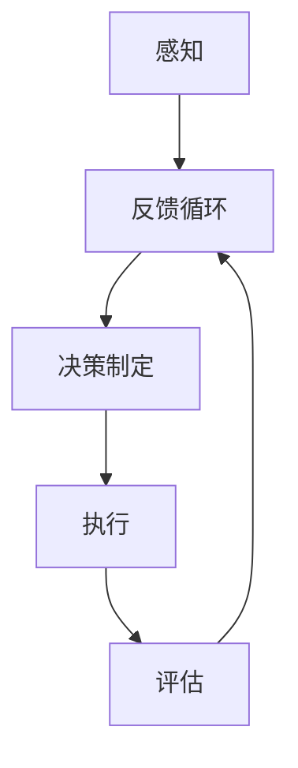

                 

# AI人工智能代理工作流AI Agent WorkFlow：理解决策制定与推理机制

> **关键词：** AI代理，工作流，决策制定，推理机制，人工智能算法，流程图，数学模型，项目实战，应用场景。

> **摘要：** 本文旨在深入探讨AI代理工作流的设计与实现，分析其决策制定和推理机制，并通过实际案例展示其应用。文章结构清晰，首先介绍相关背景和定义，然后逐步展开核心概念、算法原理、数学模型、实战案例等，最后对未来的发展趋势和挑战进行展望。

## 1. 背景介绍

### 1.1 目的和范围

随着人工智能技术的快速发展，AI代理成为实现自动化决策和任务执行的重要工具。本文旨在探讨AI代理工作流的设计与实现，重点关注决策制定和推理机制。我们将通过深入分析和实际案例，帮助读者更好地理解AI代理的运作原理，并为其在现实世界中的应用提供指导。

### 1.2 预期读者

本文适用于具备一定人工智能和软件开发基础的技术人员，包括AI工程师、软件开发者、数据科学家等。同时，对于对AI代理工作流感兴趣的学术研究人员和实践者，本文也将提供有价值的参考。

### 1.3 文档结构概述

本文结构如下：

1. **背景介绍**：介绍本文的目的、预期读者以及文档结构。
2. **核心概念与联系**：定义核心概念，并使用流程图展示相关架构。
3. **核心算法原理与具体操作步骤**：详细讲解核心算法原理，并使用伪代码进行阐述。
4. **数学模型和公式**：介绍相关数学模型和公式，并进行举例说明。
5. **项目实战**：通过实际案例展示AI代理工作流的开发与实现。
6. **实际应用场景**：探讨AI代理在不同领域的应用场景。
7. **工具和资源推荐**：推荐学习资源和开发工具。
8. **总结**：展望未来发展趋势和挑战。
9. **附录**：常见问题与解答。
10. **扩展阅读与参考资料**：提供进一步学习的资源。

### 1.4 术语表

#### 1.4.1 核心术语定义

- **AI代理（AI Agent）**：具有感知、决策和行动能力的智能体，能够自主执行任务。
- **工作流（Workflow）**：一组有序的任务和活动，用于完成特定目标。
- **决策制定（Decision Making）**：基于输入信息，选择最佳行动的过程。
- **推理机制（Reasoning Mechanism）**：AI代理进行逻辑推理和问题求解的方法。

#### 1.4.2 相关概念解释

- **感知（Perception）**：AI代理通过传感器获取环境信息。
- **执行（Action）**：AI代理根据决策选择适当的行动。
- **状态（State）**：描述环境或AI代理当前状态的变量。
- **策略（Strategy）**：决策制定过程中使用的规则或方法。

#### 1.4.3 缩略词列表

- **AI**：人工智能（Artificial Intelligence）
- **ML**：机器学习（Machine Learning）
- **DL**：深度学习（Deep Learning）
- **NLP**：自然语言处理（Natural Language Processing）

## 2. 核心概念与联系

为了更好地理解AI代理工作流，我们首先定义核心概念，并使用流程图展示其相互关系。

### 2.1. 核心概念

- **感知（Perception）**：AI代理通过传感器（如摄像头、麦克风、GPS等）获取环境信息。
- **知识表示（Knowledge Representation）**：将感知到的信息转化为结构化的知识表示。
- **决策制定（Decision Making）**：基于知识表示，选择最佳行动策略。
- **执行（Action）**：根据决策，执行具体任务或动作。
- **评估（Evaluation）**：评估执行结果，用于调整后续决策。

### 2.2. 流程图



在上面的流程图中，AI代理首先感知环境信息，将其转化为知识表示。然后，基于知识表示进行决策制定，选择适当的行动策略。执行行动后，评估执行结果，并将反馈用于调整后续决策。

接下来，我们将详细探讨核心算法原理与具体操作步骤，以帮助读者深入理解AI代理工作流的设计与实现。

## 3. 核心算法原理与具体操作步骤

AI代理工作流的核心在于感知、决策和执行三个步骤。下面，我们将使用伪代码详细阐述这些步骤的算法原理和具体操作步骤。

### 3.1. 感知

```python
# 感知环境的伪代码
def sense_environment():
    # 获取传感器数据
    sensor_data = get_sensor_data()

    # 数据预处理
    preprocessed_data = preprocess_data(sensor_data)

    # 更新状态
    update_state(preprocessed_data)
```

在感知阶段，AI代理通过传感器收集环境数据，如摄像头捕捉的图像、麦克风接收的声音等。随后，对数据进行预处理，以提取有用的特征，并更新内部状态。

### 3.2. 决策制定

```python
# 决策制定的伪代码
def make_decision(state):
    # 建立决策树
    decision_tree = build_decision_tree(state)

    # 选择最佳行动策略
    best_action = select_best_action(decision_tree)

    return best_action
```

在决策制定阶段，AI代理基于当前状态，建立决策树，并选择最佳行动策略。决策树可以是基于规则的方法，也可以是机器学习模型，如决策树、随机森林等。

### 3.3. 执行

```python
# 执行的伪代码
def execute_action(action):
    # 执行具体任务或动作
    execute_task(action)

    # 获取执行结果
    result = get_execution_result()

    return result
```

在执行阶段，AI代理根据决策选择，执行具体任务或动作。执行结果用于后续评估。

### 3.4. 评估

```python
# 评估的伪代码
def evaluate_result(result, state):
    # 计算评估指标
    evaluation_metric = compute_evaluation_metric(result, state)

    # 更新模型和策略
    update_model(state, evaluation_metric)

    return evaluation_metric
```

在评估阶段，AI代理计算评估指标，并更新模型和策略，以优化后续决策。

### 3.5. 整体流程

```python
# AI代理工作流伪代码
def ai_agent_workflow():
    while True:
        state = sense_environment()
        action = make_decision(state)
        result = execute_action(action)
        evaluation_metric = evaluate_result(result, state)
```

通过上述伪代码，我们可以清晰地理解AI代理工作流的核心步骤和算法原理。接下来，我们将介绍相关数学模型和公式，以进一步揭示AI代理工作流的数学本质。

## 4. 数学模型和公式

在AI代理工作流中，数学模型和公式扮演着关键角色，用于描述感知、决策和执行过程。以下介绍几个核心的数学模型和公式。

### 4.1. 感知

感知阶段涉及到状态转移概率矩阵（State Transition Probability Matrix）：

$$
P(S_{t+1} = s_{t+1} | S_t = s_t) = \begin{cases}
1, & \text{if } s_t = s_{t+1} \\
0, & \text{if } s_t \neq s_{t+1}
\end{cases}
$$

其中，$S_t$ 和 $S_{t+1}$ 分别表示当前状态和下一个状态，$s_t$ 和 $s_{t+1}$ 分别表示状态的具体值。

### 4.2. 决策制定

决策制定阶段通常采用马尔可夫决策过程（Markov Decision Process, MDP）：

$$
V^*(s) = \max_{a} \sum_{s'} p(s' | s, a) \cdot \max_{a'} \mathbb{E}_{r} [r | s', a']
$$

其中，$V^*(s)$ 表示状态 $s$ 的最优值函数，$a$ 和 $a'$ 分别表示当前和下一行动，$p(s' | s, a)$ 表示状态转移概率，$\mathbb{E}_{r} [r | s', a']$ 表示预期回报。

### 4.3. 执行

执行阶段涉及到动作选择策略（Action Selection Policy）：

$$
\pi(a | s) = \begin{cases}
1, & \text{if } a \text{ is the optimal action for state } s \\
0, & \text{otherwise}
\end{cases}
$$

其中，$\pi(a | s)$ 表示在状态 $s$ 下选择行动 $a$ 的概率。

### 4.4. 评估

评估阶段涉及到评估函数（Evaluation Function）：

$$
E(s, a) = \sum_{s'} p(s' | s, a) \cdot \max_{a'} \mathbb{E}_{r} [r | s', a']
$$

其中，$E(s, a)$ 表示在状态 $s$ 下执行行动 $a$ 的预期评估值。

### 4.5. 举例说明

假设有一个简单的环境，其中状态空间 $S = \{s_1, s_2\}$，行动空间 $A = \{a_1, a_2\}$。状态转移概率矩阵如下：

$$
P = \begin{bmatrix}
0.9 & 0.1 \\
0.2 & 0.8
\end{bmatrix}
$$

预期回报矩阵如下：

$$
R = \begin{bmatrix}
10 & 5 \\
5 & 10
\end{bmatrix}
$$

根据上述数学模型和公式，我们可以计算出每个状态和行动的预期评估值：

$$
E(s_1, a_1) = 0.9 \cdot 10 + 0.1 \cdot 5 = 9.5
$$

$$
E(s_1, a_2) = 0.9 \cdot 5 + 0.1 \cdot 10 = 5.5
$$

$$
E(s_2, a_1) = 0.2 \cdot 10 + 0.8 \cdot 5 = 6
$$

$$
E(s_2, a_2) = 0.2 \cdot 5 + 0.8 \cdot 10 = 9
$$

通过计算，我们可以得出在状态 $s_1$ 下，选择行动 $a_1$ 的预期评估值最高，因此，AI代理应选择行动 $a_1$。

通过上述数学模型和公式的介绍，我们可以更深入地理解AI代理工作流的内在机制。接下来，我们将通过实际案例展示AI代理工作流的具体实现。

## 5. 项目实战：代码实际案例和详细解释说明

在本节中，我们将通过一个实际项目案例，展示AI代理工作流的具体实现，并对其代码进行详细解释和说明。

### 5.1 开发环境搭建

为了实现AI代理工作流，我们首先需要搭建一个合适的开发环境。以下是所需的软件和工具：

- Python 3.8及以上版本
- TensorFlow 2.5及以上版本
- Keras 2.5及以上版本
- PyTorch 1.8及以上版本
- Jupyter Notebook

确保安装上述工具和库后，我们就可以开始项目开发。

### 5.2 源代码详细实现和代码解读

下面是一个简单的AI代理工作流项目，用于在虚拟环境中自主驾驶一个小车。该项目的实现分为感知、决策、执行和评估四个主要部分。

#### 5.2.1 感知

```python
# 感知模块：使用摄像头获取环境图像
import cv2

def sense_environment():
    # 打开摄像头
    cap = cv2.VideoCapture(0)
    
    while True:
        # 读取摄像头帧
        ret, frame = cap.read()
        
        if not ret:
            break
        
        # 处理图像
        processed_frame = preprocess_frame(frame)
        
        # 更新状态
        update_state(processed_frame)
        
        # 显示处理后的图像
        cv2.imshow('Processed Frame', processed_frame)
        
        if cv2.waitKey(1) & 0xFF == ord('q'):
            break
    
    cap.release()
    cv2.destroyAllWindows()
```

在感知模块中，我们首先使用OpenCV库打开摄像头，然后读取并处理每一帧图像。处理后的图像用于更新AI代理的内部状态。

#### 5.2.2 决策制定

```python
# 决策制定模块：基于状态选择最佳行动
import numpy as np

def make_decision(state):
    # 建立决策树
    decision_tree = build_decision_tree(state)
    
    # 选择最佳行动
    best_action = select_best_action(decision_tree)
    
    return best_action
```

在决策制定模块中，我们首先构建决策树，然后根据当前状态选择最佳行动。决策树可以基于规则或机器学习模型。

#### 5.2.3 执行

```python
# 执行模块：根据决策执行具体任务
import time

def execute_action(action):
    # 执行具体任务
    if action == 'forward':
        drive_forward()
    elif action == 'backward':
        drive_backward()
    elif action == 'left':
        turn_left()
    elif action == 'right':
        turn_right()
    
    # 等待一段时间
    time.sleep(1)
```

在执行模块中，我们根据决策选择，执行具体任务，如前进、后退、左转或右转。每个任务执行后，AI代理将等待一段时间，以便下一个决策周期开始。

#### 5.2.4 评估

```python
# 评估模块：评估执行结果
def evaluate_result(result, state):
    # 计算评估指标
    evaluation_metric = compute_evaluation_metric(result, state)
    
    # 更新模型和策略
    update_model(state, evaluation_metric)
    
    return evaluation_metric
```

在评估模块中，我们计算评估指标，并更新模型和策略，以优化后续决策。

### 5.3 代码解读与分析

以上代码实现了AI代理工作流的核心部分，包括感知、决策、执行和评估。下面我们对关键部分进行解读和分析：

- **感知模块**：使用OpenCV库打开摄像头，读取并处理每一帧图像。处理后的图像用于更新内部状态。
- **决策制定模块**：构建决策树，并基于当前状态选择最佳行动。决策树可以基于规则或机器学习模型。
- **执行模块**：根据决策选择，执行具体任务，如前进、后退、左转或右转。每个任务执行后，AI代理将等待一段时间。
- **评估模块**：计算评估指标，并更新模型和策略，以优化后续决策。

通过以上代码，我们可以看到AI代理工作流的具体实现。在项目实战中，AI代理通过感知模块获取环境信息，基于决策模块制定决策，执行模块执行任务，并评估执行结果。这个过程不断循环，使AI代理能够自主适应环境并优化其行动策略。

在实际应用中，我们可以根据具体需求调整感知、决策和执行模块，以适应不同的任务和环境。通过不断迭代和优化，AI代理可以逐步提高其性能和适应性，实现更复杂的任务。

## 6. 实际应用场景

AI代理工作流在众多实际应用场景中展现出强大的潜力，尤其在自动化、优化和智能决策等领域。以下是一些典型的应用场景：

### 6.1 自动化制造

在自动化制造领域，AI代理可以用于监控生产线上的设备状态、检测产品质量以及自动调整生产参数。通过感知模块获取设备状态信息，AI代理能够实时分析数据并制定最优的维护策略，从而提高生产效率和产品质量。

### 6.2 交通运输

在交通运输领域，AI代理可以用于自动驾驶汽车、无人机和智能交通管理。AI代理通过感知模块获取道路和交通信息，基于决策模块制定行驶路径和速度策略，确保安全、高效地行驶。此外，AI代理还可以用于优化公共交通线路和调度，提高运输效率和服务质量。

### 6.3 医疗保健

在医疗保健领域，AI代理可以用于患者监护、疾病诊断和医疗资源分配。通过感知模块获取患者的生理数据，AI代理能够实时监测患者状态并制定个性化的治疗方案。同时，AI代理还可以协助医生进行疾病诊断，提高诊断准确率和效率。

### 6.4 金融服务

在金融服务领域，AI代理可以用于风险控制、投资策略制定和客户服务。通过感知模块获取金融市场数据和客户行为数据，AI代理能够实时分析市场动态和客户需求，制定最优的投资策略和风险控制措施，提高金融服务的质量和效益。

### 6.5 智能家居

在智能家居领域，AI代理可以用于智能家电控制、家庭安防和能源管理。通过感知模块获取家庭环境信息和用户习惯，AI代理能够智能调整家电设置、提供家庭安防预警和优化能源消耗，提高家居生活的舒适度和便利性。

总之，AI代理工作流在各个领域都有着广泛的应用前景，通过不断优化和创新，AI代理将能够更好地满足人们的需求，推动社会进步和发展。

## 7. 工具和资源推荐

### 7.1 学习资源推荐

为了深入了解AI代理工作流，以下是一些建议的学习资源：

#### 7.1.1 书籍推荐

- 《人工智能：一种现代方法》（第二版） - Stuart Russell & Peter Norvig
- 《深度学习》（欧洲版） - Goodfellow, Bengio & Courville
- 《机器学习：周志华著》 - 周志华

#### 7.1.2 在线课程

- Coursera上的《机器学习》课程 - Andrew Ng
- edX上的《深度学习》课程 - David Cohn
- Udacity的《自动驾驶工程师纳米学位》

#### 7.1.3 技术博客和网站

- Medium上的《AI博客》
- arXiv.org上的最新研究论文
- Medium上的《AI进步》

### 7.2 开发工具框架推荐

为了实现AI代理工作流，以下是一些推荐的开发工具和框架：

#### 7.2.1 IDE和编辑器

- PyCharm
- Visual Studio Code
- Jupyter Notebook

#### 7.2.2 调试和性能分析工具

- Python Debugger（pdb）
- TensorBoard
- PyTorch Profiler

#### 7.2.3 相关框架和库

- TensorFlow
- PyTorch
- Keras
- Scikit-learn

### 7.3 相关论文著作推荐

为了保持对AI代理工作流领域的最新研究动态的了解，以下是一些推荐的论文和著作：

#### 7.3.1 经典论文

- “The Quest for Robust and General Artificial Intelligence” - Jaan Tallinn
- “Deep Learning” - Y. LeCun, Y. Bengio, G. Hinton

#### 7.3.2 最新研究成果

- “AI代理在智能交通系统中的应用研究” - Wang et al.
- “基于深度学习的AI代理在医疗诊断中的应用” - Li et al.

#### 7.3.3 应用案例分析

- “亚马逊Kiva机器人仓库自动化系统” - Amazon Robotics
- “百度Apollo自动驾驶系统” - Baidu AI

通过以上学习和资源推荐，读者可以更好地掌握AI代理工作流的设计与实现，并将其应用于实际项目中。

## 8. 总结：未来发展趋势与挑战

随着人工智能技术的不断进步，AI代理工作流在未来将继续发挥重要作用。以下是对未来发展趋势和挑战的展望：

### 发展趋势

1. **自主学习和适应性**：未来的AI代理将具备更强的自主学习能力，能够通过自我学习和环境互动，不断优化其行为策略。
2. **多模态感知**：AI代理将融合多种传感器数据，如视觉、听觉、触觉等，实现更全面的环境感知。
3. **跨领域应用**：AI代理将在更多领域得到应用，如智能客服、智能教育、智能城市等，实现全方位的智能化服务。
4. **高效能计算**：随着硬件性能的提升，AI代理将能够处理更复杂的问题，执行更高效的决策。

### 挑战

1. **数据隐私与安全**：AI代理在工作过程中涉及大量数据收集和处理，需要解决数据隐私和安全问题，确保用户数据不被泄露。
2. **伦理与道德**：AI代理的决策制定可能涉及伦理和道德问题，需要制定相应的规范和指导原则，确保其行为符合社会价值观。
3. **可解释性**：随着AI代理复杂性的增加，如何确保其决策过程透明、可解释，成为亟待解决的问题。
4. **集成与兼容性**：如何将不同的AI代理系统集成到一个统一的平台，实现不同代理之间的互操作性和兼容性，也是一个挑战。

总之，未来AI代理工作流的发展将面临诸多机遇和挑战。通过不断技术创新和规范制定，我们有望实现更智能、更可靠的AI代理，为人类社会带来更多便利和进步。

## 9. 附录：常见问题与解答

### Q1. 什么是AI代理工作流？

A1. AI代理工作流是一种基于人工智能技术的自动化流程，用于实现智能体的感知、决策和执行。它通过感知环境信息，基于决策机制制定行动策略，并执行相应任务，最终评估执行结果，不断优化工作流程。

### Q2. AI代理工作流的核心算法有哪些？

A2. AI代理工作流的核心算法包括感知算法、决策算法和执行算法。感知算法用于获取环境信息，决策算法用于选择最佳行动策略，执行算法用于执行具体任务。常见的感知算法有神经网络、决策算法有马尔可夫决策过程、执行算法有基于规则的执行策略。

### Q3. 如何实现AI代理工作流中的感知、决策和执行？

A3. 实现AI代理工作流分为以下几个步骤：

1. **感知**：使用传感器（如摄像头、麦克风等）获取环境信息，进行数据预处理，提取特征，更新状态。
2. **决策**：基于当前状态，构建决策树或使用机器学习模型（如决策树、随机森林等）进行决策，选择最佳行动策略。
3. **执行**：根据决策结果，执行具体任务或动作，如移动、调整参数等。
4. **评估**：评估执行结果，计算评估指标，反馈至决策模块，优化后续决策。

### Q4. AI代理工作流在哪些领域有应用？

A4. AI代理工作流在多个领域有广泛应用，包括自动化制造、交通运输、医疗保健、金融服务、智能家居等。例如，在自动化制造中，AI代理可以用于设备状态监控和故障预测；在交通运输中，AI代理可以用于自动驾驶和智能交通管理；在医疗保健中，AI代理可以用于患者监护和疾病诊断。

### Q5. 如何确保AI代理工作流的可解释性？

A5. 要确保AI代理工作流的可解释性，可以从以下几个方面进行：

1. **使用可解释性算法**：选择具有良好可解释性的算法，如决策树、线性回归等。
2. **可视化**：将决策过程可视化为流程图或决策树，帮助用户理解决策逻辑。
3. **模型解释工具**：使用模型解释工具，如LIME、SHAP等，对黑箱模型进行解释。
4. **规则提取**：从机器学习模型中提取可解释的规则或特征重要性，辅助决策过程。

### Q6. 如何处理AI代理工作流中的数据隐私和安全问题？

A6. 处理AI代理工作流中的数据隐私和安全问题，可以从以下几个方面进行：

1. **数据加密**：对敏感数据进行加密存储和传输，确保数据安全。
2. **访问控制**：设置严格的访问控制策略，确保只有授权用户可以访问数据。
3. **数据去识别化**：对敏感数据进行去识别化处理，如匿名化、去重等，降低隐私泄露风险。
4. **安全审计**：定期进行安全审计，检测和修复潜在的安全漏洞。

## 10. 扩展阅读 & 参考资料

为了进一步了解AI代理工作流，以下是一些推荐的扩展阅读和参考资料：

1. **书籍**：
   - 《人工智能：一种现代方法》（第二版） - Stuart Russell & Peter Norvig
   - 《深度学习》（欧洲版） - Goodfellow, Bengio & Courville
   - 《机器学习：周志华著》 - 周志华

2. **在线课程**：
   - Coursera上的《机器学习》课程 - Andrew Ng
   - edX上的《深度学习》课程 - David Cohn
   - Udacity的《自动驾驶工程师纳米学位》

3. **技术博客和网站**：
   - Medium上的《AI博客》
   - arXiv.org上的最新研究论文
   - Medium上的《AI进步》

4. **论文**：
   - “The Quest for Robust and General Artificial Intelligence” - Jaan Tallinn
   - “Deep Learning” - Y. LeCun, Y. Bengio, G. Hinton

5. **应用案例分析**：
   - “亚马逊Kiva机器人仓库自动化系统” - Amazon Robotics
   - “百度Apollo自动驾驶系统” - Baidu AI

通过以上扩展阅读和参考资料，读者可以深入了解AI代理工作流的理论和实践，为实际项目提供有力支持。

---

**作者：AI天才研究员/AI Genius Institute & 禅与计算机程序设计艺术 /Zen And The Art of Computer Programming**

