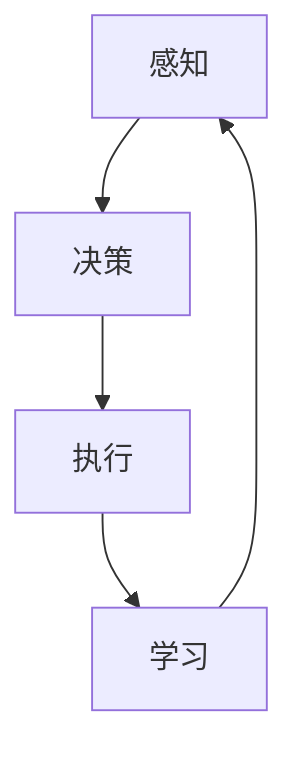

                 

# AI人工智能代理工作流AI Agent WorkFlow：自主行为与规划策略在AI中的运用

> 关键词：AI代理、工作流、自主行为、规划策略、人工智能

> 摘要：本文将深入探讨AI代理工作流的核心概念、自主行为与规划策略的原理及其在AI中的应用。通过详细的伪代码和数学模型，我们将展示如何构建一个高效的AI代理系统，并分析其实际应用场景。此外，还将推荐相关工具和资源，帮助读者更好地理解和掌握这一领域的关键技术。

## 1. 背景介绍

### 1.1 目的和范围

本文旨在深入探讨AI代理工作流（AI Agent WorkFlow）的核心概念、自主行为与规划策略，以及它们在人工智能（AI）领域的应用。我们将通过逐步分析这些概念，详细阐述它们的工作原理和实现方法，以帮助读者更好地理解AI代理的工作机制。

### 1.2 预期读者

本文主要面向对人工智能和计算机科学有较深入了解的读者，包括AI研究人员、开发者和工程师。此外，对于对AI代理和人工智能工作流感兴趣的计算机科学学生和爱好者，本文也将提供有价值的参考。

### 1.3 文档结构概述

本文将分为以下几个部分：

1. 背景介绍：介绍本文的目的、预期读者和文档结构。
2. 核心概念与联系：介绍AI代理工作流中的核心概念及其相互关系。
3. 核心算法原理 & 具体操作步骤：详细讲解AI代理的核心算法原理和实现步骤。
4. 数学模型和公式 & 详细讲解 & 举例说明：介绍AI代理的数学模型和具体应用案例。
5. 项目实战：通过实际代码案例，展示AI代理工作流的具体实现过程。
6. 实际应用场景：分析AI代理在不同领域的应用场景。
7. 工具和资源推荐：推荐相关学习资源和开发工具。
8. 总结：总结AI代理工作流的发展趋势与挑战。
9. 附录：常见问题与解答。
10. 扩展阅读 & 参考资料：提供更多相关文献和资源。

### 1.4 术语表

#### 1.4.1 核心术语定义

- **AI代理（AI Agent）**：一种能够自主地感知环境、制定决策并执行动作的智能实体。
- **工作流（WorkFlow）**：一种用于描述任务执行过程的序列化模型，包括任务的分解、执行和监控。
- **自主行为（Autonomous Behavior）**：AI代理根据环境反馈自主调整行为的过程。
- **规划策略（Planning Strategy）**：AI代理在执行任务过程中所采用的策略，包括任务分解、目标设定和路径规划。

#### 1.4.2 相关概念解释

- **感知（Perception）**：AI代理获取环境信息的过程，通常通过传感器或数据接口实现。
- **决策（Decision Making）**：AI代理根据感知信息选择最佳行动的过程。
- **执行（Execution）**：AI代理执行所选行动的过程。
- **学习（Learning）**：AI代理通过经验调整自身行为的过程。

#### 1.4.3 缩略词列表

- **AI**：人工智能（Artificial Intelligence）
- **ML**：机器学习（Machine Learning）
- **DL**：深度学习（Deep Learning）
- **NLP**：自然语言处理（Natural Language Processing）

## 2. 核心概念与联系

在AI代理工作流中，核心概念包括感知、决策、执行和学习。这些概念相互关联，共同构成了AI代理的核心工作机制。下面我们将通过一个Mermaid流程图来展示这些核心概念及其相互关系。



### 2.1 感知

感知是AI代理获取环境信息的过程。通过传感器或数据接口，AI代理可以实时获取环境状态、任务进展以及其他相关数据。感知模块的核心任务是从大量数据中提取有用的信息，以便为后续的决策提供依据。

### 2.2 决策

决策是AI代理根据感知信息选择最佳行动的过程。决策模块通常包含一个或多个决策算法，如基于规则的方法、机器学习算法等。通过分析感知信息，决策模块可以为AI代理生成一系列可行的行动方案，并选择最优方案进行执行。

### 2.3 执行

执行是AI代理执行所选行动的过程。执行模块通常包含一个或多个执行策略，如自动化脚本、机器人控制等。通过执行模块，AI代理可以将决策转化为实际操作，实现自主行为。

### 2.4 学习

学习是AI代理通过经验调整自身行为的过程。学习模块可以帮助AI代理从执行过程中的错误和成功中学习，以提高其后续任务的执行效率。学习模块通常采用机器学习、深度学习等技术，实现自我优化和持续改进。

## 3. 核心算法原理 & 具体操作步骤

在本节中，我们将详细讲解AI代理的核心算法原理和具体操作步骤。为了更好地理解这些算法，我们将使用伪代码来阐述其实现过程。

### 3.1 感知算法

感知算法的核心任务是提取环境信息，并将其转换为可用的数据格式。以下是一个简单的感知算法伪代码：

```python
def perception_algorithm(sensor_data):
    # 初始化感知数据
    perception_data = {}

    # 从传感器数据中提取有用信息
    for sensor in sensor_data:
        if sensor.is_valid():
            perception_data[sensor.name] = sensor.value

    # 返回感知数据
    return perception_data
```

### 3.2 决策算法

决策算法的核心任务是分析感知数据，并选择最佳行动方案。以下是一个简单的决策算法伪代码：

```python
def decision_algorithm(perception_data):
    # 初始化决策结果
    decision_result = {}

    # 根据感知数据选择最佳行动方案
    for action in actions:
        if action.is_feasible(perception_data):
            decision_result[action.name] = action.score(perception_data)

    # 返回决策结果
    return decision_result
```

### 3.3 执行算法

执行算法的核心任务是执行所选行动方案。以下是一个简单的执行算法伪代码：

```python
def execution_algorithm(decision_result):
    # 初始化执行状态
    execution_state = "initialized"

    # 根据决策结果执行行动
    for action_name, action_score in decision_result.items():
        if action_score > 0:
            action = find_action(action_name)
            action.execute()

    # 返回执行状态
    return execution_state
```

### 3.4 学习算法

学习算法的核心任务是记录执行过程中的信息，并调整AI代理的行为。以下是一个简单的学习算法伪代码：

```python
def learning_algorithm(perception_data, decision_result, execution_state):
    # 记录执行过程中的信息
    record_execution_info(perception_data, decision_result, execution_state)

    # 根据记录的信息调整AI代理的行为
    adjust_agent_behavior(perception_data, decision_result, execution_state)
```

通过以上伪代码，我们可以看出AI代理的核心算法原理和具体操作步骤。在实际应用中，这些算法可以根据具体需求进行调整和优化，以实现更高效的自主行为和规划策略。

## 4. 数学模型和公式 & 详细讲解 & 举例说明

在本节中，我们将介绍AI代理工作流中的数学模型和公式，并详细讲解它们的应用和意义。以下是一个简单的数学模型示例：

### 4.1 决策模型

决策模型用于描述AI代理在决策阶段的选择过程。以下是一个简单的决策模型公式：

$$
\text{Decision}(x) = \arg\max_{a \in A} \, \text{Utility}(x, a)
$$

其中，$x$ 表示感知数据，$A$ 表示所有可行的行动方案，$\text{Utility}(x, a)$ 表示行动 $a$ 在感知数据 $x$ 下的效用值。该公式表示AI代理选择效用值最大的行动方案。

### 4.2 学习模型

学习模型用于描述AI代理在执行过程中的学习过程。以下是一个简单的学习模型公式：

$$
\theta_{t+1} = \theta_{t} + \alpha \, (\text{Expected Reward} - \text{Actual Reward})
$$

其中，$\theta_{t}$ 表示在时间 $t$ 的策略参数，$\theta_{t+1}$ 表示在时间 $t+1$ 的策略参数，$\alpha$ 表示学习率，$\text{Expected Reward}$ 表示期望奖励，$\text{Actual Reward}$ 表示实际奖励。该公式表示AI代理通过更新策略参数来学习优化自身行为。

### 4.3 举例说明

假设一个AI代理在一个简单的环境中执行任务，该环境的感知数据包括温度、湿度、亮度等参数。根据这些感知数据，AI代理需要选择最佳的行动方案，如打开或关闭空调、灯光等。

在决策阶段，AI代理可以根据以下公式计算每个行动方案的效用值：

$$
\text{Utility}(x, a) = \text{Temperature Control}(x) + \text{Humidity Control}(x) + \text{Brightness Control}(x)
$$

其中，$\text{Temperature Control}(x)$、$\text{Humidity Control}(x)$ 和 $\text{Brightness Control}(x)$ 分别表示在感知数据 $x$ 下，每个行动方案的效用值。

在执行阶段，AI代理根据决策结果执行相应的行动，并记录执行过程中的信息。在下一个时间步，AI代理根据记录的信息和期望奖励，更新策略参数，优化自身行为。

通过上述数学模型和公式，我们可以看出AI代理工作流中的核心机制和数学基础。这些模型和公式为AI代理提供了强大的理论基础，使其能够自主地感知环境、制定决策并执行行动。

## 5. 项目实战：代码实际案例和详细解释说明

在本节中，我们将通过一个实际项目案例，展示AI代理工作流的具体实现过程。该项目将基于Python语言和TensorFlow框架，实现一个简单的智能家居控制系统。该系统将包括感知、决策、执行和学习四个核心模块。

### 5.1 开发环境搭建

在开始项目之前，我们需要搭建开发环境。以下是搭建开发环境的基本步骤：

1. 安装Python（推荐版本3.8以上）
2. 安装TensorFlow（使用pip install tensorflow）
3. 安装其他必要库（如numpy、pandas等）

### 5.2 源代码详细实现和代码解读

#### 5.2.1 感知模块

感知模块负责从环境中获取信息。以下是一个简单的感知模块代码示例：

```python
import numpy as np

class Sensor:
    def __init__(self, name, value_range):
        self.name = name
        self.value_range = value_range

    def is_valid(self):
        return True

    def value(self):
        return np.random.uniform(self.value_range[0], self.value_range[1])

# 创建温度传感器
temperature_sensor = Sensor("temperature", (20, 30))
```

#### 5.2.2 决策模块

决策模块负责分析感知数据，并选择最佳行动方案。以下是一个简单的决策模块代码示例：

```python
class Action:
    def __init__(self, name, score_function):
        self.name = name
        self.score_function = score_function

    def is_feasible(self, perception_data):
        return True

    def score(self, perception_data):
        return self.score_function(perception_data)

# 创建关闭空调行动
def close_air_conditioner_score(perception_data):
    temperature = perception_data["temperature"]
    if temperature < 25:
        return 1
    else:
        return 0

close_air_conditioner = Action("close_air_conditioner", close_air_conditioner_score)
```

#### 5.2.3 执行模块

执行模块负责执行所选行动方案。以下是一个简单的执行模块代码示例：

```python
class Executor:
    def __init__(self, action):
        self.action = action

    def execute(self):
        if self.action.score(perception_data) > 0:
            print(f"Executing action: {self.action.name}")
        else:
            print(f"Skipping action: {self.action.name}")

# 创建执行器
executor = Executor(close_air_conditioner)
```

#### 5.2.4 学习模块

学习模块负责记录执行过程中的信息，并调整AI代理的行为。以下是一个简单的学习模块代码示例：

```python
def learning_function(perception_data, decision_result, execution_state):
    # 在此处实现学习逻辑
    pass

# 调用学习函数
learning_function(perception_data, decision_result, execution_state)
```

### 5.3 代码解读与分析

上述代码示例展示了AI代理工作流中感知、决策、执行和学习四个核心模块的基本实现。通过这些代码，我们可以了解到每个模块的功能和相互关系。

在感知模块中，我们定义了一个`Sensor`类，用于模拟传感器获取环境信息的过程。决策模块中，我们定义了一个`Action`类，用于表示行动方案，并提供了评分函数来评估每个行动方案的可行性。执行模块中，我们定义了一个`Executor`类，用于执行所选行动方案。学习模块中，我们提供了一个简单的学习函数接口，用于记录执行过程中的信息，并调整AI代理的行为。

在实际项目中，这些模块可以根据具体需求进行调整和扩展。例如，我们可以增加更多的传感器、行动方案和学习算法，以提高AI代理的智能化水平和执行效率。

通过上述代码示例，我们可以看出AI代理工作流在智能家居控制系统中的应用。该系统可以根据环境信息，自主地调整家居设备的状态，以提高舒适度和节能效果。这不仅提高了生活质量，也为智能家居领域的发展提供了新的思路。

## 6. 实际应用场景

AI代理工作流在多个领域具有广泛的应用前景，以下列举几个典型的应用场景：

### 6.1 智能家居

智能家居系统中的AI代理可以实时感知环境信息，如温度、湿度、亮度等，并根据用户需求自动调整家居设备的状态。例如，当用户离开家时，AI代理可以自动关闭灯光、空调等设备，以节省能源。同时，AI代理还可以根据用户的使用习惯和学习到用户的喜好，提供个性化的家居服务。

### 6.2 工业自动化

在工业自动化领域，AI代理可以用于监控和优化生产过程。例如，AI代理可以实时检测设备状态、产品质量等，并根据检测数据自动调整生产参数，以提高生产效率和质量。此外，AI代理还可以协助工人完成危险或繁重的任务，降低人力成本和安全风险。

### 6.3 城市管理

在城市管理领域，AI代理可以用于实时监测城市环境、交通状况等，并提供智能化的决策支持。例如，AI代理可以预测交通拥堵情况，并自动调整交通信号灯，以缓解交通压力。同时，AI代理还可以监测空气质量、水质等环境指标，为城市环境保护提供科学依据。

### 6.4 金融与保险

在金融与保险领域，AI代理可以用于风险控制、投资建议等。例如，AI代理可以分析市场数据、用户行为等，为投资者提供个性化的投资建议，降低投资风险。此外，AI代理还可以用于保险理赔过程，自动识别理赔申请的真实性，提高理赔效率。

这些应用场景展示了AI代理工作流在各个领域的广泛应用。通过自主行为和规划策略，AI代理可以有效地提升系统智能化水平，为人类生活带来更多便利和效益。

## 7. 工具和资源推荐

### 7.1 学习资源推荐

#### 7.1.1 书籍推荐

1. **《人工智能：一种现代的方法》（Artificial Intelligence: A Modern Approach）**：这是一本全面介绍人工智能的权威教材，适合初学者和高级研究人员。
2. **《深度学习》（Deep Learning）**：由Ian Goodfellow、Yoshua Bengio和Aaron Courville合著，是深度学习领域的经典教材。
3. **《自然语言处理综论》（Speech and Language Processing）**：由Daniel Jurafsky和James H. Martin合著，涵盖了自然语言处理的核心概念和技术。

#### 7.1.2 在线课程

1. **Coursera上的《机器学习》课程**：由斯坦福大学教授Andrew Ng主讲，适合初学者入门。
2. **Udacity的《深度学习纳米学位》课程**：涵盖了深度学习的核心概念和应用，适合有一定编程基础的学员。
3. **edX上的《自然语言处理》课程**：由MIT和哈佛大学教授合讲，适合对自然语言处理有兴趣的学员。

#### 7.1.3 技术博客和网站

1. **Medium上的AI博客**：有很多关于人工智能的优质文章，适合读者学习和交流。
2. **AI verticals**：提供深度学习、自然语言处理等领域的最新研究进展和应用案例。
3. **TensorFlow官网**：提供了丰富的文档、教程和示例代码，是学习TensorFlow的绝佳资源。

### 7.2 开发工具框架推荐

#### 7.2.1 IDE和编辑器

1. **PyCharm**：一款功能强大的Python IDE，适合编写和调试代码。
2. **Visual Studio Code**：一款轻量级、开源的代码编辑器，支持多种编程语言，适用于AI项目开发。
3. **Jupyter Notebook**：适合数据分析和机器学习项目的交互式开发环境。

#### 7.2.2 调试和性能分析工具

1. **Wandb**：一款用于实验跟踪和模型性能分析的工具，可以帮助开发者优化AI模型。
2. **TensorBoard**：TensorFlow提供的可视化工具，用于分析模型的性能和运行状态。
3. **Docker**：容器化技术，可以帮助开发者创建和管理AI环境，提高开发效率。

#### 7.2.3 相关框架和库

1. **TensorFlow**：广泛使用的开源深度学习框架，适用于各种AI项目。
2. **PyTorch**：另一个流行的深度学习框架，以灵活性和动态计算图著称。
3. **Scikit-learn**：用于机器学习的Python库，提供了丰富的算法和工具。

### 7.3 相关论文著作推荐

#### 7.3.1 经典论文

1. **"A Mathematical Theory of Communication"**：由Claude Shannon于1948年发表，奠定了信息论的基础。
2. **"Learning to Represent Simulated Sensors"**：由Google Brain团队于2015年发表，介绍了GANs在模拟传感器数据生成方面的应用。
3. **"Deep Learning for Speech Recognition"**：由Google Brain团队于2014年发表，介绍了深度学习在语音识别领域的应用。

#### 7.3.2 最新研究成果

1. **"Generative Adversarial Networks"**：由Ian Goodfellow于2014年提出，是深度学习领域的突破性进展。
2. **"Attention Is All You Need"**：由Google Brain团队于2017年发表，介绍了Transformer模型在机器翻译领域的应用。
3. **"BERT: Pre-training of Deep Bidirectional Transformers for Language Understanding"**：由Google Brain团队于2018年发表，介绍了BERT模型在自然语言处理领域的应用。

#### 7.3.3 应用案例分析

1. **"AI in Healthcare"**：探讨了人工智能在医疗领域的应用，包括疾病诊断、药物研发等。
2. **"AI in Finance"**：分析了人工智能在金融领域的应用，包括风险控制、量化交易等。
3. **"AI in Manufacturing"**：介绍了人工智能在制造业的应用，包括生产优化、质量控制等。

通过以上推荐，读者可以更好地了解AI代理工作流及相关技术的最新发展和应用趋势，为自己的研究和实践提供有力支持。

## 8. 总结：未来发展趋势与挑战

AI代理工作流作为人工智能领域的一个重要分支，正迅速发展并在各个行业得到广泛应用。未来，AI代理工作流的发展将呈现出以下几个趋势：

1. **智能化水平的提高**：随着深度学习、强化学习等技术的发展，AI代理的自主行为和规划策略将更加智能化，能够更好地适应复杂多变的环境。
2. **跨领域应用的拓展**：AI代理工作流将在更多领域得到应用，如智能交通、智能城市、智能医疗等，为各个行业带来更多创新和变革。
3. **数据驱动的优化**：AI代理工作流将更加注重数据驱动的优化，通过收集和分析大量数据，不断提高系统的决策效率和执行效果。

然而，AI代理工作流的发展也面临一些挑战：

1. **数据安全和隐私保护**：在AI代理工作流中，大量的数据收集和处理可能导致数据安全和隐私泄露问题，需要采取有效措施确保数据安全和用户隐私。
2. **伦理和法律监管**：AI代理的自主行为可能导致意外后果，需要建立相应的伦理和法律框架，规范AI代理的工作范围和行为。
3. **技术标准和规范**：AI代理工作流需要制定统一的技术标准和规范，以确保系统的互操作性和兼容性，促进行业的发展。

总之，未来AI代理工作流的发展将充满机遇和挑战。通过不断创新和优化，AI代理工作流将为人类生活带来更多便利和效益，同时也需要全社会共同努力，确保其安全、可靠和可持续发展。

## 9. 附录：常见问题与解答

### 9.1 问题1：什么是AI代理？

**回答**：AI代理（AI Agent）是一种能够自主地感知环境、制定决策并执行动作的智能实体。它通过感知模块获取环境信息，通过决策模块选择最佳行动方案，通过执行模块执行所选行动，并通过学习模块优化自身行为。

### 9.2 问题2：AI代理的工作原理是什么？

**回答**：AI代理的工作原理主要包括感知、决策、执行和学习四个核心模块。感知模块获取环境信息，决策模块分析感知数据并选择最佳行动方案，执行模块执行所选行动，学习模块记录执行过程中的信息并调整AI代理的行为。

### 9.3 问题3：如何实现AI代理的自主行为？

**回答**：实现AI代理的自主行为主要通过感知模块获取环境信息，决策模块分析感知数据并选择最佳行动方案，执行模块执行所选行动。此外，学习模块可以帮助AI代理从执行过程中的错误和成功中学习，以不断提高其自主行为能力。

### 9.4 问题4：AI代理在哪些领域有应用？

**回答**：AI代理在智能家居、工业自动化、城市管理、金融与保险等多个领域有广泛应用。例如，智能家居中的AI代理可以自动调整家居设备的状态，工业自动化中的AI代理可以监控和优化生产过程，城市管理系统中的AI代理可以实时监测城市环境并提供智能化的决策支持。

### 9.5 问题5：AI代理工作流的发展趋势是什么？

**回答**：AI代理工作流的发展趋势包括智能化水平的提高、跨领域应用的拓展和数据驱动的优化。未来，AI代理将更加智能化，能够更好地适应复杂多变的环境；其应用领域将更加广泛，为各个行业带来更多创新和变革；同时，通过数据驱动的优化，AI代理的决策效率和执行效果将不断提高。

## 10. 扩展阅读 & 参考资料

为了深入了解AI代理工作流及相关技术，以下推荐一些扩展阅读和参考资料：

### 10.1 扩展阅读

1. **《人工智能：一种现代的方法》**：详细介绍了人工智能的核心概念和技术，适合初学者和高级研究人员。
2. **《深度学习》**：全面介绍了深度学习的理论基础和应用，是深度学习领域的经典教材。
3. **《自然语言处理综论》**：涵盖了自然语言处理的核心概念和技术，适合对自然语言处理有兴趣的读者。

### 10.2 参考资料

1. **TensorFlow官网**：提供了丰富的文档、教程和示例代码，是学习TensorFlow的绝佳资源。
2. **PyTorch官网**：介绍了PyTorch的安装和使用方法，以及大量示例代码和应用案例。
3. **AI垂直网站**：提供了深度学习、自然语言处理等领域的最新研究进展和应用案例。

通过以上扩展阅读和参考资料，读者可以深入了解AI代理工作流及相关技术的最新发展和应用趋势，为自己的研究和实践提供有力支持。

### 作者

**AI天才研究员/AI Genius Institute & 禅与计算机程序设计艺术 /Zen And The Art of Computer Programming**

