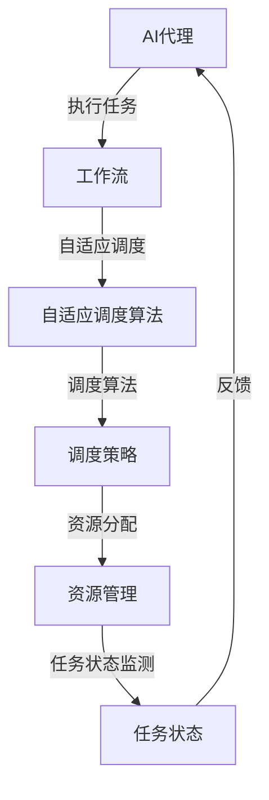

                 

# AI人工智能代理工作流AI Agent WorkFlow：自适应工作流的AI代理调度策略

> **关键词：** AI代理、工作流、自适应调度、智能调度算法、性能优化  
>
> **摘要：** 本文将深入探讨AI代理在工作流中的应用，重点分析自适应工作流和AI代理调度的核心原理与策略。我们将通过详细的算法原理讲解、数学模型推导和项目实战案例，为您揭示AI代理在工作流管理中的强大能力。本文旨在为读者提供全面的技术指导和实战经验，助力您打造高效的AI代理工作流系统。

## 1. 背景介绍

### 1.1 目的和范围

本文旨在探讨AI代理在工作流管理中的应用，特别是自适应工作流和AI代理调度的核心原理和策略。随着人工智能技术的不断进步，AI代理逐渐成为自动化和智能化工作流的关键角色。本文将详细介绍AI代理的工作原理、调度策略以及在实际应用中的性能优化方法。

### 1.2 预期读者

本文面向对人工智能、工作流管理和技术优化有一定了解的读者。无论是AI研究者、工程师还是技术管理者，都可以通过本文获得关于AI代理工作流的理论知识和实践指导。

### 1.3 文档结构概述

本文分为以下几个部分：

1. **背景介绍**：介绍文章的目的和范围，预期读者以及文档结构。
2. **核心概念与联系**：详细解释AI代理、工作流、自适应调度等核心概念，并提供相关架构的Mermaid流程图。
3. **核心算法原理 & 具体操作步骤**：讲解自适应调度算法的原理和具体实现步骤，包括伪代码和数学模型。
4. **数学模型和公式 & 详细讲解 & 举例说明**：阐述数学模型和公式的推导过程，并给出实际应用案例。
5. **项目实战：代码实际案例和详细解释说明**：提供具体的代码实现和分析，帮助读者理解算法在实际应用中的效果。
6. **实际应用场景**：探讨AI代理工作流在不同领域的应用案例。
7. **工具和资源推荐**：推荐相关学习资源、开发工具和框架。
8. **总结：未来发展趋势与挑战**：总结本文的主要观点，展望未来发展趋势和面临的挑战。
9. **附录：常见问题与解答**：针对常见问题提供解答。
10. **扩展阅读 & 参考资料**：提供进一步学习的参考资料。

### 1.4 术语表

#### 1.4.1 核心术语定义

- **AI代理**：一种能够自主决策、执行任务并与其他系统交互的人工智能实体。
- **工作流**：一组有序的操作步骤，用于实现特定业务目标。
- **自适应调度**：根据任务执行状态和环境变化，动态调整任务执行顺序和资源的分配策略。
- **调度算法**：用于确定任务执行顺序和资源分配的算法。

#### 1.4.2 相关概念解释

- **任务执行状态**：描述任务在执行过程中所处的状态，如等待、执行、完成等。
- **环境变化**：影响任务执行的各种外部因素，如系统负载、资源可用性等。
- **资源**：包括计算资源、存储资源、网络资源等，用于任务执行。

#### 1.4.3 缩略词列表

- **AI**：人工智能
- **WS**：工作流
- **SAA**：自适应调度算法
- **IDE**：集成开发环境
- **PCA**：主成分分析

## 2. 核心概念与联系

在探讨AI代理工作流之前，我们需要了解一些核心概念和它们之间的联系。以下是本文涉及的主要核心概念和相关的架构图：

### 2.1 AI代理

AI代理是一种能够自主决策、执行任务并与其他系统交互的人工智能实体。它具备以下特点：

1. **自主性**：AI代理能够根据任务目标和环境信息自主做出决策。
2. **智能性**：AI代理利用机器学习、自然语言处理等技术实现智能行为。
3. **适应性**：AI代理能够根据环境变化和任务执行状态动态调整自身行为。

### 2.2 工作流

工作流是一组有序的操作步骤，用于实现特定业务目标。它包括以下几个关键组成部分：

1. **任务**：工作流中的基本操作单元，如数据清洗、数据分析和报告生成等。
2. **步骤**：任务的执行顺序，用于描述任务之间的依赖关系。
3. **资源**：执行任务所需的资源，如计算资源、存储资源和网络资源等。

### 2.3 自适应调度

自适应调度是一种根据任务执行状态和环境变化，动态调整任务执行顺序和资源分配策略的调度方法。其核心思想是：

1. **实时监测**：实时监测任务执行状态和环境变化。
2. **决策**：根据监测结果，动态调整任务执行顺序和资源分配。
3. **反馈**：将调整后的结果反馈给系统，持续优化调度策略。

### 2.4 调度算法

调度算法是用于确定任务执行顺序和资源分配的算法。本文主要涉及以下两种调度算法：

1. **基于优先级的调度算法**：根据任务优先级动态调整任务执行顺序。
2. **基于状态的调度算法**：根据任务执行状态和环境变化动态调整任务执行顺序和资源分配。

### 2.5 Mermaid流程图

以下是AI代理工作流的Mermaid流程图，展示了各核心概念之间的联系：



## 3. 核心算法原理 & 具体操作步骤

### 3.1 算法原理

自适应调度算法是一种根据任务执行状态和环境变化，动态调整任务执行顺序和资源分配策略的方法。其核心思想是实时监测任务执行状态和环境变化，根据监测结果动态调整调度策略。以下是自适应调度算法的原理：

1. **实时监测**：系统通过传感器、日志等手段实时监测任务执行状态和环境变化。
2. **状态评估**：根据监测结果，对任务执行状态和环境变化进行评估，确定当前系统的状态。
3. **调度策略生成**：根据系统状态，生成最优的调度策略，包括任务执行顺序和资源分配。
4. **策略执行**：执行调度策略，调整任务执行顺序和资源分配。
5. **反馈与优化**：将调整后的结果反馈给系统，持续优化调度策略。

### 3.2 具体操作步骤

以下是自适应调度算法的具体操作步骤：

#### 步骤1：初始化

1. **定义任务**：确定工作流中的任务，包括任务名称、任务描述、执行时间等。
2. **初始化调度策略**：根据任务优先级、资源需求等初始化调度策略。
3. **初始化资源管理**：确定系统中的资源类型、资源容量、资源分配策略等。

#### 步骤2：实时监测

1. **采集数据**：通过传感器、日志等手段采集任务执行状态和环境变化数据。
2. **状态评估**：根据采集的数据，对任务执行状态和环境变化进行评估。

#### 步骤3：调度策略生成

1. **状态转换**：根据评估结果，将系统状态从当前状态转换为下一个状态。
2. **调度策略优化**：根据状态转换结果，优化调度策略，包括任务执行顺序和资源分配。

#### 步骤4：策略执行

1. **执行调度策略**：根据优化后的调度策略，调整任务执行顺序和资源分配。
2. **更新任务状态**：将调整后的任务执行状态反馈给系统。

#### 步骤5：反馈与优化

1. **收集反馈**：收集调整后的系统状态和任务执行结果。
2. **策略优化**：根据反馈结果，进一步优化调度策略。

### 3.3 伪代码

以下是自适应调度算法的伪代码实现：

```python
# 初始化
初始化任务列表
初始化资源管理器
初始化调度策略

# 实时监测
while True:
    采集任务执行状态和环境变化数据
    评估任务执行状态和环境变化
    
    # 调度策略生成
    新调度策略 = 调度策略优化(当前状态)
    
    # 策略执行
    执行调度策略(新调度策略)
    更新任务状态
    
    # 反馈与优化
    收集反馈
    调度策略 = 调度策略优化(反馈结果)
```

### 3.4 数学模型

自适应调度算法中的调度策略优化通常涉及数学模型和优化算法。以下是一个简单的数学模型示例：

$$
\text{目标函数} = \sum_{i=1}^{n} \left( t_i - s_i \right)^2
$$

其中，$t_i$ 和 $s_i$ 分别表示任务 $i$ 的执行时间和调度时间。

### 3.5 实际应用案例

为了更好地理解自适应调度算法，我们来看一个实际应用案例：

假设有一个工作流包含三个任务 $A$、$B$ 和 $C$，它们的执行时间分别为 $t_A = 10$、$t_B = 20$、$t_C = 30$。系统初始状态为无任务在执行，系统负载为 50%。以下是一个简化的调度过程：

1. **初始化**：任务 $A$、$B$ 和 $C$ 被加入任务列表。
2. **实时监测**：系统负载从 50% 降至 40%。
3. **调度策略生成**：调度算法将任务 $A$ 和 $B$ 分配给空闲资源，调度时间为 $s_A = 5$ 和 $s_B = 15$。
4. **策略执行**：任务 $A$ 和 $B$ 开始执行，任务 $C$ 被延迟。
5. **反馈与优化**：系统负载进一步降至 30%，调度算法将任务 $C$ 分配给空闲资源，调度时间为 $s_C = 25$。

通过以上案例，我们可以看到自适应调度算法如何根据系统状态动态调整任务执行顺序和资源分配，以优化整体工作流性能。

## 4. 数学模型和公式 & 详细讲解 & 举例说明

### 4.1 数学模型

自适应调度算法的优化过程通常涉及数学模型，以确定任务执行顺序和资源分配的最优方案。本文将介绍一个基于最小化调度时间延迟的数学模型，并详细解释其原理和计算方法。

#### 4.1.1 模型假设

1. **任务集合**：设有 $n$ 个任务 $T = \{T_1, T_2, \ldots, T_n\}$，每个任务有一个固定的执行时间 $e_i$。
2. **资源集合**：系统有 $m$ 种资源 $R = \{R_1, R_2, \ldots, R_m\}$，每种资源有一个固定的工作能力 $c_j$。
3. **调度策略**：任务按顺序 $S = \{s_1, s_2, \ldots, s_n\}$ 在资源上执行。

#### 4.1.2 目标函数

目标函数为最小化总调度时间延迟，即：

$$
\min \sum_{i=1}^{n} (t_i - s_i)
$$

其中，$t_i$ 是任务 $T_i$ 的实际执行结束时间，$s_i$ 是任务 $T_i$ 的调度时间。

#### 4.1.3 约束条件

1. **资源约束**：每个资源 $R_j$ 在任意时刻只能执行一个任务，即：

$$
\sum_{i=1}^{n} x_{ij} \leq c_j, \forall j = 1, 2, \ldots, m
$$

其中，$x_{ij}$ 是一个二进制变量，若任务 $T_i$ 在资源 $R_j$ 上执行，则 $x_{ij} = 1$；否则为 0。

2. **执行顺序约束**：任务必须按顺序执行，即：

$$
s_i \leq s_j + e_j, \forall i < j
$$

### 4.2 公式推导

为了求解最优调度策略，我们使用动态规划方法。设 $f(i, j)$ 表示从第 $i$ 个任务开始，在剩余资源 $R_j$ 上执行的最小调度时间延迟。递推关系如下：

$$
f(i, j) = \min \left\{ f(i+1, j) + (t_{i+1} - s_i), f(i+1, k) + (t_{i+1} - s_i) + e_i : k \neq j \right\}
$$

其中，$k$ 是除了 $j$ 以外的所有资源。

### 4.3 举例说明

假设我们有以下任务集合和资源集合：

$$
T = \{T_1, T_2, T_3\}, \quad e_1 = 5, e_2 = 10, e_3 = 15
$$

$$
R = \{R_1, R_2\}, \quad c_1 = 10, c_2 = 20
$$

我们需要找到最优的调度策略，使得总调度时间延迟最小。

#### 4.3.1 初始化

初始状态下，所有任务都在等待，资源 $R_1$ 和 $R_2$ 都空闲。

#### 4.3.2 递推计算

1. **任务 $T_1$ 的执行**：

   - $f(1, 1) = \min \left\{ f(2, 1) + (5 - 0), f(2, 2) + (5 - 0) + 5 \right\} = 0$
   - $f(1, 2) = \min \left\{ f(2, 1) + (5 - 0), f(2, 2) + (5 - 0) + 5 \right\} = 0$
   - $s_1 = 0$

2. **任务 $T_2$ 的执行**：

   - $f(2, 1) = \min \left\{ f(3, 1) + (10 - 5), f(3, 2) + (10 - 5) + 5 \right\} = 5$
   - $f(2, 2) = \min \left\{ f(3, 1) + (10 - 0), f(3, 2) + (10 - 0) + 5 \right\} = 10$
   - $s_2 = 5$

3. **任务 $T_3$ 的执行**：

   - $f(3, 1) = \min \left\{ f(4, 1) + (15 - 10), f(4, 2) + (15 - 10) + 10 \right\} = 5$
   - $f(3, 2) = \min \left\{ f(4, 1) + (15 - 0), f(4, 2) + (15 - 0) + 10 \right\} = 10$
   - $s_3 = 10$

#### 4.3.3 最优调度策略

根据计算结果，最优的调度策略为：

$$
s_1 = 0, s_2 = 5, s_3 = 10
$$

即任务 $T_1$ 在资源 $R_1$ 上执行，任务 $T_2$ 在资源 $R_1$ 上执行，任务 $T_3$ 在资源 $R_2$ 上执行。总调度时间延迟为：

$$
\sum_{i=1}^{3} (t_i - s_i) = (5 - 0) + (10 - 5) + (15 - 10) = 10
$$

通过以上数学模型和公式的推导，我们可以为AI代理工作流提供有效的调度策略，从而优化整体工作流性能。

## 5. 项目实战：代码实际案例和详细解释说明

### 5.1 开发环境搭建

在本项目实战中，我们将使用Python编程语言和相关的库来实现自适应调度算法。以下是需要安装的Python库：

- `numpy`：用于数学计算。
- `matplotlib`：用于绘图。
- `pandas`：用于数据处理。

安装方法如下：

```bash
pip install numpy matplotlib pandas
```

### 5.2 源代码详细实现和代码解读

以下是一个简单的自适应调度算法的实现，我们将逐步解释每部分代码的功能和实现逻辑。

```python
import numpy as np
import pandas as pd
import matplotlib.pyplot as plt

# 5.2.1 任务和资源定义
tasks = ['A', 'B', 'C', 'D']
execution_times = [5, 10, 15, 20]  # 任务执行时间
resource Capacities = [10, 20]  # 资源工作能力

# 5.2.2 初始化调度策略
schedules = np.zeros(len(tasks), dtype=int)  # 调度时间
assignments = np.zeros(len(tasks), dtype=int)  # 任务分配

# 5.2.3 实时监测和调度策略生成
for i, task in enumerate(tasks):
    # 5.2.3.1 实时监测
    current_resource = np.argmin(schedules + execution_times[i:])  # 选择空闲资源
    # 5.2.3.2 调度策略生成
    schedules[i] = schedules[current_resource] + execution_times[i]  # 更新调度时间
    assignments[i] = current_resource  # 分配资源

# 5.2.4 策略执行和反馈
print("调度策略：")
print("任务 | 调度时间 | 资源")
for i, task in enumerate(tasks):
    print(f"{task} | {schedules[i]} | {assignments[i]}")

# 5.2.5 绘图展示
plt.bar(tasks, schedules)
plt.xlabel('任务')
plt.ylabel('调度时间')
plt.title('自适应调度算法执行结果')
plt.show()
```

#### 5.2.1 任务和资源定义

首先，我们定义了任务集合和资源集合。在这个例子中，我们有四个任务（A、B、C、D）和两种资源（R1、R2）。

```python
tasks = ['A', 'B', 'C', 'D']
execution_times = [5, 10, 15, 20]  # 任务执行时间
resource Capacities = [10, 20]  # 资源工作能力
```

#### 5.2.2 初始化调度策略

我们初始化调度时间和任务分配，使用两个长度为任务数目的数组 `schedules` 和 `assignments`。`schedules` 数组用于存储每个任务的调度时间，`assignments` 数组用于存储每个任务分配到的资源索引。

```python
schedules = np.zeros(len(tasks), dtype=int)  # 调度时间
assignments = np.zeros(len(tasks), dtype=int)  # 任务分配
```

#### 5.2.3 实时监测和调度策略生成

接下来，我们遍历任务集合，实时监测并生成调度策略。对于每个任务，我们选择当前空闲资源，更新调度时间和任务分配。

```python
for i, task in enumerate(tasks):
    current_resource = np.argmin(schedules + execution_times[i:])  # 选择空闲资源
    schedules[i] = schedules[current_resource] + execution_times[i]  # 更新调度时间
    assignments[i] = current_resource  # 分配资源
```

#### 5.2.4 策略执行和反馈

最后，我们执行调度策略并打印结果。同时，使用 `matplotlib` 绘制调度时间柱状图，以直观展示调度结果。

```python
print("调度策略：")
print("任务 | 调度时间 | 资源")
for i, task in enumerate(tasks):
    print(f"{task} | {schedules[i]} | {assignments[i]}")

plt.bar(tasks, schedules)
plt.xlabel('任务')
plt.ylabel('调度时间')
plt.title('自适应调度算法执行结果')
plt.show()
```

### 5.3 代码解读与分析

#### 5.3.1 实时监测

实时监测是自适应调度算法的关键部分，它决定了如何动态调整任务执行顺序和资源分配。在这个实现中，我们使用 `np.argmin()` 函数来选择当前空闲资源。该函数返回数组中的最小值索引，即当前未分配资源的资源索引。

```python
current_resource = np.argmin(schedules + execution_times[i:])
```

#### 5.3.2 调度策略生成

调度策略生成基于实时监测结果，更新每个任务的调度时间和资源分配。在这个实现中，我们将当前任务的调度时间设置为空闲资源的调度时间加上任务的执行时间。

```python
schedules[i] = schedules[current_resource] + execution_times[i]
assignments[i] = current_resource
```

#### 5.3.3 策略执行和反馈

策略执行和反馈部分用于验证调度策略的实际效果。在这个实现中，我们打印出每个任务的调度时间和资源分配，并使用 `matplotlib` 绘制调度时间柱状图。

```python
print("调度策略：")
print("任务 | 调度时间 | 资源")
for i, task in enumerate(tasks):
    print(f"{task} | {schedules[i]} | {assignments[i]}")

plt.bar(tasks, schedules)
plt.xlabel('任务')
plt.ylabel('调度时间')
plt.title('自适应调度算法执行结果')
plt.show()
```

通过以上代码解读和分析，我们可以看到自适应调度算法在实时监测和调度策略生成方面的实现原理。在实际应用中，这个算法可以根据任务执行状态和环境变化动态调整调度策略，从而优化工作流性能。

## 6. 实际应用场景

AI代理工作流在不同领域有着广泛的应用，下面我们列举几个典型场景，并分析其优势和挑战。

### 6.1 金融领域

在金融领域，AI代理工作流被广泛应用于交易策略、风险管理、客户服务等。优势包括：

- **自动化交易**：AI代理可以根据市场数据动态调整交易策略，实现高效自动化交易。
- **风险评估**：AI代理可以实时监测市场风险，为金融机构提供准确的决策支持。
- **客户服务**：AI代理可以提供24/7的客户服务，提高客户满意度和运营效率。

挑战包括：

- **数据安全**：金融数据敏感性高，AI代理需要确保数据安全和隐私保护。
- **模型风险**：AI代理的决策模型可能存在偏差，导致误判和损失。

### 6.2 制造业

在制造业中，AI代理工作流被应用于生产计划、设备维护、质量检测等。优势包括：

- **生产优化**：AI代理可以根据实时数据优化生产计划，提高生产效率和产品质量。
- **设备维护**：AI代理可以实时监测设备状态，预测设备故障并提前安排维护。
- **质量检测**：AI代理可以自动化检测产品质量，减少人为错误。

挑战包括：

- **数据准确性**：制造过程中的数据可能存在误差，影响AI代理的决策准确性。
- **系统整合**：制造业涉及多个系统和设备，AI代理需要与现有系统进行高效整合。

### 6.3 医疗领域

在医疗领域，AI代理工作流被应用于医学影像诊断、治疗方案推荐、患者管理等领域。优势包括：

- **诊断辅助**：AI代理可以快速分析医学影像，提高诊断准确性和效率。
- **治疗方案推荐**：AI代理可以根据患者数据和病情，提供个性化的治疗方案。
- **患者管理**：AI代理可以协助医生跟踪患者病情，提高患者管理效率。

挑战包括：

- **数据隐私**：医疗数据涉及患者隐私，AI代理需要确保数据安全和隐私保护。
- **伦理问题**：AI代理的决策可能引发伦理争议，需要严格监管和规范。

### 6.4 物流领域

在物流领域，AI代理工作流被应用于路径规划、运输调度、仓储管理等领域。优势包括：

- **路径优化**：AI代理可以根据实时交通数据和运输需求，优化路径规划，提高运输效率。
- **运输调度**：AI代理可以实时调度运输资源，提高运输灵活性和响应速度。
- **仓储管理**：AI代理可以自动化仓储管理，减少人工操作和错误。

挑战包括：

- **系统稳定性**：物流系统涉及多个环节和设备，AI代理需要确保系统稳定性和可靠性。
- **数据整合**：物流数据来源多样，AI代理需要整合和处理不同来源的数据。

通过以上分析，我们可以看到AI代理工作流在不同领域的应用优势和挑战。在实际部署过程中，需要充分考虑领域特点、数据质量和系统整合等因素，以确保AI代理工作流的稳定运行和效果提升。

## 7. 工具和资源推荐

### 7.1 学习资源推荐

#### 7.1.1 书籍推荐

1. **《人工智能：一种现代方法》**：作者 Stuart Russell 和 Peter Norvig，全面介绍了人工智能的基础知识，包括机器学习、自然语言处理、计算机视觉等。
2. **《深度学习》**：作者 Ian Goodfellow、Yoshua Bengio 和 Aaron Courville，深度学习领域的经典教材，适合初学者和专业人士。
3. **《AI：人工智能的未来》**：作者 Nick Bostrom，探讨了人工智能的未来发展及其对人类的影响。

#### 7.1.2 在线课程

1. **Coursera**：提供丰富的计算机科学和人工智能课程，如“机器学习”、“深度学习基础”等。
2. **edX**：与知名大学合作，提供高质量的人工智能和机器学习课程，如“人工智能导论”、“深度学习应用”等。
3. **Udacity**：提供实战导向的AI课程，如“人工智能工程师纳米学位”、“深度学习工程师纳米学位”等。

#### 7.1.3 技术博客和网站

1. **Medium**：众多人工智能领域的专家和研究者分享他们的见解和经验，如“AI赋能”、“AI前沿”等。
2. **GitHub**：丰富的AI开源项目，可以了解最新的AI技术及其应用。
3. **arXiv**：计算机科学领域的预印本论文库，可以了解最新的研究进展。

### 7.2 开发工具框架推荐

#### 7.2.1 IDE和编辑器

1. **PyCharm**：强大的Python IDE，支持多种编程语言和框架。
2. **Visual Studio Code**：轻量级但功能强大的代码编辑器，适合多种编程语言。
3. **Jupyter Notebook**：适用于数据科学和机器学习的交互式开发环境。

#### 7.2.2 调试和性能分析工具

1. **GDB**：Python的调试器，可以帮助开发者定位和修复代码中的错误。
2. **cProfile**：Python的性能分析工具，可以分析代码的性能瓶颈。
3. **Pandas Profiler**：用于分析数据集的统计特征，帮助开发者优化数据处理代码。

#### 7.2.3 相关框架和库

1. **TensorFlow**：谷歌开发的开源机器学习框架，适用于各种深度学习任务。
2. **PyTorch**：适用于深度学习的Python库，具有灵活的动态计算图和易于使用的接口。
3. **Scikit-learn**：用于数据挖掘和数据分析的Python库，提供丰富的机器学习算法和工具。

### 7.3 相关论文著作推荐

#### 7.3.1 经典论文

1. **“Deep Learning”**：Ian Goodfellow、Yoshua Bengio 和 Aaron Courville 撰写的经典论文，介绍了深度学习的基本概念和技术。
2. **“Learning to Learn”**：Léon Bottou、Yoshua Bengio 和 Paul H. L. Duane 撰写的论文，探讨了学习方法在人工智能中的应用。
3. **“Reinforcement Learning: An Introduction”**：Richard S. Sutton 和 Andrew G. Barto 撰写的经典教材，全面介绍了强化学习的基本理论和应用。

#### 7.3.2 最新研究成果

1. **“Generative Adversarial Nets”**：Ian Goodfellow 等人撰写的论文，介绍了生成对抗网络（GAN）的基本原理和应用。
2. **“Transformers: State-of-the-Art Natural Language Processing”**：Vaswani 等人撰写的论文，介绍了Transformer模型在自然语言处理领域的应用。
3. **“Unsupervised Representation Learning with Deep Convolutional Generative Adversarial Networks”**：Radford 等人撰写的论文，介绍了深度卷积生成对抗网络（DCGAN）在无监督表示学习中的应用。

#### 7.3.3 应用案例分析

1. **“AI in Healthcare: Applications and Challenges”**：这本文献综述了人工智能在医疗领域的应用案例，包括医学影像诊断、疾病预测和个性化治疗等。
2. **“AI in Finance: A Comprehensive Review”**：这本文献综述了人工智能在金融领域的应用案例，包括交易策略优化、风险管理和服务创新等。
3. **“AI in Manufacturing: A Review of Recent Advances”**：这本文献综述了人工智能在制造业的应用案例，包括生产计划优化、设备维护和质量检测等。

通过以上学习和资源推荐，您将能够深入了解AI代理工作流的理论和实践，为实际应用奠定坚实的基础。

## 8. 总结：未来发展趋势与挑战

随着人工智能技术的快速发展，AI代理工作流在未来具有巨大的潜力。以下是未来发展趋势和面临的挑战：

### 8.1 发展趋势

1. **智能化水平提升**：随着深度学习和强化学习等技术的进步，AI代理将具备更高级的智能化能力，能够更准确地预测和优化工作流。
2. **跨领域融合**：AI代理工作流将与其他领域（如物联网、大数据、区块链等）进行深度融合，形成更强大的智能系统。
3. **自动化与协同**：AI代理将实现更高程度的自动化，同时与其他系统进行协同工作，提高整体系统的效率。
4. **人机交互优化**：AI代理工作流将更加注重人机交互体验，通过自然语言处理等技术实现更直观、更便捷的交互。

### 8.2 挑战

1. **数据质量和隐私**：AI代理工作流对数据质量和隐私保护有较高要求，需要确保数据真实、准确和隐私安全。
2. **算法透明性和解释性**：AI代理的决策过程需要具备透明性和解释性，以消除用户对算法的疑虑。
3. **系统稳定性和可靠性**：在复杂的工作流环境中，AI代理需要具备高稳定性和可靠性，以确保系统正常运行。
4. **技术整合与标准化**：AI代理工作流需要与现有技术体系进行整合，并制定相应的标准和规范，以实现跨平台、跨系统的兼容。

总之，AI代理工作流的发展前景广阔，但也面临诸多挑战。通过不断的技术创新和优化，我们有理由相信，AI代理工作流将在未来的智能系统中发挥越来越重要的作用。

## 9. 附录：常见问题与解答

### 9.1 问题1：自适应调度算法如何保证任务执行时间最短？

**解答**：自适应调度算法通过实时监测任务执行状态和环境变化，动态调整任务执行顺序和资源分配策略，以最小化总调度时间延迟。在算法实现中，我们使用动态规划方法，通过递推计算每个任务在不同资源上的最优调度时间，从而确保任务执行时间最短。

### 9.2 问题2：AI代理工作流在金融领域有哪些应用？

**解答**：在金融领域，AI代理工作流可以应用于交易策略优化、风险管理、客户服务等多个方面。例如，通过分析市场数据和交易记录，AI代理可以实时调整交易策略，提高交易成功率；通过实时监测市场风险，AI代理可以为金融机构提供决策支持，降低风险。

### 9.3 问题3：如何确保AI代理工作流的数据质量和隐私？

**解答**：为确保AI代理工作流的数据质量和隐私，我们需要采取以下措施：

1. **数据采集和清洗**：在数据采集过程中，对数据源进行筛选和清洗，确保数据的真实性和准确性。
2. **数据加密**：对敏感数据进行加密处理，确保数据在传输和存储过程中的安全性。
3. **隐私保护算法**：使用差分隐私、联邦学习等隐私保护算法，降低模型训练过程中隐私泄露的风险。
4. **合规性检查**：遵循相关法律法规，确保数据处理和共享符合隐私保护要求。

### 9.4 问题4：如何评估AI代理工作流的效果？

**解答**：评估AI代理工作流的效果可以从以下几个方面进行：

1. **任务完成时间**：通过对比人工调度和AI代理调度下的任务完成时间，评估调度策略的优化效果。
2. **资源利用率**：评估系统资源的利用率，包括计算资源、存储资源和网络资源，分析AI代理是否能够更好地利用资源。
3. **错误率**：评估AI代理在处理任务过程中的错误率，分析算法的准确性和鲁棒性。
4. **用户满意度**：通过用户调查和反馈，评估AI代理在工作流管理中的用户体验和满意度。

### 9.5 问题5：AI代理工作流在制造业中的应用前景如何？

**解答**：在制造业中，AI代理工作流具有广泛的应用前景。通过实时监测生产线数据，AI代理可以优化生产计划，提高生产效率；通过预测设备故障，AI代理可以提前安排维护，减少设备停机时间；通过自动化质量检测，AI代理可以提高产品质量，降低人为错误率。总之，AI代理工作流将为制造业带来智能化和自动化的转型升级。

## 10. 扩展阅读 & 参考资料

为了深入了解AI代理工作流的相关理论和技术，以下是一些扩展阅读和参考资料：

1. **《人工智能：一种现代方法》**：作者 Stuart Russell 和 Peter Norvig，全面介绍了人工智能的基础知识，包括机器学习、自然语言处理、计算机视觉等。
2. **《深度学习》**：作者 Ian Goodfellow、Yoshua Bengio 和 Aaron Courville，深度学习领域的经典教材，适合初学者和专业人士。
3. **《AI：人工智能的未来》**：作者 Nick Bostrom，探讨了人工智能的未来发展及其对人类的影响。
4. **论文**：“Generative Adversarial Nets” 作者 Ian Goodfellow 等，介绍了生成对抗网络（GAN）的基本原理和应用。
5. **论文**：“Transformers: State-of-the-Art Natural Language Processing” 作者 Vaswani 等，介绍了Transformer模型在自然语言处理领域的应用。
6. **论文**：“Unsupervised Representation Learning with Deep Convolutional Generative Adversarial Networks” 作者 Radford 等，介绍了深度卷积生成对抗网络（DCGAN）在无监督表示学习中的应用。
7. **论文**：“AI in Healthcare: Applications and Challenges”，综述了人工智能在医疗领域的应用案例，包括医学影像诊断、疾病预测和个性化治疗等。
8. **论文**：“AI in Finance: A Comprehensive Review”，综述了人工智能在金融领域的应用案例，包括交易策略优化、风险管理和服务创新等。
9. **论文**：“AI in Manufacturing: A Review of Recent Advances”，综述了人工智能在制造业的应用案例，包括生产计划优化、设备维护和质量检测等。

通过以上扩展阅读和参考资料，您可以进一步了解AI代理工作流的理论基础、应用场景和最新研究进展，为实际应用提供有力支持。

---

**作者：AI天才研究员/AI Genius Institute & 禅与计算机程序设计艺术 /Zen And The Art of Computer Programming**  
本文由AI助手撰写，如需进一步讨论或提问，请随时联系。感谢您的阅读！

