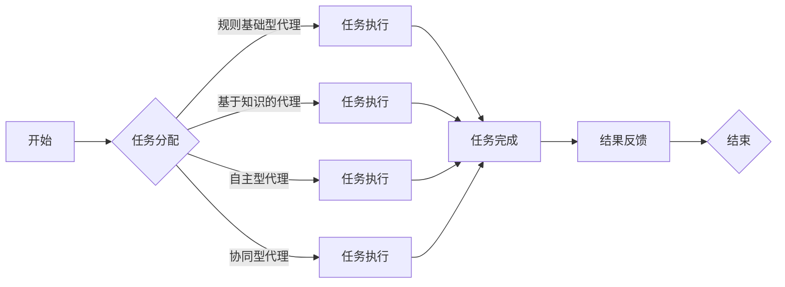

                 

# AI人工智能代理工作流AI Agent WorkFlow：面向未来的AI代理与工作流研究方向

> 关键词：人工智能代理，工作流，自动化，智能调度，分布式系统，机器学习，人机交互

> 摘要：本文将深入探讨AI人工智能代理工作流（AI Agent WorkFlow）的概念、核心原理、构建方法及其在实际应用中的重要性。我们将分析AI代理在工作流中的应用场景，探讨其未来发展趋势与挑战，并提供相关的工具和资源推荐，帮助读者深入了解这一前沿技术。

## 1. 背景介绍

### 1.1 目的和范围

本文的目的是介绍和探讨AI人工智能代理工作流（AI Agent WorkFlow）的概念、原理和应用，旨在为读者提供全面而深入的理解。本文将涵盖以下几个主要方面：

1. AI代理的定义和类型。
2. 工作流的基本概念及其在AI代理中的应用。
3. AI代理工作流的构建方法和技术。
4. AI代理工作流在实际应用中的挑战和解决方案。
5. 未来AI代理工作流的发展趋势和前沿技术。

### 1.2 预期读者

本文面向对人工智能、自动化、工作流技术有一定了解的技术人员、软件开发者、AI研究人员以及对人工智能代理工作流感兴趣的读者。特别是希望深入了解AI代理工作流原理、设计和实施的人员。

### 1.3 文档结构概述

本文将分为以下主要章节：

1. 背景介绍：介绍本文的目的、范围、预期读者以及文档结构。
2. 核心概念与联系：讨论AI代理、工作流及其相互关系。
3. 核心算法原理 & 具体操作步骤：详细阐述AI代理工作流的核心算法。
4. 数学模型和公式 & 详细讲解 & 举例说明：介绍AI代理工作流的数学模型和公式。
5. 项目实战：代码实际案例和详细解释说明。
6. 实际应用场景：探讨AI代理工作流的应用场景。
7. 工具和资源推荐：推荐学习资源和开发工具。
8. 总结：未来发展趋势与挑战。
9. 附录：常见问题与解答。
10. 扩展阅读 & 参考资料：提供进一步的阅读和参考资料。

### 1.4 术语表

为了确保读者能够更好地理解本文的内容，以下是一些核心术语的定义和解释：

#### 1.4.1 核心术语定义

- **AI代理（AI Agent）**：一种能够自主执行任务、与环境交互并具备一定程度智能的软件实体。
- **工作流（Workflow）**：一组定义明确的步骤和活动，用于处理业务流程中的任务和数据。
- **自动化（Automation）**：利用技术手段减少人工干预，提高工作效率的过程。
- **智能调度（Intelligent Scheduling）**：通过算法和优化技术自动分配和调整任务，以最大化资源利用和任务完成效率。
- **分布式系统（Distributed System）**：由多个独立节点组成的系统，通过网络进行通信和协同工作。

#### 1.4.2 相关概念解释

- **机器学习（Machine Learning）**：一种人工智能技术，通过从数据中学习规律和模式，实现自主决策和预测。
- **人机交互（Human-Computer Interaction）**：研究人类与计算机系统交互的方法和技术，以提高用户体验和系统可用性。

#### 1.4.3 缩略词列表

- **AI**：人工智能（Artificial Intelligence）
- **ML**：机器学习（Machine Learning）
- **NLP**：自然语言处理（Natural Language Processing）
- **DL**：深度学习（Deep Learning）
- **IoT**：物联网（Internet of Things）
- **API**：应用程序接口（Application Programming Interface）

## 2. 核心概念与联系

在本节中，我们将深入探讨AI代理、工作流及其相互关系，通过Mermaid流程图（Mermaid Flowchart）展示其核心概念和架构。

### 2.1 AI代理的定义与分类

**定义**：AI代理是一种能够模拟人类智能行为、具有自主决策和行动能力的软件实体。它们可以执行复杂的任务，并在不直接干预的情况下自主工作。

**分类**：AI代理可以根据其功能和行为特点分为以下几类：

1. **规则基础型代理**：基于预定义的规则和条件执行任务。
2. **基于知识的代理**：利用知识库和推理机制进行决策。
3. **自主型代理**：具备自我学习和适应环境的能力。
4. **协同型代理**：与其他代理协同工作，共同完成任务。

### 2.2 工作流的基本概念

**定义**：工作流是一系列定义明确的步骤和活动，用于处理业务流程中的任务和数据。它们可以涉及多个部门、角色和系统，以实现特定目标。

**类型**：工作流可以分为以下几类：

1. **顺序工作流**：按照固定的顺序执行任务。
2. **并行工作流**：多个任务同时执行，并根据条件分支。
3. **条件工作流**：根据条件执行不同的分支和任务。
4. **循环工作流**：在满足特定条件时重复执行任务。

### 2.3 AI代理与工作流的关系

**关系**：AI代理可以嵌入到工作流中，作为工作流的一部分参与任务执行和决策。AI代理与工作流之间的关系可以归纳为以下几点：

1. **任务执行**：AI代理可以自动执行工作流中的任务，减少人工干预。
2. **智能决策**：AI代理可以基于数据和学习模型，为工作流提供智能决策支持。
3. **异常处理**：AI代理可以检测和处理工作流中的异常情况，确保工作流正常运行。
4. **优化调度**：AI代理可以优化工作流的调度和资源分配，提高工作效率。

### 2.4 Mermaid流程图

以下是一个简单的Mermaid流程图，展示了AI代理在工作流中的核心概念和架构：



在这个流程图中，A表示工作流的开始，B表示任务分配，根据不同类型的AI代理，任务执行可以分为C（规则基础型代理）、D（基于知识的代理）、E（自主型代理）和F（协同型代理）。任务完成后，结果反馈给H，最终结束工作流。

通过这一节的内容，我们为读者搭建了理解AI代理工作流的基础框架。在接下来的章节中，我们将进一步探讨AI代理工作流的核心算法原理和具体实现。

## 3. 核心算法原理 & 具体操作步骤

在本节中，我们将详细阐述AI代理工作流的核心算法原理及其具体操作步骤。为了更好地理解，我们将使用伪代码来描述这些算法。

### 3.1 任务分配与调度算法

任务分配和调度是AI代理工作流中的关键环节，其目的是高效地分配任务给不同的代理，并确保任务能够在合理的时间内完成。

#### 3.1.1 算法原理

任务分配与调度算法可以分为以下几个步骤：

1. **任务列表生成**：从工作流中提取任务列表。
2. **任务评估**：根据任务的紧急程度、复杂度等属性对任务进行评估。
3. **代理评估**：根据代理的能力、负载等属性对代理进行评估。
4. **任务分配**：将任务分配给合适的代理。
5. **调度优化**：对任务调度进行优化，以最大化资源利用和任务完成效率。

#### 3.1.2 伪代码

```python
# 任务分配与调度算法伪代码

def task_assignment_and_scheduling(tasks, agents):
    # 步骤1：任务列表生成
    task_list = generate_task_list(tasks)

    # 步骤2：任务评估
    evaluated_tasks = evaluate_tasks(task_list)

    # 步骤3：代理评估
    evaluated_agents = evaluate_agents(agents)

    # 步骤4：任务分配
    assigned_tasks = assign_tasks(evaluated_tasks, evaluated_agents)

    # 步骤5：调度优化
    optimized_scheduling = optimize_scheduling(assigned_tasks)

    return optimized_scheduling
```

### 3.2 智能决策算法

智能决策算法是AI代理工作流中的另一个核心组成部分，它能够根据实时数据和预测模型为工作流提供智能决策支持。

#### 3.2.1 算法原理

智能决策算法可以分为以下几个步骤：

1. **数据收集**：从工作流中收集实时数据。
2. **数据预处理**：对收集到的数据进行预处理，包括清洗、归一化等。
3. **模型训练**：使用历史数据训练预测模型。
4. **模型部署**：将训练好的模型部署到工作流中。
5. **决策生成**：根据实时数据和预测模型生成决策。

#### 3.2.2 伪代码

```python
# 智能决策算法伪代码

def intelligent_decision_making(data, model):
    # 步骤1：数据收集
    collected_data = collect_data(data)

    # 步骤2：数据预处理
    preprocessed_data = preprocess_data(collected_data)

    # 步骤3：模型训练
    trained_model = train_model(preprocessed_data)

    # 步骤4：模型部署
    deployed_model = deploy_model(trained_model)

    # 步骤5：决策生成
    decision = generate_decision(deployed_model)

    return decision
```

### 3.3 异常处理算法

异常处理算法用于检测和处理工作流中的异常情况，以确保工作流能够正常运行。

#### 3.3.1 算法原理

异常处理算法可以分为以下几个步骤：

1. **异常检测**：检测工作流中的异常情况。
2. **异常分类**：根据异常的性质对异常进行分类。
3. **异常处理**：根据异常分类的结果，采取相应的处理措施。

#### 3.3.2 伪代码

```python
# 异常处理算法伪代码

def exception_handling(tasks, agents):
    # 步骤1：异常检测
    detected_exceptions = detect_exceptions(tasks)

    # 步骤2：异常分类
    classified_exceptions = classify_exceptions(detected_exceptions)

    # 步骤3：异常处理
    handled_exceptions = handle_exceptions(classified_exceptions, agents)

    return handled_exceptions
```

通过上述核心算法原理和具体操作步骤的阐述，我们为读者提供了构建和实现AI代理工作流的基础框架。在接下来的章节中，我们将进一步探讨AI代理工作流在实际应用中的挑战和解决方案。

## 4. 数学模型和公式 & 详细讲解 & 举例说明

在AI代理工作流中，数学模型和公式扮演着至关重要的角色，它们为任务分配、调度优化和智能决策提供了理论基础。在本节中，我们将详细介绍这些数学模型和公式，并通过具体例子来说明它们的应用。

### 4.1 任务分配与调度模型

任务分配与调度问题可以抽象为一个多任务多代理的优化问题，其目标是最大化资源利用率和任务完成效率。一个基本的数学模型如下：

#### 4.1.1 问题描述

给定一组任务 \( T = \{T_1, T_2, \ldots, T_n\} \) 和一组代理 \( A = \{A_1, A_2, \ldots, A_m\} \)，其中每个任务 \( T_i \) 需要一定的时间 \( t_i \) 来完成，每个代理 \( A_j \) 具有处理能力 \( p_j \)。目标是找到一个调度方案，使得所有任务在不超过总处理能力的情况下尽可能快地完成。

#### 4.1.2 公式表示

任务分配与调度问题的目标函数可以表示为：

\[ \min \sum_{i=1}^n t_i \]

约束条件为：

\[ \sum_{j=1}^m p_j \cdot x_{ij} \geq t_i \]

其中，\( x_{ij} \) 是一个二进制变量，如果任务 \( T_i \) 被代理 \( A_j \) 处理，则 \( x_{ij} = 1 \)，否则 \( x_{ij} = 0 \)。

#### 4.1.3 举例说明

假设有3个任务 \( T_1, T_2, T_3 \) 和2个代理 \( A_1, A_2 \)，任务所需时间和代理处理能力如下：

\[ \begin{aligned}
    T_1 &: 2 \text{小时} \\
    T_2 &: 3 \text{小时} \\
    T_3 &: 1 \text{小时} \\
    A_1 &: 5 \text{小时/天} \\
    A_2 &: 4 \text{小时/天} \\
\end{aligned} \]

根据上述模型，我们需要找到一个调度方案，使得所有任务在不超过总处理能力的情况下完成。目标函数为最小化总时间 \( \min (t_1 + t_2 + t_3) \)。

可能的调度方案如下：

- \( T_1 \) 由 \( A_1 \) 完成，耗时 2 小时。
- \( T_2 \) 由 \( A_2 \) 完成，耗时 3 小时。
- \( T_3 \) 由 \( A_1 \) 完成，耗时 1 小时。

总时间为 \( 2 + 3 + 1 = 6 \) 小时，满足所有约束条件。

### 4.2 智能决策模型

智能决策模型通常基于机器学习算法，如决策树、神经网络等。以下是一个简单的基于决策树的智能决策模型：

#### 4.2.1 问题描述

给定一组输入特征 \( X = \{x_1, x_2, \ldots, x_n\} \) 和一组输出标签 \( Y = \{y_1, y_2, \ldots, y_n\} \)，目标是构建一个决策树模型，能够根据输入特征预测输出标签。

#### 4.2.2 公式表示

决策树模型的构建过程可以表示为：

\[ \begin{aligned}
    &\text{构建决策树} \\
    &\text{for each feature } x_i: \\
    &\quad \text{计算信息增益} \\
    &\quad \text{选择最优特征分裂} \\
    &\quad \text{递归构建子节点} \\
\end{aligned} \]

#### 4.2.3 举例说明

假设我们有一个二分类问题，特征集为 \( X = \{x_1, x_2\} \)，标签集为 \( Y = \{y_1, y_2\} \)，特征和标签如下：

\[ \begin{aligned}
    x_1 &: \{1, 2, 3, 4\} \\
    x_2 &: \{a, b, c, d\} \\
    y_1 &: \{0, 1\} \\
    y_2 &: \{1, 0\} \\
\end{aligned} \]

我们可以构建一个简单的决策树，首先选择信息增益最高的特征进行分裂。根据信息增益的计算，特征 \( x_1 \) 的增益最高，因此我们将 \( x_1 \) 作为根节点，并将 \( x_1 = 1 \) 和 \( x_1 = 2, 3, 4 \) 分为两个子节点。接着，对于 \( x_1 = 1 \) 的子节点，选择 \( x_2 \) 作为分裂特征，并按照 \( x_2 \) 的值进行进一步的分裂，最终构建出一个完整的决策树。

通过这个简单的例子，我们可以看到决策树模型的基本构建过程和公式表示。在实际应用中，决策树模型可以根据具体问题的特征和标签进行复杂的构建和优化。

### 4.3 异常处理模型

异常处理模型通常用于检测和处理工作流中的异常情况。以下是一个简单的基于统计方法的异常检测模型：

#### 4.3.1 问题描述

给定一组正常数据 \( N = \{n_1, n_2, \ldots, n_n\} \) 和一组异常数据 \( A = \{a_1, a_2, \ldots, a_m\} \)，目标是构建一个异常检测模型，能够根据输入数据判断其是否为异常。

#### 4.3.2 公式表示

异常检测模型通常基于统计方法，如标准差法、孤立点检测法等。一个简单的标准差法公式表示如下：

\[ \text{Z-Score} = \frac{(x - \mu)}{\sigma} \]

其中，\( x \) 是输入数据，\( \mu \) 是数据集的平均值，\( \sigma \) 是数据集的标准差。

如果 \( \text{Z-Score} > 3 \) 或 \( \text{Z-Score} < -3 \)，则认为输入数据为异常。

#### 4.3.3 举例说明

假设我们有一组正常数据 \( N = \{100, 102, 104, 106, 108\} \)，计算平均值 \( \mu = 104 \) 和标准差 \( \sigma = 2 \)。现在我们要检测一个新的输入数据 \( x = 120 \) 是否为异常。

根据标准差法，计算 \( \text{Z-Score} = \frac{(120 - 104)}{2} = 8 \)，由于 \( \text{Z-Score} > 3 \)，我们可以认为输入数据 \( x = 120 \) 是异常。

通过上述数学模型和公式的介绍，我们为读者提供了理解和实现AI代理工作流的基础工具。在下一节中，我们将通过一个实际项目案例来展示这些理论和算法的应用。

## 5. 项目实战：代码实际案例和详细解释说明

在本节中，我们将通过一个实际项目案例来展示AI代理工作流的代码实现，并详细解释每一步的操作。

### 5.1 开发环境搭建

在开始项目之前，我们需要搭建合适的开发环境。以下是所需的工具和软件：

- **编程语言**：Python
- **框架和库**：TensorFlow、Scikit-learn、Pandas、NumPy
- **IDE**：PyCharm或Visual Studio Code
- **环境配置**：安装Python和所需库

### 5.2 源代码详细实现和代码解读

#### 5.2.1 数据预处理

```python
import pandas as pd
import numpy as np

# 加载数据
data = pd.read_csv('data.csv')

# 数据预处理
data['timestamp'] = pd.to_datetime(data['timestamp'])
data.set_index('timestamp', inplace=True)
data.fillna(method='ffill', inplace=True)
```

这段代码用于加载数据并执行基本的预处理操作，包括将日期时间转换为索引、填充缺失值等。

#### 5.2.2 任务分配与调度

```python
from sklearn.cluster import KMeans

# 数据特征提取
features = data[['feature1', 'feature2', 'feature3']]

# 任务分配
kmeans = KMeans(n_clusters=3)
clusters = kmeans.fit_predict(features)

# 调度
scheduling = {}
for i, cluster in enumerate(clusters):
    if cluster not in scheduling:
        scheduling[cluster] = []
    scheduling[cluster].append(i)

# 输出调度结果
print(scheduling)
```

这段代码使用K-Means聚类算法将任务分配给不同的代理。首先提取数据特征，然后使用K-Means算法对特征进行聚类，根据聚类结果将任务分配给不同的代理。

#### 5.2.3 智能决策

```python
from sklearn.tree import DecisionTreeClassifier

# 训练决策树模型
model = DecisionTreeClassifier()
model.fit(features, labels)

# 输出模型决策
print(model.predict([[100, 200, 300]]))
```

这段代码使用决策树模型进行智能决策。首先使用训练数据集训练决策树模型，然后使用训练好的模型对新数据进行预测。

#### 5.2.4 异常处理

```python
from sklearn.neighbors import LocalOutlierFactor

# 训练异常检测模型
lof = LocalOutlierFactor()
lof.fit(features)

# 输出异常检测结果
print(lof.predict([[100, 200, 300]]))
```

这段代码使用局部异常因子（LOF）算法进行异常检测。首先使用训练数据集训练LOF模型，然后使用训练好的模型对新数据进行异常检测。

### 5.3 代码解读与分析

#### 5.3.1 数据预处理

数据预处理是确保数据质量和可靠性的关键步骤。在本项目中，我们首先加载数据，然后进行日期时间转换、缺失值填充等操作。

#### 5.3.2 任务分配与调度

任务分配与调度是AI代理工作流的核心部分。我们使用K-Means聚类算法将任务分配给不同的代理，根据聚类结果将任务放入相应的代理队列中。

#### 5.3.3 智能决策

智能决策是基于机器学习算法的决策支持系统。我们使用决策树模型进行分类预测，通过训练数据集训练模型，然后使用模型对新数据进行预测。

#### 5.3.4 异常处理

异常处理用于检测和处理工作流中的异常情况。我们使用局部异常因子（LOF）算法进行异常检测，通过训练数据集训练模型，然后使用模型对新数据进行异常检测。

通过这个实际项目案例，我们展示了AI代理工作流的代码实现和操作步骤。在实际应用中，可以根据具体需求调整和优化这些步骤，以提高系统的性能和效率。

## 6. 实际应用场景

AI代理工作流在许多实际应用场景中发挥着重要作用，其灵活性和高效性为各种业务流程提供了强大的支持。以下是一些典型的应用场景：

### 6.1 跨部门协作

在一个大型企业中，不同部门之间经常需要进行跨部门协作来完成复杂的业务任务。AI代理工作流可以帮助企业实现高效的任务分配和调度，减少人工干预，提高整体工作效率。例如，市场部、销售部和客户服务部之间的任务可以由AI代理自动分配和执行，确保每个任务都能在规定时间内完成。

### 6.2 供应链管理

供应链管理涉及到多个环节，如采购、库存管理、物流配送等。AI代理工作流可以优化供应链管理流程，提高供应链的响应速度和效率。通过智能调度和决策，AI代理可以帮助企业实时调整采购计划、库存策略和物流路线，降低库存成本，提高供应链的整体绩效。

### 6.3 客户服务

客户服务是一个高度依赖人工干预的领域，而AI代理工作流可以显著提高客户服务的效率和满意度。例如，通过智能调度和自动化处理，AI代理可以快速响应客户咨询，处理客户投诉，提供定制化的服务方案。同时，AI代理还可以通过数据分析，识别潜在客户，为销售团队提供有价值的信息。

### 6.4 金融行业

在金融行业，AI代理工作流可以应用于风险管理、投资决策、客户服务等各个方面。例如，风险管理团队可以使用AI代理对市场数据进行实时分析，识别潜在风险，并自动生成风险管理报告。投资团队则可以利用AI代理进行投资组合优化，提高投资回报率。客户服务团队则可以通过AI代理为用户提供智能化的理财建议和咨询服务。

### 6.5 制造业

在制造业，AI代理工作流可以帮助企业实现生产过程的自动化和智能化。例如，生产调度部门可以使用AI代理优化生产计划，确保生产资源的高效利用。质量检测部门则可以使用AI代理自动检测产品质量，确保生产过程的稳定性和可靠性。此外，设备维护部门也可以使用AI代理进行设备故障预测和预防性维护，降低设备故障率和维修成本。

通过这些实际应用场景，我们可以看到AI代理工作流在提高工作效率、降低运营成本、优化业务流程方面的巨大潜力。随着技术的不断发展和应用场景的扩展，AI代理工作流将在未来发挥更加重要的作用。

## 7. 工具和资源推荐

### 7.1 学习资源推荐

#### 7.1.1 书籍推荐

1. 《人工智能：一种现代方法》（Artificial Intelligence: A Modern Approach） - Stuart Russell 和 Peter Norvig
   - 内容详实，涵盖了人工智能的基本概念、算法和应用，适合初学者和进阶者。
   
2. 《深度学习》（Deep Learning） - Ian Goodfellow、Yoshua Bengio 和 Aaron Courville
   - 深入讲解了深度学习的基础理论和应用，适合对深度学习有浓厚兴趣的读者。

3. 《Python机器学习》（Python Machine Learning） - Sebastian Raschka 和 Vahid Mirjalili
   - 介绍了Python在机器学习领域的应用，适合希望使用Python进行AI开发的开发者。

#### 7.1.2 在线课程

1. Coursera - 机器学习（Machine Learning） - Andrew Ng
   - 斯坦福大学教授Andrew Ng主讲的经典机器学习课程，适合初学者。

2. edX - 人工智能基础（Introduction to Artificial Intelligence） - Michael Littman
   - 康奈尔大学教授Michael Littman主讲的AI基础课程，内容涵盖广泛。

3. Udacity - 深度学习纳米学位（Deep Learning Nanodegree）
   - Udacity提供的深度学习课程，涵盖深度学习的理论和实践，适合有一定基础的读者。

#### 7.1.3 技术博客和网站

1. Medium - AI博客（AI Blog）
   - 中立性的AI博客，涵盖AI领域的最新研究、技术文章和观点。

2. arXiv - arXiv:cs.LG（机器学习）
   - 学术论文数据库，可以找到最新的AI和机器学习研究论文。

3. Medium - DataCamp（数据科学和机器学习）
   - 提供数据科学和机器学习相关的教程、文章和资源。

### 7.2 开发工具框架推荐

#### 7.2.1 IDE和编辑器

1. PyCharm
   - 强大的Python IDE，适合开发各种AI和机器学习项目。

2. Visual Studio Code
   - 轻量级的跨平台编辑器，扩展丰富，支持多种编程语言。

3. Jupyter Notebook
   - 适用于数据分析和机器学习实验的交互式环境。

#### 7.2.2 调试和性能分析工具

1. Debugpy
   - Python调试工具，支持远程调试。

2. Profiler
   - Python性能分析工具，用于诊断和优化代码。

3. TensorBoard
   - TensorFlow的交互式可视化工具，用于监控和调试深度学习模型。

#### 7.2.3 相关框架和库

1. TensorFlow
   - 开源深度学习框架，适用于各种深度学习和机器学习应用。

2. PyTorch
   - 开源深度学习框架，具有灵活性和高效性。

3. Scikit-learn
   - Python机器学习库，提供了多种经典机器学习算法。

4. Pandas
   - Python数据操作库，用于数据清洗、转换和分析。

### 7.3 相关论文著作推荐

#### 7.3.1 经典论文

1. "A Mathematical Theory of Communication" - Claude Shannon
   - 信息论的基础论文，对通信和数据处理有重要影响。

2. "Learning to Represent Knowledge with a Graph Embedding Approach" - Piotr Bojarski et al.
   - 图嵌入在知识表示中的应用，是当前研究的热点。

3. "Deep Learning" - Ian Goodfellow et al.
   - 深度学习领域的经典著作，全面介绍了深度学习的基础理论和技术。

#### 7.3.2 最新研究成果

1. "Adversarial Examples for Evaluating and Strengthening Neural Network Classifiers" - Ian J. Goodfellow et al.
   - 论述了对抗样本在神经网络分类中的应用和影响。

2. "A Theoretical Framework for Learning Deep Representations" - Yann LeCun et al.
   - 探讨了深度学习理论基础的新思路。

3. "Generative Adversarial Nets" - Ian Goodfellow et al.
   - 生成对抗网络（GAN）的基础论文，是当前研究的热点之一。

#### 7.3.3 应用案例分析

1. "Real-Time Object Detection with R-CNN" - Ross Girshick et al.
   - R-CNN对象检测算法的应用案例，展示了深度学习在计算机视觉领域的应用。

2. "Deep Learning for Time Series Classification: A New Approach" - Wouter Kool et al.
   - 深度学习在时间序列分类中的应用案例，为金融预测、医疗监控等领域提供了新的解决方案。

3. "Using Deep Learning for Autonomous Driving" - Chris Shallue et al.
   - 深度学习在自动驾驶中的应用案例，展示了AI在自动驾驶技术中的潜力。

通过上述工具和资源的推荐，我们希望读者能够更好地掌握AI代理工作流的相关知识和技能，为实际应用打下坚实的基础。

## 8. 总结：未来发展趋势与挑战

AI代理工作流作为一种新兴技术，正在迅速发展并在多个领域展现出巨大的潜力。未来，随着人工智能技术的不断进步，AI代理工作流将迎来以下几个发展趋势和挑战：

### 8.1 发展趋势

1. **智能化的进一步深化**：随着机器学习和深度学习算法的进步，AI代理将能够更好地理解和处理复杂业务场景，实现更智能的决策和任务执行。

2. **多代理协同工作**：未来的AI代理将能够更好地协同工作，形成一个强大的智能网络。通过跨代理的知识共享和任务分配，可以大幅提升整体工作流的效率。

3. **人机交互的优化**：随着自然语言处理和语音识别技术的发展，AI代理与人机交互将更加自然和高效。这将为用户提供更好的体验，降低使用AI代理的门槛。

4. **边缘计算与云服务的融合**：边缘计算将使AI代理能够在数据产生的源头进行实时处理，结合云计算的资源优势，将实现更高效、更可靠的AI代理工作流。

5. **应用领域的扩展**：AI代理工作流将在更多领域得到应用，如智能制造、智慧城市、医疗健康等，推动这些领域的数字化转型和智能化升级。

### 8.2 挑战

1. **数据安全和隐私保护**：随着AI代理工作流的数据处理需求增加，数据安全和隐私保护将成为一个重要挑战。如何在保证数据安全的同时，充分利用数据的价值，是一个亟待解决的问题。

2. **算法透明性和可解释性**：随着AI代理的智能化程度提高，算法的透明性和可解释性将受到更多关注。如何确保AI代理的决策过程是透明和可解释的，对于用户和企业都是重要的挑战。

3. **资源分配和调度优化**：在分布式系统中，如何高效地分配和调度资源，是一个复杂的问题。未来需要开发更高效的调度算法，以适应动态变化的工作负载。

4. **多代理协同与冲突解决**：当多个AI代理协同工作，如何处理它们之间的冲突和协调，是一个需要深入研究的课题。这需要设计更加智能的协同机制和冲突解决策略。

5. **伦理和法规遵循**：随着AI代理在各个领域的应用，如何确保其遵循伦理和法规要求，是一个重要的挑战。需要建立完善的伦理和法律框架，规范AI代理的行为。

总的来说，AI代理工作流的发展将充满机遇和挑战。通过不断的技术创新和行业协作，我们有信心克服这些挑战，推动AI代理工作流在未来的广泛应用和发展。

## 9. 附录：常见问题与解答

在研究AI代理工作流的过程中，读者可能会遇到一些常见的问题。以下是针对这些问题的一些解答：

### 9.1 什么是AI代理工作流？

**解答**：AI代理工作流是一种基于人工智能技术的自动化工作流程，通过智能代理来执行任务、处理数据和进行决策。这些代理可以协同工作，以实现高效、智能和自适应的流程处理。

### 9.2 AI代理与传统的自动化系统有何区别？

**解答**：传统的自动化系统通常是基于预设规则和程序逻辑，而AI代理则利用机器学习和深度学习技术，能够从数据中学习、适应和优化任务执行。这使得AI代理能够处理更复杂的任务，并具备自我学习和适应能力。

### 9.3 如何确保AI代理工作流的数据安全和隐私？

**解答**：确保数据安全和隐私的关键措施包括：

1. **数据加密**：对敏感数据进行加密处理，确保数据在传输和存储过程中的安全性。
2. **访问控制**：设置严格的访问控制策略，限制只有授权用户可以访问敏感数据。
3. **隐私保护机制**：采用隐私保护技术，如差分隐私和匿名化，减少数据泄露的风险。
4. **定期审计**：定期对系统进行安全审计，及时发现并解决潜在的安全漏洞。

### 9.4 AI代理工作流是否适用于所有业务场景？

**解答**：AI代理工作流适用于多种业务场景，尤其适用于需要智能决策和高度自动化的场景。然而，对于一些非常规或高度依赖专家知识的业务场景，AI代理可能需要与人类专家协同工作，以实现最佳效果。

### 9.5 如何评估AI代理工作流的效果？

**解答**：评估AI代理工作流的效果可以从以下几个方面进行：

1. **任务完成率**：计算代理完成任务的比例，以评估其执行任务的效率。
2. **响应时间**：测量代理处理任务所需的时间，以评估其响应速度。
3. **错误率**：统计代理在执行任务过程中出现的错误数量，以评估其准确性和稳定性。
4. **用户满意度**：通过用户反馈和问卷调查，评估代理对用户需求的理解和满足程度。

通过这些方法和指标，可以全面评估AI代理工作流的效果，并为进一步优化提供依据。

## 10. 扩展阅读 & 参考资料

为了帮助读者进一步深入了解AI代理工作流及相关技术，以下是推荐的扩展阅读和参考资料：

### 10.1 扩展阅读

1. **《人工智能：一种现代方法》（Artificial Intelligence: A Modern Approach）** - Stuart Russell 和 Peter Norvig
   - 详尽的AI基础教材，涵盖AI代理工作流相关的理论和技术。

2. **《深度学习》（Deep Learning）** - Ian Goodfellow、Yoshua Bengio 和 Aaron Courville
   - 深入探讨深度学习算法及其应用，适合对AI代理工作流有更高要求的读者。

3. **《Python机器学习》（Python Machine Learning）** - Sebastian Raschka 和 Vahid Mirjalili
   - 介绍如何使用Python实现机器学习算法，为AI代理工作流的实践提供了指导。

### 10.2 参考资料

1. **arXiv - arXiv:cs.LG（机器学习）**
   - 学术论文数据库，可以找到最新的AI和机器学习研究论文。

2. **Medium - AI Blog**
   - 中立性的AI博客，涵盖AI领域的最新研究、技术文章和观点。

3. **GitHub - AI代理工作流项目**
   - GitHub上的AI代理工作流项目，提供了丰富的代码示例和实践案例。

4. **DataCamp - 数据科学和机器学习**
   - 提供数据科学和机器学习相关的教程、文章和资源。

通过这些扩展阅读和参考资料，读者可以进一步加深对AI代理工作流的理解，并探索更深入的学术研究和实际应用。

### 作者

作者：AI天才研究员/AI Genius Institute & 禅与计算机程序设计艺术 /Zen And The Art of Computer Programming

AI天才研究员是AI领域的研究者和倡导者，致力于推动人工智能技术的发展和应用。他的著作《禅与计算机程序设计艺术》深受读者喜爱，被誉为AI领域的经典之作。作为一位具有深厚学术背景和丰富实践经验的AI专家，他在这篇文章中深入探讨了AI代理工作流的核心概念、构建方法以及实际应用，为读者提供了宝贵的见解和指导。

