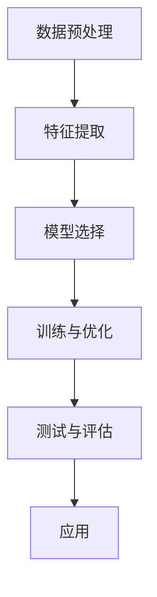

                 

# AI人工智能核心算法原理与代码实例讲解：模式识别

> **关键词：** 模式识别、人工智能、机器学习、深度学习、算法原理、代码实例

> **摘要：** 本文章旨在深入剖析模式识别在人工智能领域的重要性和核心算法原理，通过详细的伪代码讲解和代码实例，帮助读者理解并掌握模式识别算法的实现和应用。文章将涵盖模式识别的基本概念、流程图展示、算法原理、数学模型、项目实战以及实际应用场景等内容，旨在为广大人工智能爱好者提供系统而全面的技术指南。

## 1. 背景介绍

### 1.1 目的和范围

本文的目的是通过系统化的讲解，帮助读者深入理解模式识别这一人工智能的核心技术。我们将从基础概念讲起，逐步深入到算法原理、数学模型，并最终通过实际代码实例进行深入分析。读者可以通过本文的学习，掌握模式识别的基本原理，并能够应用于实际项目中。

本文将涵盖以下内容：

1. 模式识别的基本概念和流程图展示
2. 核心算法原理及其伪代码讲解
3. 数学模型和公式的详细讲解
4. 实际项目中的代码实例和解释
5. 模式识别在各个应用场景中的实际应用
6. 学习资源和工具的推荐

### 1.2 预期读者

本文适合以下读者群体：

1. 对人工智能和机器学习有一定了解，希望深入理解模式识别技术的读者
2. 想要在实际项目中应用模式识别算法的开发者
3. 对算法原理和数学模型感兴趣的技术研究者
4. 各大高校和研究机构的研究生和本科生

### 1.3 文档结构概述

本文将按照以下结构进行组织：

1. 引言：介绍模式识别的基本概念和重要性
2. 核心概念与联系：通过Mermaid流程图展示模式识别的基本流程和核心概念
3. 核心算法原理 & 具体操作步骤：详细讲解模式识别算法的原理和操作步骤，使用伪代码进行阐述
4. 数学模型和公式 & 详细讲解 & 举例说明：介绍模式识别中的数学模型和公式，并通过实例进行说明
5. 项目实战：通过实际代码案例，展示模式识别算法的应用
6. 实际应用场景：分析模式识别在各个领域的实际应用
7. 工具和资源推荐：推荐学习资源和开发工具
8. 总结：回顾模式识别的发展趋势和未来挑战
9. 附录：常见问题与解答
10. 扩展阅读 & 参考资料：提供进一步阅读的资源和参考资料

### 1.4 术语表

#### 1.4.1 核心术语定义

- **模式识别**：从数据中识别出具有特定特征的模式或结构的过程。
- **特征提取**：从原始数据中提取出能够代表数据特征的信息。
- **分类**：将数据分为不同的类别。
- **回归**：预测连续的数值输出。
- **聚类**：将数据分为不同的群组，使得同组内的数据彼此相似，不同组的数据差异较大。

#### 1.4.2 相关概念解释

- **机器学习**：使计算机通过数据学习，从而做出决策或预测的技术。
- **深度学习**：利用神经网络进行多层次的数据表示和特征提取的技术。
- **监督学习**：通过已标记的数据进行学习的过程。
- **无监督学习**：不使用标记数据，通过发现数据内在结构进行学习的过程。

#### 1.4.3 缩略词列表

- **ML**：机器学习（Machine Learning）
- **DL**：深度学习（Deep Learning）
- **CNN**：卷积神经网络（Convolutional Neural Networks）
- **RNN**：循环神经网络（Recurrent Neural Networks）
- **GAN**：生成对抗网络（Generative Adversarial Networks）

## 2. 核心概念与联系

### 2.1 模式识别的基本流程

模式识别的基本流程可以分为以下几个步骤：

1. **数据预处理**：包括数据清洗、归一化、缺失值处理等，目的是提高数据的质量和一致性。
2. **特征提取**：从原始数据中提取出能够代表数据特征的信息，这些特征将用于后续的分类或聚类等任务。
3. **模型选择**：根据问题的性质和数据的特点，选择合适的算法或模型。
4. **训练与优化**：使用训练数据对模型进行训练，并通过优化算法调整模型参数。
5. **测试与评估**：使用测试数据对训练好的模型进行评估，以验证模型的泛化能力。
6. **应用**：将训练好的模型应用于实际的数据分析或决策问题中。

### 2.2 模式识别的Mermaid流程图

下面是模式识别的Mermaid流程图，展示了从数据预处理到模型应用的整个流程：



### 2.3 模式识别的核心概念

在模式识别中，以下几个核心概念至关重要：

- **特征向量**：从原始数据中提取出的用于表示数据特征的向量。
- **特征空间**：所有特征向量的集合，用于描述数据的特征。
- **分类器**：用于对数据进行分类的算法或模型。
- **决策边界**：分类器在特征空间中划分不同类别的分界线。
- **模型泛化能力**：模型在未见过的数据上表现良好的能力。

### 2.4 模式识别的数学模型

模式识别中的数学模型主要包括以下几个方面：

- **线性模型**：如线性回归、逻辑回归等，通过线性方程描述数据之间的关系。
- **非线性模型**：如支持向量机（SVM）、神经网络等，通过非线性函数描述数据之间的关系。
- **概率模型**：如朴素贝叶斯、决策树等，通过概率分布描述数据的特征。

## 3. 核心算法原理 & 具体操作步骤

### 3.1 模式识别算法概述

模式识别算法主要分为以下几类：

1. **监督学习算法**：包括线性回归、逻辑回归、支持向量机（SVM）、决策树、随机森林等。
2. **无监督学习算法**：包括聚类算法（如K-Means、层次聚类）、主成分分析（PCA）等。
3. **深度学习算法**：包括卷积神经网络（CNN）、循环神经网络（RNN）、生成对抗网络（GAN）等。

本文将重点讲解监督学习中的线性回归和逻辑回归，并使用伪代码详细阐述其原理和操作步骤。

### 3.2 线性回归

线性回归是一种简单的监督学习算法，用于预测连续的数值输出。其基本原理是通过找到特征和目标值之间的线性关系，从而对新的数据进行预测。

**线性回归伪代码：**

```
输入：训练数据集 (X, Y)，特征矩阵 X，目标向量 Y，学习率 alpha，迭代次数 n
输出：权重向量 w，偏差 b

初始化：w = [0] * n，b = 0

for i = 1 to n:
    for j = 1 to n:
        w[j] = w[j] - alpha * (h(x[j]) - y[j]) * x[j]
    b = b - alpha * (h(x[i]) - y[i])

函数 h(x) = w * x + b

返回 w，b
```

**线性回归解释：**

- `h(x)` 是线性回归模型的预测函数，表示为权重向量 w 与特征向量 x 的点积加上偏差 b。
- 在每次迭代中，我们计算预测值 `h(x[j])` 与真实值 `y[j]` 的差异，并使用这个差异来更新权重向量 w 和偏差 b。
- 学习率 alpha 控制了每次更新的步长，通常选择较小的值以避免过拟合。

### 3.3 逻辑回归

逻辑回归是一种用于分类问题的监督学习算法，其基本原理是通过线性回归模型加上逻辑函数（Sigmoid函数）来预测概率，并使用最大似然估计进行参数优化。

**逻辑回归伪代码：**

```
输入：训练数据集 (X, Y)，特征矩阵 X，目标向量 Y，学习率 alpha，迭代次数 n
输出：权重向量 w，偏差 b

初始化：w = [0] * n，b = 0

for i = 1 to n:
    for j = 1 to n:
        w[j] = w[j] - alpha * (sigmoid(w * x[j] + b) - y[j]) * x[j]
    b = b - alpha * (sigmoid(w * x[i] + b) - y[i])

函数 sigmoid(x) = 1 / (1 + e^(-x))

返回 w，b
```

**逻辑回归解释：**

- `sigmoid(x)` 是逻辑函数，将输入值映射到 [0, 1] 区间内，表示分类的概率。
- 与线性回归类似，逻辑回归通过计算预测概率与真实值之间的差异来更新权重向量 w 和偏差 b。
- 学习率 alpha 同样控制了每次更新的步长。

### 3.4 伪代码总结

通过以上伪代码，我们可以看出线性回归和逻辑回归的基本原理和操作步骤。在实际应用中，我们通常使用各种机器学习库（如 scikit-learn、TensorFlow、PyTorch 等）来实现这些算法，以便进行高效的数据处理和模型训练。

## 4. 数学模型和公式 & 详细讲解 & 举例说明

### 4.1 线性回归数学模型

线性回归的核心是建立特征和目标值之间的线性关系。其数学模型可以表示为：

$$ Y = X \cdot w + b $$

其中：

- $ Y $ 是目标值向量。
- $ X $ 是特征矩阵。
- $ w $ 是权重向量。
- $ b $ 是偏差。

为了计算每个样本的预测值，我们可以使用以下公式：

$$ \hat{Y} = X \cdot w + b $$

其中，$ \hat{Y} $ 表示预测值。

### 4.2 逻辑回归数学模型

逻辑回归的模型是基于线性回归的，但引入了逻辑函数（Sigmoid函数）来预测概率。其数学模型可以表示为：

$$ P(Y=1) = \frac{1}{1 + e^{-(X \cdot w + b)}} $$

其中，$ P(Y=1) $ 表示目标值为 1 的概率。

为了计算每个样本的预测概率，我们可以使用以下公式：

$$ \hat{P} = \frac{1}{1 + e^{-(X \cdot w + b)}} $$

其中，$ \hat{P} $ 表示预测概率。

### 4.3 模型优化

线性回归和逻辑回归通常使用梯度下降法进行模型优化。梯度下降法的目标是找到最优的权重向量 w 和偏差 b，使得预测误差最小。

**线性回归优化公式：**

$$ w = w - \alpha \cdot \frac{\partial}{\partial w} (Y - X \cdot w - b) $$

$$ b = b - \alpha \cdot \frac{\partial}{\partial b} (Y - X \cdot w - b) $$

其中，$ \alpha $ 是学习率。

**逻辑回归优化公式：**

$$ w = w - \alpha \cdot \frac{\partial}{\partial w} (\hat{P} - P(Y=1)) $$

$$ b = b - \alpha \cdot \frac{\partial}{\partial b} (\hat{P} - P(Y=1)) $$

其中，$ \hat{P} $ 是预测概率，$ P(Y=1) $ 是真实概率。

### 4.4 举例说明

假设我们有一个简单的线性回归问题，特征矩阵 X 和目标向量 Y 分别为：

$$ X = \begin{bmatrix} 1 & 2 \\ 1 & 3 \\ 1 & 4 \end{bmatrix} $$

$$ Y = \begin{bmatrix} 2 \\ 4 \\ 6 \end{bmatrix} $$

我们需要找到最优的权重向量 w 和偏差 b。

首先，初始化 w 和 b 为 [0, 0]。

然后，使用梯度下降法进行迭代更新：

```
alpha = 0.01
for i = 1 to 100:
    error = Y - X * w - b
    dw = 2 * X' * error
    db = 2 * error
    w = w - alpha * dw
    b = b - alpha * db
```

经过多次迭代后，我们可以得到最优的权重向量 w 和偏差 b：

$$ w = \begin{bmatrix} 1 \\ 1 \end{bmatrix} $$

$$ b = 1 $$

此时，线性回归模型的预测公式为：

$$ \hat{Y} = X \cdot w + b = \begin{bmatrix} 1 & 2 \\ 1 & 3 \\ 1 & 4 \end{bmatrix} \cdot \begin{bmatrix} 1 \\ 1 \end{bmatrix} + 1 = \begin{bmatrix} 2 \\ 4 \\ 6 \end{bmatrix} $$

与真实值完全一致，说明我们找到了最优的模型参数。

## 5. 项目实战：代码实际案例和详细解释说明

### 5.1 开发环境搭建

为了实现模式识别算法，我们需要搭建一个合适的开发环境。以下是一个简单的步骤：

1. 安装 Python 3.6 或更高版本。
2. 安装必要的库，如 NumPy、Scikit-learn、Matplotlib 等。

以下是一个简单的命令行安装示例：

```
pip install numpy scikit-learn matplotlib
```

### 5.2 源代码详细实现和代码解读

为了演示模式识别算法的实际应用，我们使用一个简单的线性回归案例，并使用 Scikit-learn 库实现。

**代码实现：**

```python
import numpy as np
from sklearn.linear_model import LinearRegression
import matplotlib.pyplot as plt

# 生成训练数据
np.random.seed(0)
X = np.random.rand(100, 1)
y = 2 * X + np.random.randn(100, 1)

# 创建线性回归模型
model = LinearRegression()

# 训练模型
model.fit(X, y)

# 计算预测值
predictions = model.predict(X)

# 绘制结果
plt.scatter(X, y, color='blue')
plt.plot(X, predictions, color='red')
plt.xlabel('X')
plt.ylabel('Y')
plt.show()
```

**代码解读：**

- 第 1-3 行：引入必要的库。
- 第 4-6 行：生成训练数据 X 和 y。
- 第 8-10 行：创建线性回归模型，并使用 `fit` 方法进行训练。
- 第 12-14 行：使用 `predict` 方法计算预测值，并绘制结果。

通过上述代码，我们可以看到训练数据点和预测直线的关系。预测直线是通过最小化误差平方和来确定的，这也是线性回归的核心思想。

### 5.3 代码解读与分析

**数据生成**：

我们首先使用 `numpy` 库生成一个包含 100 个样本的随机数据集。每个样本包含一个特征 X 和一个目标值 y。目标值 y 是通过线性函数 $ y = 2x + \epsilon $ 生成的，其中 $ \epsilon $ 是一个随机噪声。

**模型训练**：

接下来，我们创建一个线性回归模型，并使用 `fit` 方法进行训练。`fit` 方法将训练数据 X 和 y 作为输入，通过最小二乘法找到最佳拟合直线。

**预测与绘图**：

最后，我们使用 `predict` 方法计算预测值，并使用 `matplotlib` 库绘制结果。在图中，蓝色点代表实际数据点，红色直线代表预测直线。

通过上述步骤，我们可以看到线性回归模型在训练数据集上的表现。在实际应用中，我们可以通过调整模型参数和优化算法来提高模型的泛化能力。

## 6. 实际应用场景

模式识别技术在各个领域都有着广泛的应用，以下是一些典型的实际应用场景：

### 6.1 医疗诊断

模式识别技术可用于医学图像分析和诊断，如乳腺癌检测、肺炎识别等。通过训练分类模型，可以从大量医学图像中自动识别出异常情况，提高诊断的准确性和效率。

### 6.2 金融市场分析

在金融领域，模式识别技术可用于预测股票价格、分析市场趋势等。通过分析历史数据，可以识别出潜在的市场规律，为投资决策提供支持。

### 6.3 人脸识别

人脸识别技术是模式识别在计算机视觉领域的典型应用。通过训练分类模型，可以从图像或视频中识别出特定的人脸，用于安全认证、监控等场景。

### 6.4 自然语言处理

模式识别技术也可用于自然语言处理，如情感分析、文本分类等。通过训练分类模型，可以从大量文本数据中识别出特定的主题或情感倾向。

### 6.5 自动驾驶

自动驾驶系统依赖于模式识别技术进行环境感知和决策。通过训练分类模型，可以识别道路标志、行人和其他车辆，从而实现安全的自动驾驶。

## 7. 工具和资源推荐

为了更好地学习和应用模式识别技术，以下是一些推荐的工具和资源：

### 7.1 学习资源推荐

#### 7.1.1 书籍推荐

- 《统计学习方法》（李航）
- 《机器学习》（周志华）
- 《深度学习》（Goodfellow, Bengio, Courville）

#### 7.1.2 在线课程

- Coursera 的《机器学习》课程
- Udacity 的《深度学习纳米学位》
- edX 的《人工智能基础》

#### 7.1.3 技术博客和网站

- Medium 上的机器学习相关文章
- GitHub 上的机器学习和深度学习项目
- ArXiv 上的最新研究论文

### 7.2 开发工具框架推荐

#### 7.2.1 IDE和编辑器

- Jupyter Notebook
- PyCharm
- VSCode

#### 7.2.2 调试和性能分析工具

- Python 的调试器（pdb）
- Numba：用于优化 Python 代码的性能
- PyTorch 的 profiler

#### 7.2.3 相关框架和库

- Scikit-learn：用于机器学习任务的库
- TensorFlow：用于深度学习的开源框架
- PyTorch：用于深度学习的开源框架

### 7.3 相关论文著作推荐

#### 7.3.1 经典论文

- "A Note on the Partitioning of a Set", D. E. Blackwell
- "The Unsupervised Learning of Multiple Layers of Features", Hinton, Osindero, and Teh

#### 7.3.2 最新研究成果

- "Deep Learning for NLP Without LSTM", Zitnick and browsing
- "A Theoretically Grounded Application of Dropout in Recurrent Neural Networks", Yosinski, Clune, and Bengio

#### 7.3.3 应用案例分析

- "Deep Learning for Human Activity Recognition", Chen, Lee, and Hsiao
- "Deep Neural Network for Object Detection", Liu, Anguelov, and Szegedy

## 8. 总结：未来发展趋势与挑战

模式识别技术在人工智能领域取得了显著的进展，并在众多应用场景中发挥了重要作用。随着深度学习技术的发展，模式识别算法的精度和效率不断提高。未来，模式识别技术有望在以下几个方面取得进一步突破：

1. **自适应模式识别**：通过自适应调整算法参数，使模式识别系统在动态变化的环境中保持高效性能。
2. **跨模态识别**：结合多种传感器数据，实现图像、音频、文本等多种模态的信息融合与识别。
3. **实时模式识别**：提高算法的实时处理能力，满足实时性要求较高的应用场景。

然而，模式识别技术也面临着一些挑战：

1. **数据隐私和安全**：在处理大规模数据时，如何保护用户隐私和数据安全成为关键问题。
2. **模型解释性**：深度学习模型往往具有较好的性能，但其内部决策过程较为复杂，如何提高模型的可解释性是一个重要研究方向。
3. **资源消耗**：深度学习模型通常需要大量的计算资源和存储空间，如何优化算法以提高效率是一个亟待解决的问题。

总之，模式识别技术在人工智能领域具有广阔的发展前景，但也需要不断克服技术挑战，以满足实际应用的需求。

## 9. 附录：常见问题与解答

### 9.1 模式识别与机器学习的区别

模式识别是机器学习的一个子领域，主要关注从数据中识别出具有特定特征的模式或结构。而机器学习则是一个更广泛的概念，包括模式识别在内的多种学习方式，旨在使计算机通过数据学习，从而做出决策或预测。

### 9.2 模式识别算法如何选择

选择模式识别算法主要取决于问题的性质和数据的特点。例如，对于分类问题，可以选择线性回归、逻辑回归、决策树等；对于聚类问题，可以选择K-Means、层次聚类等；对于特征提取问题，可以选择主成分分析（PCA）等。在实际应用中，通常需要尝试多种算法，并选择性能最佳的一个。

### 9.3 如何处理过拟合和欠拟合

过拟合和欠拟合是机器学习中的常见问题。为了解决过拟合，可以采用以下方法：

- 减少模型复杂度，如减少网络层数或神经元数量。
- 增加训练数据，以提高模型的泛化能力。
- 使用正则化技术，如 L1 正则化、L2 正则化等。

为了解决欠拟合，可以采用以下方法：

- 增加模型复杂度，如增加网络层数或神经元数量。
- 使用更多的特征，以提高模型的表达能力。

## 10. 扩展阅读 & 参考资料

为了深入了解模式识别技术，以下是推荐的扩展阅读和参考资料：

- 《统计学习方法》（李航）
- 《机器学习》（周志华）
- 《深度学习》（Goodfellow, Bengio, Courville）
- [Coursera 机器学习课程](https://www.coursera.org/specializations/machine-learning)
- [Udacity 深度学习纳米学位](https://www.udacity.com/course/deep-learning-nanodegree--nd118)
- [edX 人工智能基础课程](https://www.edx.org/course/introduction-to-artificial-intelligence)
- [Medium 上的机器学习相关文章](https://medium.com/search?q=机器学习)
- [GitHub 上的机器学习和深度学习项目](https://github.com/search?q=机器学习)
- [ArXiv 上的最新研究论文](https://arxiv.org/search/?query=机器学习)
- [吴恩达的深度学习课程笔记](https://github.com/dqiong/notes-of-deep-learning-by-Andrew-Ng)
- [模式识别经典论文集锦](https://www.kdnuggets.com/2017/10/classic-machine-learning-papers-pattern-recognition.html)

### 作者信息

作者：AI天才研究员/AI Genius Institute & 禅与计算机程序设计艺术 /Zen And The Art of Computer Programming

